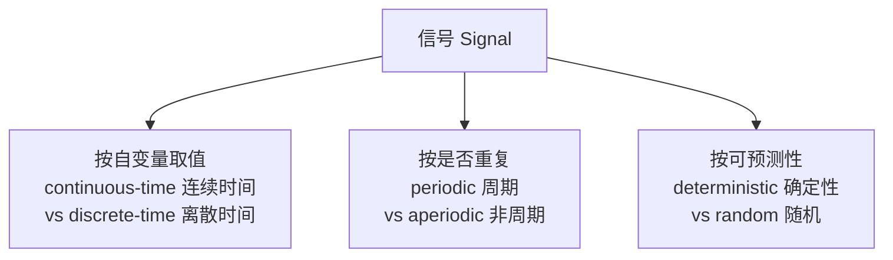
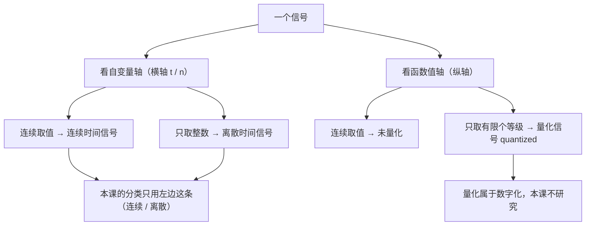
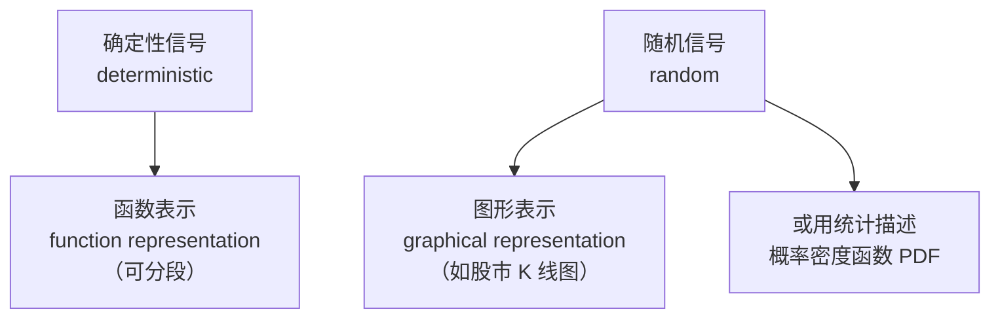
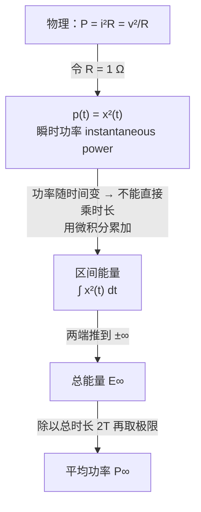
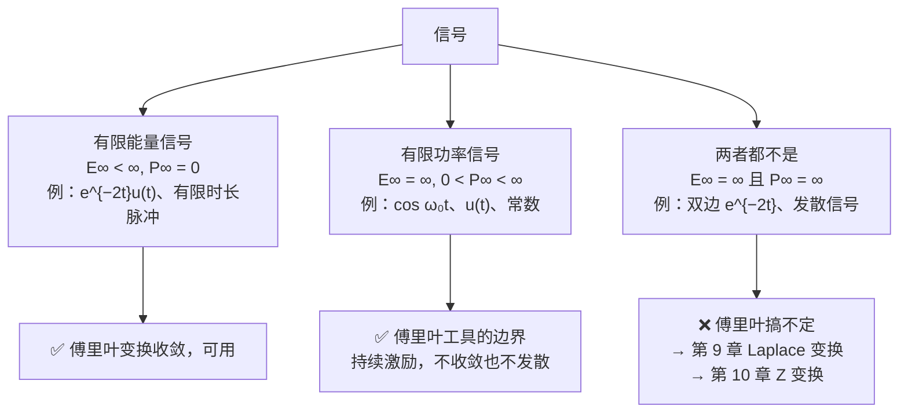

# 1.1 连续时间与离散时间信号 Continuous-time and Discrete-time Signals

> [!abstract] 本节结构
> ```mermaid
> flowchart TD
>     A["1.1 连续时间与离散时间信号"] --> B["1.1.1 举例与数学表示<br/>Examples and Mathematical Representation"]
>     A --> C["1.1.2 信号的能量与功率<br/>Signal Energy and Power"]
>     B --> B1["A. 举例 Examples"]
>     B --> B2["B. 维度与通道 Dimension & Channel"]
>     B --> B3["C. 信号的类型 Types of Signals"]
>     B --> B4["D. 信号的表示 Representation"]
>     C --> C1["从电路推出功率与能量的定义"]
>     C --> C2["连续 / 离散两套公式"]
>     C --> C3["有限能量 / 有限功率 / 两者都不是"]
>     C --> C4["这个分类为什么存在：傅里叶的适用边界"]
> ```
> [!info] 标注说明
> 标有 **（拓展）** 或 **【拓展】** 的内容，是**课堂上没有讲到、由课件和教材延伸补充**的部分。
> 复习时可先掌握未标注的主干内容，行有余力再看拓展部分。


---

## 1.1.1 举例与数学表示 Examples and Mathematical Representation

### A. 举例 Examples

> [!important] 核心命题
> **Signals are represented mathematically as functions of one or more independent variables.**
> 信号在数学上被表示为**一个或多个自变量 (independent variables) 的函数**。

#### (1) 一个简单的 RC 电路 A simple RC circuit

![[C1-RC电路示例.png]]

| 符号 Symbol | 含义 | 是不是信号 |
|---|---|---|
| $V_s(t)$ | **源电压 Source voltage** | ✅ 是 |
| $V_c(t)$ | **电容电压 Capacitor voltage** | ✅ 是 |
| $i(t)$ | **电流 Electric current** | ✅ 是 |
| $R,\ C$ | 电阻、电容 | ❌ **不是**——它们是**常数 (constant)** |

> [!warning] 哪些是信号，哪些不是
> **$R$ 和 $C$ 是常数，其余才是信号**（"$R$ and $C$ are constant, others are signals"）。
> **判据：随自变量变化的量才叫信号；不变的参数是系统的属性。**
>
> 这个区分看着简单，但在写系统方程、判断线性/时不变时是关键——比如 $y(t)=t\,x(t)$ 里那个 $t$ 是"随时间变化的增益"，就会导致时变（见 [[C1.6 系统的基本性质]]）。

> [!note] 这个例子后面还会出现（拓展）
> 在 **1.5.1 Example 1.8** 它会被写成微分方程
> $$\frac{dv_c(t)}{dt}+\frac{1}{RC}v_c(t)=\frac{1}{RC}v_s(t)$$
> 这里先只把它当作"信号从哪里来"的例子：$v_s(t)$ 是**输入信号 (input signal)**，$v_c(t)$ 是**输出信号 (output signal)**，电路本身是**系统 (system)**。

#### (2) 一辆汽车 An automobile

![[C1-汽车受力示例.png]]

| 符号 Symbol | 含义 |
|---|---|
| $f$ | 发动机提供的**驱动力 Force from engine** |
| $\rho V$ | **阻尼摩擦力 Retarding frictional force**（正比于速度，$\rho$ 为摩擦系数） |
| $V$ | **速度 Velocity** |

**这三个量都是信号，而"整辆车"就是那个系统**（the whole car is a system）。
也就是说：**输入 = 发动机的力，输出 = 车速，车本身 = 把输入变成输出的系统**——这是"系统 = 信号到信号的映射"这一定义（见 [[C1.5 连续时间与离散时间系统]]）的第一个直观例子。

> [!note] 数学上与 RC 电路同构（拓展）
> 由牛顿第二定律：$m\dfrac{dV(t)}{dt}=f(t)-\rho V(t)$，即
> $$m\frac{dV(t)}{dt}+\rho V(t)=f(t)$$
> 与 RC 电路的方程**形式完全一样**（都是一阶线性常系数微分方程）。
> **这正是"信号与系统"的威力所在**：电路、力学、经济、生物系统，只要数学模型同构，就可以用同一套工具分析。

#### (3) 语音信号 A Speech Signal — $x(t)$

![[C1-语音信号波形.png]]

- 自变量：**时间 (time)**；函数值：**声压 (acoustic pressure)**。
- **Acoustic pressure — function of time**。
- 图中标注了 200 msec 的时间尺度，并把波形按音素切分标注（sh / oul / d、w / e、ch / a、a / se）。

**完整的物理链条：**


> [!important] 记录的到底是什么
> 不是"声音"这个抽象概念，而是**大气压强随时间变化的这个函数**。
> 说话时声带振动，带动旁边空气振动，我们记录下来的就是这个空气压强的函数。

> [!note] 波形与音素的对应（拓展）
> **元音 (vowel)** 段呈现明显周期性（声带振动），**辅音 (consonant)** 段更接近噪声（如 sh、ch）。
> 这是语音识别中"分帧 + 提取频谱特征"的物理依据。

#### (4) 垂直风廓线 Vertical Wind Profile

![[C1-垂直风廓线.png]]

- **Annual average vertical wind profile as a function of height**（年平均垂直风廓线，是**高度**的函数）。
- 横轴 Height (feet) 0–1600，纵轴 Speed (knots) 0–26：**高度越高，风速越大**——站在山顶会感到风特别强。

> [!important] 关键认识
> **自变量不一定是时间！** 这里自变量是**空间高度**。
> "信号"的定义是"**携带信息的、随某个自变量变化的量**"，而不是"随时间变化的量"。

#### (5) 单色（灰度）图像 A Monochromatic Picture — $I(x,y)$

![[C1-灰度图与二值图.png]]

- 课件原句：**A monochromatic picture can be represented by brightness as a function of two spatial variables.空间变量**
- x,y表示以左上角为原点的坐标系的坐标
  单色图像可用**亮度 (brightness)** 表示，它是**两个空间变量 (two spatial variables)** 的函数。
- **灰度图 Grayscale**：函数取值 **0 ~ 255**，0 = Black（黑）（也就是00000000），255 = White（白）（也就是11111111）。
- **二值图 Binary Image**：函数的取值 **0 ~ 1**，0 = Black，1 = White。上图为标准16✖️16的二值图。

> [!note] 图像的三种基本类型
> | 类型 | 函数值范围 | 说明 |
> |---|---|---|
> | **Binary image 二值图** | **0 或 1** | 最简单的一种，0 = 黑，1 = 白 |
> | **Monochromatic image 灰度图** | **0 ~ 255（8 bit）** | 用 8 bits 表示，可分辨 **256 种不同亮度** |
> | **Color image 彩色图** | 三个通道各 0 ~ 255 | RGB 三通道叠加，见下一小节 |
>
> 图像 = **二维信号 (2-D signal)**。**8-bit 灰度**即 $2^8=256$ 级。
> 对 AI 而言：一张灰度图就是一个 $H\times W$ 的矩阵；卷积核在其上滑动做的正是本课第 2 章的**二维卷积**（严格说 CNN 做的是不翻转核的“相关”运算，见 [[C2.1 离散时间LTI系统与卷积和]] 第 9 节）。

#### (6) 彩色图像 A Color Picture (RGB) — $I(x,y)$

![[C1-彩色图像RGB三通道.png]]

$$
I(x,y)=\begin{bmatrix} I_R(x,y)\\ I_G(x,y)\\ I_B(x,y)\end{bmatrix}
$$

- 课件原句：**Three channels, two dimensional signal**（三通道、二维信号）。
- **信号的维度：** 由独立变量的个数决定
- 一张彩图 = 红 R + 绿 G + 蓝 B 三张灰度图的叠加。

#### (7) 视频 Video — $V(x,y,t)$

- **FPS (Frames Per Second)**：帧率，课件示例 **25 fps**。
- **A monochrome video（黑白视频）**：**1 channel, 3 dimensional signal**（1 通道、三维信号）
- **A color video（彩色视频）**：**3 channels, 3 dimensional signal**（3 通道、三维信号）

> [!note] 帧率没有定值
> 25 fps 只是举例，30 fps 同样常被引用。实际标准里 24 / 25 / 30 / 60 fps 都常见（电影 24、PAL 制 25、NTSC 制 30）。
> **帧率本身就是视频信号在时间轴上的采样率**——这正是采样定理在时间维的体现。

#### (8) 超声成像与激光雷达 Ultrasound Imaging & LiDAR

![[C1-超声成像与LiDAR点云.png]]

| 对象 | 数学表示 | 说明 |
|---|---|---|
| **Ultrasound reflection Imaging**（超声反射成像） | $I(x,y,d)$ | 三维空间成像，$d$ 为深度 (depth) |
| **LiDAR → 3D Point Cloud**（激光雷达 → 三维点云） | $I(x,y,d)$ | 自动驾驶的主要三维感知数据 |
| **Four dimensional color ultrasound imaging**（四维彩超） | $V(x,y,d,t)$ | 三维空间 + 时间 = 四维 |

> [!important] 深度 $d$ 是怎么测出来的：主动感知
> | | 可见光相机 | 雷达 / 超声 / 激光雷达 |
> |---|---|---|
> | 方式 | **被动**——太阳光照上去、反射回来 | **主动**——设备自己发射信号，再接收回波 |
> | 能否测距 | 单目本身不能直接测距 | **能**——由**发射到接收的时间差**算出距离 |
>
> ```mermaid
> flowchart LR
>     A["设备主动发射信号<br/>激光 / 毫米波 / 超声"] --> B["信号打到物体上"]
>     B --> C["回波返回接收器"]
>     C --> D["计算时间差<br/>→ 距离 distance / 深度 depth d"]
> ```
>
> 超声检测同理——医生正是靠它知道"病灶在多深的位置、有多大"。
> 这与 [[L01 绪论 Introduction]] 里讲自动驾驶传感器时是同一件事。

---

### B. 维度 Dimension 与通道 Channel

这两个词经常被混在各个例子里带过，但它们是两个**互不相干**的概念，必须分清。

> [!important] 唯一的判据
> $$\boxed{\ \textbf{维度 dimension} = \textbf{独立自变量 (independent variable) 的个数}\ }$$
> $$\boxed{\ \textbf{通道 channel} = \textbf{函数值的分量个数}\ }$$
> **The dimension depends on the number of its independent variable.**

#### 最容易答错的一题

**"彩色图像信号是几维信号？"**——直觉答案往往是"三维"，**正确答案是"二维"**。

- 彩色图像 $I(x,y)=[I_R,I_G,I_B]^T$ 的**自变量只有 $x,y$ 两个** → **2 维**；
- RGB 是**函数值的三个分量** → **3 个通道 (channels)**；
- **通道不增加维度。**

**同类陷阱：立体声音频。** 戴耳机时左耳和右耳听到的声音不一样（这边鼓、那边锣），那是因为音频文件有 **two channels**——但它**在维度上仍然是一维的**（自变量只有时间 $t$），只是**有两个通道**。

#### 完整对照表

| 信号 | 数学表示 | 维度 | 通道 |
|---|---|---|---|
| 语音 / 音频（单声道） | $x(t)$ | **1 维** | 1 |
| 立体声音频 | $x(t)$ | **1 维** | **2** |
| 灰度图 / 二值图 | $I(x,y)$ | **2 维** | 1 |
| 彩色图像 | $I(x,y)$ | **2 维** | **3** |
| 黑白视频 | $V(x,y,t)$ | **3 维** | 1 |
| 彩色视频 | $V(x,y,t)$ | **3 维** | **3** |
| 点云 / 三维超声 | $I(x,y,d)$ | **3 维** | 1 |
| 四维彩超 / 3D 动画 | $V(x,y,d,t)$ | **4 维** | 1 或 3 |

> [!note] 三维信号除了视频还有什么？
> **点云 point cloud**：激光雷达 / 超声成像得到的 $I(x,y,d)$，其中 **$d$ = 深度 depth**。
> 这是**真正的空间三维**（不是"两维 + 时间"）。

> [!warning] 现实中没有五维信号；"7D 影院"的 D 不是维度
> **现实里的信号顶多到 4 维**（三维空间 + 时间）。
>
> 游乐园的"7D 影院"里那个 "D"：
> - **不是信号的 dimension，更接近 channel（通道）的概念**；
> - 座椅晃动、喷水、吹风……这些是**额外的感官通道**，不是新的自变量；
> - 日常用语里这两个概念是**混用**的，科学定义里不是。
>
> **答题时必须用科学定义：维度只数自变量。**

> [!tip] 与深度学习的记号对应（拓展）
> 这与张量形状 `(C, H, W)` / `(C, T, H, W)` 的记法完全对应：**$C$ 是通道，其余是维度。**

---

### C. 信号的类型 Types of Signals

> [!important] 三组分类
> **Signals can be classified as continuous-time or discrete-time, periodic or aperiodic, deterministic or random signals.**
> 信号可分为：**连续时间 / 离散时间**、**周期 / 非周期**、**确定性 / 随机**。



#### (1) 确定性信号与随机信号 Deterministic vs Random

| | **确定性信号 Deterministic** | **随机信号 Random** |
|---|---|---|
| 能否写出函数 | **能**——可以用数学函数精确描述 | **不能**——任一时刻的取值无法事先确定 |
| 典型例子 | $\sin$、$\cos$ 这类可写成公式的信号 | **股市指数**；社会学、人文学科的各种记录数据 |
| 怎么描述它 | 直接给函数式 | 只能描述其**分布**——**概率密度函数 (PDF)**：高斯分布、泊松分布、指数分布…… |
| 常用表示方式 | **函数表示 Function Representation** | **图形表示 Graphical Representation** |

**随机信号只能描述分布，不能给出某一个时间点上的确定取值**——只能刻画整体的趋势。
这一条正好解释了后面 D 节两种表示方式的分工。

> [!note] 与概率统计课的衔接（拓展）
> 随机信号那一套（分布、概率密度函数）**正是概率论与数理统计课的内容**。
> **本课主要研究确定性信号**；随机信号的系统分析属于后续的"随机信号处理"课程。

#### (2) 连续时间信号 Continuous-time Signal

![[C1-连续时间信号.png]]

- 记作 $x(t)$，**圆括号 ( )**；自变量 $t$ 取**连续实数**，**任意一点都有函数值**。

#### (3) 离散时间信号 Discrete-time Signal

![[C1-离散时间信号-股票指数.png]]

- 记作 $x[n]$，**方括号 [ ]**；**$x[n]$: $n$ is an integer**（$n$ 是整数）。
- 典型例子：**股票指数 (stock market index)**——大盘指数**一天一个**，自然是离散的（图为 Jan. 5, 1929 – Jan. 4, 1930 的指数）。

> [!warning] 记号约定（全书通用，务必记牢）
> - **$x(t)$ 圆括号** → 连续时间 (continuous-time)，$t\in\mathbb{R}$
> - **$x[n]$ 方括号** → 离散时间 (discrete-time)，$n\in\mathbb{Z}$
>
> 离散时间信号在图上画成**杆状图 (stem plot)**——只有整数点有值，点与点之间**没有定义**（不是 0，是"不存在"）。
>
> 本课坚持这套规范；但**很多试卷和课本不规范、可能都用圆括号**，看别的资料时要靠上下文判断。

#### (4) 从连续到离散：采样过程


以手机录音为例：每隔 0.01 秒记录一个点，第一个点是 $x[1]$，第二个点是 $x[2]$……**把时间戳拿掉之后，它就成了一个序列**。

> [!important] $x[n]$ 里的 $n$ 不是时间
> 它是**第几个样本点的序号**——时间信息已经被"归一化"掉了（隐含在采样间隔里）。
> **这就是为什么 $n$ 必须是整数。**

> [!note] 信号的三段进化：连续 → 离散 → 数字
> $$\text{连续信号 continuous}\ \longrightarrow\ \text{离散信号 discrete}\ \longrightarrow\ \text{数字信号 digital}$$
> **数字信号之前先是离散信号**，两者不是一回事：
>
> - **离散化**：只在自变量（时间）轴上取点 → **采样 sampling**
> - **数字化**：再把每个点的**取值**也变成有限个等级 → **量化 quantization**（见下）
>
> **本课研究的是"连续 vs 离散"这一层，不研究量化。**

#### (5) 量化信号 Quantized Signal

> [!question] 一道用来检验判据的题
> 给一个信号：**横轴 $t$ 上任意一点都有函数值**（不是杆状图），
> 但**函数值只取整数 1, 2, 3, 4…**（呈阶梯状）。
>
> **问：这是连续时间信号还是离散时间信号？**

> [!important] 答案与判据
> **它仍然是连续时间信号 (continuous-time signal)。**
>
> **本课的"连续 / 离散"只看自变量轴，不看函数值轴。**
> - 这个信号的 $t$ **可以取任意值、处处有定义** → **连续时间**。
> - 它的**函数值被限制成整数**，这叫另一件事：**量化 (quantization)**，得到的是**量化信号 (quantized signal)**。



**什么是量化、为什么要量化：**

- **量化（Quantization）**：在幅度（取值）上离散化——把采样得到的值，四舍五入到有限个"格子"里，纵轴从连续变离散。比如记录气温的时候只记录整数气温。注意和采样的区别——采样是离散采集自变量。
- 再举一例：记录人耳听到的声音，把**最小的（听不见的）声音记作 0**，把**最大的声音记作某个上限**，中间**分成若干等级**。
- **为什么要这么做**：**为了数字化、为了计算机能处理**。计算机只能用 0/1 序列存储，所以量化等级数一般取 **$2^n$**——比如 $2^8=256$ 级（**8 bit**），正好对应灰度图 0~255。

> [!tip] 顺带一问：为什么电子计算机是 0/1，而量子计算不是？
> - **电子只有两个状态**：激活态 / 未激活态 → 所以一个比特只能是 **0 或 1**。
> - **量子不一样**：光量子等有**自旋 (spin)**，有左旋、右旋之分 → 状态不止两个，所以量子计算**不是 0/1 的二值体系**。
> - **0/1 是电子时代的产物**，量子时代的计算方式会完全不同。

> [!warning] 必须分清的三个词
> | 概念 | 作用在哪个轴 | 结果 |
> |---|---|---|
> | **采样 Sampling** | **自变量轴（时间）** | 连续时间 → 离散时间 |
> | **量化 Quantization** | **函数值轴（幅度）** | 连续取值 → 有限等级 |
> | **编码 Coding** | — | 把量化等级写成 0/1 码字 |
>
> **采样 + 量化 + 编码 = 数字化 (digitization)。本课只研究采样这一层。**

---

### D. 信号的表示 Representation

#### (1) 函数表示 Function Representation

$$x(t)=\cos\omega_0 t \qquad\qquad x(t)=e^{\,j\omega_0 t}$$

函数可以是**线性的、非线性的、甚至分段的**——不一定是单个解析式，可能是分段的好几个函数（比如阶梯波每一段是一个常数值）。

#### (2) 图形表示 Graphical Representation

前面所有的波形图、图像、点云都是图形表示。

#### (3) 两种表示分别服务于哪类信号



**能写公式的就写公式，写不出公式的就画图或给分布。**

> [!note] 两种表示的分工（拓展，从做题角度）
> **函数表示**便于代数运算与推导；**图形表示**便于直观理解变换（时移、时反、尺度变换在图上一眼看得出）。
> 考试中"画出 $x(6-2t)$ 的波形"这类题（见 [[C1.2 自变量的变换]]），就是要求在两种表示之间自由切换。

---

## 1.1.2 信号的能量与功率 Signal Energy and Power

### A. 定义是怎么来的：从电路推出来

这两个定义不是凭空规定的，而是从**物理上最基本的电路**衍生出来的。

**第一步：功率来自物理。**
取一个最简单的电路：一个电压源 $v(t)$ 接一个电阻 $R=1\,\Omega$，电流为 $i(t)$。物理课学过的功率公式：

$$p(t)=v(t)\cdot i(t)=\frac{1}{R}v^{2}(t)=R\cdot i^{2}(t)$$

**令 $R=1\,\Omega$**（归一化电阻 normalized resistance），此时 $v(t)=i(t)$——**整个电路里其实只有一个信号**，统一记作 $x(t)$：

$$\boxed{\ p(t)=i^{2}(t)=v^{2}(t)=x^{2}(t)\ }$$

即 **信号的功率 = 信号的平方**。

> [!note] 为什么可以令 $R=1\,\Omega$？
> 因为信号处理关心的是**信号本身**，不是具体电路。取 $R=1\,\Omega$ 后，"功率"就统一定义为 $x^2(t)$，与信号的物理身份（电压？电流？声压？）无关。
> 这叫做 **归一化功率 (normalized power)**，是一种约定，不是物理事实。

**第二步：这个功率随时间变化 → 所以叫"瞬时功率"。**
$p(t)$ 是 $t$ 的函数，因此称为 **instantaneous power（瞬时功率）**。

**第三步：能量 = 功率对时间累加。**
物理上"做功 = 功率 × 时长"，但这里功率**是变化的**，不能直接乘，必须**累加**——这就用到**微积分**：在极短的时间内可以认为功率是常数 → 微元 $p(t)\,dt$ → 积分。



### B. 连续时间的能量与功率 Energy & Power (Continuous-time)

| 量 Quantity | 公式 |
|---|---|
| **瞬时功率 Instantaneous power** | $p(t)=x^2(t)$ |
| **区间 $t_1\le t\le t_2$ 上的能量 Energy** | $\displaystyle\int_{t_1}^{t_2}p(t)\,dt=\int_{t_1}^{t_2}v^{2}(t)\,dt=\int_{t_1}^{t_2}x^{2}(t)\,dt$ |
| **总能量 Total Energy** | $\displaystyle E_{\infty}=\lim_{T\to\infty}\int_{-T}^{T}x^{2}(t)\,dt$ |
| **平均功率 Average Power** | $\displaystyle P_{\infty}=\lim_{T\to\infty}\frac{1}{2T}\int_{-T}^{T}x^{2}(t)\,dt$ |

> [!note] 为什么积分要从 $-\infty$ 到 $+\infty$（负时间存在吗）
> - **工程里没有负时间**——实际做实验时，开始的那一刻就是 0 时刻，时间往后算。
> - **但数学上一个完整的表达是有负时间的**——相对于"当前时刻"，历史就是负时间。
>
> 所以总能量定义成两端都推向无穷。**遇到只在 $t\ge0$ 有定义的信号（带 $u(t)$ 的），负半轴自然贡献 0，不影响。**

> [!important] 平均功率就是"总做功 ÷ 总时长"
> $$\text{平均功率}=\frac{\text{总做功}}{\text{总时长}}=\frac{\displaystyle\int_{-T}^{T}x^2(t)\,dt}{2T}$$
> 区间 $[-T,T]$ 的**长度是 $2T$**，所以分母是 $2T$；再让 $T\to\infty$ 就得到 $P_\infty$。
> **记住这个来源，就再也不会写错分母。**

> [!tip] 对复信号的推广（拓展，后续章节要用）
> 若 $x(t)$ 为**复信号 (complex-valued)**，上式中的 $x^2$ 必须换成 $|x|^2$：
> $$E_\infty=\lim_{T\to\infty}\int_{-T}^{T}|x(t)|^{2}dt,\qquad P_\infty=\lim_{T\to\infty}\frac{1}{2T}\int_{-T}^{T}|x(t)|^{2}dt$$
> 因为能量必须是**非负实数**，而 $x^2$ 对复数可能是负的。

### C. 离散时间的能量与功率 Energy & Power (Discrete-time)

| 量 Quantity | 公式 |
|---|---|
| **瞬时功率 Instantaneous power** | $p[n]=x^{2}[n]$ |
| **区间 $n_1\le n\le n_2$ 上的能量** | $\displaystyle E=\sum_{n=n_1}^{n_2}x^{2}[n]$ |
| **总能量 Total Energy** | $\displaystyle E_{\infty}=\sum_{n=-\infty}^{\infty}x^{2}[n]$ |
| **平均功率 Average Power** | $\displaystyle P_{\infty}=\lim_{N\to\infty}\frac{1}{2N+1}\sum_{n=-N}^{N}x^{2}[n]$ |

> [!warning] 分母为什么是 $2N+1$ 而不是 $2N$？
> **① 为什么是 $2N+1$：** 离散求和是**闭区间**，把 $-N$ 和 $N$ 两个端点**都算进去了**，所以共 $N-(-N)+1=2N+1$ **个点**。
> 连续那边积分算的**不是端点个数而是区间长度**——长度就是 $2T$。
>
> **⇒ 离散数点个数，连续量长度。**
>
> **② 但计算上加不加这个 1 无所谓：** 因为
> $$\lim_{N\to\infty}\frac{S_N}{2N+1}=\lim_{N\to\infty}\frac{S_N}{2N}$$
> 极限对常数项不敏感。**写公式时要严格写 $2N+1$，但算极限时不必纠结。**

> [!tip] 微积分的本质：连续与离散是同一件事的两种写法
> **微积分其实就是"连续"的一种离散化表达**——本质上是把一个**求和符号变成了积分符号**。二者是**平行**的概念：
>
> | 连续 | 离散 |
> |---|---|
> | 积分 $\int$ | 求和 $\sum$ |
> | 微分 $\dfrac{d}{dt}$ | 差分 $x[n]-x[n-1]$ |
> | 冲激 $\delta(t)$ | 单位样值 $\delta[n]$ |（已讲授，见 1.4 节）
> | 卷积积分 | 卷积和 |（已讲授，见 [[C2.2 连续时间LTI系统与卷积积分]]、[[C2.1 离散时间LTI系统与卷积和]]）
>
> 这是理解本课"连续 / 离散并行讲"的钥匙。

### D. 有限能量信号与有限功率信号 Finite Energy and Finite Power Signal

> [!important] 定义
> **有限能量信号 Finite Energy Signal**（此时 $P\to 0$）：
> $$E=\int_{-\infty}^{+\infty}x^{2}(t)\,dt<+\infty \qquad\text{或}\qquad E=\sum_{n=-\infty}^{+\infty}x^{2}[n]<+\infty$$
>
> **有限功率信号 Finite Power Signal**（此时 $E\to\infty$）：
> $$P=\lim_{T\to\infty}\frac{1}{2T}\int_{-T}^{T}x^{2}(t)\,dt<+\infty \qquad\text{或}\qquad P=\lim_{N\to\infty}\frac{1}{2N+1}\sum_{n=-N}^{N}x^{2}[n]<+\infty$$

#### 四个例子：判别方法的标准示范

> [!example] 例 1：$x(t)=\cos(\omega_0 t)$ —— **功率信号**
> 1. 能量要把信号**取平方** → $\cos^2\omega_0 t$，平方后**没有负值了**（相当于把负半部分"翻上去"）。
> 2. 再**积分**——**积分就是求面积**。
> 3. 这个不断振荡、永不衰减的波形，面积一路累加 → **$E_\infty=\infty$**。
> 4. 但**平均功率**：因为它是**周期信号**，**在一个周期上算能量除以该周期长度**，结果与整个信号的平均功率**相同** → 得到**有限值** $\frac12$。
>
> **⇒ 无穷能量、有限功率 ⇒ 功率信号。**
>
> 这个技巧值得记住：**周期信号求平均功率，只需在一个周期上算**，不必真的取极限。

> [!example] 例 2：有限时长的矩形波（如 $-2\le t\le 2$ 上取值 1，其余为 0）—— **能量信号**
> 平方后仍是那个矩形，**积分 = 有限面积** → $E_\infty<\infty$ ⇒ **能量信号**。

> [!example] 例 3：$x(t)=e^{-2t}u(t)$（单边衰减指数）—— **能量信号**
> - 因为有 $u(t)$，$t<0$ 部分**全是 0**。
> - 平方后是 $e^{-4t}$，从 0 积到 $\infty$：
> $$E_\infty=\int_0^\infty e^{-4t}\,dt=\frac14<\infty$$
> - 直观上：这块面积**比同底同高的三角形还小**，右侧迅速衰减趋于 0，**面积是有限的**。
>
> **⇒ 能量信号。**

> [!example] 例 4：$x(t)=e^{-2t}$，$t$ 从 $-\infty$ 到 $+\infty$（**双边**，没有 $u(t)$）—— **两者都不是**
> 这个信号**左边"开着大口"**：
> - 当 $t\to-\infty$ 时 $e^{-2t}\to+\infty$，是**指数增长**的。
> - **能量**：平方后再积分 → **无穷大**。
> - **平均功率**：分子是**指数增长**的积分，分母只是**线性**的 $2T$。**指数增长远快于线性增长** → 极限仍是**无穷大**。
>
> **⇒ $E_\infty=\infty$ 且 $P_\infty=\infty$ ⇒ 既不是能量信号，也不是功率信号。**

> [!warning] 例 3 vs 例 4：只差一个 $u(t)$
> 这正是下面随堂测 Q2 与 Q3 考的那个点。
> **看到指数信号，第一件事永远是确认它是单边还是双边。**

#### 三条必须掌握的性质

> [!important] 性质一：有限能量 ⇒ 平均功率必为 0
> $$P_\infty=\lim_{T\to\infty}\frac{E_\infty}{2T}=\frac{\text{有限值}}{\infty}=0$$
> **有限值除以无穷长的时间，结果一定是 0。**

> [!important] 性质二：「有限功率信号」有一个隐含条件 $P_\infty\neq 0$
> $$\boxed{\ \textbf{有限功率信号：}\ 0<P_\infty<\infty\ }$$
>
> **为什么要加这个条件？** 否则能量信号（$P_\infty=0$）也满足"功率有限"，两类就重叠了。

> [!important] 性质三：两类信号没有交集
> - 设某信号的平均功率 $P_\infty$ 是**非零有限值**；
> - 那么它在 $[-T,T]$ 上的能量约为 $P_\infty\times 2T$；
> - 时间长度 $2T\to\infty$，非零的 $P_\infty$ 乘以无穷长时间 → **$E_\infty=\infty$**。
>
> **⇒ 非零有限功率的信号，总能量必定无穷 ⇒ 它一定不是能量信号。两类互斥。**

#### 但这不是二分类——还有第三类

本节其他分类都是二分类，唯独这一组不是：

| 分类 | 是不是二分类 |
|---|---|
| 确定性 / 随机 | ✅ 是（除了随机就是确定） |
| 周期 / 非周期 | ✅ 是 |
| 连续时间 / 离散时间 | ✅ 是 |
| **有限能量 / 有限功率** | ❌ **不是**——**还有"两者都不是"的第三类** |

> [!important] 三类信号的判别流程（拓展：归纳整理）
> ```mermaid
> flowchart TD
>     X["给定信号 x(t) 或 x[n]"] --> Q1{"E 有限?"}
>     Q1 -- "是" --> A["能量信号 Energy Signal<br/>E &lt; ∞ , P = 0<br/>典型：脉冲、衰减指数（单边）"]
>     Q1 -- "否 (E = ∞)" --> Q2{"P 有限且非零?"}
>     Q2 -- "是" --> B["功率信号 Power Signal<br/>E = ∞ , 0 &lt; P &lt; ∞<br/>典型：周期信号、常数、阶跃"]
>     Q2 -- "否 (P = ∞)" --> C["既非能量信号也非功率信号<br/>典型：发散信号如 e^t, t·u(t)"]
> ```
>
> - **上下有界周期信号一定是功率信号**（能量随时间无限累积，但每周期平均功率固定）。
> - **持续时间有限且幅度有限的信号一定是能量信号**。
> - **发散信号**（如 $e^{-t}$ 在 $t\to-\infty$ 时爆炸）两者都不是。

### E. 为什么要这样给信号分类？——傅里叶的适用边界

这个分类不是随手做的，**它和后面的傅里叶变换有直接关系**：

**这个分类划出的正是傅里叶工具的适用边界。**



| 信号类别 | 傅里叶能不能用 | 原因 |
|---|---|---|
| **有限能量信号** | ✅ **可以** | 其傅里叶变换**收敛** |
| **有限功率信号** | ✅ **可以（边界）** | 这类是**持续激励信号**——**既不收敛也不发散**，一直保持同样幅度的波动。**傅里叶工具的可用边界就到这里** |
| **两者都不是（发散）** | ❌ **不行** | 傅里叶变换处理不了，**无法分析它的频谱** → 要用 Laplace / Z 变换 |

> [!warning] 一个容易忽略的反例
> 即使把发散指数**截成单边**——
> $$x(t)=e^{2t}u(t)\quad(t>0\ \text{时指数增长})$$
> **总能量仍然是无穷大**，所以**傅里叶变换照样不行，但拉普拉斯变换可以**（第 9 章）。
> **加 $u(t)$ 只能砍掉一半，救不了本身发散的信号。**

> [!tip] 一句话记住
> **这个分类不是为了分类而分类，而是在回答："我手上这个信号，能不能用傅里叶？"**
> 这也呼应了 [[L01 绪论 Introduction]] 里"为什么学完傅里叶还要学 Laplace 和 Z 变换"。

---

## 随堂测 In-class Quiz（含答案）

> [!question] Q1. Signal $x(t)=\cos(\omega_0 t)$ is
> A. A finite energy signal
> **B. A finite power signal ✅**
> C. Neither a finite energy signal nor a finite power signal
> D. Not only finite energy but also finite power
>
> **解析**：余弦是周期信号，在整个时间轴上永不衰减 ⇒ $E_\infty=\infty$。
> 平均功率 $P_\infty=\lim_{T\to\infty}\frac{1}{2T}\int_{-T}^{T}\cos^{2}\omega_0 t\,dt=\frac{1}{2}$（利用 $\cos^2\theta=\frac{1+\cos2\theta}{2}$，交流项平均为 0）。
> 有限非零功率 ⇒ **功率信号**。即上面的**例 1**。

> [!question] Q2. Signal $x(t)=e^{-t}$ is
> A. A finite energy signal
> B. A finite power signal
> **C. Neither a finite energy signal nor a finite power signal ✅**
> D. Not only finite energy but also finite power
>
> **解析**：注意**没有 $u(t)$**，所以 $t$ 从 $-\infty$ 到 $+\infty$ 全都存在。
> 当 $t\to-\infty$ 时 $e^{-t}\to+\infty$，爆炸式增长。
> $E_\infty=\int_{-\infty}^{\infty}e^{-2t}dt=\infty$；$P_\infty=\lim_{T\to\infty}\frac{1}{2T}\int_{-T}^{T}e^{-2t}dt=\lim_{T\to\infty}\frac{e^{2T}-e^{-2T}}{4T}=\infty$。
> **两者都无限 ⇒ 既非能量信号也非功率信号。** 即上面的**例 4**。

> [!question] Q3. Signal $x(t)=e^{-t}u(t)$ is
> **A. A finite energy signal ✅**
> B. A finite power signal
> C. Neither a finite energy signal nor a finite power signal
> D. Not only finite energy but also finite power
>
> **解析**：$u(t)$是单位阶跃信号，t大于0时，取值1；小于0时，取值0。
> 它把信号截断为**单边 (right-sided)**，只在 $t\ge0$ 存在。
> $$E_\infty=\int_{0}^{\infty}e^{-2t}dt=\left[-\tfrac{1}{2}e^{-2t}\right]_0^{\infty}=\frac{1}{2}<\infty$$
> 有限能量 ⇒ **能量信号**，且 $P_\infty=0$。即上面的**例 3**。

> [!warning] Q2 vs Q3 是本节最经典的陷阱
> 差别只在一个 $u(t)$。**看到指数信号，第一件事是确认它是双边还是单边。**
> （$u(t)$ 的完整定义见 [[C1.4 单位冲激与单位阶跃函数]]。）

---

## 本节自测 Self-Test

**信号的描述与分类**

> [!question] 1. 为什么说"信号是自变量的函数"，而不是"时间的函数"？
> **A**：自变量不必是时间。垂直风廓线的自变量是**高度**，图像的自变量是**两个空间坐标 $(x,y)$**。信号的本质是"随某自变量变化并携带信息的量"。

> [!question] 2. RC 电路里哪些是信号、哪些不是？
> **A**：$v_s(t),v_c(t),i(t)$ 是信号；**$R$、$C$ 是常数，不是信号**。判据：随自变量变化的才是信号。

> [!question] 3. 彩色图像是几维信号？彩色视频呢？立体声音频呢？
> **A**：彩色图像 **2 维 3 通道**（自变量只有 $x,y$）；彩色视频 **3 维 3 通道**；立体声音频 **1 维 2 通道**。**维度只数自变量，通道数函数值分量。**

> [!question] 4. 举一个真正的三维信号（不是"二维 + 时间"）。深度 $d$ 怎么测出来？
> **A**：**点云 / 三维超声成像 $I(x,y,d)$**。$d$ 由**主动发射信号、测回波时间差**得到（激光雷达、毫米波雷达、超声）；可见光相机是被动成像，本身不测距。

> [!question] 5. 现实中有五维信号吗？"7D 影院"的 D 是什么？
> **A**：没有，现实信号最多到 4 维（三维空间 + 时间）。"7D 影院"的 D **不是 dimension 而是 channel**（座椅晃动、喷水、吹风等额外感官通道），是日常用语的混用。

> [!question] 6. $x(t)$ 与 $x[n]$ 的记号区别是什么？
> **A**：圆括号 = 连续时间，$t$ 取实数；方括号 = 离散时间，$n$ 取整数。离散信号在非整数点**未定义**（不是等于 0）。$x[n]$ 里的 $n$ 是**样本序号**，不是时间。

> [!question] 7. 横轴 $t$ 连续、纵轴只取整数的信号，是连续还是离散信号？
> **A**：**连续时间信号**。本课的连续/离散**只看自变量轴**。纵轴只取有限等级叫**量化**，得到的是**量化信号**，属于数字化范畴，本课不研究。

> [!question] 8. 采样、量化、编码分别作用在哪里？
> **A**：**采样**作用在自变量（时间）轴，连续→离散；**量化**作用在函数值（幅度）轴，连续取值→有限等级；**编码**把等级写成 0/1 码字。三者合起来是数字化。

> [!question] 9. 确定性信号和随机信号分别适合用哪种表示？
> **A**：确定性信号 → **函数表示**（可分段）；随机信号 → **图形表示**，或用**概率密度函数**描述分布。

**能量与功率**

> [!question] 10. 能量与功率的定义是怎么从物理来的？
> **A**：从 $R=1\,\Omega$ 的电路出发，$P=i^2R=v^2/R\Rightarrow p(t)=x^2(t)$（瞬时功率）；功率随时间变化，不能直接乘时长，用微积分累加得能量 $\int x^2dt$；平均功率 = 总做功 ÷ 总时长 $2T$。

> [!question] 11. 为什么定义能量时要令 $R=1\,\Omega$？
> **A**：为了把"功率"归一化成 $x^2$，使定义与信号的物理量纲无关。这是**约定 (convention)**，称为归一化功率。

> [!question] 12. 离散平均功率的分母为什么是 $2N+1$？这个 1 影响计算吗？
> **A**：$-N\le n\le N$ 是闭区间，共有 $2N+1$ 个整数点（含 $n=0$）；连续情形用区间长度 $2T$。**计算极限时这个 1 不影响结果**，但公式要严格写。

> [!question] 13. 能量信号与功率信号可以同时成立吗？
> **A**：不能（零信号除外）。$P_\infty=\lim \frac{E_\infty}{2T}$，$E_\infty$ 有限 ⇒ $P_\infty=0$；$P_\infty$ 非零有限 ⇒ $E_\infty=\infty$。

> [!question] 14. "有限功率信号"的完整定义是什么？为什么要加那个隐含条件？
> **A**：$0<P_\infty<\infty$。必须**排除 $P_\infty=0$**，否则能量信号也满足"功率有限"，两类会重叠。

> [!question] 15. 给出三类信号各一个典型例子。
> **A**：能量信号 $e^{-t}u(t)$、矩形脉冲；功率信号 $\cos\omega_0t$、$u(t)$、常数；两者都不是 $e^{-t}$（双边）、$t\,u(t)$。

> [!question] 16. 为什么课本要在这里做能量/功率分类？
> **A**：**它划出的正是傅里叶工具的适用边界**——有限能量信号傅里叶变换收敛；有限功率信号是可用的边界（持续激励，不收敛也不发散）；两者都不是的发散信号傅里叶搞不定，必须用第 9 章 Laplace、第 10 章 Z 变换。

> [!question] 17. $e^{2t}u(t)$（单边但指数增长）能用傅里叶变换吗？
> **A**：**不能**。虽然截成了单边，但总能量仍是无穷大。它属于"两者都不是"的第三类，要用**拉普拉斯变换**。

---

## 相关笔记 Related Notes

- [[信号与系统 MOC]]
- 上一节：[[L01 绪论 Introduction]]
- 下一节：[[C1.2 自变量的变换]]
- 相关：[[C1.4 单位冲激与单位阶跃函数]]（$u(t)$ 的完整定义）、[[C1.5 连续时间与离散时间系统]]（系统的定义）
