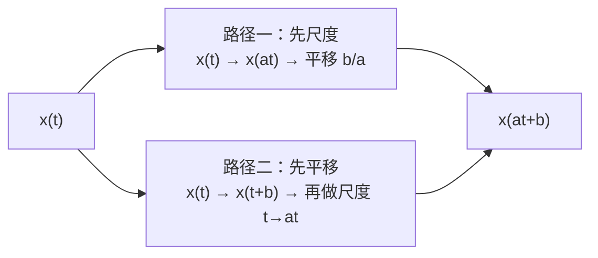
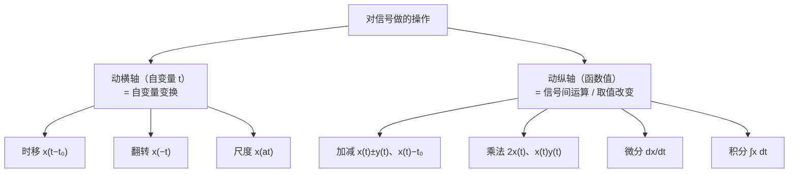
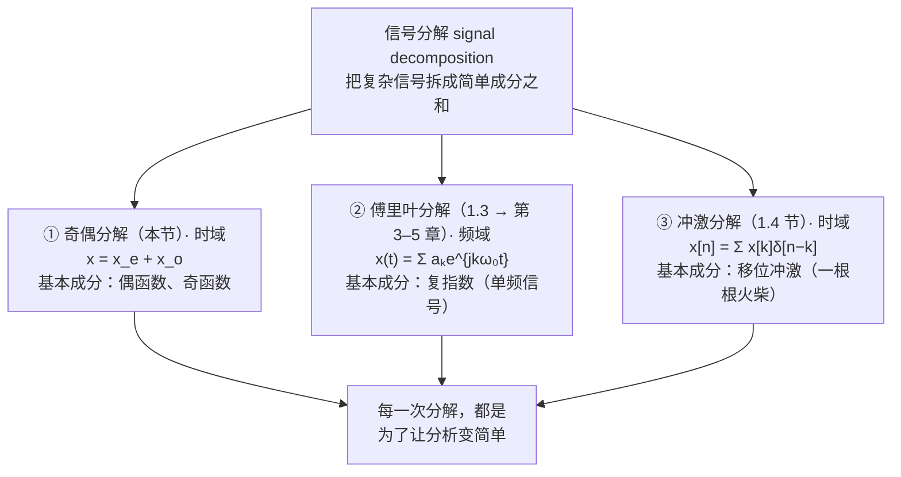

# 1.2 自变量的变换 Transformations of the Independent Variable

> [!abstract] 本节结构
> ```mermaid
> flowchart TD
>     A["1.2 自变量的变换"] --> B["1.2.1 变换举例<br/>Examples of Transformations"]
>     A --> C["1.2.2 周期信号<br/>Periodic Signals"]
>     A --> D["1.2.3 奇信号与偶信号<br/>Even and Odd Signals"]
>     B --> B1["A. 时移 Time Shift"]
>     B --> B2["B. 时间反转 Time Reversal"]
>     B --> B3["C. 尺度变换 Time Scaling"]
>     B --> B4["D. 例题：画 x(6−2t)"]
>     C --> C1["离散周期性条件的推导"]
>     D --> D1["奇偶分解 = 第一个"信号分解"概念"]
> ```
> [!info] 标注说明
> 标有 **（拓展）** 或 **【拓展】** 的内容，是**课堂上没有讲到、由课件和教材延伸补充**的部分。
> 复习时可先掌握未标注的主干内容，行有余力再看拓展部分。


> [!important] 什么叫"自变量的变换"？
> 只改动函数括号里的自变量 $t$（或 $n$），**不改动函数值本身**。
> 形如 $x(t)\to x(at+b)$ 的都是自变量变换；而 $x(t)+y(t)$、$3x(t)$、$\frac{dx}{dt}$、$\int x\,dt$ **不是**——它们作用在函数值上。
> （这正是本节随堂测第 1 题的考点，下面会给出两组"长得很像"的对照例子。）

---

## 1.2.1 变换举例 Examples of Transformations

### A. 时移 Time Shift（设 $t_0>0,\ n_0>0$）

![[C1-时移-离散与连续.png]]

| 变换 | 连续时间 | 离散时间 | 英文名 |
|---|---|---|---|
| **右移 Right shift** | $x(t-t_0)$ | $x[n-n_0]$ | **Delay（延迟）** |
| **左移 Left shift** | $x(t+t_0)$ | $x[n+n_0]$ | **Advance（超前）** |

> [!warning] 最容易记反的地方
> **减号 → 右移（延迟）**，**加号 → 左移（超前）**。
>
> **为什么？** 因为看的是"什么时候取到原来 $t=0$ 处的值"。
> 对 $y(t)=x(t-t_0)$，令 $t-t_0=0\Rightarrow t=t_0$：原来在 $t=0$ 的那个值，现在出现在 $t=t_0$，即**往右挪了 $t_0$**。
>
> 离散情形完全一样：原来在 $n=0$ 的那个值，右移之后**要到 $n_0$ 点才出现**——所以 $x[n-n_0]$ 称为原信号的 **delayed version（延迟版本）**；往左移则得到 **advanced version（超前版本）**。

### B. 时间反转 Time Reversal

![[C1-时间反转.png]]

> [!important] 定义
> $x(-t)$ 或 $x[-n]$：$x(t)$ 或 $x[n]$ 的 **Reflection（反射/镜像）**，即绕 **$t=0$（$n=0$）这条竖线**翻转。

时间反转相当于"**把录音倒着放**"。
注意它是关于 **$t=0$ 这条竖线**镜像（像照镜子一样沿这条轴翻过去），**不是**关于原点旋转。

### C. 尺度变换 Time Scaling

![[C1-尺度变换.png]]

> [!important] 定义（课件只讨论 $a>0$）
> $$x(at),\quad a>0$$
> - **$a>1$：Compressed（压缩）** —— 信号在时间轴上被挤窄
> - **$a<1$：Stretched（拉伸）** —— 信号在时间轴上被拉宽
>
> 课件图示：$x(t)\ \to\ x(2t)$（压缩一半宽）$\ \to\ x(t/2)$（拉伸一倍宽）。

> [!warning] 又一个容易记反的点
> $a=2$ 时**变窄**而不是变宽。
>
> **为什么？** $y(t)=x(2t)$，要取到原来 $x(t_1)$ 的值需要 $2t=t_1\Rightarrow t=t_1/2$。**所有时刻坐标都除以 2 ⇒ 波形挤到原来一半宽。**
> 具体地：原来在 $t=1$ 的那个值，在 $x(2t)$ 里跑到了 $t=1/2$。
>
> 口诀：**括号里乘几，波形就窄几倍。**

#### 直观例子：语音倍速播放

![[C1-语音倍速播放示例.png]]

> [!example] 课件示例
> 一段语音 $x(t)$（内容为中文"**对了**"），**Sampling rate = 22050 Hz**。三个版本用**同样的采样率**播放：
> - $x(t)$：原速播放
> - $x(2t)$：**is played at twice of the speed**（两倍速，**时间轴变短、播放时长跟着变短**）
> - $x(t/2)$：半速播放（时长加倍）
>
> 图中波形横轴为 0–0.4 s，纵轴幅度 ±0.5。

**但不止是快慢——音色也变了。** 三段音频对比着听，半速播放时**音色明显改变**：

> [!note] 为什么倍速播放会变调？（公式部分为拓展）
> 因为**频率成分变了**：信号在时域上的展缩，会让它的**频谱发生相应改变**。完整解释要到**第 7 章采样**之后才能给出。
>
> 这就是第 4 章要证明的**傅里叶变换尺度性质 (scaling property)**：
> $$x(at)\ \longleftrightarrow\ \frac{1}{|a|}X\!\left(\frac{j\omega}{a}\right)$$
> **时域变窄 ⇔ 频域变宽**，这是本课贯穿始终的**时频对偶 (time-frequency duality)**。
>
> 现代播放器的"变速不变调"是靠额外算法（如相位声码器）把音调改回去的，不是简单的 $x(at)$。

---

### D. 例题：画出 $x(6-2t)$ 的波形

> [!example] 题目
> **[Example]** The signal $x(t)$ is given by the following figure, please depict the signal $x(6-2t)$.
> 已知 $x(t)$：在 $-2\le t\le 0$ 上恒为 1，在 $0\le t\le 3$ 上从 1 线性降到 0，其余为 0。

这道题值得做**两遍**：一遍按中学的标准做法，一遍故意"反着来"。**两遍的用意不同**——第一遍是解题，第二遍是讲清"自变量变换"这个概念本身。

#### 解法一：先尺度 → 再反转 → 再右移（高中标准做法）

![[C1-例题x(6-2t)-解法一.png]]

$$
x(t)\ \xrightarrow{\ \text{scaling}\ }\ x(2t)\ \xrightarrow{\ \text{reversal}\ }\ x(-2t)\ \xrightarrow{\ \text{right shift }3\ }\ x[-2(t-3)]=x(6-2t)
$$

| 步骤 | 结果 | 波形关键点 |
|---|---|---|
| 原信号 $x(t)$ | — | 台阶段 $[-2,0]$ 高 1；斜边 $0\to3$ 降到 0 |
| **尺度 scaling** $x(2t)$ | 横坐标全部 **÷2** | 台阶 $[-1,0]$；斜边 $0\to1.5$ |
| **反转 reversal** $x(-2t)$ | 关于纵轴镜像 | 斜边 $-1.5\to0$ 升到 1；台阶 $[0,1]$ |
| **右移 3** $x[-2(t-3)]$ | 横坐标全部 **+3** | 斜边 $1.5\to3$ 升到 1；台阶 $[3,4]$ |

> [!warning] 最关键的一步：右移量为什么是 3 而不是 6？
> 必须先把式子写成 **$x[a(t-t_0)]$** 的标准形式：
> $$x(6-2t)=x\bigl[-2t+6\bigr]=x\bigl[-2(t-3)\bigr]$$
> 括号里提出 $-2$ 之后，才能读出**右移 3**。
> 如果直接看 "$+6$" 就写成移 6，就错了。**位移量 = 常数 ÷ 尺度因子的绝对值。**

#### 解法二：先左移 → 再反转 → 再尺度（概念导向的做法）

![[C1-例题x(6-2t)-解法二.png]]

$$
x(t)\ \xrightarrow{\ \text{left shift }6\ }\ x(t+6)\ \xrightarrow{\ \text{reversal}\ }\ x(-t+6)\ \xrightarrow{\ \text{scaling}\ }\ x(-2t+6)
$$

这个顺序和中学教的**正好相反**，中学一般不会这样教——因为容易搞混。但它能把 **transformation of independent variable 到底是什么意思**讲清楚。

> [!important] 核心方法：每一步只问"$t$ 被换成了什么"
> 这是本节最值钱的一句话。
>
> | 从 → 到 | $t$ 被换成了什么 | 所以是什么变换 |
> |---|---|---|
> | $x(t)\to x(t+6)$ | $t\ \to\ t+6$ | **左移 6** |
> | $x(t+6)\to x(-t+6)$ | $t\ \to\ -t$ | **翻转**（沿 $t=0$ 轴） |
> | $x(-t+6)\to x(-2t+6)$ | $t\ \to\ 2t$ | **压缩 2 倍** |
>
> 每一步**唯一发生的事**就是括号里的 $t$ 被换掉了：换成 $-t$ 就只是翻转，换成 $2t$ 就只是压缩，没有别的。
>
> **⇒ 判断变换类型的唯一动作：把前后两个表达式的自变量对齐，看 $t$ 被替换成了什么。**

**逐点验算（可以自己复核一遍）**——原信号关键点：$-2,\ 0,\ 3$

| 步骤 | 变换 | 关键点变化 | 验算 |
|---|---|---|---|
| ① | $x(t)\to x(t+6)$，**左移 6** | $-2,0,3\ \to\ -8,-6,-3$ | 每个点 $-6$ |
| ② | $\to x(-t+6)$，**翻转** | $-8,-6,-3\ \to\ 3,6,8$ | 验算：原来 $t=-3$ 的点，$-3+6=3$，所以到了 $t=3$ |
| ③ | $\to x(-2t+6)$，**压缩 2 倍** | $3,6,8\ \to\ 1.5,3,4$ | 每个点 $\div 2$ |

**最终结果 $1.5,\ 3,\ 4$ 与解法一完全一致——殊途同归。**

#### 通用规律：$x(at+b)$ 的两条正确路径（拓展：归纳整理）



- **路径一（先尺度后平移）**：平移量必须除以 $|a|$（本题 $6/2=3$）。
- **路径二（先平移后尺度）**：平移量就是 $b$ 本身（本题左移 6），因为此时尺度还没做。
- **两条路径结果必然相同**；出错几乎全是因为**混用**了两条路径的平移量。

反转可以放在任意位置（$a<0$ 时把 $|a|$ 的尺度与反转拆开做即可）。

> [!tip] 两种做法怎么用（拓展）
> **考试用解法一（最后做时移）快；理解用解法二（只看 $t$ 换成了什么）稳。**
> 解法一记住的是"提括号"这个机械动作，题目一变形就不知道为什么；解法二记住的是概念本身。

---

## 随堂测 In-class Quiz（课件原题，含答案）

> [!question] Q1（多选）Which of the following are transformations of the independent variable?
> **✅ A. Time shift（时移）**
> **✅ B. Time reversal（时间反转）**
> **✅ C. Time scaling（尺度变换）**
> ❌ D. Addition（相加）　❌ E. Multiplication（相乘）　❌ F. Differential（微分）　❌ G. Integral（积分）
>
> **判据**：A/B/C 都只动括号里的自变量；D/E/F/G 作用在**函数值**上，属于"对因变量的运算"。

这七个选项是**故意放在一起**的，因为它们很容易混淆。用两组"长得很像"的对照来分辨：

> [!important] 核心区分
> $$\boxed{\ \textbf{自变量变换：动的是括号里的 }t\quad\big|\quad \textbf{信号间运算 / 取值改变：动的是函数值}\ }$$
>
> **第一组：减法——差一个括号，性质完全不同**
> 
> | 写法 | 是什么 | 解释 |
> |---|---|---|
> | $x(t-t_0)$ | **自变量变换（时移）** | 只是把括号里的 $t$ 换成了 $t-t_0$ |
> | $x(t)-t_0$ | **两个信号的运算（Addition）** | 把 $t_0$ 看成**另一个信号** $x_2(t)=t_0$（一个**常数信号**），于是这是**两个信号相减**——"虽然这是减号，但它就是加减运算" |
>
> **第二组：乘法——系数在括号里还是括号外**
> 
> | 写法 | 是什么 |
> |---|---|
> | $x(2t)$ | **自变量变换（尺度变换）**——括号里的 $t$ 变成了 $2t$ |
> | $2x(t)$ | **信号取值上的改变（Multiplication）**——自变量没动，只是函数值放大了 2 倍 |
>
> **一句话总结：自变量轴（横轴）上的改变是 $t$ 的改变——伸缩、翻转、时移；而 addition、multiplication、differential、integral 是纵轴上的改变，是信号取值的改变，自变量根本没动。**



> [!note] 这道题被布置为作业
> 属于会以作业 / 考试形式再出现的题型。

> [!question] Q2（判断）We can get signal $x(5-2t)$ by shifting signal $x(-2t)$ **5 units to the left**.
> **✅ B. False（课件标答：错）**
>
> **解析**：设 $y(t)=x(-2t)$。把 $y$ **左移 5** 得到 $y(t+5)=x[-2(t+5)]=x(-2t-10)$，不是 $x(5-2t)$。
> 正确做法：$x(5-2t)=x[-2(t-2.5)]$，即把 $x(-2t)$ **右移 2.5 个单位**。
> **陷阱在于：常数 5 要先除以尺度因子 2，且方向是右移不是左移。** 与上面例题是同一个考点。

---

## 1.2.2 周期信号 Periodic Signals

> [!important] 定义 Definition
> **连续时间 Continuous-time：**
> There is a positive value of $T$ for which
> $$x(t)=x(t+T),\quad \text{for all } t$$
> 则称 $x(t)$ 是**以 $T$ 为周期的周期信号 (periodic with period $T$)**。
> **$T$ —— 基波周期 Fundamental Period**
>
> **离散时间 Discrete-time：**
> $$x[n]=x[n+N],\quad \text{for all } n$$
> **$N$ —— 基波周期 Fundamental Period**
> 小n是基频，N必须是正整数。
> 易错举例：$cos{\frac{3\pi n}{4}}$的周期不是$\frac{8}{3}$而是它的三倍3！
> 而至于$cos{\frac{3n}{4}}$则没有周期性
>
> 不满足上述条件的信号称为**非周期信号 aperiodic signal**。

![[C1-周期信号示例.png]]

这个定义其实**就是中学学过的周期函数的定义**——因为**信号本身就是函数**。

> [!note] 严格意义的"基波周期"（拓展）
> 若 $T$ 是周期，则 $2T,3T,\dots$ 也都是周期。
> **基波周期 (fundamental period) 特指满足定义的最小正数 $T_0$。**
> 课件把 $T$ 直接叫 Fundamental Period 是简写，做题时要取**最小正周期**。
>
> **特例**：常数信号 $x(t)=c$ 对任意 $T>0$ 都满足定义，**不存在最小正周期**，因此它是周期信号但**没有基波周期**（离散情形基波周期为 $N=1$）。

> [!warning] 连续 vs 离散的关键差别
> - 连续时间：$T$ 可以是**任意正实数**。
> - 离散时间：**$N$ 必须是正整数！**
>
> **这一条就是离散与连续最关键的区别**，它导致离散周期性的判定完全不同——远没有连续情形那么直接，需要单独推导一个条件。

### 离散周期性条件：$\dfrac{\omega_0}{2\pi}$ 必须是有理数

设 $x[n]=e^{\,j\omega_0 n}$。由周期定义，**存在正整数 $N$** 使得

$$
e^{\,j\omega_0 n}=e^{\,j\omega_0 (n+N)}\qquad \text{对所有 } n \text{ 成立}
$$

把右边拆开：$e^{\,j\omega_0(n+N)}=e^{\,j\omega_0 n}\cdot e^{\,j\omega_0 N}$，两边约掉 $e^{\,j\omega_0 n}$：

$$
\boxed{\ e^{\,j\omega_0 N}=1\ }
$$

> [!note] 什么时候复指数等于 1？
> 在复平面（极坐标）上：
> $$e^{\,j0}=e^{\,j2\pi}=e^{\,j4\pi}=e^{\,j6\pi}=\cdots=1$$
> 也就是说 **$1$ 对应相位为 $2\pi$ 的整数倍**：$1=e^{\,j2k\pi}$。

所以条件变成 $\omega_0 N = 2k\pi\ (k\in\mathbb{Z})$，反过来整理：

$$
\boxed{\ \frac{\omega_0}{2\pi}=\frac{k}{N}\ }
$$

> [!important] 关键一步：右边是什么？
> **$k$ 和 $N$ 都是整数，整数除以整数是——有理数 (rational)。**
>
> $$\boxed{\ \textbf{离散复指数 } e^{\,j\omega_0 n} \textbf{ 是周期的}\iff \frac{\omega_0}{2\pi}\ \textbf{是有理数}\ }$$
>
> **反证**：若 $\omega_0=\dfrac34$（不带 $\pi$），则 $\dfrac{\omega_0}{2\pi}=\dfrac{3}{8\pi}$ 是**无理数**（因为 $\pi$ 是无理数）。
> **无理数不可能等于一个有理数**，所以等式无解 → **该信号不是周期的**。

> [!tip] 速判技巧与常见结果
> 速判窍门：**$\omega_0$ 里带 $\pi$ 的，除以 $2\pi$ 时 $\pi$ 约掉，剩下有理数；不带 $\pi$ 的，$\pi$ 留在分母上，必是无理数。**
>
> | 信号 | $\dfrac{\omega_0}{2\pi}$ | 是否有理 | 基波周期 $N$ |
> |---|---|---|---|
> | $\cos\dfrac{\pi n}{4}$ | $\dfrac{1}{8}$ | ✅ | $N=8$ |
> | $\cos\dfrac{3\pi n}{4}$ | $\dfrac{3}{8}$ | ✅ | $N=8$（**分子是 8，不是 $8/3$**） |
> | $\cos\dfrac{\pi n}{8}$ | $\dfrac{1}{16}$ | ✅ | $N=16$ |
> | $\cos\dfrac{3n}{4}$（**不带 $\pi$**） | $\dfrac{3}{8\pi}$ | ❌ 无理 | **非周期** |

> [!warning] 这里最常见的一个错误
> 学生算 $\cos\dfrac{3\pi n}{4}$ 时先算出 $\dfrac{2\pi}{\omega_0}=\dfrac{8}{3}$，就直接答"周期是 $\dfrac83$"。
>
> **错。$N$ must be integer——$N$ 必须是整数。**
> 把 $\dfrac83$ **写成 $\dfrac{N}{k}=\dfrac{8}{3}$ 的形式，取分子 $N=8$** 才是基波周期。
>
> **口诀：算出 $\dfrac{2\pi}{\omega_0}$ 之后，写成最简分数，取分子。**

> [!important] 基波频率与谐波（两个在这里首次出现的术语）
> - 在 $\cos\dfrac{\pi n}{4}$ 中，$\omega_0=\dfrac{\pi}{4}$ 叫 **基波频率 fundamental frequency（基频）**。
> - 而 $\cos\dfrac{3\pi n}{4}$ 的频率是 $3\omega_0$，是它的 **三次谐波信号 (harmonic)**。
> - **关键结论**：**谐波信号和原信号拥有相同的公共周期**——两者的 $N$ 都是 **8**。
>
> 这与 [[L01 绪论 Introduction]] 第 9.1 节"谐波必须是整数倍频率、才有公共周期 $T_0$"是同一件事，只是这里换到了离散域。
> 完整的 1.3.3 讨论见 [[C1.3 指数信号与正弦信号]]。

### 周期性质 Periodicity Properties（离散复指数/余弦）

![[C1-离散余弦的周期性质.png]]

> [!important] 课件原文
> **As we increase $\omega_0$ from 0, signals oscillate more and more rapidly until we reach $\omega_0=\pi$.**
> 当 $\omega_0$ 从 0 增大时，信号振荡越来越快，直到 $\omega_0=\pi$。
>
> **As we continue to increase $\omega_0$, we decrease the rate of oscillation until we reach $\omega_0=2\pi$, which produce the same sequence as $\omega_0=0$.**
> 继续增大 $\omega_0$，振荡反而**越来越慢**，直到 $\omega_0=2\pi$ 时，得到与 $\omega_0=0$ **完全相同的序列**。

课件图中给出的九个序列（依次为 (a)–(i)）：

| 图 | 序列 | 振荡快慢 |
|---|---|---|
| (a) | $x[n]=\cos(0\cdot n)=1$ | 不振荡（全为 1） |
| (b) | $x[n]=\cos(\pi n/8)$ | 很慢 |
| (c) | $x[n]=\cos(\pi n/4)$ | 较慢 |
| (d) | $x[n]=\cos(\pi n/2)$ | 中等 |
| (e) | $x[n]=\cos(\pi n)$ | **最快**（$+1,-1,+1,-1,\dots$） |
| (f) | $x[n]=\cos(3\pi n/2)$ | 变慢（与 (d) 同形） |
| (g) | $x[n]=\cos(7\pi n/4)$ | 更慢（与 (c) 同形） |
| (h) | $x[n]=\cos(15\pi n/8)$ | 很慢（与 (b) 同形） |
| (i) | $x[n]=\cos(2\pi n)=1$ | 不振荡（与 (a) **完全相同**） |

> [!important] 这条性质为什么至关重要（拓展）
> 因为 $e^{j(\omega_0+2\pi)n}=e^{j\omega_0 n}e^{j2\pi n}=e^{j\omega_0 n}$（$n$ 为整数时 $e^{j2\pi n}=1$）。
> 所以**离散时间复指数信号的频率只在长度为 $2\pi$ 的区间内互不相同**，通常取 $0\le\omega_0<2\pi$ 或 $-\pi<\omega_0\le\pi$。
>
> **对比**：连续时间 $e^{j\omega_0 t}$ 中，不同的 $\omega_0$ 永远给出不同的信号，频率轴是无限的。
>
> **$\omega_0=\pi$ 是离散世界的"最高频率"**——它对应逐点变号 $(-1)^n$，一个采样周期正好反相一次，不可能更快。
> 这直接通向第 7 章的**采样定理与混叠 (aliasing)**：超过 $\pi$ 的频率会"折回"，看起来像低频，这就是混叠的本质。

> [!warning] 两件不同的事，别混（拓展）
> | | 说的是什么 | 什么时候成立 |
> |---|---|---|
> | **频率以 $2\pi$ 为周期**（关于 $\omega_0$） | $\omega_0$ 与 $\omega_0+2\pi$ 给出**同一个序列** | **永远成立** |
> | **序列是周期序列**（关于 $n$） | 序列本身沿 $n$ 重复 | 需要 $\dfrac{\omega_0}{2\pi}$ 有理 |
>
> 二者常被混淆，考试爱考。

---

## 1.2.3 奇信号与偶信号 Even and Odd Signals

> [!important] 定义
> **偶信号 Even signal：**
> $$x(-t)=x(t)\qquad\text{或}\qquad x[-n]=x[n]$$
> **奇信号 Odd signal：**
> $$x(-t)=-x(t)\qquad\text{或}\qquad x[-n]=-x[n]$$

这个定义的来路和周期性完全一样：**信号就是函数**，所以它就是数学课里**偶函数、奇函数**的定义。

> [!note] 几何含义（拓展）
> - **偶信号**关于**纵轴（$t=0$ 这条轴）对称**（镜像对称）。例：$\cos t$、$t^2$、$|t|$。
> - **奇信号**关于**原点对称**（旋转 180° 重合）。例：$\sin t$、$t$、$t^3$。
> - **奇信号必有 $x(0)=0$**（由 $x(0)=-x(0)$ 得）。离散情形 $x[0]=0$。

### 奇偶分解 Even-Odd Decomposition

> [!important] 公式（课件原式）
> **对于任意一个信号$$x(t)=x_e(t)+x_o(t)$$**
> **连续时间：**
> $$\mathcal{Ev}\{x(t)\}=x_e(t)=\frac{1}{2}\bigl[x(t)+x(-t)\bigr]$$
> $$\mathcal{Od}\{x(t)\}=x_o(t)=\frac{1}{2}\bigl[x(t)-x(-t)\bigr]$$
>
> **离散时间：**
> $$\mathcal{Ev}\{x[n]\}=x_e[n]=\frac{1}{2}\bigl\{x[n]+x[-n]\bigr\}$$
> $$\mathcal{Od}\{x[n]\}=x_o[n]=\frac{1}{2}\bigl\{x[n]-x[-n]\bigr\}$$
>
> 课件结论：**Any signal can be broken into a sum of two signals (even and odd).**
> **任何信号都能唯一分解为一个偶信号与一个奇信号之和。**

> [!note] 三行验证（拓展）
> 1. **相加还原**：$x_e(t)+x_o(t)=\frac12[x(t)+x(-t)]+\frac12[x(t)-x(-t)]=x(t)$ ✔
> 2. **$x_e$ 确为偶**：$x_e(-t)=\frac12[x(-t)+x(t)]=x_e(t)$ ✔
> 3. **$x_o$ 确为奇**：$x_o(-t)=\frac12[x(-t)-x(t)]=-x_o(t)$ ✔
>
> 这与线性代数中"把向量分解到两个正交子空间"是同一件事：偶函数空间与奇函数空间互补且正交。

#### 这是整门课的"第一个信号分解"

**任意一个实信号都可以分解成它的偶分量和奇分量**——这是本课出现的**第一个「信号分解 signal decomposition」的概念**。

**为什么这件事重要**：整门课的骨架就是"**分解**"。



**奇偶分解是最简单的一次演练**：只分成两个成分，粒度很粗。后面的傅里叶分解、冲激分解只是成分变多、变精细而已。
其中**②在频域上按频率拆、③在时域上按时刻拆**，正好是同一个信号的两套坐标。
参见 [[C1.3 指数信号与正弦信号]] 的 CTFS/DTFS 与 [[C1.4 单位冲激与单位阶跃函数]] 的冲激分解。

> [!note] 适用范围（拓展）
> 上述结论针对的是**实信号**。
> 对**复信号**，对应的分解是**共轭对称 (conjugate symmetric) 分量 + 共轭反对称分量**：
> $$x_e(t)=\tfrac12[x(t)+x^*(-t)],\qquad x_o(t)=\tfrac12[x(t)-x^*(-t)]$$
> 这一版在第 3–4 章讨论傅里叶变换的对称性时会用到。

### 例子 Examples

![[C1-奇偶信号与奇偶分解.png]]

课件右侧的离散例子（对单位阶跃 $x[n]=u[n]$ 做分解）：

$$
x[n]=\begin{cases}1, & n\ge 0\\ 0, & n<0\end{cases}
$$

$$
\mathcal{Ev}\{x[n]\}=\begin{cases}\tfrac12, & n<0\\[2pt] 1, & n=0\\[2pt] \tfrac12, & n>0\end{cases}
\qquad\qquad
\mathcal{Od}\{x[n]\}=\begin{cases}-\tfrac12, & n<0\\[2pt] 0, & n=0\\[2pt] \tfrac12, & n>0\end{cases}
$$

> [!warning] 注意 $n=0$ 处
> $x[0]=1,\ x[-0]=x[0]=1$，故 $\mathcal{Ev}\{x[0]\}=\frac12(1+1)=1$，$\mathcal{Od}\{x[0]\}=\frac12(1-1)=0$。
> **原点是唯一"不成对"的点，最容易算错，考试常在这里设卡。**

> [!tip] 奇偶分解有什么用？（拓展）
> 第 3–4 章会证明：**实偶信号的傅里叶变换是实偶函数，实奇信号的傅里叶变换是纯虚奇函数**。
> 把信号先做奇偶分解，可以把频谱的实部/虚部直接对应上，大幅简化计算。

---

## 本节自测 Self-Test

**自变量变换**

> [!question] 1. $x(t-3)$ 是左移还是右移？为什么？
> **A**：右移（延迟 delay）3 个单位。令 $t-3=0\Rightarrow t=3$，原来 $t=0$ 的值现在出现在 $t=3$。**减号右移，加号左移。**

> [!question] 2. $x(3t)$ 比 $x(t)$ 宽还是窄？
> **A**：窄，压缩为原来的 $1/3$。$a>1$ compressed，$a<1$ stretched。**括号里乘几，波形就窄几倍。**

> [!question] 3. 判断一个操作是不是"自变量变换"，唯一的动作是什么？
> **A**：把前后两个表达式**对齐看括号里的 $t$ 被替换成了什么**。$t\to t+6$ 是左移，$t\to-t$ 是翻转，$t\to 2t$ 是压缩。

> [!question] 4. 画 $x(4-3t)$ 需要哪几步？位移量是多少？
> **A**：写成 $x[-3(t-\frac43)]$。
> 路径一：先压缩 3 倍 → 反转 → **右移 $4/3$**。
> 路径二：先**左移 4** → 反转 → 压缩 3 倍。
> 两条路径的位移量不同（$4/3$ vs $4$），**不能混用**。

> [!question] 5. $x(t)-t_0$ 和 $x(t-t_0)$ 有什么本质区别？$2x(t)$ 和 $x(2t)$ 呢？
> **A**：$x(t-t_0)$ 是**自变量变换（时移）**；$x(t)-t_0$ 是把 $t_0$ 看成**常数信号**后做的**两个信号相减**。同理 $x(2t)$ 是自变量变换，$2x(t)$ 是取值改变。

> [!question] 6. 微分、积分、相加算不算自变量变换？
> **A**：不算。它们作用在函数值上；自变量变换只改动括号里的 $t$ 或 $n$。

> [!question] 7. 半速播放为什么音色会变？什么时候才能讲清楚？
> **A**：因为**时域展缩会改变频谱**（尺度性质：时域变窄 ⇔ 频域变宽）。完整解释要到**第 7 章采样**之后。

**周期信号**

> [!question] 8. 离散周期信号的周期 $N$ 有什么特殊限制？
> **A**：$N$ 必须是**正整数**。所以 $\cos(n)$ 这类连续世界里的周期信号在离散世界里可能是非周期的。

> [!question] 9. 完整推导 $e^{j\omega_0 n}$ 的周期性条件。
> **A**：由 $e^{j\omega_0 n}=e^{j\omega_0(n+N)}$ 约去公因子得 $e^{j\omega_0 N}=1$；复指数等于 1 当且仅当相位是 $2\pi$ 的整数倍，故 $\omega_0N=2k\pi$，即 $\dfrac{\omega_0}{2\pi}=\dfrac{k}{N}$。右边是整数比 ⇒ **$\dfrac{\omega_0}{2\pi}$ 必须是有理数**。

> [!question] 10. $\cos\dfrac{3\pi n}{4}$ 的基波周期是多少？常见的错误答案是什么？
> **A**：$\dfrac{2\pi}{\omega_0}=\dfrac83$，写成最简分数取**分子**得 **$N=8$**。常见错误是直接答 $\dfrac83$——但 **$N$ 必须是整数**。

> [!question] 11. 为什么 $\cos\dfrac{3n}{4}$ 不是周期序列，而 $\cos\dfrac{3\pi n}{4}$ 是？
> **A**：前者 $\dfrac{\omega_0}{2\pi}=\dfrac{3}{8\pi}$ 含 $\pi$ 在分母，是**无理数**；后者 $\pi$ 约掉后为 $\dfrac38$，是**有理数**。**带 $\pi$ 的一般周期，不带 $\pi$ 的一般非周期。**

> [!question] 12. 谐波信号和基波信号的周期有什么关系？
> **A**：$k$ 次谐波的频率是 $k\omega_0$，它与基波**拥有相同的公共周期**。例如 $\cos\frac{\pi n}{4}$ 与 $\cos\frac{3\pi n}{4}$ 的周期都是 8。

> [!question] 13. 为什么离散余弦 $\omega_0$ 增大到 $\pi$ 之后振荡反而变慢？
> **A**：因为 $e^{j(\omega_0+2\pi)n}=e^{j\omega_0 n}$，频率以 $2\pi$ 为周期。$\omega_0$ 与 $2\pi-\omega_0$ 给出同样的振荡快慢，$\omega_0=\pi$ 是最高频率（$(-1)^n$）。这就是**混叠 (aliasing)** 的根源。

> [!question] 14. "频率以 $2\pi$ 为周期"和"序列是周期序列"是同一回事吗？
> **A**：不是。前者说的是 $\omega_0$ 与 $\omega_0+2\pi$ 给出同一个序列（**永远成立**）；后者说的是序列关于 $n$ 是否重复（需 $\frac{\omega_0}{2\pi}$ 有理）。

**奇偶分解**

> [!question] 15. 写出奇偶分解公式，并说明为什么任何信号都能分解。
> **A**：$x_e=\frac12[x(t)+x(-t)]$，$x_o=\frac12[x(t)-x(-t)]$。两式相加恰好还原 $x(t)$，且可直接验证 $x_e$ 偶、$x_o$ 奇，因此分解存在且唯一。

> [!question] 16. 奇信号在 $t=0$ 处的值是多少？
> **A**：$x(0)=0$。由 $x(-0)=-x(0)$ 即 $x(0)=-x(0)$ 得。

> [!question] 17. 奇偶分解是本课的"第一个什么概念"？后面还有哪两次同类的分解？
> **A**：**第一个"信号分解 (signal decomposition)"的概念**，在时域上，只分两份。后面还有：**第二种——傅里叶分解**（频域）$x(t)=\sum_k a_ke^{jk\omega_0t}$（1.3 铺垫，第 3–5 章展开）；**第三种——冲激分解**（时域）$x[n]=\sum_k x[k]\delta[n-k]$（1.4 节）。

---

## 相关笔记 Related Notes

- [[信号与系统 MOC]]
- 上一节：[[C1.1 连续时间与离散时间信号]]
- 下一节：[[C1.3 指数信号与正弦信号]]
- 相关：[[C1.4 单位冲激与单位阶跃函数]]（冲激分解）、[[L01 绪论 Introduction]]（傅里叶分解、采样定理）
