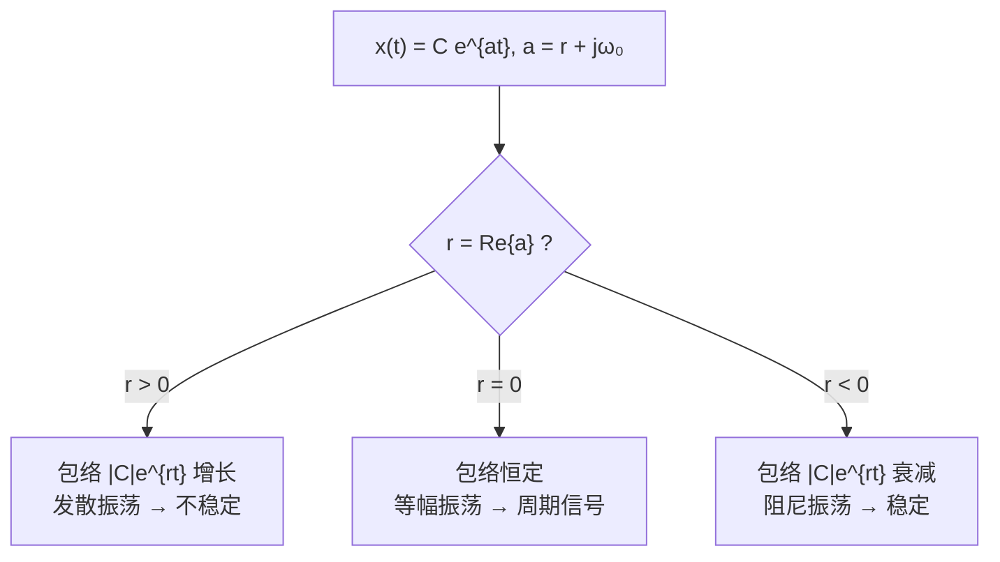

# 1.3 指数信号与正弦信号（基本信号）Exponential and Sinusoidal Signals (Basic Signals)

> [!abstract] 本节结构
> ```mermaid
> flowchart TD
>     A["1.3 指数与正弦信号<br/>Basic Signals"] --> Z["1.3.0 为什么第一章要讲它<br/>频域的基底信号"]
>     A --> B["1.3.1 连续时间复指数与正弦信号"]
>     A --> C["1.3.2 离散时间复指数与正弦信号"]
>     A --> D["1.3.3 离散时间复指数的周期性质"]
>     B --> B1["A. 实指数信号 Real Exponential<br/>x(t)=Ce^{at}, C,a 实数"]
>     B --> B2["B. 周期复指数与正弦信号<br/>a 为纯虚数 → 单频信号"]
>     B --> B3["谐波集 → 正交性 → 无穷维基底<br/>→ CTFS（第二种信号分解）"]
>     B --> B4["C. 一般复指数信号<br/>C,a 均为复数 → 包络×振荡"]
>     C --> C1["A. 实指数序列 x[n]=Cα^n"]
>     C --> C2["B. 正弦序列"]
>     C --> C3["C. 一般复指数序列"]
>     D --> D1["周期条件 2π/ω₀ 有理"]
>     D --> D2["谐波集只有 N 个不同成员<br/>→ N 维基底 → DTFS"]
> ```

> [!info] 标注说明
> 标有 **（拓展）** 或 **【拓展】** 的内容，是**课堂上没有讲到、由课件和教材延伸补充**的部分。
> 复习时可先掌握未标注的主干内容，行有余力再看拓展部分。

---

## 1.3.0 为什么第一章要单独把指数信号拎出来讲？

> [!important] 全课的逻辑主线：两个"基底信号 (basis signal)"
> 1.3 和 1.4 这两节讲的其实是**同一件事的两半**：
>
> | 节 | 信号 | 身份 |
> |---|---|---|
> | **1.3** | 复指数 $e^{\,j\omega_0 t}$ / $e^{\,j\omega_0 n}$ | **频域 (frequency domain) 的基底信号** |
> | **1.4** | 单位冲激 $\delta(t)$ / $\delta[n]$ | **时域 (time domain) 的基底信号** |
>
> 把这两个"最简单的原子"先立起来，后面所有的分解——傅里叶级数、傅里叶变换、卷积——都是把任意信号写成这两族原子的加权和。
> **这就是本课的学习路径**：先给基底，再给分解，最后给系统。

> [!note] 另一种回答：特征函数视角（拓展）
> 除了"基底"这个角度，复指数还有一个同样根本的身份：
> **$e^{st}$（连续）和 $z^n$（离散）是 LTI 系统的特征函数 (eigenfunction)** ——
> 复指数信号送进任何 LTI 系统，出来的还是**同频率的复指数**，只是被乘上一个复常数：
> $$e^{\,st}\ \longrightarrow\ H(s)\,e^{\,st}$$
> 于是"把任意信号分解成复指数的叠加"不仅是坐标变换，更把**卷积变成了乘法**。
> 这条线索到第 3 章才正式展开，这里先埋个伏笔。

---

## 1.3.1 连续时间复指数与正弦信号 Continuous-time Complex Exponential and Sinusoidal Signals

回顾：高中学到的指数信号
信号就是函数
连续的时域指数函数：$Ce^{at}$
离散的指数函数：$Ca^n$
### e 是从哪里来的？—— 自然增长的极限

> [!example] 复利故事：为什么连续增长的底数偏偏是 $e$
> 设本金 1 两，年利率 100 %。
>
> - **一年结算一次**：年底本利和 $=1\times(1+1)=2$。
> - **半年结算一次**（利滚利）：年中先滚成 $1.5$，把它当作新本金，年底 $=\left(1+\frac12\right)^2=\frac94=2.25$。
> - **一年结算 12 次**：$\left(1+\frac{1}{12}\right)^{12}\approx 2.613$。
> - **一年结算 365 次**：$\left(1+\frac{1}{365}\right)^{365}\approx 2.7146$。
>
> 结算越频繁，结果越大。那它会不会长到无穷？**不会**——高数里的极限告诉我们：
> $$\boxed{\ \lim_{n\to\infty}\left(1+\frac1n\right)^{n}=e\approx 2.71828\ }$$
> **$e$ 就是"把一年切成无穷多段、每一瞬间都在滚利"的那个极限值**，称为**自然增长的极限**。
> 细胞分裂、种群繁殖这类"增量正比于现有量"的过程，增长上限都收敛到它。

> [!important] 这个故事真正要说的是"连续"这两个字
> 把结算周期切成无穷小 ⇒ **时间从一格一格的跳变成了流淌**。
> 所以：
> - **连续时间的指数信号写成 $Ce^{at}$，底数必须是自然底数 $e$** —— 因为它描述的就是一个连续滚动的过程。
> - **离散时间的指数序列写成 $C\alpha^{n}$，底数 $\alpha$ 是任意实数（$2^n$、$(1/2)^n$、$(3/4)^n$）** —— 没有 $e$，因为 $n$ 本来就是一格一格跳的整数。
>
> $$\text{连续：}x(t)=C\,e^{at}\qquad\qquad\text{离散：}x[n]=C\,\alpha^{n}$$
> 表达式上有没有那个 $e$，是连续与离散**从最开始就分道扬镳**的地方。

> [!important] 连续与离散：两条平行的路，最后在复频域会合
> 这门课从头到尾都是"连续讲一遍、离散再讲一遍"，原因就在上面：
>
> | 章 | 连续时间 | 离散时间 |
> |---|---|---|
> | Ch.3 | **CTFS** 连续时间傅里叶级数 | **DTFS** 离散时间傅里叶级数 |
> | Ch.4 / Ch.5 | **CTFT** 连续时间傅里叶变换 | **DTFT** 离散时间傅里叶变换 |
> | Ch.9 / Ch.10 | **拉普拉斯变换 Laplace Transform** | **Z 变换 Z-Transform** |
>
> 两条路各走各的，**最终统一在复频域 (complex frequency domain) 上**：
> 高中只在实指数上打转，到拉氏 / Z 变换时把指数推广到整个复平面，两套体系才在数学上合成一件事。

### A. 实（C、a均为实数）指数信号 Real Exponential Signals

> [!important] 定义
> $$x(t)=C\,e^{at},\qquad (C,\ a \text{ are real value})$$

![[C1-连续实指数信号-增长与衰减.png]]

> [!note] 两种形态 Two types of behavior
> 取 $C$ 为常数（如 $C=1$）：
>
> | 条件 | 行为 | 中文 |
> |---|---|---|
> | **$a>0$** | **growing / increasing** | 指数增长 |
> | **$a<0$** | **decaying** | 指数衰减 |
>
> （$a=0$ 时退化为常数 $x(t)=C$。）
> 两图中纵轴截距均为 $C$（即 $x(0)=C$）。
> 实指数信号刻画的就是自然界中"指数级变化"的那一类过程。

> [!tip] 物理来源（拓展）
> 这类信号是**一阶系统自然响应**的通解：RC 电路放电 $v_c(t)=V_0e^{-t/RC}$、放射性衰变、人口自然增长，都是 $Ce^{at}$。
> $\tau=1/|a|$ 称为**时间常数 (time constant)**，衰减到 $1/e\approx36.8\%$ 所需时间。

---

### B. 周期复指数与正弦信号 Periodic Complex Exponential and Sinusoidal Signals（$a$ 为纯虚数时）

> [!important] 从实值推广到复值
> 这门课**不在实数轴上讨论问题**——傅里叶级数、傅里叶变换全都建立在复数域上。
> 所以要把 $x(t)=Ce^{at}$ 推广到 **complex exponential 复指数信号**：$C$ 和 $a$ 允许取复数。
> 推广是分步走的，先考虑最简单的一步：**$C$ 仍取实数 1，$a$ 取纯虚数 (purely imaginary)**。

> [!important] 三种写法（课件原式）
> $$\text{(1) } x(t)=e^{\,j\omega_0 t}\qquad\text{(2) } x(t)=A\cos(\omega_0 t+\phi)\qquad\text{(3) } x(t)=e^{\,jk\omega_0 t}$$
> （3）中，k相比（1）是周期缩小的倍数

> [!important] 欧拉公式 Euler's Relation
> ==$$e^{\,j\omega_0 t}=\cos\omega_0 t+j\sin\omega_0 t$$==
> 相同周期，相差相位是二分之$\pi$
> 频率上，这里是单频率（最基本）

![[Pasted image 20260907111040.png]]

> [!important] 单频信号 Single-frequency Signal
> 用欧拉公式展开 $e^{j\omega_0 t}$ 后可以看到：
> - **实部** $\cos\omega_0 t$ 与**虚部** $\sin\omega_0 t$ **有完全相同的频率**（have the same frequency），
> - 只差 $\pi/2$ 的相位。
>
> 也就是说，整个信号里**只含一种频率成分**。因此把它称为**单频信号 (single-frequency signal)**。
>
> 这正是它能当"频域基底"的原因：
> 白光可以分解成不同颜色的光；一个周期信号可以分解成许多不同频率的正弦波；
> 而**频率上最基本、不可再分的信号，就是只有一种频率成分的这一个**。

> [!important] 周期性
> $$x(t)=x(t+T),\qquad \boxed{T=\frac{2\pi}{\omega_0}}\quad\Rightarrow\quad x(t)\ \text{是周期的}$$
> 连续时间的复指数**无条件是周期信号**（$\omega_0\ne0$ 时），周期就是 $2\pi/\omega_0$，毫无争议。
> —— 这一点到了离散时间就不成立了，见 1.3.3。

> [!note] $T=2\pi/\omega_0$ 是怎么来的
> 要求 $e^{j\omega_0(t+T)}=e^{j\omega_0 t}$，即 $e^{j\omega_0 T}=1$。
> 复指数等于 1 的充要条件是指数为 $2\pi$ 的整数倍：$\omega_0 T=2\pi m$。
> 取最小正解 $m=1$，得**基波周期** $T=2\pi/\omega_0$。

#### 再推广一步：$C$ 也取复数

> [!example] 一个具体例子
> 若 $C=\dfrac{\sqrt2}{2}(1+j)$、$a=j\omega_0$，信号就是
> $$x(t)=\frac{\sqrt2}{2}(1+j)\,e^{\,j\omega_0 t}$$
> 把 $C$ 写成极坐标：$\dfrac{\sqrt2}{2}(1+j)=1\cdot e^{\,j\pi/4}$，于是
> $$x(t)=e^{\,j\pi/4}\,e^{\,j\omega_0 t}=e^{\,j(\omega_0 t+\pi/4)}$$

> [!important] 一般结论
> **任何一个确定的复数，都能在复平面上找到它对应的模与幅角**；模为 1 的复数就落在**单位圆 (unit circle)** 上，只贡献一个相位。
> 所以 $C$ 取复数时，信号总可以写成
> $$x(t)=|C|\;e^{\,j(\omega_0 t+\theta)}$$
> 再用欧拉公式拆开，实部与虚部就成了**带初相的余弦 / 正弦**：
> $$x(t)=|C|\cos(\omega_0 t+\theta)+j\,|C|\sin(\omega_0 t+\theta)$$
> —— 频率没变，仍是单频信号；变的只是幅度和初相。

#### 谐波集合 Harmonically Related Complex Exponentials

$$
\boxed{\ \Phi_k(t)=e^{\,jk\omega_0 t}=e^{\,jk(2\pi/T)t},\qquad k=0,\pm1,\pm2,\cdots\ }
$$

> [!important] 这个信号集有什么特征
> 把 $k$ 取遍**所有整数**，得到的这一族信号称为**信号集 (signal set)**。
>
> - $k=1$ 的成员周期恰为 $T$；
> - $k=2$ 的成员周期是 $T/2$，但 $T$ 仍是它的周期（走了两圈）；
> - $k=K$ 的成员周期是 $T/K$，$T$ 也仍是它的周期。
>
> 所以 **$T$ 是整个信号集的公共周期 (common period)**，而且是最大的那个公共周期。
> 集合里**每一个成员都是以 $T$ 为周期的信号**。

> [!important] 基波与谐波 Fundamental and Harmonics
> - $k=1$ 的成员 $e^{\,j\omega_0 t}$ 叫**基波 (fundamental)**，$\omega_0$ 叫**基波频率 (fundamental frequency)**，$T=2\pi/\omega_0$ 叫**基波周期**。
> - $k=2,3,\dots$ 的成员叫**二次谐波、三次谐波 (2nd / 3rd harmonic)**。
>
> "Harmonic"就是"谐次"的意思，所以整族叫 **harmonically related signals（成谐波关系的信号集）**。
>
> 这正是 [[L01 绪论 Introduction]] 里方波分解图的来源：**先用基波近似原周期波形，再逐次叠加二倍、三倍频率的谐波做微调**。

> [!note] 这一族信号的地位
> 事实上，谐波集合是一个无穷维基底（必要条件是基底两两正交，）张成一个周期为T的信号的空间，任意信号可以表示为这个集合中的信号的线性组合。
> 第 3 章的**傅里叶级数**就是把任意周期信号写成这一族信号的线性组合：
> $$x(t)=\sum_{k=-\infty}^{+\infty}a_k\Phi_k(t)=\sum_{k=-\infty}^{+\infty}a_k e^{\,jk\omega_0 t}$$
> 参见 [[L01 绪论 Introduction]] 第 8 节。

![[Pasted image 20260907112156.png]]![[Pasted image 20260907112211.png]]

#### 谐波集为什么能当"基底"—— 正交性 Orthogonality

> [!important] 先回忆线性代数里的基底
> 三维欧氏空间取
> $$\vec{i}=(1,0,0)^{\mathsf T},\quad \vec{j}=(0,1,0)^{\mathsf T},\quad \vec{k}=(0,0,1)^{\mathsf T}$$
> 任意向量都能写成 $x\vec i+y\vec j+z\vec k$ —— **基底的加权和 (weighted sum)**，权重就是坐标。
> 基底张成 (span) 的空间就是整个三维空间。
>
> **基底的必要条件：任意两个成员正交。**
> 正交用**内积 (inner product)** 定义，实向量的内积是**转置相乘**：
> $$\vec i^{\,\mathsf T}\vec j=1\cdot0+0\cdot1+0\cdot0=0\ \checkmark$$

> [!important] 复信号的内积：转置要换成共轭
> 谐波集里的每个成员用欧拉公式一展开都有实部和虚部，**是复信号**。
> 复空间里与"转置"对应的运算是**共轭 (conjugate)**，记作 $\overline{(\cdot)}$ 或 $(\cdot)^*$。
> 而且信号是"无穷多个分量的向量"，求和要换成**在一个公共周期上求积分**：
>
> $$\boxed{\ \langle \Phi_k,\Phi_l\rangle=\int_{T}e^{\,jk\omega_0 t}\;\overline{e^{\,jl\omega_0 t}}\;dt=\int_{T}e^{\,j(k-l)\omega_0 t}\,dt\ }$$
>
> **对照记忆**：三维向量是"对应分量相乘再求和"；信号是"对应时刻相乘再积分"。积分就是连续版的求和。

> [!important] 计算这个内积
> **情形一：$k=l$。**
> 共轭把指数上的符号翻成负号，两项相乘得 $e^{\,j0}=1$：
> $$\int_{T}1\,dt=T\ \ (\neq 0)$$
>
> **情形二：$k\ne l$。**
> 此时 $k-l$ 是一个**非零整数**，$e^{\,j(k-l)\omega_0 t}$ 仍是这个信号集里的某一个成员，**仍以 $T$ 为周期**。
> 它的实部虚部都是均值为零的正弦振荡，在**整整一个周期 $T$** 上积分，正面积与负面积恰好抵消：
> $$\int_{T}e^{\,j(k-l)\omega_0 t}\,dt=0$$
>
> 合起来：
> $$\boxed{\ \int_{T}e^{\,jk\omega_0 t}e^{-jl\omega_0 t}\,dt=\begin{cases}T, & k=l\\[2pt] 0, & k\neq l\end{cases}\ }$$

> [!important] 结论：谐波集是一组正交基底
> 任意两个不同成员内积为 0，自己与自己内积非零 —— 与 $\vec i,\vec j,\vec k$ 的情形**完全一样**，只是把求和换成了积分。
> 所以谐波集可以当基底，**它张成的信号空间就是"所有周期为 $T$ 的信号"**：
> 周期为 $T$ 的方波、三角波、锯齿波……只要周期是 $T$，都落在这个空间里，
> 因而都能写成这组基底的加权和。

> [!note] 这个空间叫希尔伯特空间 Hilbert Space
> 与三维欧氏空间只有 3 个基底不同，谐波集的 $k$ 取遍全部整数，
> **这是一个无穷维 (infinite dimension) 的正交空间**，数学上称为**希尔伯特空间 (Hilbert Space)**。
> 它不是欧氏空间，更抽象、维度更高。
> 具体的测度论、内积空间细节本课不要求，**能用线性代数的直觉理解"正交 → 基底 → 加权和"这条链条即可**。

#### 第二种信号分解：连续时间傅里叶级数 CTFS

> [!important] 分解式
> 只要 $x(t)$ 的周期是 $T$，它就落在上面那组基底张成的空间里，于是可以展开成
> $$\boxed{\ x(t)=\sum_{k=-\infty}^{+\infty}a_k\,e^{\,jk\omega_0 t}\ ,\qquad \omega_0=\frac{2\pi}{T}\ }$$
> 这就是**连续时间傅里叶级数 CTFS (Continuous-Time Fourier Series)**，第 3 章的第一个概念。

> [!important] 式子里每个符号的含义
> | 符号 | 含义 |
> |---|---|
> | $e^{\,jk\omega_0 t}$ | **基底信号**：第 $k$ 次谐波，单频 |
> | $k\omega_0$ | 第 $k$ 次谐波的频率；$\omega_0=2\pi/T$ 是**基波频率** |
> | $a_k$ | **加权系数**：信号在第 $k$ 个基底上的"投影" |
> | $k$ 的范围 | $-\infty\to+\infty$，**取遍所有频率**（无穷维基底） |
>
> **一组 $\{a_k\}$ 就是这个信号的频谱 (spectrum)** —— 时域波形与频域谱是同一个信号的两种坐标表示。
> 这与线性代数中"向量在一组基下的坐标"是同一个含义，唯一的区别是**这里的基底有无穷多个**。

> [!tip] 把这条线串起来
> ```mermaid
> flowchart LR
>     A["单频信号<br/>e^{jω₀t}"] --> B["谐波集<br/>{e^{jkω₀t}}"]
>     B --> C["两两正交<br/>∫_T = T 或 0"]
>     C --> D["无穷维正交基底<br/>希尔伯特空间"]
>     D --> E["张成：所有周期为 T 的信号"]
>     E --> F["CTFS<br/>x(t)=Σ aₖe^{jkω₀t}"]
>     F --> G["{aₖ} = 频谱"]
> ```
> 回头再看 [[L01 绪论 Introduction]] 里方波分解成正弦叠加的那张图，就不再是"看起来像"，而是有严格的基底与投影含义了。

#### 单位 The units（拓展）

> [!important] 单位对照表（课件原表）
> | 量 | 单位 |
> |---|---|
> | $t$ | **seconds**（秒 s） |
> | $\phi$ | **radians**（弧度 rad） |
> | $\omega_0$ | **radians per second**（弧度每秒 rad/s） |
> | $f_0$ | **cycles per second (Hz)**（周每秒，赫兹） |
>
> $$\boxed{\ \omega_0=2\pi f_0\ }$$

> [!warning] 易混：$\omega$ 与 $f$（拓展）
> - $f_0$ 是"每秒转多少圈"，$\omega_0$ 是"每秒转多少弧度"，一圈 $=2\pi$ 弧度，故 $\omega_0=2\pi f_0$。
> - 周期 $T=\dfrac{1}{f_0}=\dfrac{2\pi}{\omega_0}$。
> - 全书公式基本用 $\omega$（省去大量 $2\pi$），但工程上标频谱图常用 $f$（Hz）。**换算时别丢 $2\pi$。**

---

### C. 一般复指数信号 General Complex Exponential Signals

复数的两套坐标系：
**实虚部表示（笛卡尔或直角坐标系）**
**极坐标：** 任意一个复数可用幅度r和相位θ表示。
欧拉公式是将两种坐标系联系起来的工具。

> [!important] 两套坐标系说清楚
> | 表示 | 形式 | 名称 |
> |---|---|---|
> | 实部 + 虚部 | $z=a+jb$ | **Rectangular form** 直角坐标 / 笛卡尔坐标 |
> | 幅度 + 相位 | $z=r\,e^{\,j\theta}$ | **Polar form** 极坐标 |
>
> 复平面上任取一点，既可以用横纵坐标 $(a,b)$ 描述，也可以用"到原点的距离 $r$ + 与实轴夹角 $\theta$"描述。
> **欧拉公式 $r e^{j\theta}=r\cos\theta+jr\sin\theta$ 就是这两套坐标系之间来回切换的桥梁。**
>
> 复变函数这门课研究的正是"同一个函数在两套坐标体系下表达式如何变化"；
> 到第 9、10 章讲拉普拉斯变换、Z 变换时会大量用到。

> [!important] 定义
> $$x(t)=C\,e^{at},\qquad (C,\ a \text{ are both complex value})$$
>
> 其中
> $$C=|C|\,e^{\,j\theta}\quad\text{(Polar form 极坐标形式)}$$
> $$a=r+j\omega_0\quad\text{(Rectangular form 直角坐标形式)}$$

> [!tip] 为什么 $C$ 用极坐标、$a$ 用直角坐标？
> 看这个信号的形状：$a$ 本来就**待在指数上**，它自带一个 $e$；而 $C$ 是乘在前面的，**没有 $e$**。
> - 给 $C$ 用极坐标 $|C|e^{j\theta}$，等于**给它也补上一个 $e$**；
> - 给 $a$ 用直角坐标 $r+j\omega_0$，是为了把"实部管衰减、虚部管振荡"拆开。
>
> 这样一来整个信号就变成**清一色的 $e$ 的连乘**，可以直接合并同类项、再用欧拉公式一次性展开。
> **这不是硬性规定，是为了让式子能合并。**

**推导（课件原步骤）：**

$$
\begin{aligned}
x(t)&=|C|\,e^{\,j\theta}\,e^{\,rt}\,e^{\,j\omega_0 t}\\[4pt]
&=|C|\,e^{\,rt}\,e^{\,j(\omega_0 t+\theta)}\\[4pt]
&=\underbrace{|C|\,e^{\,rt}\cos(\omega_0 t+\theta)}_{\text{实部 Real part}}\;+\;j\underbrace{|C|\,e^{\,rt}\sin(\omega_0 t+\theta)}_{\text{虚部 Imaginary part}}
\end{aligned}
$$

第二步把两个带 $t$ 的指数合并（都在指数上、都含 $t$），第三步对纯虚指数用欧拉公式展开。

实部和虚部形式：都有一个实指数乘上一个三角函数。

> [!important] 结构：包络 × 振荡
> 实部与虚部有**完全相同的结构**：
> $$\underbrace{|C|\,e^{\,rt}}_{\text{包络 envelope}}\times\underbrace{\cos(\omega_0 t+\theta)\ \text{或}\ \sin(\omega_0 t+\theta)}_{\text{振荡 oscillation}}$$
>
> - **三角函数部分**在 $-1$ 与 $+1$ 之间稳定循环，贡献信号的**振荡**；
> - **实指数部分 $|C|e^{rt}$** 贡献信号的**趋势 (trend)**，也就是**包络线 (envelope)**。
>
> 当三角函数取到 $\pm1$ 时，信号恰好落在包络线 $\pm|C|e^{rt}$ 上 —— 这就是画图时先画包络、再在包络内画振荡的依据。

![[C1-一般复指数信号波形-r正负.png]]

> [!important] 课件结论（原文）
> **For $r>0$, both the real part and the imaginary part correspond to sinusoidal signals multiplied by a growing exponential.**
> $r>0$ 时，实部与虚部都是**正弦信号乘以增长的指数**。
>
> **For $r<0$, they correspond to sinusoidal signals multiplied by a decaying exponential.**
> $r<0$ 时，对应**正弦信号乘以衰减的指数**。

> [!note] 如何读这两张图
> 图中的**虚线 $\pm|C|e^{rt}$ 是包络 (envelope)**，实线在包络之间振荡。
> - $r>0$：包络张开 → **振荡着发散 (growing oscillation)**，系统不稳定。
> - $r<0$：包络收缩 → **振荡着收敛 / 阻尼振荡 (damped oscillation)**，系统稳定。
> - $r=0$：包络是水平线 → 等幅振荡（即 B 中的纯周期情形）。

> [!note] 与拉普拉斯变换的关系（拓展）
> **这就是第 9 章拉普拉斯变换里"极点位置决定系统行为"的原型**：$a=r+j\omega_0$ 就是 $s$ 平面上的一个点，
> **$r=\mathrm{Re}\{s\}<0$ 稳定，$>0$ 发散，$=0$ 临界**。



> [!tip] 三步走的推广路线，回头看一遍
> ```mermaid
> flowchart LR
>     A["① C=1, a 纯虚<br/>e^{jω₀t}<br/>单频、等幅"] --> B["② C 复数, a 纯虚<br/>|C|e^{j(ω₀t+θ)}<br/>加了幅度与初相"]
>     B --> C["③ C, a 都是复数<br/>|C|e^{rt}e^{j(ω₀t+θ)}<br/>包络 × 振荡"]
> ```
> **真正与后面章节密切相关的是 ①**（纯虚指数、单频、做基底）；③ 是顺带把最一般的情形拆解清楚。

---

## 1.3.2 离散时间复指数与正弦信号 Discrete-time Complex Exponential and Sinusoidal Signals

> [!important] 复指数序列 Complex Exponential Signal (sequence)
> $$x[n]=C\,\alpha^{n}\qquad\text{或}\qquad x[n]=C\,e^{\beta n}$$
> 两者关系：$\alpha=e^{\beta}$。
>
> 离散时间**通常不用 $e$ 那种写法**——按 1.3.1 的说法，离散端本来就没有"连续滚动"的含义，写成 $C\alpha^n$ 才自然。

> [!note] 课件 Note（原文）
> **It is often more convenient to express the discrete-time complex exponential sequence in the form of $x[n]=C\alpha^{n}$, although $x[n]=Ce^{\beta n}$ is more analogous to the form of the continuous-time exponential.**
>
> 用 $C\alpha^n$ 形式**更方便计算**（幂运算直观），用 $Ce^{\beta n}$ 形式**更贴近连续时间的写法**（便于类比）。

### A. 实指数序列 Real Exponential Signal（$C,\alpha$ 为实数）

$$x[n]=C\,\alpha^{n}$$

![[C1-离散实指数信号-四种形态.png]]

> [!important] 四种形态 Four types of behavior
> 取 $C=1$，只看 $\alpha$：
>
> | 图 | 条件 | 行为 |
> |---|---|---|
> | (a) | $\alpha>1$ | 单调**增长**（$2^n$、$3^n$） |
> | (b) | $0<\alpha<1$ | 单调**衰减**（$(1/2)^n$、$(3/4)^n$） |
> | (c) | $-1<\alpha<0$ | **正负交替**、幅度衰减 |
> | (d) | $\alpha<-1$ | **正负交替**、幅度增长 |
>
> 课件强调：**If $\alpha<0$, the sign of $x[n]$ alternates.**（$\alpha<0$ 时符号逐点交替）
> 原因很直接：底数为负时，$n$ 取偶数结果为正、取奇数结果为负。
>
> **实的离散指数序列只有这 4 种行为 (four types of behavior)，没有第五种。**

> [!tip] 记忆方法：拆成"模"和"符号"两件事
> $\alpha^n=|\alpha|^n\cdot(\operatorname{sgn}\alpha)^n$。
> - **$|\alpha|$ 决定幅度**：$>1$ 增长，$<1$ 衰减。
> - **$\alpha$ 的符号决定是否交替**：负数 ⇒ $(-1)^n$ ⇒ 逐点变号。
>
> 对比连续情形：$e^{at}$ 永远不会变号，**"交替"是离散世界独有的现象**（因为 $n$ 只取整数）。

### B. 正弦序列 Sinusoidal Signals（$\beta$ 为纯虚数时）

![[C1-离散正弦序列三例.png]]

> [!important] 定义
> **复指数 Complex exponential：**
> $$x[n]=e^{\,j\omega_0 n}=\cos\omega_0 n+j\sin\omega_0 n$$
> **正弦序列 Sinusoidal signal：**
> $$x[n]=\cos(\omega_0 n+\phi)$$
>
> 这是离散端**真正的重点**——纯虚的这一支，将来要拿来做基底。

课件三个例子 **Three Examples**：

| 图 | 序列 | 说明 |
|---|---|---|
| (a) | $x[n]=\cos(2\pi n/12)$ | $\omega_0=\pi/6$，$2\pi/\omega_0=12$ 有理 ⇒ **周期，$N=12$** |
| (b) | $x[n]=\cos(8\pi n/31)$ | $2\pi/\omega_0=31/4$ 有理 ⇒ **周期，$N=31$** |
| (c) | $x[n]=\cos(n/6)$ | $2\pi/\omega_0=12\pi$ **无理** ⇒ **非周期！** |
![[Pasted image 20260907115956.png]]![[Pasted image 20260907120023.png]]
> [!warning] (c) 是本节最重要的反直觉例子
> $\cos(n/6)$ 的**包络**看起来像正弦波，但它**不是周期序列**——没有任何正整数 $N$ 使 $\cos((n+N)/6)=\cos(n/6)$ 对所有 $n$ 成立。
> 连续信号 $\cos(t/6)$ 当然是周期的（$T=12\pi$），但 $12\pi$ 不是整数，离散采样点永远对不齐。
> 下一小节 1.3.3 就是解决这个问题的。

### C. 一般复指数序列 General Complex Exponential Signals

> [!important] 定义与展开
> $$x[n]=C\,\alpha^{n}$$
> 其中**两个都用极坐标形式 (polar form)**：
> $$C=|C|\,e^{\,j\theta},\qquad \alpha=|\alpha|\,e^{\,j\omega_0}$$
> 则
> $$x[n]=|C|\,|\alpha|^{n}\cos(\omega_0 n+\theta)\;+\;j\,|C|\,|\alpha|^{n}\sin(\omega_0 n+\theta)$$

> [!tip] 离散端为什么 $C$ 和 $\alpha$ **都**用极坐标？
> 与连续端对照就清楚了：
> - 连续：$C\,e^{at}$ —— $a$ 待在指数上，**自带 $e$**，所以只给 $C$ 补 $e$（$C$ 用极坐标，$a$ 用直角坐标）。
> - 离散：$C\,\alpha^{n}$ —— $C$ 和 $\alpha$ **两个都没有 $e$**，所以**两个都要用极坐标补上 $e$**。
>
> 补完之后同样可以合并、同样用欧拉公式展开，**得到与连续端一模一样的结构**。

![[C1-离散复指数-模大于小于1.png]]

> [!important] 课件结论（原文）
> - **For $|\alpha|=1$, the real and imaginary parts are both sinusoidal sequences.**（等幅正弦序列）
> - **For $|\alpha|>1$, sinusoidal sequences multiplied by a growing exponential.**（增长包络）
> - **For $|\alpha|<1$, they are sinusoidal sequences multiplied by a decaying exponential.**（衰减包络）
>
> 结构与连续端完全一致：**一个实指数包络（趋势）乘以一个振荡（频率成分）**。
> $|\alpha|^n$ 这一项决定包络，$\cos/\sin(\omega_0 n+\theta)$ 这一项决定振荡。

> [!note] 与连续情形的对照表（拓展：归纳整理）
> | | 连续时间 $Ce^{at}$，$a=r+j\omega_0$ | 离散时间 $C\alpha^n$，$\alpha=|\alpha|e^{j\omega_0}$ |
> |---|---|---|
> | 判据看什么 | **$r$ 的正负**（相对 0） | **$|\alpha|$ 与 1 的大小**（相对 1） |
> | 等幅振荡 | $r=0$ | $|\alpha|=1$ |
> | 增长 | $r>0$ | $|\alpha|>1$ |
> | 衰减 | $r<0$ | $|\alpha|<1$ |
>
> **临界线不同**：连续是 $s$ 平面的**虚轴**（$\mathrm{Re}\{s\}=0$），离散是 $z$ 平面的**单位圆**（$|z|=1$）。
> 这个对应关系在第 9、10 章（拉氏变换 vs Z 变换）会正式建立：$z=e^{sT}$。

---

## 1.3.3 离散时间复指数的周期性质 Periodicity Properties of Discrete-time Complex Exponentials

> [!important] 问题提出（课件原文）
> **Continuous-time:** $e^{\,j\omega_0 t}$，$T=2\pi/\omega_0$ ✔（**一定周期，毫无疑问**）
> **Discrete-time:** $e^{\,j\omega_0 n}$，$N=?$（**需要条件**）
>
> 两个信号只差 $t$ 与 $n$ 一个字母，行为却截然不同——这是本小节全部内容的出发点。

### 推导 Calculate period

$$
\text{By definition:}\quad e^{\,j\omega_0 n}=e^{\,j\omega_0 (n+N)}
$$
$$
\text{thus:}\quad e^{\,j\omega_0 N}=1\quad\text{or}\quad \omega_0 N=2\pi m
$$
$$
\text{So:}\quad \frac{N}{m}=\frac{2\pi}{\omega_0}
$$

> [!note] 这条结论其实在讲 1.2.2 时就已经推过
> 课本把它放在 1.3.3，但判断离散周期性绕不开它，所以在 1.2.2「周期信号」处就已经用到了。
> 完整推导（含"复指数何时等于 1"的复习，以及 $\cos\frac{3\pi n}{4}$ 周期是 8 而非 $\frac83$ 这个常见错误）见 [[C1.2 自变量的变换#离散周期性条件：$\dfrac{\omega_0}{2\pi}$ 必须是有理数|C1.2 · 离散周期性条件]]，此处不重复。

> [!important] 周期性条件 Condition of periodicity
> $$\boxed{\ \frac{2\pi}{\omega_0}\ \text{必须是有理数 (rational)}\ }$$
> 此时若 $\dfrac{2\pi}{\omega_0}=\dfrac{N}{m}$（$N,m$ 为互质正整数），则**基波周期为 $N$**，$m$ 是这 $N$ 个采样点内转过的整圈数。

> [!question] 课件留的问题：$x[n]=\cos(n/6)$ ???
> **解答**：此时 $\omega_0=\dfrac16$，$\dfrac{2\pi}{\omega_0}=12\pi$。
> $\pi$ 是**无理数**，$12\pi$ 不可能写成两个整数之比 ⇒ **$x[n]=\cos(n/6)$ 不是周期序列**。
> 这就是上一小节图 (c) 的答案。

> [!note] 为什么离散和连续差这么多？
> 连续时间只要求"存在正实数 $T$"，实数是稠密的，**总能找到**。
> 离散时间要求"存在正**整数** $N$"，整数是离散的，**未必找得到**。
> 几何上：$e^{j\omega_0 n}$ 是单位圆上以角步长 $\omega_0$ 跳跃的点；只有当"若干步刚好走完整数圈"时才会回到起点。

### 关键辨析：写在 $\omega_0$ 位置上的，必须是**基波**频率

> [!warning] 一个极易出错的地方
> 比较两个信号：
> $$x_1[n]=e^{\,j\frac{\pi}{4}n}\qquad\qquad x_2[n]=e^{\,j\frac{3\pi}{4}n}$$
>
> - $x_1$：$\omega_0=\dfrac{\pi}{4}$ 没有问题，$\dfrac{2\pi}{\omega_0}=8$，**基波周期 $N=8$**。
> - $x_2$：$\dfrac{2\pi}{3\pi/4}=\dfrac83$ —— **但周期必须是正整数，$\dfrac83$ 不是**。
>   取它的 3 倍：**基波周期 $N=8$**。
>
> 于是关键结论来了：**$x_2$ 的基波周期也是 8，所以 $x_2$ 的基波频率同样是 $\dfrac{2\pi}{8}=\dfrac{\pi}{4}$，而不是 $\dfrac{3\pi}{4}$。**
> $\dfrac{3\pi}{4}$ 是 $\dfrac{\pi}{4}$ 的 3 倍 ⇒ **$x_2$ 是 $x_1$ 的三次谐波信号**。

> [!important] 记住这条对应关系
> $$\textbf{基波频率}\ \omega_0=\frac{2\pi}{\textbf{基波周期}\ N}$$
> **基波频率一定是"$2\pi$ 除以基波周期"，二者必须成对出现。**
> 考试问"这个信号的 fundamental frequency 是多少"，绝不能把式子里 $n$ 前面的系数直接抄下来当答案，
> **必须先求出基波周期 $N$（正整数！），再回算 $\omega_0=2\pi/N$。**
>
> 后文凡是写 $e^{jk\omega_0 n}$ 的地方，**这个 $\omega_0$ 一律指基波频率**，即 $2\pi/\omega_0=N$ 为整数。

### 离散谐波集的重复性：只有 $N$ 个不同的成员

把离散复指数也做成一个信号集：$\Phi_k[n]=e^{\,jk\omega_0 n}$，$\omega_0=2\pi/N$。
它与连续端的谐波集有一个**本质区别**。

> [!important] 连续端：任意两个成员都不同
> 取 $\Phi_K(t)=e^{\,jK\omega_0 t}$ 与 $\Phi_L(t)=e^{\,jL\omega_0 t}$，只要 $K\ne L$，
> 频率 $K\omega_0\ne L\omega_0$，**振荡快慢就不一样，一定是两个完全不同的信号**。
> $k$ 越大振荡越快，**无穷无尽，永不重复** ⇒ 无穷维基底。

> [!important] 离散端：每隔 $N$ 个就重复一次
> 取 $L=K+N$：
> $$\Phi_{K+N}[n]=e^{\,j(K+N)\omega_0 n}=e^{\,jK\omega_0 n}\cdot e^{\,jN\omega_0 n}$$
> 而 $\omega_0=\dfrac{2\pi}{N}$，所以 $N\omega_0=2\pi$，于是
> $$e^{\,jN\omega_0 n}=e^{\,j2\pi n}=1\qquad(n\ \text{为整数})$$
> （$e^{j0},e^{j2\pi},e^{j4\pi},\dots$ 在复平面上都是同一个点，都等于常数 1。）
>
> 因此
> $$\boxed{\ \Phi_{k+N}[n]=\Phi_{k}[n]\ }$$
> **$k$ 往后数 $N$ 个，就跟原来的成员一模一样了。**

> [!important] 直接后果：离散基底是有限维的
> - 两个"不同的 $k$"给出**同一个信号** ⇒ 它们不再正交；
> - 所以离散谐波集里**只有 $N$ 个互不相同的成员**，通常取 $k=0,1,\dots,N-1$ 或 $k=1,2,\dots,N$；
> - **离散基底是 $N$ 维的有限维基底，不是无穷维。**
>
> **根源在哪？** 就在 $e^{j2\pi n}=1$ 这一步——它成立是因为 **$n$ 是整数**。
> 连续端对应的是 $e^{j2\pi t/T\cdot\dots}$，$t$ 是连续变量，**取不到"恒等于 1"这个性质**，所以不会重复。

### 离散的正交性

> [!important] 内积：积分换成一个周期上的求和
> 连续端对 $t$ 积分，离散端对 $n$ **在一个公共周期 $N$ 上求和**（集合里每个成员都以 $N$ 为周期）：
> $$\sum_{n=\langle N\rangle}e^{\,jk\omega_0 n}\,e^{-jr\omega_0 n}=\begin{cases}N, & k=r\\[2pt]0, & k\neq r\end{cases}$$
>
> > **唯一的区别**：连续端 $k,l$ 可以任意取；**离散端 $k,r$ 必须取在同一个周期内**（$0\sim N-1$ 或 $1\sim N$）。
> > 否则 $r=k+N$ 时两者是同一个信号，谈不上正交。

> [!important] 结论
> $$\Phi_k[n]=e^{\,jk\omega_0 n},\qquad k\ \text{取满一个周期}$$
> 是一组**$N$ 维的正交基底**，张成的空间是**所有周期为 $N$ 的离散信号**。

### 第二种信号分解（离散版）：离散时间傅里叶级数 DTFS

> [!important] 分解式
> $$\boxed{\ x[n]=\sum_{k=\langle N\rangle}a_k\,e^{\,jk\omega_0 n}\ ,\qquad \omega_0=\frac{2\pi}{N}\ }$$
> 这就是**离散时间傅里叶级数 DTFS (Discrete-Time Fourier Series)**。

> [!important] CTFS 与 DTFS：只差一处，但这一处很关键
> | | **CTFS** | **DTFS** |
> |---|---|---|
> | 分解对象 | 周期为 $T$ 的连续信号 | 周期为 $N$ 的离散信号 |
> | 基底 | $e^{\,jk\omega_0 t}$ | $e^{\,jk\omega_0 n}$ |
> | 基底维数 | **无穷维**（希尔伯特空间） | **$N$ 维**（有限维） |
> | $k$ 的范围 | $k=-\infty\to+\infty$，取遍所有频率 | $k$ **只取满一个周期**（$0\sim N-1$） |
> | 加权系数 | $a_k$ | $a_k$ |
>
> 其余含义完全一致：基底信号的加权和，$\{a_k\}$ 就是频谱。

> [!tip] 第 3–5 章的地图
> ```mermaid
> flowchart LR
>     C3["Ch.3<br/>周期信号"] --> A["CTFS<br/>连续 · 周期"]
>     C3 --> B["DTFS<br/>离散 · 周期"]
>     C4["Ch.4"] --> D["CTFT<br/>连续 · 非周期"]
>     C5["Ch.5"] --> E["DTFT<br/>离散 · 非周期"]
> ```
> **第 1 章之所以要把指数信号单拎出来讲，就是为了给第 3 章做铺垫**——没有"基底 + 正交 + 加权和"这套语言，傅里叶级数只是一个突然冒出来的公式。

> [!tip] 判周期的三步法（拓展：归纳整理，考试必用）
> ```mermaid
> flowchart TD
>     A["给定 x[n] = cos(ω₀n+φ) 或 e^{jω₀n}"] --> B["算 2π/ω₀"]
>     B --> C{"是有理数?"}
>     C -- "否" --> D["非周期 aperiodic"]
>     C -- "是" --> E["约分成最简分数 N/m"]
>     E --> F["基波周期 = N（分子）"]
> ```
> **例 1**：$\cos(\pi n/4)$ → $2\pi/\omega_0=8$ → $N=8$。
> **例 2**：$\cos(8\pi n/31)$ → $2\pi/\omega_0=2\pi\cdot\frac{31}{8\pi}=\frac{31}{4}$ → $N=31,\ m=4$。
> **例 3**：$\cos(n)$ → $2\pi/1=2\pi$ 无理 → 非周期。
>
> **两个信号相加/相乘时**：各自周期 $N_1,N_2$，合成周期为 **$\mathrm{lcm}(N_1,N_2)$**（最小公倍数）；只要有一个非周期，通常整体非周期。

> [!important] 与 1.2.2 的联动：频率的 $2\pi$ 周期性
> $$e^{\,j(\omega_0+2\pi)n}=e^{\,j\omega_0 n}e^{\,j2\pi n}=e^{\,j\omega_0 n}$$
> 所以离散频率只在 $2\pi$ 长的区间内互不相同，$\omega_0=\pi$ 是"最高频率"。详见 [[C1.2 自变量的变换]] 的"周期性质"。
>
> **注意这是三件不同的事，别混**：
> 1. **频率以 $2\pi$ 为周期**（关于 $\omega_0$）—— 永远成立，是上面 $e^{j2\pi n}=1$ 的直接推论。
> 2. **谐波集以 $N$ 为周期**（关于下标 $k$）—— 导致基底只有 $N$ 维。
> 3. **序列本身是否为周期序列**（关于 $n$）—— 需要 $2\pi/\omega_0$ 有理。
>
> 三者同源（都来自"$n$ 是整数"），但说的是不同的对象，考试爱考。

---

## 随堂测 In-class Quiz（课件原题，含答案）（拓展）

> [!question] Q1（多选）Please select all the periodic signals listed below.
> **✅ A.** $x(t)=3\cos\left(4t+\dfrac{\pi}{3}\right)$
> **✅ B.** $x(t)=\displaystyle\sum_{n=-\infty}^{\infty}e^{-(2t-n)}u(2t-n)$
> ❌ C. $x[n]=\cos\left(\dfrac{n}{8}-\pi\right)$
> **✅ D.** $x[n]=\cos\left(\dfrac{\pi}{2}n\right)\cos\left(\dfrac{\pi}{4}n\right)$
>
> **逐项解析：**
>
> **A ✅**：连续正弦，$\omega_0=4$，$T=\dfrac{2\pi}{4}=\dfrac{\pi}{2}$。连续正弦**永远周期**。
>
> **B ✅**：这是把 $g(\tau)=e^{-\tau}u(\tau)$ 沿 $\tau=2t$ 轴每隔 1 个单位复制一份再叠加，是**周期延拓 (periodic extension)**。
> 把 $t$ 换成 $t+\frac12$：$2(t+\frac12)-n=2t-(n-1)$，求和指标平移一位而求和范围不变 ⇒ 和不变。
> 故 $x(t+\frac12)=x(t)$，**周期 $T=\dfrac12$**。
>
> **C ❌**：$\omega_0=\dfrac18$，$\dfrac{2\pi}{\omega_0}=16\pi$ **无理** ⇒ **非周期**。
> （注意常数相位 $-\pi$ 不影响周期性判断。）
>
> **D ✅**：用积化和差
> $$\cos\frac{\pi n}{2}\cos\frac{\pi n}{4}=\frac12\left[\cos\frac{3\pi n}{4}+\cos\frac{\pi n}{4}\right]$$
> 第一项：$\dfrac{2\pi}{3\pi/4}=\dfrac83$ 有理 ⇒ $N_1=8$；第二项：$\dfrac{2\pi}{\pi/4}=8$ ⇒ $N_2=8$。
> $N=\mathrm{lcm}(8,8)=\mathbf{8}$ ⇒ **周期序列**。

> [!warning] 这道题的三个考点（拓展）
> 1. **连续正弦一定周期，离散正弦不一定**（A vs C）。
> 2. **周期延拓构造的信号是周期的**，要会用"指标平移"验证（B）。
> 3. **乘积信号先化成和**再分别判周期，最后取 **lcm**（D）。
>
> 顺带注意 D 的第一项：$\dfrac{2\pi}{3\pi/4}=\dfrac83$ 不是整数，所以 $\dfrac{3\pi}{4}$ 不是基波频率，$N_1$ 要取 $\dfrac83$ 的 3 倍 = 8 —— 正是上面"基波频率必须对应基波周期"那条辨析。

---

## 本节自测 Self-Test

> [!question] 1. 为什么第 1 章要专门把指数信号和单位冲激拎出来讲？
> **A**：它们是两个**基底信号**——复指数是**频域**的基底，单位冲激是**时域**的基底。后面所有的信号分解（傅里叶级数、卷积）都是把任意信号写成这两族原子的加权和。

> [!question] 2. 为什么连续指数信号的底数是 $e$，离散却是任意的 $\alpha$？
> **A**：$e=\lim_{n\to\infty}(1+1/n)^n$ 是"把时间切成无穷多段连续滚利"的极限，天然描述连续增长；离散时间 $n$ 本来就是整数步，写成 $C\alpha^n$ 更自然。这是连续/离散从一开始就分成两条路的起点。

> [!question] 3. 连续实指数 $Ce^{at}$ 的两种形态由什么决定？
> **A**：由 $a$ 的正负决定。$a>0$ growing（增长），$a<0$ decaying（衰减），$a=0$ 为常数。

> [!question] 4. 写出欧拉公式，并说明为什么 $e^{j\omega_0t}$ 叫"单频信号"。
> **A**：$e^{j\omega_0t}=\cos\omega_0t+j\sin\omega_0t$。实部与虚部**频率相同**（只差 $\pi/2$ 相位），整个信号只含一种频率成分，故称 single-frequency signal。$T=2\pi/\omega_0$ 来自 $e^{j\omega_0T}=1\Rightarrow\omega_0T=2\pi m$ 取 $m=1$。

> [!question] 5. 证明谐波集 $\{e^{jk\omega_0t}\}$ 两两正交。
> **A**：内积定义为 $\int_T e^{jk\omega_0t}\overline{e^{jl\omega_0t}}dt=\int_T e^{j(k-l)\omega_0t}dt$。$k=l$ 时被积函数恒为 1，积分 $=T$；$k\ne l$ 时被积函数仍以 $T$ 为周期且均值为零，整周期积分 $=0$。复信号的内积用**共轭**（对应实向量的转置）。

> [!question] 6. 这组基底张成的是什么空间？叫什么名字？
> **A**：张成**所有周期为 $T$ 的信号**构成的空间（方波、三角波……只要周期是 $T$ 都在里面）。因为基底有无穷多个，它是**无穷维正交空间**，即**希尔伯特空间 Hilbert Space**，不是欧氏空间。

> [!question] 7. 写出 CTFS，并说明 $a_k$ 和 $k\omega_0$ 各是什么。
> **A**：$x(t)=\sum_{k=-\infty}^{\infty}a_ke^{jk\omega_0t}$。$k\omega_0$ 是第 $k$ 次谐波的频率（$\omega_0=2\pi/T$ 为基波频率），$a_k$ 是信号在该基底上的投影，$\{a_k\}$ 就是**频谱**。

> [!question] 8. 一般复指数 $Ce^{at}$（$a=r+j\omega_0$）的波形由谁控制？为什么 $C$ 用极坐标而 $a$ 用直角坐标？
> **A**：$|C|e^{rt}$ 是**包络（趋势）**，$\cos/\sin(\omega_0t+\theta)$ 是**振荡**。$a$ 本来就在指数上自带 $e$，$C$ 没有，用极坐标 $|C|e^{j\theta}$ 相当于给它补一个 $e$，这样全式都是 $e$ 的连乘，可以合并后统一用欧拉公式展开。

> [!question] 9. 离散实指数 $C\alpha^n$ 的四种形态？
> **A**：$\alpha>1$ 增长；$0<\alpha<1$ 衰减；$-1<\alpha<0$ 交替衰减；$\alpha<-1$ 交替增长。$\alpha<0$ 一律符号交替（偶数次幂为正、奇数次幂为负）。只有这四种。

> [!question] 10. 离散一般复指数为什么 $C$ 和 $\alpha$ **都**要用极坐标？
> **A**：因为离散端写成 $C\alpha^n$，$C$ 和 $\alpha$ **两个都不带 $e$**，都要补上才能合并；连续端的 $a$ 已经在指数上，只需补 $C$。补完后两端展开结果结构相同：实指数包络 × 振荡。

> [!question] 11. $e^{j\omega_0 n}$ 何时是周期序列？基波周期怎么求？
> **A**：当且仅当 $2\pi/\omega_0$ 为**有理数**。写成最简分数 $N/m$，基波周期即分子 $N$。

> [!question] 12. $e^{j\frac{3\pi}{4}n}$ 的基波频率是 $\frac{3\pi}{4}$ 吗？
> **A**：**不是**。$2\pi\div\frac{3\pi}{4}=\frac83$ 不是整数，取 3 倍得基波周期 $N=8$，故基波频率是 $\frac{2\pi}{8}=\frac{\pi}{4}$。$\frac{3\pi}{4}$ 是它的 3 倍，所以这是三次谐波信号。基波频率必须与基波周期成对：$\omega_0=2\pi/N$。

> [!question] 13. 为什么离散谐波集只有 $N$ 个不同的成员？
> **A**：$e^{j(k+N)\omega_0n}=e^{jk\omega_0n}e^{jN\omega_0n}$，而 $N\omega_0=2\pi$、$n$ 为整数，故 $e^{j2\pi n}=1$，得 $\Phi_{k+N}=\Phi_k$。所以离散基底是 **$N$ 维有限维**，连续端因 $t$ 连续没有这个性质，基底是无穷维。

> [!question] 14. 离散正交性与连续正交性的唯一区别是什么？
> **A**：积分换成一个周期上的求和（$k=r$ 得 $N$，$k\ne r$ 得 0）；更关键的是**$k$ 与 $r$ 必须取在同一个周期内**，否则相差 $N$ 的两个下标是同一个信号，无从谈正交。

> [!question] 15. CTFS 与 DTFS 的差别？
> **A**：基底一个是 $e^{jk\omega_0t}$、一个是 $e^{jk\omega_0n}$；**CTFS 的 $k$ 从 $-\infty$ 取到 $+\infty$（无穷维），DTFS 的 $k$ 只取满一个周期（$N$ 维）**。其余含义相同。

> [!question] 16. $\cos(n/6)$ 是周期序列吗？为什么？
> **A**：不是。$2\pi/\omega_0=12\pi$ 无理，找不到正整数 $N$ 使序列重复。虽然它的"包络"看起来像正弦。

> [!question] 17. "频率以 $2\pi$ 为周期""谐波集以 $N$ 为周期""序列是周期序列"分别在说什么？
> **A**：分别是关于 $\omega_0$、关于下标 $k$、关于自变量 $n$ 的三件事。前两件永远成立（都源于 $e^{j2\pi n}=1$），第三件需要 $2\pi/\omega_0$ 有理。

---

## 相关笔记 Related Notes

- [[信号与系统 MOC]]
- 上一节：[[C1.2 自变量的变换]]
- 下一节：[[C1.4 单位冲激与单位阶跃函数]]（时域的基底信号）
- 相关：[[L01 绪论 Introduction]]（傅里叶级数三种形式、方波分解图）

[^1]: 
