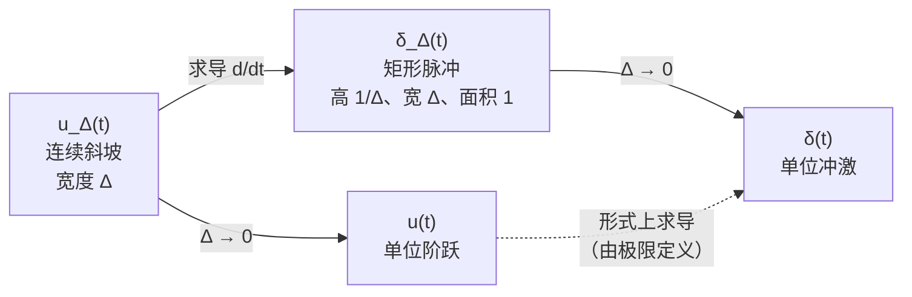

# 1.4 单位冲激与单位阶跃函数 The Unit Impulse and Unit Step Functions

> [!abstract] 本节结构
> ```mermaid
> flowchart TD
>     A["1.4 单位冲激与单位阶跃"] --> B["1.4.1 离散时间单位脉冲与单位阶跃序列"]
>     A --> C["1.4.2 连续时间单位阶跃与单位冲激函数"]
>     B --> B1["(1) 单位样值/脉冲 δ[n]<br/>时域的基底信号"]
>     B --> B2["(2) δ[n] 与 u[n] 的关系<br/>一阶差分 / 求和"]
>     B --> B3["(3) 抽样性质与第三种信号分解<br/>x[n]=Σx[k]δ[n−k]"]
>     C --> C1["(1) 单位阶跃 u(t) 与单位冲激 δ(t)"]
>     C --> C2["(2) δ(t) 与 u(t) 的关系<br/>微分 / 积分（需极限解释）"]
>     C --> C3["(3) 抽样性质 Sampling Property"]
>     C --> C4["δ(t) 的近似与尺度性质"]
> ```

> [!important] 为什么这两个函数如此重要：时域的"基底信号"
> 1.3 讲的复指数是**频域的基底信号**——每一个都是单频的，像频谱上的一根火柴。
> **1.4 讲的单位冲激，是时域的基底信号**——每一个都只在一个时刻上非零，像时间轴上的一根火柴。
>
> **单位冲激是"最简单的信号原子"**：任何信号都能写成移位冲激的加权叠加（本节的抽样性质就是这句话的数学形式）。
> 于是求 LTI 系统对任意输入的响应，只需知道它对**一个冲激**的响应——即**冲激响应 (impulse response) $h(t)$ / $h[n]$**，再做**卷积**。这就是第 2 章的全部内容。

---

## 1.4.1 离散时间单位脉冲与单位阶跃序列 The Discrete-time Unit Impulse and Unit Step Sequences

### (1) 单位样值（脉冲）Unit Sample (Impulse)

> [!important] 定义
> $$\delta[n]=\begin{cases}0, & n\neq 0\\[2pt] 1, & n=0\end{cases}$$

![[C1-单位脉冲序列.png]]

> [!note] 怎么读这张图
> 除了 $n=0$ 这一点取 1，其余所有整数点上都取 0 —— 画出来就是**孤零零的一根火柴**。
> 这是时域里"最简单、不可再分"的信号：它只在一个时刻上有值。

> [!note] 与连续冲激的根本差别
> 离散冲激 $\delta[n]$ 是一个**完全正常的、有限值的序列**（在 $n=0$ 处取 1，别处取 0），没有任何数学上的困难。
> 这与连续时间的 $\delta(t)$ 截然不同——后者在 $t=0$ 处取值"$\infty$"，是**广义函数 (generalized function / distribution)**。
> **先学离散再学连续，是因为离散的直觉完全可靠。**

#### 移位冲激：把火柴挪到别处

> [!important] 用自变量的变换 (time shift) 移动这根火柴
> $$\delta[n-1]:\ \text{只在}\ n=1\ \text{处取 }1\qquad\qquad \delta[n-2]:\ \text{只在}\ n=2\ \text{处取 }1$$
> 一般地，$\delta[n-k]$ 就是**把这根单位高度的火柴放到 $n=k$ 的位置上**。
>
> 这里用的正是 [[C1.2 自变量的变换]] 的**时移 (time shift)**：$n\to n-k$ 表示右移 $k$ 个单位。
> 所以 $\delta[n-k]$ 的两个信息是：**高度 = 1（单位）**，**位置 = $k$ (the position)**。

> [!important] 这一族移位冲激，就是时域的正交基底
> $$\{\dots,\ \delta[n+1],\ \delta[n],\ \delta[n-1],\ \delta[n-2],\ \dots\}$$
> 每一个都"只有一个位置是 1，其余全是 0"，任意两个的非零位置不重合 ⇒ **两两正交**。
>
> 与线性代数里 $(1,0,0),(0,1,0),(0,0,1)$ 那组基底是**同一件事**：
> "只有第 $k$ 个分量是 1、其余是 0"的向量 ↔ "只在 $n=k$ 处是 1"的序列。
> 对照 1.3 里的频域基底看：那里每一个基底是频谱上的一根火柴，这里每一个基底是时间轴上的一根火柴。

### 单位阶跃序列 Unit Step Function

> [!important] 定义
> $$u[n]=\begin{cases}0, & n<0\\[2pt] 1, & n\ge 0\end{cases}$$

![[C1-单位阶跃序列.png]]

> [!warning] 注意 $n=0$ 处
> 离散阶跃在 $n=0$ 处**明确定义为 1**（$n\ge0$）。不存在争议。
> 连续情形的 $u(0)$ 则常留作未定义（见 1.4.2）。

### (2) 单位脉冲与单位阶跃的关系 Relation Between Unit Sample and Unit Step..

> [!important] 三个关系式（课件原式）
> **一阶差分 First difference：**
> $$\boxed{\ \delta[n]=u[n]-u[n-1]\ }$$
>
> **滑动求和 Running sum：**
> $$\boxed{\ u[n]=\sum_{m=-\infty}^{n}\delta[m]\ }$$
>
> **等价写法（换元 $k=n-m$）：**
> $$\boxed{\ u[n]=\sum_{k=0}^{\infty}\delta[n-k]\ }$$


> [!note] 三个式子怎么验证
> - **差分**：$n>0$ 时 $u[n]=u[n-1]=1$，差为 0；$n=0$ 时 $u[0]=1,u[-1]=0$，差为 1；$n<0$ 时两者皆 0。✔
> - **求和**：把 $\delta[m]$ 从 $-\infty$ 一直加到 $n$。若 $n\ge0$，求和范围包含 $m=0$，和为 1；若 $n<0$，不包含 $m=0$，和为 0。✔
> - **第三式**：$\sum_{k\ge0}\delta[n-k]$ 中，只有当 $k=n$ 时该项非零，而 $k\ge0$ 要求 $n\ge0$。✔
>
> **差分 ↔ 求和** 就是离散世界里的 **微分 ↔ 积分**。第二式与第三式的区别是"**对求和变量求和**"与"**对位移求和**"两种视角，后者在推卷积公式时更常用。

> [!tip] 换元小窍门：把 $k=n-m$ 代入第一式
> 从 $\delta[n]=u[n]-u[n-1]$ 出发，把 $n$ 换成 $n-m$ 再对 $m$ 从 $-\infty$ 到 $n$ 求和，**第二式直接得到第三式**——一个换元就互推出来，不用背三个式子。
>
> 顺带一提：**求和没有方向**，从左边加到右边和从右边加到左边结果一样，所以换元后把求和上下限颠倒写（$\sum_{m=-\infty}^{n}$）没有关系。
> 这一点和**积分相反**——积分是有方向的，交换上下限会多出一个负号（这个区别在 1.4.2 的 $\delta(at)$ 证明里还会再次派上用场）。

### (3) 第三种信号分解：把信号拆成一根根火柴

![[C1-单位脉冲的抽样性质-离散.png]]

#### 先看一个具体例子

> [!example] 三根火柴的信号
> 设 $x[n]$ 只在三个点上非零：
> $$x[0]=2,\qquad x[1]=1,\qquad x[2]=1,\qquad \text{其余全为 }0$$
>
> 把它按位置拆成三份，分别用基底表示：
>
> | 分量 | 位置 | 高度 | 写成基底的形式 |
> |---|---|---|---|
> | 第一根 | $n=0$ | 2 | $2\,\delta[n]$ |
> | 第二根 | $n=1$ | 1 | $1\cdot\delta[n-1]$ |
> | 第三根 | $n=2$ | 1 | $1\cdot\delta[n-2]$ |
>
> 三者相加就还原了原信号：
> $$x[n]=2\,\delta[n]+1\cdot\delta[n-1]+1\cdot\delta[n-2]$$
>
> **读法**：每一项都是"**高度 × 位置**"——系数给高度，$\delta[n-k]$ 里的 $k$ 给位置。
> 这就是**基底信号的加权和**，加权系数正是信号在各点上的取值。

#### 一般形式

> [!important] 第三种信号分解 Signal Decomposition（时域）
> $$\boxed{\ x[n]=\sum_{k=-\infty}^{+\infty}x[k]\,\delta[n-k]\ }$$
>
> 读法："**把序列 $x$ 拆成一根一根的杆，第 $k$ 根杆的高度是 $x[k]$，位置在 $n=k$。**"
> 求和把所有位置上的火柴叠加起来，就得到完整的信号。

> [!warning] 关键辨析：求和号里的 $x[k]$ 不是信号，是一个数
> 这是这个式子最容易糊涂的地方。
>
> - **信号 (signal) 是函数**，必须有**自变量**。这个式子里的自变量是 $n$，它跑遍整条整数轴。
> - **$k$ 在求和里是取定的**（每一项固定一个 $k$）。所以 **$x[k]$ 是一个 value（数值）**，是信号在 $k$ 点上的取值，**它只是权重**。
> - **真正的信号是 $\delta[n-k]$**：$n$ 是自变量，$k$ 只标出这根火柴的位置。
>
> 一句话：**$x[k]$ 管高度，$\delta[n-k]$ 管位置且是那个"信号"。**
> 拿上面的例子对照：$x[0]=2$ 是"2"这个数，$\delta[n]$ 才是那根信号。

> [!important] 三种信号分解，到这里就凑齐了
> | # | 名称 | 域 | 分解式 | 基本成分 |
> |---|---|---|---|---|
> | ① | **奇偶分解** | 时域 | $x=x_e+x_o$ | 偶函数、奇函数（只分两份，很粗） |
> | ② | **傅里叶分解** CTFS / DTFS | **频域** | $x(t)=\sum_k a_k e^{jk\omega_0 t}$ | 复指数（单频信号） |
> | ③ | **冲激分解** | **时域** | $x[n]=\sum_k x[k]\delta[n-k]$ | 移位冲激（一根根火柴） |
>
> ① 见 [[C1.2 自变量的变换]]，② 见 [[C1.3 指数信号与正弦信号]]，③ 就是本节。
> **②③ 是一对**：一个把信号按**频率**拆开，一个把信号按**时刻**拆开——正是时域与频域两套坐标。

#### 抽样性质 Sampling Property

> [!important] 取值（抽样）式（课件原式）
> $$x[n]\,\delta[n]=x[0]\,\delta[n]$$
> $$x[n]\,\delta[n-n_0]=x[n_0]\,\delta[n-n_0]$$

> [!note] 课件 Note（原文）
> **The shifted unit impulse sequence can be used to sample the value of a signal at $n=n_0$.**
> 移位后的单位脉冲序列可以用来**"抽取"信号在 $n=n_0$ 处的值**。
> 道理很简单：$\delta[n-n_0]$ 只在 $n=n_0$ 处非零，$x[n]$ 的其他取值根本用不上，于是可以把 $x[n_0]$ 当常数提到外面。

> [!warning] 课堂反复强调：左右两边都是信号，不是数值
> 一个极易混淆、课堂上被重点强调的辨析：
>
> $$\underbrace{x[n]\,\delta[n-n_0]}_{\text{信号：只在 }n_0\text{ 处非零，其余全为 }0}\quad\ne\quad\underbrace{x[n_0]}_{\text{数值：一个常数}}$$
>
> - **左边**是**信号**——它是 $n$ 的函数，只在 $n=n_0$ 处取值 $x[n_0]$，**其他点全是 0**。
> - **右边 $x[n_0]$**（不带 $\delta$）是**数值**——$n_0$ 已取定，它是一个常数。若把常数当信号画出来，是**每个点上都等于 $x[n_0]$ 的常数信号**，跟左边完全是两码事。
> - 正确的写法必须**保留冲激这一项**：$x[n_0]\,\delta[n-n_0]$——它才同时携带"**位置在 $n_0$、高度为 $x[n_0]$**"两个信息。
>
> 特例（$n_0=0$）：$x[n]\delta[n]=x[0]\delta[n]$。
> 别写成 $x[n]\delta[n]=x[0]$——那是一个数，不是信号。
>
> **一句话：信号是函数，必须带着自变量 $n$；一旦写成 $x[n_0]$，你就已经从"信号"掉到"数值"了。**
> 同样的辨析在连续时间仍然成立（见 1.4.2 的抽样性质）。

> [!important] 这条分解式为什么是全课最关键的一步
> 把 $x[n]=\sum_{k}x[k]\delta[n-k]$ 送进一个 LTI 系统 $\mathcal{T}$：
> - 由**线性**：$y[n]=\mathcal{T}\{x[n]\}=\sum_k x[k]\,\mathcal{T}\{\delta[n-k]\}$
> - 由**时不变**：$\mathcal{T}\{\delta[n-k]\}=h[n-k]$（$h$ 是冲激响应）
> - 得到 **卷积和 (convolution sum)**：
> $$\boxed{\ y[n]=\sum_{k=-\infty}^{\infty}x[k]\,h[n-k]=x[n]*h[n]\ }$$
>
> **第 2 章的核心结论，其种子就埋在这一页。**

> [!tip] 两个式子别混
> - $x[n]\delta[n-n_0]=x[n_0]\delta[n-n_0]$ —— 结果**还是一个序列**（在 $n_0$ 处高度为 $x[n_0]$ 的一根杆）。
> - $\sum_{n}x[n]\delta[n-n_0]=x[n_0]$ —— **求和之后**才得到一个数。
>
> 连续情形同理：$x(t)\delta(t-t_0)$ 是冲激，$\int x(t)\delta(t-t_0)dt$ 才是数。

---

## 1.4.2 连续时间单位阶跃与单位冲激函数 The Continuous-time Unit Step and Unit Impulse Functions

> [!note] 叫法区分：中文术语的一次性对照
> 同一个英文单词 **impulse**，在离散与连续两种情形下中文习惯叫法不同：
> - **离散**：单位脉冲（也常叫**单位样值 unit sample**，两者同义）
> - **连续**：单位**冲击**
>
> 之后笔记里不刻意区分，出现"冲激"一律指连续 $\delta(t)$，"脉冲"指离散 $\delta[n]$。

### (1) 单位阶跃函数 Unit Step Function

> [!important] 定义
> $$u(t)=\begin{cases}0, & t<0\\[2pt] 1, & t>0\end{cases}$$

![[C1-连续单位阶跃函数.png]]

> [!tip] $u(t)$ 最常用的身份：一把"截断刀"
> 讲能量/功率分类时（[[C1.1 连续时间与离散时间信号]]）$u(t)$ 就已经提前登场了，因为作业里要用。它最常见的用途是**把双边信号截成单边**：
> $$e^{-t}\ \xrightarrow{\ \times\,u(t)\ }\ e^{-t}u(t)$$
> 效果一目了然：$e^{-t}$ 本来在整个时间轴上都有定义，乘上 $u(t)$ 之后，**$t<0$ 那一半整个变成 0**，只剩右半边。
>
> **后果很关键**：双边的 $e^{-t}$ 因为左侧指数爆炸，是"既非能量也非功率信号"；乘上 $u(t)$ 之后就变成了**有限能量信号**。
> 这正是 [[C1.1 连续时间与离散时间信号]] 里例 3 与例 4、随堂测 Q2 与 Q3 的全部差别。

> [!warning] 课件 Note（原文）
> **The unit step is discontinuous at $t=0$.**
> 单位阶跃在 $t=0$ 处**不连续**。
>
> 注意定义式里**没有给 $t=0$ 赋值**——因为 $u(0)$ 的取值不影响任何积分结果，不同教材取 0、1 或 1/2 都有。

> [!warning] 连续与离散的一个根本差别：$u(0)$ 到底等不等于 1？
> - **离散** $u[0]=1$：明确写在定义里（$n\ge0$ 时取 1），**有固定取值，没有争议**。
> - **连续** $u(0)$：**没有定义 (no value)**。因为 $u(t)$ 在 $t=0$ 处是**间断的**：左极限 $\lim_{t\to0^-}u(t)=0$，右极限 $\lim_{t\to0^+}u(t)=1$，**两者不相等**，所以 $u(0)$ 无定义。
>
> 课堂上的讲法：数学上把这种函数叫**间断函数 (discontinuous)**，它从 0"跳变 (jump)"到 1。这个"跳变"正是下一小节 $\delta(t)=du/dt$ 的来源——**断点上有导数，导出来就是冲激**。

### 单位冲激函数 Unit Impulse Function

> [!important] 定义（课件原式）
> $$\delta(t)=\begin{cases}0, & t\neq 0\\[2pt] \infty, & t=0\end{cases}\qquad\text{and}\qquad \int_{-\infty}^{+\infty}\delta(t)\,dt=1$$

![[C1-连续单位冲激函数.png]]

> [!warning] 图上箭头旁的 "1" 是什么意思？
> **不是高度，是面积（强度 strength）**。
> $\delta(t)$ 的高度是无穷大，画不出来，所以约定用**箭头**表示冲激，箭头旁标注的数字表示**冲激的面积**。
> 例如 $3\delta(t-2)$ 就画成在 $t=2$ 处标着 "3" 的箭头。

> [!note] 补充讲解：$\delta(t)$ 严格来说不是"函数"
> 没有任何普通函数能满足"处处为 0、单点为 $\infty$、积分为 1"（勒贝格意义下单点集测度为 0，积分必为 0）。
> $\delta(t)$ 是**广义函数 / 分布 (distribution)**，它只在"**被积分**"时才有意义：$\delta$ 的全部信息就是"它作用在测试函数上取出该点函数值"。
> 工程上不必纠结这一点，但要知道**所有关于 $\delta$ 的运算最终都要落到积分里去理解**。

> [!note] 课堂讲法：奇异信号与狄拉克函数
> 这类"高度无穷大、宽度为 0、面积却为 1"的信号，数学上很怪异，专门有个名字：
> - **奇异信号 (singularity)**：怪就怪在单点上取无穷值；
> - 描述它的函数叫**狄拉克函数 (Dirac delta function)**——这就是 $\delta(t)$ 的正式名称。
>
> **为什么"单位"体现在积分上？** "unit"原本指信号值为 1，但 $\delta(t)$ 的值是无穷。
> 所以对 $\delta$ 来说，"单位"改由**面积**定义：$\int\delta(t)dt=1$。而积分就是面积——这是理解 $\delta$ 一切性质的钥匙。
>
> **它是偶函数**：$\delta(-t)=\delta(t)$。直观上，$\delta_\Delta(t)$ 那根窄矩形无论从左边还是右边压向原点，极限都是同一个冲激；这件事在 $\delta(at)$ 的证明里会用到。

### (2) 单位冲激与单位阶跃的关系 Relation Between Unit Impulse and Unit Step

> [!important] 两个关系式（课件原式，Example 1.7）
> **一阶导数 First derivative：**
> $$\boxed{\ \delta(t)=\frac{du(t)}{dt}\ }\qquad\text{（课件标注：To be interpreted 需作解释）}$$
>
> **滑动积分 Running integral：**
> $$\boxed{\ u(t)=\int_{-\infty}^{t}\delta(\tau)\,d\tau\ }$$

> [!warning] 课件 Note（原文）
> **Since $u(t)$ is discontinuous at $t=0$ and consequently is formally not differentiable.**
> 由于 $u(t)$ 在 $t=0$ 处不连续，**形式上它是不可微的**。
> 所以 $\delta(t)=du/dt$ 这个式子需要用**极限过程**重新解释——这正是下一页做的事。

> [!note] 为什么连续是导数、离散是差分：离散化桥梁（课堂推导）
> 连续与离散的这两组关系是**一一对应**的：**求和 ↔ 积分**，**差分 ↔ 微分**。为什么会这样？把连续的导数定义离散化就看到了。
>
> 导数定义（取前向差商）：
> $$\frac{df(x)}{dx}=\lim_{\Delta x\to 0}\frac{f(x+\Delta x)-f(x)}{\Delta x}$$
> **连续采样后就是离散**：采样把时间戳丢掉（相当于归一化），相邻样本的间隔就取成最小单位 $\Delta x=1$，于是上式变成
> $$\frac{f(x+\Delta x)-f(x)}{\Delta x}\ \xrightarrow{\ \Delta x=1\ }\ f(n+1)-f(n)$$
> 这正是**一阶差分 (first difference)**。所以一阶差分就是一阶导数在离散世界的化身，求和对应积分同理（积分就是把一块块小矩形面积叠加起来）。
>
> 离散情形下 $\Delta x$ 没有"趋于 0"的自由（样本间隔就是 1），这就是为什么离散的 $\delta[n]=u[n]-u[n-1]$ 完全合法，而连续的 $\delta(t)=du/dt$ 必须借助极限来定义。

> [!note] 狄拉克函数漂亮在哪：断点上也能求导
> 数学上**间断的函数不可微**，$u(t)$ 在 $t=0$ 处跳变，本来不能求导。
> 狄拉克函数的引入恰恰弥补了这一点：**断点上的导数就是一个冲激**——跳变的位置就是冲激的位置，跳变的幅度就是冲激的强度。
> 这就是"奇异函数"名称的由来，也是 $\delta(t)=du/dt$ 的直观含义（严格化见下面的极限构造）。

> [!warning] 课堂高频易错：running integral 的内部变量
> $u(t)=\int_{-\infty}^{t}\delta(\tau)\,d\tau$ 是**最常见的写错点**，把它和离散的 running sum 对照看：
>
> $$\underbrace{u[n]=\sum_{m=-\infty}^{n}\delta[m]}_{\text{running sum}}\quad\longleftrightarrow\quad\underbrace{u(t)=\int_{-\infty}^{t}\delta(\tau)\,d\tau}_{\text{running integral}}$$
>
> - **$\tau$（离散对应 $m$）是内部积分变量**：积完它取遍区间内所有值之后**就消失了**，结果里跟 $\tau$ 一点关系都没有。
> - **结果只由积分上下限决定**，即积出来是**$t$ 的函数**——$t$ 出现在上限里，$\tau$ 不在。
> - 所以**上限必须写 $t$、被积变量必须写 $\tau$**。写成 $\int_{-\infty}^{t}\delta(t)\,dt$ 是错的（$t$ 一会儿是上限一会儿是被积变量，符号打架）。
>
> 离散的 running sum 完全平行：$m$ 是内部求和变量，求和之后 $m$ 消失，结果是 $n$ 的函数。**把这一对放一起记，两边都不会写错。**
> 求导的逆运算是积分，所以这两个式子互为逆运算，不证自明。

### 极限构造：用 $u_\Delta(t)$ 逼近 $u(t)$

![[C1-冲激函数的极限构造.png]]

> [!important] 构造过程（课件原文）
> 1. **Let $u_\Delta(t)$ be an approximation to $u(t)$**
>    取一个**连续 (Continuous)** 的斜坡函数：$t<0$ 时为 0，$0\le t\le\Delta$ 时从 0 线性升到 1，$t>\Delta$ 时恒为 1。
> 2. **If $\Delta\to 0$, then we have $u_\Delta(t)\to u(t)$**
> 3. **Consider the derivative**
>    $$\delta_\Delta(t)=\frac{du_\Delta(t)}{dt}$$
>    这是一个**高度 $1/\Delta$、宽度 $\Delta$ 的矩形脉冲**（面积恒为 1）。
> 4. **then we get**
>    $$\boxed{\ \lim_{\Delta\to 0}\delta_\Delta(t)=\delta(t)\ }$$



> [!important] 这段构造回答了什么
> "$u(t)$ 不可微"这个矛盾被**极限**化解了：
> 我们不直接对 $u$ 求导，而是**先对光滑近似 $u_\Delta$ 求导，再让 $\Delta\to0$**。
> 记住关键点：**$\delta_\Delta(t)$ 的面积恒为 $\frac{1}{\Delta}\times\Delta=1$，与 $\Delta$ 无关**。所以极限保留了"面积为 1"这个本质属性，而高度趋于无穷只是副产品。

> [!note] 课堂的"物理直觉"版本：瞬时信号
> 别把 $\delta(t)$ 想得太抽象：**面积恒为 1、宽度 $\Delta\to0$、高度 $\to\infty$**，它就是一个"**转瞬即逝的瞬时信号**"——一个瞬间完成的、总效果（面积）为 1 的冲击。
> 这也是它叫"冲激"的原因：$\delta_\Delta(t)$ 对 $u(t)$ 的逼近，正是把"瞬间跳变"理解成"过渡时间 $\Delta\to0$ 的斜坡"的极限。

### 课堂例题：带断点信号的导数

> [!example] 一个"往下跳两步"的台阶信号
> 设 $x(t)$ 为分段常数（台阶）信号：$t<1$ 时 $x=1$，$1<t<2$ 时 $x=2$，$t>2$ 时 $x=0$，其余处取 0。
> 用极限观点（或"断点上求导"）求 $x'(t)$。
>
> **解**：平坦段上导数为 0，只需看三处跳变——**跳变的位置就是冲激的位置，跳变的幅度就是冲激的强度**：
>
> | 跳变点 | 跳变 | 贡献 |
> |---|---|---|
> | $t=0$ | $0\to1$，向上跳 1 | $+\delta(t)$ |
> | $t=1$ | $1\to2$，向上跳 1 | $+\delta(t-1)$ |
> | $t=2$ | $2\to0$，**向下跳 2** | $-2\,\delta(t-2)$ |
>
> $$x'(t)=\delta(t)+\delta(t-1)-2\,\delta(t-2)$$
>
> **两个易错点**：
> - 向下跳是**负**冲激：从 2 跳到 0，改变量是 $-2$，不是 $+2$。
> - **$t=2$ 处不是 $-1\delta$ 而是 $-2\delta$**：跳变幅度按"跳了几步"算——**每一步是 1 个单位 (unit)**，这里一步跳了两个单位，系数就是 2。

> [!question] 追问：分段函数的导数，为什么写成了三个冲激「相加」？
> 很自然的疑惑：$x(t)$ 是分段定义的，那 $x'(t)$ 不是也该分段写吗？怎么直接加成一行了？
>
> **解释一：求和式本身就是分段结果的紧凑写法**
>
> 冲激函数有一个关键性质——$\delta(t-t_0)$ 在 $t\ne t_0$ 的**所有地方都等于 0**，只在 $t=t_0$ 处才非零。因此三项相加时，任何一个时刻最多只有一项非零，其余全为 0。把这行加法展开读，就是：
>
> $$x'(t)=\begin{cases}\delta(t) & t=0\\ 0 & 0<t<1\\ \delta(t-1) & t=1\\ 0 & 1<t<2\\ -2\,\delta(t-2) & t=2\\ 0 & t>2\end{cases}$$
>
> 这正是分段表示。只是「平坦段导数为 0」的那几段写出来全是 0，属于废话，于是只保留非零的三项、用加号串成一行。**加号在这里起的是「拼接」作用，不是「叠加」作用。**
>
> **解释二：原信号本来就是加出来的，求导只是逐项求导**
>
> 更本质的看法是：$x(t)$ 根本不必分段定义，它可以直接写成阶跃函数的线性组合
>
> $$x(t)=u(t)+u(t-1)-2u(t-2)$$
>
> 验算：$t<0$ 时三项全 0；$0<t<1$ 时只有第一项生效得 1；$1<t<2$ 时前两项生效得 2；$t>2$ 时 $1+1-2=0$。与原定义完全吻合。
>
> 而求导是**线性运算**，对和式可以逐项进行，只需用到一条基本事实 $u'(t)=\delta(t)$：
>
> $$x'(t)=u'(t)+u'(t-1)-2u'(t-2)=\delta(t)+\delta(t-1)-2\,\delta(t-2)$$
>
> 这条路径上根本没有「分段」这个步骤——从头到尾都是一个整体表达式。

> [!tip] 一个贯穿全课的习惯
> 分段表示与求和表示是同一个函数的两种写法。对于「处处为 0、只在孤立点有值」的对象，求和写法更紧凑，也更便于后续做卷积和傅里叶变换（每项单独变换再相加即可）。整门课都在往这个方向推：**能写成加法的就别写成分段**——因为 LTI 系统对加法是「透明」的（叠加性），对分段则不是。

> [!note] 这个例题的意义
> 带断点的一般信号从此也能"求导"了——导数由各断点处的冲激拼成。这就是把 $\delta(t)=du/dt$ 推广到任意分段常数信号：
> **断点位置 → 冲激位置（$t-t_0$），跳变幅度 → 冲激强度（系数）。**
> 微分"记录变化"，而分段常数信号的变化恰好全集中在跳变点，于是导数全由冲激构成——物理上很自然。

### $\delta(t)$ 的近似 Approximation of $\delta(t)$

![[C1-冲激函数的三种近似.png]]

> [!important] 课件给出的三种近似形状
> **① 右侧矩形（课件主用）：**
> $$\delta_\Delta(t)=\begin{cases}\dfrac{1}{\Delta}, & 0\le t\le\Delta\\[6pt] 0, & \text{otherwise}\end{cases}$$
>
> **② 居中矩形**：宽度 $\Delta$，从 $-\dfrac{\Delta}{2}$ 到 $\dfrac{\Delta}{2}$，高 $\dfrac{1}{\Delta}$
>
> **③ 三角形**：底从 $-\Delta$ 到 $\Delta$，峰高 $\dfrac{1}{\Delta}$
>
> 三者都满足 $\displaystyle\lim_{\Delta\to0}\delta_\Delta(t)=\delta(t)$。

> [!note] 补充讲解：为什么形状可以任意？
> 因为 $\delta$ 的定义只关心两件事：**(a) 极限下宽度趋于 0；(b) 面积恒为 1**。
> 形状无关紧要——高斯函数 $\frac{1}{\sqrt{2\pi}\sigma}e^{-t^2/2\sigma^2}$、$\mathrm{sinc}$ 函数等都可以作为 $\delta$ 的近似（称为 **$\delta$ 序列 / nascent delta function**）。
> 三角形的面积核对：$\frac12\times 2\Delta\times\frac1\Delta=1$ ✔

### (3) 冲激的抽样性质 Sampling Property of $\delta(t)$

> [!important] 三个式子（课件原式）
> $$x(t)\,\delta(t)=x(0)\,\delta(t)$$
> $$x(t)\,\delta(t-t_0)=x(t_0)\,\delta(t-t_0)$$
> $$\boxed{\ \int_{-\infty}^{+\infty}x(t)\,\delta(t-t_0)\,dt=x(t_0)\ }$$

![[C1-冲激的抽样性质-面积解释.png]]

> [!note] 课件图的解读
> 图中把 $x(t)\delta_\Delta(t)$ 画成一个宽 $\Delta$、高约 $\dfrac{1}{\Delta}x(0)$ 的窄条（阴影部分）。
> 因为在 $[0,\Delta]$ 这段极窄区间内，$x(t)$ 几乎不变，可以近似为常数 $x(0)$：
> $$x(t)\delta_\Delta(t)\approx x(0)\delta_\Delta(t)$$
> 阴影面积 $=\dfrac{1}{\Delta}x(0)\times\Delta=x(0)$，与 $\Delta$ 无关。令 $\Delta\to0$ 即得抽样性质。

> [!warning] 两个式子是"信号"，第三式才是"数值"
> 课堂上把连续版与离散版对照着强调（与 1.4.1 的辨析完全平行）：
>
> $$x(t)\delta(t-t_0)=\underbrace{x(t_0)\,\delta(t-t_0)}_{\text{信号：只在 }t_0\text{ 处的一个冲激}}\qquad\ne\qquad\underbrace{x(t_0)}_{\text{数值}}$$
>
> - 前两式：两边都是**信号**（$t$ 的函数）——$\delta(t-t_0)$ 在 $t\ne t_0$ 处全是 0，把 $x(t)$ 其他点的值全部"灭掉"，只剩 $t_0$ 处的一个冲激。
> - 冲激的**强度**（面积）是 $x(t_0)$：把 $x(t)$ 看成"由 0 跳到 $x(t_0)$"，冲激就按跳变值 $x(t_0)$ 标。
> - 第三式 $\int x(t)\delta(t-t_0)\,dt=x(t_0)$：积分是对 $t$ 积的，**积完之后 $t$ 消失，结果是一个 value**。
>   用变量代换 $t'=t-t_0$ 立刻回到定义式 $\int\delta=1$，再提出常数 $x(t_0)$ 即得。
>
> **一句话：乘出来的是信号，积出来的才是数。**

> [!important] 抽样性质的口诀
> **"$\delta$ 遇到积分，就把它压在的那一点的函数值取出来。"**
> $$\int x(t)\delta(t-t_0)dt=x(t_0)$$
> 前两式只是"**把系数提到括号外**"：既然 $\delta(t-t_0)$ 只在 $t=t_0$ 处不为零，那么 $x(t)$ 的其他取值根本用不上。

> [!important] 连续版的第三种信号分解
> 把上式反过来读，就是**连续信号的冲激分解**：
> $$x(t)=\int_{-\infty}^{+\infty}x(\tau)\,\delta(t-\tau)\,d\tau$$
> 与离散版 $x[n]=\sum_k x[k]\delta[n-k]$ 完全对应——**求和换成积分，$x(\tau)$ 同样是权重（一个数），$\delta(t-\tau)$ 才是那个信号。**
> 它送进 LTI 系统就得到**卷积积分** $y(t)=\int x(\tau)h(t-\tau)d\tau$。

> [!warning] 使用抽样性质的两个前提
> 1. **冲激的位置必须落在积分区间内**，否则积分为 **0**。
> 2. **$x(t)$ 在 $t_0$ 处必须连续**，否则 $x(t_0)$ 无定义。
>
> 第 1 条正是下面填空题 1 的考点。

### $\delta(t)$ 的尺度性质 Scaling Property of $\delta(t)$（课堂补充的"书外结论"）

![[C1-冲激的尺度性质-图示.png]]

> [!important] 结论
> $$\boxed{\ \delta(at)=\frac{1}{|a|}\,\delta(t)\ }$$
>

**两种思路，殊途同归：**

**思路一（矩形挤压直觉）：**
先看普通信号：$x(t)\to x(2t)$ 是**时间轴上的压缩 (compress)**，宽度减半。
但 $\delta(t)$ 本来就没有宽度，再挤会怎样？用"极限建模"来看：$\delta_\Delta(t)$ 是宽 $\Delta$、高 $1/\Delta$ 的矩形，那 $\delta_\Delta(at)$ 呢？宽度被压成 $\dfrac{\Delta}{|a|}$，**高度不变**，于是

$$\text{面积}\ =\ \frac{\Delta}{|a|}\times\frac{1}{\Delta}=\frac{1}{|a|}$$

再令 $\Delta\to0$：宽度趋于 0、高度趋于无穷——**它仍然是一个冲激**，只是面积不再是 1，而是 $\dfrac{1}{|a|}$。冲激的大小只看面积，所以 $\delta(at)=\dfrac{1}{|a|}\delta(t)$。
（用 $\delta_\Delta(2t)$ 走一遍：宽 $\Delta/2$、高 $1/\Delta$，面积恒为 $1/2$ ⇒ 结果是 $\frac12\delta(t)$。）

**思路二（严格证明）：**

$$
\int_{-\infty}^{+\infty}\delta(at)\,dt \xlongequal{\ \tau=at\ } \int_{-\infty}^{+\infty}\delta(\tau)\,d\!\left(\frac{\tau}{a}\right)
$$

$$
\text{If } a>0:\quad \int_{-\infty}^{+\infty}\delta(\tau)\,d\!\left(\frac{\tau}{a}\right)=\frac{1}{a}\int_{-\infty}^{+\infty}\delta(\tau)\,d\tau=\frac{1}{a}
$$

$$
\text{If } a<0:\quad \int_{-\infty}^{+\infty}\delta(\tau)\,d\!\left(\frac{\tau}{a}\right)=\frac{1}{a}\int_{+\infty}^{-\infty}\delta(\tau)\,d\tau=-\frac{1}{a}\int_{-\infty}^{+\infty}\delta(\tau)\,d\tau=-\frac{1}{a}
$$

$$
\Rightarrow\quad \int_{-\infty}^{+\infty}\delta(at)\,dt=\frac{1}{|a|}
$$

> [!warning] $a<0$ 时为什么积分限要翻转？
> 换元 $\tau=at$，当 $a<0$ 时，$t:-\infty\to+\infty$ 对应 $\tau:+\infty\to-\infty$，**上下限互换**，因此多出一个负号，最终与 $\frac1a$ 的负号抵消，得到 $-\frac1a=\frac{1}{|a|}>0$。
> 面积必须为正，这也是结果里出现绝对值的原因。

> [!warning] 为什么积分交换上下限会变号，而求和不会？
> 课堂上特意对比过这两个操作（1.4.1 的换元用到了"求和可换序"）：
> - **求和没有方向**：从左加到右和从右加到左结果相同，所以 $\sum_{k=0}^{\infty}$ 和 $\sum_{k=-\infty}^{0}$ 的上下限可以随便换。
> - **积分有方向（带面积符号）**：$\int_a^b=-\int_b^a$，交换上下限会多出一个负号。高数里的这条规则，正是这里 $a<0$ 时负号与绝对值（$|a|=-a$）的来源。

> [!note] 另一种记法：$\delta$ 是偶函数
> 不用每次纠结符号：先写 $\delta(at)=\dfrac{1}{|a|}\delta(t)$，再补充
> $$\delta(-t)=\delta(t)\qquad\text{（冲激是偶函数/偶信号）}$$
> 例如 $\delta(-2t)$：$a=-2$，先得 $\frac12\delta(t)$，同时由偶函数性质 $\delta(-t)=\delta(t)$ 也可以直接换号。
> 综合记忆：**尺度变换永远产生正的 $1/|a|$；负号的意义只是"先翻转再缩放"，而冲激翻转后还是自己。**

> [!tip] 常用推论
> $$\delta(at-t_0)=\delta\!\left[a\!\left(t-\frac{t_0}{a}\right)\right]=\frac{1}{|a|}\,\delta\!\left(t-\frac{t_0}{a}\right)$$
> **做题第一步永远是把 $\delta$ 的括号化成 $\delta(t-t_1)$ 的标准形式**，同时把系数 $\frac{1}{|a|}$ 提出来。

### 考试题型：含冲激的积分（一般占 2 分）

> [!example] 例题 1：$\displaystyle\int_{-\infty}^{+\infty}(2t^2+3t)\,\delta\!\left(\frac12 t-2\right)dt=\ ?$
> **解**：先化标准形式——把 $\frac12 t-2$ 看成 $a(t-t_1)$ 的形式：
> $$\delta\!\left(\frac12 t-2\right)=\delta\!\left[\frac12\,(t-4)\right]\ \xrightarrow{\ \delta(at)=\tfrac{1}{|a|}\delta(t)\ }\ 2\,\delta(t-4)$$
> 于是积分变为 $2\int_{-\infty}^{+\infty}(2t^2+3t)\delta(t-4)\,dt$，由抽样性质（$t_0=4$ 在区间内）：
> $$=2\cdot\bigl(2\cdot 16+3\cdot 4\bigr)=2\cdot 44=88$$
>
> 课堂上的关键演示：
> 1. 把 $t-4$ 整体看成 $t'$，用 $\delta(at)=\frac{1}{|a|}\delta(t)$ 把 $\delta(\frac12 t')$ 换成 $2\delta(t')$；
> 2. 系数 2 提出积分号外；
> 3. 剩下的就是标准抽样：$\int f(t)\delta(t-4)dt=f(4)$。

> [!example] 例题 2（老师把积分区间改成 $[-3,3]$ 之后）：同一个被积函数，$\displaystyle\int_{-3}^{3}(2t^2+3t)\,\delta\!\left(\frac12 t-2\right)dt=\ ?$
> **解**：化标准形式的结果不变：被积函数 $=2(2t^2+3t)\,\delta(t-4)$。
> 但冲激位置在 $t=4$，而积分区间是 $[-3,3]$——**冲激不在积分区间内**。
> 冲激没有宽度，区间没盖住它就积不到任何面积 ⇒ **结果 = 0**。
>
> 若从 $3$ 积到 $5$，区间盖住了 $t=4$ ⇒ 结果仍是 $88$（区间不含冲激才为 0）。
> **结论：含冲激的积分，先看积分区间包不包含冲激的位置。**

> [!question] 随堂作业：$\displaystyle\int_{-\infty}^{+\infty}(t+4)\,\delta(-2t+4)\,dt=\ ?$
> > [!success]- 参考答案
> > 注意两点：**$a=-2$ 是负数（要取绝对值）**，且冲激先化成标准形式。
> > $$\delta(-2t+4)=\delta\!\left[-2(t-2)\right]=\frac{1}{|-2|}\,\delta(t-2)=\frac12\,\delta(t-2)$$
> > 冲激位置 $t=2$，在积分区间 $(-\infty,+\infty)$ 内：
> > $$\int_{-\infty}^{+\infty}(t+4)\cdot\frac12\,\delta(t-2)\,dt=\frac12\cdot(2+4)=3$$

---

## 随堂测 In-class Quiz（课件原题，含解答）

> [!question] 填空 1 对应上面「例题 2」；填空 2 对应上面「随堂作业」
> 课件上的两道填空题正是课堂讲授的那两组题（上面已给完整解答）：
>
> **填空 1**：$\displaystyle\int_{-3}^{3}\left(2t^{2}+3t\right)\delta\!\left(\frac{1}{2}t-2\right)dt=\underline{\qquad}$　→ **答案：$\boxed{0}$**（即例题 2）
>
> > **陷阱**：如果不检查位置，直接代入 $t=4$ 算 $2\times(2\cdot16+3\cdot4)=88$，就错了。
> > 冲激位置在 $t=4$，积分区间 $[-3,3]$ 盖不住它 ⇒ 积分为 0。
>
> **填空 2**：$\displaystyle\int_{-\infty}^{+\infty}(t+4)\,\delta(-2t+4)\,dt=\underline{\qquad}$　→ **答案：$\boxed{3}$**（即随堂作业）
>
> > **两个易错点**：① 忘记 $\frac{1}{|a|}$ 因子（会得 6）；② 用了 $\frac{1}{a}=-\frac12$ 而不是 $\frac{1}{|a|}$（会得 $-3$）。

> [!important] 这类题的标准三步
> ```mermaid
> flowchart TD
>     A["看到 ∫ f(t)·δ(at+b) dt"] --> B["第1步：提取因子<br/>δ(at+b) = (1/|a|)·δ(t + b/a)"]
>     B --> C["第2步：定位冲激点 t₁ = −b/a"]
>     C --> D{"t₁ 是否落在积分区间内?"}
>     D -- "否" --> E["结果 = 0"]
>     D -- "是" --> F["结果 = (1/|a|)·f(t₁)"]
> ```

> [!note] 课堂定位
> 这类题老师课上明说是考试**爱考、一般占 2 分**的题型，且课件的变式（$[-3,3]$ 区间）当场讲过。
> 第四节课还留了两道随堂作业，一道就是这个填空 2，另一道是负系数变式——**"负的"系数是考点**，解法与上面完全相同。

---

## 连续与离散的对照总表

| | 离散时间 Discrete-time | 连续时间 Continuous-time |
|---|---|---|
| **冲激** | $\delta[n]=\begin{cases}1,&n=0\\0,&n\ne0\end{cases}$（**普通序列**） | $\delta(t)$：$t\ne0$ 为 0，$t=0$ 为 $\infty$，$\int\delta=1$（**广义函数**） |
| **阶跃** | $u[n]=\begin{cases}1,&n\ge0\\0,&n<0\end{cases}$ | $u(t)=\begin{cases}1,&t>0\\0,&t<0\end{cases}$（$t=0$ 未定义） |
| **冲激←阶跃** | $\delta[n]=u[n]-u[n-1]$（一阶差分） | $\delta(t)=\dfrac{du(t)}{dt}$（需极限解释） |
| **阶跃←冲激** | $u[n]=\sum_{m=-\infty}^{n}\delta[m]$（滑动求和） | $u(t)=\int_{-\infty}^{t}\delta(\tau)d\tau$（滑动积分） |
| **分解** | $x[n]=\sum_k x[k]\delta[n-k]$ | $x(t)=\int x(\tau)\delta(t-\tau)d\tau$ |
| **抽样** | $\sum_n x[n]\delta[n-n_0]=x[n_0]$ | $\int x(t)\delta(t-t_0)dt=x(t_0)$ |
| **尺度** | （$n$ 为整数，一般不做尺度变换） | $\delta(at)=\dfrac{1}{|a|}\delta(t)$ |
| **冲激的对称性** | 无对应 | $\delta(-t)=\delta(t)$（偶函数），可与尺度性质配合使用 |

> [!warning] 一个重要的不对称
> **离散冲激没有尺度性质**（$\delta[an]$ 一般无意义，因为 $n$ 必须是整数），且 $\delta[0]=1$ 是个**普通数**；
> 而连续冲激的"值"是无穷，只有面积有意义。
> **这是连续/离散最大的概念差异之一，考试常考"$\delta[0]=1$ 但 $\delta(0)$ 无定义"。**

---

## 本节自测 Self-Test

> [!question] 1. 为什么说单位冲激是"时域的基底信号"？
> **A**：$\delta[n-k]$ 只在 $n=k$ 处非零，任意两个的非零位置不重合 ⇒ 两两正交，与线性代数里 $(1,0,0),(0,1,0),\dots$ 那组基底同构。1.3 的复指数是频域基底（频谱上一根火柴），冲激是时域基底（时间轴上一根火柴）。

> [!question] 2. $\delta[n-k]$ 携带哪两个信息？
> **A**：**高度**（前面的系数，这里是 1）和**位置 the position**（$k$）。这正是自变量的时移变换。

> [!question] 3. 把 $x[0]=2,\ x[1]=1,\ x[2]=1$（其余为 0）写成基底的加权和。
> **A**：$x[n]=2\delta[n]+\delta[n-1]+\delta[n-2]$。系数给高度，$\delta$ 的移位量给位置。

> [!question] 4. $x[n]=\sum_k x[k]\delta[n-k]$ 里，$x[k]$ 是信号还是数？为什么？
> **A**：是**数 (value)**。信号必须有自变量，这里自变量是 $n$；$k$ 在求和中是取定的，所以 $x[k]$ 只是权重，**$\delta[n-k]$ 才是信号**。

> [!question] 4*. 老师课上的"往下跳两步"例题，$t=2$ 处为什么是 $-2\delta(t-2)$ 而不是 $-\delta(t-2)$？
> **A**：冲激强度 = **跳变幅度**，向下跳了 2 个单位（$2\to0$），所以是 $-2$。方向向下 ⇒ 负号；幅度两步 ⇒ 系数 2。位置在跳变点 $t=2$。
> **A**：是**数 (value)**。信号必须有自变量，这里自变量是 $n$；$k$ 在求和中是取定的，所以 $x[k]$ 只是权重，**$\delta[n-k]$ 才是信号**。

> [!question] 5. 本课的三种信号分解分别是什么？各在哪个域？
> **A**：① 奇偶分解（时域，$x=x_e+x_o$）；② 傅里叶分解 CTFS/DTFS（**频域**，按频率拆）；③ 冲激分解（**时域**，按时刻拆）。②③ 恰是时域与频域两套坐标。

> [!question] 6. 写出 $\delta[n]$ 与 $u[n]$ 的两种互推关系。
> **A**：$\delta[n]=u[n]-u[n-1]$（一阶差分）；$u[n]=\sum_{m=-\infty}^{n}\delta[m]$，也可写作 $u[n]=\sum_{k=0}^{\infty}\delta[n-k]$。

> [!question] 7. 冲激分解配合 LTI 能得到什么？
> **A**：由线性 + 时不变得**卷积和** $y[n]=\sum_k x[k]h[n-k]$，是第 2 章的出发点。

> [!question] 8. 为什么说 $\delta(t)=du(t)/dt$ "需要解释"？如何解释？
> **A**：因为 $u(t)$ 在 $t=0$ 不连续、形式上不可微。用连续斜坡 $u_\Delta(t)$ 逼近，求导得矩形 $\delta_\Delta(t)$（高 $1/\Delta$、宽 $\Delta$、面积 1），再令 $\Delta\to0$ 得 $\delta(t)$。

> [!question] 9. 冲激图上箭头旁的数字表示什么？
> **A**：**面积（强度）**，不是高度。$k\delta(t-t_0)$ 画成 $t_0$ 处标 $k$ 的箭头。

> [!question] 10. 写出冲激的抽样性质，并说明两个使用前提。
> **A**：$\int x(t)\delta(t-t_0)dt=x(t_0)$。前提：① $t_0$ 必须落在积分区间内（否则为 0）；② $x(t)$ 在 $t_0$ 处连续。

> [!question] 11. 证明 $\delta(at)=\frac{1}{|a|}\delta(t)$ 时，$a<0$ 的情形要注意什么？
> **A**：换元 $\tau=at$ 时积分上下限互换，产生一个额外负号，与 $1/a<0$ 抵消，结果为 $1/|a|>0$。面积必须为正。

> [!question] 12. 计算 $\int_{-\infty}^{\infty}(t^2)\delta(3t-6)\,dt$。
> **A**：$\delta(3t-6)=\delta[3(t-2)]=\frac13\delta(t-2)$，冲激点 $t=2$ 在区间内，结果 $=\frac13\cdot 2^2=\frac43$。

> [!question] 13. $\delta[0]$ 等于多少？$\delta(0)$ 呢？
> **A**：$\delta[0]=1$（离散冲激是普通序列）；$\delta(0)$ 形式上是 $\infty$、并无有限值，连续冲激只在积分意义下有定义。

---

## 相关笔记 Related Notes

- [[信号与系统 MOC]]
- 上一节：[[C1.3 指数信号与正弦信号]]（频域的基底信号）
- 下一节：[[C1.5 连续时间与离散时间系统]]
- 相关：[[C1.2 自变量的变换]]（第一种信号分解：奇偶分解）
