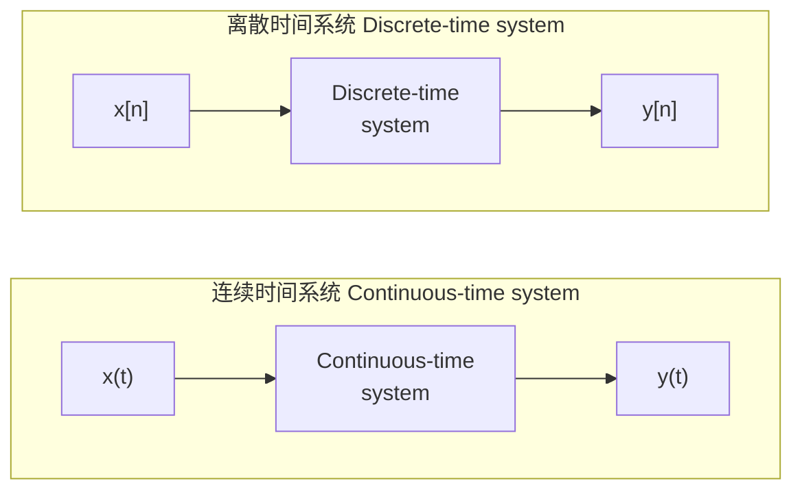
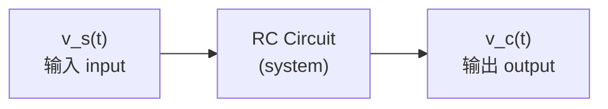
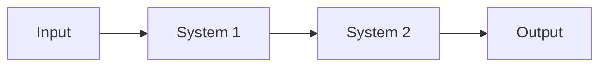
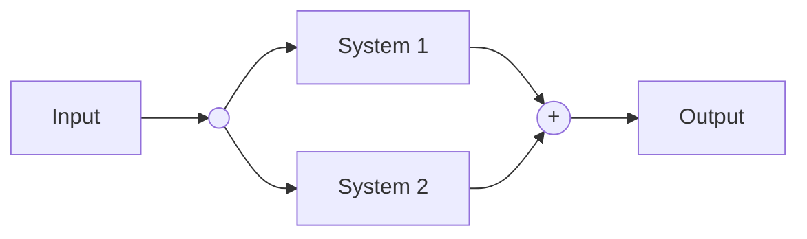
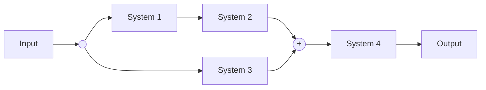
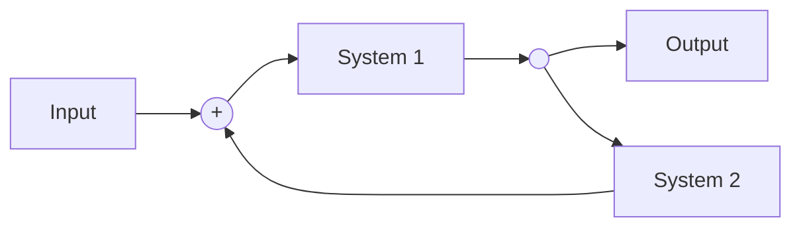
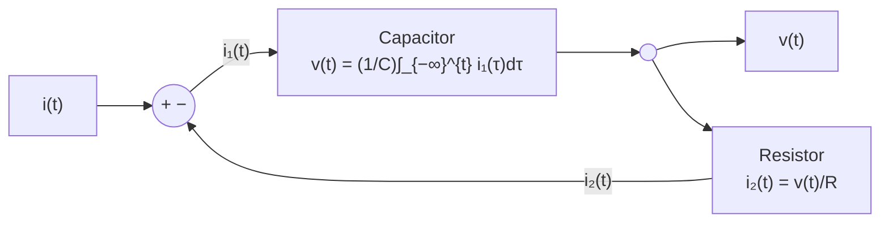

# 1.5 连续时间与离散时间系统 Continuous-time and Discrete-time Systems

> [!abstract] 本节结构
> ```mermaid
> flowchart TD
>     A["1.5 连续时间与离散时间系统"] --> B["系统的定义 Definition"]
>     A --> C["系统的表示 Representation"]
>     A --> D["1.5.1 系统举例<br/>Simple Example of systems"]
>     A --> E["1.5.2 系统的互联<br/>Interconnections of System"]
>     D --> D1["Example 1.8 连续时间：RC 电路"]
>     D --> D2["Example 1.10 离散时间：银行账户"]
>     E --> E1["(1) 串联/级联 Series (Cascade)"]
>     E --> E2["(2) 并联 Parallel / 串并联 Series-Parallel"]
>     E --> E3["(3) 反馈 Feed-back"]
> ```

---

## 系统的定义 Definition

> [!important] 课件给出的两个定义（原文）
> **(1) Interconnection of Components, device, subsystem.（Broadest sense）**
> 系统是**元件、器件、子系统的互联**（最广义的定义）。
>
> **(2) A process in which signals can be transformed or result in other signals.**
> 系统是一个**把信号变换成其他信号的过程**。

> [!note] 补充讲解：两个定义的分工
> - 定义 (1) 是**结构视角 (structural view)**：系统是"由什么搭成的"——电阻、电容、放大器、代码模块。
> - 定义 (2) 是**功能视角 (functional view)**：系统是"输入信号 → 输出信号"的**映射 (mapping)**。
>
> **本课几乎只用定义 (2)**：我们不关心系统内部怎么搭的，只关心它把 $x$ 变成什么样的 $y$。
> 这种"黑箱 (black box)"抽象，正是同一套数学能同时描述电路、机械、经济、神经网络的原因。

> [!note] 课堂讲法：系统是一个"盒子"
> 老师引入系统时给了一个形象的说法：**系统就是一个盒子**——接一个输入项、出一个输出项，这就是一个系统。
> - **连续时间系统**：输入是连续时间信号、输出也是连续时间信号；
> - **离散时间系统**：输入是离散时间信号、输出也是离散时间信号。
>
> 现实例子：**电路**（电流驱动、连续）↔ **计算机/CPU**（编程处理、离散）。你在编程（如 MATLAB）里读进来的信号全是序列——第一个点、第二个点……甚至是矩阵、张量，**现代信号处理几乎全是离散的**；而最物理的形态（电路）是连续的。你们专业学的**数电 vs 模电**，正是这一对"离散 vs 连续"的差别。

> [!tip] 信号是函数，系统是方程
> 一句话分清"信号"和"系统"：
> - **信号 (signal) 是一个函数**——$x(t)$ 就是 $t$ 的函数；
> - **系统 (system) 是一个方程**——描述的是**输入信号与输出信号之间的关系**。
>   比如 $y[n]=y[n-1]+1.01y[n-1]+x[n]$，它不是一个信号，而是 $x$ 与 $y$ 两个信号之间的关系式。
>   习惯上输入用 $x$、输出用 $y$。
>
> **书写习惯**：把系统方程**调整成"输入项全在右边、输出项全在左边"的标准形式**（尤其对 LTI 系统）——两种写法等价，只是标准形式便于判读。

---

## 系统的表示 Representation of System

> [!important] 记号
> **连续时间系统 Continuous-time system：**
> $$x(t)\ \xrightarrow{\quad L\quad}\ y(t)$$
> **离散时间系统 Discrete-time system：**
> $$x[n]\ \xrightarrow{\quad L\quad}\ y[n]$$
>
> 其中 $L$ 表示系统所实现的**算子 (operator)**（课件用 $L$，其他教材常写 $\mathcal{T}\{\cdot\}$ 或 $H\{\cdot\}$）。

**框图表示 Block diagram：**



> [!warning] 箭头方向的含义
> 框图中的箭头表示**信号流向 (signal flow)**，不是"等号"。
> $x\to y$ 意味着"$y$ 由 $x$ 决定"，反过来一般不成立（除非系统可逆，见 [[C1.6 系统的基本性质]] 1.6.2）。

---

## 1.5.1 系统举例 Simple Example of systems

### Example 1.8（连续时间）：RC 电路 RC Circuit（拓展：课堂上跳过未讲）

![[C1-RC电路示例.png]]

系统框图：



**建模过程（课件原式）：**

由欧姆定律与电容伏安关系，流过电阻与电容的是同一个电流：

$$
i(t)=\frac{v_s(t)-v_c(t)}{R}=C\,\frac{dv_c(t)}{dt}
$$

整理得到**输入输出关系 (The relationship between the input and output)**：

$$
\boxed{\ \frac{dv_c(t)}{dt}+\frac{1}{RC}\,v_c(t)=\frac{1}{RC}\,v_s(t)\ }
$$

> [!note] 补充讲解：逐步推导
> 1. 电阻两端电压为 $v_s(t)-v_c(t)$，故 $i(t)=\dfrac{v_s(t)-v_c(t)}{R}$。
> 2. 电容伏安关系 $i(t)=C\dfrac{dv_c(t)}{dt}$。
> 3. 两式相等：$\dfrac{v_s-v_c}{R}=C\dfrac{dv_c}{dt}$。
> 4. 两边同除以 $RC$ 并移项：$\dfrac{dv_c}{dt}+\dfrac{1}{RC}v_c=\dfrac{1}{RC}v_s$。
>
> 这是一个**一阶线性常系数微分方程 (first-order linear constant-coefficient differential equation, LCCDE)**。
> **时间常数 $\tau=RC$**，$RC$ 越大系统响应越慢（电容充电越慢）。

> [!important] 这类方程为什么重要
> **连续时间 LTI 系统的绝大多数工程模型都是 LCCDE**：
> $$\sum_{k=0}^{N}a_k\frac{d^k y(t)}{dt^k}=\sum_{k=0}^{M}b_k\frac{d^k x(t)}{dt^k}$$
> 第 9 章的拉普拉斯变换会把这类微分方程**变成代数方程**求解——这正是"换域"的价值。

### Example 1.10（离散时间）：银行账户余额 Balance in a bank account

> [!example] 题设（课件原文）
> **A simple model for the balance in a bank account from month to month:**
> 
> | 符号 | 含义 |
> |---|---|
> | $y[n]$ | **balance at the end of $n$th month**（第 $n$ 月月末余额） |
> | $x[n]$ | **net deposit**（当月净存入） |
> | 1% | **interest each month**（月利率 1%） |

系统框图：


**建模（课件原式）：**

$$
y[n]=y[n-1]+1\%\cdot y[n-1]+x[n]
$$

$$
\boxed{\ y[n]-1.01\,y[n-1]=x[n]\ }
$$

> [!note] 补充讲解：这个式子在说什么
> 本月月末余额 = 上月月末余额 + 上月余额产生的利息 + 本月净存入
> $$y[n]=\underbrace{y[n-1]}_{\text{本金}}+\underbrace{0.01\,y[n-1]}_{\text{利息}}+\underbrace{x[n]}_{\text{新存入}}=1.01\,y[n-1]+x[n]$$
>
> 这是**一阶线性常系数差分方程 (first-order linear constant-coefficient difference equation)**，是连续情形 LCCDE 的离散对应物。
> 一般形式：
> $$\sum_{k=0}^{N}a_k\,y[n-k]=\sum_{k=0}^{M}b_k\,x[n-k]$$
> 第 10 章的 Z 变换处理它，正如拉普拉斯变换处理微分方程。

> [!note] 课堂版题设：每月发工资存钱
> 老师课上用生活化场景讲这个例子：**每个月发工资后存入一部分**——第 $n$ 个月的新存入（deposit）是 $x[n]$，第 $n$ 个月月底的账户总额是 $y[n]$。
> 账户有利息，当月利息按 1% 计：
>
> 本月总额 = 上月余额 + 上月余额这一个月产生的利息 + 本月新存入
>
> 与课件的 "net deposit" 版本是同一个模型、两种讲法，结论一致。

> [!tip] 两个例子的共同点
> | | RC 电路 | 银行账户 |
> |---|---|---|
> | 类型 | 连续时间 | 离散时间 |
> | 方程 | 微分方程 $\dfrac{dv_c}{dt}+\dfrac{1}{RC}v_c=\dfrac{1}{RC}v_s$ | 差分方程 $y[n]-1.01y[n-1]=x[n]$ |
> | 阶数 | 一阶 | 一阶 |
> | 输出依赖 | 当前值 + 变化率 | 当前输入 + 前一时刻输出 |
> | 变换工具 | Laplace（第 9 章） | Z 变换（第 10 章） |
>
> **两者数学结构完全平行**——这就是本课始终把连续与离散并排讲的原因。
> 注意：银行账户的输出 $y[n]$ 依赖于 $y[n-1]$，**系统有"记忆"**，见 [[C1.6 系统的基本性质]] 1.6.1。

---

## 1.5.2 系统的互联 Interconnections of System

### (1) 串联 / 级联 Series (Cascade) interconnection



> [!note] 课堂速记：三种连接方式的一句话记忆
> - **串联/级联 (series/cascade)**：第一个子系统的输出直接作第二个子系统的输入，首尾相接。
> - **并联 (parallel)**：同一个输入分送多个子系统，输出相加。
> - **反馈 (feedback)**：子系统的**输出被送回来**（feedback 的字面意思就是"喂回来"），作为前面子系统输入的一部分——与并联长得像但不同，区别就在这条**回来的路径**。
>
> 中文里 series 又叫级联、串联、cascade，是同一个意思（series 也就是傅里叶级数里的"级数"）。

> [!note] 补充讲解
> 前一个系统的输出直接作为后一个系统的输入。
> 若两系统均为 LTI，则总冲激响应为 $h(t)=h_1(t)*h_2(t)$（第 2 章），且**级联次序可交换**：$h_1*h_2=h_2*h_1$。
> **注意**：这个交换律只对 LTI 成立，非线性或时变系统**不能随意换序**。

### (2) 并联 Parallel interconnection



> [!note] 补充讲解
> 同一输入同时送入两个系统，输出相加。
> LTI 情形下总冲激响应为 $h(t)=h_1(t)+h_2(t)$。

> [!note] 课堂联想：并行计算
> parallel 就是"并行"。老师课上把并联结构直接连到**并行计算**：再复杂的运算，拆成好多个子系统同时算（GPU 加速、分布式计算），每个负责一小部分，最终把结果加起来——这就是并联的思想。
> **复杂的系统可以无限拆解成子系统**：神经网络再大规模，拆到底也就那几种运算层。

### 串并联 Series-Parallel interconnection



> [!tip] 对应的 LTI 总冲激响应
> $$h=\bigl(h_1*h_2+h_3\bigr)*h_4$$
> 串联对应**卷积**，并联对应**相加**。复杂框图的化简就是反复用这两条规则。

### (3) 反馈互联 Feed-back interconnection



> [!important] 反馈的关键特征
> **输出被送回来影响输入**，形成**闭环 (closed loop)**。
> 这与串联、并联的**开环 (open loop)** 结构本质不同：反馈系统的方程是**隐式的**（输出出现在等式两边），必须解方程才能得到输入输出关系。

> [!note] 补充讲解：反馈为什么重要
> - **自动控制**的全部基础（恒温器、巡航定速、机器人关节控制）。
> - 能**降低对元件参数的敏感度**、**改善稳定性**（负反馈），但设计不当也会**引起振荡**（正反馈）。
> - 上面 1.5.1 的**差分方程 $y[n]=1.01y[n-1]+x[n]$ 本身就是一个反馈结构**：输出经过延迟和放大后回到输入端。

> [!note] 课堂例子：自动巡航的闭环 vs 开环
> 反馈连接就是**闭环系统 (closed loop)**，自动控制的电路全是这种结构。老师用**汽车自动巡航**举例：
> 系统监测车速输出，车速太大了 → 控制器**减油门** → 车速慢下来——输出的结果被重新送回输入端作为输入的一部分，形成闭环调节。
> 而串/并联电路是**开环 (open loop)**：信号一直朝一个方向流，没有回来的路径——**所以开环做不了控制**。
> 这就是"闭环 = 控制的基础"的由来。

### 反馈互联实例 Example of Feed-back interconnection

![[C1-反馈互联实例-RC并联电路.png]]

> [!example] 电路：电流源 $i(t)$ 驱动的 $C$ 与 $R$ 并联电路
> **电路方程：**
> - 电流源提供 $i(t)$，分成流入电容的 $i_1(t)$ 与流入电阻的 $i_2(t)$
> - **电容 Capacitor（作为一个子系统）**：$\displaystyle v(t)=\frac{1}{C}\int_{-\infty}^{t}i_1(\tau)\,d\tau$
> - **电阻 Resistor（作为另一个子系统）**：$\displaystyle i_2(t)=\frac{v(t)}{R}$
> - 节点电流：$i_1(t)=i(t)-i_2(t)$

对应的反馈框图：



> [!important] 课件原句
> **$v(t)$ can be viewed as the output of the capacitor or the input to the resistor.**
> $v(t)$ 既可以看作**电容（子系统）的输出**，也可以看作**电阻（子系统）的输入**。
>
> **这句话是理解框图的关键**：同一个物理量在不同的子系统视角下扮演不同角色，正是"系统互联"这个抽象的意义所在。
> 求和点标的是 "$+$" 和 "$-$"：$i_1=i-i_2$，即**负反馈 (negative feedback)**。

> [!note] 补充讲解：把框图还原成方程
> 由 $i_1=i-i_2$、$i_2=v/R$、$v=\frac1C\int i_1$，对 $v$ 求导：
> $$C\frac{dv}{dt}=i_1=i-\frac{v}{R}\ \Longrightarrow\ \frac{dv(t)}{dt}+\frac{1}{RC}v(t)=\frac{1}{C}i(t)$$
> 又回到了与 Example 1.8 **同构的一阶微分方程**。
> **框图与方程是同一个系统的两种表示**，可以互相转换。

---

## 三种互联方式对照

| 互联方式 | 结构 | LTI 总冲激响应 | 特点 |
|---|---|---|---|
| **串联 Series/Cascade** | 首尾相接 | $h=h_1*h_2$ | 开环；LTI 时可换序 |
| **并联 Parallel** | 同输入、输出相加 | $h=h_1+h_2$ | 开环 |
| **反馈 Feed-back** | 输出回送到输入端 | 需解方程（闭环公式） | 闭环；控制系统的基础 |

---

## 本节自测 Self-Test

> [!question] 1. 课件给的系统两个定义分别是什么视角？本课主要用哪个？
> **A**：(1) 元件/器件/子系统的互联——结构视角；(2) 把信号变换为其他信号的过程——功能视角。本课主要用 (2)，把系统当黑箱映射。

> [!question] 2. 写出 RC 电路的输入输出微分方程，并说明时间常数。
> **A**：$\dfrac{dv_c(t)}{dt}+\dfrac{1}{RC}v_c(t)=\dfrac{1}{RC}v_s(t)$。时间常数 $\tau=RC$，越大响应越慢。

> [!question] 3. 银行账户模型的差分方程是什么？各项的物理含义？
> **A**：$y[n]-1.01y[n-1]=x[n]$。$y[n-1]$ 是上月余额，$0.01y[n-1]$ 是当月利息，$x[n]$ 是当月净存入。

> [!question] 4. 微分方程与差分方程分别用哪种变换求解？
> **A**：微分方程用**拉普拉斯变换**（第 9 章），差分方程用 **Z 变换**（第 10 章）。二者都把方程从"微分/差分"降为"代数"。

> [!question] 5. 串联与并联的 LTI 冲激响应分别怎么合成？
> **A**：串联 $h=h_1*h_2$（卷积）；并联 $h=h_1+h_2$（相加）。

> [!question] 6. 反馈互联与串/并联最本质的区别是什么？
> **A**：反馈是**闭环**——输出回送影响输入，输入输出关系是隐式的，需解方程；串/并联是**开环**，可直接逐级代入。

> [!question] 7. 在 RC 并联反馈例中，$v(t)$ 为什么"既是输出又是输入"？
> **A**：它是电容子系统的输出（由 $i_1$ 积分得到），同时又是电阻子系统的输入（决定 $i_2=v/R$）。这正是反馈回路闭合的地方。

---

## 相关笔记 Related Notes

- [[信号与系统 MOC]]
- 上一节：[[C1.4 单位冲激与单位阶跃函数]]
- 下一节：[[C1.6 系统的基本性质]]
