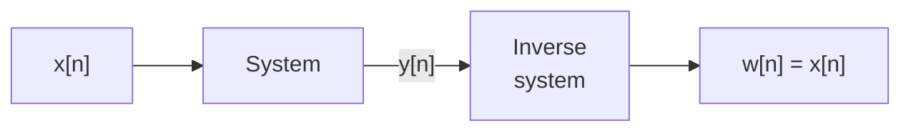
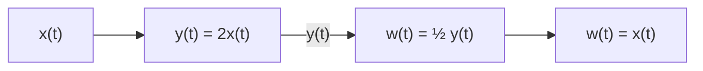
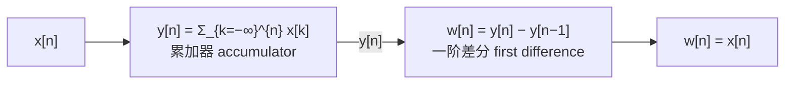
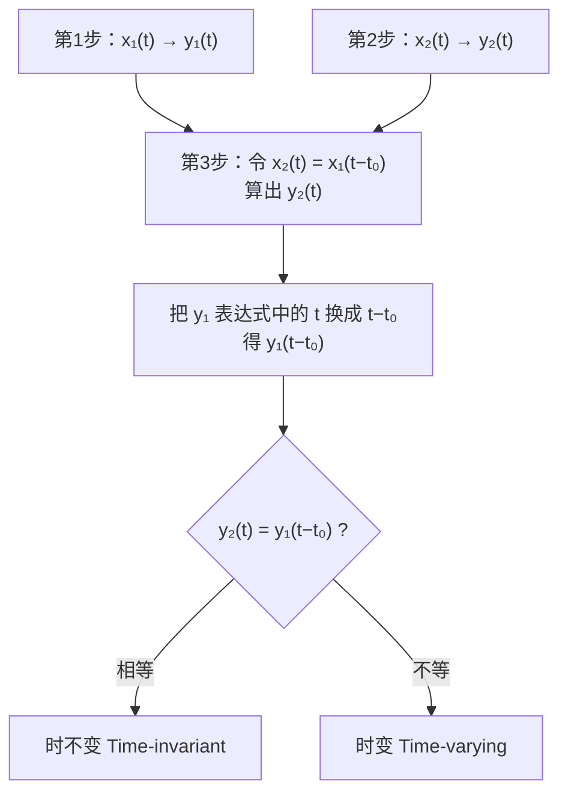
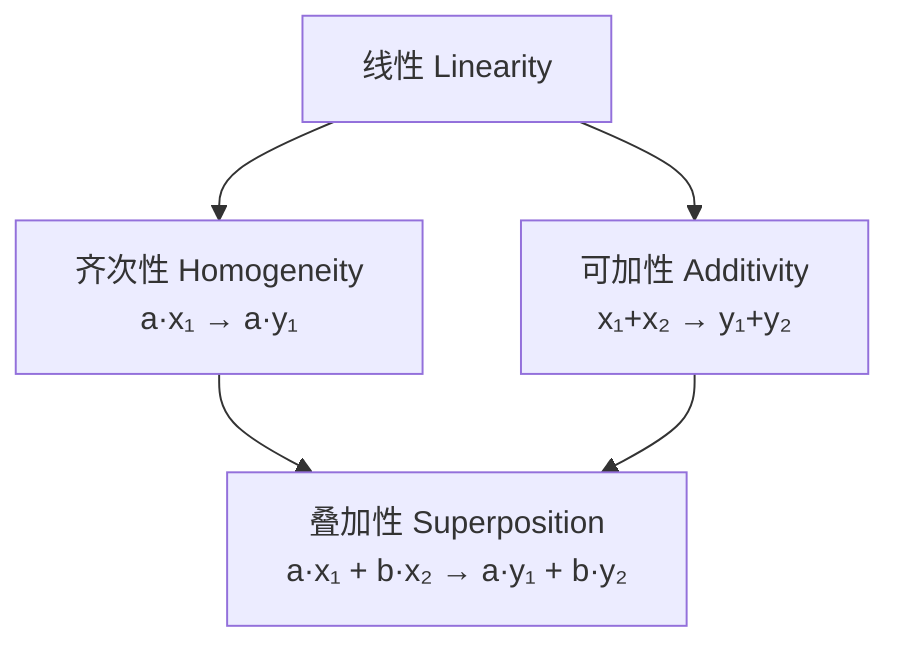
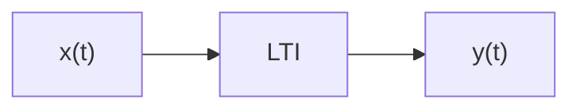

# 1.6 系统的基本性质 Basic System Properties

> [!info] 授课进度说明
> 第四节课转写稿**只覆盖到 1.6.1 记忆性（讲到电容例处截止）**，1.6.1 已按课堂内容完善并融入讲授内容；
> **1.6.2 可逆性起尚未讲授**，那部分按课件与教材整理，暂不逐条标注拓展，待后续转写稿补充后再按同一规则标。

> [!abstract] 六大性质总览
> ```mermaid
> flowchart TD
>     A["1.6 系统的基本性质"] --> P1["1.6.1 记忆性<br/>Memory"]
>     A --> P2["1.6.2 可逆性<br/>Invertibility"]
>     A --> P3["1.6.3 因果性<br/>Causality"]
>     A --> P4["1.6.4 稳定性<br/>Stability"]
>     A --> P5["1.6.5 时不变性<br/>Time Invariance"]
>     A --> P6["1.6.6 线性<br/>Linearity"]
>     P5 --> LTI["线性时不变系统 LTI System<br/>全课程的核心研究对象"]
>     P6 --> LTI
> ```

> [!important] 本节的地位
> 这六条性质是**给系统分类的六把尺子**。其中 **线性 (Linearity) + 时不变 (Time Invariance)** 合起来定义了 **LTI 系统**——**本课后面九章全部只研究 LTI 系统**。
> 原因：只有 LTI 系统才能用**冲激响应 + 卷积**完整刻画，才能用**傅里叶/拉普拉斯/Z 变换**把卷积变成乘法。

---

## 1.6.1 有记忆与无记忆系统 Systems with and without Memory

> [!important] 定义（课件原文）
> **Memoryless System: Its output at a given time is dependent only on the input at the same time.**
> **无记忆系统**：某时刻的输出**只**取决于**同一时刻**的输入。
>
> **Note: A system with memory means that it retains or stores information about input values at times other than the current time.**
> **有记忆系统**：会**保留或存储**当前时刻以外的输入信息。

> [!note] 判别特征 Features（课件原文）
> **No capacitor, no conductor, no delayer.**
> 无记忆系统内部**没有电容、没有电感、没有延迟器**——这三样正是"储能/存储"元件。

### 例子对照

| 无记忆系统 Memoryless   | 有记忆系统 With memory                                                                                                           |
| ------------------ | --------------------------------------------------------------------------------------------------------------------------- |
| $y[n]=C\,x[n]$     | $y[n]=x[n-1]$，$y[n]=x[n+1]$                                                                                                 |
| $v(t)=R\,i(t)$（电阻） | $\displaystyle y[n]=\sum_{k=-\infty}^{n}x[k]\ \Longleftrightarrow\ y[n]=y[n-1]+x[n]$（累加器）                                   |
|                    | $\displaystyle y(t)=\frac{1}{C}\int_{-\infty}^{t}x(\tau)\,d\tau\ \Longleftrightarrow\ \frac{dy(t)}{dt}=\frac{1}{C}x(t)$（电容） |

> [!note] 补充讲解
> - **电阻 $v=Ri$ 无记忆**：此刻电压只由此刻电流决定。
> - **电容有记忆**：电压是电流的积分，取决于**全部历史**。
> - **延迟器 $y[n]=x[n-1]$ 有记忆**：需要"记住"上一时刻的输入。
> - **$y[n]=x[n+1]$ 也有记忆**——它用到了**未来**的输入，同样不是"同一时刻"。
>
> **注意**：记忆性只问"是否只用当前时刻"，**不问用的是过去还是未来**。那是因果性的事。
>
> 累加器的两种写法等价：$y[n]=\sum_{k\le n}x[k]$（直接形式）与 $y[n]=y[n-1]+x[n]$（递归形式），后者更节省计算，也更清楚地显示"记忆"存在何处。

> [!note] 课堂表述与两个例子
> 老师的中文表述：**"当前时刻的输出只取决于当前时刻的输入"就是无记忆系统**——没有任何延迟、瞬间响应（"马上反应"）。
> - **电阻**：只有一个电阻的电路，$v(t)=Ri(t)$，电压随电流瞬间变化 ⇒ 无记忆。
> - **银行账户**：$y[n]$ 不仅与 $x[n]$ 有关，还与 $y[n-1]$ 有关——而 $y[n-1]$ 又与 $x[n-1]$、$y[n-2]$……有关，**一层层迭代下去，当前余额其实和这个月之前每个月存入的钱都有关** ⇒ 有记忆。
>
> 这个"迭代链条"正是理解"记忆"的关键：递归形式把历史一层层藏在了 $y[n-1]$ 里。

> [!definition] 系统的记忆长度
> 系统输出 $y(t_0)$ 或 $y[n_0]$ 在某一时刻的取值，依赖于输入信号**多长时间范围**内的取值，这个范围的大小就是「记忆长度」。

> [!note] 无记忆系统 vs 有记忆系统
> **无记忆系统（memoryless）**：输出 $y(t_0)$ 只取决于输入**同一时刻**的值 $x(t_0)$，与过去、未来无关。
>
> 例：$y(t) = 2x(t)$，或 $y[n] = x[n]^2$
>
> **有记忆系统（memory）**：输出 $y(t_0)$ 依赖于**除当前时刻之外**的其他时刻的输入值（过去或未来）。
>
> 例：
> - $y[n] = x[n-1]$（依赖过去一个时刻）
> - $y(t) = \int_{-\infty}^{t} x(\tau)\,d\tau$（依赖整个过去）
> - $y[n] = x[n+1]$（依赖未来，非因果但仍「有记忆」）

> [!tip] 直观理解
> 可以想象系统需要「记住」多久之前（或多久之后）的输入信息，才能算出当前输出：
>
> - 记忆长度为 0 → 无记忆系统
> - 记忆长度有限（只依赖 $x(t)$ 在 $[t-T,\ t]$ 区间内的值）→ 有限记忆
> - 记忆长度无限（依赖 $-\infty$ 到 $t$ 的全部历史，如积分器）→ 无限记忆
>
> | 系统 | 是否有记忆 | 说明 |
> | --- | --- | --- |
> | $y(t) = x(t)^2$ | 无记忆 | 只用当前时刻的值 |
> | $y[n] = x[n] + x[n-1]$ | 有记忆 | 用到了 $n-1$ 时刻的值 |
> | $y(t) = x(t-5)$ | 有记忆（纯延时） | 只用到一个过去时刻，但仍算有记忆 |
> | $y(t) = \int_{-\infty}^{t} x(\tau)\,d\tau$ | 无限记忆 | 依赖全部历史 |

> [!important] 记忆长度 = 输入偏移量的最大值
> 记忆长度 = 输出在时刻 $n$ 时，所需输入相对当前时刻**偏移量的最大值**，不要求同时用到中间的时刻。
>
> - 只用到 $x[n]$ → 记忆长度 0
> - 用到 $x[n],\ x[n-1]$ → 记忆长度 1
> - 用到 $x[n],\ x[n-1],\ x[n-2]$ → 记忆长度 2（以最远的为准）
>
> 即使系统只是 $y[n] = x[n-2]$（不含 $x[n]$、$x[n-1]$），记忆长度依然是 2——看的是「最远用到多久之前」，不是「用到了几个时刻」。

> [!warning] 判定小技巧
> 判断有无记忆时，代入一个具体的 $t_0$ 或 $n_0$，看等式右边出现的自变量是否**只有** $t_0$（或 $n_0$）本身。只要出现了其他时刻（哪怕只差一点点，比如 $t-\epsilon$），就是有记忆系统。

---

## 1.6.2 可逆性与逆系统 Invertibility and Inverse Systems

> [!important] 定义（课件原文）
> **(1) A system is said to be invertible, if distinct inputs lead to distinct outputs (one to one correspondence).**
> 若**不同的输入产生不同的输出**（一一对应），则称系统**可逆**。
>
> **(2) If a system is invertible, then an inverse system exists, and when the inverse system cascaded with the original system, it will yield an output equal to the input.**
> 若系统可逆，则存在**逆系统 (inverse system)**；逆系统与原系统**级联 (cascaded)** 后，输出等于输入。



### 可逆系统的例子 Invertible system

**例 (b)（连续时间）：**



**例 (c)（离散时间）：累加器与其逆——差分器**



> [!note] 补充讲解
> 累加器与差分器互为逆系统，正如**积分与微分**互逆、$\delta[n]$ 与 $u[n]$ 通过求和/差分互推（见 [[C1.4 单位冲激与单位阶跃函数]]）。

### 不可逆系统的例子 Noninvertible system

$$y[n]=0 \qquad\qquad y(t)=x^{2}(t)$$

> [!warning] 为什么不可逆
> - **$y[n]=0$**：所有输入都映射到同一个输出（恒零），**信息全部丢失**，无法反推。
> - **$y(t)=x^2(t)$**：$x(t)=+1$ 与 $x(t)=-1$ 给出同一个输出 $y=1$，**不满足一一对应**，无法确定符号。
>
> **判别不可逆的标准手法：找出两个不同的输入，让它们产生完全相同的输出。** 找到一组反例即可。

---

## 1.6.3 因果性 Causality

> [!important] 定义（课件原文）
> **A system is causal if the output at any time depends only on values of the input at the present time and in the past. (Non-anticipative)**
> 若任意时刻的输出**只取决于当前及过去**的输入，则系统是**因果的**。（又称**非超前的 non-anticipative**）

### 例子对照

| **Causal 因果** | **Non-causal 非因果** |
|---|---|
| $y[n]=x[n]-x[n-1]$ | $y[n]=x[n]-x[n+1]$（用到未来 $x[n+1]$） |
| $y[n]=x[n]$ | $\displaystyle y[n]=\frac{1}{2M+1}\sum_{k=-M}^{+M}x[n-k]$（滑动平均，$k$ 取负时用到未来） |

> [!important] 课件强调
> **Memoryless systems are causal.**
> **无记忆系统一定是因果的**（只用当前时刻，当然没用未来）。
> 反之不成立：因果系统可以有记忆（如 $y[n]=x[n-1]$）。

> [!important] 初始松弛条件 Condition of initial rest（课件原文）
> **For a causal system, if $x(t)=0$ for $t<t_0$, there must be $y(t)=0$ for $t<t_0$.**
> 对因果系统，若输入在 $t<t_0$ 时恒为 0，则输出在 $t<t_0$ 时也必须恒为 0。

> [!note] 补充讲解：为什么"滑动平均"是非因果的
> $$y[n]=\frac{1}{2M+1}\sum_{k=-M}^{+M}x[n-k]=\frac{1}{2M+1}\bigl(x[n+M]+\cdots+x[n]+\cdots+x[n-M]\bigr)$$
> 求和包含 $x[n+M],\dots,x[n+1]$——**未来的样本**。
> 这类系统在**实时处理**中无法实现（未来数据还没到），但在**离线/批处理**中完全可行（整段音频、整张图像都已存好）。
> **CNN 的卷积核就是典型的非因果滤波器**——它同时看像素的左右/上下邻域。因果性只有在"自变量真的是时间且要实时"时才是硬约束。

> [!warning] 因果性 vs 记忆性 —— 别混
> ```mermaid
> flowchart TD
>     A["y[n] 用到哪些时刻的 x?"] --> B{"只有 n 当前时刻?"}
>     B -- "是" --> C["无记忆 memoryless<br/>（同时也一定因果）"]
>     B -- "否" --> D{"是否用到 n 之后?"}
>     D -- "否（只用过去）" --> E["有记忆 + 因果"]
>     D -- "是（用到未来）" --> F["有记忆 + 非因果"]
> ```

---

## 1.6.4 稳定性 Stability

> [!important] 定义
> **A stable system is one in which small inputs lead to responses that do not diverge.**
> **稳定系统**是指：小的输入不会导致发散的响应。
>
> **Bounded input lead to bounded output（有界输入 → 有界输出）：**
> $$\text{if } |x(t)|<M,\ \text{then } |y(t)|<N$$

> [!note] 补充讲解：这就是 BIBO 稳定
> 上述判据的标准名称是 **BIBO 稳定 (Bounded-Input Bounded-Output stability)**。
> 关键点：**$M$ 和 $N$ 都必须是有限常数**，且要求"对**任何**有界输入都成立"。
> 要证明不稳定，只需**找出一个**有界输入使输出无界即可（例如对累加器输入 $x[n]=u[n]$，输出 $y[n]=n+1\to\infty$）。

### 例子 Examples

![[C1-汽车受力示例.png]]

- **Motion of automobile（汽车运动）**：稳定。摩擦力 $\rho V$ 随速度增大而增大，构成负反馈，速度最终收敛。
- **Stable pendulum（单摆）**：稳定。

![[C1-单摆与倒立摆.png]]

> [!example] Example 1.13：单摆 vs 倒立摆
> | 符号 | 含义 |
> |---|---|
> | $x(t)$ | **applied force**（外加力） |
> | $y(t)$ | **angular deviation from the vertical**（相对竖直方向的角偏离） |
>
> **(a) Stable pendulum（单摆，稳定）**：重力把摆拉回竖直位置，偏离会衰减。
>
> **(b) Inverted pendulum（倒立摆，不稳定）**：
> 课件原文 **The effect of the gravity is apply a force that tends to increase the deviation from the vertical.**
> 重力施加的力**趋于增大**相对竖直方向的偏离——正反馈，微小扰动就会让它倒下。

> [!tip] 稳定/不稳定的直观判据
> 看**扰动之后系统的自发倾向**：拉回平衡点 ⇒ 稳定；推离平衡点 ⇒ 不稳定。
> 倒立摆之所以是控制领域的经典 benchmark（如 Segway、火箭垂直回收、双足机器人），正因为它**本质不稳定，必须靠反馈控制才能站住**。

---

## 1.6.5 时不变性 Time Invariance

> [!important] 定义（课件原文）
> **A system is time invariant if the behavior and characteristics of the system are fixed over time.**
> 若系统的**行为和特性不随时间改变**，则称系统**时不变**。
>
> **Time-invariant system (continuous time)：**
> $$\text{If } x(t)\to y(t),\ \text{then } x(t-t_0)\to y(t-t_0)$$
>
> **Otherwise, the system is time-varying（否则称为时变系统）。**

![[C1-时不变性图示.png]]

> [!note] 图的读法
> 左列：输入 $x(t)$ → 输出 $y(t)$。
> 右列：输入延迟成 $x(t-t_0)$ → 输出**恰好也只是延迟** $y(t-t_0)$，**形状完全不变**。
> **时不变 = "今天做实验和明天做实验，结果只差一个时间平移"。**

### 判别方法 How to determine whether a system is time invariant or not?

> [!important] 课件给出的三步法 Steps
> 1. 求 $x_1(t)\to y_1(t)$
> 2. 求 $x_2(t)\to y_2(t)$
> 3. **令 $x_2(t)=x_1(t-t_0)$**，用**变量代换 (variable substitution)** 求出 $y_1(t-t_0)$，
>    然后检查 **$y_2(t)$ 是否等于 $y_1(t-t_0)$**。



> [!warning] 第 3 步是整个方法的关键，也是最容易做错的地方
> **$y_1(t-t_0)$ 的求法**：把 $y_1$ **表达式里所有的 $t$**（包括显式出现的 $t$，不只是 $x$ 括号里的）统统换成 $t-t_0$。
> **$y_2(t)$ 的求法**：把 $x_2(t)=x_1(t-t_0)$ 代进系统方程，**系统方程里显式的 $t$ 保持不变**。
> 两者的差别正好暴露"系统参数是否随时间变化"。

### Example 1：$y[n]=(n+1)\,x[n]$

$$
x[n]=x_1[n]\ \longrightarrow\ y_1[n]=(n+1)x_1[n]
$$
$$
x[n]=x_2[n]\ \longrightarrow\ y_2[n]=(n+1)x_2[n]
$$

令 $x_2[n]=x_1[n-n_0]$，则

$$
y_2[n]=(n+1)\,x_1[n-n_0]
$$

而用变量代换（把 $y_1$ 中的 $n$ 换成 $n-n_0$）：

$$
y_1[n-n_0]=(n-n_0+1)\,x_1[n-n_0]\ \neq\ y_2[n]
$$

> [!important] 结论：**So, the system is time-varying.（时变）**
> 差别在系数：$y_2$ 的系数是 $(n+1)$，$y_1[n-n_0]$ 的系数是 $(n-n_0+1)$。
> **根源**：系统方程里有一个显式的 $n$（时变增益），输入延迟时这个增益**不会跟着延迟**。
>
> **口诀：系统方程里显式出现自变量 $t$ 或 $n$（作为系数），基本就是时变系统。**

### Example 2：$y(t)=x(-t)$

$$
x(t)=x_1(t)\ \longrightarrow\ y_1(t)=x_1(-t)
$$
$$
x(t)=x_2(t)\ \longrightarrow\ y_2(t)=x_2(-t)
$$

令 $x_2(t)=x_1(t-t_0)$。**注意课件特别标注的这一步**：

$$
\boxed{\ x_2(-t)=x_1(-t-t_0)\ }
$$

所以

$$
y_2(t)=x_2(-t)=x_1(-t-t_0)
$$

而变量代换给出：

$$
y_1(t-t_0)=x_1\bigl[-(t-t_0)\bigr]=x_1(t_0-t)\ \neq\ y_2(t)
$$

> [!important] 结论：**So, the system is time-varying.（时变）**
> $x_1(-t-t_0)$ 与 $x_1(t_0-t)$ 一般不等（前者是 $-t-t_0$，后者是 $-t+t_0$）。

> [!warning] Example 2 的关键一步：$x_2(-t)=x_1(-t-t_0)$ 怎么来的
> 已知 $x_2(t)=x_1(t-t_0)$，这是一个**函数等式**，对任意自变量都成立。
> 把自变量整体换成 $-t$：$x_2(-t)=x_1\bigl((-t)-t_0\bigr)=x_1(-t-t_0)$。
> **易错**：很多人写成 $x_1(-t+t_0)$，那是把 $t_0$ 也跟着变号了——错。
> **时间反转系统一定是时变的**，因为"翻转的中心"固定在 $t=0$，不随输入平移。

---

## 1.6.6 线性 Linearity

> [!important] 定义（课件原文）
> **A linear system is a system that possesses the important property of superposition (i.e., weighted sum).**
> **线性系统**具有**叠加性 (superposition)**（即加权和）性质。

设 $x_1(t)\to y_1(t)$，$x_2(t)\to y_2(t)$，则线性要求：

| 性质 | 数学表述 |
|---|---|
| **齐次性 Homogeneity (Scaling)** | $a\,x_1(t)\ \longrightarrow\ a\,y_1(t)$ |
| **可加性 Additivity** | $x_1(t)+x_2(t)\ \longrightarrow\ y_1(t)+y_2(t)$ |
| **叠加性 Superposition（合起来）** | $\boxed{a\,x_1(t)+b\,x_2(t)\ \longrightarrow\ a\,y_1(t)+b\,y_2(t)}$ |

> [!note] 课件 Note
> **A similar definition holds in discrete time case.**（离散时间有完全相同的定义。）



> [!tip] 线性的一个必要条件：零输入 ⇒ 零输出
> 由齐次性取 $a=0$：$0\cdot x_1\to 0\cdot y_1$，即 **$x=0$ 必须给出 $y=0$**。
> 所以**任何含有非零常数项的系统（如 $y[n]=2x[n]+3$）都不是线性系统**——它叫**增量线性 (incrementally linear)**。这是随堂测第 4 题 C 选项的考点。

### 判别方法与例题 How to determine whether a system is linear or not?

#### Example 1：$y(t)=t^{2}x(t)$

**1. 可加性 Additivity：**
$$x_1(t)\to y_1(t)=t^2x_1(t),\qquad x_2(t)\to y_2(t)=t^2x_2(t)$$
$$x_1(t)+x_2(t)\to y(t)=t^2\bigl[x_1(t)+x_2(t)\bigr]=y_1(t)+y_2(t)\ ✔$$

**2. 齐次性 Scaling / homogeneity：**
$$x_1(t)\to y_1(t)=t^2x_1(t)$$
$$K\,x_1(t)\to y(t)=t^2\,K\,x_1(t)=K\,y_1(t)\ ✔$$

> [!important] 结论：**So, the system is linear.（线性）** 但同时是 **Time-varying（时变）**
> 因为系统方程里有显式的 $t^2$（时变增益）。
> **线性 ≠ 时不变，两者是独立的两把尺子。**

#### Example 2：$y(t)=4\dfrac{dx(t)}{dt}$

**1. 可加性：**
$$x_1\to y_1=4\frac{dx_1}{dt},\qquad x_2\to y_2=4\frac{dx_2}{dt}$$
$$x_1+x_2\to 4\frac{d[x_1(t)+x_2(t)]}{dt}=4\frac{dx_1}{dt}+4\frac{dx_2}{dt}=y_1+y_2\ ✔$$

**2. 齐次性：**
$$K x_1\to 4\frac{d\,[K x_1(t)]}{dt}=K\cdot 4\frac{dx_1}{dt}=K y_1\ ✔$$

> [!important] 结论：**So, the system is linear.（线性）** 且是 **Time invariant（时不变）**
> 因为求导算子不含显式的 $t$。**这是一个 LTI 系统。**

> [!tip] 两个例子的对照价值
> | 系统 | 线性？ | 时不变？ |
> |---|---|---|
> | $y(t)=t^2x(t)$ | ✔ 线性 | ✘ 时变 |
> | $y(t)=4\,dx/dt$ | ✔ 线性 | ✔ 时不变 → **LTI** |
>
> 说明**四种组合都存在**：线性时不变、线性时变、非线性时不变、非线性时变。

---

## 线性时不变系统 Linear Time-Invariant (LTI) System

> [!important] 课件原文
> **The properties of Linear and Time-invariant system can be interpreted mathematically as:**



$$
x(t-t_0)\ \longrightarrow\ y(t-t_0)
$$
$$
\boxed{\ a\,x(t)+b\,x(t-t_0)\ \longrightarrow\ a\,y(t)+b\,y(t-t_0)\ }
$$

> [!important] 这个式子为什么是全课的核心
> 它说的是：**LTI 系统对"平移 + 加权"这两种操作是"透明"的**。
> 于是只要知道系统对**一个**冲激的响应 $h$，就能推出它对**任意**输入的响应：
> $$x[n]=\sum_k x[k]\delta[n-k]\ \xrightarrow{\ \text{LTI}\ }\ y[n]=\sum_k x[k]h[n-k]=x[n]*h[n]$$
> $$x(t)=\int x(\tau)\delta(t-\tau)d\tau\ \xrightarrow{\ \text{LTI}\ }\ y(t)=\int x(\tau)h(t-\tau)d\tau=x(t)*h(t)$$
> **这就是第 2 章。** 参见 [[C1.4 单位冲激与单位阶跃函数]] 的抽样性质。

---

## 随堂测 In-class Quiz（课件原题，含解答）

> [!question] Q1（多选）Which of the following systems are **causal**?
> ❌ **A.** $y[n]=x[-n]$
> **✅ B.** $y(t)=x(t)\cos(t+1)$
> **✅ C.** $y[n]=x[n]\,x[n-2]$
> ❌ **D.** $y(t)=x(\sin(t))$
>
> **逐项解析：**
>
> **A ❌**：$y[n]=x[-n]$。取 $n=-5$：$y[-5]=x[5]$，用到了**未来**样本 ⇒ 非因果。
> （只有 $n\ge0$ 那半边才是"看过去"，$n<0$ 时看未来。）
>
> **B ✅**：$y(t)=x(t)\cos(t+1)$。虽然乘了一个含 $t$ 的函数（这使它**时变**），但 $y(t)$ 只用到 $x(t)$ **当前值** ⇒ **因果**（而且**无记忆**）。
> **别被 $\cos(t+1)$ 里的 "+1" 骗到**——那是系统自身的确定性函数，不是输入的未来值。
>
> **C ✅**：$y[n]=x[n]x[n-2]$，只用到当前与 2 步之前 ⇒ **因果**（有记忆，且非线性）。
>
> **D ❌**：$y(t)=x(\sin t)$。因果要求对**所有** $t$ 都有 $\sin t\le t$。
> 取 $t=-\dfrac{\pi}{2}\approx-1.571$：$y\!\left(-\dfrac\pi2\right)=x(-1)$，而 $-1>-1.571$ ⇒ **用到了未来时刻的输入** ⇒ **非因果**。
> （$t\ge0$ 时确实有 $\sin t\le t$，所以只看正半轴会误判——**必须检查负半轴**。）

> [!question] Q2（单选）Consider the discrete-time system $y[n]=x[n]\,x[n-2]$, is this system invertible?
> A. Invertible
> **✅ B. Noninvertible（课件标答）**
>
> **解析**：找反例即可。
> 取 $x_a[n]\equiv 1$（全 1 序列）与 $x_b[n]=(-1)^n$：
> - $x_a$：$y[n]=1\cdot1=1$（全 1）
> - $x_b$：$y[n]=(-1)^n\cdot(-1)^{n-2}=(-1)^{2n-2}=1$（也是全 1）
>
> **两个不同输入给出完全相同的输出** ⇒ 不满足一一对应 ⇒ **不可逆**。
> 更直接的理由：$y$ 是乘积，无法从乘积唯一分解出两个因子的符号；且若某处 $x[n]=0$，相邻信息就被抹掉了。

> [!question] Q3（多选）Which of the following systems are **time-invariant**?
> **✅ A.** $y(t)=\sin[x(t)]$
> ❌ **B.** $y(t)=\cos t\cdot x(t)$
> **✅ C.** $y(t)=4x^{2}(t)+3x(t)$
> ❌ **D.** $y[n]=2n\cdot x[n]$
>
> **逐项解析（用三步法）：**
>
> **A ✅**：$y_2(t)=\sin[x_1(t-t_0)]$；$y_1(t-t_0)=\sin[x_1(t-t_0)]$ ⇒ 相等 ⇒ **时不变**（但**非线性**，因为 $\sin$ 不满足叠加）。
>
> **B ❌**：$y_2(t)=\cos t\cdot x_1(t-t_0)$；$y_1(t-t_0)=\cos(t-t_0)\cdot x_1(t-t_0)$ ⇒ **不等** ⇒ **时变**。
> 系统方程里有**显式的 $t$**（增益 $\cos t$ 随时间变化）。
>
> **C ✅**：$y_2(t)=4x_1^2(t-t_0)+3x_1(t-t_0)$；$y_1(t-t_0)$ 同样 ⇒ 相等 ⇒ **时不变**（但非线性，因平方项）。
>
> **D ❌**：$y_2[n]=2n\,x_1[n-n_0]$；$y_1[n-n_0]=2(n-n_0)x_1[n-n_0]$ ⇒ 不等 ⇒ **时变**。与课件 Example 1 同型。

> [!question] Q4（多选）Which of the following systems are **linear**?
> **✅ A.** $y(t)=t\,x(t)$
> ❌ **B.** $y(t)=x^{2}(t)$
> ❌ **C.** $y[n]=2x[n]+3$
> **✅ D.** $y(t)=x(\sin(t))$
>
> **逐项解析：**
>
> **A ✅**：$a x_1+b x_2\to t(ax_1+bx_2)=a(tx_1)+b(tx_2)=ay_1+by_2$ ⇒ **线性**（但时变，与课件 Example 1 同型）。
>
> **B ❌**：$(ax_1)^2=a^2x_1^2\ne a\,x_1^2$（除非 $a=0,1$）⇒ **齐次性不成立** ⇒ 非线性。
>
> **C ❌**：常数项 3 破坏线性。检验：$x=0$ 时 $y=3\ne 0$，违反"零输入零输出"。
> 具体地：$a x_1+b x_2\to 2(ax_1+bx_2)+3$，而 $ay_1+by_2=2ax_1+2bx_2+3(a+b)$，只有 $a+b=1$ 时才相等 ⇒ 不是线性，是**增量线性 (incrementally linear)**。
>
> **D ✅**：自变量代换是**线性运算**：$a x_1(\sin t)+b x_2(\sin t)$ 恰为 $ay_1+by_2$ ⇒ **线性**（但时变、非因果，见 Q1 D）。

> [!important] 四道题合起来的启示
> **六条性质彼此独立**，一个系统可以是"线性但时变"（Q4 A）、"时不变但非线性"（Q3 A、C）、"因果但非线性"（Q1 C）、"线性但非因果"（Q4 D）。
> **做题时必须一条一条单独检验，不能靠直觉打包判断。**

---

## 六大性质速查表

| 性质 | 定义要点 | 判别关键 | 典型反例 |
|---|---|---|---|
| **记忆性 Memory** | 输出只依赖同一时刻输入 ⇒ 无记忆 | 表达式里是否只有 $x[n]$ / $x(t)$ | $y[n]=x[n-1]$ 有记忆 |
| **可逆性 Invertibility** | 不同输入 ⇒ 不同输出（一一对应） | 能否找到两个不同输入给出相同输出 | $y=x^2$、$y[n]=0$ 不可逆 |
| **因果性 Causality** | 输出只依赖当前与过去输入 | 是否用到 $x[n+k]$（$k>0$） | $y[n]=x[n+1]$ 非因果 |
| **稳定性 Stability** | 有界输入 ⇒ 有界输出（BIBO） | 找一个有界输入使输出无界 | 累加器对 $u[n]$ 输出发散 |
| **时不变性 Time Invariance** | $x(t-t_0)\to y(t-t_0)$ | 三步法；方程里有显式 $t$/$n$ 多半时变 | $y[n]=nx[n]$、$y(t)=x(-t)$ 时变 |
| **线性 Linearity** | $ax_1+bx_2\to ay_1+by_2$ | 齐次性 + 可加性；零输入是否零输出 | $y=x^2$、$y=2x+3$ 非线性 |

---

## 本节自测 Self-Test

> [!question] 1. 无记忆系统的物理特征是什么？
> **A**：内部没有电容、电感、延迟器（无储能/存储元件）。输出只取决于同一时刻的输入。

> [!question] 2. $y[n]=x[n+1]$ 有记忆吗？因果吗？
> **A**：**有记忆**（用了非当前时刻的输入），**非因果**（用了未来）。记忆性不问过去/未来，因果性才问。

> [!question] 3. 如何证明一个系统不可逆？
> **A**：找出两个不同的输入，使输出完全相同。例如对 $y[n]=x[n]x[n-2]$，取 $x\equiv1$ 与 $x=(-1)^n$，输出都是全 1。

> [!question] 4. 写出 BIBO 稳定的数学表述，以及证伪的方法。
> **A**：若 $|x|<M$（有限）则 $|y|<N$（有限），对**所有**有界输入成立。证伪只需找**一个**有界输入使输出无界。

> [!question] 5. 倒立摆为什么不稳定？
> **A**：重力施加的力**趋于增大**相对竖直方向的偏离（正反馈），微小扰动被放大。单摆则相反，重力把摆拉回平衡。

> [!question] 6. 时不变性三步法的第 3 步，$y_1(t-t_0)$ 和 $y_2(t)$ 分别怎么算？
> **A**：$y_1(t-t_0)$——把 $y_1$ 表达式中**所有** $t$（含显式系数里的）换成 $t-t_0$；$y_2(t)$——把 $x_2(t)=x_1(t-t_0)$ 代入系统方程，**方程里显式的 $t$ 不动**。两者相等则时不变。

> [!question] 7. 为什么 $y(t)=x(-t)$ 是时变的？关键代换是哪一步？
> **A**：关键是 $x_2(-t)=x_1(-t-t_0)$（把自变量整体换成 $-t$，$t_0$ 不变号）。于是 $y_2(t)=x_1(-t-t_0)$，而 $y_1(t-t_0)=x_1(t_0-t)$，二者不等。

> [!question] 8. $y[n]=2x[n]+3$ 为什么不是线性系统？
> **A**：违反"零输入零输出"（$x=0$ 时 $y=3$），齐次性不成立。它属于**增量线性系统**。

> [!question] 9. LTI 系统的两个性质合起来带来了什么关键结论？
> **A**：任意输入可分解为移位冲激的加权和，由线性 + 时不变得到 $y=x*h$（卷积）。只需一个冲激响应 $h$ 就能完整刻画系统——这是第 2 章及全课后续的基础。

---

## 相关笔记 Related Notes

- [[信号与系统 MOC]]
- 上一节：[[C1.5 连续时间与离散时间系统]]
- 相关：[[C1.4 单位冲激与单位阶跃函数]]（冲激分解 → 卷积）
- 下一章预告：**Chapter 2 Linear Time-Invariant Systems**（卷积和、卷积积分、LTI 系统性质、LCCDE、奇异函数）
