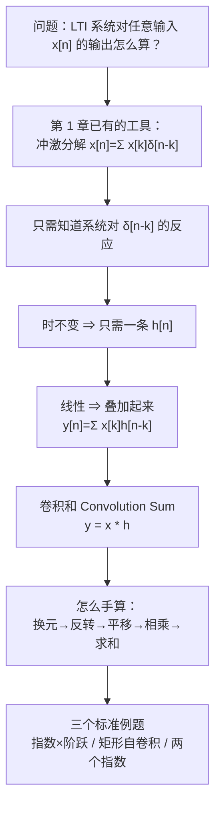

# 2.1 离散时间 LTI 系统：卷积和 The Convolution Sum

> [!abstract] 这一讲的任务
> 第 1 章最后把研究对象收缩到了 **LTI 系统**——**线性 + 时不变**。但那时我们只知道它“是什么”，还不知道怎么**算**它：给一个具体输入，输出到底长什么样？
> 这一讲要证明一件几乎不讲道理的事：**只要测出系统对一个冲激 $\delta[n]$ 的反应 $h[n]$，这个系统对任何输入的反应就全知道了。** 把两者接起来的运算叫**卷积和**，它是本课乃至整个数字信号处理的第一号工具。

> [!info] 标注说明
> 标有 **（拓展）** 或 **【拓展】** 的内容，是**课堂上没有讲到、由课件和教材延伸补充**的部分。
> 复习时可先掌握未标注的主干内容，行有余力再看拓展部分。
> 本节已由第六、七节课转写稿覆盖。

---

## 0. 开场：一个只能敲一下的系统

想象你在实验室，面前是一个**黑箱**电路：有一个输入端、一个输出端，里面是什么你不知道。你只被允许做一件事——**在输入端敲一下**（一个瞬间的、幅度为 1 的脉冲），然后记录输出端随时间冒出来的一串数。

你敲完了，记下了一串数，比如 $1,\ 0.8,\ 0.64,\ 0.512,\dots$。

现在老板说：明天我要往这个箱子里送一段完全不同的信号，你能预测输出吗？

**如果这个箱子是 LTI 的，答案是能，而且只凭你今天敲的那一下。**

这句话为什么成立？我们把它一步一步逼出来。

---

## 1. 先回忆：任何离散信号都是一堆冲激

> [!question] 停一下，先自己想想
> 我们手里已经有的“分解”工具是什么？把一个信号拆成很多**简单零件**的和，你在第 1 章见过哪一种、在时域上的那一种？

答案是 [[C1.4 单位冲激与单位阶跃函数]] 里的**第三种信号分解——冲激分解**：

![[C2-离散信号的冲激分解.png]]

> [!important] 冲激分解（抽样性质 Sifting Property）
> $$x[n]=\cdots+x[-2]\delta[n+2]+x[-1]\delta[n+1]+x[0]\delta[n]+x[1]\delta[n-1]+\cdots$$
> 合起来写成
> $$\boxed{\ x[n]=\sum_{k=-\infty}^{+\infty}x[k]\,\delta[n-k]\ }$$
> 课件把这句话叫 **Linear combinations of delayed impulses（延迟冲激的线性组合）**。

逐符号看清楚，这里最容易糊的就是 $n$ 和 $k$：

| 符号 | 身份 | 说明 |
|---|---|---|
| $n$ | **自由变量** | 你想求哪一点的值，$n$ 就是几；求和做完它还在 |
| $k$ | **哑变量（求和指标）** | 只在求和号里活着，求完就消失，换成 $m$、$l$ 完全一样 |
| $x[k]$ | **一个数**，不是信号 | 第 $k$ 个样本的高度，是权重 |
| $\delta[n-k]$ | **一个信号** | 在 $n=k$ 处为 1、其余为 0 的“位置标签” |

> [!warning] 最常见的误读
> 看到 $\sum_k x[k]\delta[n-k]$ 就以为“两个信号在相乘”。不是。$x[k]$ 在这里**只是一串系数**，真正随 $n$ 变化的是 $\delta[n-k]$。这句话在下一节会立刻派上用场。

**一个即时验证**：取 $x[n]=u[n]$，则 $x[k]=1$（$k\ge0$）、$=0$（$k<0$），代入得

$$u[n]=\sum_{k=0}^{+\infty}\delta[n-k]=\sum_{k=-\infty}^{n}\delta[k]$$

右边这个写法（把“移位冲激的和”翻译成“冲激的累加”）后面讲**阶跃响应**时会再次出现，先记着。

---

## 2. 把冲激送进系统：单位冲激响应 $h[n]$

> [!important] 定义：单位冲激响应 Unit Impulse Response
> 系统在输入为单位冲激 $\delta[n]$ 时的输出，记作 $h[n]$：
> $$\delta[n]\ \longrightarrow\ \boxed{\text{LTI}}\ \longrightarrow\ h[n]$$

这就是开场里“敲一下记下来的那串数”。它是我们唯一被允许做的实验，但接下来三步会把它放大成“全部知识”。

### 2.1 第一步：时不变性 → 移位的冲激给出移位的响应

$$\delta[n-k]\ \longrightarrow\ h[n-k]\qquad\text{(Time-invariant)}$$

**为什么？** 时不变的定义就是“输入延迟多少，输出就延迟多少，形状不变”。所以你今天敲一下得到 $h[n]$，明天同一时刻往后 $k$ 拍再敲，得到的就是整体右移 $k$ 拍的 $h[n-k]$。**不用重新测。**

### 2.2 第二步：齐次性 → 带权的冲激给出带权的响应

$$x[k]\,\delta[n-k]\ \longrightarrow\ x[k]\,h[n-k]\qquad\text{(Homogeneity)}$$

注意这里用的正是第 1 节强调的那句话：$x[k]$ **是一个常数**。线性系统里常数可以穿过系统跑到输出上去。

### 2.3 第三步：可加性 → 全部叠起来

$$\sum_{k=-\infty}^{+\infty}x[k]\,\delta[n-k]\ \longrightarrow\ \sum_{k=-\infty}^{+\infty}x[k]\,h[n-k]\qquad\text{(Additivity)}$$

左边正是 $x[n]$ 本身。于是：

> [!important] 卷积和 Convolution Sum
> $$\boxed{\ y[n]=\sum_{k=-\infty}^{+\infty}x[k]\,h[n-k]\ \triangleq\ x[n]*h[n]\ }$$
> 系统框图记作
> $$x[n]\ \longrightarrow\ \boxed{h[n]}\ \longrightarrow\ y[n]=x[n]*h[n]$$

> [!note] 为什么要发明“卷积”这个名字
> 看看 $\sum_k x[k]h[n-k]$：它是**乘法和加法的混合运算 (a mixed operation of multiplication and summation)**，写起来很长。为了简洁，就给这种混合运算起个名字、配个符号——小星号 $*$，叫**卷积**。
> 所以卷积不是凭空冒出来的数学游戏，它**就是 LTI 系统输入输出关系的简写**：
> **输出 = 输入 与 系统冲激响应 的卷积**（The output is the convolution of its input with the system's unit impulse response）。
> 在这个式子里，$h[n]$ **就代表系统**：给所有系统都喂同一个测试信号 $\delta[n]$，吐出来的 $h[n]$ 不同，系统就不同。
> 离散的叫**卷积和 convolution sum**，连续的叫**卷积积分 convolution integral**（下一讲）。

> [!question] 停一下，我们刚才干了什么
> 我们只用了 LTI 的三条性质（时不变、齐次、可加），没有假设系统是电路、是差分方程、还是别的什么。
> 结论是课件那句 **Note**：
> **A discrete-time LTI system is completely characterized by its unit impulse response $h[n]$.**
> 一个离散时间 LTI 系统被它的单位冲激响应**完全刻画**。
>
> 这就是开场问题的答案：**敲一下，就够了。**

> [!warning] 这个结论只对 LTI 成立
> 非线性系统或时变系统的 $h[n]$ 测得再准也没用——第二步和第三步都会塌掉。所以整个第 2 章的前提是 LTI；这也是为什么第 1 章要花那么大力气把系统分类。

---

## 3. 怎么手算卷积：换元 → 反转 → 平移 → 相乘 → 求和

公式写出来了，但 $\sum_k x[k]h[n-k]$ 直接盯着看是算不出来的——因为求和的**上下限会随 $n$ 变**。课件给的标准流程是把它**画出来**（To visualize the calculation）：

> [!important] 卷积和的五步计算法
> 1. **换元 Change variable**：把自变量 $n$ 换成 $k$，得到 $x[k]$、$h[k]$，横轴改叫 $k$；
> 2. **反转 Time Reversal**：$h[k]\to h[-k]$，绕纵轴翻过去；
> 3. **平移 Time Shift**：$h[-k]\to h[n-k]$，**整体右移 $n$**（$n<0$ 就是左移）；
> 4. **相乘 Multiplication**：逐点算 $x[k]\cdot h[n-k]$；
> 5. **求和 Summation**：把乘积全加起来，得到**这一个 $n$ 处**的 $y[n]$。

> [!warning] 第 3 步的位移方向最容易错
> $h[n-k]$ 是关于 **$k$** 的函数。把它写成 $h\big(-(k-n)\big)$ 就清楚了：先关于 $k$ 反转，再**右移 $n$**。
> 记一个锚点：$h[n-k]$ 在 $k=n$ 处取到 $h[0]$——**翻转后的“头”落在 $k=n$**。图上永远先标出 $k=n$ 这条线。

> [!tip] 固定一个，滑动另一个
> 实际操作时，**让一个信号固定不动，另一个翻转后滑动**。固定 $x$、滑动 $h$ 可以；固定 $h$、滑动 $x$ 也可以——因为卷积满足**交换律**（乘法和加法都满足交换律，它们的混合运算也满足，证明见 [[C2.3 LTI系统的性质]]）。哪个简单就翻哪个。
> 滑动时只盯**一个点**：原来 $k=0$ 处的 $h[0]$，平移后一定落在 $k=n$ 处。形状不变，只有位置在变。
> 最后得到的 $y[n]$ 是**分段函数**，因为 $n$ 取不同值时求和的上下限不同。

**第 5 步为什么必须分段？** 因为 $x[k]$ 和 $h[n-k]$ 的**重叠区间**随 $n$ 变。$n$ 小的时候可能完全不重叠（$y[n]=0$），$n$ 增大后重叠区间一段段变化，每一段对应一个不同的求和上下限，也就对应答案里的一段表达式。**卷积题的全部难点就在“分几段、每段的上下限是什么”。**

---

## 4. 例题 2.3：$u[n] * a^n u[n]$

> [!example] Example 2.3
> $x[n]=u[n]$，$h[n]=a^nu[n]$，$0<a<1$，求 $y[n]=x[n]*h[n]$。

![[C2-卷积四步法-阶跃与指数.png]]

**第 1–2 步**：画出 $x[k]=u[k]$（$k\ge0$ 全为 1）和 $h[k]=a^ku[k]$（从 1 开始按 $a$ 衰减），再把 $h$ 翻成 $h[-k]$（变成向左的衰减尾巴，头在 $k=0$）。

**第 3–5 步，分两段**：

**情形一：$n<0$。** $h[n-k]$ 的支撑是 $k\le n<0$，$x[k]$ 的支撑是 $k\ge0$，**两者没有任何重叠**：
$$y[n]=0,\qquad n<0$$

**情形二：$n\ge0$。** 重叠区间是 $0\le k\le n$，在这段里 $x[k]=1$、$h[n-k]=a^{n-k}$：
$$y[n]=\sum_{k=0}^{n}a^{n-k}$$

> [!question] 课堂追问
> 这个和怎么求？直接套等比数列公式之前，先看清楚它是从哪一项加到哪一项。

令 $m=n-k$，当 $k$ 从 $0$ 走到 $n$ 时 $m$ 从 $n$ 走到 $0$，所以
$$y[n]=\sum_{m=0}^{n}a^{m}=\frac{1-a^{\,n+1}}{1-a},\qquad n\ge0$$

合起来：
$$\boxed{\ y[n]=\frac{1-a^{\,n+1}}{1-a}\,u[n]\ }$$

**数值验算**（取 $a=0.8$）：$y[0]=1$，$y[1]=1.8$，$y[2]=2.44$，$y[3]=2.952$；直接按定义 $\sum_{k=0}^n 0.8^{n-k}$ 算得 $1,\ 1.8,\ 2.44,\ 2.952$，一致。

> [!tip] 这个结果的物理意义
> $a^nu[n]$ 是一个**一阶低通/泄漏积分器**的冲激响应（RC 电路的离散版）。输入一个阶跃，输出从 0 单调爬升，最终趋于 $\dfrac{1}{1-a}=5$（$a=0.8$）——就是图右下角那条虚线。这正是“**阶跃响应 = 冲激响应的累加**”，2.3 节会正式给出这个关系。

---

## 5. 例题 2：矩形序列的自卷积 $R_N[n]*R_N[n]$

> [!example] Example 2
> $$R_N[n]=\begin{cases}1,&0\le n\le N-1\\0,&\text{otherwise}\end{cases}$$
> 求 $y[n]=R_N[n]*R_N[n]$。

这是**分段最典型**的一道题，四段：

| 段 | $n$ 范围 | 重叠情况 | $y[n]$ |
|---|---|---|---|
| ① | $n<0$ | 不重叠 | $0$ |
| ② | $0\le n\le N-1$ | 重叠区间 $[0,\ n]$ | $\displaystyle\sum_{k=0}^{n}1=n+1$ |
| ③ | $N-1<n\le 2N-2$ | 重叠区间 $[\,n-(N-1),\ N-1\,]$ | $\displaystyle\sum_{k=n-(N-1)}^{N-1}1=2N-1-n$ |
| ④ | $n>2N-2$ | 又不重叠 | $0$ |

![[C2-矩形序列自卷积-三角.png]]

> [!warning] 第 ③ 段的上下限是全题唯一的坎
> $R_N[n-k]$ 关于 $k$ 的支撑是 $n-(N-1)\le k\le n$。当 $n$ 超过 $N-1$ 时，这个窗口的**右端 $k=n$ 已经滑出了 $x$ 的右边界 $N-1$**，所以上限被 $x$ 卡住，取 $N-1$；下限还在窗口自己手里，取 $n-(N-1)$。
> 数一数这段有几项：$(N-1)-(n-N+1)+1=2N-1-n$。**“项数 = 上限 − 下限 + 1”这一步几乎每年都有人漏掉那个 +1。**

> [!note] 分段端点归哪一段都行
> 课件 p.13 写的是 $N-1\le n<2N-2$，p.14 的汇总写的是 $N-1<n\le2N-2$，端点的归属前后不一致。这个不影响答案：在 $n=N-1$ 这一点，第 ② 段 $n+1$ 与第 ③ 段 $2N-1-n$ 都等于 $N$；在 $n=2N-2$ 这一点，第 ③ 段给出 $1$，而 $n>2N-2$ 才归第 ④ 段。**相邻两段在公共端点上取值相同，端点放在哪一边都可以**，只要不漏、不重复就行。

> [!important] 值得背下来的结论
> **两个长度为 $N$ 的矩形序列卷积 = 底宽 $2N-1$、峰值 $N$ 的三角序列**，峰值出现在 $n=N-1$。
> 两条通用规律（对有限长序列永远成立）：
> - **长度**：$L_y=L_x+L_h-1$；
> - **起点**：$n_{y,\min}=n_{x,\min}+n_{h,\min}$。
> 拿到题先用这两条算出答案的“骨架”，再去算中间的值——这是最有效的自检手段。

**数值验算**（$N=5$）：$y=[1,2,3,4,5,4,3,2,1]$，长度 $2\times5-1=9$，峰值 $5$ 在 $n=4$，与公式一致。

> [!tip] 接到 AI 上
> 这正是 **CNN 里一维卷积核的“same/full 卷积”长度公式**（`np.convolve(a,b,'full')` 的输出长度就是 $L_a+L_b-1$）。深度学习里说的 padding、输出尺寸计算，用的就是这一条。另外，矩形 * 矩形 = 三角，等价于“**两次滑动平均 = 一次三角加权平均**”，是最简单的平滑滤波器级联。

---

## 6. 例题 3：两个指数序列 $\alpha^nu[n]*\beta^nu[n]$（计算部分为拓展：课堂只讲了分段思路，计算留作作业）

> [!info] 课堂上讲到的部分
> 两个信号都是右边无穷长的衰减指数（比如 $(\frac12)^nu[n]$ 和 $(\frac13)^nu[n]$，只是衰减速度不同）。翻转平移后只有**两种情况**：$n<0$ 时没有公共区间，$y[n]=0$；$n\ge0$ 时公共非零区间是 $0\le k\le n$。下面的求和计算课堂留作业。

> [!example] Example 3
> $x[n]=\alpha^nu[n]$，$h[n]=\beta^nu[n]$，求 $y[n]$。

$$y[n]=\sum_{k=-\infty}^{+\infty}\alpha^k\underline{u[k]}\cdot\beta^{\,n-k}\underline{u[n-k]}$$

两个下划线的阶跃函数就是**上下限的来源**：$u[k]$ 要求 $k\ge0$，$u[n-k]$ 要求 $k\le n$。两个条件同时成立需要 $n\ge0$，此时 $0\le k\le n$：

$$y[n]=\sum_{k=0}^{n}\alpha^{k}\beta^{\,n-k}=\beta^{\,n}\sum_{k=0}^{n}\Big(\frac{\alpha}{\beta}\Big)^{k}$$

**这里必须分两种情况**（这正是课件给两个答案的原因）：

$$\boxed{\ y[n]=\begin{cases}\dfrac{\beta^{\,n+1}-\alpha^{\,n+1}}{\beta-\alpha}\,u[n],&\alpha\neq\beta\\[2mm](n+1)\,\alpha^{\,n}u[n],&\alpha=\beta\end{cases}}$$

> [!question] 停一下，为什么 $\alpha=\beta$ 要单列
> 因为等比求和公式 $\sum_{k=0}^n r^k=\dfrac{1-r^{n+1}}{1-r}$ 在 $r=1$ 时分母为零、公式失效。此时每一项都等于 1，共 $n+1$ 项，所以和是 $n+1$。
> 换句话说，$\alpha=\beta$ 时答案里出现的那个因子 $n+1$，**不是巧合，是“重根”的信号**——这个现象在 2.5 讲的差分方程重根解里会一模一样地再出现一次（那里叫 $C_2 n r^n$）。先记着，到时候回收。

课件最后那条 **Note** 是同一件事的记号化：
$$\sum_{k=0}^{n}\ \Longleftrightarrow\ \sum_{k=-\infty}^{+\infty}u[k]\,u[n-k]$$
**“两个阶跃相乘 = 把无穷求和夹成有限求和”**，是卷积题里换上下限的标准动作。

---

## 7. 随堂测（课件 p.16）（拓展：课堂未讲解）

> [!example] 主观题 10 分
> Compute and depict the convolution $y[n]=x[n]*h[n]$, where
> $$x[n]=\Big(\frac13\Big)^{-n}u[-n-1],\qquad h[n]=u[n-1]$$

这道题把“**左边无穷长 + 右边无穷长**”凑在一起，是反向支撑的典型题，解析见本篇末尾的自测第 5 题。先自己动手，别直接翻。

---

## 8. 列表法：有限长序列卷积的快捷算法（补充：课本上没有）

前面的“翻转 + 滑动 + 分段”是**通用方法**。但如果两个序列都是**有限长**的，还有一个更机械、更不容易错的办法——**列表法**。

**先换一种写法表示序列**：只写出非零段，用箭头 $\uparrow$ 标出 $n=0$ 的位置。例如
$$x[n]=\{-1,\ \underset{\uparrow}{0},\ 1,\ 2\},\qquad h[n]=\{\underset{\uparrow}{1},\ 1,\ 1\}$$
即 $x[-1]=-1,\ x[0]=0,\ x[1]=1,\ x[2]=2$；$h[0]=h[1]=h[2]=1$，其余都是 0。编程时输进去的就是这样一个有限长序列。

**画一张表**：横向放 $x$ 的各个值，纵向放 $h$ 的各个值，**交叉格子里填乘积**：

| | $x[-1]=-1$ | $x[0]=0$ | $x[1]=1$ | $x[2]=2$ |
|---|---|---|---|---|
| $h[0]=1$ | $-1$ | $0$ | $1$ | $2$ |
| $h[1]=1$ | $-1$ | $0$ | $1$ | $2$ |
| $h[2]=1$ | $-1$ | $0$ | $1$ | $2$ |

**沿斜线相加**：格子 $x[k]h[m]$ 对应的是 $y[k+m]$ 的一项。所以把 $k+m$ 相同的格子（从右上到左下的**反对角线**）加起来，就得到对应的 $y[n]$：

| $n$ | 参与相加的格子 | $y[n]$ |
|---|---|---|
| $-1$ | $x[-1]h[0]$ | $-1$ |
| $0$ | $x[0]h[0]+x[-1]h[1]$ | $0-1=-1$ |
| $1$ | $x[1]h[0]+x[0]h[1]+x[-1]h[2]$ | $1+0-1=0$ |
| $2$ | $x[2]h[0]+x[1]h[1]+x[0]h[2]$ | $2+1+0=3$ |
| $3$ | $x[2]h[1]+x[1]h[2]$ | $2+1=3$ |
| $4$ | $x[2]h[2]$ | $2$ |

$$y[n]=\{-1,\ \underset{\uparrow}{-1},\ 0,\ 3,\ 3,\ 2\}$$

**自检**：起点 $-1+0=-1$ ✓；长度 $4+3-1=6$ ✓；总和 $\sum y=-1-1+0+3+3+2=6$，而 $\sum x\cdot\sum h=2\times3=6$ ✓。（python `np.convolve` 复算一致。）

> [!note] 说明
> 课堂上列表法讲到“画表、交叉位置做乘法”这一步时转写稿中断了，“沿反对角线相加”这一步是按列表法的标准做法补全的。
> **适用范围**：两个序列都必须**有限长**。像 $(\frac12)^nu[n]$ 这种无限长序列，表格画不完，只能用翻转滑动法。

---

## 9. 卷积与深度学习：CNN 里的“卷积”（补充）

> [!important] CNN 里的卷积其实是“相关”
> CNN 卷积层的计算：一个 $3\times3$ 的**卷积核 convolution kernel** 盖在图像上，**对应位置相乘、全部加起来**，得到输出的一个像素；然后窗口往右滑一格、再往下滑一行……这和我们的“对齐 → 相乘 → 求和 → 滑动”完全一样。一维卷积是沿一个方向滑，图像是两个方向滑。
>
> **差别只有一处：CNN 没有翻转那一步。** 严格说它做的是**相关运算 correlation**：
> $$\text{卷积：}\ y[n]=\sum_k x[k]\,h[n-k]\qquad\qquad \text{相关：}\ r[n]=\sum_k x[k]\,h[n+k]$$
> 相关直接把 $h$ 平移，**不翻转**。

> [!question] 为什么 CNN 可以省掉翻转？
> 二维卷积核的“翻转”是什么？把 $3\times3$ 的核按行**展平 (flatten)** 成一维 $1,2,3,4,5,6,7,8,9$，一维翻转得到 $9,8,\dots,1$，再排回 $3\times3$——效果就是**把核旋转 180°**。
> 神经网络里核的 9 个参数是**训练出来的**。既然是学出来的，就直接把它当成“已经翻转好的核”，翻转这一步就没必要了。

> [!tip] 卷积层 = 最简单的 LTI 系统
> 神经网络是一个高度非线性的映射 $x\mapsto y$，由线性层和非线性层混合搭成：卷积层、全连接层是**线性层**；池化层、激活层是**非线性层**。其中卷积层就是一个**线性时不变系统**，核 $h$ 就是它的冲激响应。

### 感受野 Receptive Field（补充）

输出的一个像素，是由输入的多大一块区域算出来的——这块区域就叫**感受野**。一层 $3\times3$ 卷积的感受野是 $3\times3$。

要看得更远（捕捉更大范围的关联），最暴力的办法是**放大卷积核**：$5\times5$、$7\times7$……但每个窗口的乘法次数是 $k^2$：$9\to25\to49$，**平方增长**，每滑一步都要算一次，代价很大。

更聪明的办法是**把网络做深**：

![[C2-感受野-两层3x3等效5x5.png]]

两层 $3\times3$ 叠起来，最后一个像素对应原图 $5\times5$ 的区域——感受野和一个 $5\times5$ 核一样，但乘法只要 $9+9=18$ 次（对比 $25$ 次）。**越深，感受野越大**，这就是**深度神经网络 DNN** 里“深”的意义之一。

> [!note] 从 CNN 到 Transformer、Mamba（课堂延伸，了解即可）
> - **CNN**：擅长**局部特征**；要捕捉长距离依赖只能一层层堆，计算量大。
> - **Transformer**：用注意力机制（Q、K、V）直接计算每个位置和其他所有位置的关系，一步“跳”到很远，擅长**全局特征 / 长程依赖**，但每一对都要算，复杂度是 $O(n^2)$。实际常把两者结合：Transformer 管全局、CNN 管局部。
> - **Mamba**：基于**状态空间模型 (SSM)**，有点像 RNN 的递归结构，复杂度降到**线性**。递归结构只用几个系数就有无限长的记忆（就像累加器 $y[n]=y[n-1]+x[n]$ 等价于 $\sum_{k\le n}x[k]$），而注意力要为每个延迟项单独算一个系数，参数量大得多。Mamba 是单向的，所以又有双向 Mamba。
> - RNN 带环路、要梯度回传，有稳定性（梯度爆炸）问题；只往前传的结构没有这个问题。
>
> 这些新架构的底层逻辑仍是线性时不变系统。状态空间模型计划在实验课上再讲。

---

## 这一讲的三句话

1. **冲激分解 + 时不变 + 线性 = 卷积和。** 三步各用一条性质，缺一不可。
2. **LTI 系统 ⟺ 一条 $h[n]$。** 系统的全部信息压缩在冲激响应里，这是第 2–10 章所有方法的共同前提。
3. **手算卷积就是“翻转 + 滑动 + 分段数重叠”。** 分段依据永远是“重叠区间怎么变”，难点全在上下限。

> [!tip] 速查表
> | 名称 | 公式 |
> |---|---|
> | 冲激分解 | $x[n]=\sum_k x[k]\delta[n-k]$ |
> | 卷积和 | $y[n]=\sum_k x[k]h[n-k]=x[n]*h[n]$ |
> | 有限长卷积长度 | $L_y=L_x+L_h-1$，起点相加 |
> | $u[n]*a^nu[n]$ | $\dfrac{1-a^{n+1}}{1-a}u[n]$ |
> | $R_N*R_N$ | 三角，底宽 $2N-1$，峰值 $N$ 在 $n=N-1$ |
> | $\alpha^nu[n]*\beta^nu[n]$ | $\dfrac{\beta^{n+1}-\alpha^{n+1}}{\beta-\alpha}u[n]$；$\alpha=\beta$ 时 $(n+1)\alpha^nu[n]$ |

> [!tip] 下一讲预告
> 离散世界里信号本来就是一颗一颗的，拆成冲激天经地义。可**连续时间信号是一条连续的曲线**，你没法“一个样本一个样本”地拆它——那怎么办？
> 下一讲我们用一把宽度为 $\Delta$ 的**小矩形**去搭这条曲线，然后让 $\Delta\to0$，看求和号怎么变成积分号。

---

## 本节自测 Self-Test

> [!question] 1. 为什么“测一条 $h[n]$ 就够了”？这个结论用到了 LTI 的哪几条性质，分别用在哪一步？

> [!success]- 答案
> 三步各用一条：
> ① $\delta[n-k]\to h[n-k]$ 用**时不变性**（否则每移一位都要重测一次）；
> ② $x[k]\delta[n-k]\to x[k]h[n-k]$ 用**齐次性**（常数可以穿过系统）；
> ③ 求和号穿过系统用**可加性**。
> 缺任何一条结论都不成立，所以这是 **LTI 专属**的性质。

> [!question] 2. $x[n]=\sum_k x[k]\delta[n-k]$ 里，$x[k]$ 是信号还是数？$k$ 求完和还在吗？

> [!success]- 答案
> $x[k]$ 是**一个数**（第 $k$ 个样本的值），$\delta[n-k]$ 才是信号。$k$ 是**哑变量**，求和做完就消失了，最终结果只依赖 $n$。

> [!question] 3. 写出卷积和的五个步骤，并说明第 3 步 $h[n-k]$ 是往哪边移、移多少。

> [!success]- 答案
> 换元 → 反转 → 平移 → 相乘 → 求和。
> $h[n-k]=h\big(-(k-n)\big)$：先关于 $k$ 反转得 $h[-k]$，**再右移 $n$**（$n<0$ 则实际左移）。锚点：$h[n-k]$ 在 $k=n$ 处等于 $h[0]$。

> [!question] 4. 两个有限长序列，长度分别是 6 和 4，起点分别是 $n=-2$ 和 $n=3$。卷积结果的长度和起止点是多少？

> [!success]- 答案
> 长度 $6+4-1=9$；起点 $-2+3=1$；因此支撑是 $1\le n\le 9$。
> 拿到任何有限长卷积题，先算这三个数当骨架自检。

> [!question] 5. 随堂测：$x[n]=\big(\tfrac13\big)^{-n}u[-n-1]$，$h[n]=u[n-1]$，求 $y[n]=x*h$。

> [!success]- 答案（完整步骤）
> 先把两个信号看清楚：
> - $x[n]=3^{\,n}u[-n-1]$（因为 $(1/3)^{-n}=3^n$），支撑是 $n\le-1$，向左**衰减**（$n\to-\infty$ 时 $3^n\to0$），是可和的；
> - $h[n]=u[n-1]$，支撑是 $n\ge1$。
>
> $$y[n]=\sum_{k=-\infty}^{+\infty}3^{k}u[-k-1]\cdot u[n-k-1]$$
> 两个约束：$k\le-1$ 且 $k\le n-1$。所以上限是 $\min(-1,\ n-1)$，**没有下限**（向左无穷），分两段：
>
> **① $n\ge0$**：上限为 $-1$，
> $$y[n]=\sum_{k=-\infty}^{-1}3^{k}=\frac{3^{-1}}{1-3^{-1}}=\frac{1/3}{2/3}=\frac12$$
> **② $n\le-1$**：上限为 $n-1$，
> $$y[n]=\sum_{k=-\infty}^{n-1}3^{k}=\frac{3^{\,n-1}}{1-3^{-1}}=\frac32\cdot 3^{\,n-1}=\frac{3^{\,n}}{2}$$
> 合并：
> $$\boxed{\ y[n]=\frac{3^{\,n}}{2}\,u[-n-1]+\frac12\,u[n]\ }$$
> **画出来**：$n\to-\infty$ 时从 0 按 $3^n/2$ 爬上来，$n=-1$ 处为 $1/6$，$n\ge0$ 后**恒为 $1/2$** 的平台。
> 数值验算：$y[-1]=\sum_{k\le-2}3^k=\frac{3^{-2}}{2/3}=\frac16$ ✓；$y[0]=\sum_{k\le-1}3^k=\frac12$ ✓。
> **易错点**：看到 $u[-n-1]$ 就以为是右边信号。$-n-1\ge0\Rightarrow n\le-1$，是**左边信号**；另外注意等比和是向 $-\infty$ 求的，要用“末项 / (1−公比的倒数形式)”，不能套右边信号的公式。

> [!question] 6. 为什么 $\alpha^nu[n]*\beta^nu[n]$ 在 $\alpha=\beta$ 时答案里冒出一个 $n+1$？

> [!success]- 答案
> 因为 $\sum_{k=0}^n(\alpha/\beta)^k$ 在 $\alpha/\beta=1$ 时每项都是 1，共 $n+1$ 项。
> 这是“**重根 ⇒ 解里乘一个 $n$（或 $t$）**”这一普遍现象的第一次出现，后面差分/微分方程的重根解 $C_2nr^n$、$K_2te^{st}$ 是同一回事。

> [!question] 7. 如果系统不是时不变的，$h[n]$ 还有用吗？

> [!success]- 答案
> 基本没用。时变系统在 $n=k$ 时刻敲一下得到的响应不再是 $h[n-k]$，而是一个依赖 $k$ 的二元函数 $h[n,k]$，此时 $y[n]=\sum_k x[k]h[n,k]$——不再是卷积，也就不能用后面所有的频域方法。**“LTI”这三个字是整本书的入场券。**

> [!question] 8. 用列表法计算 $x[n]=\{\underset{\uparrow}{1},2,3\}$ 与 $h[n]=\{\underset{\uparrow}{1},-1\}$ 的卷积。

> [!success]- 答案
> 表格（横 $x$，纵 $h$）：第一行 $1,2,3$；第二行 $-1,-2,-3$。
> 沿反对角线相加：$y[0]=1$；$y[1]=2-1=1$；$y[2]=3-2=1$；$y[3]=-3$。
> $$y[n]=\{\underset{\uparrow}{1},\ 1,\ 1,\ -3\}$$
> 自检：起点 $0+0=0$ ✓，长度 $3+2-1=4$ ✓，$\sum y=0=\sum x\cdot\sum h=6\times0$ ✓。
> （$h=\{1,-1\}$ 就是一阶差分器，结果正是 $x[n]-x[n-1]$。）

> [!question] 9. CNN 的“卷积”和本课定义的卷积差在哪？为什么可以不管这个差别？

> [!success]- 答案
> CNN 没有翻转核这一步，严格说是**相关** $\sum_kx[k]h[n+k]$。二维翻转等于把核旋转 180°。因为核的参数是训练出来的，直接把学到的核当作“已翻转的核”即可，所以不影响。

---

## 相关笔记 Related Notes

- [[信号与系统 MOC]]
- 上一节：[[C1.6 系统的基本性质]]
- 下一节：[[C2.2 连续时间LTI系统与卷积积分]]
- 相关：[[C1.4 单位冲激与单位阶跃函数]]（冲激分解的来源）、[[C2.3 LTI系统的性质]]（卷积的代数性质）
