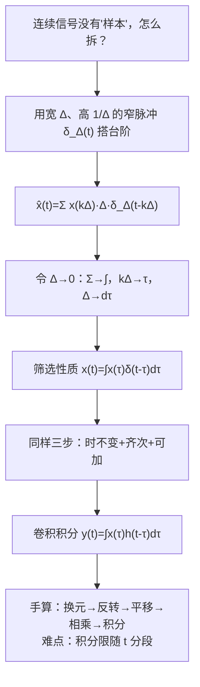

# 2.2 连续时间 LTI 系统：卷积积分 The Convolution Integral

> [!abstract] 这一讲的任务
> 上一讲把离散信号拆成一颗颗冲激，顺理成章地得到了卷积和。可**连续时间信号是一条连不断的曲线**——它没有“第 $k$ 个样本”，怎么拆？
> 这一讲用一把宽度为 $\Delta$ 的窄矩形去“搭”这条曲线，然后让 $\Delta\to0$。你会看到求和号 $\sum$ 变成积分号 $\int$，$k\Delta$ 变成 $\tau$，$\Delta$ 变成 $d\tau$——整套逻辑和上一讲一字不差，只是换了记号。结论同样是：**一条 $h(t)$，刻画整个系统。**

> [!info] 标注说明
> 标有 **（拓展）** 或 **【拓展】** 的内容，是**课堂上没有讲到、由课件和教材延伸补充**的部分。
> 复习时可先掌握未标注的主干内容，行有余力再看拓展部分。
> 本节已由第六节课转写稿完整覆盖（含课件全部例题与随堂测思路）。

---

## 0. 开场：怎么用积木搭一条曲线

给你一条光滑曲线 $x(t)$，和一堆**宽度都是 $\Delta$、高度可以随便调**的细长积木。你要用这些积木把曲线的形状搭出来。

你会怎么做？很自然：在 $t=k\Delta$ 这个位置立一根积木，高度就取曲线在那儿的值 $x(k\Delta)$，一根一根排过去，得到一串台阶。

![[C2-连续信号的阶梯逼近.png]]

台阶当然不等于曲线——但积木越细，台阶越贴。**这就是连续信号分解的全部思想。** 剩下的只是把“积木”用数学写清楚，然后取极限。

---

## 1. 把积木写成数学：$\delta_\Delta(t)$

> [!important] 窄脉冲 $\delta_\Delta(t)$
> $$\delta_\Delta(t)=\begin{cases}\dfrac{1}{\Delta},&0\le t\le \Delta\\[1mm]0,&\text{otherwise}\end{cases}\qquad\qquad \lim_{\Delta\to0}\delta_\Delta(t)=\delta(t)$$

> [!question] 停一下，先自己想想
> 为什么高度取 $\dfrac{1}{\Delta}$ 这么别扭的数，不直接取 1？

因为我们要的是**面积恒为 1**：$\dfrac1\Delta\times\Delta=1$。这样 $\Delta\to0$ 时它才会收敛到 $\delta(t)$——第 1 章讲过，$\delta(t)$ 的定义特征不是“高度无穷”，而是“**面积为 1**”（见 [[C1.4 单位冲激与单位阶跃函数]]）。

代价是：一根真正**高度为 $x(k\Delta)$** 的积木要写成 $x(k\Delta)\cdot\Delta\cdot\delta_\Delta(t-k\Delta)$——那个 $\Delta$ 是用来把高度从 $1/\Delta$ 掰回 1 的。课件图上标的 $\Delta\delta_\Delta(t)$、$\Delta\delta_\Delta(t-\Delta)$ 就是“高度为 1、宽度为 $\Delta$ 的单位积木”。

于是台阶信号是
$$\hat{x}(t)=\sum_{k=-\infty}^{+\infty}x(k\Delta)\,\Delta\,\delta_\Delta(t-k\Delta)$$

把它和上一讲的 $x[n]=\sum_k x[k]\delta[n-k]$ 对着看：**结构完全一样**，只是多了一个 $\Delta$（离散世界里样本间隔是 1，那个 $\Delta$ 恰好等于 1，所以看不见）。

---

## 2. 取极限：求和变积分

$$x(t)=\lim_{\Delta\to0}\hat{x}(t)=\lim_{\Delta\to0}\sum_{k=-\infty}^{+\infty}x(k\Delta)\,\Delta\,\delta_\Delta(t-k\Delta)$$

逐个符号做替换（课件用彩色圈出的就是这四处）：

| $\Delta\to0$ 时 | 变成 |
|---|---|
| $k\Delta$（离散的位置） | $\tau$（连续的位置） |
| $\Delta$（步长） | $d\tau$（微元） |
| $\delta_\Delta(t-k\Delta)$ | $\delta(t-\tau)$ |
| $\sum_k$ | $\displaystyle\int_{-\infty}^{+\infty}$ |

> [!important] 连续时间的信号分解（筛选性质 Sifting Property）
> $$\boxed{\ x(t)=\int_{-\infty}^{+\infty}x(\tau)\,\delta(t-\tau)\,d\tau\ }$$

> [!warning] 别把它读成“x 乘 δ 再积分”就完事
> 这个式子的**含义**是：$x(t)$ 被表示成了一族**移位冲激** $\{\delta(t-\tau)\}$ 的加权叠加，权重是 $x(\tau)$。
> 和离散情形一样：**$x(\tau)$ 在这里是权重（一个数），$\delta(t-\tau)$ 才是基底信号**。$\tau$ 是积分哑变量，积完就没了；$t$ 是自由变量。
>
> 换个角度：这也是第 1 章 $\delta$ 的**抽样性质**反过来用——$\int x(\tau)\delta(t-\tau)d\tau$ 把 $x$ 在 $\tau=t$ 处的值“筛”了出来，结果当然是 $x(t)$。**同一个式子，一个是“筛值”，一个是“分解”，看你站在哪一侧读。**

---

## 3. 同样的三步，得到卷积积分

定义**单位冲激响应** $h(t)$：
$$\delta(t)\ \longrightarrow\ \boxed{\text{LTI}}\ \longrightarrow\ h(t)$$

然后逐字重复上一讲的推理：

$$
\begin{aligned}
\delta(t-\tau)&\ \longrightarrow\ h(t-\tau) &&\text{Time-invariant 时不变}\\
x(\tau)\delta(t-\tau)&\ \longrightarrow\ x(\tau)h(t-\tau) &&\text{Homogeneity 齐次性}\\
\int_{-\infty}^{+\infty}x(\tau)\delta(t-\tau)d\tau&\ \longrightarrow\ \int_{-\infty}^{+\infty}x(\tau)h(t-\tau)d\tau &&\text{Additivity 可加性}
\end{aligned}
$$

左边那一列从上到下就是 $x(t)$，右边就是输出：

> [!important] 卷积积分 Convolution Integral
> $$\boxed{\ y(t)=\int_{-\infty}^{+\infty}x(\tau)\,h(t-\tau)\,d\tau\ \triangleq\ x(t)*h(t)\ }$$
> $$x(t)\ \longrightarrow\ \boxed{h(t)}\ \longrightarrow\ y(t)=x(t)*h(t)$$
> **Note:** A continuous-time LTI system is completely characterized by its unit impulse response $h(t)$.

> [!question] 停一下，我们刚才干了什么
> 两讲下来，其实只做了一件事：
> **把信号拆成基底 → 求系统对每个基底的反应 → 用线性性叠加回去。**
> 这是本课**贯穿始终的套路**。第 3–5 章会把基底从冲激换成复指数 $e^{j\omega t}$，套路一模一样，只是那时“对基底的反应”叫**频率响应** $H(j\omega)$，叠加叫**傅里叶变换**。
> 换句话说：**时域用冲激作基底得到卷积，频域用复指数作基底得到频谱。** 这两条路会在第 4 章合流（卷积定理）。

---

## 4. 手算卷积积分：和离散一模一样的五步

> [!important] 五步法
> 1. **换元**：$t\to\tau$，画出 $x(\tau)$ 和 $h(\tau)$；
> 2. **反转**：$h(\tau)\to h(-\tau)$；
> 3. **平移**：$h(-\tau)\to h(t-\tau)$，整体**右移 $t$**；
> 4. **相乘**：$x(\tau)h(t-\tau)$；
> 5. **积分**：对 $\tau$ 积分，得到**这一个 $t$ 处**的 $y(t)$。

**唯一的难点还是分段**：$t$ 变化时，两个图形的**重叠区间**在变，积分上下限跟着变。

> [!warning] 三个高频错误
> 1. **积分变量搞混**：积分是对 $\tau$ 做的，$t$ 在积分里是常数。课件 p.25–27 把 $\int_{-0.5}^{0.5+t}\mathrm{d}t$ 写成了 $\mathrm{d}t$，**那是笔误，应为 $\mathrm{d}\tau$**（若真是对 $t$ 积分，结果不可能是 $1+t$）。自己写的时候一定写 $d\tau$。
> 2. **忘了画 $h(t-\tau)$ 的滑动边界**：图上永远先把翻转后信号的**左右两个端点**用 $t$ 表示出来（比如 $-0.5+t$ 和 $0.5+t$），分段条件就是让这两个端点跟 $x(\tau)$ 的端点比大小。
> 3. **段的端点漏判**：$t=-1$、$t=0$、$t=1$ 这些临界点归到哪一段，写成 $\le$ 还是 $<$，要写清楚（连续函数在端点上两段给出同一个值，所以不影响答案，但表达要严谨）。

---

## 5. 例题一：$e^{-t}u(t)*u(t)$

> [!example] Example
> $x(t)=e^{-t}u(t)$，$h(t)=u(t)$，求 $y(t)=x(t)*h(t)$。

![[C2-卷积积分-指数与阶跃.png]]

**第 1–3 步**：$x(\tau)=e^{-\tau}u(\tau)$（$\tau\ge0$ 的衰减指数）；$h(\tau)=u(\tau)$ 翻转成 $u(-\tau)$（$\tau\le0$ 为 1），再右移 $t$ 得 $u(t-\tau)$（**$\tau\le t$ 为 1**）。

**分两段**：

**① $t<0$**：$x(\tau)$ 活在 $\tau\ge0$，$h(t-\tau)$ 活在 $\tau\le t<0$，不重叠：
$$y(t)=0$$

**② $t>0$**：重叠区间 $0\le\tau\le t$，被积函数 $=e^{-\tau}\cdot 1$：
$$y(t)=\int_{0}^{t}e^{-\tau}\,d\tau=\big[-e^{-\tau}\big]_0^{t}=1-e^{-t}$$

$$\boxed{\ y(t)=(1-e^{-t})\,u(t)\ }$$

> [!tip] 读懂这个结果
> $h(t)=u(t)$ 的系统是**积分器**（$y(t)=\int_{-\infty}^tx(\tau)d\tau$），所以这道题其实是“对 $e^{-t}u(t)$ 求积分”。答案从 0 单调爬到 1——**这就是 RC 电路充电曲线**，也是 2.3 节要讲的“**阶跃响应**”的对偶版本。
> 顺带记住课件那句写法：$x(\tau)h(t-\tau)=e^{-\tau}[u(\tau)-u(\tau-t)]$——**用两个阶跃相减来表示一个有限窗口**，是卷积题里很常用的技巧。

> [!tip] 用 $u(t)$ 把分段函数写成一个式子
> 卷积结果天然是分段函数：$t<0$ 时为 0，$t>0$ 时为 $1-e^{-t}$。$u(t)$ 恰好在 $t<0$ 取 0、$t>0$ 取 1，所以两段可以合成一个表达式 $y(t)=(1-e^{-t})u(t)$。**阶跃函数就是用来“开关”分段函数的。**

---

## 6. 例题二：方波自卷积 $p_1(t)*p_1(t)$

> [!example] Example
> $p_1(t)$ 是宽度 1、高度 1、关于原点对称的方波（$-0.5\le t\le0.5$）。求 $y(t)=p_1(t)*p_1(t)$。

翻转后的 $p_1(t-\tau)$ 占据 $\tau\in[-0.5+t,\ 0.5+t]$，固定的 $p_1(\tau)$ 占据 $[-0.5,\ 0.5]$。让两个窗口的端点互相比较，**四段**：

| 段 | 条件 | 几何 | $y(t)$ |
|---|---|---|---|
| ① | $0.5+t<-0.5\Rightarrow t<-1$ | 滑动窗完全在左侧 | $0$ |
| ② | $-0.5\le0.5+t<0.5\Rightarrow -1\le t<0$ | 右端进来了，重叠 $[-0.5,\ 0.5+t]$ | $\displaystyle\int_{-0.5}^{0.5+t}d\tau=1+t$ |
| ③ | $-0.5\le-0.5+t<0.5\Rightarrow 0<t\le1$ | 左端还没出去，重叠 $[-0.5+t,\ 0.5]$ | $\displaystyle\int_{-0.5+t}^{0.5}d\tau=1-t$ |
| ④ | $-0.5+t>0.5\Rightarrow t>1$ | 滑过去了 | $0$ |

![[C2-方波自卷积-三角波.png]]

$$\boxed{\ p_1(t)*p_1(t)=\begin{cases}1-|t|,&|t|\le1\\0,&|t|>1\end{cases}}$$

> [!important] 记住这条结论
> **等宽方波自卷积 = 底宽加倍的三角波，峰值 = 方波宽度 × 高度$^2$。**
> 和离散版 $R_N*R_N$ 是同一件事（[[C2.1 离散时间LTI系统与卷积和]] 第 5 节）：**矩形 * 矩形 = 三角**。
> 面积自检：$\int p_1=1$，$\int p_1=1$，三角面积 $=\frac12\times2\times1=1=1\times1$ ✓。
>
> **几何直觉**：积分就是求面积，$y(t)$ 就是两个矩形的**重叠面积**。从不相遇 → 开始重叠 → $t=0$ 时完全重合、面积最大（峰值）→ 重叠变小 → 分开。两个**等宽**矩形只在一个瞬间完全重合，所以只有一个峰值点，结果是三角形。
> **卷积的面积等于两者面积之积**，这是检查卷积答案最快的办法（第 4 章会看到这就是 $Y(0)=X(0)H(0)$）。

---

## 7. 练习：不等宽方波（课件 p.28）

> [!example] Exercise
> $x(t)$：$0\le t\le1$ 高度 1；$h(t)$：$0\le t\le2$ 高度 1。求 $y(t)$。

![[C2-不等宽方波卷积-梯形.png]]

> [!question] 停一下，先猜结果的形状
> 上一题等宽给出三角形。这里宽度不等（1 和 2），你猜是什么形状？

答案是**梯形 trapezoid**：

$$y(t)=\begin{cases}0,&t<0\\ t,&0\le t\le1\\ 1,&1<t\le2\\ 3-t,&2<t\le3\\ 0,&t>3\end{cases}$$

**为什么会出现平台？** 短的那个窗（宽 1）**完全钻进**长窗（宽 2）里的那段时间，重叠长度不再变化，恒为 1。

> [!important] 通用规律
> 两个宽度分别为 $T_1\le T_2$ 的方波卷积：
> - 支撑总宽度 $T_1+T_2$（对应离散的 $L_x+L_h-1$）；
> - 上升 $T_1$、**平台 $T_2-T_1$**、下降 $T_1$；
> - 峰值 $=T_1\times$（两个高度之积）。
> $T_1=T_2$ 时平台宽度为 0，退化成三角形——**三角形是梯形的特例**，两题其实是一题。

> [!tip] 经验结论：左端点之和、右端点之和
> 卷积结果的**左端点 = 两个信号左端点之和**，**右端点 = 两个信号右端点之和**。
> - $p_1*p_1$：$(-0.5)+(-0.5)=-1$，$0.5+0.5=1$，结果在 $[-1,1]$；
> - 本题：$0+0=0$，$1+2=3$，结果在 $[0,3]$。
> 道理很直观：刚开始重叠和刚好分开的两个时刻，恰好差两个宽度的叠加。做多了就会有这个感觉，拿到题先写出支撑区间当骨架。

---

## 8. 随堂测（课件 p.29）

> [!example] 主观题 5 分
> $x_1(t)$：$0\le t<1$ 时为 1，$1\le t<2$ 时为 2，其余为 0；
> $x_2(t)$：$0\le t<1$ 时为 1，其余为 0。
> 求 $y(t)=x_1(t)*x_2(t)$。

解析见本篇自测第 5 题——先自己算。两条思路都行：
- **直接分段积分**：比前面的题麻烦一点。翻转 $x_2$ 滑动到中间时，重叠区间 $[t-1,\ t]$ 跨过了 $x_1$ 的跳变点 $t=1$，$x_1$ 在 $[t-1,1]$ 上取 1、在 $[1,t]$ 上取 2，**积分必须在 $\tau=1$ 处拆成两段**。
- **拆成两个方波再用分配律**：更快，那条性质下一讲才正式讲，但你现在就能想到。
结果一定落在 $[0,3]$ 上（$x_1$ 宽 2，$x_2$ 宽 1）。

---

## 这一讲的三句话

1. **连续信号的分解 = 用窄脉冲搭台阶再取极限**：$\sum\to\int$，$k\Delta\to\tau$，$\Delta\to d\tau$。
2. **推导逻辑和离散版一字不差**：冲激分解 + 时不变 + 线性 ⇒ $y(t)=\int x(\tau)h(t-\tau)d\tau$。
3. **手算的难点永远是分段**：把滑动窗的两个端点写成含 $t$ 的表达式，跟固定窗的端点比大小，比出几个临界点就分几段。

> [!tip] 速查表
> | 名称 | 连续 | 离散 |
> |---|---|---|
> | 信号分解 | $x(t)=\int x(\tau)\delta(t-\tau)d\tau$ | $x[n]=\sum_k x[k]\delta[n-k]$ |
> | 卷积 | $y(t)=\int x(\tau)h(t-\tau)d\tau$ | $y[n]=\sum_k x[k]h[n-k]$ |
> | 方波自卷积 | 三角，底宽 $2T$，峰值 $T$ | 三角，底宽 $2N-1$，峰值 $N$ |
> | 不等宽方波 | 梯形：升 $T_1$ / 平 $T_2-T_1$ / 降 $T_1$ | 梯形序列 |
> | 面积关系 | $\int y=\int x\cdot\int h$ | $\sum y=\sum x\cdot\sum h$ |
> | 支撑宽度 | $T_x+T_h$ | $L_x+L_h-1$ |

> [!tip] 下一讲预告
> 现在我们会算卷积了，但硬算很累——例题 7 的梯形要分四段。
> 下一讲问一个偷懒的问题：**卷积这种运算，有没有像乘法那样的交换律、结合律、分配律？** 答案是全都有，而且每一条在系统框图上都对应一种**电路的接法**。学会之后，很多卷积题可以**不算积分直接看出来**。

---

## 本节自测 Self-Test

> [!question] 1. $\delta_\Delta(t)$ 的高度为什么取 $1/\Delta$ 而不是 1？

> [!success]- 答案
> 为了让**面积恒为 1**，这样 $\Delta\to0$ 时才收敛到 $\delta(t)$（$\delta$ 的定义特征是面积 1，不是高度）。
> 代价是搭台阶时要额外乘一个 $\Delta$ 把高度掰回 $x(k\Delta)$，那个 $\Delta$ 在极限下就变成了 $d\tau$。

> [!question] 2. 在 $x(t)=\int x(\tau)\delta(t-\tau)d\tau$ 中，哪个是基底信号，哪个是权重？$\tau$ 和 $t$ 谁会消失？

> [!success]- 答案
> $\delta(t-\tau)$ 是**基底信号**，$x(\tau)$ 是**权重（数）**。$\tau$ 是积分哑变量、积完消失；$t$ 是自由变量、保留到结果里。

> [!question] 3. 计算 $y(t)=e^{-2t}u(t)*u(t-1)$。

> [!success]- 答案
> $h(t-\tau)=u(t-\tau-1)$ 要求 $\tau\le t-1$；$x(\tau)=e^{-2\tau}u(\tau)$ 要求 $\tau\ge0$。重叠需 $t-1\ge0$，即 $t\ge1$：
> $$y(t)=\int_0^{t-1}e^{-2\tau}d\tau=\frac{1-e^{-2(t-1)}}{2}$$
> $$\boxed{\ y(t)=\tfrac12\big(1-e^{-2(t-1)}\big)u(t-1)\ }$$
> 数值验算：$t=1$ 时 $y=0$ ✓；$t\to\infty$ 时 $y\to0.5=\int_0^\infty e^{-2\tau}d\tau$ ✓（阶跃输入下积分器的终值 = $h$ 的总面积）。
> **易错点**：$u(t-1)$ 的延迟 1 会整体搬到答案上去，别只改积分上限却忘了写 $u(t-1)$。

> [!question] 4. 两个方波，宽度分别为 2 和 5、高度都为 1，卷积结果长什么样？峰值多少？

> [!success]- 答案
> 梯形：总宽 $2+5=7$；上升段宽 2、平台宽 $5-2=3$、下降段宽 2；峰值 $=2\times1\times1=2$。
> 面积自检：$\frac{(7+3)}{2}\times2=10=2\times5$ ✓。

> [!question] 5. 随堂测：$x_1(t)$ 在 $[0,1)$ 为 1、$[1,2)$ 为 2；$x_2(t)$ 在 $[0,1)$ 为 1。求 $y=x_1*x_2$。

> [!success]- 答案（完整步骤）
> **拆分**：$x_1(t)=p(t)+2p(t-1)$，其中 $p(t)$ 是 $[0,1)$ 上的单位方波（即 $x_2$）。
> 由**分配律**和**时移性质**（下一讲正式证明）：
> $$y(t)=p*p\ +\ 2\,[p*p](t-1)$$
> 而 $p*p$ 是底宽 2、峰值 1、顶点在 $t=1$ 的三角波 $\Lambda(t)$：
> $$\Lambda(t)=\begin{cases}t,&0\le t\le1\\2-t,&1<t\le2\\0,&\text{else}\end{cases}$$
> 所以
> $$\boxed{\ y(t)=\Lambda(t)+2\Lambda(t-1)\ }$$
> 逐段写开（支撑 $0\le t\le3$）：
> $$y(t)=\begin{cases}t,&0\le t\le1\\ (2-t)+2(t-1)=t,&1<t\le2\\ 2(3-t)=6-2t,&2<t\le3\\ 0,&\text{else}\end{cases}$$
> 即：**从 0 线性升到 $t=2$ 处的 2，再线性降到 $t=3$ 处的 0**，是一个不对称三角形。
> 面积自检：$\int x_1=1\times1+2\times1=3$，$\int x_2=1$，$\int y=\frac12\times3\times2=3$ ✓。
> **易错点**：中间段 $1<t\le2$ 的两项要相加，很多人只写了其中一项，得到一个错误的“凹陷”。
>
> **另一条路：直接分段积分**（固定 $x_1$，翻转滑动 $x_2$，滑动窗为 $[t-1,\ t]$）：
> - $t<0$ 或 $t>3$：不重叠，$y=0$；
> - $0\le t\le1$：重叠 $[0,t]$，$x_1=1$，$y=\int_0^t1\,d\tau=t$；
> - $1<t\le2$：重叠 $[t-1,t]$ 跨过跳变点，**拆开积分**：$y=\int_{t-1}^{1}1\,d\tau+\int_{1}^{t}2\,d\tau=(2-t)+2(t-1)=t$；
> - $2<t\le3$：重叠 $[t-1,2]$，$x_1=2$，$y=\int_{t-1}^{2}2\,d\tau=2(3-t)$。
> 与分配律的结果完全一致。

> [!question] 6. 为什么“用冲激作基底”和“第 3 章用复指数作基底”是同一个套路？

> [!success]- 答案
> 都是三步：**把信号拆成基底的加权叠加 → 求系统对单个基底的响应 → 用线性性叠加**。
> 差别只在基底选谁：冲激 $\delta(t-\tau)$ 给出**时域**的卷积；复指数 $e^{j\omega t}$ 给出**频域**的频率响应 $H(j\omega)$（复指数是 LTI 系统的**特征函数**，进去出来还是同一个频率，只改变幅度和相位——这正是第 3 章的起点）。

---

## 相关笔记 Related Notes

- [[信号与系统 MOC]]
- 上一节：[[C2.1 离散时间LTI系统与卷积和]]
- 下一节：[[C2.3 LTI系统的性质]]
- 相关：[[C1.4 单位冲激与单位阶跃函数]]（$\delta(t)$ 的极限构造）、[[C2.7 奇异函数]]（$\delta$ 的运算公式汇总）
