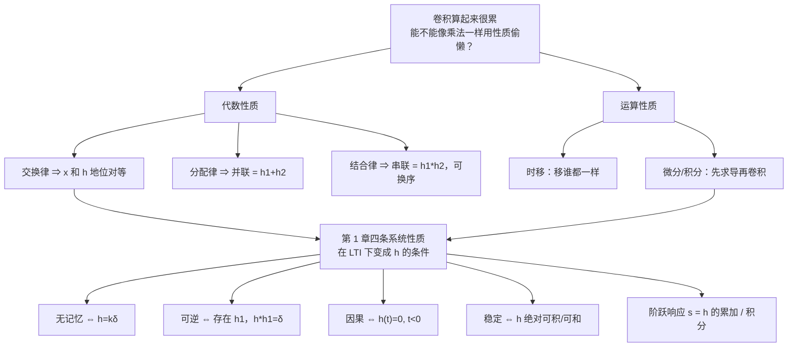

# 2.3 LTI 系统的性质 Properties of LTI System

> [!abstract] 这一讲的任务
> 前两讲我们会算卷积了，但**算得很累**——一个梯形要分四段。这一讲要把“累”这件事解决掉。
> 卷积虽然长得像积分，行为却像**乘法**：交换律、分配律、结合律它全有，还多出时移和微分两条。学完之后，很多卷积题可以**不动笔算积分就直接看出答案**。
> 更重要的是：第 1 章讲过的记忆性、可逆性、因果性、稳定性这四条系统性质，在 LTI 系统里全都会**塌缩成一条关于 $h$ 的简单条件**——这才是“一条 $h$ 刻画整个系统”的真正威力。

> [!info] 标注说明
> 标有 **（拓展）** 或 **【拓展】** 的内容，是**课堂上没有讲到、由课件和教材延伸补充**的部分。
> 复习时可先掌握未标注的主干内容，行有余力再看拓展部分。

> [!info] 授课进度说明
> 第七节课讲完了第 1 节（三条代数性质）、第 2.1–2.2 节（时移、微分性质）、随堂测第 2 题，以及 $\delta$ 的卷积公式（讲到 $x*u$ 等于积分处截止）。
> **第 2.3 节（用微分性质做题）起尚未讲授**，这部分按课件整理，暂不逐条标注拓展，待后续转写稿补充后再按同一规则标。



---

## 0. 开场：两个滤波器，先做哪个？

你在写一段图像处理代码：先对图像做**高斯模糊**，再做**边缘增强**。同事说顺序反过来结果一样，你说不可能——直觉上“先模糊再锐化”和“先锐化再模糊”明明差很多。

谁对？

**如果两个操作都是 LTI 的，同事是对的，而且可以省一次运算**：两个滤波器可以先合并成一个再作用于图像。
**如果其中一个是非线性的**（比如中值滤波、ReLU、gamma 校正），你是对的，顺序绝不能换。

这一节就是把这句话变成定理。顺便，你会发现“能不能合并”这件事，正是 DSP 里把多级滤波器折成一级、CNN 里把两个卷积层折成一个等效核的理论依据。

---

## 1. 三条代数性质：卷积像乘法

为方便，下面连续和离散写在一起，证明以一种为主——**两者的证明只差 $\sum$ 与 $\int$ 的符号**。

### 1.1 交换律 Commutative Property

$$x[n]*h[n]=h[n]*x[n],\qquad x(t)*h(t)=h(t)*x(t)$$

> [!example] 证明（换元即可）
> $$y[n]=\sum_{k=-\infty}^{\infty}x[k]h[n-k]\ \xrightarrow{\ k'=n-k\ }\ \sum_{k'=-\infty}^{\infty}x[n-k']h[k']=h[n]*x[n]$$
> 连续情形令 $\tau'=t-\tau$：
> $$y(t)=\int_{-\infty}^{\infty}x(\tau)h(t-\tau)d\tau=\int_{-\infty}^{\infty}x(t-\tau')h(\tau')d\tau'=h(t)*x(t)$$
> **注意换元时积分限也翻了一次方向**（$\tau:-\infty\to\infty$ 对应 $\tau':\infty\to-\infty$），加上 $d\tau'=-d\tau$ 的负号，两个负号抵消，所以形式不变。这一步漏掉负号是常见错误。

> [!important] 它在说什么（课件 Note）
> 输入 $x$、冲激响应 $h$ 的系统输出，**等于**输入 $h$、冲激响应 $x$ 的系统输出。
> 也就是说在卷积里，**“谁是信号、谁是系统”这个区分是人为的**——数学上两者完全对等。
> **实用价值**：手算时哪个更简单就翻转哪个。翻转一个方波，永远比翻转一个分段函数省事。

> [!note] 为什么卷积天然满足三大律
> 卷积是**乘法和加法的混合运算**。乘法和加法都满足交换律、分配律、结合律（小学就学过），所以卷积也全都满足。证明只是做一次变量代换（把 $n-k$ 记成 $k'$），考试不考这种证明，**记住性质、会用**才是重点。

### 1.2 分配律 Distributive Property

$$x*\{h_1+h_2\}=x*h_1+x*h_2$$

> [!important] 框图含义：并联
> 两个 LTI 系统**并联**（同一输入、输出相加），等效于**一个**冲激响应为 $h_1+h_2$ 的系统。
> ```mermaid
> flowchart LR
>     X1["x(t)"] --> P["h₁(t) + h₂(t)"] --> Y1["y(t)"]
>     X2["x(t)"] --> A["h₁(t)"] --> S(("+"))
>     X2 --> B["h₂(t)"] --> S
>     S --> Y2["y(t)"]
> ```
> 这正是 [[C1.5 连续时间与离散时间系统]] 里“并联互联”的冲激响应版本。

**怎么用来偷懒**：把复杂输入拆成简单块。比如 [[C2.2 连续时间LTI系统与卷积积分]] 的随堂测里 $x_1=p+2p(t-1)$，拆开后只要算一次 $p*p$。

### 1.3 结合律 Associative Property

$$x*\{h_1*h_2\}=\{x*h_1\}*h_2$$

> [!important] 框图含义：串联（级联）
> 两个 LTI 系统**串联**，等效于一个冲激响应为 $h_1*h_2$ 的系统；再结合交换律，**串联顺序可以任意交换**。
> ```mermaid
> flowchart LR
>     X["x(t)"] --> H1["h₁(t)"] --> H2["h₂(t)"] --> Y["y(t)"]
>     X2["x(t)"] --> H2b["h₂(t)"] --> H1b["h₁(t)"] --> Y2["同一个 y(t)"]
> ```

> [!warning] 串联是卷积，不是乘法
> 很多人的第一直觉是“串联 = 冲激响应相乘”。**错**。在**时域**里，串联对应的是**卷积** $h_1*h_2$；**并联才是加法** $h_1+h_2$。
> 等到第 4 章做了傅里叶变换，在**频域**里串联才变成乘法 $H_1(j\omega)H_2(j\omega)$——这正是频域分析的好处。

> [!warning] 课件专门给的反例：非线性系统不能换序
> $$x(t)\ \xrightarrow{\ \times2\ }\ 2x(t)\ \xrightarrow{\ (\cdot)^2\ }\ 4x^2(t)$$
> $$x(t)\ \xrightarrow{\ (\cdot)^2\ }\ x^2(t)\ \xrightarrow{\ \times2\ }\ 2x^2(t)$$
> $4x^2\neq2x^2$。**“级联可换序”是 LTI 的特权**，一旦链条里混进一个非线性环节就作废。
>
> 问题出在哪？**只有线性时不变系统的输入输出关系才是卷积**，而 $y=x^2$ 不是线性系统，它根本没有“冲激响应”可言，结合律无从谈起。两个子系统都是 LTI，才能任意换序。
>
> 回到开场：高斯模糊和边缘增强（两个卷积核）都是 LTI，可以换序也可以合并；但中值滤波、ReLU 不是，**深度网络里 conv-conv 可以合并成一个卷积，conv-ReLU-conv 不行**——这也正是激活函数存在的意义：没有它，多少层卷积都塌成一层。

---

## 2. 两条运算性质：时移与微分

### 2.1 时移性质 Time Shift Property

> [!important] 若 $x(t)*h(t)=y(t)$，则
> $$x(t-t_0)*h(t)=x(t)*h(t-t_0)=y(t-t_0)$$
> **推论 Corollary**：
> $$x(t-t_1)*h(t-t_2)=x(t)*h(t-t_1-t_2)=y(t-t_1-t_2)$$

> [!example] 证明
> $$x(t-t_0)*h(t)=\int_{-\infty}^{+\infty}x(\tau-t_0)h(t-\tau)\,d\tau\ \xrightarrow{\ \tau'=\tau-t_0\ }\ \int_{-\infty}^{+\infty}x(\tau')h\big((t-t_0)-\tau'\big)d\tau'$$
> 右边正是把 $y$ 的公式里的 $t$ 换成 $t-t_0$，即 $y(t-t_0)$。
> 同理可证移 $h$ 得到同样的结果。

> [!note] 另一种理解：直接用时不变性（课堂讲法）
> 卷积描述的是 LTI 系统。输入 $x(t)$、冲激响应 $h(t)$、输出 $y(t)$。
> - 系统不变，输入延迟成 $x(t-t_0)$：因为系统**时不变**，输出也只是延迟，$x(t-t_0)*h(t)=y(t-t_0)$；
> - 把角色对调：让 $x$ 当系统、$h$ 当输入。输入 $h$ 延迟 $t_0$，输出同样延迟：$h(t-t_0)*x(t)=y(t-t_0)$，再用交换律就是 $x(t)*h(t-t_0)=y(t-t_0)$。
> 这不是严格证明，但好理解、好记。
>
> **延迟量可以任意分配**：信号端和系统端的总延迟加起来一样，结果就一样，最终都“传递”到输出上。例如
> $$x(t)*h(t-4)=x(t-1)*h(t-3)=x(t-2)*h(t-2)=x(t-4)*h(t)=y(t-4)$$
> 甚至不必是整数。

> [!tip] 一句话记忆
> **延迟可以随便挪。** 移输入、移系统、移输出，三者等价；两个延迟就相加。
> **这是所有卷积题里最省时间的一条**：碰到带 $u(t-3)$、$\delta(t-2)$ 之类的东西，先把延迟全部“提”到最外面，剩下的部分按最简单的形式算完再整体平移。

**立刻用一次**（课件 p.48 随堂测第 2 题）：$h_1(t)=e^{-2t}u(t)$，$h_2(t)=\delta(t-2)$，两者的连接是“$h_1$ 之后分两路，一路直通、一路过 $h_2$，最后相减”。由分配律与结合律：
$$h(t)=h_1(t)*\big[\delta(t)-h_2(t)\big]=h_1(t)-h_1(t)*\delta(t-2)=e^{-2t}u(t)-e^{-2(t-2)}u(t-2)$$
**全程没算一个积分。**

> [!warning] 这道题课堂上专门讲过的陷阱：直通支路的冲激响应不是 1
> 图里上面那条支路是一根线，输入 $x(t)$ 过去还是 $x(t)$。很多人会说这条支路的冲激响应 $h_3(t)=1$——**错**。
> 输入原样输出的系统是**恒等系统 identical system**：$y(t)=x(t)$。问：什么信号和 $x(t)$ 卷积还是 $x(t)$？
> 回到**信号分解**：$x(t)=\int x(\tau)\delta(t-\tau)d\tau$，对照卷积定义，右边正是 $x(t)*\delta(t)$。所以
> $$x(t)*\delta(t)=x(t)\quad\Longrightarrow\quad h_3(t)=\delta(t)$$
> **恒等系统的冲激响应是 $\delta(t)$，不是 1。** 于是这张图可以重画成：$h_1$ 之后并联 $\delta(t)$（+）与 $h_2(t)$（−），总的
> $$h(t)=h_1(t)*\big[\delta(t)-h_2(t)\big]$$
> 再用**分配律**拆开、用 $x*\delta=x$ 和 $x*\delta(t-t_0)=x(t-t_0)$ 化简，就得到上面的结果。

### 2.2 微分性质 Derivation Property

> [!important] 若 $x(t)*h(t)=y(t)$，则
> $$x'(t)*h(t)=x(t)*h'(t)=y'(t)$$
> 对于高阶导数，求n阶导数等价于将这n阶导数分配给x和h的任意组合。
> 与之对偶（课件 p.39 “Properties of LTI system”）：
> - **微分/差分性质**：$T\{x'(t)\}=y'(t)$；$T\{x[n]-x[n-1]\}=y[n]-y[n-1]$
> - **积分/求和性质**：$T\{\int_{-\infty}^tx\,d\tau\}=\int_{-\infty}^ty\,d\tau$；$T\{\sum_{k=-\infty}^{n}x[k]\}=\sum_{k=-\infty}^{n}y[k]$
> - 若h(t)=δ(t)那么显然也是满足这个性质的；值得一提的是，δ'(t)是冲激偶。
> - 推导过程是使用一个关于y轴对称，底为2Δ高为1/Δ的三角形。使Δ趋于0，即得到δ(t)对于

> [!example] 证明（两个方向）
> **方向一（对 $h$ 求导）**：
> $$y'(t)=\frac{d}{dt}\int_{-\infty}^{+\infty}x(\tau)h(t-\tau)d\tau=\int_{-\infty}^{+\infty}x(\tau)\frac{d\,h(t-\tau)}{dt}d\tau=x(t)*h'(t)$$
> 求导和积分交换顺序即可（$t$ 在积分号外，$\tau$ 在里面，互不干扰）。
> **方向二（对 $x$ 求导）**：分部积分
> $$x'(t)*h(t)=\int\frac{dx(\tau)}{d\tau}h(t-\tau)d\tau=\underbrace{\big[x(\tau)h(t-\tau)\big]_{-\infty}^{+\infty}}_{=0}-\int x(\tau)\,d\,h(t-\tau)$$
> 边界项为零（物理可实现信号在 $\pm\infty$ 处至少有一端为 0）。再把 $d\,h(t-\tau)=h'(t-\tau)\cdot d(t-\tau)=-h'(t-\tau)d\tau$ 代入，负负得正：
> $$=\int x(\tau)h'(t-\tau)d\tau=x(t)*h'(t)$$
>
> **边界项为什么是 0**：严格说这一步需要条件，$x(+\infty)h(-\infty)-x(-\infty)h(+\infty)=0$。实际应用里系统多是**因果系统**、输入从 $t=0$ 才加上：因果系统在负无穷时刻没有输入就没有输出，$h(-\infty)=0$；输入在负时间上也没有，$x(-\infty)=0$。所以这一项为零，这个条件在应用中默认成立。
> **考试不考这个证明**（那是高数的事），记住性质、会用即可。

> [!tip] 起个名字：微分不变性
> 时不变性说：输入延迟 ⇒ 输出同样延迟。微分性质说：**输入求导 ⇒ 输出同样求导**，系统本身不变。可以把它叫作 LTI 系统的**微分不变性**，和时移性质是平行的一对：延迟量可以在 $x$、$h$ 之间任意分配，求导的阶数也可以任意分配，例如
> $$x''(t)*h(t)=x'(t)*h'(t)=x(t)*h''(t)=y''(t)$$

> [!question] 停一下，这条性质为什么值钱
> 想想什么信号求导之后会变得**特别简单**。

**答案：方波。** 方波求一次导就变成两个冲激，而冲激卷积任何东西都等于“原样搬过去”（$x*\delta(t-t_0)=x(t-t_0)$）。于是“方波 * 复杂信号”这种硬骨头，被转化成“两个复杂信号相减”。

### 2.3 用微分性质做一道题（课件 p.37–38）

> [!example] Example
> $x(t)$：$0\le t\le T$ 上高度为 1 的方波；$h(t)$：$0\le t\le 2T$ 上从 0 线性升到 $2T$ 的斜坡。求 $y=x*h$。

![[C2-微分性质简化卷积.png]]

**第一步：给 $x$ 求导。**
$$x'(t)=\delta(t)-\delta(t-T)$$

**第二步：用微分性质，把卷积变成减法。**
$$y'(t)=x'(t)*h(t)=h(t)*\big[\delta(t)-\delta(t-T)\big]=h(t)-h(t-T)$$

这一步用到了 $x(t)*\delta(t)=x(t)$ 与 $x(t)*\delta(t-t_0)=x(t-t_0)$ —— **冲激是卷积的“1”**（2.3.4 节会解释为什么）。

**第三步：积分回去。**
$$y(t)=\int_{-\infty}^{t}y'(\tau)\,d\tau$$

$y'(t)=h(t)-h(t-T)$ 长这样（取 $T=1$）：$0\to T$ 段上升到 $T$；$T\to2T$ 段是常数 $T$（两条斜坡之差）；$2T$ 处跳到 $-T$；$2T\to3T$ 段降到 $-2T$。积分之后 $y(t)$ 是一条先加速上升、再线性上升、最后减速下降到 0 的曲线：

$$y(T)=\tfrac12T^2,\qquad y(2T)=\tfrac32T^2,\qquad y(3T)=0$$

**数值验算**（$T=1$，数值积分）：$y(1)=0.500$，$y(2)=1.500$，$y(3)=0.000$，与 $\frac12T^2$、$\frac32T^2$、$0$ 完全吻合。

> [!warning] 用完微分一定要记得积分回去
> 最常见的失误是算出 $y'(t)$ 就交卷。$y'$ 和 $y$ 差一次积分，**而且积分常数由“$t\to-\infty$ 时 $y=0$”定死**（因果信号），不是任意的。

### 2.4 再用一次：由一个输入输出对推另一个（课件 p.40）

> [!example] Example
> 已知某 LTI 系统：$x_1(t)$（$0\le t\le1$ 的单位方波）$\to$ $y_1(t)=e^{-2t}u(t)$。
> 求它对 $x_2(t)$（$-1\le t\le0$ 线性从 0 升到 1，$t>0$ 恒为 1）的响应。

> [!question] 课堂追问
> 我们**不知道** $h(t)$。还能算吗？

能。**只要能把 $x_2$ 用“对 $x_1$ 做线性 + 时不变的操作”表示出来，$y_2$ 就用同样的操作作用在 $y_1$ 上。**

观察：$x_1$ 的积分 $x_1^{(-1)}(t)=\int_{-\infty}^tx_1(\tau)d\tau$ 是“$0\to1$ 线性上升、之后恒为 1”的斜坡。把它左移 1 就是 $x_2$：
$$x_2(t)=x_1^{(-1)}(t+1)=\int_{-\infty}^{t+1}x_1(\tau)\,d\tau$$

由**积分性质 + 时移性质**：
$$y_2(t)=\int_{-\infty}^{t+1}y_1(\tau)\,d\tau=\int_{0}^{t+1}e^{-2\tau}d\tau=\frac{1-e^{-2(t+1)}}{2}$$
$$\boxed{\ y_2(t)=0.5\big(1-e^{-2(t+1)}\big)u(t+1)\ }$$

**数值验算**：$t=-1$ 时 $y_2=0$ ✓（响应从 $t=-1$ 才起）；$t=0$ 时 $y_2=0.5(1-e^{-2})=0.4323$；$t\to\infty$ 时 $y_2\to0.5=\int_0^\infty e^{-2\tau}d\tau$ ✓。

> [!tip] 这类题的通用套路（考试高频）
> 1. 找出 $x_2$ 与 $x_1$ 之间的关系（平移？求导？积分？线性组合？）；
> 2. **把完全相同的关系套到 $y_1$ 上**得到 $y_2$；
> 3. 全程不需要知道 $h$。
> 依据就是线性 + 时不变 + 微积分性质。

---

## 3. 四条系统性质，在 LTI 下各塌成一条关于 $h$ 的条件

这是本节的第二个主题，也是“$h$ 刻画一切”的直接兑现。

### 3.1 无记忆性 Memoryless（课件 2.3.4）

> [!note] 进度提示
> 本小节里“冲激是卷积单位元 $x*\delta=x$”这一条，第七节课在讲随堂测第 2 题时已经提前讲过（恒等系统的冲激响应是 $\delta(t)$）；无记忆判据 $h=k\delta$ 本身尚未讲授。

> [!question] 停一下，先自己想想
> $y[n]=\sum_k h[k]x[n-k]=\cdots+h[-1]x[n+1]+h[0]x[n]+h[1]x[n-1]+\cdots$
> “无记忆”意味着 $y[n]$ 只能依赖 $x[n]$。那这一串里哪些项必须为零？

**除了 $h[0]x[n]$ 这一项，其余全部必须为零**——因为它们都带着 $x[n\pm1]$、$x[n\pm2]$ 这些“别的时刻”。所以：

> [!important] 无记忆 ⇔ $h$ 只在原点非零
> $$h[n]=k\,\delta[n]\ \Longleftrightarrow\ y[n]=k\,x[n]$$
> $$h(t)=k\,\delta(t)\ \Longleftrightarrow\ y(t)=k\,x(t)$$

取 $k=1$ 就得到那条被反复用到的恒等式：

> [!important] 冲激是卷积运算的单位元
> $$\boxed{\ x[n]*\delta[n]=x[n],\qquad x(t)*\delta(t)=x(t)\ }$$
> 课件把它和信号分解并列写出：$x[n]*\delta[n]\triangleq\sum_kx[k]\delta[n-k]$，$x(t)*\delta(t)\triangleq\int x(\tau)\delta(t-\tau)d\tau$。
> **“信号分解”和“卷积单位元”原来是同一个式子的两种读法**——这是第 2.2 节末尾那句话的又一次回收。

### 3.2 可逆性 Invertibility（2.3.5）

原系统 $h$，逆系统 $h_1$，串联后应该“什么也没做”，即等效于单位元：

$$\boxed{\ h(t)*h_1(t)=\delta(t)\quad\text{或}\quad h[n]*h_1[n]=\delta[n]\ }$$

> [!tip] 举个例子
> 累加器 $h[n]=u[n]$ 的逆系统是一阶差分 $h_1[n]=\delta[n]-\delta[n-1]$。
> 验证：$u[n]*(\delta[n]-\delta[n-1])=u[n]-u[n-1]=\delta[n]$ ✓。
> 这对“积分 ↔ 微分”的离散版本，在 2.3.8 阶跃响应那里还会再出现。
>
> **前后联系**：这个条件在频域里会变成 $H(j\omega)H_1(j\omega)=1$，即 $H_1=1/H$——第 4 章之后判断可逆性就只是看 $H$ 有没有零点，比这里容易得多。

### 3.3 因果性 Causality（2.3.6）

因果 = 输出不能依赖未来的输入。看

$$y[n]=\sum_{k}h[k]x[n-k]=\cdots+h[-2]x[n+2]+h[-1]x[n+1]+h[0]x[n]+h[1]x[n-1]+\cdots$$

带**未来**输入 $x[n+1],x[n+2],\dots$ 的项，系数正是 $h[-1],h[-2],\dots$。要它们统统消失：

> [!important] LTI 因果性判据
> $$h[n]=0\ \ (n<0)\qquad\qquad h(t)=0\ \ (t<0)$$
> 换句话说：**冲激响应本身必须是因果信号**。
> 顺带定义：**因果信号 Causal Signal** 指 $x[n]=0\ (n<0)$ 或 $x(t)=0\ (t<0)$。

> [!warning] 别把“因果系统”和“因果信号”混为一谈
> 这两个词长得一样但说的是不同对象。判据的形式是：**系统因果 ⇔ 它的 $h$ 是因果信号**。
> 直觉检查：$t<0$ 就有 $h(t)\ne0$ 意味着“还没敲，箱子先响了”——物理上不可能。

### 3.4 稳定性 Stability（BIBO，2.3.7）

稳定的定义（第 1 章）：**每一个有界输入都产生有界输出**（Bounded Input Bounded Output）。

> [!example] 充分性证明（离散）
> 设 $|x[n]|<B$ 对所有 $n$ 成立。用交换律把 $h$ 写在前面：
> $$|y[n]|=\Big|\sum_{k}h[k]x[n-k]\Big|\le\sum_{k}|h[k]|\,|x[n-k]|<B\sum_{k}|h[k]|$$
> 所以只要 $\sum_k|h[k]|<\infty$，就有 $|y[n]|<A$（有界）。
> 连续情形完全平行：$|y(t)|\le\int|h(\tau)||x(t-\tau)|d\tau<B\int|h(\tau)|d\tau$。

> [!important] LTI 稳定性判据（充分必要 Sufficient & Necessary）
> $$\sum_{k=-\infty}^{+\infty}|h[k]|<+\infty\qquad\qquad \int_{-\infty}^{+\infty}|h(\tau)|\,d\tau<+\infty$$
> 即 **$h$ 绝对可和 / 绝对可积**。课件特意标注这是**充要条件**。

> [!question] 上面只证了“充分”，“必要”怎么来？
> 反证：若 $\sum_k|h[k]|=\infty$，构造一个**有界**输入
> $$x[n]=\operatorname{sgn}\big(h[-n]\big)=\begin{cases}1,&h[-n]\ge0\\-1,&h[-n]<0\end{cases}$$
> 显然 $|x[n]|\le1$ 有界。但
> $$y[0]=\sum_kh[k]x[-k]=\sum_kh[k]\operatorname{sgn}(h[k])=\sum_k|h[k]|=\infty$$
> 输出无界 ⇒ 系统不稳定。所以绝对可和是**必须**的。
> （这段反证课件没写，是标准教材 Oppenheim 里的证法，考“为什么是充要”时用得上。）

### 3.5 随堂测（课件 p.47，多选题 1 分）

> [!example] 题目
> Which of the following impulse responses correspond(s) to a **stable** LTI system?
> **A** $h_1(t)=e^{-(1-2j)t}u(t)$  **B** $h_2(t)=e^{-t}\cos(2t)u(t)$
> **C** $h_3[n]=n\cos\big(\tfrac{\pi}{4}n\big)u[n]$  **D** $h_4[n]=3^{\,n}u[-n+10]$

> [!warning] 课件标注
> 这一页显示“**此题未设置答案**”，所以下面的选项与解析是按判据独立算出来的结果，不是课件给出的标准答案。

**逐项解析**：

- **A：稳定。** $|h_1(t)|=|e^{-t}e^{\,2jt}|=e^{-t}$（复指数部分模为 1，只管振荡不管大小）。$\int_0^\infty e^{-t}dt=1<\infty$ ✓
  **易错点**：看到指数上有虚部就慌。**判稳定只看实部**——实部为负（这里是 $-1$）就衰减。
- **B：稳定。** $|h_2(t)|=e^{-t}|\cos2t|\le e^{-t}$，被一个可积函数控制住，$\int_0^\infty e^{-t}dt=1<\infty$ ✓
- **C：不稳定。** $|h_3[n]|=n|\cos(\pi n/4)|$，随 $n$ **线性增长**，$\sum n|\cos(\cdot)|$ 发散 ✗
  **易错点**：$\cos$ 有界不代表乘积有界，前面那个 $n$ 是致命的。
- **D：稳定。** $u[-n+10]$ 要求 $n\le10$，是**左边信号**。在 $n\to-\infty$ 时 $3^n\to0$：
  $$\sum_{n=-\infty}^{10}3^{\,n}=3^{10}\sum_{m=0}^{\infty}3^{-m}=3^{10}\cdot\frac{3}{2}=\frac{3^{11}}{2}=88573.5<\infty\ ✓$$
  **易错点**：看到底数 $3>1$ 就判发散。**对左边信号，底数大于 1 反而是衰减的**——方向反了。这类“把 $u[-n+c]$ 看成右边信号”的错误在 [[C2.1 离散时间LTI系统与卷积和]] 的随堂测里也出现过。

**答案：A、B、D。**

> [!example] 随堂测第 2 题（主观题 5 分，课件 p.48）
> $h_1(t)=e^{-2t}u(t)$，$h_2(t)=\delta(t-2)$，互联方式见课件图（$h_1$ 之后并联两路，上路直通、下路经 $h_2$，在加法器处**上正下负**），求总系统的 $h(t)$。
>
> 解已在 2.2 节给出：$h(t)=e^{-2t}u(t)-e^{-2(t-2)}u(t-2)$。完整推导见本篇自测第 6 题。

---

## 4. 阶跃响应 The Unit Step Response（2.3.8）

除了“敲一下”，工程上另一种常做的实验是“**推上去不放**”——加一个阶跃输入，看系统怎么爬。这个响应记作 $s$：

$$u[n]\ \longrightarrow\ \boxed{h[n]}\ \longrightarrow\ s[n]=u[n]*h[n]$$

> [!important] 阶跃响应与冲激响应的关系
> **离散**：
> $$s[n]=\sum_{k=-\infty}^{n}h[k]=h[n]*u[n]\quad\text{(Running sum 累加和)}$$
> $$h[n]=s[n]-s[n-1]\triangleq\Delta s[n]\quad\text{(First difference 一阶差分)}$$
> **连续**：
> $$s(t)=\int_{-\infty}^{t}h(\tau)\,d\tau=h(t)*u(t)=h^{(-1)}(t)\quad\text{(Running integral)}$$
> $$h(t)=s'(t)\quad\text{(First derivative)}$$

**为什么？** 因为 $u$ 和 $\delta$ 本来就是一对积分/微分关系（[[C1.4 单位冲激与单位阶跃函数]]）：
$$u[n]=\sum_{k=-\infty}^{n}\delta[k],\qquad \delta[n]=u[n]-u[n-1]$$
$$u(t)=\int_{-\infty}^{t}\delta(\tau)d\tau,\qquad \delta(t)=u'(t)$$
把这层关系“穿过”LTI 系统（用的正是 2.2 节的微分/积分性质），$h$ 和 $s$ 之间就继承了同样的关系。

> [!tip] 工程意义
> **测冲激响应很难**（真正的 $\delta$ 做不出来，能量集中会烧掉器件），**测阶跃响应很容易**（一个开关就够了）。所以实验室的标准做法是：**测 $s$，再求导/差分得到 $h$。**
> 回头看 [[C2.1 离散时间LTI系统与卷积和]] 的例题 2.3，$u[n]*a^nu[n]=\frac{1-a^{n+1}}{1-a}u[n]$——那道题算的其实就是这个系统的**阶跃响应**，而 $\sum_{k=0}^n a^k$ 正是“$h$ 的累加和”。**伏笔在这里回收。**

---

## 这一讲的三句话

1. **卷积的行为像乘法**：交换、分配、结合律齐全，分别对应“输入与系统对等”“并联相加”“串联相卷且可换序”——而换序是 **LTI 独有的特权**。
2. **时移和微分性质是偷懒的两把刀**：延迟随便挪；方波求导变冲激，把卷积变成减法。
3. **四条系统性质在 LTI 下各塌成一条 $h$ 的条件**：无记忆 ⇔ $h=k\delta$；可逆 ⇔ $h*h_1=\delta$；因果 ⇔ $h$ 是因果信号；稳定 ⇔ $h$ 绝对可和/可积。

> [!tip] 速查表
> | 性质 | 公式 | 框图含义 |
> |---|---|---|
> | 交换 | $x*h=h*x$ | 输入与系统对等 |
> | 分配 | $x*(h_1+h_2)=x*h_1+x*h_2$ | **并联** $\Rightarrow h_1+h_2$ |
> | 结合 | $x*(h_1*h_2)=(x*h_1)*h_2$ | **串联** $\Rightarrow h_1*h_2$，可换序 |
> | 时移 | $x(t-t_1)*h(t-t_2)=y(t-t_1-t_2)$ | 延迟可挪 |
> | 微分 | $x'*h=x*h'=y'$ | 方波→冲激 |
> | 单位元 | $x*\delta=x$，$x*\delta(t-t_0)=x(t-t_0)$ | 无记忆系统 |
> | 无记忆 | $h=k\delta$ | — |
> | 可逆 | $h*h_1=\delta$ | 串联抵消 |
> | 因果 | $h(t)=0,\ t<0$ | 不看未来 |
> | 稳定 | $\int|h|<\infty$；$\sum|h|<\infty$ | 充要 |
> | 阶跃响应 | $s=h*u$；$h=s'$ 或 $\Delta s$ | 实验里测 $s$ 更容易 |

> [!tip] 下一讲预告
> 到这里，只要给了 $h$，一切都好办。可现实里没人会把 $h$ 递给你——**工程师手上拿到的是电路图列出来的一个微分方程**，比如 $y''+6y'+8y=x$。
> 下一讲的问题是：**从一个微分方程出发，怎么求系统的响应？** 你会看到两条并行的路——高数里学过的“齐次解+特解”，和本章新学的“零输入+零状态”。它们长得很像却**不是一回事**，分不清是这一章最大的失分点。

---

## 本节自测 Self-Test

> [!question] 1. 交换律在手算时的实际用途是什么？

> [!success]- 答案
> **翻转更简单的那一个**。$x*h=h*x$ 意味着你可以选择翻转 $x$ 或 $h$。方波、冲激串这类规则图形永远比分段指数好翻。

> [!question] 2. 为什么“两个滤波器可以换顺序”只对 LTI 成立？给一个反例。

> [!success]- 答案
> 换序依赖结合律 + 交换律，而这两条的证明用到了线性和时不变。
> 反例（课件原文）：$\times2$ 与 $(\cdot)^2$ 级联，$4x^2$ vs $2x^2$。
> 工程含义：conv→conv 可合并换序；conv→ReLU→conv 不行。

> [!question] 3. 一个系统由 $h_1$ 与 $h_2$ 串联、再与 $h_3$ 并联而成。总的 $h$ 是什么？

> [!success]- 答案
> $$h=h_1*h_2+h_3$$
> 串联卷、并联加。

> [!question] 4. 用微分性质计算 $y(t)=p_T(t)*p_T(t)$，其中 $p_T$ 是 $[0,T]$ 上的单位方波。

> [!success]- 答案
> $p_T'(t)=\delta(t)-\delta(t-T)$，所以
> $$y'(t)=p_T(t)-p_T(t-T)$$
> 这是“$[0,T]$ 上为 $+1$、$[T,2T]$ 上为 $-1$”的方波。积分回去：
> $$y(t)=\begin{cases}t,&0\le t\le T\\ 2T-t,&T<t\le2T\\ 0,&\text{else}\end{cases}$$
> 底宽 $2T$、峰值 $T$ 的三角波，与 [[C2.2 连续时间LTI系统与卷积积分]] 直接分段积分的结果一致，但这里**一次积分都没算**。

> [!question] 5. 判断稳定性：(a) $h(t)=u(t)$；(b) $h[n]=(0.5)^nu[n]$；(c) $h[n]=2^{\,n}u[-n]$。

> [!success]- 答案
> **(a) 不稳定。** $\int_0^\infty1\,dt=\infty$。这是**积分器**：输入一个有界的常数 1，输出 $t$ 无限增长。
> **(b) 稳定。** $\sum_{n\ge0}0.5^n=2<\infty$。
> **(c) 稳定。** $u[-n]$ 要求 $n\le0$，$\sum_{n=-\infty}^{0}2^{\,n}=\sum_{m\ge0}2^{-m}=2<\infty$。
> **(c) 的易错点**：底数 2 大于 1，但信号是向左延伸的，实际在衰减。

> [!question] 6. （随堂测 2）$h_1(t)=e^{-2t}u(t)$，$h_2(t)=\delta(t-2)$，$h_1$ 之后分两路：上路直通、下路经 $h_2$，两路在加法器处相减（上 +、下 −）。求总 $h(t)$，并判断因果性与稳定性。

> [!success]- 答案（完整步骤）
> 并联部分的等效冲激响应（**分配律**）：
> $$h_{\text{并}}(t)=\delta(t)-h_2(t)=\delta(t)-\delta(t-2)$$
> 与 $h_1$ 串联（**结合律**）：
> $$h(t)=h_1(t)*\big[\delta(t)-\delta(t-2)\big]=h_1(t)-h_1(t-2)$$
> 用**时移性质**与**单位元**：
> $$\boxed{\ h(t)=e^{-2t}u(t)-e^{-2(t-2)}u(t-2)\ }$$
> **因果性**：$t<0$ 时两项都为 0 ⇒ **因果** ✓
> **稳定性**：$\int_0^\infty e^{-2t}dt=\frac12$，两项都绝对可积 ⇒ **稳定** ✓
> **画出来**：$0\le t<2$ 段是 $e^{-2t}$ 的衰减；$t=2$ 处突然减掉一个从 1 开始的衰减指数，出现向下的跳变 $e^{-4}-1\approx-0.982$；之后是 $(e^{-4}-1)e^{-2(t-2)}$，从负值单调回到 0。
> **易错点**：加法器的 $-$ 号要写进 $h_{\text{并}}$ 里；忘了它会得到 $h_1+h_1(t-2)$。
> **另一个易错点**：直通支路的冲激响应是 $\delta(t)$，**不是 1**（恒等系统 $x*\delta=x$）。

> [!question] 7. 已知某 LTI 系统对 $u(t)$ 的响应是 $s(t)=(1-e^{-3t})u(t)$，求 $h(t)$，并判断稳定性。

> [!success]- 答案
> $$h(t)=s'(t)=\frac{d}{dt}\big[(1-e^{-3t})u(t)\big]=3e^{-3t}u(t)+\underbrace{(1-e^{-3t})\big|_{t=0}}_{=0}\delta(t)=3e^{-3t}u(t)$$
> 注意求导时**必须用乘积法则**，冲激项的系数是 $s$ 在 0 处的跳变量；这里跳变为 0，所以冲激项消失。（若 $s$ 在 $t=0$ 有跳变，$h$ 里就会有 $\delta$。）
> **稳定**：$\int_0^\infty3e^{-3t}dt=1<\infty$ ✓
> **验算**：反过来 $\int_0^t3e^{-3\tau}d\tau=1-e^{-3t}$ ✓

> [!question] 8. 为什么工程上更愿意测阶跃响应而不是冲激响应？

> [!success]- 答案
> 真正的 $\delta(t)$ 做不出来：要在无限短的时间里注入有限能量，实际器件要么做不到要么被烧掉。阶跃只需要一个开关，容易、可重复、信噪比高。
> 测得 $s$ 后，$h=s'$（连续）或 $h[n]=s[n]-s[n-1]$（离散）即可还原。

---

## 相关笔记 Related Notes

- [[信号与系统 MOC]]
- 上一节：[[C2.2 连续时间LTI系统与卷积积分]]
- 下一节：[[C2.4 微分方程与连续时间系统求解]]
- 相关：[[C1.5 连续时间与离散时间系统]]（串联/并联/反馈互联）、[[C1.6 系统的基本性质]]（四条性质的原始定义）、[[C2.7 奇异函数]]（$\delta$ 的运算公式）
