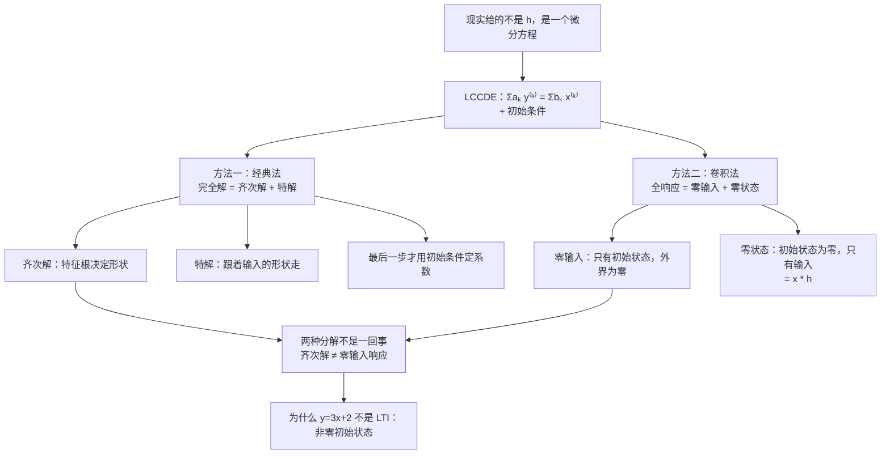

# 2.4 微分方程描述的因果 LTI 系统（连续时间）

> [!abstract] 这一讲的任务
> 前三讲的一切都建立在"已知 $h$"上。可你打开任何一本电路书、任何一份控制系统文档，拿到手的都不是 $h$，而是一个**微分方程**——因为方程是从元件的物理定律（$V=IR$、$I=C\frac{dV}{dt}$）直接列出来的。
> 这一讲要把两个世界接起来：**从微分方程出发怎么求响应？** 你会拿到两套方法——高数里的"齐次解 + 特解"，和本课的"零输入 + 零状态"。它们**长得很像但不是同一种分解**，分不清是本章最大的失分点，这一讲会专门把它们对照着讲清楚。

> [!info] 授课进度说明
> 本篇依据课件整理，**第二章尚未有课堂转写稿**，因此全篇不作「拓展」标注。

> [!info] 编号说明
> 课件 2.4 一节共 39 页，涵盖连续与离散两套求解方法以及方框图表示。本笔记按知识依赖拆成三篇：
> **本篇（连续时间求解，课件 p.49–67）→ [[C2.5 差分方程与离散时间系统求解]]（p.68–87）→ [[C2.6 LTI系统的方框图表示]]（p.88–96）**。
> 笔记编号 C2.4/C2.5/C2.6 与课件小节号 2.4/2.4.2/2.4.3 不完全对应，对照关系见 [[信号与系统 MOC]]。

---

## 0. 开场：一个电容上的旧电荷

你面前是一个 RC 电路：电阻 $R$、电容 $C$ 串联，$t=0$ 时合上开关接入电源 $x(t)$。你要求输出电压 $y(t)$。

列方程很容易，KVL 一写就是
$$RC\,\frac{dy}{dt}+y(t)=x(t)$$

但真要算的时候你会发现一个麻烦：**电容上可能本来就有电**。合闸前它存着 $y(0^-)=1\text{V}$，这 1 伏和你接进去的电源没有任何关系，可它照样会出现在输出里。

于是输出其实是两拨东西叠在一起：
- 一拨来自**电容里的旧电荷**（外界什么都不做，它也会自己放掉）；
- 一拨来自**你刚接上的电源**。

这两拨各是什么、怎么分开算、加起来对不对——就是这一讲的全部内容。而它们的正式名字叫**零输入响应**和**零状态响应**。

---

## 1. 先把方程写规范：LCCDE

> [!important] 线性常系数微分方程 Linear Constant-Coefficient Differential Equation (LCCDE)
> $$\sum_{k=0}^{N}a_k\frac{d^ky(t)}{dt^k}=\sum_{k=0}^{M}b_k\frac{d^kx(t)}{dt^k}$$
> 展开写：
> $$a_Ny^{(N)}(t)+a_{N-1}y^{(N-1)}(t)+\cdots+a_1y'(t)+a_0y(t)=b_Mx^{(M)}(t)+\cdots+b_1x'(t)+b_0x(t)$$
> 配上 **$N$ 个初始条件**：$y(t_0),\ y'(t_0),\ \dots,\ y^{(N-1)}(t_0)$，且 $N\ge M$。

逐项说明（课件默认你都懂，但这几点最容易糊）：

| 要素 | 含义 | 为什么这么规定 |
|---|---|---|
| **线性 Linear** | $y$ 及其各阶导数都是一次的 | 出现 $y^2$、$y\cdot y'$ 就不是 LCCDE，也不是线性系统 |
| **常系数 Constant-Coefficient** | $a_k,b_k$ 是常数，不含 $t$ | 系数含 $t$ 就是**时变**系统（比如 $ty'+y=x$） |
| **阶数 $N$** | $y$ 的最高阶导数 | 它决定了**系统的记忆有多深**，也决定要几个初始条件 |
| **$N$ 个初始条件** | 解才唯一 | $N$ 阶方程积分 $N$ 次，冒出 $N$ 个待定常数 |
| **$N\ge M$** | 右边阶数不高于左边 | 否则系统会包含**纯微分器**，物理上不可实现（对噪声无限敏感，2.6 节会再讲） |

> [!question] 停一下，先自己想想
> 为什么"常系数"这三个字这么重要？如果 $a_1$ 变成 $t$，会破坏 LTI 的哪一条？

破坏的是**时不变性**。系数含 $t$ 意味着"这个系统在不同时刻的行为不一样"，输入晚一秒送进去，输出就不只是晚一秒那么简单了。**常系数 ⇔ 时不变**，这是本章所有方法能用的前提。

---

## 2. 方法一：经典法 The Classical Approach

> [!important] 完全解 = 齐次解 + 特解
> $$y(t)=y_h(t)+y_p(t)$$
> - $y_h(t)$（**homogeneous solution 齐次解**）由**特征根**决定——它描述系统"自己愿意怎么振"，与输入长什么样无关；
> - $y_p(t)$（**particular solution 特解**）的形式**跟着输入走**——输入是指数就试指数，是正弦就试正弦。

### 2.1 齐次解：特征根决定形状

令右边为 0，试 $y=e^{st}$，代入 $a_Ny^{(N)}+\cdots+a_0y=0$，每求一次导出来一个 $s$，约掉公因子 $e^{st}$ 后得到

> [!important] 特征方程 Characteristic Equation
> $$a_Ns^N+a_{N-1}s^{N-1}+\cdots+a_1s+a_0=0$$
> 它的根 $s_1,\dots,s_N$ 叫**特征根 characteristic roots**。

课件把三种根型分别列出（p.60）：

| 根的类型 | 齐次解形式 |
|---|---|
| **(1) 互异实根** $s_1,\dots,s_n$ | $y_h(t)=K_1e^{s_1t}+K_2e^{s_2t}+\cdots+K_ne^{s_nt}$ |
| **(2) $n$ 重实根** $s_1=\cdots=s_n=s$ | $y_h(t)=K_1e^{st}+K_2te^{st}+\cdots+K_nt^{\,n-1}e^{st}$ |
| **(3) 共轭复根** $s_i=\sigma_i\pm j\omega_i$ | $y_h(t)=e^{\sigma_1t}(K_1\cos\omega_1t+K_2\sin\omega_1t)+\cdots$ |

![[C2-零输入响应-三类特征根.png]]

> [!question] 为什么重根要多乘一个 $t$？
> 因为 $n$ 个线性无关的解只找到了一个（$e^{st}$），凑不齐 $N$ 维解空间。补的办法是乘 $t$ 的幂——可以直接验证 $te^{st}$ 也满足方程。
> **回收伏笔**：这和 [[C2.1 离散时间LTI系统与卷积和]] 里 $\alpha^nu[n]*\alpha^nu[n]=(n+1)\alpha^nu[n]$ 冒出的那个 $n+1$ 是同一个现象——**"重"这件事，永远用乘一个多项式因子来补。**

> [!question] 为什么共轭复根要写成 $e^{\sigma t}(K_1\cos\omega t+K_2\sin\omega t)$？
> 根 $\sigma\pm j\omega$ 对应 $e^{(\sigma\pm j\omega)t}=e^{\sigma t}(\cos\omega t\pm j\sin\omega t)$。
> 两个复解的线性组合可以凑出两个**实**解 $e^{\sigma t}\cos\omega t$ 和 $e^{\sigma t}\sin\omega t$，把复系数换成实系数 $K_1,K_2$。
> 物理解读一眼看穿：**$\sigma$ 管衰减快慢（包络），$\omega$ 管振荡快慢**——正是 [[C1.3 指数信号与正弦信号]] 里"一般复指数 = 包络 × 振荡"的老结论。$\sigma<0$ 才会衰减，这一点在讲稳定性时会再用。

### 2.2 特解：跟着输入的形状走

| 输入 $x(t)$ | 试探的 $y_p(t)$ |
|---|---|
| 常数 $A$ | $K$ |
| $e^{\alpha t}$ | $Ce^{\alpha t}$ |
| $\cos\omega t$ 或 $\sin\omega t$ | $K_1\cos\omega t+K_2\sin\omega t$ |
| $t^m$ | $K_mt^m+\cdots+K_1t+K_0$ |

> [!warning] 特解的两个坑
> 1. **输入频率与特征根撞车时要乘 $t$。** 若输入是 $e^{-2t}$ 而 $s=-2$ 恰好是特征根，试 $Ce^{-2t}$ 会全部约掉得到 $0=e^{-2t}$（矛盾），必须改试 $Cte^{-2t}$。这和重根补 $t$ 是同一个道理。
> 2. **输入是 $\cos$ 也要把 $\sin$ 一起试。** 只试 $K\cos\omega t$，求一次导出来 $\sin$，两边配不平。

### 2.3 例题：$y''+6y'+8y=x(t)$，$x(t)=e^{-t}u(t)$，$y(0)=1$，$y'(0)=2$

> [!example] 课件 p.54–56，求全响应

**(1) 齐次解。** 特征方程
$$s^2+6s+8=0\ \Rightarrow\ (s+2)(s+4)=0\ \Rightarrow\ s_1=-2,\ s_2=-4$$
（互异实根）
$$y_h(t)=Ae^{-2t}+Be^{-4t},\qquad t>0$$

**(2) 特解。** 输入是 $e^{-t}$，试 $y_p(t)=Ce^{-t}$。代入：
$$\underbrace{Ce^{-t}}_{y_p''}+6\underbrace{(-Ce^{-t})}_{y_p'}+8\underbrace{Ce^{-t}}_{y_p}=e^{-t}$$
$$(1-6+8)C=1\ \Rightarrow\ 3C=1\ \Rightarrow\ C=\frac13$$
$$y_p(t)=\frac13e^{-t},\qquad t>0$$

> [!tip] 这里有个快捷方式
> 试 $Ce^{\alpha t}$ 时，只要把 $\alpha$ 代进**特征多项式**就行：$C\cdot P(\alpha)=1$，其中 $P(s)=s^2+6s+8$。$P(-1)=1-6+8=3$，直接得 $C=1/3$。
> **这个"代进特征多项式"就是第 9 章拉普拉斯变换里 $H(s)=\frac{1}{P(s)}$ 的雏形**——到那时你会发现整套经典法都被一条代数式取代。

**(3) 用初始条件定系数。**
$$y(t)=Ae^{-2t}+Be^{-4t}+\tfrac13e^{-t}$$
$$y(0)=A+B+\tfrac13=1$$
$$y'(0)=-2A-4B-\tfrac13=2$$
解得
$$A=\frac52,\qquad B=-\frac{11}{6}$$

$$\boxed{\ y(t)=\frac52e^{-2t}-\frac{11}{6}e^{-4t}+\frac13e^{-t},\qquad t>0\ }$$

**数值验算**（python）：$y(0)=2.5-1.8333+0.3333=1.000$ ✓；$y'(0)=-5+7.3333-0.3333=2.000$ ✓；把 $y$ 代回方程，$t=0.7$ 处残差 $7.8\times10^{-16}$ ✓。

> [!warning] 顺序不能反
> **必须先把 $y_h+y_p$ 合起来，再用初始条件定 $A,B$。**
> 如果你先拿初始条件去定齐次解里的 $A,B$，再把特解加上去，答案一定错——因为初始条件约束的是**完整的 $y$**，不是 $y_h$。这是经典法最高频的错误，没有之一。

### 2.4 课件的两个追问（p.57）

> [!question] 1）初始条件不变，输入换成 $x(t)=\sin t\,u(t)$，$y(t)=$？
> 2）输入不变，初始条件换成 $y(0)=0$、$y'(0)=1$，$y(t)=$？

> [!important] 这两问在说什么
> 它们在逼你看清一件事：**换输入要重算特解，换初始条件不用重算特解。**
> - 换输入 ⇒ $y_p$ 的形式变（$\sin t$ 要试 $K_1\cos t+K_2\sin t$），$y_h$ 的形式**不变**（特征根只由方程左边决定），然后重新定 $A,B$；
> - 换初始条件 ⇒ $y_h$ 和 $y_p$ 的**形式都不变**，只要重解那两个方程。
>
> 完整解答见本篇自测第 4、5 题。
>
> 顺着这两问再想一层：既然"输入"和"初始状态"的影响可以分开讨论，能不能把响应本身也按这两个来源拆开？**能——那就是下一节的零输入 / 零状态分解。** 经典法的"齐次+特解"是按**数学形式**拆的，零输入/零状态是按**物理来源**拆的。

---

## 3. 方法二：卷积法——零输入 + 零状态

> [!important] 全响应的物理分解
> $$y(t)=y_{zi}(t)+y_{zs}(t)=y_{zi}(t)+x(t)*h(t)$$
> - **零输入响应 Zero-Input Response $y_{zi}$**：只由**初始状态**产生，没有任何外部激励。
>   > 课件定义：*The zero-input response results only from the initial state of the system and not from any external drive.*
> - **零状态响应 Zero-State Response $y_{zs}$**：初始状态为零，只由**输入**产生。
>   > 课件定义：*The zero-state response is the behavior or response of a system with initial state of zero. It results only from the external inputs or driving functions and not from the initial state.*

回到开场：**电容里的旧电荷 → 零输入响应；刚接上的电源 → 零状态响应。** 名字晦涩，物理却直白。

**怎么算：**
- $y_{zi}$：解**齐次**微分方程（令 $x=0$），用**原始初始条件** $y(0^-),y'(0^-),\dots$ 定系数；
- $y_{zs}$：两条路——① 直接算卷积 $x*h$；② 解完整方程但把初始条件全部取零。

### 3.1 零输入响应例题（课件 p.61–63 三种根型）

> [!example] (a) 互异实根：$y''+5y'+6y=4x$，$y(0^-)=1$，$y'(0^-)=3$
> 特征方程 $s^2+5s+6=0\Rightarrow s_1=-2,\ s_2=-3$
> $$y_{zi}(t)=K_1e^{-2t}+K_2e^{-3t}$$
> $$\begin{cases}y(0^-)=K_1+K_2=1\\ y'(0^-)=-2K_1-3K_2=3\end{cases}\Rightarrow K_1=6,\ K_2=-5$$
> $$\boxed{\ y_{zi}(t)=6e^{-2t}-5e^{-3t},\qquad t\ge0\ }$$
> **验算**：$6-5=1$ ✓；$-12+15=3$ ✓。

> [!example] (b) 重根：$y''+4y'+4y=4x$，$y(0^-)=1$，$y'(0^-)=3$
> $s^2+4s+4=0\Rightarrow s_1=s_2=-2$（**double root**）
> $$y_{zi}(t)=K_1e^{-2t}+K_2te^{-2t}$$
> $y(0^-)=K_1=1$；$y'(t)=-2K_1e^{-2t}+K_2(1-2t)e^{-2t}$，故 $y'(0^-)=-2K_1+K_2=3\Rightarrow K_2=5$。
>
> > [!warning] 课件此处的结论与它自己列出的方程不一致
> > 课件这一页写出的两个条件是 $y(0^-)=K_1=1$ 与 $y'(0^-)=-2K_1+K_2=3$，由此应得 $K_1=1,\ K_2=5$；但结论框里给的是 $K_1=2,\ K_2=3$，对应 $y_{zi}=2e^{-2t}+3te^{-2t}$，在 $t=0$ 处等于 2，与题设 $y(0^-)=1$ 矛盾。**按题设与课件自己的两式应为**
> > $$\boxed{\ y_{zi}(t)=e^{-2t}+5te^{-2t}\ }$$
> > 验算：$y(0)=1$ ✓，$y'(0)=-2+5=3$ ✓。
> > （上面那张三类根型的图里画的是课件版 $2e^{-2t}+3te^{-2t}$，形状规律一致，只是系数不同。做题时以题设初始条件为准。）

> [!example] (c) 共轭复根：$y''+2y'+5y=4x$，$y(0^-)=1$，$y'(0^-)=3$
> $s^2+2s+5=0\Rightarrow s=-1\pm2j$
> $$y_{zi}(t)=e^{-t}(K_1\cos2t+K_2\sin2t)$$
> $y(0^-)=K_1=1$；求导：$y'=-e^{-t}(K_1\cos2t+K_2\sin2t)+e^{-t}(-2K_1\sin2t+2K_2\cos2t)$，在 $t=0$ 处 $=-K_1+2K_2=3\Rightarrow K_2=2$。
> $$\boxed{\ y_{zi}(t)=e^{-t}(\cos2t+2\sin2t),\qquad t\ge0\ }$$
> **验算**：$y(0)=1$ ✓；$y'(0)=-1+4=3$ ✓。

> [!warning] $0^-$ 和 $0^+$ 的区别，这里必须说清楚
> - $y(0^-)$：**输入接进来之前**一瞬间的状态，是电容电压 / 电感电流这些**真实储能**；
> - $y(0^+)$：输入接上之后一瞬间的状态。
>
> 求**零输入响应**时用的一定是 $y(0^-)$（那时外界还没动手）；用经典法求**全响应**时，如果输入里含 $\delta$ 或有跳变，$y(0^+)\ne y(0^-)$，要先做"**跳变分析**"把 $0^-$ 换算成 $0^+$。
> 本讲的例题输入都不含冲激，所以两者相等，可以不区分——但**题目一旦写 $0^-$，就是在提醒你这件事**。

### 3.2 零状态响应例题（课件 p.65–67，一题两解）

> [!example] $y'(t)+3y(t)=2x(t)$，$h(t)=2e^{-3t}u(t)$，$x(t)=3u(t)$，求 $y_{zs}$

**解法一：卷积**
$$y_{zs}(t)=x*h=\int_{-\infty}^{+\infty}3u(\tau)\cdot2e^{-3(t-\tau)}u(t-\tau)\,d\tau$$
两个阶跃把积分限夹成 $0\le\tau\le t$（$t>0$）：
$$=\int_0^t6e^{-3(t-\tau)}d\tau=6e^{-3t}\int_0^te^{3\tau}d\tau=6e^{-3t}\cdot\frac{e^{3t}-1}{3}=2(1-e^{-3t})$$
$$\boxed{\ y_{zs}(t)=2(1-e^{-3t})u(t)\ }$$

**解法二：解方程，初始状态取零**
- 特征方程 $s+3=0\Rightarrow s=-3$，齐次解 $y_h=Ae^{-3t}$；
- 输入是常数（$3u(t)$，$t>0$ 时为常数 3），试 $y_p=K$：代入 $0+3K=2\times3=6\Rightarrow K=2$；
- 完全解 $y=Ae^{-3t}+2$；
- **用零初始状态** $y(0)=0$：$A+2=0\Rightarrow A=-2$。
$$y(t)=-2e^{-3t}+2=2(1-e^{-3t})u(t)$$

**两条路结果完全一致** ✓（python 在 $t=0.1,1,3$ 处逐点比对，差值为 0）。

> [!question] 停一下，我们刚才干了什么
> 我们用两种完全不同的工具算了同一个东西：一个是**积分**（卷积），一个是**解方程**。它们必然一致，因为 $h$ 本身就是这个方程在 $x=\delta$ 时的零状态响应。
> **实用建议**：
> - 输入形状简单（阶跃、指数、常数）⇒ **解方程更快**；
> - 输入是有限长的分段信号（方波、三角波）⇒ **卷积更快**；
> - 要看系统本身的性质（因果、稳定）⇒ 必须回到 $h$。

---

## 4. 为什么 $y=3x+2$ 不是 LTI 系统（课件 p.59）

> [!example] 判断下列系统是否为 LTI
> 1. $y(t)=3x(t)+2$   ( **×** )
> 2. $y(t)=3x(t)$    ( **√** )

**第 1 个为什么不行**（课件原文的验证）：
$$x_1\to y_1=3x_1+2,\qquad x_2\to y_2=3x_2+2$$
$$x_3=x_1+x_2\ \to\ y_3=3x_3+2=3x_1+3x_2+2\ \neq\ y_1+y_2=3x_1+3x_2+4$$
差了一个 2 ⇒ **不满足可加性 ⇒ 非线性**。

**第 2 个**：$x_3=ax_1+bx_2\to y_3=3ax_1+3bx_2=ay_1+by_2$ ✓，是纯 LTI。

> [!important] 课件给出的深层解释，比"验证一遍"重要得多
> 课件在这一页下方点明：
> - 第 1 个系统的**初始状态 $y(0)=2$**，标注为 **"LTI with nonzero initial state"（带非零初始状态的 LTI 系统）**；
> - 第 2 个系统 $y(0)=0$，标注为 **"Pure LTI"（纯 LTI）**。
>
> 也就是说：**那个 2 不是凭空多出来的常数，它就是零输入响应。**
> 一个"LTI 方程 + 非零初始状态"的系统，严格来说**不是** LTI 系统——因为线性要求"零输入必须给出零输出"。

> [!important] 由此得到本章最容易被考的一条结论
> **只有零状态响应 $y_{zs}$ 才等于 $x*h$。**
> $$y_{zs}=x*h\quad\text{✓}\qquad\qquad y=x*h\quad\text{✗（除非初始状态为零）}$$
> 前三讲所有"$y=x*h$"的公式，隐含前提都是**系统初始松弛（initially at rest）**。这个前提在本讲第一次被打破，所以必须补上 $y_{zi}$ 这一项。

---

## 5. 两种分解，一张表说清

这是本章最容易混的地方，单独列出来：

> [!important] 齐次解 / 特解 ✗ 零输入 / 零状态
> | | 经典法 | 卷积法 |
> |---|---|---|
> | 分解 | $y=y_h+y_p$ | $y=y_{zi}+y_{zs}$ |
> | 分解依据 | **数学形式**（解的结构） | **物理来源**（谁引起的） |
> | 第一项 | 齐次解：特征根决定形状，**系数由全解的初始条件定** | 零输入响应：只由初始状态决定 |
> | 第二项 | 特解：形状跟着输入 | 零状态响应：$=x*h$ |
> | 系数什么时候定 | **最后**，用 $y_h+y_p$ 一起定 | $y_{zi}$ 单独用 $y(0^-)$ 定 |
>
> **关键区别：$y_h\neq y_{zi}$！**
> 两者的**函数形式相同**（都是特征根那几个指数的组合），但**系数不同**：
> - $y_h$ 的系数是在 $y_h+y_p$ 合体之后、用全部初始条件定的；
> - $y_{zi}$ 的系数是**只用初始条件、完全不管输入**定的。
>
> 同理 $y_p\neq y_{zs}$。**四项两两都不相等，只有它们各自的和 $y$ 相等。**

> [!example] 用第 2.3 节的例题亲眼看一次差别
> $y''+6y'+8y=e^{-t}u(t)$，$y(0)=1$，$y'(0)=2$。
> **经典法**：$y_h=\frac52e^{-2t}-\frac{11}{6}e^{-4t}$，$y_p=\frac13e^{-t}$。
> **零输入**（令 $x=0$，用同样的 $y(0)=1,y'(0)=2$）：
> $K_1+K_2=1$，$-2K_1-4K_2=2$ $\Rightarrow K_1=3,\ K_2=-2$，即 $y_{zi}=3e^{-2t}-2e^{-4t}$。
> **对比**：$y_h=\frac52e^{-2t}-\frac{11}{6}e^{-4t}$ 与 $y_{zi}=3e^{-2t}-2e^{-4t}$ —— **形状一样，系数完全不同。**
> 于是零状态响应是
> $$y_{zs}=y-y_{zi}=\Big(\tfrac52-3\Big)e^{-2t}+\Big(-\tfrac{11}{6}+2\Big)e^{-4t}+\tfrac13e^{-t}=-\tfrac12e^{-2t}+\tfrac16e^{-4t}+\tfrac13e^{-t}$$
> 验算：$y_{zs}(0)=-0.5+0.1667+0.3333=0$ ✓（零初始状态），$y_{zs}'(0)=1-0.6667-0.3333=0$ ✓。
> **这就是课件 p.87 随堂测第 1 题的完整答案。**

---

## 6. 随堂测（课件 p.87）

> [!example] 主观题 10 分
> The LTI system is given by $y''(t)+6y'(t)+8y(t)=x(t),\ t>0$ with initial conditions $y(0)=1,\ y'(0)=2$ and input signal $x(t)=e^{-t}u(t)$.
> Please determine the **zero-input response** $y_{zi}(t)$ and **zero-state response** $y_{zs}(t)$ of this system, respectively.

答案就是上一节那个对比框：
$$y_{zi}(t)=3e^{-2t}-2e^{-4t},\qquad y_{zs}(t)=-\tfrac12e^{-2t}+\tfrac16e^{-4t}+\tfrac13e^{-t},\qquad t\ge0$$
详细步骤见本篇自测第 6 题。

---

## 这一讲的三句话

1. **LCCDE 是现实给你的东西**：线性、常系数、$N$ 阶、$N$ 个初始条件、$N\ge M$，每个限定词都对应一条系统性质。
2. **两条路都能走到底**：经典法（齐次+特解，最后统一定系数）和卷积法（零输入+零状态，$y_{zs}=x*h$）。
3. **$y_h\ne y_{zi}$，$y_p\ne y_{zs}$**；并且**只有零状态响应才等于 $x*h$**——初始状态非零的系统严格来说不是 LTI（课件的 $y=3x+2$ 就是例子）。

> [!tip] 速查表
> | 项目 | 内容 |
> |---|---|
> | 特征方程 | $a_Ns^N+\cdots+a_0=0$ |
> | 互异实根 | $\sum K_ie^{s_it}$ |
> | $n$ 重实根 | $(K_1+K_2t+\cdots+K_nt^{n-1})e^{st}$ |
> | 共轭复根 $\sigma\pm j\omega$ | $e^{\sigma t}(K_1\cos\omega t+K_2\sin\omega t)$ |
> | 特解：输入 $e^{\alpha t}$ | $Ce^{\alpha t}$，$C=1/P(\alpha)$（$P$ 为特征多项式） |
> | 特解：输入常数 | $K$ |
> | 特解：输入 $\cos\omega t$ | $K_1\cos\omega t+K_2\sin\omega t$ |
> | 撞车（$\alpha$ 是特征根） | 试探解乘 $t$ |
> | 全响应 | $y=y_h+y_p=y_{zi}+y_{zs}$ |
> | 零状态 | $y_{zs}=x*h$，或解方程取零初始状态 |
> | 零输入 | 解齐次方程，用 $y(0^-)$ 等定系数 |

> [!tip] 下一讲预告
> 连续时间讲完了。离散时间呢？**差分方程 $y[n]-5y[n-1]+6y[n-2]=x[n]$ 长得和微分方程几乎一样，解法也几乎一样**——特征根、重根乘 $n$、零输入零状态，全都能平移过去。
> 但离散世界多了一件连续世界做不到的事：**你可以拿计算器一步一步把 $y[0],y[1],y[2],\dots$ 直接算出来**。这个"迭代法"三行代码就能写完，可它有个致命缺点——下一讲第一节就会撞上这堵墙。

---

## 本节自测 Self-Test

> [!question] 1. LCCDE 里"线性""常系数""$N\ge M$"三个限定各自对应什么系统性质？

> [!success]- 答案
> - **线性**：$y$ 及各阶导数都是一次 ⇒ 系统满足叠加性；
> - **常系数**：系数不含 $t$ ⇒ **时不变**；
> - **$N\ge M$**：否则系统含纯微分器，**物理不可实现**（微分器对高频噪声增益无限大，见 [[C2.6 LTI系统的方框图表示]]）。

> [!question] 2. $y_h$ 和 $y_{zi}$ 有什么关系？相等吗？

> [!success]- 答案
> **函数形式相同，系数一般不同**。都是特征根决定的那几个指数的线性组合，但：
> - $y_h$ 的系数在 $y_h+y_p$ 合体后、用全部初始条件定；
> - $y_{zi}$ 的系数只用初始条件定，完全不看输入。
> 只有当输入为零（$y_p=0$）时两者才相等。

> [!question] 3. 求 $y''+3y'+2y=x$，$x(t)=u(t)$，$y(0)=0$，$y'(0)=0$ 的全响应。

> [!success]- 答案（完整步骤）
> **齐次解**：$s^2+3s+2=0\Rightarrow s=-1,-2$，$y_h=Ae^{-t}+Be^{-2t}$。
> **特解**：输入是常数 1，试 $y_p=K$：$0+0+2K=1\Rightarrow K=\frac12$。
> （快捷式：$K=1/P(0)=1/2$ ✓）
> **全解**：$y=Ae^{-t}+Be^{-2t}+\frac12$。
> $$y(0)=A+B+\tfrac12=0,\qquad y'(0)=-A-2B=0$$
> 由第二式 $A=-2B$，代入第一式：$-2B+B=-\frac12\Rightarrow B=\frac12,\ A=-1$。
> $$\boxed{\ y(t)=-e^{-t}+\tfrac12e^{-2t}+\tfrac12,\qquad t\ge0\ }$$
> **验算**：$y(0)=-1+0.5+0.5=0$ ✓；$y'(0)=1-1=0$ ✓；$t\to\infty$ 时 $y\to\frac12$（直流增益 $b_0/a_0=1/2$）✓。
> 因为初始状态为零，这里的**全响应就是零状态响应**。

> [!question] 4. （课件 p.57 第 1 问）$y''+6y'+8y=x$，$y(0)=1,y'(0)=2$，输入换成 $x(t)=\sin t\,u(t)$，求 $y(t)$。

> [!success]- 答案（完整步骤）
> **齐次解不变**：$y_h=Ae^{-2t}+Be^{-4t}$。
> **特解**：输入是 $\sin t$，试 $y_p=K_1\cos t+K_2\sin t$。
> $y_p'=-K_1\sin t+K_2\cos t$；$y_p''=-K_1\cos t-K_2\sin t$。代入：
> $$(-K_1\cos t-K_2\sin t)+6(-K_1\sin t+K_2\cos t)+8(K_1\cos t+K_2\sin t)=\sin t$$
> 按 $\cos t$、$\sin t$ 分别配平：
> $$\cos t:\ -K_1+6K_2+8K_1=0\ \Rightarrow\ 7K_1+6K_2=0$$
> $$\sin t:\ -K_2-6K_1+8K_2=1\ \Rightarrow\ -6K_1+7K_2=1$$
> 解得 $K_1=-\dfrac{6}{85}$，$K_2=\dfrac{7}{85}$。
> **定系数**：$y=Ae^{-2t}+Be^{-4t}-\frac{6}{85}\cos t+\frac{7}{85}\sin t$
> $$y(0)=A+B-\tfrac{6}{85}=1\ \Rightarrow\ A+B=\tfrac{91}{85}$$
> $$y'(0)=-2A-4B+\tfrac{7}{85}=2\ \Rightarrow\ -2A-4B=\tfrac{163}{85}$$
> 由第一式 $A=\frac{91}{85}-B$，代入：$-2(\frac{91}{85}-B)-4B=\frac{163}{85}\Rightarrow-2B=\frac{163+182}{85}=\frac{345}{85}$，
> $$B=-\frac{345}{170}=-\frac{69}{34},\qquad A=\frac{91}{85}+\frac{69}{34}=\frac{182+345}{170}=\frac{527}{170}$$
> $$\boxed{\ y(t)=\tfrac{527}{170}e^{-2t}-\tfrac{69}{34}e^{-4t}-\tfrac{6}{85}\cos t+\tfrac{7}{85}\sin t\ }$$
> **验算**：$y(0)=3.1=3.1\dots$ 具体地 $\frac{527}{170}=3.1000$，$\frac{69}{34}=2.0294$，$3.1000-2.0294-0.0706=1.0000$ ✓；
> $y'(0)=-2(3.1)+4(2.0294)+\frac{7}{85}=-6.2+8.1176+0.0824=2.0000$ ✓。
> **要点**：换输入只需重算特解，齐次解形式不动，但系数要重定。

> [!question] 5. （课件 p.57 第 2 问）同一方程、输入仍是 $e^{-t}u(t)$，初始条件改为 $y(0)=0,\ y'(0)=1$，求 $y(t)$。

> [!success]- 答案
> $y_h$、$y_p$ 形式都不变：$y=Ae^{-2t}+Be^{-4t}+\frac13e^{-t}$。
> $$y(0)=A+B+\tfrac13=0,\qquad y'(0)=-2A-4B-\tfrac13=1$$
> 即 $A+B=-\frac13$，$-2A-4B=\frac43$。由第一式 $A=-\frac13-B$：
> $$-2(-\tfrac13-B)-4B=\tfrac23-2B=\tfrac43\ \Rightarrow\ B=-\tfrac13,\quad A=0$$
> $$\boxed{\ y(t)=-\tfrac13e^{-4t}+\tfrac13e^{-t},\qquad t\ge0\ }$$
> **验算**：$y(0)=-\frac13+\frac13=0$ ✓；$y'(0)=\frac43-\frac13=1$ ✓。
> **要点**：换初始条件时，$y_h$ 和 $y_p$ 的形式都不用动，只重解那两个线性方程。

> [!question] 6. （随堂测）$y''+6y'+8y=x$，$y(0)=1$，$y'(0)=2$，$x=e^{-t}u(t)$。分别求 $y_{zi}$ 和 $y_{zs}$。

> [!success]- 答案（完整步骤）
> **零输入响应**：令 $x=0$，解齐次方程，用原初始条件。
> $$y_{zi}=K_1e^{-2t}+K_2e^{-4t}$$
> $$K_1+K_2=1,\qquad -2K_1-4K_2=2$$
> 由第一式 $K_1=1-K_2$，代入：$-2+2K_2-4K_2=2\Rightarrow-2K_2=4\Rightarrow K_2=-2,\ K_1=3$。
> $$\boxed{\ y_{zi}(t)=3e^{-2t}-2e^{-4t},\quad t\ge0\ }$$
> **零状态响应**：解同一方程但取零初始状态。
> $$y_{zs}=Ae^{-2t}+Be^{-4t}+\tfrac13e^{-t}$$
> $$A+B+\tfrac13=0,\qquad -2A-4B-\tfrac13=0$$
> 由第一式 $A=-\frac13-B$，代入第二式：$\frac23+2B-4B=\frac13\Rightarrow-2B=-\frac13\Rightarrow B=\frac16,\ A=-\frac12$。
> $$\boxed{\ y_{zs}(t)=-\tfrac12e^{-2t}+\tfrac16e^{-4t}+\tfrac13e^{-t},\quad t\ge0\ }$$
> **自检（必做）**：两者相加应等于第 2.3 节算出的全响应
> $$3-\tfrac12=\tfrac52\ ✓,\qquad -2+\tfrac16=-\tfrac{11}{6}\ ✓,\qquad \tfrac13\ ✓$$
> 完全吻合。
> **另一条路**：也可以先求 $h(t)$ 再卷积。由 $P(s)=(s+2)(s+4)$ 得 $h(t)=\frac12(e^{-2t}-e^{-4t})u(t)$（留数/部分分式，第 9 章会系统讲），再算 $e^{-t}u(t)*h(t)$，结果相同。

> [!question] 7. 为什么 $y(t)=3x(t)+2$ 不是 LTI 系统？它和"LTI 系统"差在哪？

> [!success]- 答案
> 不满足可加性：$y_3=3(x_1+x_2)+2$，而 $y_1+y_2=3x_1+3x_2+4$，差一个常数 2。
> 本质上它是一个**初始状态非零的 LTI 系统**（课件标注 "LTI with nonzero initial state"），那个 2 就是它的**零输入响应**。
> 线性系统必须满足"零输入 ⇒ 零输出"，所以只有 $y(0)=0$ 的 "Pure LTI" 才是真正的 LTI。
> **直接推论**：$y=x*h$ 只对零状态响应成立。

> [!question] 8. 什么时候必须区分 $y(0^-)$ 和 $y(0^+)$？

> [!success]- 答案
> 当输入在 $t=0$ 处含**冲激**或有**跳变**，且系统会把它传到输出上时。此时 $y(0^+)\neq y(0^-)$，要先做跳变分析。
> 求**零输入响应**永远用 $y(0^-)$（外界还没动手时的真实储能）。
> 本讲的例题输入都不含冲激，两者相等，所以题目写 $y(0)$ 或 $y(0^-)$ 都可以。

---

## 相关笔记 Related Notes

- [[信号与系统 MOC]]
- 上一节：[[C2.3 LTI系统的性质]]
- 下一节：[[C2.5 差分方程与离散时间系统求解]]
- 相关：[[C1.5 连续时间与离散时间系统]]（RC 电路列微分方程）、[[C1.3 指数信号与正弦信号]]（复指数的包络×振荡）、[[C2.6 LTI系统的方框图表示]]（方程如何变成电路）
