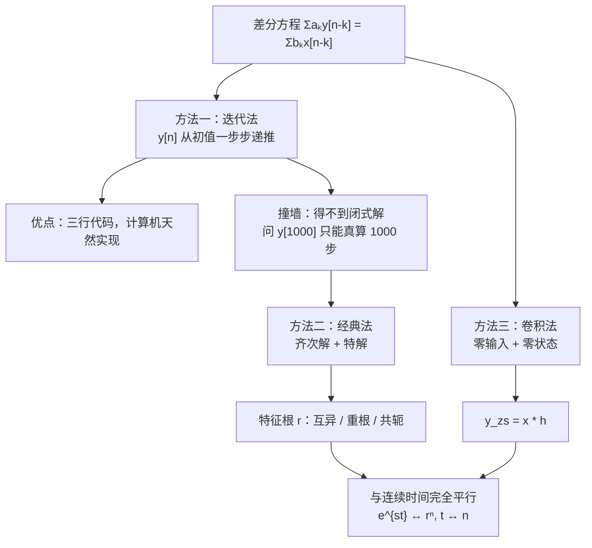

# 2.5 差分方程描述的因果 LTI 系统（离散时间）

> [!abstract] 这一讲的任务
> 上一讲把微分方程解完了。这一讲换成**差分方程**——你会发现整套方法几乎可以原样搬过来：特征根、重根乘 $n$、零输入 + 零状态，一个不少。
> 但离散世界多了一件连续世界**做不到**的事：**直接一步一步把 $y[0],y[1],y[2],\dots$ 算出来**。三行代码就能写完，计算机天生就这么干。可它有个致命缺点——这一讲第一节就撞上那堵墙。
> 另外，这一讲也是本章**课件笔误最集中的一段**，笔记里逐条复算并标出，做题时请以复算结果为准。

> [!info] 授课进度说明
> 本篇依据课件整理，**第二章尚未有课堂转写稿**，因此全篇不作「拓展」标注。

---

## 0. 开场：一个每月都在滚的余额

你有一张信用卡，月利率 0.5%。设 $y[n]$ 是第 $n$ 个月末的欠款，$x[n]$ 是这个月新刷的钱。银行的规则是：

$$y[n]=1.005\,y[n-1]+x[n]$$

这就是一个**一阶差分方程**。

它和上一讲的微分方程有个关键差别：**你可以立刻开始算**。已知上个月余额 $y[-1]$，这个月刷了多少 $x[0]$，$y[0]$ 就出来了；有了 $y[0]$ 再算 $y[1]$……一路滚下去，完全不需要任何理论。

这正是差分方程的魅力，也是它的陷阱。我们先享受一下，再看看陷阱在哪。

---

## 1. 先把方程写规范：差分方程 LCCDE

> [!important] 线性常系数差分方程 Linear Constant-Coefficient Difference Equation
> $$\sum_{k=0}^{N}a_k\,y[n-k]=\sum_{k=0}^{M}b_k\,x[n-k]$$
> 展开：
> $$a_0y[n]+a_1y[n-1]+\cdots+a_Ny[n-N]=b_0x[n]+b_1x[n-1]+\cdots+b_Mx[n-M]$$
> 初始条件：$y[0],\ y[-1],\ \dots,\ y[-(N-1)]$，且 $N\ge M$。

和微分方程逐项对照：

| 连续时间 | 离散时间 |
|---|---|
| $\dfrac{d^ky}{dt^k}$ | $y[n-k]$（**延迟**代替求导） |
| 试探解 $e^{st}$ | 试探解 $r^{\,n}$ |
| 特征方程关于 $s$ | 特征方程关于 $r$ |
| 初始条件 $y(0),y'(0),\dots$ | 初始条件 $y[-1],y[-2],\dots$ |
| 积分器是记忆元件 | **延迟器**是记忆元件 |

> [!question] 停一下，为什么离散方程里"求导"变成了"延迟"？
> 因为离散的导数就是差分：$\dfrac{dy}{dt}\approx\dfrac{y[n]-y[n-1]}{T}$。
> 所以"$y$ 的一阶导数"这件事，在离散世界里靠"**取出上一拍的值**"来实现——记忆元件从积分器变成了延迟器（**D**，delay）。这一点在 [[C2.6 LTI系统的方框图表示]] 里会变成实实在在的框图方块。

---

## 2. 方法一：迭代法 Iterative Method（然后撞墙）

把方程解出 $y[n]$（要求 $a_0\ne0$）：

> [!important] 递推形式（recursive algorithm）
> $$y[n]=\frac{1}{a_0}\left\{-\sum_{k=1}^{N}a_k\,y[n-k]+\sum_{k=0}^{M}b_k\,x[n-k]\right\}$$
> 给定初值 $\{y[-1],y[-2],\dots,y[-N]\}$ 和输入，就能一拍一拍算下去。

> [!example] 课件 p.69
> $y[n]-0.5y[n-1]=u[n]$，$y[-1]=1$，用迭代法求输出。
>
> 改写：$y[n]=u[n]+0.5\,y[n-1]$
> $$y[0]=1+0.5\times1=1.5$$
> $$y[1]=1+0.5\times1.5=1.75$$
> $$y[2]=1+0.5\times1.75=1.875$$
> $$y[3]=1+0.5\times1.875=1.9375\ \dots$$

![[C2-迭代法-一阶差分方程.png]]

**数值验算**（python 递推 12 拍）：$1.5,\ 1.75,\ 1.875,\ 1.9375,\ 1.96875,\dots\to2$，与图一致。

> [!warning] 撞墙：Shortcoming — Can not get the closed solution
> 课件原话就一句"**得不到闭式解**"，但这句话的分量要说透：
> - 你能看出它趋于 2 吗？图上能看出来，但**迭代本身不会告诉你极限是 2**；
> - 问 $y[1000]$ 是多少？只能老老实实算 1000 步；
> - 问"换一个初值会怎样"、"稳不稳定"、"衰减多快"？迭代法一个都答不了——它给的是**一堆数**，不是**一个公式**。
>
> 所以我们还是需要能给出 $y[n]$ 表达式的方法。
>
> **反过来说**，迭代法在工程上极其重要：**计算机里跑的就是它**。DSP 芯片、`scipy.signal.lfilter`、IIR 滤波器的实时实现，全是这行递推式。理论上我们要闭式解，实现上我们要递推式——两者各司其职。

> [!tip] 顺手把闭式解求出来（对照用）
> 这道题的答案是 $y[n]=2-0.5^{\,n+1}$（$n\ge0$）。验证：$y[0]=2-0.5=1.5$ ✓，$y[1]=2-0.25=1.75$ ✓，$y[2]=2-0.125=1.875$ ✓。
> 有了它，"$y[1000]$"和"极限是 2"都是一眼的事。这就是闭式解的价值。求法见第 3 节。

---

## 3. 方法二：经典法 The Classical Approach

> [!important] 完全解 = 齐次解 + 特解
> $$y[n]=y_h[n]+y_p[n]$$
> $y_h$ 由**特征根**决定；$y_p$ 的形式跟着**输入**走。与连续时间一字不差。

### 3.1 齐次解的三种根型（课件 p.76）

试 $y[n]=r^{\,n}$ 代入齐次方程，约掉 $r^{\,n-N}$，得**特征方程**。三种情形：

| 根的类型 | 齐次解形式 |
|---|---|
| **(1) 互异实根** $r_1,\dots,r_N$ | $y_h[n]=C_1r_1^{\,n}+C_2r_2^{\,n}+\cdots+C_Nr_N^{\,n}$ |
| **(2) $N$ 重实根** $r$ | $y_h[n]=C_1r^{\,n}+C_2nr^{\,n}+\cdots+C_Nn^{N-1}r^{\,n}$ |
| **(3) 共轭复根** $r_{1,2}=a\pm jb=\rho e^{\pm j\omega_0}$ | $y_h[n]=C_1\rho^{\,n}\cos\omega_0n+C_2\rho^{\,n}\sin\omega_0n$ |

> [!important] 和连续时间的对照（这张表值得记牢）
> | | 连续 | 离散 |
> |---|---|---|
> | 基本解 | $e^{st}$ | $r^{\,n}$ |
> | 重根补 | 乘 $t^{\,k}$ | 乘 $n^{\,k}$ |
> | 复根写法 | $e^{\sigma t}(\cos\omega t,\sin\omega t)$ | $\rho^{\,n}(\cos\omega_0n,\sin\omega_0n)$ |
> | 衰减条件 | $\mathrm{Re}\{s\}<0$ | $|r|<1$ |
>
> 最后一行是**稳定性判据的雏形**：连续看"实部是否为负"，离散看"**模是否小于 1**"。这条差别会在第 9、10 章变成"左半平面 vs 单位圆内"——拉普拉斯变换和 Z 变换的分水岭。
> $\rho=|r|$、$\omega_0=\arg r$ 正是把复根写成极坐标，这也是为什么离散复根的解里包络是 $\rho^{\,n}$ 而不是指数。

### 3.2 例题：$y[n]-5y[n-1]+6y[n-2]=x[n]$，$x[n]=2^nu[n]$，$y[0]=0$，$y[1]=-1$

> [!example] 课件 p.71–73，求全响应

**(1) 齐次解。** 特征方程
$$r^2-5r+6=0\ \Rightarrow\ (r-2)(r-3)=0\ \Rightarrow\ r_1=2,\ r_2=3$$
$$y_h[n]=C_12^{\,n}+C_23^{\,n}$$

**(2) 特解。** 输入是 $2^n$——但 **$2$ 恰好是特征根**！

> [!warning] 这就是上一讲说的"撞车"，必须乘 $n$
> 若试 $y_p=A2^n$，代入左边会得到 $A\cdot(r^2-5r+6)\big|_{r=2}\cdot2^{n-2}=0$，永远配不出右边的 $2^n$。
> 所以试 $y_p[n]=An\,2^{\,n}$。课件直接给了这个形式，**原因就是特征根与输入撞车**——这一点课件没写，但它是本题的关键。

代入：
$$An2^{\,n}-5A(n-1)2^{\,n-1}+6A(n-2)2^{\,n-2}=2^{\,n}$$
两边除以 $2^{\,n}$：
$$An-\frac52A(n-1)+\frac32A(n-2)=1$$
$$\underbrace{\Big(1-\tfrac52+\tfrac32\Big)}_{=0}An+\underbrace{\Big(\tfrac52-3\Big)}_{=-\frac12}A=1$$
$n$ 的系数自动为 0（**这正是"2 是特征根"的表现**），剩下
$$-\tfrac12A=1\ \Rightarrow\ A=-2$$
$$y_p[n]=-2n\,2^{\,n}=-n\,2^{\,n+1},\qquad n\ge0$$

**(3) 用初始条件定系数。**
$$y[n]=C_12^{\,n}+C_23^{\,n}-n2^{\,n+1}$$
$$y[0]=C_1+C_2-0=0$$
$$y[1]=2C_1+3C_2-1\cdot2^{2}=2C_1+3C_2-4=-1$$

> [!warning] 课件此处把 $y_p[1]$ 写成了 $-2$，应为 $-4$
> $y_p[1]=-1\cdot2^{1+1}=-4$。课件 p.73 的方程写作 $y[1]=2C_1+3C_2-2=-1$，据此解出 $C_1=-1,\ C_2=1$，最终答案 $y[n]=-2^{\,n}+3^{\,n}-n2^{\,n+1}$。
> **复算验证**：把课件答案代回，$y[1]=-2+3-4=-3\neq-1$，与题设初始条件不符；再代回差分方程 $n=2$：应有 $y[2]=5y[1]-6y[0]+4$。
> **正确解**：由 $C_1+C_2=0$、$2C_1+3C_2=3$ 得 $C_2=3,\ C_1=-3$：
> $$\boxed{\ y[n]=-3\cdot2^{\,n}+3\cdot3^{\,n}-n\,2^{\,n+1}=-3\cdot2^{\,n}+3^{\,n+1}-n2^{\,n+1},\qquad n\ge0\ }$$
> **逐点验算**（python 递推 vs 公式）：
> | $n$ | 0 | 1 | 2 | 3 | 4 | 5 |
> |---|---|---|---|---|---|---|
> | 递推 $y[n]$ | 0 | −1 | −1 | 9 | 67 | 313 |
> | **修正公式** | 0 | −1 | −1 | 9 | 67 | 313 ✓ |
> | 课件公式 | 0 | −3 | −11 | −29 | −63 | −109 ✗ |
> 做题请用修正公式。

### 3.3 课件的两个追问（p.74）

> [!question] 1）初始条件不变，输入换成 $x[n]=\sin\Omega_0n\,u[n]$，$y[n]=$？
> 2）输入不变，初始条件换成 $y[0]=1,\ y[1]=1$，$y[n]=$？

和上一讲的两问是同一件事：**换输入要重算特解（$\sin$ 要试 $K_1\cos\Omega_0n+K_2\sin\Omega_0n$，此时不再撞车，不必乘 $n$）；换初始条件只需重解那两个线性方程。** 第 2 问的完整解答见自测第 5 题。

---

## 4. 方法三：零输入 + 零状态

> [!important] 全响应的物理分解
> $$y[n]=y_{zi}[n]+y_{zs}[n]=y_{zi}[n]+x[n]*h[n]$$
> 定义与连续时间完全相同：零输入只由初始状态产生；零状态在初始状态为零时只由输入产生。

### 4.1 零输入响应三例（课件 p.77–79）

> [!example] (a) 互异实根：$y[n]+3y[n-1]+2y[n-2]=x[n]$，$y[-1]=0$，$y[-2]=\tfrac12$
> $r^2+3r+2=0\Rightarrow r_1=-1,\ r_2=-2$
> $$y_{zi}[n]=C_1(-1)^{\,n}+C_2(-2)^{\,n}$$
> 代入初值（注意 $n$ 取负数，要算 $(-1)^{-1}=-1$、$(-2)^{-1}=-\frac12$、$(-2)^{-2}=\frac14$）：
> $$y[-1]=-C_1-\tfrac12C_2=0,\qquad y[-2]=C_1+\tfrac14C_2=\tfrac12$$
> 由第一式 $C_1=-\frac12C_2$，代入第二式：$-\frac12C_2+\frac14C_2=-\frac14C_2=\frac12\Rightarrow C_2=-2,\ C_1=1$。
> $$\boxed{\ y_{zi}[n]=(-1)^{\,n}-2(-2)^{\,n},\qquad n\ge0\ }$$
> **复算**：与课件一致 ✓。

> [!example] (b) 重根：$y[n]+4y[n-1]+4y[n-2]=x[n]$，$y[-1]=0$，$y[-2]=\tfrac12$
> $r^2+4r+4=0\Rightarrow r_1=r_2=-2$（**double root**）
> $$y_{zi}[n]=C_1n(-2)^{\,n}+C_2(-2)^{\,n}$$
> $$y[-1]=C_1(-1)(-2)^{-1}+C_2(-2)^{-1}=\tfrac{C_1}{2}-\tfrac{C_2}{2}=0$$
> $$y[-2]=C_1(-2)(-2)^{-2}+C_2(-2)^{-2}=-\tfrac{C_1}{2}+\tfrac{C_2}{4}=\tfrac12$$
>
> > [!warning] 课件把第二式右端写成了 $-1$，与题设 $y[-2]=\tfrac12$ 不符
> > 课件据 $-\frac{C_1}{2}+\frac{C_2}{4}=-1$ 解出 $C_1=C_2=4$。按题设应为 $\frac12$：
> > 由第一式 $C_1=C_2$，代入第二式 $-\frac{C_1}{2}+\frac{C_1}{4}=-\frac{C_1}{4}=\frac12\Rightarrow C_1=C_2=-2$。
> > $$\boxed{\ y_{zi}[n]=-2n(-2)^{\,n}-2(-2)^{\,n},\qquad n\ge0\ }$$
> > **逐点验算**（由 $y[n]=-4y[n-1]-4y[n-2]$ 从 $y[-1]=0,y[-2]=\frac12$ 递推）：
> > | $n$ | 0 | 1 | 2 | 3 | 4 |
> > |---|---|---|---|---|---|
> > | 递推 | −2 | 8 | −24 | 64 | −160 |
> > | **修正公式** | −2 | 8 | −24 | 64 | −160 ✓ |
> > | 课件公式 | 4 | −16 | 48 | −128 | 320 ✗（差一个 −2 倍） |
> > 注意：**同一题的 (a) 用同样的初值却是自洽的**，说明 (b) 这一页是誊写笔误，不是题目改了初值。

> [!example] (c) 共轭复根：$y[n]-0.5y[n-1]+y[n-2]-0.5y[n-3]=x[n]$，$y[-1]=2,\ y[-2]=-1,\ y[-3]=8$
> 特征方程 $r^3-0.5r^2+r-0.5=0$。
> **因式分解**（课件跳过了这一步）：$r^2(r-0.5)+(r-0.5)=(r-0.5)(r^2+1)=0$
> $$r_1=0.5,\qquad r_{2,3}=\pm j=e^{\pm j\pi/2}$$
> 复根的模 $\rho=1$、幅角 $\omega_0=\frac{\pi}{2}$，所以
> $$y_{zi}[n]=C_1\Big(\tfrac12\Big)^{\,n}+C_2\sin\tfrac{\pi}{2}n+C_3\cos\tfrac{\pi}{2}n$$
> 代入三个初值（用 $\sin(-\frac\pi2)=-1$，$\cos(-\frac\pi2)=0$，$\sin(-\pi)=0$，$\cos(-\pi)=-1$，$\sin(-\frac{3\pi}{2})=1$，$\cos(-\frac{3\pi}{2})=0$）：
> $$y[-1]=2C_1-C_2=2$$
> $$y[-2]=4C_1-C_3=-1$$
> $$y[-3]=8C_1+C_2=8$$
> 一、三式相加：$10C_1=10\Rightarrow C_1=1$，于是 $C_2=0$，$C_3=4C_1+1=5$。
> $$\boxed{\ y_{zi}[n]=\Big(\tfrac12\Big)^{\,n}+5\cos\tfrac{\pi}{2}n,\qquad n\ge0\ }$$
> **复算**：$C_1=1,\ C_2=0,\ C_3=5$ ✓ 与课件结论一致（课件把 $C_3$ 误写成了 $C_5$，是排版笔误）。
> **物理解读**：$\rho=1$ 意味着 $\cos\frac{\pi}{2}n$ 这一项**既不衰减也不发散**——系统处在稳定与不稳定的**临界**上（极点在单位圆上）。输出里会永远留着一个周期为 4 的等幅振荡 $5,0,-5,0,5,\dots$

### 4.2 零状态响应例题（课件 p.81–84，一题两解）

> [!example] Example 1
> $y[n]+3y[n-1]+2y[n-2]=x[n]$，$x[n]=3\big(\tfrac12\big)^{\,n}u[n]$，
> $h[n]=\big[-(-1)^{\,n}+2(-2)^{\,n}\big]u[n]$。求零状态响应 $y_{zs}[n]$。

**解法一：卷积**
$$y_{zs}[n]=\sum_{k=-\infty}^{\infty}3\Big(\tfrac12\Big)^{k}u[k]\cdot\Big[-(-1)^{\,n-k}+2(-2)^{\,n-k}\Big]u[n-k]$$
两个阶跃把和夹在 $0\le k\le n$（$n\ge0$）。把 $(-1)^{n-k}=(-1)^n(-1)^{-k}$ 提出来：
$$=-3(-1)^{\,n}\sum_{k=0}^{n}\Big(-\tfrac12\Big)^{k}+6(-2)^{\,n}\sum_{k=0}^{n}\Big(-\tfrac14\Big)^{k}$$
两个等比和：
$$\sum_{k=0}^{n}\Big(-\tfrac12\Big)^{k}=\frac{1-(-\frac12)^{n+1}}{\frac32},\qquad \sum_{k=0}^{n}\Big(-\tfrac14\Big)^{k}=\frac{1-(-\frac14)^{n+1}}{\frac54}$$
整理后
$$\boxed{\ y_{zs}[n]=\Big[-2(-1)^{\,n}+\tfrac{24}{5}(-2)^{\,n}+\tfrac15\Big(\tfrac12\Big)^{\,n}\Big]u[n]\ }$$

**数值验算**（python：直接按定义卷积 vs 公式）：
| $n$ | 0 | 1 | 2 | 3 |
|---|---|---|---|---|
| 直接卷积 | 3 | −15/2 | 69/4 | −291/8 |
| 公式 | 3 | −15/2 | 69/4 | −291/8 ✓ |

顺带验证课件给的 $h[n]$ 确实是这个系统的冲激响应：由 $h[n]=\delta[n]-3h[n-1]-2h[n-2]$ 递推得 $1,-3,7,-15,31,-63$，公式 $-(-1)^n+2(-2)^n$ 给出 $1,-3,7,-15,31,-63$ ✓。

**解法二：解方程，零初始状态**
- 特征根 $r_1=-1,\ r_2=-2$，$y_h[n]=C_1(-1)^n+C_2(-2)^n$；
- 特解：输入 $\big(\frac12\big)^n$ 不撞车，试 $y_p[n]=A\big(\frac12\big)^n$。代入：
  $$A\Big(\tfrac12\Big)^{n}+3A\Big(\tfrac12\Big)^{n-1}+2A\Big(\tfrac12\Big)^{n-2}=3\Big(\tfrac12\Big)^{n}$$
  除以 $\big(\frac12\big)^n$：$A+6A+8A=15A=3\Rightarrow A=\frac15$ ✓（与课件一致）
- 完全解 $y[n]=C_1(-1)^n+C_2(-2)^n+\frac15\big(\frac12\big)^n$；
- **零初始状态** $y[-1]=y[-2]=0$：
  $$y[-2]=C_1+\tfrac14C_2+\tfrac45=0,\qquad y[-1]=-C_1-\tfrac12C_2+\tfrac25=0$$
  解得 $C_1=-2,\ C_2=\frac{24}{5}$ ✓ —— 与解法一完全一致。

> [!warning] 零状态不等于"$y[0]=0$"
> 这里的零初始状态写的是 $y[-1]=y[-2]=0$，**不是** $y[0]=y[1]=0$。
> 因为差分方程的"状态"是**输入到来之前**存的那几拍。对因果系统、输入从 $n=0$ 开始，$n<0$ 的那些 $y$ 才是初始状态。$y[0]$ 已经被输入影响了，不能拿它当"零状态"。
> 这和连续时间要用 $y(0^-)$ 而不是 $y(0^+)$ 是同一回事。

### 4.3 全响应 = 零输入 + 零状态（课件 p.85–86，一题两解）

> [!example] Example 2
> 同一个系统 $y[n]+3y[n-1]+2y[n-2]=x[n]$，$y[-1]=0$，$y[-2]=\tfrac12$，$x[n]=3\big(\tfrac12\big)^nu[n]$，求**全响应**。

**解法一（经典法）**：完全解形式已知，直接用**真实**初始条件定系数：
$$y[-2]=C_1+\tfrac14C_2+\tfrac45=\tfrac12,\qquad y[-1]=-C_1-\tfrac12C_2+\tfrac25=0$$
解得 $C_1=-1,\ C_2=\frac{14}{5}$：
$$\boxed{\ y[n]=-(-1)^{\,n}+\tfrac{14}{5}(-2)^{\,n}+\tfrac15\Big(\tfrac12\Big)^{\,n},\qquad n\ge0\ }$$

**解法二（零输入 + 零状态）**：
$$y_{zi}[n]=(-1)^{\,n}-2(-2)^{\,n}\quad\text{（4.1 节 a）}$$
$$y_{zs}[n]=-2(-1)^{\,n}+\tfrac{24}{5}(-2)^{\,n}+\tfrac15\Big(\tfrac12\Big)^{\,n}\quad\text{（4.2 节）}$$
相加：
$$(1-2)(-1)^n=-(-1)^n\ ✓,\qquad \Big(-2+\tfrac{24}{5}\Big)(-2)^n=\tfrac{14}{5}(-2)^n\ ✓,\qquad \tfrac15\Big(\tfrac12\Big)^n\ ✓$$
**两条路完全一致。**

**数值验算**（把 $n=-1,-2$ 形式代入全响应表达式）：
$$y[-1]=-(-1)^{-1}+\tfrac{14}{5}(-2)^{-1}+\tfrac15\big(\tfrac12\big)^{-1}=1-1.4+0.4=0\ ✓$$
$$y[-2]=-(-1)^{-2}+\tfrac{14}{5}(-2)^{-2}+\tfrac15\big(\tfrac12\big)^{-2}=-1+0.7+0.8=\tfrac12\ ✓$$

> [!warning] 这一步"代入负的 $n$"是什么意思
> $y_p[n]$ 的表达式只在 $n\ge0$ 有物理意义，把它**形式上**延拓到 $n<0$ 去解系数是标准做法（课件也是这么做的），但延拓出来的值不是系统真实的历史值，只是用来定 $C_1,C_2$ 的代数手段。
> 课件方程里那个 $+\frac45$ 就是这么来的：$\frac15\big(\frac12\big)^{-2}=\frac15\times4=\frac45$。

---

## 5. 随堂测（课件 p.99 的离散部分见 [[C2.6 LTI系统的方框图表示]]）

本节相关的随堂测在课件 p.87（连续时间的零输入/零状态），已在 [[C2.4 微分方程与连续时间系统求解]] 中解出。

---

## 这一讲的三句话

1. **离散和连续是同一套方法的两种记号**：$e^{st}\leftrightarrow r^{\,n}$，求导 $\leftrightarrow$ 延迟，衰减条件 $\mathrm{Re}\{s\}<0\leftrightarrow|r|<1$。
2. **迭代法是计算机的做法，经典法/卷积法是人的做法**：前者给数、后者给公式，各有不可替代之处。
3. **撞车就乘 $n$**：输入的底数等于特征根时，特解必须试 $An\,r^{\,n}$——这和重根乘 $n$、$\alpha^n*\alpha^n$ 出现 $n+1$ 是同一个机制。

> [!tip] 速查表
> | 项目 | 内容 |
> |---|---|
> | 递推形式 | $y[n]=\frac{1}{a_0}\{-\sum_{k\ge1}a_ky[n-k]+\sum b_kx[n-k]\}$ |
> | 互异根 | $\sum C_ir_i^{\,n}$ |
> | $N$ 重根 | $(C_1+C_2n+\cdots+C_Nn^{N-1})r^{\,n}$ |
> | 共轭根 $\rho e^{\pm j\omega_0}$ | $\rho^{\,n}(C_1\cos\omega_0n+C_2\sin\omega_0n)$ |
> | 特解撞车 | 输入底数 = 特征根 ⇒ 乘 $n$ |
> | 零状态初值 | $y[-1]=\cdots=y[-N]=0$（不是 $y[0]=0$） |
> | 衰减条件 | $|r|<1$；$|r|=1$ 临界；$|r|>1$ 发散 |

> [!tip] 下一讲预告
> 现在我们能从方程算出响应了。可是**怎么把一个方程做成实实在在的电路或代码？**
> 下一讲只用三种零件——加法器、乘常数、延迟器（连续时间换成积分器）——把任何一个 LCCDE 搭出来。你会看到同一个方程有两种搭法，其中一种**省掉一半的存储器**，而省掉的理由正是我们在 2.3 学过的交换律。

---

## 本节自测 Self-Test

> [!question] 1. 迭代法的优点和致命缺点各是什么？

> [!success]- 答案
> **优点**：不需要任何理论，三行代码，计算机天然实现（DSP 芯片、`lfilter`、IIR 实时滤波用的就是它）。
> **缺点**：**得不到闭式解**。问 $y[1000]$ 只能真算 1000 步；无法直接看出极限、衰减速度、稳定性，也无法讨论"换初值会怎样"。

> [!question] 2. 离散特征根的"衰减条件"是什么？和连续时间的条件怎么对应？

> [!success]- 答案
> 离散：$|r|<1$（模小于 1）。连续：$\mathrm{Re}\{s\}<0$（实部为负）。
> 对应关系是 $r=e^{sT}$：$\mathrm{Re}\{s\}<0\Leftrightarrow|e^{sT}|<1$。
> 这就是第 9、10 章"**左半平面 ↔ 单位圆内**"的来历。

> [!question] 3. 什么时候特解要乘一个 $n$？举例说明。

> [!success]- 答案
> 当**输入的底数恰好是特征根**时。例：$y[n]-5y[n-1]+6y[n-2]=2^nu[n]$，特征根 2、3，输入底数是 2 ⇒ 撞车 ⇒ 试 $y_p=An2^n$。
> 判据：把输入底数代进特征多项式，若结果为 0 就是撞车。
> 同源现象：重根解乘 $n$；$\alpha^nu[n]*\alpha^nu[n]=(n+1)\alpha^nu[n]$。

> [!question] 4. 用经典法求 $y[n]-0.5y[n-1]=u[n]$，$y[-1]=1$ 的闭式解，并与迭代结果对照。

> [!success]- 答案（完整步骤）
> **齐次解**：$r-0.5=0\Rightarrow r=0.5$，$y_h=C(0.5)^n$。
> **特解**：输入是常数 1（$n\ge0$），不撞车（$1\ne0.5$），试 $y_p=K$：
> $$K-0.5K=1\Rightarrow K=2$$
> **完全解**：$y[n]=C(0.5)^n+2$。
> **定系数**：用 $y[-1]=1$：$C(0.5)^{-1}+2=2C+2=1\Rightarrow C=-\frac12$。
> $$\boxed{\ y[n]=2-\tfrac12(0.5)^{\,n}=2-(0.5)^{\,n+1},\qquad n\ge0\ }$$
> **对照迭代结果**：$y[0]=2-0.5=1.5$ ✓，$y[1]=2-0.25=1.75$ ✓，$y[2]=1.875$ ✓，$y[3]=1.9375$ ✓。
> 现在"$y[1000]\approx2$"和"极限是 2"都一目了然——这就是闭式解相对迭代法的价值。

> [!question] 5. （课件 p.74 第 2 问）$y[n]-5y[n-1]+6y[n-2]=2^nu[n]$，初始条件改为 $y[0]=1,\ y[1]=1$，求 $y[n]$。

> [!success]- 答案
> $y_h$、$y_p$ 形式都不变：$y[n]=C_12^n+C_23^n-n2^{\,n+1}$。
> $$y[0]=C_1+C_2=1$$
> $$y[1]=2C_1+3C_2-4=1\ \Rightarrow\ 2C_1+3C_2=5$$
> 由第一式 $C_1=1-C_2$：$2-2C_2+3C_2=5\Rightarrow C_2=3,\ C_1=-2$。
> $$\boxed{\ y[n]=-2\cdot2^{\,n}+3\cdot3^{\,n}-n2^{\,n+1}=-2^{\,n+1}+3^{\,n+1}-n2^{\,n+1}\ }$$
> **验算**：$y[0]=-2\cdot2^0+3\cdot3^0-0=-2+3=1$ ✓；$y[1]=-2\cdot2+3\cdot3-4=-4+9-4=1$ ✓。
> 递推检验：$y[2]=5y[1]-6y[0]+2^2=5-6+4=3$；公式：$-2\cdot4+3\cdot9-2\cdot8=-8+27-16=3$ ✓。
> **要点**：注意 $y_p[1]=-4$（不是 $-2$），这正是课件原例题出错的地方。

> [!question] 6. 为什么"零状态"写成 $y[-1]=y[-2]=0$ 而不是 $y[0]=y[1]=0$？

> [!success]- 答案
> "状态"指的是**输入到来之前**系统里存的东西。输入从 $n=0$ 开始，所以 $n<0$ 的那几拍才是初始状态；$y[0]$ 已经被 $x[0]$ 影响了。
> 与连续时间必须用 $y(0^-)$ 而非 $y(0^+)$ 完全同理。

> [!question] 7. 一个系统的特征根是 $r_{1,2}=\pm j$。它的零输入响应长什么样？系统稳定吗？

> [!success]- 答案
> $\pm j=e^{\pm j\pi/2}$，$\rho=1$，$\omega_0=\frac\pi2$：
> $$y_{zi}[n]=C_1\cos\tfrac{\pi}{2}n+C_2\sin\tfrac{\pi}{2}n$$
> 周期为 4 的**等幅振荡**，既不衰减也不发散。
> **不稳定（临界情形）**：$|r|=1$ 落在单位圆上，$\sum|h[n]|$ 发散（振荡永不衰减），不满足 BIBO。真正稳定要求**所有**特征根严格满足 $|r|<1$。
> 这正是课件 p.79 那道题里 $5\cos\frac{\pi}{2}n$ 这一项永远留着的原因。

> [!question] 8. 归纳：连续与离散在"解方程"这件事上有哪些一一对应？

> [!success]- 答案
> | 连续 | 离散 |
> |---|---|
> | $\frac{d^ky}{dt^k}$ | $y[n-k]$ |
> | 试探 $e^{st}$ | 试探 $r^n$ |
> | 重根乘 $t^k$ | 重根乘 $n^k$ |
> | $e^{\sigma t}(\cos\omega t,\sin\omega t)$ | $\rho^n(\cos\omega_0n,\sin\omega_0n)$ |
> | 稳定：$\mathrm{Re}\{s\}<0$ | 稳定：$|r|<1$ |
> | 记忆元件：积分器 | 记忆元件：延迟器 |
> | 初值 $y(0^-),y'(0^-),\dots$ | 初值 $y[-1],y[-2],\dots$ |
> | 没有"迭代法" | **有迭代法**（可直接递推） |

---

## 相关笔记 Related Notes

- [[信号与系统 MOC]]
- 上一节：[[C2.4 微分方程与连续时间系统求解]]
- 下一节：[[C2.6 LTI系统的方框图表示]]
- 相关：[[C2.1 离散时间LTI系统与卷积和]]（$y_{zs}=x*h$ 的算法）、[[C1.5 连续时间与离散时间系统]]（银行账户差分方程）
