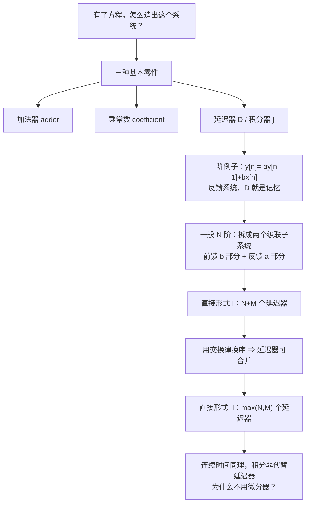
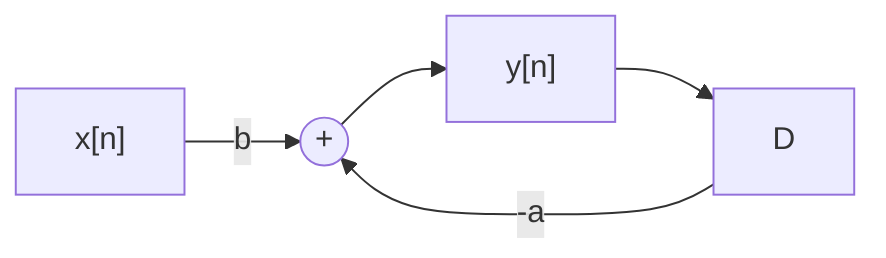
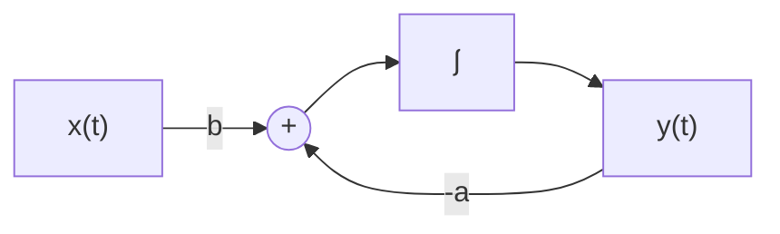
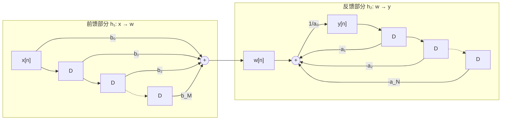
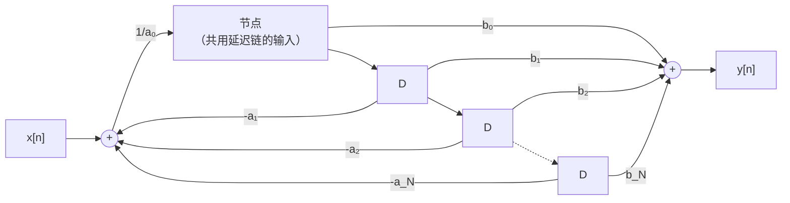
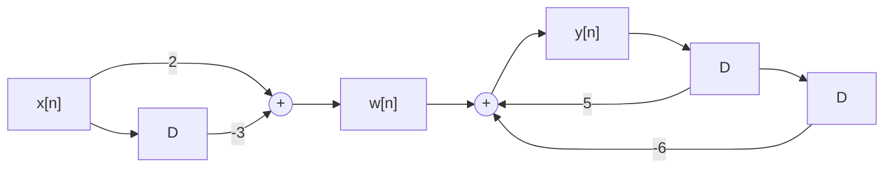
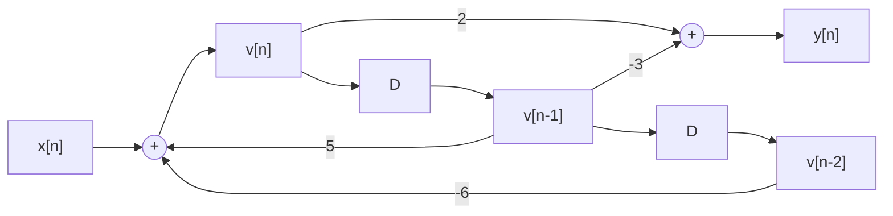

# 2.6 LTI 系统的方框图表示 Block Diagram Representations

> [!abstract] 这一讲的任务
> 前面两讲都在"**解**方程"。这一讲反过来问：**怎么把一个方程造出来？**
> 答案出人意料地简单——只要三种零件：**加法器、乘常数、延迟器**（连续时间里换成积分器）。任何一个 LCCDE 都能用它们搭出来。
> 更漂亮的是：同一个方程有两种搭法，其中一种**省掉一半的存储器**，而省掉的理由正是 2.3 节那条交换律。学完这一讲，你就知道 `scipy.signal.lfilter` 内部到底在干什么。

> [!info] 授课进度说明
> 本篇依据课件整理，**第二章尚未有课堂转写稿**，因此全篇不作「拓展」标注。



---

## 0. 开场：只给你三个零件

假设你在设计一块芯片，工艺库里只有三种单元：

- **加法器**：两个数进去，和出来；
- **乘法器（乘一个固定常数）**：一个数进去，放大 $a$ 倍出来；
- **寄存器 D**：一个数进去，**下一拍**才出来（也就是延迟一拍）。

现在老板丢给你一个公式：
$$y[n]-5y[n-1]+6y[n-2]=2x[n]-3x[n-1]$$
让你用这三种零件把它搭出来。

**你会怎么开始？**

先把它改写成"$y[n]=\dots$"的形式——因为芯片每拍要输出一个 $y[n]$，你得告诉它这个数怎么算：
$$y[n]=2x[n]-3x[n-1]+5y[n-1]-6y[n-2]$$

右边一共出现四个量：$x[n]$（现在的输入）、$x[n-1]$（上一拍的输入）、$y[n-1]$ 和 $y[n-2]$（前两拍的输出）。**"上一拍的值"正好是延迟器 D 提供的东西**，乘常数和相加也都有零件。于是这个公式可以一比一地画成电路。

这一讲就是把这件事做系统。

---

## 1. 三种基本零件（课件 p.89, p.93）

### 1.1 离散时间

| 零件 | 作用 | 记号 |
|---|---|---|
| **加法器 An adder** | $x_1[n],x_2[n]\to x_1[n]+x_2[n]$ | 圆圈里一个 $+$ |
| **乘常数 Multiplication by a coefficient** | $x[n]\to a\,x[n]$ | 箭头旁标 $a$ |
| **单位延迟 A unit delay** | $x[n]\to x[n-1]$ | 方块 **D** |

### 1.2 连续时间

| 零件 | 作用 |
|---|---|
| **加法器** | $x_1(t)+x_2(t)$ |
| **乘常数** | $a\,x(t)$ |
| **积分器 An integrator** | $x(t)\to\displaystyle\int_{-\infty}^{t}x(\tau)d\tau$ |

> [!warning] 为什么连续时间用积分器，不用微分器？
> 课件的 Note 说得很直接：*Since differentiators are both **difficult to implement** and extremely **sensitive to errors and noise**. An alternative implementation is to use an integrator.*
>
> **把这句话讲透**：微分器的增益随频率线性增长（$\frac{d}{dt}e^{j\omega t}=j\omega e^{j\omega t}$，增益 $|\omega|$）。信号里一点点高频噪声，经过微分就被放大几十倍；频率越高放大越狠。积分器正相反，增益是 $1/|\omega|$，**天然抑制高频**，还能用运放 + 电容轻松做出来（课件 Note 1：*integrators can be readily implemented using operational amplifiers, the representation lead directly to analog implementations*）。
>
> 这也解释了上一讲 LCCDE 里那条 **$N\ge M$**：如果 $M>N$，系统就必须包含纯微分环节，物理上做不出来。**伏笔在这里回收。**

> [!important] 记忆元件是谁
> - 离散：**延迟器 D**——课件 Note：*A delay corresponds to a memory element, as the delay element must retain the previous value of its input.*
> - 连续：**积分器**——课件 Note 2：*The integrator represents the memory storage element of the system.*
>
> 所以数一个系统里有几个 D（或几个 $\int$），就知道它需要**几个存储单元**。这是后面"直接形式 II 更省"的意义所在。

---

## 2. 一阶系统：反馈是怎么出现的

> [!example] 课件 p.90
> $$y[n]+a\,y[n-1]=b\,x[n]\ \Longrightarrow\ y[n]=-a\,y[n-1]+b\,x[n]\quad\text{(recursive algorithm 递归算法)}$$



**读这张图**：输入乘 $b$ 送进加法器；加法器的输出就是 $y[n]$，它同时被抽出来送进延迟器 D，延迟一拍变成 $y[n-1]$，再乘 $-a$ **绕回加法器**。

> [!important] 这是一个反馈系统 feedback system
> "输出绕回输入"就是 [[C1.5 连续时间与离散时间系统]] 里讲的**反馈互联**。
> 它和"把公式写成递归形式"是同一件事的两种说法：**递归 ⇔ 反馈 ⇔ 系统有记忆**。

> [!question] 停一下，先自己想想
> 这个系统里只有**一个** D。它存的是什么？为什么一个就够？

存的是 $y[n-1]$。够，是因为方程只回看一拍。**一般地：$N$ 阶方程要回看 $N$ 拍 ⇒ 至少需要 $N$ 个存储单元。** 这句"至少"很重要——下一节会看到有的搭法用得比这更多，是浪费。

**连续时间的对应版本**（课件 p.94）：
$$y'(t)+a\,y(t)=b\,x(t)\ \Longrightarrow\ y'(t)=b\,x(t)-a\,y(t)\ \Longrightarrow\ y(t)=\int_{-\infty}^{t}\big[b\,x(\tau)-a\,y(\tau)\big]d\tau$$



> [!warning] 课件 p.94 的一处笔误
> 课件把积分式写成 $y(t)=\int_{-\infty}^{t}[bx(\tau)-ay(t)]d\tau$，**第二个应为 $ay(\tau)$**（积分变量是 $\tau$）。按图看也很清楚：绕回来的是被积函数里的 $y$，不可能是积分号外的常数。

---

## 3. 一般 $N$ 阶系统：直接形式 I

现在处理完整的方程
$$\sum_{k=0}^{N}a_k\,y[n-k]=\sum_{k=0}^{M}b_k\,x[n-k]$$

**关键一步：把它看成两个子系统的级联。** 定义中间变量
$$w[n]\triangleq\sum_{k=0}^{M}b_k\,x[n-k]$$
于是原方程变成
$$y[n]=\frac{1}{a_0}\left[w[n]-\sum_{k=1}^{N}a_k\,y[n-k]\right]\quad\text{(recursive algorithm)}$$

两个子系统：

| 子系统 | 做什么 | 结构 |
|---|---|---|
| **前馈部分**（$b$ 侧） | $x\to w$：把输入的各阶延迟加权求和 | **非递归**，没有反馈，一条延迟链 |
| **反馈部分**（$a$ 侧） | $w\to y$：减去输出的各阶延迟 | **递归**，有反馈环 |

> [!important] 直接形式 I Direct-Form I
> 把两条延迟链**分别**画出来，左边 $M$ 个 D（存 $x$ 的历史），右边 $N$ 个 D（存 $y$ 的历史），共 **$N+M$ 个延迟器**。



---

## 4. 直接形式 II：用交换律省掉一半存储器

> [!question] 课堂追问
> 上面那张图里，左边的 D 链存着 $x[n-1],x[n-2],\dots$，右边的 D 链存着 $y[n-1],y[n-2],\dots$。
> 这两条链**各存各的**，加起来 $N+M$ 个寄存器。
> 有没有办法让它们**共用**？

有，而且理由我们在 2.3 节就证过了。课件原话：

> *Since the convolution sum has the **commutative property**, we can **change the order of two cascade systems**, and **merge together** the unit delays in the two subsystems.*

**三步推理**：

1. 整个系统是 $h_1$（前馈）与 $h_2$（反馈）的**级联**：$h=h_1*h_2$；
2. 由**交换律**（[[C2.3 LTI系统的性质]]），级联可以换序：$h_1*h_2=h_2*h_1$，即先做反馈部分、再做前馈部分，输出完全一样；
3. 换序之后，**两条延迟链的输入变成了同一个信号**——中间那个节点同时喂给上下两侧，于是两条链可以**合并成一条**。



> [!important] 直接形式 II Direct-Form II（又称正准型 canonical form）
> 只需要 **$\max(N,M)$ 个延迟器**（课件在 $N=M$ 的情形下画出），比直接形式 I 省掉近一半。
> **这就是为什么它叫"正准（canonical）"——延迟器数量达到了理论下限**（2.2 节说过：$N$ 阶系统至少要 $N$ 个存储单元）。

> [!tip] 工程意义（课件没写，但这是这一节真正的价值）
> - **硬件**：寄存器 = 面积 = 功耗 = 钱。同样的滤波器，直接形式 II 的芯片面积小一半。
> - **软件**：`scipy.signal.lfilter` 默认用的就是**直接形式 II 转置结构**（transposed direct form II）；`sos`（二阶节级联）也是同一思想的延伸。你调 `lfilter` 时传的 `b, a` 两个数组，正是这张图里的 $b_k$ 和 $a_k$。
> - **数值稳定性**：高阶直接形式对系数量化误差极其敏感，所以实际工程里会把高阶系统**拆成若干二阶节级联**（用的又是结合律）。这是 DSP 课程里"IIR 滤波器实现结构"的全部出发点。

**连续时间完全平行**（课件 p.95–96）：把 D 换成 $\int$，把 $y[n-k]$ 换成 $y^{(-k)}(t)$（$k$ 重积分），同样有直接形式 I / II，同样由**卷积积分的交换律**保证可以换序合并。课件写作
$$a_Ny(t)+\sum_{k=0}^{N-1}a_ky_{(N-k)}(t)=\sum_{k=0}^{N}b_kx_{(N-k)}(t)$$
其中 $y_{(1)}(t)=y^{(-1)}(t)=\int_{-\infty}^ty(\tau)d\tau$，$y_{(2)}(t)=y^{(-2)}(t)=\iint y(\tau)d\tau$。

> [!question] 为什么连续时间要把方程改写成"全是积分"的形式？
> 因为零件里只有积分器。原方程里是 $y^{(N)},y^{(N-1)},\dots$（各阶导数），把整个方程**积分 $N$ 次**，最高阶导数降成 $y$ 本身，其余各项变成 $y$ 的各重积分——这样每一项都能用积分器链取到。
> 这是"用可实现的零件改写方程"的典型手法。

---

## 5. 随堂测（课件 p.99）

> [!example] 主观题 10 分
> The discrete time LTI system is given by
> $$y[n]-5y[n-1]+6y[n-2]=2x[n]-3x[n-1]$$
> Please draw the block diagram (including **direct form I** and **II**) of this system.

**解**：对照标准式 $\sum a_ky[n-k]=\sum b_kx[n-k]$ 读出系数：
$$a_0=1,\ a_1=-5,\ a_2=6;\qquad b_0=2,\ b_1=-3$$
（$N=2$，$M=1$，满足 $N\ge M$ ✓）

递归形式：
$$y[n]=2x[n]-3x[n-1]+5y[n-1]-6y[n-2]$$

**直接形式 I**（$N+M=3$ 个延迟器）：



**直接形式 II**（$\max(N,M)=2$ 个延迟器）：



**怎么验证画对了**：设中间节点信号为 $v[n]$，图给出两条关系
$$v[n]=x[n]+5v[n-1]-6v[n-2],\qquad y[n]=2v[n]-3v[n-1]$$
把第一式两边乘 2、并把 $n$ 换成 $n-1$ 的那份乘 $-3$，相加即得
$$y[n]-5y[n-1]+6y[n-2]=2x[n]-3x[n-1]\ ✓$$

> [!tip] 顺便：这个系统稳定吗？
> 特征方程 $r^2-5r+6=0\Rightarrow r=2,3$，两个根的模都大于 1 ⇒ **不稳定**。
> 画框图和判稳定是两件独立的事——**能搭出来不代表能用**。实际设计里会先看极点位置再动手画结构。

---

## 这一讲的三句话

1. **三种零件够用了**：加法器、乘常数、延迟器（连续时间用积分器）——任何 LCCDE 都能搭出来，搭法就是把方程写成递归形式再照着画。
2. **递归 = 反馈 = 记忆**：$N$ 阶系统至少需要 $N$ 个存储单元，而直接形式 II 恰好达到这个下限。
3. **省存储器靠的是交换律**：级联可换序 ⇒ 两条延迟链共用 ⇒ $N+M$ 降到 $\max(N,M)$。这是 2.3 节那条抽象性质最实在的一次兑现。

> [!tip] 速查表
> | 项目 | 离散 | 连续 |
> |---|---|---|
> | 记忆元件 | 延迟器 D | 积分器 $\int$ |
> | 为什么不用另一个 | — | 微分器难实现、放大噪声 |
> | 递归形式 | $y[n]=\frac{1}{a_0}[w[n]-\sum_{k\ge1}a_ky[n-k]]$ | $y(t)=\frac{1}{a_N}[\sum b_kx_{(N-k)}-\sum a_ky_{(N-k)}]$ |
> | 直接形式 I 的延迟器数 | $N+M$ | $N+M$ |
> | 直接形式 II 的延迟器数 | $\max(N,M)$ | $\max(N,M)$ |
> | 合并的依据 | 卷积和交换律 | 卷积积分交换律 |

> [!tip] 下一讲预告
> 这一章还剩最后一块拼图。我们从头到尾都在用 $\delta(t)$，把它当成"卷积的 1"、当成基底、当成测试信号——可它究竟**是什么**？
> $\delta(t)$ 不是普通函数（哪个函数在一点上无穷大、积分还是 1？）。下一讲给它一个正经的身份：**奇异函数**。顺便把 $x(t)\delta(t)$、$x(t)*\delta'(t)$、$\delta(at)$ 这一串考试常用公式一次性理清——它们之间的区别（**乘**还是**卷**）是本章最后一个高频失分点。

---

## 本节自测 Self-Test

> [!question] 1. 连续时间的方框图为什么用积分器而不用微分器？

> [!success]- 答案
> 课件原话：微分器**难以实现**且**对误差和噪声极其敏感**。
> 深层原因：微分器增益随频率线性增长（$|j\omega|$），把高频噪声放大；积分器增益 $1/|\omega|$，天然抑制高频，且用运放+电容即可实现。
> 这也是 LCCDE 要求 $N\ge M$ 的原因——否则系统必须含纯微分环节。

> [!question] 2. 一个 3 阶差分方程（$M=2$）用直接形式 I 和 II 各需要几个延迟器？

> [!success]- 答案
> **直接形式 I**：$N+M=3+2=5$ 个。
> **直接形式 II**：$\max(N,M)=3$ 个。
> 省掉的 2 个正是"两条链共用"的结果。

> [!question] 3. 把 $N+M$ 降到 $\max(N,M)$ 依据的是哪条性质？推理链是什么？

> [!success]- 答案
> **卷积的交换律**。
> ① 系统 = 前馈子系统 $h_1$ 与反馈子系统 $h_2$ 的级联，$h=h_1*h_2$；
> ② 交换律 ⇒ $h_1*h_2=h_2*h_1$，可以换序；
> ③ 换序后两条延迟链的输入变成同一个信号，可合并为一条。

> [!question] 4. 画出 $y[n]+0.8y[n-1]=x[n]$ 的方框图，并说明它有几个存储单元、是否稳定。

> [!success]- 答案
> 递归形式：$y[n]=x[n]-0.8y[n-1]$。
> ```
> x[n] ──→(+)──→ y[n] ──┐
>          ↑            │
>          └── ×(−0.8) ← D
> ```
> **1 个延迟器**（一阶系统的下限）。
> 特征根 $r=-0.8$，$|r|=0.8<1$ ⇒ **稳定**。冲激响应 $h[n]=(-0.8)^nu[n]$，$\sum|h[n]|=\frac{1}{1-0.8}=5<\infty$ ✓。

> [!question] 5. （随堂测）$y[n]-5y[n-1]+6y[n-2]=2x[n]-3x[n-1]$，写出两种直接形式的方程组，并验证直接形式 II 正确。

> [!success]- 答案（完整步骤）
> 系数：$a_0=1,a_1=-5,a_2=6$；$b_0=2,b_1=-3$。
> **直接形式 I**（先前馈后反馈，3 个 D）：
> $$w[n]=2x[n]-3x[n-1]$$
> $$y[n]=w[n]+5y[n-1]-6y[n-2]$$
> **直接形式 II**（先反馈后前馈，共用 2 个 D，中间信号记为 $v[n]$）：
> $$v[n]=x[n]+5v[n-1]-6v[n-2]$$
> $$y[n]=2v[n]-3v[n-1]$$
> **验证**：把第二式代入原方程左边——
> $$y[n]-5y[n-1]+6y[n-2]$$
> $$=2\big(v[n]-5v[n-1]+6v[n-2]\big)-3\big(v[n-1]-5v[n-2]+6v[n-3]\big)$$
> 由第一式，括号里每一项都等于对应时刻的 $x$：$v[n]-5v[n-1]+6v[n-2]=x[n]$，$v[n-1]-5v[n-2]+6v[n-3]=x[n-1]$。
> $$=2x[n]-3x[n-1]\ ✓$$
> **另外**：特征根 $r=2,3$，$|r|>1$，系统**不稳定**——结构画得出来，不代表系统能用。

> [!question] 6. 为什么连续时间要把微分方程"积分 $N$ 次"再画图？

> [!success]- 答案
> 因为可用的零件只有积分器，没有微分器。把方程整体积分 $N$ 次后，最高阶导数 $y^{(N)}$ 降成 $y$，其余项变成 $y$ 的各重积分 $y^{(-1)},y^{(-2)},\dots$，正好可以从积分器链上逐级取出来。
> 这是"用可实现的零件改写方程"的标准手法。

> [!question] 7. `scipy.signal.lfilter(b, a, x)` 里的 `b` 和 `a` 对应图上的什么？

> [!success]- 答案
> `b` 是**前馈系数** $b_0,b_1,\dots,b_M$（乘在 $x$ 的各阶延迟上），`a` 是**反馈系数** $a_0,a_1,\dots,a_N$（乘在 $y$ 的各阶延迟上，图上带负号）。
> 它内部用的是**直接形式 II 转置结构**。高阶滤波器实际实现时会拆成二阶节级联（`sos`），依据是卷积的**结合律**。

---

## 相关笔记 Related Notes

- [[信号与系统 MOC]]
- 上一节：[[C2.5 差分方程与离散时间系统求解]]
- 下一节：[[C2.7 奇异函数]]
- 相关：[[C2.3 LTI系统的性质]]（交换律/结合律与串并联）、[[C1.5 连续时间与离散时间系统]]（反馈互联）
