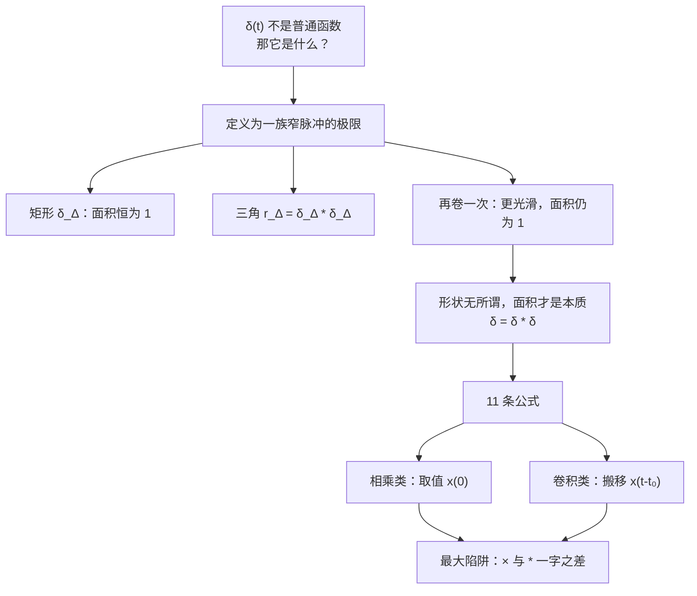
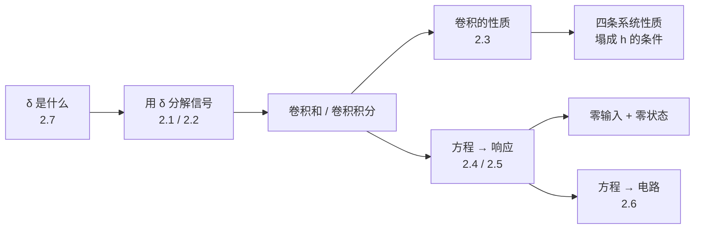

# 2.7 奇异函数 Singularity Functions

> [!abstract] 这一讲的任务
> 整章我们都在用 $\delta(t)$：它是基底、是卷积的"1"、是测试信号。可它到底**是什么**？——哪有函数在一点上是无穷大，积分还等于 1？
> 这一讲给它一个正经身份：$\delta$ 不是普通函数，而是**一族窄脉冲的极限**，它的意义只在"被积分时做了什么"。
> 然后把整章散落的 $\delta$ 公式一次性收拢成一张表。其中最要命的一组是 **$x(t)\delta(t)$（相乘）** 和 **$x(t)*\delta(t)$（卷积）**——差一个星号，结果完全不同，这是第二章最后一个高频失分点。

> [!info] 授课进度说明
> 本篇依据课件整理，**第二章尚未有课堂转写稿**，因此全篇不作「拓展」标注。

---

## 0. 开场：一个函数值根本不重要的"函数"

请你回答：$\delta(0)$ 等于多少？

如果你答"无穷大"，那我再问：$2\delta(0)$ 呢？也是无穷大。可是 $\delta(t)$ 和 $2\delta(t)$ 明明是**不同的信号**（一个面积 1，一个面积 2）。**那"无穷大"这个答案显然没描述清楚它们的区别。**

再问：$\delta(t)$ 在 $t=0.001$ 处等于多少？0。$t=-0.001$ 呢？0。**除了一个点以外，它处处为零，而那一个点的值又说不清楚。** 按普通函数的标准，这东西的信息量是零。

所以，**$\delta$ 根本不该被当成"函数值的集合"来理解。** 它的全部意义在于：**当它出现在积分里时，做了什么。**

$$\int_{-\infty}^{+\infty}x(t)\delta(t)\,dt=x(0)$$

这一句才是 $\delta$ 的定义。数学上这叫**广义函数 generalized function** 或**分布 distribution**；工程上我们叫它**奇异函数 singularity function**。

---

## 1. 把 $\delta$ 定义成极限（课件 2.5.1）

> [!important] 理想化的短脉冲 The unit impulse as idealized short pulse
> $$\delta_\Delta(t)=\begin{cases}\dfrac1\Delta,&0\le t\le\Delta\\[1mm]0,&\text{otherwise}\end{cases}\qquad \delta(t)=\lim_{\Delta\to0}\delta_\Delta(t)$$

这就是 [[C2.2 连续时间LTI系统与卷积积分]] 里用来搭台阶的那个窄脉冲。课件在这一页额外强调：**形状可以换。**

![[C2-冲激的逐次光滑近似.png]]

课件右上角画了两个替代品：**居中的矩形**（$-\frac\Delta2\le t\le\frac\Delta2$）和**三角形**（底宽 $2\Delta$、高 $\frac1\Delta$）。它们的极限同样是 $\delta(t)$。

> [!question] 停一下，先自己想想
> 矩形、三角形、高斯钟形……形状差那么多，凭什么极限都是同一个 $\delta$？

**因为唯一被保留的特征是"面积为 1"。** 当宽度趋于 0 时，任何"面积为 1、宽度趋于 0、高度趋于无穷"的函数族，在积分意义下的作用都一样：把 $x$ 在原点的值筛出来。形状的细节在极限里全部被抹掉了。

这一点在 [[C1.4 单位冲激与单位阶跃函数]] 里已经见过（$\delta$ 的极限构造与三种近似），这里是把它和卷积接起来。

### 1.1 $\delta=\delta*\delta$：冲激卷自己还是自己

由信号分解式
$$x(t)=\int_{-\infty}^{+\infty}x(\tau)\delta(t-\tau)d\tau=x(t)*\delta(t)$$
取 $x=\delta$，立刻得到课件那条式子：

$$\boxed{\ \delta(t)=\delta(t)*\delta(t)\ }$$

> [!important] 为什么这条式子值得单列
> 因为它说明 **$\delta$ 是卷积运算的单位元**（幂等元），就像数字 1 之于乘法：$1\times1=1$。
> [[C2.3 LTI系统的性质]] 里"无记忆系统 ⇔ $h=k\delta$"讲的正是这件事——**什么都不做的系统，冲激响应就是 $\delta$。**

### 1.2 反复卷积：越卷越光滑，面积永远是 1（课件 (2)(3)）

课件给了一条有意思的链：

$$r_\Delta(t)=\delta_\Delta(t)*\delta_\Delta(t)\qquad\Longrightarrow\qquad \delta(t)=\lim_{\Delta\to0}r_\Delta(t)$$

$r_\Delta$ 是什么？**矩形卷矩形 = 三角形**（[[C2.2 连续时间LTI系统与卷积积分]] 的结论）：底宽 $2\Delta$、峰值 $\frac1\Delta$、面积 $\frac12\cdot2\Delta\cdot\frac1\Delta=1$ ✓。

再卷一次 $r_\Delta*r_\Delta$（课件的第 (3) 项），得到一条**更光滑、更宽、峰值更低**的钟形曲线，面积依然是 1，极限依然是 $\delta$。

> [!important] 从这条链能读出两件事
> 1. **$\delta$ 的"形状"完全不重要**——矩形、三角、钟形都行，只要面积为 1、宽度趋于 0。工程上就是"任何足够窄的脉冲都可以当作冲激来用"，这是实验室里用窄脉冲测冲激响应的理论依据。
> 2. **卷积具有平滑作用**：每卷一次，信号就变光滑一次（矩形→三角→钟形，可导阶数逐次提高）。
>    **接到 AI 上**：这正是"多次滑动平均 ≈ 高斯模糊"的原理（中心极限定理的卷积版本）——CNN 里堆叠小卷积核得到大而光滑的等效感受野，用的是同一件事。

---

## 2. 十一条公式：一次性理清（课件 p.98）

课件把公式分成左右两栏，**左栏是"相乘"，右栏是"卷积"**——这个分栏本身就是最重要的提示。

### 2.1 相乘类：$\delta$ 把函数"取值"

| # | 公式 | 怎么理解 |
|---|---|---|
| **(1)** | $x(t)\delta(t)=x(0)\delta(t)$ | $\delta$ 只在 $t=0$ 非零，别处乘什么都是 0，所以 $x$ 只有 $x(0)$ 这一个值起作用 |
| **(2)** | $x(t)\delta(t-t_0)=x(t_0)\delta(t-t_0)$ | 同上，把关注点搬到 $t_0$ |
| **(3)** | $\displaystyle\int_{-\infty}^{+\infty}x(t)\delta(t-t_0)\,dt=x(t_0)$ | 在 (2) 两边积分，$\int\delta(t-t_0)dt=1$ ⇒ **抽样性质 Sampling Property** |
| **(4)** | $\delta(at)=\dfrac{1}{|a|}\delta(t)$ | **尺度性质**，见下面的警告 |
| **(8')** | $x(t)\cdot\delta'(t)=x(0)\delta'(t)-x'(0)\delta(t)$ | 对 (1) 两边求导：$[x\delta]'=x'\delta+x\delta'$，移项即得 |

> [!warning] (4) 的绝对值：本课最经典的易错点
> $$\delta(at)=\frac{1}{|a|}\delta(t)$$
> **为什么有 $\frac{1}{|a|}$？** 令 $u=at$，则 $dt=\frac{du}{a}$：
> $$\int\delta(at)dt=\frac{1}{|a|}\int\delta(u)du=\frac{1}{|a|}$$
> 横轴压缩 $a$ 倍，面积也被压缩了 $|a|$ 倍，所以要乘 $\frac{1}{|a|}$ 补回来。
> **为什么是绝对值不是 $a$？** 因为 $a<0$ 时换元会把积分上下限翻过来，多出一个负号，两个负号抵消。物理上更直白：**面积不可能是负的。**
> 这一条在 [[C1.4 单位冲激与单位阶跃函数]] 里第一次出现（课件标注为"书外结论"），并明确说过是考试题型。
>
> **对照记忆**：普通信号做尺度变换 $x(at)$ **不会**冒出 $\frac{1}{|a|}$，只有 $\delta$ 会——因为 $\delta$ 是由"面积"定义的。这正是"$x(at)$ 位移量要不要除以 $|a|$"这类混淆的根源。

> [!question] 课堂追问：(8') 里为什么会冒出一个负号？
> 从乘积求导法则出发：
> $$\frac{d}{dt}\big[x(t)\delta(t)\big]=x'(t)\delta(t)+x(t)\delta'(t)$$
> 左边用 (1)：$\frac{d}{dt}[x(0)\delta(t)]=x(0)\delta'(t)$；右边第一项用 (1)：$x'(0)\delta(t)$。移项：
> $$x(t)\delta'(t)=x(0)\delta'(t)-x'(0)\delta(t)$$
> **注意 $\delta'$ 的"取值"不再只取 $x(0)$，还要取 $x'(0)$**——这是 $\delta'$（**偶极子 doublet**）和 $\delta$ 的本质差别。

### 2.2 卷积类：$\delta$ 把函数"搬移"

| # | 公式 | 怎么理解 |
|---|---|---|
| **(5)** | $x(t)*\delta(t)=x(t)$ | **卷积的单位元**：什么都不做 |
| **(6)** | $x(t)*\delta(t-t_0)=x(t-t_0)$ | **纯延迟**：整体搬到 $t_0$ |
| **(7)** | $x(t-t_1)*\delta(t-t_2)=x(t-t_1-t_2)$ | 延迟相加（2.3 节时移性质的推论） |
| **(8)** | $x(t)*\delta'(t)=x'(t)$ | **卷 $\delta'$ = 求一次导** |
| **(9)** | $x(t)*u(t)=x(t)*\delta^{(-1)}(t)=x^{(-1)}(t)=\displaystyle\int_{-\infty}^{t}x(\tau)d\tau$ | **卷 $u$ = 做一次积分** |
| **(10)** | $u(t)*\delta'(t)=\delta^{(-1)}(t)*\delta'(t)=\delta(t)$ | 积分与微分互相抵消 |
| **(11)** | $\displaystyle\int_{-\infty}^{+\infty}\delta'(t)\,dt=0$ | $\delta'$ 的面积为零 |

> [!warning] 课件 (11) 的印刷
> 课件写作 $\int_{-\infty}^{+\infty}\delta'(t)\,d(t)=0$，那个 $d(t)$ 就是 $dt$。
> **为什么面积是 0？** $\delta'$ 是"一正一负紧挨着的两个冲激"（偶极子），正负相消。也可以从 $\int\delta'=\big[\delta\big]_{-\infty}^{+\infty}=0-0=0$ 看出。

> [!important] (8) 和 (9) 合起来是一条漂亮的规律
> $$\delta^{(k)}\ \text{是"求 }k\text{ 阶导"算子},\qquad \delta^{(-k)}=u^{(k-1)}\ \text{是"积 }k\text{ 次"算子}$$
> 记号 $\delta^{(-1)}(t)=u(t)$ 的意思就是"$\delta$ 的一次积分"。**卷积一个奇异函数 = 施加一次微分或积分。**
> 这解释了 [[C2.3 LTI系统的性质]] 里为什么 $s(t)=h(t)*u(t)=h^{(-1)}(t)$——阶跃响应就是冲激响应的积分。**又一次回收。**

### 2.3 最要命的对照：$\times$ 还是 $*$

> [!warning] 第二章最后一个高频失分点
> | | $x(t)\,\delta(t-t_0)$ | $x(t)*\delta(t-t_0)$ |
> |---|---|---|
> | 运算 | **相乘**（逐点） | **卷积** |
> | 结果 | $x(t_0)\,\delta(t-t_0)$ | $x(t-t_0)$ |
> | 结果是什么 | **一个冲激**，强度为数 $x(t_0)$ | **一个信号**，是 $x$ 整体平移 |
> | 一句话 | **取值**（把一个数摘出来） | **搬移**（把整条曲线挪过去） |
>
> **记忆口诀：乘是"摘一个点"，卷是"搬一整条"。**
> 判卷时看结果的类型就能自查：相乘的结果里**一定还带着 $\delta$**；卷积的结果里**一定没有 $\delta$**（除非 $x$ 本身含 $\delta$）。

**举个具体例子**（自己算一遍再看）：设 $x(t)=e^{-t}u(t)$，$t_0=2$。
- **相乘**：$x(t)\delta(t-2)=e^{-2}\delta(t-2)$ —— 一个位于 $t=2$、强度 $e^{-2}\approx0.135$ 的冲激；
- **卷积**：$x(t)*\delta(t-2)=e^{-(t-2)}u(t-2)$ —— 一条从 $t=2$ 才开始的衰减指数曲线。
两者**连类型都不一样**。

---

## 3. 离散时间的对应版本（补充）

课件这一节只写了连续时间。离散时间的对应公式更简单，因为 $\delta[n]$ 是**真正的函数**（在 $n=0$ 取值 1），没有任何"广义"的麻烦：

| 相乘 | 卷积 |
|---|---|
| $x[n]\delta[n]=x[0]\delta[n]$ | $x[n]*\delta[n]=x[n]$ |
| $x[n]\delta[n-n_0]=x[n_0]\delta[n-n_0]$ | $x[n]*\delta[n-n_0]=x[n-n_0]$ |
| $\sum_n x[n]\delta[n-n_0]=x[n_0]$ | $x[n]*u[n]=\sum_{k=-\infty}^{n}x[k]$ |

> [!important] 离散没有"尺度性质"这一说
> $\delta[an]$ 里 $a$ 必须是整数，而且 $\delta[an]=\delta[n]$（$a\neq0$ 的整数）——**没有 $\frac{1}{|a|}$**。
> 因为离散冲激的定义是"取值为 1"，不是"面积为 1"。
> **这正是连续与离散最容易串的一处**：$\delta(at)=\frac{1}{|a|}\delta(t)$ 只属于连续时间。

---

## 4. 把整章串起来

第二章到这里全部讲完。回头看这条线：

> [!important] 第二章的一句话总结
> **LTI 系统 = 一条 $h$。**
> 把信号拆成冲激（2.1/2.2/2.7），送进系统，用线性和时不变叠加回去，得到卷积；卷积的代数性质对应电路的接法（2.3/2.6）；而现实给的是方程，解方程得到响应（2.4/2.5）。
> 下一章换一套基底（复指数），同样的逻辑会给出**频域**的全部内容——而且你会发现，**时域里麻烦的卷积，在频域里变成简单的乘法**。这就是傅里叶分析存在的全部理由。

---

## 这一讲的三句话

1. **$\delta$ 不是普通函数，是一族"面积为 1、宽度趋于 0"的脉冲的极限**；形状无关紧要，只有面积和"在积分里做了什么"才是本质。
2. **$\delta^{(k)}$ 是微分算子，$\delta^{(-k)}$（即 $u$ 及其积分）是积分算子**；卷积一个奇异函数 = 施加一次微分或积分。
3. **乘是取值，卷是搬移**：$x\delta(t-t_0)=x(t_0)\delta(t-t_0)$（还是冲激），$x*\delta(t-t_0)=x(t-t_0)$（是信号）。

> [!tip] 速查表（课件 p.98 全 11 条 + 离散版）
> **相乘类**
> | | |
> |---|---|
> | (1) | $x(t)\delta(t)=x(0)\delta(t)$ |
> | (2) | $x(t)\delta(t-t_0)=x(t_0)\delta(t-t_0)$ |
> | (3) | $\int x(t)\delta(t-t_0)dt=x(t_0)$ |
> | (4) | $\delta(at)=\frac{1}{|a|}\delta(t)$ |
> | (8') | $x(t)\delta'(t)=x(0)\delta'(t)-x'(0)\delta(t)$ |
>
> **卷积类**
> | | |
> |---|---|
> | (5) | $x(t)*\delta(t)=x(t)$ |
> | (6) | $x(t)*\delta(t-t_0)=x(t-t_0)$ |
> | (7) | $x(t-t_1)*\delta(t-t_2)=x(t-t_1-t_2)$ |
> | (8) | $x(t)*\delta'(t)=x'(t)$ |
> | (9) | $x(t)*u(t)=x^{(-1)}(t)=\int_{-\infty}^tx(\tau)d\tau$ |
> | (10) | $u(t)*\delta'(t)=\delta(t)$ |
> | (11) | $\int\delta'(t)dt=0$ |
>
> **其他**：$\delta(t)=\delta(t)*\delta(t)$；离散 $\delta[an]=\delta[n]$（**无** $\frac{1}{|a|}$）

> [!tip] 下一章预告
> 第二章用**冲激**作基底，把系统压缩成一条 $h$，代价是每次求响应都要算一次卷积——而卷积很累。
> 第三章换一套基底：**复指数 $e^{j\omega t}$**。它是 LTI 系统的**特征函数**——进去出来还是同一个频率，只是幅度和相位变了。于是"卷积"会塌成"**乘一个复数**"。
> 你在 [[C1.3 指数信号与正弦信号]] 里已经见过谐波集和正交性，在 [[L01 绪论 Introduction]] 里已经见过方波的傅里叶合成——那些伏笔，从第三章开始正式回收。

---

## 本节自测 Self-Test

> [!question] 1. 为什么说"$\delta(0)=\infty$"没有真正定义 $\delta$？$\delta$ 到底该怎么定义？

> [!success]- 答案
> 因为 $\delta$ 和 $2\delta$ 在 0 处都是"无穷大"，这个说法区分不了它们；而且除原点外处处为 0，按函数值看信息量为零。
> 正确的定义是**通过它在积分里的作用**：$\int x(t)\delta(t)dt=x(0)$，等价地定义成"面积为 1、宽度趋于 0 的脉冲族的极限"。
> 数学上称广义函数 / 分布，工程上称奇异函数。

> [!question] 2. 矩形、三角、钟形的极限为什么都是 $\delta$？

> [!success]- 答案
> 因为极限过程只保留了"**面积为 1**"这一个特征，形状细节在 $\Delta\to0$ 时被抹平。
> 工程含义：任何足够窄、面积归一的脉冲都可以当冲激用——这是实验中测冲激响应的依据。

> [!question] 3. 计算并说明区别：(a) $e^{-2t}u(t)\cdot\delta(t-1)$；(b) $e^{-2t}u(t)*\delta(t-1)$。

> [!success]- 答案
> **(a) 相乘**：$=e^{-2}\delta(t-1)$，是一个位于 $t=1$、强度 $e^{-2}\approx0.1353$ 的**冲激**。
> **(b) 卷积**：$=e^{-2(t-1)}u(t-1)$，是一条从 $t=1$ 开始、初值为 1 的**衰减指数曲线**。
> **区别**：乘是取值（结果仍含 $\delta$），卷是搬移（结果是普通信号）。连类型都不同。

> [!question] 4. 计算 $\delta(3t-6)$，化到 $\delta(t-t_0)$ 的标准形式。

> [!success]- 答案
> 先提公因子：$\delta(3t-6)=\delta\big(3(t-2)\big)$。
> 再用尺度性质（$a=3$）：
> $$\boxed{\ \delta(3t-6)=\tfrac13\,\delta(t-2)\ }$$
> **验算**：$\int\delta(3t-6)dt$，令 $u=3t-6$，$dt=du/3$，$=\frac13$ ✓。
> **易错点**：① 忘了 $\frac13$；② 把位置算成 $t=6$（应先提出 $3$ 再看括号里的零点）。

> [!question] 5. 计算 $\displaystyle\int_{-\infty}^{+\infty}(t^2+3t)\,\delta(t-2)\,dt$ 和 $\displaystyle\int_{-\infty}^{+\infty}(t^2+3t)\,\delta'(t-2)\,dt$。

> [!success]- 答案
> **第一个**（抽样性质 (3)）：$=x(2)=4+6=10$。
> **第二个**：用 $\int x(t)\delta'(t-t_0)dt=-x'(t_0)$（由分部积分得到，也可从 (8') 推出）。
> $x'(t)=2t+3$，$x'(2)=7$，所以 $=-7$。
> **易错点**：$\delta'$ 的抽样带一个**负号**，而且取的是**导数值**。

> [!question] 6. 已知某 LTI 系统 $h(t)=\delta'(t)+2\delta(t-1)$，求它对 $x(t)=u(t)$ 的响应。

> [!success]- 答案
> $$y=x*h=u(t)*\delta'(t)+2\,u(t)*\delta(t-1)$$
> 第一项用公式 (10)：$u*\delta'=\delta(t)$。
> 第二项用公式 (6)：$u(t)*\delta(t-1)=u(t-1)$。
> $$\boxed{\ y(t)=\delta(t)+2u(t-1)\ }$$
> **解读**：$\delta'$ 那一路是微分器，把阶跃微分成冲激；$2\delta(t-1)$ 那一路是"延迟 1 秒并放大 2 倍"。
> **稳定性**：含 $\delta'$ 的系统不是 BIBO 稳定的（微分器对有界输入可给出无界输出，比如对一个有跳变的有界信号）。

> [!question] 7. 离散时间有没有"$\delta[an]=\frac{1}{|a|}\delta[n]$"？

> [!success]- 答案
> **没有**。对非零整数 $a$，$\delta[an]=\delta[n]$，**不带任何系数**。
> 因为离散冲激由"取值为 1"定义，不是由"面积为 1"定义；连续冲激的 $\frac{1}{|a|}$ 来自积分换元。
> 这是连续/离散之间最容易串的一条。

> [!question] 8. 用一句话概括整个第二章。

> [!success]- 答案
> **一个 LTI 系统就是一条冲激响应 $h$**：把信号拆成冲激的加权叠加，用线性和时不变叠加回去，得到卷积；卷积的性质对应电路的接法；而现实给的是微分/差分方程，解它得到零输入 + 零状态响应。

---

## 相关笔记 Related Notes

- [[信号与系统 MOC]]
- 上一节：[[C2.6 LTI系统的方框图表示]]
- 相关：[[C1.4 单位冲激与单位阶跃函数]]（$\delta$ 的极限构造与尺度性质）、[[C2.2 连续时间LTI系统与卷积积分]]（用 $\delta_\Delta$ 搭台阶）、[[C2.3 LTI系统的性质]]（$\delta$ 作为卷积单位元）
