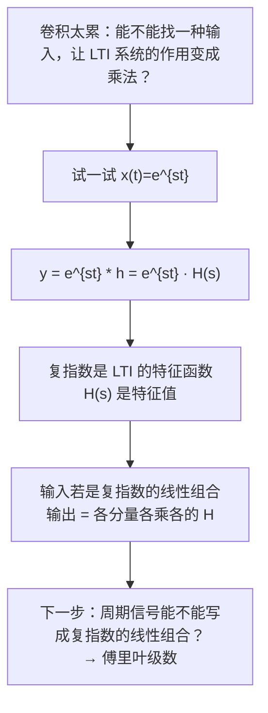

# 3.1–3.2 复指数是 LTI 系统的特征函数

> [!abstract] 这一讲的任务
> 第 2 章把 LTI 系统压缩成一条 $h$，代价是每次都要算卷积——而卷积很累。
> 这一讲换一个角度问：**有没有哪种输入，送进任何 LTI 系统，出来都“不变形”？** 答案是复指数 $e^{st}$（离散是 $z^n$）：它进去出来还是它自己，只被乘了一个复数。
> 这一个事实撑起了第 3–10 章的全部频域方法。

> [!info] 授课进度说明
> 本篇依据课件整理，**第三章尚无课堂转写稿**，因此全篇不作「拓展」标注，待后续转写稿补充后再按同一规则标。

---

## 0. 开场：为什么是傅里叶

1807 年，法国人**傅里叶（Jean Baptiste Joseph Fourier，1768 年生）**在研究热传导时提出：**周期信号可以用正弦级数来表示**（*periodic signal could be represented by sinusoidal series*）。当时的大数学家拉格朗日强烈反对——一个有棱有角的方波，怎么可能用光滑的正弦拼出来？

后来的历史给了答案（课件时间线）：
- **1807**：傅里叶提出周期信号可以用正弦级数表示；
- **1829**：**狄利克雷 (Dirichlet)** 给出了严格的收敛条件（第 [[C3.3 傅里叶级数的收敛与吉布斯现象]] 篇）；
- **1960 年代**：**Cooley 和 Tukey** 发现了**快速傅里叶变换 FFT**——傅里叶分析从此能在计算机上大规模运行，今天每一部手机里都在跑它。

你在 [[L01 绪论 Introduction]] 里已经见过方波被一根根正弦“拼”出来的图。这一章就是把那张图背后的数学讲清楚。但在动手拆信号之前，得先回答一个更根本的问题：**为什么偏偏选正弦（复指数）来拆？**

---

## 1. 撞墙：卷积对任意输入都很累

回忆第 2 章：输入 $x(t)$ 过 LTI 系统，输出是
$$y(t)=x(t)*h(t)=\int_{-\infty}^{+\infty}x(t-\tau)h(\tau)\,d\tau$$
对一般的 $x(t)$，每换一个输入就要重新翻转、滑动、分段积分一次。

> [!question] 停一下，先自己想想
> 什么样的输入信号，过了系统之后**形状不变**？也就是说 $y(t)=(\text{某个常数})\times x(t)$？
> 提示：想想哪种函数，自己平移之后还等于“自己乘一个常数”。

答案是**指数函数**：$e^{s(t-\tau)}=e^{st}\cdot e^{-s\tau}$——平移一下，只是多乘了一个与 $t$ 无关的因子。而卷积本质上就是“把输入平移、加权、叠加”，所以指数函数平移了多少次都还是它自己的倍数。

---

## 2. 连续时间：$e^{st}$ 进去，$H(s)e^{st}$ 出来

令 $x(t)=e^{st}$，其中 $s=\sigma+j\omega$ 是复数（$e^{st}=e^{\sigma t}e^{j\omega t}$，即 [[C1.3 指数信号与正弦信号]] 里的一般复指数）。

$$
\begin{aligned}
y(t)=e^{st}*h(t)&=\int_{-\infty}^{+\infty}e^{s(t-\tau)}h(\tau)\,d\tau\\
&=e^{st}\underbrace{\int_{-\infty}^{+\infty}h(\tau)e^{-s\tau}\,d\tau}_{H(s)}\\
&=e^{st}\,H(s)
\end{aligned}
$$

> [!important] 系统函数 System Function
> $$H(s)=\int_{-\infty}^{+\infty}h(\tau)e^{-s\tau}\,d\tau$$
> 这就是冲激响应 $h(t)$ 的**拉普拉斯变换 Laplace Transform**（第 9 章）。
> $$e^{st}\ \longrightarrow\ \boxed{h(t)}\ \longrightarrow\ H(s)\,e^{st}$$
> **课件 Note**：*The response of an LTI system to a complex exponential input is the same complex exponential with only a change in amplitude.*
> LTI 系统对复指数输入的响应，是**同一个复指数**，只是幅度（一个复数因子）变了。

逐个符号看清楚：
- $e^{st}$ 里 $t$ 是自由变量；
- $H(s)$ **不含 $t$**——对于固定的 $s$，它就是一个复数常数；
- 所以输出和输入“长得一模一样”，只差一个复数倍：**幅度被乘了 $|H(s)|$，相位被加了 $\angle H(s)$**。

---

## 3. 离散时间：$z^n$ 进去，$H(z)z^n$ 出来

完全平行。令 $x[n]=z^n$，$z=re^{j\omega}$（$z^n=r^ne^{j\omega n}$）：

$$
y[n]=z^n*h[n]=\sum_{k=-\infty}^{+\infty}z^{\,n-k}h[k]=z^n\underbrace{\sum_{k=-\infty}^{+\infty}h[k]z^{-k}}_{H(z)}=z^nH(z)
$$

> [!important] 离散时间系统函数
> $$H(z)=\sum_{k=-\infty}^{+\infty}h[k]z^{-k}\qquad\text{（Z 变换 Z-Transform，第 10 章）}$$
> **课件 Note**：*Complex exponentials are **eigenfunctions** of LTI systems.*

> [!note] 特征函数、特征值——线性代数里的老朋友
> 线性代数里：矩阵 $A$ 作用在特征向量 $v$ 上，$Av=\lambda v$，方向不变，只被拉伸 $\lambda$ 倍。
> 这里：LTI 系统（一个线性算子）作用在 $e^{st}$ 上，$\mathcal{T}\{e^{st}\}=H(s)e^{st}$。
> 所以 $e^{st}$ 叫**特征函数 eigenfunction**，$H(s)$ 叫对应的**特征值 eigenvalue**。
> 这是 [[C1.3 指数信号与正弦信号]] 里“特征函数视角”那条伏笔的正式回收。

---

## 4. 输入是复指数的线性组合

一个复指数好算，那么**一堆复指数加起来**呢？LTI 系统是线性的，各算各的再加起来：

$$
x(t)=\sum_{k=1}^{N}a_k\,e^{s_kt}\quad\Longrightarrow\quad y(t)=\sum_{k=1}^{N}a_k\,H(s_k)\,e^{s_kt}
$$
$$
x[n]=\sum_{k=1}^{N}a_k\,z_k^{\,n}\quad\Longrightarrow\quad y[n]=\sum_{k=1}^{N}a_k\,H(z_k)\,z_k^{\,n}
$$

**每个分量的“形状” $e^{s_kt}$ 原封不动，只有系数 $a_k$ 变成了 $a_kH(s_k)$。** 卷积被彻底绕开了——只剩乘法。

### 例 3.1：延迟系统 $y(t)=x(t-3)$

> [!example] 课件 Example 3.1
> LTI 系统 $y(t)=x(t-3)$，输入 $x(t)=\cos4t+\cos7t$。

用欧拉公式把输入拆成复指数：
$$x(t)=\tfrac12e^{j4t}+\tfrac12e^{-j4t}+\tfrac12e^{j7t}+\tfrac12e^{-j7t}$$
直接代入 $t\to t-3$：
$$
y(t)=\tfrac12e^{-j12}e^{j4t}+\tfrac12e^{j12}e^{-j4t}+\tfrac12e^{-j21}e^{j7t}+\tfrac12e^{j21}e^{-j7t}
$$

![[C3-特征函数-延迟系统例.png]]

对照 $y=\sum a_kH(s_k)e^{s_kt}$：每个分量 $e^{j\omega t}$ 都被乘了一个因子 $e^{-j3\omega}$。这个系统的冲激响应是 $h(t)=\delta(t-3)$，于是
$$H(j\omega)=\int\delta(\tau-3)e^{-j\omega\tau}d\tau=e^{-j3\omega}$$
（$\omega=4$ 时 $e^{-j12}$，$\omega=7$ 时 $e^{-j21}$，和上式逐项吻合 ✓）

> [!tip] 读懂这个结果
> 纯延迟 $t_0$ 秒，在频域里就是**每个频率分量的幅度不变、相位滞后 $\omega t_0$**。频率越高，相位滞后越多。这正是后面 CTFS 时移性质 $x(t-t_0)\leftrightarrow a_ke^{-jk\omega_0t_0}$ 的雏形（[[C3.4 连续时间傅里叶级数的性质]]）。

> [!question] 停一下，我们刚才干了什么
> 1. 发现复指数是 LTI 系统的特征函数：进去出来形状不变，只乘一个复数 $H$；
> 2. 于是只要把输入写成复指数的线性组合，输出就是**各分量各乘各的 $H$**，不用卷积。
>
> 剩下的问题只有一个：**任意一个信号，能不能写成复指数的线性组合？系数 $a_k$ 怎么求？** 对周期信号，答案就是**傅里叶级数**——下一讲。
> 这和第 2 章是同一个套路（[[C2.2 连续时间LTI系统与卷积积分]] 自测第 6 题）：第 2 章选冲激作基底，得到卷积；这里选复指数作基底，得到乘法。

---

## 这一讲的三句话

1. **复指数是 LTI 系统的特征函数**：$e^{st}\to H(s)e^{st}$，$z^n\to H(z)z^n$，形状不变，只乘一个复数。
2. **系统函数** $H(s)=\int h(\tau)e^{-s\tau}d\tau$（拉普拉斯变换）、$H(z)=\sum h[k]z^{-k}$（Z 变换）——它们都是由 $h$ 算出来的，仍然是“一条 $h$ 刻画一切”。
3. **输入是复指数的组合 ⇒ 输出 = 各分量各乘各的 $H$**，卷积变乘法。下一步就是把信号拆成复指数。

> [!tip] 速查表
> | | 连续 | 离散 |
> |---|---|---|
> | 特征函数 | $e^{st}$，$s=\sigma+j\omega$ | $z^n$，$z=re^{j\omega}$ |
> | 系统函数 | $H(s)=\int h(\tau)e^{-s\tau}d\tau$ | $H(z)=\sum_kh[k]z^{-k}$ |
> | 对应变换 | 拉普拉斯变换（Ch.9） | Z 变换（Ch.10） |
> | 组合输入 | $\sum a_ke^{s_kt}\to\sum a_kH(s_k)e^{s_kt}$ | $\sum a_kz_k^n\to\sum a_kH(z_k)z_k^n$ |
> | 延迟 $t_0$ | $H(j\omega)=e^{-j\omega t_0}$ | $H(e^{j\omega})=e^{-j\omega n_0}$ |

> [!tip] 下一讲预告
> 我们需要把信号拆成复指数。对**周期**信号，拆法出奇地整齐：只用基频的整数倍 $k\omega_0$ 就够了，每个分量的系数用一个积分就能算出来——这靠的是 [[C1.3 指数信号与正弦信号]] 里证过的**正交性**。下一讲，傅里叶级数正式登场。

---

## 本节自测 Self-Test

> [!question] 1. 为什么说复指数是 LTI 系统的“特征函数”？特征值是什么？

> [!success]- 答案
> 因为 $e^{st}*h(t)=H(s)e^{st}$：输出与输入是同一个函数，只差一个与 $t$ 无关的复数倍。类比 $Av=\lambda v$，$e^{st}$ 是特征函数，$H(s)=\int h(\tau)e^{-s\tau}d\tau$ 是特征值。

> [!question] 2. 推导离散时间情形 $z^n*h[n]=H(z)z^n$。

> [!success]- 答案
> $$z^n*h[n]=\sum_kh[k]z^{\,n-k}=z^n\sum_kh[k]z^{-k}=z^nH(z)$$
> 关键一步是 $z^{n-k}=z^nz^{-k}$，$z^n$ 与求和指标 $k$ 无关，可以提出去。

> [!question] 3. 系统 $h(t)=e^{-t}u(t)$，输入 $x(t)=e^{j2t}$，求输出。

> [!success]- 答案
> $$H(j\omega)=\int_0^\infty e^{-\tau}e^{-j\omega\tau}d\tau=\frac{1}{1+j\omega}$$
> 取 $\omega=2$：$H(j2)=\dfrac{1}{1+2j}=\dfrac{1-2j}{5}$，$|H|=\dfrac{1}{\sqrt5}\approx0.447$，$\angle H=-\arctan2\approx-1.107$ rad。
> $$y(t)=\frac{1}{1+2j}e^{j2t}=0.447\,e^{j(2t-1.107)}$$
> 输出仍是频率为 2 的复指数，幅度缩小到约 0.447 倍，相位滞后约 1.107 rad。

> [!question] 4. 系统 $y(t)=x(t-3)$，输入 $\cos4t$，从“特征函数”的角度说出输出。

> [!success]- 答案
> $h=\delta(t-3)$，$H(j\omega)=e^{-j3\omega}$。$\cos4t=\frac12(e^{j4t}+e^{-j4t})$，两个分量分别乘 $e^{-j12}$ 和 $e^{j12}$：
> $$y=\tfrac12e^{j(4t-12)}+\tfrac12e^{-j(4t-12)}=\cos(4t-12)=\cos4(t-3)\ ✓$$

> [!question] 5. 复指数 $e^{st}$ 与正弦 $\cos\omega t$ 哪一个是 LTI 系统的特征函数？

> [!success]- 答案
> **严格说只有复指数是**。$\cos\omega t$ 过一般 LTI 系统会变成 $|H|\cos(\omega t+\angle H)$——频率不变，但相位变了，不能写成“$\cos\omega t$ 乘一个常数”。只有当 $H(j\omega)$ 是实数时（例如偶对称的实 $h$）余弦才恰好是特征函数。这就是为什么傅里叶分析用**复指数**而不是正弦做基底。

---

## 相关笔记 Related Notes

- [[信号与系统 MOC]]
- 上一章：[[C2.7 奇异函数]]
- 下一节：[[C3.2 连续时间傅里叶级数]]
- 相关：[[C1.3 指数信号与正弦信号]]（谐波集、正交性、特征函数视角）、[[L01 绪论 Introduction]]（方波的傅里叶合成）
