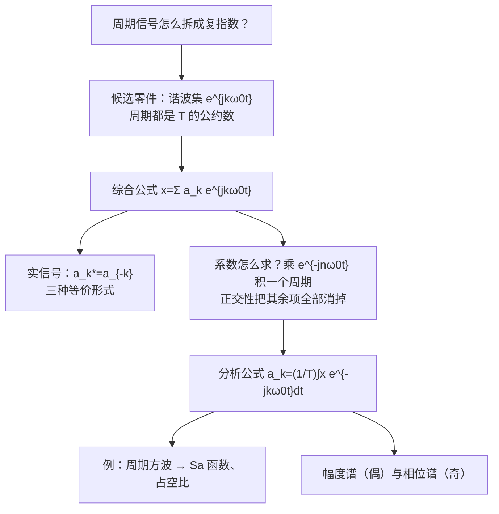

# 3.3 连续时间周期信号的傅里叶级数 CTFS

> [!abstract] 这一讲的任务
> 上一讲说：输入只要是复指数的线性组合，LTI 系统的作用就成了乘法。这一讲兑现前提——**任何（满足条件的）周期信号都能写成复指数的线性组合**，而且只要基频的整数倍 $k\omega_0$ 就够了。
> 我们要拿到两个公式：**综合公式**（怎么用系数拼出信号）和**分析公式**（怎么从信号求出系数），并学会读**幅度谱**和**相位谱**。

> [!info] 授课进度说明
> 本篇依据课件整理，**第三章尚无课堂转写稿**，因此全篇不作「拓展」标注。

---

## 0. 开场：调音台上的推子

录音棚的调音台（均衡器 EQ）上有一排推子：60 Hz、120 Hz、240 Hz……每个推子控制一个频率成分的音量。把推子摆成某个样子，就“调”出了一种音色。

反过来想：**任何一个周期性的声音，是不是都能被某种推子摆法完全还原出来？** 如果能，那么“声音”就可以用“一排推子的位置”来记录——这就是**频谱**。

傅里叶级数说：能。而且推子只需要摆在**基频的整数倍**上（120 Hz 声音只需要 120、240、360……），每个推子的“位置”是一个复数 $a_k$（大小 + 相位）。

---

## 1. 零件：谐波相关的复指数集

> [!important] 谐波相关复指数集 Harmonically related complex exponentials
> $$\Phi_k(t)=e^{jk\omega_0t}=e^{jk(2\pi/T)t},\qquad k=0,\pm1,\pm2,\cdots$$
> - $T$：基波周期 fundamental period（也是所有成员的**公共周期 common period**）
> - $\omega_0=2\pi/T$：基波频率 fundamental frequency
> - $k=\pm1$：**基波分量** fundamental components $e^{\pm j\omega_0t}$
> - $k=\pm2$：**二次谐波** second harmonic components $e^{\pm j2\omega_0t}$
> - $k=\pm N$：**$N$ 次谐波** $N$th harmonic components

> [!question] 停一下，先自己想想
> 为什么只选 $k\omega_0$，不选 $1.5\omega_0$ 或 $\sqrt2\omega_0$？

因为我们要拼的是**周期为 $T$ 的信号**。$e^{jk\omega_0t}$ 的周期是 $T/k$，把 $T$ 整除——每个零件都在 $T$ 之后重复，拼出来的和自然也以 $T$ 为周期。频率 $1.5\omega_0$ 的零件周期是 $\frac{2T}{3}$，在 $T$ 之后不回到原位，拼出来就不以 $T$ 为周期了。**“周期为 $T$”这个要求，把可用频率锁死在 $\omega_0$ 的整数倍上**——频谱因此是**离散的**（一根一根的谱线）。

> [!important] 傅里叶级数 Fourier series（综合公式 Synthesis equation）
> $$\boxed{\ x(t)=\sum_{k=-\infty}^{+\infty}a_k\,e^{jk\omega_0t}\ }$$
> $a_k$ 叫**傅里叶级数系数** Fourier series coefficients，也叫**频谱系数**。

### 例 3.2：读出系数

> [!example] 课件 Example 3.2
> $\tilde x(t)=1+\frac12\cos2\pi t+\cos4\pi t+\frac23\cos6\pi t$

用欧拉公式 $\cos\theta=\frac12(e^{j\theta}+e^{-j\theta})$：
$$\tilde x(t)=1+\tfrac14(e^{j2\pi t}+e^{-j2\pi t})+\tfrac12(e^{j4\pi t}+e^{-j4\pi t})+\tfrac13(e^{j6\pi t}+e^{-j6\pi t})=\sum_{k=-3}^{3}a_ke^{jk2\pi t}$$
基频 $\omega_0=2\pi$，读出
$$a_0=1,\quad a_{\pm1}=\tfrac14,\quad a_{\pm2}=\tfrac12,\quad a_{\pm3}=\tfrac13$$

> [!warning] 最常见的错：系数要减半
> $\frac12\cos2\pi t$ 的系数是 $\frac12$，但它拆成两个复指数后，$a_1=a_{-1}=\frac14$。**余弦的振幅 = $2|a_k|$**，一半给正频率、一半给负频率。直流项 $a_0$ 不拆，原样保留。
> 课件右侧那四张小图就是 $x_0=1$、$x_1=\frac12\cos2\pi t$、$x_2=\cos4\pi t$、$x_3=\frac23\cos6\pi t$ 四个分量，左下角是它们的和——一个看起来复杂的周期波形。

### 例 1：带相位的余弦

> [!example] 课件 Example 1
> $\tilde x(t)=3\cos(\omega_0t+4)$
> $$=\tfrac32e^{j4}e^{j\omega_0t}+\tfrac32e^{-j4}e^{-j\omega_0t}$$
> $$a_1=\tfrac32e^{j4},\quad a_{-1}=\tfrac32e^{-j4},\quad a_k=0\ (k\ne\pm1)$$
> **初相位跑进了系数里**：$|a_{\pm1}|=\frac32$（幅度），$\angle a_{\pm1}=\pm4$（相位）。$a_k$ 是复数，正是为了同时装下“多大”和“错开多少”。

---

## 2. 实信号的三种等价写法

实际中的信号几乎都是**实信号**：$x(t)=x^*(t)$。这会给系数加上一条约束。

> [!example] 推导（课件 p.9）
> $$x(t)=\sum_ka_ke^{jk\omega_0t}\quad\text{而}\quad x^*(t)=\sum_ka_k^*e^{-jk\omega_0t}\xrightarrow{\ k'=-k\ }\sum_{k'}a_{-k'}^*e^{jk'\omega_0t}$$
> 两者相等且傅里叶级数表示唯一，逐项比较系数：
> $$\boxed{\ a_k^*=a_{-k}\ }$$
> 正负频率的系数**互为共轭**。

于是正负频率两两配对，每对加起来是实数：
$$x(t)=a_0+\sum_{k=1}^{\infty}\big[a_ke^{jk\omega_0t}+(a_ke^{jk\omega_0t})^*\big]=a_0+\sum_{k=1}^{\infty}2\,\mathrm{Re}\big[a_ke^{jk\omega_0t}\big]$$

| 形式 | 设 | 结果 |
|---|---|---|
| **(A) 极坐标式 Polar form** | $a_k=A_ke^{j\theta_k}$ | $x(t)=a_0+\sum_{k=1}^\infty2A_k\cos(k\omega_0t+\theta_k)$ |
| **(B) 直角坐标式 Rectangular form** | $a_k=B_k+jC_k$ | $x(t)=a_0+2\sum_{k=1}^\infty\big[B_k\cos k\omega_0t-C_k\sin k\omega_0t\big]$ |
| **复指数式** | — | $x(t)=\sum_{-\infty}^{\infty}a_ke^{jk\omega_0t}$ |

课件结论：**三者数学上等价 (Mathematically equivalent)**。

> [!tip] 为什么教材偏用复指数式
> 三角形式对人更直观（一眼看到 $\cos$、$\sin$），但复指数式：① 一个公式同时装下幅度和相位；② 正是 LTI 的特征函数，过系统只要乘 $H(jk\omega_0)$；③ 推导性质时只需要指数运算。[[L01 绪论 Introduction]] 里对三种形式的比较在这里得到了严格推导。
> (B) 式里 $-C_k\sin$ 的负号来自 $\mathrm{Re}[(B_k+jC_k)(\cos\theta+j\sin\theta)]=B_k\cos\theta-C_k\sin\theta$，别漏。

---

## 3. 系数怎么求：正交性一把消掉

有了综合公式，还缺一步：**给一个信号 $x(t)$，$a_k$ 到底是多少？**

> [!question] 停一下，先自己想想
> 等式 $x(t)=\sum_ka_ke^{jk\omega_0t}$ 右边有无穷多个未知数。怎么只把 $a_n$ 一个“挑”出来？

**朴素尝试**：在某个时刻 $t_1$ 取值？得到一个方程、无穷多未知数，解不出来。

**正确做法**：利用谐波集的**正交性 Orthogonality**（[[C1.3 指数信号与正弦信号]] 已证）：
$$\int_Te^{jk\omega_0t}e^{-jn\omega_0t}dt=\begin{cases}T,&k=n\\0,&k\ne n\end{cases}$$

两边同乘 $e^{-jn\omega_0t}$，再在一个周期上积分：
$$\int_Tx(t)e^{-jn\omega_0t}dt=\sum_ka_k\underbrace{\int_Te^{j(k-n)\omega_0t}dt}_{\text{只有 }k=n\text{ 时为 }T}=a_nT$$

> [!important] 傅里叶级数系数（分析公式 Analysis equation）
> $$\boxed{\ a_k=\frac1T\int_Tx(t)e^{-jk\omega_0t}dt\ }$$
> 与综合公式 $x(t)=\sum a_ke^{jk\omega_0t}$ 成对使用。$\int_T$ 表示在**任意一个完整周期**上积分（$[0,T]$ 或 $[-\frac T2,\frac T2]$ 都行，挑好算的）。

> [!tip] 两个公式的记忆
> - **综合**：系数 × 基函数，求和 → 信号；
> - **分析**：信号 × 基函数的**共轭**，积分再除以 $T$ → 系数。
> 这和线性代数里“向量在正交基上的坐标 = 与基向量的内积 / 基向量长度²”完全一样。$a_0=\frac1T\int_Tx\,dt$ 就是**一个周期的平均值（直流分量）**。

---

## 4. 例 1：周期方波——Sa 函数登场

> [!example] 课件 Example 1
> 周期方波：幅度 1，在 $|t|<T_1$ 为 1，周期 $T_0$。

取积分区间 $[-\frac{T_0}{2},\frac{T_0}{2}]$，只有 $[-T_1,T_1]$ 上非零：
$$a_k=\frac1{T_0}\int_{-T_1}^{T_1}e^{-jk\omega_0t}dt=-\frac{1}{jk\omega_0T_0}e^{-jk\omega_0t}\Big|_{-T_1}^{T_1}=\frac{2\sin k\omega_0T_1}{k\omega_0T_0}$$
（最后一步用了 $e^{j\theta}-e^{-j\theta}=2j\sin\theta$。）
凑成标准形式：
$$\boxed{\ a_k=\frac{2T_1}{T_0}\cdot\frac{\sin k\omega_0T_1}{k\omega_0T_1}=\frac{2T_1}{T_0}\,\mathrm{Sa}(k\omega_0T_1)=\frac{2T_1}{T_0}\,\mathrm{sinc}\!\Big(\frac{2T_1}{T_0}k\Big)\ }$$
$k=0$ 单独算：$a_0=\frac{2T_1}{T_0}$（与 $\mathrm{Sa}(0)=1$ 的极限一致）。

> [!important] 两个长得很像的函数：Sa 与 sinc
> $$\mathrm{Sa}(x)=\frac{\sin x}{x}\qquad\qquad \mathrm{sinc}(x)=\frac{\sin\pi x}{\pi x}$$
> ![[C3-Sa函数与sinc函数.png]]
> **课件 Note：注意二者区别。** Sa 的零点在 $x=k\pi$；sinc 的零点在**整数** $x=k$。$\mathrm{Sa}(\pi x)=\mathrm{sinc}(x)$。
> 编程要小心：`numpy.sinc(x)` 实现的是 $\frac{\sin\pi x}{\pi x}$（归一化 sinc）。

### 占空比如何影响频谱

$\frac{2T_1}{T_0}$ 叫**占空比 duty ratio**：一个周期里“高电平”所占的比例。

![[C3-周期方波频谱-占空比.png]]

**左列（固定 $T_0$，缩短脉宽 $T_1$）**，横轴是谐波序号 $k$：
- 占空比 $\frac12\to\frac14\to\frac18$，**包络变宽、变矮**；
- 包络第一个零点在 $k\omega_0T_1=\pi$，即 $k=\frac{T_0}{2T_1}$（占空比的倒数）：分别在 $k=2,4,8$；
- **脉冲越窄，能量铺得越开，高频成分越多。**

**右列（固定 $T_1$，拉长周期 $T_0$）**，横轴是实际频率 $\omega=k\omega_0$：
- 包络**形状不变**（零点永远在 $\omega=\pi/T_1$），只是**谱线越来越密**（间隔 $\omega_0=2\pi/T_0$ 变小）、高度越来越低（整体乘 $\frac{2T_1}{T_0}$）；
- **推到极限 $T_0\to\infty$**：周期信号变成单个脉冲，谱线密到连成一片——**这就是第 4 章傅里叶变换的由来**。

> [!warning] 读图时注意两列横轴不同
> 左列横轴是 $k$（序号），右列横轴是 $\omega$（真实频率）。同样的占空比，在 $k$ 轴上看一样，在 $\omega$ 轴上看却完全不同。这是初学者最容易卡住的地方。

---

## 5. 幅度谱与相位谱

$a_k$ 是复数，画频谱要画两张图：
$$a_k=|a_k|e^{j\varphi_k}\qquad|a_k|\text{：幅度谱 magnitude spectra},\quad\varphi_k\text{：相位谱 phase spectra}$$

### 例 2：三角函数组合（复数系数）

> [!example] 课件 Example 2
> 求 $x(t)=1-\cos(\pi t)+2\sin(2\pi t)+\cos(3\pi t)$ 的 CTFS 系数。

基频 $\omega_0=\pi$（各频率 $\pi,2\pi,3\pi$ 的最大公约数）。逐项展开：
$$x=1-\frac{e^{j\omega_0t}+e^{-j\omega_0t}}{2}+2\cdot\frac{e^{j2\omega_0t}-e^{-j2\omega_0t}}{2j}+\frac{e^{j3\omega_0t}+e^{-j3\omega_0t}}{2}$$
其中 $\frac{2}{2j}=-j$，所以 $e^{j2\omega_0t}$ 的系数是 $-j$、$e^{-j2\omega_0t}$ 的系数是 $+j$：
$$a_k=\begin{cases}1,&k=0\\-\frac12,&k=\pm1\\\mp j,&k=\pm2\\\frac12,&k=\pm3\\0,&\text{others}\end{cases}$$

![[C3-例2幅度谱与相位谱.png]]

- **幅度谱（偶对称）**：$|a_0|=1$，$|a_{\pm1}|=\frac12$，$|a_{\pm2}|=1$，$|a_{\pm3}|=\frac12$；
- **相位谱（奇对称）**：$a_{\pm1}=-\frac12$ 的相位是 $\pm\pi$（负实数，取 $+\pi$ 或 $-\pi$ 都对，画图时取成奇对称）；$a_2=-j$ 相位 $-\frac\pi2$，$a_{-2}=j$ 相位 $+\frac\pi2$；$a_{\pm3}$ 是正实数，相位 0。

> [!warning] 两个易错点
> 1. $\sin$ 展开时分母是 $2j$，$\frac{1}{j}=-j$，所以 $\sin$ 对应的是**纯虚数**系数，正频率那一项是 $-j$ 倍。
> 2. 负实数的相位是 $\pi$ 不是 0；相位谱只在 $a_k\ne0$ 处有意义。

> [!important] 实信号频谱的一般规律
> 由 $a_k^*=a_{-k}$：$|a_k|=|a_{-k}|$（**幅度谱偶对称**），$\varphi_k=-\varphi_{-k}$（**相位谱奇对称**）。两个例子都验证了这一点。所以实信号只需要看 $k\ge0$ 的一半。

### 例 3：周期指数信号

> [!example] 课件 Example 3
> $x(t)$ 在 $[0,2)$ 上为 $e^{-2t}$，周期 $T=2$，$\omega_0=\pi$。

$$a_k=\frac12\int_0^2e^{-2t}e^{-jk\pi t}dt=\frac12\cdot\frac{1-e^{-(2+jk\pi)\cdot2}}{2+jk\pi}=\frac{1-e^{-4}}{4+j2k\pi}$$
（用了 $e^{-j2k\pi}=1$。）

![[C3-例3周期指数信号的频谱.png]]

**数值验算**（python 数值积分）：$a_0=\frac{1-e^{-4}}{4}=0.2454$，$|a_1|=0.1318$、$\varphi_1=-1.004$ rad，$|a_2|=0.0744$，与公式及课件图一致。
**读图**：$|a_k|\sim\frac{1}{2\pi|k|}$ 缓慢衰减（因为信号有跳变）；相位随 $k\to\pm\infty$ 趋于 $\mp\frac\pi2$（分母被 $j2k\pi$ 主导）。

---

## 这一讲的三句话

1. **周期信号只需要 $k\omega_0$ 这些频率**：$x(t)=\sum a_ke^{jk\omega_0t}$，频谱是离散的谱线。
2. **系数靠正交性求**：$a_k=\frac1T\int_Tx(t)e^{-jk\omega_0t}dt$；实信号满足 $a_k^*=a_{-k}$，幅度谱偶、相位谱奇。
3. **周期方波的系数是 Sa 函数**：$a_k=\frac{2T_1}{T_0}\mathrm{Sa}(k\omega_0T_1)$；脉冲越窄频谱越宽，周期越长谱线越密——这是走向傅里叶变换的桥。

> [!tip] 速查表
> | 项目 | 公式 |
> |---|---|
> | 综合公式 | $x(t)=\sum_{k}a_ke^{jk\omega_0t}$，$\omega_0=2\pi/T$ |
> | 分析公式 | $a_k=\frac1T\int_Tx(t)e^{-jk\omega_0t}dt$ |
> | 直流分量 | $a_0=\frac1T\int_Tx\,dt$（周期平均值） |
> | 实信号 | $a_k^*=a_{-k}$；$x=a_0+\sum_{k\ge1}2A_k\cos(k\omega_0t+\theta_k)$ |
> | $\cos(k\omega_0t)$ | $a_{\pm k}=\frac12$ |
> | $\sin(k\omega_0t)$ | $a_k=\frac1{2j}=-\frac j2$，$a_{-k}=\frac j2$ |
> | 周期方波 | $a_k=\frac{2T_1}{T_0}\mathrm{Sa}(k\omega_0T_1)$，占空比 $\frac{2T_1}{T_0}$ |
> | Sa / sinc | $\mathrm{Sa}(x)=\frac{\sin x}{x}$；$\mathrm{sinc}(x)=\frac{\sin\pi x}{\pi x}$ |

> [!tip] 下一讲预告
> 我们默认了“无穷多项加起来就等于原信号”。可方波明明有跳变，光滑的正弦怎么拼出一个断崖？只取前 $N$ 项又会怎样？下一讲会看到一个出人意料的现象：**项数加到一百、一千，跳变处的尖峰始终顽固地高出约 9%**——吉布斯现象。

---

## 本节自测 Self-Test

> [!question] 1. 为什么周期为 $T$ 的信号只需要频率 $k\omega_0$ 的分量？

> [!success]- 答案
> 因为只有 $e^{jk\omega_0t}$（$k$ 为整数）的周期 $T/k$ 能整除 $T$，每个分量在 $T$ 之后都回到原位，和才以 $T$ 为周期。其他频率会破坏周期性。所以周期信号的频谱是离散谱线。

> [!question] 2. 写出 $x(t)=2+4\cos(3t)-6\sin(6t+\frac\pi4)$ 的基频和全部非零 $a_k$。

> [!success]- 答案
> 基频 $\omega_0=3$（3 与 6 的最大公约数）。
> - $a_0=2$；
> - $4\cos3t=2e^{j3t}+2e^{-j3t}$ ⇒ $a_{\pm1}=2$；
> - $-6\sin(6t+\frac\pi4)=-6\cdot\frac{e^{j(6t+\pi/4)}-e^{-j(6t+\pi/4)}}{2j}=3j\,e^{j\pi/4}e^{j6t}-3j\,e^{-j\pi/4}e^{-j6t}$
>   ⇒ $a_2=3je^{j\pi/4}=3e^{j3\pi/4}$，$a_{-2}=-3je^{-j\pi/4}=3e^{-j3\pi/4}$。
> 自检：$a_{-2}=a_2^*$ ✓（实信号）。

> [!question] 3. 用正交性推导分析公式，关键一步是什么？

> [!success]- 答案
> 综合公式两边乘 $e^{-jn\omega_0t}$ 并在一个周期上积分，右边变成 $\sum_ka_k\int_Te^{j(k-n)\omega_0t}dt$。由正交性，只有 $k=n$ 那一项积分为 $T$，其余全为 0，于是 $\int_Tx e^{-jn\omega_0t}dt=a_nT$。

> [!question] 4. 周期方波 $T_0=4$、$T_1=1$，求 $a_0,a_1,a_2,a_3$。

> [!success]- 答案
> 占空比 $\frac{2T_1}{T_0}=\frac12$，$\omega_0=\frac\pi2$，$a_k=\frac12\mathrm{Sa}(\frac{k\pi}2)=\frac{\sin(k\pi/2)}{k\pi}$。
> $a_0=\frac12$；$a_1=\frac1\pi\approx0.318$；$a_2=0$；$a_3=-\frac{1}{3\pi}\approx-0.106$。
> 占空比 $\frac12$ 时所有偶次谐波为零——这就是课件左上图 $k=\pm2,\pm4,\dots$ 处恰为零的原因。

> [!question] 5. 方波脉宽不变、周期加倍，频谱会怎样变化？

> [!success]- 答案
> 在 $\omega$ 轴上看：包络形状（零点位置 $\omega=\pi/T_1$）不变，谱线间隔 $\omega_0$ 减半（变密），每根谱线高度减半（因子 $\frac{2T_1}{T_0}$ 减半）。$T_0\to\infty$ 时谱线连成连续谱，即傅里叶变换。

> [!question] 6. 实信号的频谱为什么幅度偶、相位奇？

> [!success]- 答案
> 实信号 $x=x^*$ ⇒ $a_k^*=a_{-k}$。设 $a_k=|a_k|e^{j\varphi_k}$，则 $a_{-k}=|a_k|e^{-j\varphi_k}$，即 $|a_{-k}|=|a_k|$、$\varphi_{-k}=-\varphi_k$。

---

## 相关笔记 Related Notes

- [[信号与系统 MOC]]
- 上一节：[[C3.1 复指数是LTI系统的特征函数]]
- 下一节：[[C3.3 傅里叶级数的收敛与吉布斯现象]]
- 相关：[[C1.3 指数信号与正弦信号]]（谐波集与正交性证明）、[[L01 绪论 Introduction]]（三种形式、方波合成）
