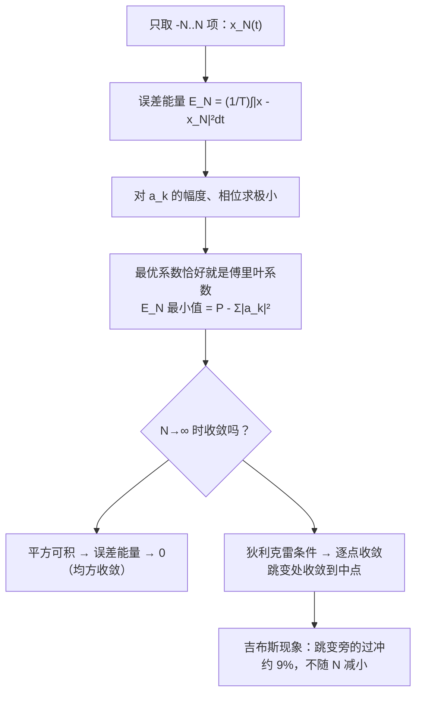

# 3.4 傅里叶级数的收敛与吉布斯现象

> [!abstract] 这一讲的任务
> 上一讲默认了“无穷多项加起来就等于原信号”。这一讲把这件事问清楚：
> 1. **只取有限项时**，傅里叶系数是不是最好的选择？——是，在**均方误差最小**的意义下；
> 2. **什么样的信号**，级数一定收敛？——平方可积条件、狄利克雷条件；
> 3. **在跳变处**会发生什么？——吉布斯现象：约 9% 的过冲永远消不掉。

> [!info] 授课进度说明
> 本篇依据课件整理，**第三章尚无课堂转写稿**，因此全篇不作「拓展」标注。

---

## 0. 开场：用圆滑的波浪砌一道悬崖

你用 JPEG 存过一张白底黑字的截图吗？放大看，黑字边缘常常有一圈淡淡的“波纹”（ringing，振铃）。拍 MRI 时，组织边界旁有时也会出现一道道平行的亮暗条纹。

它们的来源是同一件事：**用有限个平滑的正弦去拼一个突变的边缘**。正弦是处处光滑的，而边缘是一道断崖。项数再多，断崖旁总会冒出波纹，而且最高的那道波纹不管你加多少项，都比崖顶高出约 9%。

这一讲先证明“傅里叶系数是最好的有限项近似”，再说清楚“什么时候能收敛”，最后回到这道顽固的 9%。

---

## 1. 有限项近似：傅里叶系数是最优解

### 1.1 截断级数与误差

只保留 $-N\sim N$ 共 $2N+1$ 项：
$$x_N(t)=\sum_{k=-N}^{N}a_ke^{jk\omega_0t}$$

近似误差 approximation error 与**误差能量**（一个周期内的均方误差）：
$$e_N(t)=x(t)-x_N(t),\qquad E_N=\frac1T\int_T|e_N(t)|^2dt$$

> [!question] 停一下，先自己想想
> 假如不知道分析公式，只允许用 $2N+1$ 个复指数去近似 $x(t)$，你会怎么挑系数 $a_k$？“最好”该怎么定义？

一个自然的标准是：**让误差能量 $E_N$ 最小**（最小均方误差准则 least mean square error, LMS）。下面就按这个标准去挑 $a_k$，看结果是什么。

### 1.2 把 $E_N$ 展开

每个 $a_k$ 是复数，有**两个自由度**（幅度和相位）。课件记
$$a_k=A_ke^{j\varphi_k},\qquad \int_Tx(t)e^{-jk\omega_0t}dt=B_ke^{j\theta_k}$$
其中 $B_k,\theta_k$ 由信号决定，是已知量；$A_k,\varphi_k$ 是要挑的量。

把 $|e_N|^2=e_Ne_N^*$ 乘开，分三部分：
- $\frac1T\int_T|x|^2dt$：信号本身的平均功率，与 $a_k$ 无关；
- $\frac1T\int_T|x_N|^2dt=\sum A_k^2$：由正交性，交叉项 $\int_Te^{j(k-n)\omega_0t}dt$ 在 $k\ne n$ 时都是 0；
- 交叉项 $-\frac1T\int_T(x\,x_N^*+x^*x_N)dt=-\frac2T\sum A_kB_k\cos(\varphi_k-\theta_k)$。

于是
$$E_N=\frac1T\int_T|x(t)|^2dt+\sum_{k=-N}^{N}A_k^2-\frac2T\sum_{k=-N}^{N}A_kB_k\cos(\varphi_k-\theta_k)$$

### 1.3 求极小

各个 $k$ 互不牵连，逐项对两个自由度求偏导：
- 对相位：$\frac{\partial E_N}{\partial\varphi_k}=\frac2TA_kB_k\sin(\varphi_k-\theta_k)=0$，且要让减去的那项最大，取 $\cos=1$ ⇒ $\varphi_k=\theta_k$；
- 对幅度：$\frac{\partial E_N}{\partial A_k}=2A_k-\frac2TB_k=0$ ⇒ $A_k=\frac{B_k}{T}$。

合起来：
$$a_k=A_ke^{j\varphi_k}=\frac1TB_ke^{j\theta_k}=\frac1T\int_Tx(t)e^{-jk\omega_0t}dt$$

> [!important] 结论
> 在最小均方误差准则下，最优的系数**恰好就是傅里叶系数**。
> **傅里叶级数是周期信号的最佳（均方意义下）有限项逼近。** Fourier series is the best approximation to the periodic signal.

几点值得注意：
1. **系数不随 $N$ 改变**。多加一项时，原来的 $a_k$ 不用重算——这就是正交性的好处。（如果零件不正交，加一个零件往往要把所有系数重新调一遍。）
2. 代回去得到最小误差：
$$E_N^{\min}=\frac1T\int_T|x(t)|^2dt-\sum_{k=-N}^{N}|a_k|^2$$
每多加一对谐波，误差就减少 $2|a_k|^2$，所以 $E_N$ **单调不增**。
3. 若 $N\to\infty$ 时 $E_N\to0$，就得到 $\frac1T\int_T|x|^2dt=\sum_k|a_k|^2$——这正是下一讲的**帕塞瓦尔定理**。

![[C3-截断误差随N下降.png]]

上图是占空比 0.6 的方波（$T=1$、高电平宽 0.6）：$E_0=0.6-0.6^2=0.24$，$E_1=0.0567$，$E_2=0.0392$，$E_5=0.0200$，$E_{30}=0.0034$（python 验算）。下降很快但越来越慢——因为方波有跳变，$|a_k|$ 只按 $\frac1k$ 衰减。

---

## 2. 收敛条件

> [!question] 停一下，先自己想想
> 分析公式是一个积分。什么样的 $x(t)$ 会让这个积分“算不出来”（发散）？

### 2.1 条件一：平方可积（有限能量）

> [!important] 平方可积条件 Quadratic integrable condition
> $$\int_T|x(t)|^2dt<\infty$$
> 即一个周期内能量有限。满足它，则 $a_k$ 都有限，且 $E_N\xrightarrow{N\to\infty}0$。

注意这是**能量意义下的收敛**（均方收敛）：误差的总能量趋于 0，但不保证每一点上 $x_N(t)\to x(t)$。在个别点（例如跳变点）上两者可以不相等，只要这些点的“面积”为零，就不影响积分。

### 2.2 条件二：狄利克雷条件（三条）

狄利克雷条件 Dirichlet conditions 保证更强的**逐点收敛**：在 $x(t)$ 连续的点 $x_N(t)\to x(t)$，在跳变点收敛到**左右极限的平均值**（跳变的中点）。

> [!important] 条件 1：一个周期内绝对可积 Absolutely integrable
> $$\int_T|x(t)|dt<\infty$$
> 这保证了每个系数有限：$|a_k|\le\frac1T\int_T|x(t)||e^{-jk\omega_0t}|dt=\frac1T\int_T|x(t)|dt<\infty$。

> [!important] 条件 2：一个周期内极大值、极小值的个数有限
> Finite number of maxima and minima during a single period.

> [!important] 条件 3：一个周期内间断点的个数有限，且每个间断都是有限跳变
> Finite number of discontinuities, each discontinuity is finite.

![[C3-违反狄利克雷条件的三个例子.png]]

课件给了三个“反例”，每个只违反一条：

| 例子 | 信号（一个周期） | 违反哪条 | 为什么 |
|---|---|---|---|
| 例 1 | $x(t)=\frac1t$，$0<t\le1$，$T=1$ | 条件 1 | $\int_0^1\frac1tdt=\ln t\big\|_0^1=0-\ln0=\infty$，面积无穷大 |
| 例 2 | $x(t)=\sin\frac{2\pi}{t}$，$0<t\le1$，$T=1$ | 条件 2 | $t\to0$ 时振荡无限加快，一个周期内有无穷多个极值；但 $\int_0^1\|x\|dt\le1$，**满足条件 1** |
| 例 3 | $T=8$，$[0,4)$ 为 1，$[4,6)$ 为 $\frac12$，$[6,7)$ 为 $\frac14$，$[7,7.5)$ 为 $\frac18$…… | 条件 3 | 每一段高度、宽度都是前一段的一半，一个周期内有无穷多个跳变；但 $\int_0^8\|x\|dt=4+1+\frac14+\cdots<8$，**满足条件 1** |

> [!tip] 考试怎么用
> 这三个都是“构造出来的怪信号”。工程上遇到的周期信号（方波、三角波、锯齿波、各种光滑信号）都满足狄利克雷条件，可以放心展开。考试若问“能否展开 / 违反哪条”，就按上表逐条对照：先查面积是否有限，再查极值个数、跳变个数。

> [!note] 两套条件的关系
> 两者是**不同的充分条件**，互不包含：
> - 平方可积 ⇒ 均方收敛（误差能量 → 0）；
> - 狄利克雷 ⇒ 逐点收敛（连续点处相等，跳变点处取中点）。
>
> 例 1 的 $\frac1t$ 既不绝对可积也不平方可积，两套条件都不满足。

---

## 3. 吉布斯现象 Gibbs phenomenon

### 3.1 实验：用越来越多的谐波拼方波

以周期方波为例，上一讲已求得 $a_k=\frac{2\sin(k\omega_0T_1)}{k\omega_0T_0}$，把 $x_N(t)=\sum_{-N}^{N}a_ke^{jk\omega_0t}$ 画出来：

![[C3-吉布斯现象.png]]

（图中方波 $T_0=1$、$T_1=0.3$，每幅小标题是 $x_N$ 的最大值。）

观察：
- $N$ 越大，平坦部分越贴近 1，**波纹越来越挤向跳变点**；
- 但跳变旁**最高的那个尖峰始终约为 1.09**：$N=19$ 时 1.087，$N=100$ 时 1.089，$N=500$ 时 1.0894。

> [!question] 停一下，先自己想想
> 上一节刚证明了 $E_N\to0$。可这里尖峰的高度一直不降，这两件事矛盾吗？

不矛盾。尖峰的**高度**不变，但它的**宽度**随 $N$ 按 $\frac1N$ 缩窄。误差能量是“高度² × 宽度”的积分，宽度趋于 0，误差能量照样趋于 0。
**均方收敛不等于一致收敛**：误差的“面积”可以任意小，误差的“最大值”却可以一直不小。

### 3.2 吉布斯的结论

> [!important] Gibbs's conclusion
> 对 $x_N(t)=\sum_{k=-N}^{N}a_ke^{jk\omega_0t}$，当 $N\to\infty$：
> 1. **连续点** $t_1$：$x_N(t_1)\to x(t_1)$；
> 2. **跳变点附近**：出现波纹 ripples，波纹向跳变点压缩，但**峰值幅度并不减小**；
> 3. **跳变处**：过冲 overshoot 约为跳变高度的 **9%**；跳变点本身收敛到跳变的中点。

这个 9% 从哪来？在跳变附近，$x_N$ 的形状趋于一个固定曲线，它的峰值是
$$\frac12+\frac1\pi\mathrm{Si}(\pi)=\frac12+\frac{1.8519}{\pi}=1.0895$$
（以跳变高度为 1 计，$\mathrm{Si}(x)=\int_0^x\frac{\sin u}{u}du$ 叫正弦积分）。即过冲约 $8.95\%$，课件和教材都取整为 9%。这个值与 $N$ 无关、与方波的占空比无关，是“有限个正弦拼跳变”的普遍代价。

> [!tip] 工程启示
> - 跳变处**必定**有 9% 过冲，想用“加更多项”消除它是徒劳的；
> - 实际做法是给系数加一个**平滑窗**（让高次 $a_k$ 逐渐减小，而不是在 $N$ 处突然截断），用一点点边缘模糊换取振铃消失。这正是开场里 JPEG、MRI 振铃的对策。
> - 反过来，理想低通滤波器（第 3.9 节）本质上就是“把高于某频率的谐波一刀切掉”，所以理想低通滤波后的方波一定带吉布斯振铃。

---

## 4. 随堂测（课件 p.29）

> [!example] 求傅里叶系数
> $$x(t)=\begin{cases}1.5,&0\le t<1\\-1.5,&1\le t<2\end{cases}$$
> 基频 $\omega_0=\pi$（周期 $T=2$）。求 $a_k$。

**解**：$a_0$ 是周期平均值，正负各半，$a_0=0$。$k\ne0$ 时：
$$a_k=\frac12\left[\int_0^11.5\,e^{-jk\pi t}dt-\int_1^21.5\,e^{-jk\pi t}dt\right]$$
$$\int_0^1e^{-jk\pi t}dt=\frac{1-e^{-jk\pi}}{jk\pi},\qquad \int_1^2e^{-jk\pi t}dt=\frac{e^{-jk\pi}-e^{-j2k\pi}}{jk\pi}=\frac{e^{-jk\pi}-1}{jk\pi}$$
两式相减得 $\frac{2(1-e^{-jk\pi})}{jk\pi}$，而 $e^{-jk\pi}=(-1)^k$：
$$a_k=\frac{1.5\,(1-(-1)^k)}{jk\pi}=\begin{cases}\dfrac{3}{jk\pi}=-\dfrac{3j}{k\pi},&k\ \text{奇数}\\[2mm]0,&k\ \text{偶数（含}\ k=0)\end{cases}$$

**验算**（python 数值积分）：$a_1=-0.9549j=-\frac{3j}{\pi}$，$a_3=-0.3183j=-\frac{j}{\pi}$，$a_2=a_4=0$ ✓。

**读结果**：
- 纯虚数、$a_{-k}=-a_k$ ⇒ 实奇信号（确实，这个信号关于 $t=0$ 奇对称：$x(-t)=-x(t)$）；
- 只有奇次谐波 ⇒ 半周期反号（$x(t+1)=-x(t)$）的信号只含奇次谐波；
- 合成的实形式：$x(t)=\sum_{k\ \text{奇},\,k>0}\frac{6}{k\pi}\sin(k\pi t)$，这正是 [[L01 绪论 Introduction]] 里方波合成的那个级数；它在 $t=0,1,2,\dots$ 处有跳变，截断后必有吉布斯过冲（跳变高度 3，过冲约 $0.27$）。

> [!tip] 更快的做法
> 学完 [[C3.4 连续时间傅里叶级数的性质]] 后，可以把它看成“占空比 $\frac12$ 的 0/1 方波 $g$ 右移 $\frac12$ 再缩放平移”：$x(t)=3g(t-\frac12)-1.5$，直接用线性和时移性质写出答案，不用积分。那一篇会再做一遍。

---

## 这一讲的三句话

1. **傅里叶系数是最佳有限项逼近**：在均方误差最小的意义下，最优系数就是分析公式给出的 $a_k$，且加项时旧系数不变；最小误差 $E_N=P-\sum_{-N}^{N}|a_k|^2$。
2. **收敛有两套充分条件**：平方可积 ⇒ 误差能量 → 0；狄利克雷三条件（绝对可积、极值有限、跳变有限）⇒ 连续点处逐点收敛，跳变点处收敛到中点。
3. **吉布斯现象**：跳变旁的过冲约 9%，不随 $N$ 减小，只是越来越窄——均方收敛不等于一致收敛。

> [!tip] 速查表
> | 项目 | 内容 |
> |---|---|
> | 截断级数 | $x_N=\sum_{-N}^{N}a_ke^{jk\omega_0t}$ |
> | 误差能量 | $E_N=\frac1T\int_T\|x-x_N\|^2dt$，最小值 $=\frac1T\int_T\|x\|^2dt-\sum_{-N}^N\|a_k\|^2$ |
> | 最优系数 | LMS 准则下 = 傅里叶系数（两个自由度：$\varphi_k=\theta_k$，$A_k=B_k/T$） |
> | 平方可积 | $\int_T\|x\|^2dt<\infty$ ⇒ 均方收敛 |
> | 狄利克雷 1 | $\int_T\|x\|dt<\infty$（反例 $\frac1t$） |
> | 狄利克雷 2 | 一个周期内极值有限（反例 $\sin\frac{2\pi}t$） |
> | 狄利克雷 3 | 一个周期内跳变有限且有界（反例：无限阶梯） |
> | 跳变点 | 收敛到左右极限的平均值 |
> | 吉布斯过冲 | $\frac1\pi\mathrm{Si}(\pi)-\frac12\approx8.95\%$ ≈ 9% 的跳变高度 |

> [!tip] 下一讲预告
> 每次都用分析公式积分太累了。如果已知 $x(t)$ 的系数，那么 $x(t-t_0)$、$x(-t)$、$\frac{dx}{dt}$、$x(t)y(t)$ 的系数能不能直接写出来？下一讲的**傅里叶级数性质**就是一张“免积分”的对照表，外加帕塞瓦尔定理：时域功率 = 各谐波功率之和。

---

## 本节自测 Self-Test

> [!question] 1. 为什么说“多加一项，原来的系数不用重算”？如果零件不正交会怎样？

> [!success]- 答案
> 展开 $E_N$ 时，由于正交性，不同 $k$ 之间的交叉项积分为 0，$E_N$ 分解成各 $k$ 互不相干的项之和，每个 $a_k$ 的最优值只由自己那一项决定（$a_k=\frac1T\int_Tx e^{-jk\omega_0t}dt$），与 $N$ 无关。零件不正交时，交叉项不消失，各系数的最优值互相耦合，加一个零件就要解一个新的联立方程组，全部系数都会变。

> [!question] 2. 占空比 0.6 的方波（$T=1$），只用直流分量近似，误差能量是多少？再加上 $k=\pm1$ 呢？

> [!success]- 答案
> $P=\frac1T\int_T|x|^2dt=0.6$，$a_0=0.6$，$E_0=0.6-0.36=0.24$。
> $a_{\pm1}=\frac{\sin(0.6\pi)}{\pi}=0.3027$，$E_1=0.24-2\times0.3027^2=0.0567$。只加一对谐波，误差就降到原来的约四分之一。

> [!question] 3. 判断能否展开成傅里叶级数（按狄利克雷条件），不能的指出违反哪条：
> (a) $x(t)=|\sin t|$；(b) 一个周期内 $x(t)=\frac{1}{\sqrt t}$，$0<t\le1$；(c) 一个周期内 $x(t)=t\sin\frac1t$，$0<t\le1$。

> [!success]- 答案
> (a) 可以：连续、有界、每周期极值有限。
> (b) 满足条件 1：$\int_0^1t^{-1/2}dt=2<\infty$；极值个数也有限。但 $t\to0^+$ 时 $x\to\infty$，周期边界处的间断**不是有限跳变**，违反条件 3。另外 $|x|^2=\frac1t$，$\int_0^1\frac1tdt=\infty$，它也**不平方可积**。这个例子说明绝对可积不一定平方可积。
> (c) 绝对可积（$|x|\le t\le1$），但 $t\to0$ 时振荡无限次，一个周期内有无穷多个极值，违反条件 2。

> [!question] 4. 吉布斯现象与“$E_N\to0$”矛盾吗？

> [!success]- 答案
> 不矛盾。过冲峰值约为跳变的 9%，不随 $N$ 减小；但过冲区域的宽度按 $\frac1N$ 缩窄，误差平方的积分仍趋于 0。均方收敛只保证误差能量趋于 0，不保证误差最大值趋于 0（不是一致收敛）。

> [!question] 5. 周期方波在 $0$ 与 $1$ 之间跳变，截断级数 $x_N$ 在跳变点处的值趋于多少？最高点约多少？

> [!success]- 答案
> 跳变点处趋于中点 $\frac{0+1}{2}=\frac12$；跳变旁最高点约 $1+0.09=1.09$（精确极限 $1.0895$），另一侧最低点约 $-0.09$。

> [!question] 6. 随堂测：$x(t)=1.5$（$0\le t<1$）、$-1.5$（$1\le t<2$），$T=2$，求 $a_k$ 并说明为什么只有奇次谐波。

> [!success]- 答案
> $a_k=\frac{1.5(1-(-1)^k)}{jk\pi}$：$k$ 奇数时 $a_k=-\frac{3j}{k\pi}$，$k$ 偶数（含 0）时 $a_k=0$。
> 只含奇次谐波是因为 $x(t+\frac T2)=-x(t)$（半周期反号）：偶次谐波 $e^{jk\omega_0t}$ 平移半周期后不变号，积分时前后两半相互抵消。

---

## 相关笔记 Related Notes

- [[信号与系统 MOC]]
- 上一节：[[C3.2 连续时间傅里叶级数]]
- 下一节：[[C3.4 连续时间傅里叶级数的性质]]
- 相关：[[L01 绪论 Introduction]]（方波合成动画的来源）、[[C3.6 傅里叶级数与LTI系统、滤波]]（理想低通与吉布斯振铃）
