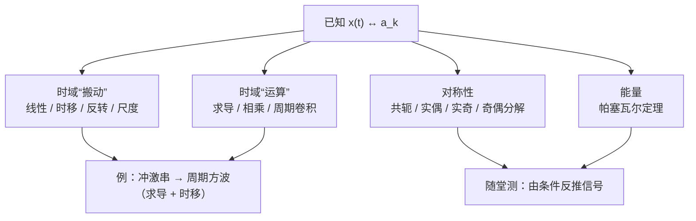

# 3.5 连续时间傅里叶级数的性质

> [!abstract] 这一讲的任务
> 分析公式每用一次都要积分。这一讲建立一张**“免积分对照表”**：已知 $x(t)\leftrightarrow a_k$，那么对 $x(t)$ 做平移、反转、缩放、求导、相乘、卷积之后，新系数都能**直接写出来**。
> 外加一条功率守恒定律——**帕塞瓦尔定理**：时域平均功率 = 各次谐波功率之和。
> 性质的价值在做题时体现：课件的冲激串、方波例子都是“查表 + 两步推导”，不用积一次分。

> [!info] 授课进度说明
> 本篇依据课件整理，**第三章尚无课堂转写稿**，因此全篇不作「拓展」标注。

记号：$x(t)\xleftrightarrow{\mathcal{FS}}a_k$，$y(t)\xleftrightarrow{\mathcal{FS}}b_k$，两者周期都是 $T$，$\omega_0=\frac{2\pi}{T}$。

---

## 0. 开场：播放器上的频谱条

很多音乐播放器会在屏幕上跳动一排“频谱条”，每根条代表一个频段的强弱。

做个思想实验：
- 把同一首歌**晚 2 秒**开始播，频谱条会变吗？——不会。时间平移只改变各分量的**相位**，不改变**大小**。
- 把歌**1.5 倍速**播放，频谱条会怎样？——整体往右（高频）挪，每根条的高度不变。
- 把两首歌**混在一起**播，频谱是什么？——两个频谱相加（线性）。

这三个直觉恰好就是时移、尺度变换、线性三条性质。这一讲把这些直觉一条条写成公式。

---

## 1. 线性 Linearity

$$Ax(t)+By(t)\xleftrightarrow{\mathcal{FS}}Aa_k+Bb_k$$

**证明**：两个级数逐项相加，$\sum(Aa_k+Bb_k)e^{jk\omega_0t}$。前提是两个信号**周期相同**（组合后周期不变），否则不能按同一个 $\omega_0$ 对齐。可推广到任意多个同周期信号的线性组合。

---

## 2. 时移 Time shifting

$$x(t-t_0)\xleftrightarrow{\mathcal{FS}}a_ke^{-jk\omega_0t_0}$$

**证明**：$x(t-t_0)=\sum a_ke^{jk\omega_0(t-t_0)}=\sum\big(a_ke^{-jk\omega_0t_0}\big)e^{jk\omega_0t}$。

> [!important] 读法
> - $|e^{-jk\omega_0t_0}|=1$：**幅度谱不变**，只有相位谱变；
> - 相位改变量 $-k\omega_0t_0$ 与 $k$ 成正比：**高次谐波转得多，低次谐波转得少**。只有这样，每个分量才都恰好平移了同一段时间 $t_0$——第 $k$ 次谐波周期是 $T/k$，平移 $t_0$ 对它来说是 $k$ 倍的相位。

---

## 3. 时间反转 Time reversal

$$x(-t)\xleftrightarrow{\mathcal{FS}}a_{-k}$$

**证明**：$x(-t)=\sum_ka_ke^{-jk\omega_0t}$，令 $m=-k$ 得 $\sum_ma_{-m}e^{jm\omega_0t}$。

**推论**：
- $x$ 偶（$x(-t)=x(t)$）⇔ $a_{-k}=a_k$，系数也偶；
- $x$ 奇（$x(-t)=-x(t)$）⇔ $a_{-k}=-a_k$，系数也奇。

时域反转 ⇔ 系数序列反转。

---

## 4. 尺度变换 Time scaling

若 $x(t)$ 周期为 $T$，则 $x(at)$（$a>0$）周期为 $\frac Ta$，基频变为 $\omega_1=a\omega_0$：
$$x(at)=\sum_ka_ke^{jk(a\omega_0)t}$$

> [!important] 系数不变，谱线间距变
> $x(at)$ 的傅里叶系数**仍是 $a_k$**，但第 $k$ 根谱线的位置从 $k\omega_0$ 挪到了 $ka\omega_0$。
> 在 $\omega$ 轴上看：$a>1$（压缩、快放）→ 谱线拉开、整体往高频走；$a<1$（拉伸、慢放）→ 谱线挤拢。高度不变。

**证明**（课件）：$b_k=\frac{1}{T/a}\int_{T/a}x(at)e^{-jka\omega_0t}dt$，令 $\tau=at$，$dt=\frac{d\tau}a$，积分区间变为一个周期 $T$：
$$b_k=\frac aT\int_Tx(\tau)e^{-jk\omega_0\tau}\frac{d\tau}{a}=a_k$$

---

## 5. 相乘 Multiplication

$$x(t)y(t)\xleftrightarrow{\mathcal{FS}}c_k=\sum_{l=-\infty}^{\infty}a_lb_{k-l}=a_k*b_k$$

**时域相乘 ⇔ 系数做离散卷积。**

**证明**：$c_k=\frac1T\int_Tx(t)y(t)e^{-jk\omega_0t}dt$，把 $x$ 写成级数：
$$c_k=\sum_la_l\cdot\frac1T\int_Ty(t)e^{-j(k-l)\omega_0t}dt=\sum_la_lb_{k-l}$$

> [!example] 小例子：$\cos^2(\omega_0t)$
> $x=y=\cos\omega_0t$：$a_{\pm1}=b_{\pm1}=\frac12$。卷积：
> $c_0=a_1b_{-1}+a_{-1}b_1=\frac14+\frac14=\frac12$；$c_2=a_1b_1=\frac14$；$c_{-2}=\frac14$。
> 即 $\cos^2\omega_0t=\frac12+\frac12\cos2\omega_0t$ ✓（和三角恒等式一致）。
> 两个频率相乘，产生**和频与差频**——这就是第 8 章调制的原理。

---

## 6. 共轭与共轭对称 Conjugation & conjugate symmetry

$$x^*(t)\xleftrightarrow{\mathcal{FS}}a_{-k}^*$$

**证明**：$x^*(t)=\sum_ka_k^*e^{-jk\omega_0t}$，令 $l=-k$ 得 $\sum_la_{-l}^*e^{jl\omega_0t}$。

### 6.1 实信号

$x$ 实 ⇔ $x=x^*$ ⇔ $a_k=a_{-k}^*$，即 $a_{-k}=a_k^*$（共轭对称）。

| 写法 | 设 | 结论 |
|---|---|---|
| 极坐标 | $a_k=A_ke^{j\theta_k}$ | $A_k=A_{-k}$（幅度**偶**），$\theta_k=-\theta_{-k}$（相位**奇**） |
| 直角坐标 | $a_k=B_k+jC_k$ | $B_k=B_{-k}$（实部**偶**），$C_k=-C_{-k}$（虚部**奇**） |

### 6.2 实偶、实奇信号

把“实”和“偶/奇”两个条件叠起来：

> [!important] 对称性对照
> | 信号 | 条件叠加 | 系数 |
> |---|---|---|
> | 实偶 | $a_{-k}=a_k^*$ 且 $a_{-k}=a_k$ ⇒ $a_k=a_k^*$ | **实数、偶函数** |
> | 实奇 | $a_{-k}=a_k^*$ 且 $a_{-k}=-a_k$ ⇒ $a_k^*=-a_k$ | **纯虚数、奇函数** |

也可以直接从分析公式看（取对称区间 $[-\frac T2,\frac T2]$）：
- 实偶：$x(t)\sin k\omega_0t$ 是奇函数积分为 0，只剩 $a_k=\frac2T\int_0^{T/2}x(t)\cos k\omega_0t\,dt$，实数；
- 实奇：$x(t)\cos k\omega_0t$ 是奇函数积分为 0，只剩 $a_k=-j\frac2T\int_0^{T/2}x(t)\sin k\omega_0t\,dt$，纯虚数。

### 6.3 奇偶分解

任何信号都能拆成偶部和奇部之和：
$$x_e(t)=\mathcal{E}v\{x(t)\}=\tfrac12[x(t)+x(-t)],\qquad x_o(t)=\mathcal{O}d\{x(t)\}=\tfrac12[x(t)-x(-t)]$$
（离散同理：$x_e[n]=\frac12\{x[n]+x[-n]\}$，$x_o[n]=\frac12\{x[n]-x[-n]\}$。）

对**实信号**：
$$x_e(t)\xleftrightarrow{\mathcal{FS}}\mathrm{Re}\{a_k\},\qquad x_o(t)\xleftrightarrow{\mathcal{FS}}j\,\mathrm{Im}\{a_k\}$$

**证明**：由线性和反转，$x_e\leftrightarrow\frac12(a_k+a_{-k})$；实信号 $a_{-k}=a_k^*$，于是 $\frac12(a_k+a_k^*)=\mathrm{Re}\{a_k\}$。奇部同理得 $\frac12(a_k-a_k^*)=j\,\mathrm{Im}\{a_k\}$。

> [!tip] 一句话记忆
> 实信号：**偶部管实部，奇部管虚部**。

---

## 7. 帕塞瓦尔定理 Parseval's relation

$$\frac1T\int_T|x(t)|^2dt=\sum_{k=-\infty}^{\infty}|a_k|^2$$

**证明**：
$$\frac1T\int_T|x|^2dt=\frac1T\int_Tx^*(t)\sum_ka_ke^{jk\omega_0t}dt=\sum_ka_k\Big[\frac1T\int_Tx(t)e^{-jk\omega_0t}dt\Big]^*=\sum_ka_ka_k^*=\sum_k|a_k|^2$$

> [!important] 含义
> 周期信号的**总平均功率 = 所有谐波分量的平均功率之和**。
> 第 $k$ 个分量 $a_ke^{jk\omega_0t}$ 的平均功率是 $|a_k|^2$（因为 $|e^{jk\omega_0t}|=1$）。$|a_k|^2$ 随 $k$（或 $k\omega_0$）的分布叫**功率谱**。
> 这就是 [[C3.3 傅里叶级数的收敛与吉布斯现象]] 里 $E_N\to0$ 的极限形式。

### 例 1：方波的功率有多少集中在主瓣里？

> [!example] 课件 Example 1
> 周期方波，幅度 $A=1$，周期 $T_0=\frac14$，半脉宽 $T_1=\frac1{40}$（脉宽 $\tau=2T_1=\frac1{20}$）。求频率区间 $\big[-\frac\pi{T_1},\frac\pi{T_1}\big]$（即 $|\omega|\le40\pi$，包络的主瓣）内的平均功率占总平均功率的百分比。

**第一步：总功率**（时域算，最省事）
$$P=\frac1{T_0}\int_{-T_1}^{T_1}A^2dt=4\times\frac{2}{40}=0.2$$

**第二步：系数**。$\omega_0=\frac{2\pi}{T_0}=8\pi$，
$$a_k=A\frac{2T_1}{T_0}\mathrm{Sa}(k\omega_0T_1)=0.2\,\mathrm{Sa}\Big(\frac{k\pi}5\Big)$$

**第三步：区间内有哪些谱线**。$|k\omega_0|\le40\pi$ ⇔ $|k|\le5$；而 $a_{\pm5}=0.2\,\mathrm{Sa}(\pi)=0$（恰好是包络第一个零点）。所以只需 $k=0,\pm1,\dots,\pm4$：
$$P_1=\sum_{k=-5}^{5}|a_k|^2=a_0^2+2\sum_{k=1}^{4}|a_k|^2=0.1806$$

**第四步**：$\frac{P_1}{P}=\frac{0.1806}{0.2}\approx90\%$。

**验算**（python）：$P_1=0.18058$，占比 $90.3\%$ ✓。

![[C3-帕塞瓦尔-方波功率谱.png]]

> [!note] 课件三页题面的区间写法
> 课件 p.42–44 三页里，区间先后写成“$(0\sim\frac{\pi}{T_1})$”“$(-\frac\pi{T_1}\sim\frac\pi{T_1})$”“$(0\sim\frac{2\pi}{\tau})$”。因 $\tau=2T_1$，$\frac{2\pi}\tau=\frac\pi{T_1}=40\pi$，写成 $(0\sim\cdot)$ 时指的是正频率一侧、按实信号双边合计，三种写法说的是**同一个区间** $|\omega|\le40\pi$，答案都是约 90%。

> [!tip] 工程结论
> 方波约 90% 的功率落在包络的**主瓣**（第一个零点 $\omega=\frac{2\pi}{\tau}$ 以内）。所以工程上常把 $\frac{2\pi}{\tau}$（或 $\frac1\tau$ Hz）当作脉冲的**有效带宽**：**脉冲越窄，带宽越宽**。

### 例 2：已知系数直接求功率

> [!example] 课件 Example 2
> $x(t)=2e^{-j2\omega_0t}+3e^{-j\omega_0t}+4+3e^{j\omega_0t}+2e^{j2\omega_0t}$，求平均功率。

$a_0=4$，$a_{\pm1}=3$，$a_{\pm2}=2$，
$$P=\sum|a_k|^2=2^2+3^2+4^2+3^2+2^2=42$$

---

## 8. 频移 Frequency shifting

$$x(t)e^{jM\omega_0t}\xleftrightarrow{\mathcal{FS}}a_{k-M}$$

**证明**：$\frac1T\int_Tx(t)e^{jM\omega_0t}e^{-jk\omega_0t}dt=\frac1T\int_Tx(t)e^{-j(k-M)\omega_0t}dt=a_{k-M}$。

时域乘一个复指数 ⇔ 频谱整体平移 $M$ 根谱线。它和时移是一对**对偶**：时移 ⇔ 系数乘复指数；乘复指数 ⇔ 系数平移。

---

## 9. 微分 Differentiation

$$\frac{dx(t)}{dt}\xleftrightarrow{\mathcal{FS}}jk\omega_0a_k$$

**证明**：对 $\sum a_ke^{jk\omega_0t}$ 逐项求导。

> [!important] 读法
> - 乘 $jk\omega_0$：$k$ 越大放大越多 ⇒ **求导放大高频**（也放大高频噪声，这在 3.9 节的边缘增强例子里会用到）；
> - $k=0$ 时乘 0 ⇒ **求导丢掉直流分量**。所以反过来由导数求原信号系数时，$a_0$ 必须**单独求**。

---

## 10. 用性质做题：冲激串与周期方波

### 例 3：周期冲激串

> [!example] 课件 Example 3
> $x(t)=\sum_{k=-\infty}^{\infty}\delta(t-kT)$，求 $a_k$。

一个周期 $[-\frac T2,\frac T2]$ 内只有 $\delta(t)$：
$$a_k=\frac1T\int_{-T/2}^{T/2}\delta(t)e^{-jk\omega_0t}dt=\frac1T$$

所有谐波**一样高**：
$$\sum_k\delta(t-kT)=\frac1T\sum_ke^{jk\omega_0t},\qquad\omega_0=\frac{2\pi}T$$

> [!note] 直觉
> 冲激无限窄 ⇒ 按“脉冲越窄频谱越宽”的规律，它的频谱宽到无穷，而且完全平坦。这个结果在第 7 章采样中是关键。

### 例 4：由冲激串推出周期方波

> [!example] 课件 Example 4
> $g(t)$ 是周期 $T$、脉宽 $2T_1$、高度 1 的周期方波，用性质求它的系数 $c_k$。

**思路**：方波求导后，每个上升沿变成 $+\delta$，每个下降沿变成 $-\delta$：
$$g'(t)=x(t+T_1)-x(t-T_1)$$
其中 $x(t)$ 是例 3 的冲激串。

**第一步：时移 + 线性**。设 $g'(t)\leftrightarrow b_k$，由 $x(t-t_0)\leftrightarrow a_ke^{-jk\omega_0t_0}$：
$$b_k=a_k\big(e^{jk\omega_0T_1}-e^{-jk\omega_0T_1}\big)=\frac1T\cdot2j\sin(k\omega_0T_1)$$

**第二步：微分**。$b_k=jk\omega_0c_k$ ⇒
$$c_k=\frac{b_k}{jk\omega_0}=\frac{2\sin(k\omega_0T_1)}{k\omega_0T}=\frac{2T_1}{T}\cdot\frac{\sin(k\omega_0T_1)}{k\omega_0T_1}\qquad(k\ne0)$$

**第三步：单独求 $c_0$**。微分丢掉了直流，$c_0$ 要回到定义：$c_0=\frac1T\int_Tg\,dt=\frac{2T_1}T$。（恰好也等于上式 $k\to0$ 的极限。）

结果与 [[C3.2 连续时间傅里叶级数]] 直接积分所得的 $\frac{2T_1}{T}\mathrm{Sa}(k\omega_0T_1)$ 一致。**数值验算**（$T=2$、$T_1=\frac12$，python 数值积分）：$c_0=0.5$，$c_1=0.3183$，$c_2=0$，$c_3=-0.1061$ ✓。

> [!tip] 关键点 Key points
> **微分性质 + 时移性质**。遇到分段常数信号，先求导变成冲激串，查表，再除以 $jk\omega_0$ 回来；**直流分量 $c_0$ 永远单独算**。

---

## 11. 周期卷积 Periodic convolution

两个同周期信号的普通卷积积分发散（无穷个周期叠加），所以只在一个周期上积分，叫**周期卷积**：
$$x(t)\circledast y(t)=\int_Tx(\tau)y(t-\tau)d\tau$$

$$x(t)\circledast y(t)\xleftrightarrow{\mathcal{FS}}Ta_kb_k$$

**证明**：把 $x(\tau)$ 换成级数，
$$\int_Tx(\tau)y(t-\tau)d\tau=\sum_ka_k\int_Te^{jk\omega_0\tau}y(t-\tau)d\tau$$
令 $t'=t-\tau$，$e^{jk\omega_0\tau}=e^{jk\omega_0t}e^{-jk\omega_0t'}$，而 $y(t')e^{-jk\omega_0t'}$ 以 $T$ 为周期，在任意一个周期上积分都一样：
$$=\sum_ka_ke^{jk\omega_0t}\int_Ty(t')e^{-jk\omega_0t'}dt'=\sum_k(Ta_kb_k)e^{jk\omega_0t}$$

> [!important] 两条对偶
> - 时域**相乘** ⇔ 系数**卷积** $a_k*b_k$；
> - 时域**周期卷积** ⇔ 系数**相乘** $Ta_kb_k$。
> 注意周期卷积多一个因子 $T$（因为分析公式里有 $\frac1T$）。

---

## 12. 性质汇总（教材 Table 3.1）

| 性质 | 时域 | 系数 |
|---|---|---|
| 线性 | $Ax(t)+By(t)$ | $Aa_k+Bb_k$ |
| 时移 | $x(t-t_0)$ | $a_ke^{-jk\omega_0t_0}$ |
| 频移 | $e^{jM\omega_0t}x(t)$ | $a_{k-M}$ |
| 共轭 | $x^*(t)$ | $a_{-k}^*$ |
| 时间反转 | $x(-t)$ | $a_{-k}$ |
| 尺度变换 | $x(\alpha t)$，$\alpha>0$（周期 $T/\alpha$） | $a_k$（基频变为 $\alpha\omega_0$） |
| 周期卷积 | $\int_Tx(\tau)y(t-\tau)d\tau$ | $Ta_kb_k$ |
| 相乘 | $x(t)y(t)$ | $\sum_la_lb_{k-l}$ |
| 微分 | $\frac{dx}{dt}$ | $jk\omega_0a_k$ |
| 积分 | $\int_{-\infty}^tx(\tau)d\tau$（仅当 $a_0=0$ 时有限且周期） | $\frac{1}{jk\omega_0}a_k$ |
| 实信号 | $x$ 实 | $a_k=a_{-k}^*$；幅度偶、相位奇；实部偶、虚部奇 |
| 实偶 | $x$ 实且偶 | $a_k$ 实且偶 |
| 实奇 | $x$ 实且奇 | $a_k$ 纯虚且奇 |
| 奇偶分解 | $x_e(t)$ / $x_o(t)$（$x$ 实） | $\mathrm{Re}\{a_k\}$ / $j\,\mathrm{Im}\{a_k\}$ |
| 帕塞瓦尔 | $\frac1T\int_T\|x\|^2dt$ | $\sum_k\|a_k\|^2$ |

（积分性质课件未单独讲，来自教材 Table 3.1，是微分性质的逆运算。）

---

## 13. 随堂测

### 随堂测 1（课件 p.51）：用性质重做 p.29 的题

> [!example] 题目
> 已知 $\frac{2T_1}{T_0}$ 占空比方波 $\leftrightarrow\frac{2T_1}{T_0}\mathrm{Sa}(k\omega_0T_1)$。用它和 Table 3.1 求周期 $T=2$ 的信号
> $$x(t)=\begin{cases}1.5,&0<t<1\\-1.5,&1<t<2\end{cases}$$
> 的傅里叶系数。

**拆解**：设 $g(t)$ 是 $T_0=2$、$T_1=\frac12$ 的 0/1 方波（在 $|t|<\frac12$ 为 1），占空比 $\frac12$，$\omega_0=\pi$：
$$g\leftrightarrow c_k=\frac12\mathrm{Sa}\Big(\frac{k\pi}2\Big)=\frac{\sin(k\pi/2)}{k\pi}$$
$g(t-\frac12)$ 在 $(0,1)$ 为 1、在 $(1,2)$ 为 0。于是
$$x(t)=3g\Big(t-\frac12\Big)-1.5$$

**查表**：时移 $t_0=\frac12$，线性，常数 $-1.5$ 只影响 $k=0$：
$$a_k=3c_ke^{-jk\pi/2}-1.5\,\delta[k]$$

- $k=0$：$a_0=3\times\frac12-1.5=0$；
- $k$ 偶数（$\ne0$）：$\sin\frac{k\pi}2=0$ ⇒ $a_k=0$；
- $k$ 奇数：$a_k=\frac{3\sin(k\pi/2)}{k\pi}e^{-jk\pi/2}$。$k=1$：$\frac3\pi\cdot(-j)=-\frac{3j}\pi$；$k=3$：$\frac{-1}{\pi}\cdot j=-\frac{j}{\pi}$；$k=-1$：$\frac{3j}{\pi}$。

统一写成：$k$ 奇数时 $a_k=\frac{3}{jk\pi}=-\frac{3j}{k\pi}$，与 [[C3.3 傅里叶级数的收敛与吉布斯现象]] 中直接积分的结果完全一致 ✓。

### 随堂测 2（课件 p.52）：由条件反推信号

> [!example] 题目
> 已知：(1) $x(t)$ 实且奇；(2) 周期 $T=2$，系数 $a_k$；(3) $|k|>1$ 时 $a_k=0$；(4) $\frac12\int_0^2|x(t)|^2dt=1$。给出两个满足条件的不同信号。

**逐条翻译**：
- (3) ⇒ 只可能有 $a_0,a_1,a_{-1}$；
- (1) 实奇 ⇒ $a_k$ 纯虚且奇 ⇒ $a_0=-a_0$ 即 $a_0=0$；设 $a_1=jc$（$c$ 实），则 $a_{-1}=-jc$；
- (4) 帕塞瓦尔 ⇒ $|a_1|^2+|a_{-1}|^2=2c^2=1$ ⇒ $c=\pm\frac1{\sqrt2}$。

$\omega_0=\pi$，合成：
$$x(t)=jc\,e^{j\pi t}-jc\,e^{-j\pi t}=jc\cdot2j\sin\pi t=-2c\sin\pi t$$

两个答案：
$$x_1(t)=\sqrt2\sin(\pi t)\quad(c=-\tfrac1{\sqrt2}),\qquad x_2(t)=-\sqrt2\sin(\pi t)\quad(c=\tfrac1{\sqrt2})$$

**验算**：$\frac12\int_0^22\sin^2(\pi t)dt=\frac12\times2\times1=1$ ✓；$\sin$ 实且奇 ✓。

---

## 这一讲的三句话

1. **时域的搬动与运算，在系数上都有简单对应**：时移乘相位因子、反转翻系数、求导乘 $jk\omega_0$、相乘变卷积、周期卷积变相乘（带 $T$）。
2. **对称性决定系数的“形状”**：实信号共轭对称（幅偶相奇）；实偶 → 实偶系数；实奇 → 纯虚奇系数；偶部管实部、奇部管虚部。
3. **帕塞瓦尔：功率在时域和频域守恒**，$\frac1T\int_T|x|^2dt=\sum|a_k|^2$；方波约 90% 的功率在主瓣内。

> [!tip] 速查表
> | 想求 | 办法 |
> |---|---|
> | 分段常数信号的 $a_k$ | 求导 → 冲激串（$a_k=\frac1T$）+ 时移 → 除以 $jk\omega_0$；$a_0$ 单独算 |
> | 平移过的方波 | 标准方波 $\frac{2T_1}{T_0}\mathrm{Sa}(k\omega_0T_1)$ × $e^{-jk\omega_0t_0}$，再加减常数（只改 $a_0$） |
> | 平均功率 | 时域 $\frac1T\int_T\|x\|^2dt$ 或频域 $\sum\|a_k\|^2$，哪个好算用哪个 |
> | 某频带内的功率 | 数出区间内的 $k$，求 $\sum\|a_k\|^2$ |
> | 由条件反推信号 | 对称性定 $a_k$ 的形式 → 帕塞瓦尔定模长 → 合成 |

> [!tip] 下一讲预告
> 到目前为止都是连续时间。离散时间周期信号 $x[n]$ 也能展开吗？会有一个关键差别：$e^{jk\omega_0n}$ 在 $k$ 上**以 $N$ 为周期重复**，所以离散傅里叶级数只有 **$N$ 项**，是有限和——没有收敛问题，也就没有吉布斯现象。这正是计算机能直接计算的傅里叶变换（DFT/FFT）的起点。

---

## 本节自测 Self-Test

> [!question] 1. $x(t)\leftrightarrow a_k$，写出 $x(t-1)+x(1-t)$ 的系数（周期 $T$）。

> [!success]- 答案
> $x(t-1)\leftrightarrow a_ke^{-jk\omega_0}$。$x(1-t)=x(-(t-1))$：先反转得 $a_{-k}$，再时移 1 得 $a_{-k}e^{-jk\omega_0}$。
> 合起来：$(a_k+a_{-k})e^{-jk\omega_0}$。

> [!question] 2. 为什么时移不改变幅度谱？时移 $t_0$ 时第 $k$ 次谐波相位改变多少？

> [!success]- 答案
> 时移只给第 $k$ 个系数乘了 $e^{-jk\omega_0t_0}$，模为 1。相位改变 $-k\omega_0t_0$，与 $k$ 成正比——这样每个谐波才都平移了同一段时间。

> [!question] 3. 实信号 $x(t)$ 的系数满足 $a_3=2+j$，求 $a_{-3}$；若它还是偶信号，这可能吗？

> [!success]- 答案
> 实信号：$a_{-3}=a_3^*=2-j$。若还是偶信号，系数必须是实数，而 $a_3$ 有虚部，**不可能**。

> [!question] 4. 用微分性质求周期锯齿波的系数：一个周期 $0\le t<1$ 内 $x(t)=t$，$T=1$。

> [!success]- 答案
> $\omega_0=2\pi$。在一个周期内 $x'(t)=1$，但每个整数点处从 1 跌回 0，有 $-\delta(t-n)$：$x'(t)=1-\sum_n\delta(t-n)$。
> 系数：常数 1 只贡献 $k=0$；冲激串贡献 $-\frac1T=-1$。所以 $k\ne0$ 时 $b_k=-1$。
> 由 $b_k=jk\omega_0a_k$：$a_k=\frac{-1}{j2\pi k}=\frac{j}{2\pi k}$（$k\ne0$）。
> $a_0$ 单独算：$\int_0^1t\,dt=\frac12$。
> （直接积分验证：$\int_0^1te^{-j2\pi kt}dt=\frac{j}{2\pi k}$ ✓。）

> [!question] 5. 周期 $T=2$ 的信号 $x(t)$ 与自己的周期卷积 $x\circledast x$，系数是什么？若 $x$ 是占空比 $\frac12$ 的方波，结果是什么波形？

> [!success]- 答案
> $Ta_k^2=2a_k^2$。方波与方波的周期卷积是**周期三角波**；对应系数 $2\cdot\big(\frac{\sin(k\pi/2)}{k\pi}\big)^2$ 按 $\frac1{k^2}$ 衰减——三角波连续（无跳变），所以系数衰减得比方波（$\frac1k$）快。

> [!question] 6. 课件 Example 2 的信号 $x(t)=2e^{-j2\omega_0t}+3e^{-j\omega_0t}+4+3e^{j\omega_0t}+2e^{j2\omega_0t}$ 是实信号吗？是偶信号吗？写成余弦形式。

> [!success]- 答案
> $a_{-k}=a_k$ 且都是实数 ⇒ 实偶信号。$x(t)=4+6\cos\omega_0t+4\cos2\omega_0t$；平均功率 $4^2+2\times3^2+2\times2^2=42$ ✓。

---

## 相关笔记 Related Notes

- [[信号与系统 MOC]]
- 上一节：[[C3.3 傅里叶级数的收敛与吉布斯现象]]
- 下一节：[[C3.5 离散时间傅里叶级数DTFS及性质]]
- 相关：[[C3.2 连续时间傅里叶级数]]（方波系数与 Sa 函数）、[[C2.7 奇异函数]]（冲激的抽样性质）、[[C1.2 自变量的变换]]（时移、反转、尺度）
