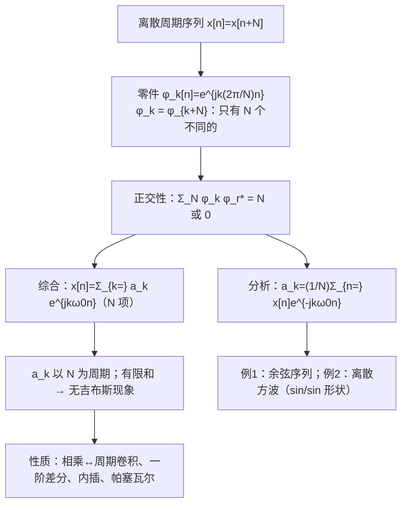

# 3.6–3.7 离散时间傅里叶级数 DTFS 及其性质

> [!abstract] 这一讲的任务
> 把傅里叶级数搬到离散时间：周期为 $N$ 的序列 $x[n]$ 也能拆成复指数之和。
> 和连续时间相比，最大的不同只有一条：**离散复指数 $e^{jk(2\pi/N)n}$ 在 $k$ 上以 $N$ 为周期重复**，所以本质不同的零件只有 $N$ 个。
> 由此引出三个后果：级数是**有限和**（$N$ 项）；系数 $a_k$ 也**以 $N$ 为周期**；**没有收敛问题，没有吉布斯现象**。

> [!info] 授课进度说明
> 本篇依据课件整理，**第三章尚无课堂转写稿**，因此全篇不作「拓展」标注。

---

## 0. 开场：手机上的调音器

手机上的吉他调音 App，麦克风每秒采几万个样本，屏幕上立刻显示“这根弦是 110 Hz，偏低了 2 Hz”。

App 里没有积分：计算机只有**有限个采样点**，只能做**有限次加法和乘法**。连续时间傅里叶级数里的 $\int$ 和 $\sum_{-\infty}^{\infty}$，计算机都做不了。

这一讲的离散傅里叶级数恰好绕开了这两个“无穷”：一个周期只有 $N$ 个样本，系数也只有 $N$ 个，全部是有限和。App 里算频谱用的 DFT/FFT，数学上就是这一讲的公式。

---

## 1. 零件：离散谐波复指数集

周期为 $N$ 的序列：$x[n]=x[n+N]$，基波频率 $\omega_0=\frac{2\pi}N$。

$$\phi_k[n]=e^{jk\omega_0n}=e^{jk(2\pi/N)n},\qquad k=0,\pm1,\pm2,\cdots$$

每个 $\phi_k[n]$ 都以 $N$ 为周期（$N$ 是公共周期 common period）。

> [!question] 停一下，先自己想想
> 连续时间里 $e^{jk\omega_0t}$ 对不同的 $k$ 全都不同，有无穷多个。离散时间里 $\phi_k[n]$ 和 $\phi_{k+N}[n]$ 有什么关系？

$$\phi_{k+N}[n]=e^{jk\omega_0n}\cdot e^{jN\omega_0n}=e^{jk\omega_0n}\cdot e^{j2\pi n}=\phi_k[n]$$

因为 $n$ 是整数，$e^{j2\pi n}=1$。

> [!important] 性质 1：零件以 $N$ 为周期重复
> $$\phi_k[n]=\phi_{k+rN}[n]$$
> $k=0,1,\dots,N-1$ 之外的零件全是重复的。**本质不同的零件只有 $N$ 个。**
> 这是 [[C1.3 指数信号与正弦信号]] 里“离散复指数的频率 $\omega$ 以 $2\pi$ 为周期”的直接结果：$k$ 加 $N$，频率加 $2\pi$，序列不变。

> [!important] 性质 2：正交性 Orthogonality
> $$\sum_{n=\langle N\rangle}\phi_k[n]\phi_r^*[n]=\sum_{n=\langle N\rangle}e^{j(k-r)\omega_0n}=\begin{cases}N,&k=r\ (\text{mod}\ N)\\0,&k\ne r\ (\text{mod}\ N)\end{cases}$$
> $\langle N\rangle$ 表示任意连续 $N$ 个整数。

**证明**：$k=r$ 时每项为 1，共 $N$ 项。$k\ne r$ 时，令 $q=e^{j(k-r)2\pi/N}\ne1$，等比数列求和：$\sum_{n=0}^{N-1}q^n=\frac{1-q^N}{1-q}=\frac{1-e^{j2\pi(k-r)}}{1-q}=0$。

---

## 2. DTFS 公式

### 2.1 推导

综合公式只需 $N$ 项：
$$x[n]=\sum_{k=\langle N\rangle}a_ke^{jk(2\pi/N)n}$$

求 $a_r$：两边乘 $e^{-jr(2\pi/N)n}$，对一个周期的 $n$ 求和，交换求和次序：
$$\sum_{n=\langle N\rangle}x[n]e^{-jr(2\pi/N)n}=\sum_{k=\langle N\rangle}a_k\sum_{n=\langle N\rangle}e^{j(k-r)(2\pi/N)n}=a_r\cdot N$$
由正交性，里面的和只有 $k=r$ 时为 $N$。和 [[C3.2 连续时间傅里叶级数]] 的思路完全一样，只是积分换成了求和。

### 2.2 公式对

> [!important] 离散时间傅里叶级数 DTFS
> $$\text{综合公式：}\quad x[n]=\sum_{k=\langle N\rangle}a_ke^{jk\omega_0n}=\sum_{k=\langle N\rangle}a_ke^{jk(2\pi/N)n}$$
> $$\text{分析公式：}\quad a_k=\frac1N\sum_{n=\langle N\rangle}x[n]e^{-jk\omega_0n}=\frac1N\sum_{n=\langle N\rangle}x[n]e^{-jk(2\pi/N)n}$$
> 记作 $x[n]\xleftrightarrow{\mathcal{FS}}a_k$。

> [!important] 和连续时间的三处不同
> 1. **有限项**（sum of finite items）：综合公式只有 $N$ 项；
> 2. **系数以 $N$ 为周期**：$a_{k+N}=a_k$（分析公式里 $e^{-jk\omega_0n}$ 对 $k$ 以 $N$ 为周期）。所以求和可以取任意连续 $N$ 个 $k$；
> 3. **没有收敛问题**：有限和总是精确等于 $x[n]$，**没有吉布斯现象**（No Gibbs phenomenon）。

实信号的对称性和连续时间一样：$a_k^*=a_{-k}$，即 $|a_k|$ 偶、$\arg a_k$ 奇；$\mathrm{Re}\{a_k\}$ 偶、$\mathrm{Im}\{a_k\}$ 奇。

> [!tip] 与 DFT 的关系
> 取 $n=0\sim N-1$、$k=0\sim N-1$，分析公式乘以 $N$ 就是 DFT：$X[k]=Na_k$。numpy 里 `np.fft.fft(x)/N` 给出的正是 $a_k$（本篇的数值验算都这样做）。

---

## 3. 例 1：余弦序列

> [!example] 课件 Example 1
> 求 $x[n]=\cos\big(\frac\pi8n+\frac\pi3\big)$ 的 DTFS 系数。

**第一步：周期**。$\omega_0=\frac\pi8=\frac{2\pi}{16}$ ⇒ $N=16$。

**第二步：用欧拉公式拆开**（不必套分析公式）：
$$x[n]=\frac12e^{j\pi/3}e^{j\frac{\pi}{8}n}+\frac12e^{-j\pi/3}e^{-j\frac{\pi}{8}n}$$
对照 $\sum a_ke^{jk\frac{2\pi}{16}n}$：

$$a_k=\begin{cases}\frac12e^{j\pi/3},&k=1\\\frac12e^{-j\pi/3},&k=-1\\0,&-8\le k\le7\ \text{的其余}\ k\end{cases}\qquad a_{k+16}=a_k$$

![[C3-DTFS例1幅相谱.png]]

**读图**：
- 幅度谱：$k=\pm1$ 处高 $\frac12$，**每隔 16 重复一次**（$k=\pm15,\pm17,\dots$）；偶对称；
- 相位谱：$k=1+16r$ 处 $+\frac\pi3$，$k=-1+16r$ 处 $-\frac\pi3$；奇对称。

> [!warning] 易错点
> 离散谱是**周期的**，画图时要画出重复。$k=15$ 的谱线不是“新的高频分量”，它就是 $k=-1$。

---

## 4. 例 2：离散周期方波

> [!example] 课件 Example 2
> 周期 $N$ 的方波：一个周期内 $|n|\le N_1$ 时 $x[n]=1$，其余为 0（共 $2N_1+1$ 个 1）。求 $a_k$。

**推导**：取一个周期 $n=-N_1\sim N-N_1-1$，只有 $|n|\le N_1$ 的项非零：
$$a_k=\frac1N\sum_{n=-N_1}^{N_1}e^{-jk\omega_0n}$$
这是首项 $e^{jk\omega_0N_1}$、公比 $e^{-jk\omega_0}$、共 $2N_1+1$ 项的等比数列：
$$a_k=\frac1N\cdot e^{jk\omega_0N_1}\frac{1-e^{-jk\omega_0(2N_1+1)}}{1-e^{-jk\omega_0}}$$
分子、分母各提出半角因子（$e^{-jk\omega_0(2N_1+1)/2}$ 和 $e^{-jk\omega_0/2}$），把“1 − 复指数”凑成正弦：
$$a_k=\frac1N\cdot\frac{e^{-jk\omega_0(2N_1+1)/2}\big(e^{jk\omega_0(2N_1+1)/2}-e^{-jk\omega_0(2N_1+1)/2}\big)}{e^{-jk\omega_0/2}\big(e^{jk\omega_0/2}-e^{-jk\omega_0/2}\big)}\cdot e^{jk\omega_0N_1}$$
相位因子 $e^{jk\omega_0N_1}\cdot e^{-jk\omega_0(2N_1+1)/2}\cdot e^{jk\omega_0/2}=1$，恰好抵消（因为方波关于 $n=0$ 对称，系数是实数）：

> [!important] 离散方波的 DTFS
> $$a_k=\begin{cases}\dfrac1N\cdot\dfrac{\sin\big[2\pi k(N_1+\frac12)/N\big]}{\sin(\pi k/N)},&k\ne0,\pm N,\pm2N,\dots\\[3mm]\dfrac{2N_1+1}{N},&k=0,\pm N,\pm2N,\dots\end{cases}$$

**对比连续方波**：连续是 $\frac{\sin x}{x}$（Sa 函数，逐渐衰减到 0）；离散是 $\frac{\sin(Mx)}{\sin x}$ 型（分母也是正弦，所以**周期重复**）。$k$ 较小时 $\sin\frac{\pi k}N\approx\frac{\pi k}N$，两者形状接近。

![[C3-DTFS方波系数-周期N变化.png]]

**数值验算**（$N_1=2$、$N=10$，python）：$a_0=\frac5{10}=0.5$，$a_1=0.3236$，$a_2=0$，$a_3=-0.1236$，$a_4=0$，$a_5=0.1$ ✓。

**读图**（固定 $N_1=2$，改变 $N$）：
- $N$ 越大（周期越长、脉冲占比越小）：谱线越**密**，高度越**低**（$a_0=\frac{2N_1+1}N$ 变小），包络形状不变；
- 与连续方波一样：$N\to\infty$ 时谱线连成连续谱，通向第 5 章的离散时间傅里叶变换 DTFT。

课件 p.61 还给了 $N=50$、$N_1=4$ 与 $N_1=12$ 的对比：固定 $N$、增大 $N_1$（脉冲变宽）→ 主瓣变窄，**脉冲越宽，频谱越集中**，与连续时间同一规律。

---

## 5. 随堂测（课件 p.62）：由系数反求信号

> [!example] 题目
> 周期 $N=8$ 的序列 $x[n]$，一个周期内的 DTFS 系数如图（左）：$a_0=2$，$a_{\pm1}=1$，$a_{\pm2}=\frac12$，$a_{\pm3}=\frac14$，$a_4=0$，并以 8 为周期重复。求 $x[n]$。

![[C3-随堂测DTFS系数反求信号.png]]

**解**：$\omega_0=\frac{2\pi}8=\frac\pi4$。系数实且偶 ⇒ $x[n]$ 实且偶；成对合并：$a_ke^{jk\omega_0n}+a_{-k}e^{-jk\omega_0n}=2a_k\cos(k\omega_0n)$。
$$x[n]=2+2\cos\Big(\frac{\pi}{4}n\Big)+\cos\Big(\frac{\pi}{2}n\Big)+\frac12\cos\Big(\frac{3\pi}{4}n\Big)$$

一个周期的值（$n=0\sim7$）：
$$x[n]=\{5.5,\ 3.0607,\ 1,\ 0.9393,\ 0.5,\ 0.9393,\ 1,\ 3.0607\}$$

**验算**（python）：对上面 8 个值做 `np.fft.fft(x)/8`，得到 $\{2,1,0.5,0.25,0,0.25,0.5,1\}$，正是题给系数（$k=5,6,7$ 就是 $k=-3,-2,-1$）✓。帕塞瓦尔也对得上：$\frac18\sum x^2=6.625=2^2+2(1+\frac14+\frac1{16})$ ✓。

> [!warning] 易错点
> 1. 只取**一个周期**内的 $N=8$ 个系数（例如 $k=-3\sim4$），不要把 $k=8$ 等重复的谱线再加一遍；
> 2. $a_4$ 如果非零，它**没有配对**（$a_{-4}=a_4$ 是同一个），贡献是 $a_4e^{j\pi n}=a_4(-1)^n$，**不乘 2**。

---

## 6. DTFS 的性质

大多数性质与连续时间一一对应（把积分换成求和，$\frac1T$ 换成 $\frac1N$），课件重点讲了四条有离散特色的。

### 6.1 相乘 ⇔ 系数周期卷积

$$x[n]y[n]\xleftrightarrow{\mathcal{FS}}c_k=\sum_{l=\langle N\rangle}a_lb_{k-l}$$

**证明**：
$$c_k=\frac1N\sum_{n=\langle N\rangle}\Big(\sum_{l=\langle N\rangle}a_le^{jl\omega_0n}\Big)y[n]e^{-jk\omega_0n}=\sum_{l=\langle N\rangle}a_l\cdot\frac1N\sum_{n=\langle N\rangle}y[n]e^{-j(k-l)\omega_0n}=\sum_{l=\langle N\rangle}a_lb_{k-l}$$

> [!note] 和连续时间的差别
> 连续时间是 $\sum_{l=-\infty}^{\infty}$（普通离散卷积）；离散时间 $a_k$、$b_k$ 都以 $N$ 为周期，所以只在一个周期上求和——**周期卷积**。

### 6.2 时移与一阶差分

$$x[n-n_0]\xleftrightarrow{\mathcal{FS}}a_ke^{-jk\omega_0n_0}$$
$$x[n]-x[n-1]\xleftrightarrow{\mathcal{FS}}\big(1-e^{-jk\omega_0}\big)a_k$$

一阶差分是连续时间“微分”的离散对应。因子 $1-e^{-jk\omega_0}$ 在 $k=0$ 为 0（**差分去掉直流**），在 $k=\frac N2$（最高频 $\omega=\pi$）为 2（**差分放大高频**）——和微分乘 $jk\omega_0$ 一样的性格。

### 6.3 尺度变换：内插零 Interpolation

离散时间不能像连续时间那样“压缩 $x[an]$”（会丢样本）。可行的是**内插零**：
$$x_{(m)}[n]=\begin{cases}x[n/m],&n=rm\ (\text{m 的整数倍})\\0,&\text{其他}\end{cases}$$
即在每两个样本之间插入 $m-1$ 个 0。周期从 $N$ **变成 $mN$**。

$$x_{(m)}[n]\xleftrightarrow{\mathcal{FS}}\frac1ma_k\qquad(\text{按周期}\ mN\ \text{的基频}\ \tfrac{2\pi}{mN}\ \text{计})$$

**证明**：$x_{(m)}$ 只在 $n=rm$ 处非零，
$$h_k=\frac{1}{mN}\sum_{n=\langle mN\rangle}x_{(m)}[n]e^{-jk\frac{2\pi}{mN}n}=\frac1{mN}\sum_{r=\langle N\rangle}x[r]e^{-jk\frac{2\pi}{mN}rm}=\frac1m\cdot\frac1N\sum_{r=\langle N\rangle}x[r]e^{-jk\frac{2\pi}Nr}=\frac1ma_k$$

> [!example] 小例子
> $x[n]$ 周期 2：$\{1,2\}$，$a_0=1.5$，$a_1=-0.5$。插零 $m=2$：$\{1,0,2,0\}$，周期 4。
> 按公式 $h_k=\frac12a_k$：$h_0=0.75$，$h_1=-0.25$，$h_2=a_2/2=a_0/2=0.75$，$h_3=-0.25$（$a_k$ 以 2 为周期）。
> python 验算：`np.fft.fft([1,0,2,0])/4` = $\{0.75,-0.25,0.75,-0.25\}$ ✓。
> 注意 $h_k$ 在 $k=0\sim3$ 里把 $a_k$ 的一个周期**重复了 $m=2$ 次**——插零在频域产生“镜像”，这是第 7 章插值要用低通滤波器去掉的东西。

### 6.4 帕塞瓦尔定理

$$\frac1N\sum_{n=\langle N\rangle}|x[n]|^2=\sum_{k=\langle N\rangle}|a_k|^2$$

左边：一个周期内的平均功率；右边：各次谐波的平均功率之和（只有 $N$ 项）。

**证明**：
$$\frac1N\sum_n x[n]x^*[n]=\frac1N\sum_n\Big(\sum_ka_ke^{jk\omega_0n}\Big)x^*[n]=\sum_ka_k\Big[\frac1N\sum_nx[n]e^{-jk\omega_0n}\Big]^*=\sum_ka_ka_k^*$$

### 6.5 性质汇总（教材 Table 3.2）

| 性质 | 时域（周期 $N$） | 系数 |
|---|---|---|
| 线性 | $Ax[n]+By[n]$ | $Aa_k+Bb_k$ |
| 时移 | $x[n-n_0]$ | $a_ke^{-jk\omega_0n_0}$ |
| 频移 | $e^{jM\omega_0n}x[n]$ | $a_{k-M}$ |
| 共轭 | $x^*[n]$ | $a_{-k}^*$ |
| 时间反转 | $x[-n]$ | $a_{-k}$ |
| 内插零 | $x_{(m)}[n]$（周期 $mN$） | $\frac1ma_k$（周期 $mN$ 意义下） |
| 周期卷积 | $\sum_{r=\langle N\rangle}x[r]y[n-r]$ | $Na_kb_k$ |
| 相乘 | $x[n]y[n]$ | $\sum_{l=\langle N\rangle}a_lb_{k-l}$ |
| 一阶差分 | $x[n]-x[n-1]$ | $(1-e^{-jk\omega_0})a_k$ |
| 累加 | $\sum_{m=-\infty}^{n}x[m]$（仅当 $a_0=0$ 时有限且周期） | $\frac{1}{1-e^{-jk\omega_0}}a_k$ |
| 实信号 | $x$ 实 | $a_k=a_{-k}^*$；幅度偶、相位奇 |
| 实偶 / 实奇 | | 实偶 / 纯虚奇 |
| 奇偶分解 | $x_e[n]$ / $x_o[n]$（$x$ 实） | $\mathrm{Re}\{a_k\}$ / $j\,\mathrm{Im}\{a_k\}$ |
| 帕塞瓦尔 | $\frac1N\sum_{\langle N\rangle}\|x[n]\|^2$ | $\sum_{\langle N\rangle}\|a_k\|^2$ |

（课件只讲了相乘、差分、内插、帕塞瓦尔；其余几行来自教材 Table 3.2，推导方法与 [[C3.4 连续时间傅里叶级数的性质]] 相同。）

---

## 这一讲的三句话

1. **离散零件只有 $N$ 个**：$e^{jk(2\pi/N)n}$ 在 $k$ 上以 $N$ 为周期，所以 $x[n]=\sum_{k=\langle N\rangle}a_ke^{jk\omega_0n}$，$a_k=\frac1N\sum_{n=\langle N\rangle}x[n]e^{-jk\omega_0n}$，两边都是 $N$ 项有限和。
2. **系数也以 $N$ 为周期**，谱图要画出重复；有限和精确成立，**没有收敛问题，没有吉布斯现象**。
3. **性质与连续时间基本对应**：相乘 ↔ 系数周期卷积，差分 ↔ 乘 $1-e^{-jk\omega_0}$，内插零 ↔ 系数除以 $m$、周期变 $mN$，帕塞瓦尔照样成立。

> [!tip] 速查表
> | 项目 | 连续时间 CTFS | 离散时间 DTFS |
> |---|---|---|
> | 基频 | $\omega_0=\frac{2\pi}T$ | $\omega_0=\frac{2\pi}N$ |
> | 综合 | $\sum_{k=-\infty}^{\infty}a_ke^{jk\omega_0t}$ | $\sum_{k=\langle N\rangle}a_ke^{jk\omega_0n}$ |
> | 分析 | $\frac1T\int_Tx(t)e^{-jk\omega_0t}dt$ | $\frac1N\sum_{n=\langle N\rangle}x[n]e^{-jk\omega_0n}$ |
> | 系数 | 非周期，一般无穷多 | 以 $N$ 为周期，$N$ 个 |
> | 收敛 | 需要条件，有吉布斯现象 | 有限和，无收敛问题 |
> | 方波 | $\frac{2T_1}{T}\frac{\sin(k\omega_0T_1)}{k\omega_0T_1}$ | $\frac1N\frac{\sin[2\pi k(N_1+1/2)/N]}{\sin(\pi k/N)}$ |
> | 相乘 | $\sum_{l=-\infty}^{\infty}a_lb_{k-l}$ | $\sum_{l=\langle N\rangle}a_lb_{k-l}$ |
> | 微分 / 差分 | $jk\omega_0a_k$ | $(1-e^{-jk\omega_0})a_k$ |
> | 帕塞瓦尔 | $\frac1T\int_T\|x\|^2=\sum\|a_k\|^2$ | $\frac1N\sum_{\langle N\rangle}\|x\|^2=\sum_{\langle N\rangle}\|a_k\|^2$ |

> [!tip] 下一讲预告
> 傅里叶级数终于可以回到第一讲的出发点：**LTI 系统**。输入是 $\sum a_ke^{jk\omega_0t}$，每个分量过系统只乘一个 $H(jk\omega_0)$——输出系数 $b_k=a_kH(jk\omega_0)$。于是“设计一个系统”就变成“设计一条 $H$ 曲线”：让某些频率通过、某些频率被挡住，这就是**滤波**。

---

## 本节自测 Self-Test

> [!question] 1. 为什么 DTFS 只有 $N$ 项，而 CTFS 有无穷多项？

> [!success]- 答案
> 离散复指数 $e^{jk(2\pi/N)n}$ 中 $n$ 是整数，$k$ 加 $N$ 时多出的因子 $e^{j2\pi n}=1$，所以 $\phi_{k+N}=\phi_k$，本质不同的零件只有 $N$ 个。连续时间 $t$ 是实数，$e^{j2\pi t}\ne1$，每个 $k$ 都是不同的零件。

> [!question] 2. 求 $x[n]=\sin\big(\frac{2\pi}{5}n\big)+\cos\big(\frac{4\pi}{5}n\big)$ 的周期和一个周期内的 $a_k$。

> [!success]- 答案
> $\omega_0=\frac{2\pi}5$，$N=5$。
> $\sin(\omega_0n)=\frac1{2j}e^{j\omega_0n}-\frac1{2j}e^{-j\omega_0n}$ ⇒ $a_1=-\frac j2$，$a_{-1}=\frac j2$；
> $\cos(2\omega_0n)$ ⇒ $a_2=a_{-2}=\frac12$。
> 取 $k=-2\sim2$：$a_0=0$，$a_{\pm1}=\mp\frac j2$，$a_{\pm2}=\frac12$；其余由 $a_{k+5}=a_k$ 得到（如 $a_3=a_{-2}=\frac12$，$a_4=a_{-1}=\frac j2$）。

> [!question] 3. 离散方波 $N=10$、$N_1=2$，$a_2$ 为什么是 0？$a_5$ 是多少？

> [!success]- 答案
> 分子 $\sin[2\pi k(N_1+\frac12)/N]=\sin(\frac{\pi k}{2})$。$k=2$ 时 $\sin\pi=0$，分母 $\sin\frac{2\pi}{10}\ne0$，所以 $a_2=0$。
> $k=5$：$a_5=\frac1{10}\cdot\frac{\sin(5\pi/2)}{\sin(\pi/2)}=0.1$。

> [!question] 4. 为什么 DTFS 没有吉布斯现象？

> [!success]- 答案
> 吉布斯现象来自“用有限项截断一个无穷级数”。DTFS 本身就是 $N$ 项有限和，取满一个周期的 $N$ 项时**精确等于** $x[n]$，不存在截断，也就没有收敛问题。（如果人为只取其中一部分 $k$，那是另一回事，同样会出现振铃。）

> [!question] 5. 周期 $N$ 的序列 $x[n]\leftrightarrow a_k$，求 $y[n]=x[n]-x[n-1]$ 的直流分量 $b_0$，并解释。

> [!success]- 答案
> $b_0=(1-e^{0})a_0=0$。差分只保留“变化量”，一个周期内的变化量总和为 0（周期信号回到原值），所以平均值为 0。

> [!question] 6. 随堂测：如果把题中 $a_4$ 改为 1（其余不变），$x[n]$ 变成什么？

> [!success]- 答案
> $a_4$ 没有配对（$k=4$ 与 $k=-4$ 是同一个），贡献 $a_4e^{j\pi n}=(-1)^n$，不乘 2：
> $x[n]=2+2\cos\frac{\pi n}4+\cos\frac{\pi n}2+\frac12\cos\frac{3\pi n}4+(-1)^n$。

---

## 相关笔记 Related Notes

- [[信号与系统 MOC]]
- 上一节：[[C3.4 连续时间傅里叶级数的性质]]
- 下一节：[[C3.6 傅里叶级数与LTI系统、滤波]]
- 相关：[[C1.3 指数信号与正弦信号]]（离散复指数的周期性）、[[C3.2 连续时间傅里叶级数]]（连续版的推导）、[[C2.1 离散时间LTI系统与卷积和]]（离散卷积）
