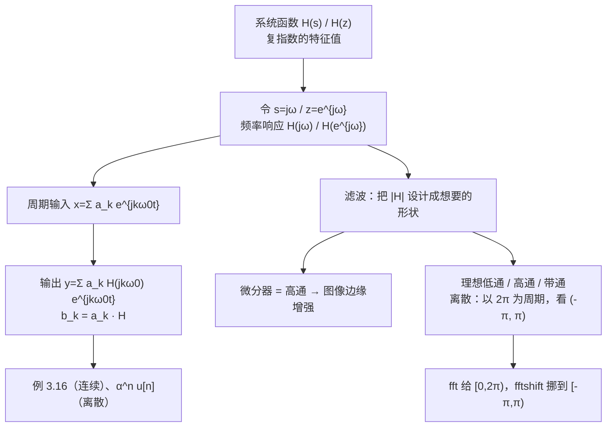

# 3.8–3.9 傅里叶级数与 LTI 系统、滤波

> [!abstract] 这一讲的任务
> 第三章的闭环：[[C3.1 复指数是LTI系统的特征函数]] 说复指数过 LTI 系统只乘一个复数；[[C3.2 连续时间傅里叶级数]] 到 [[C3.5 离散时间傅里叶级数DTFS及性质]] 说周期信号可以拆成复指数之和。两者合起来：
> $$\text{输出系数}=\text{输入系数}\times\text{频率响应在该频率的值}$$
> **卷积变成了乘法。** 再往前一步，“设计系统”就变成“设计频率响应曲线”——哪些频率放行、哪些频率挡住，这就是**滤波**。

> [!info] 授课进度说明
> 本篇依据课件整理，**第三章尚无课堂转写稿**，因此全篇不作「拓展」标注。

---

## 0. 开场：修图 App 的两个滑块

修图 App 里常有两个滑块：
- **锐化**：拖一下，头发丝、睫毛、文字边缘立刻清晰起来，但噪点也跟着变明显；
- **磨皮 / 柔化**：拖一下，皮肤上的细纹和斑点消失，但整张图也略微变糊。

两个滑块做的是相反的事：锐化**放大高频**（边缘、细节、噪点都是亮度的快速变化），磨皮**压低高频**、只留下低频（大块的平缓明暗）。

它们都是 LTI 系统（对图像做卷积）。按这一讲的观点，每个滑块背后只是一条**频率响应曲线** $|H|$：锐化是一条往高频翘起的曲线（高通），磨皮是一条往高频压下去的曲线（低通）。

---

## 1. 系统函数与频率响应

### 1.1 系统函数（回顾）

> [!important] 系统函数 System function
> $$\text{连续：}\ e^{st}\to\boxed{h(t)}\to H(s)e^{st},\qquad H(s)=\int_{-\infty}^{\infty}h(\tau)e^{-s\tau}d\tau\quad(\text{拉普拉斯变换})$$
> $$\text{离散：}\ z^n\to\boxed{h[n]}\to H(z)z^n,\qquad H(z)=\sum_{k=-\infty}^{\infty}h[k]z^{-k}\quad(\text{z 变换})$$

推导见 [[C3.1 复指数是LTI系统的特征函数]]。

### 1.2 频率响应

傅里叶分析只用到**纯虚的** $s$、**单位圆上的** $z$：

> [!important] 频率响应 Frequency response
> $$\text{连续（}s=j\omega\text{）：}\quad H(j\omega)=\int_{-\infty}^{\infty}h(t)e^{-j\omega t}dt$$
> $$\text{离散（}z=e^{j\omega}\text{）：}\quad H(e^{j\omega})=\sum_{n=-\infty}^{\infty}h[n]e^{-j\omega n}$$
> $H$ 是复数：$|H|$ 叫**幅频响应**（这个频率被放大 / 衰减多少倍），$\angle H$ 叫**相频响应**（这个频率被延迟多少相位）。

> [!note] 离散频率响应以 $2\pi$ 为周期
> $e^{j(\omega+2\pi)n}=e^{j\omega n}$，所以 $H(e^{j(\omega+2\pi)})=H(e^{j\omega})$。只需看 $(-\pi,\pi]$ 一段。这一点在第 4 节的离散滤波器里很关键。

---

## 2. 周期信号通过 LTI 系统

> [!question] 停一下，先自己想想
> 输入是 $x(t)=\sum_ka_ke^{jk\omega_0t}$。已知每个 $e^{jk\omega_0t}$ 过系统变成 $H(jk\omega_0)e^{jk\omega_0t}$，输出是什么？需要用到系统的哪条性质？

由**线性**（叠加），各分量分别过系统再加起来：

> [!important] 系统响应 System response
> $$\text{连续：}\ x(t)=\sum_ka_ke^{jk\omega_0t}\ \Longrightarrow\ y(t)=\sum_ka_kH(jk\omega_0)e^{jk\omega_0t}$$
> $$\text{离散：}\ x[n]=\sum_{k=\langle N\rangle}a_ke^{jk\frac{2\pi}Nn}\ \Longrightarrow\ y[n]=\sum_{k=\langle N\rangle}a_kH\big(e^{jk\frac{2\pi}N}\big)e^{jk\frac{2\pi}Nn}$$
> 即输出仍是**同周期**的周期信号，系数
> $$b_k=a_k\cdot H(jk\omega_0)\qquad\text{或}\qquad b_k=a_k\cdot H\big(e^{jk2\pi/N}\big)$$

读法：
- **频率不变**：输入有哪些谐波，输出就只有这些谐波，LTI 系统不会“创造”新频率（非线性系统才会，比如 [[C3.4 连续时间傅里叶级数的性质]] 里的相乘产生和频差频）；
- 每个谐波的**幅度乘 $|H|$，相位加 $\angle H$**；
- 若某个 $H(jk\omega_0)=0$，第 $k$ 次谐波就被完全滤掉。

### 例 3.16（连续）

> [!example] 课件 Example 3.16
> $h(t)=e^{-t}u(t)$，输入 $x(t)=\sum_{k=-3}^{3}a_ke^{jk2\pi t}$（$\omega_0=2\pi$），其中 $a_0=1$，$a_{\pm1}=\frac14$，$a_{\pm2}=\frac12$，$a_{\pm3}=\frac13$。求输出的傅里叶系数。

**第一步：频率响应**
$$H(j\omega)=\int_0^{\infty}e^{-t}e^{-j\omega t}dt=\frac{1}{1+j\omega}$$

**第二步：逐项相乘** $b_k=a_kH(jk2\pi)=\dfrac{a_k}{1+j2\pi k}$：

| $k$ | $a_k$ | $H(jk2\pi)$ | $b_k$ | $\|b_k\|$ |
|---|---|---|---|---|
| 0 | 1 | 1 | 1 | 1 |
| $\pm1$ | $\frac14$ | $\frac1{1\pm j2\pi}$ | $\frac14\cdot\frac1{1\pm j2\pi}$ | 0.0393 |
| $\pm2$ | $\frac12$ | $\frac1{1\pm j4\pi}$ | $\frac12\cdot\frac1{1\pm j4\pi}$ | 0.0397 |
| $\pm3$ | $\frac13$ | $\frac1{1\pm j6\pi}$ | $\frac13\cdot\frac1{1\pm j6\pi}$ | 0.0177 |

$$y(t)=\sum_{k=-3}^{3}b_ke^{jk2\pi t}$$

**读结果**：$|H(j\omega)|=\frac1{\sqrt{1+\omega^2}}$ 随频率下降，是个**低通**系统（它就是 RC 电路，见 [[C1.5 连续时间与离散时间系统]]）。直流原样通过，$k=1,2,3$ 次谐波分别被衰减到约 $\frac1{6.4}$、$\frac1{12.6}$、$\frac1{18.9}$。

（$|b_k|$ 一列为 python 验算值；课件只写了 $b_k$ 的表达式。）

### 例（离散）：$h[n]=\alpha^nu[n]$

> [!example] 课件 Example
> 离散 LTI 系统 $h[n]=\alpha^nu[n]$，$-1<\alpha<1$，输入 $x[n]=\cos\big(\frac{2\pi}Nn\big)$，求 $y[n]$。

**第一步：输入系数**。$x[n]=\frac12e^{j\frac{2\pi}Nn}+\frac12e^{-j\frac{2\pi}Nn}$ ⇒ $a_1=a_{-1}=\frac12$。

**第二步：频率响应**（等比级数，$|\alpha|<1$ 收敛）
$$H(e^{j\omega})=\sum_{n=0}^{\infty}\alpha^ne^{-j\omega n}=\frac{1}{1-\alpha e^{-j\omega}}$$

**第三步：相乘**
$$b_1=\frac12\cdot\frac{1}{1-\alpha e^{-j2\pi/N}},\qquad b_{-1}=\frac12\cdot\frac{1}{1-\alpha e^{j2\pi/N}}$$
$$y[n]=b_1e^{j\frac{2\pi}Nn}+b_{-1}e^{-j\frac{2\pi}Nn}$$

**化成实数形式**：$b_{-1}=b_1^*$，记 $H(e^{j2\pi/N})=re^{j\theta}$，则
$$y[n]=r\cos\Big(\frac{2\pi}{N}n+\theta\Big),\qquad r=\frac{1}{|1-\alpha e^{-j2\pi/N}|},\ \theta=-\arg\big(1-\alpha e^{-j2\pi/N}\big)$$

> [!tip] 通用捷径
> 实系统（$h$ 为实数）输入 $\cos(\omega_1n+\phi)$，输出就是 $|H(e^{j\omega_1})|\cos\big(\omega_1n+\phi+\angle H(e^{j\omega_1})\big)$。**正弦进、正弦出，只改幅度和相位**。$\sin$ 同理。做题时直接用，不必每次拆成两个复指数。

---

## 3. 滤波 Filtering

**滤波**：改变信号中各频率分量的相对大小，或者去掉某些频率分量。LTI 系统天然就是滤波器——$b_k=a_kH$，$|H|$ 的形状决定了谁被放大、谁被压低。

### 3.1 例：微分器 = 高通滤波器 → 图像边缘增强

$$y(t)=\frac{dx(t)}{dt}$$

**频率响应**：输入 $e^{j\omega t}$，输出 $j\omega e^{j\omega t}$，所以
$$H(j\omega)=j\omega,\qquad|H(j\omega)|=|\omega|$$

也可以从冲激响应算：微分器的 $h(t)=\delta'(t)$（见 [[C2.7 奇异函数]]），
$$H(j\omega)=\int\delta'(t)e^{-j\omega t}dt$$
利用 $x(t)\delta'(t)=x(0)\delta'(t)-x'(0)\delta(t)$ 与 $\int\delta'(t)dt=0$：取 $x(t)=e^{-j\omega t}$，$x(0)=1$，$x'(0)=-j\omega$，积分只剩 $-x'(0)=j\omega$ ✓。

> [!important] 读法
> $|H|=|\omega|$：直流被完全挡掉，频率越高放大越多——**高通滤波器** high-pass filter。
> 图像中的**边缘**是亮度的突变，富含高频；大块平坦区域是低频。微分器压低平坦区、放大边缘，于是得到“只剩轮廓”的图。

![[C3-微分滤波器-图像边缘增强.png]]

（图为课件 p.72 原图：(a) 两幅原始图像；(b) 经微分滤波器处理后的结果。）

开场里的“锐化”就是：原图 + 一点点高通结果 = 边缘被加强的图。副作用也来自同一条 $|H|=|\omega|$：噪点也是高频，同样被放大。

### 3.2 频率选择性滤波器：三种理想滤波器

**频率选择性滤波器** frequency-selective filters：让某一段频率**原样通过**（$|H|=1$，通带），把其余频率**完全挡住**（$|H|=0$，阻带）。

![[C3-三类理想滤波器-连续与离散.png]]

**连续时间**（上排）：
- **低通** lowpass：$|\omega|<\omega_c$ 通过；
- **高通** highpass：$|\omega|>\omega_c$ 通过；
- **带通** bandpass：$\omega_{c1}<|\omega|<\omega_{c2}$ 通过。

注意都是**关于 $\omega=0$ 对称**的（实滤波器 $|H|$ 为偶函数，正负频率成对处理）。

**离散时间**（下排）：
离散频率响应以 $2\pi$ 为周期，所以理想滤波器的图样**每隔 $2\pi$ 重复**。只看一个周期 $(-\pi,\pi)$：
- **低通**：$\omega$ 靠近 0（以及 $2\pi$ 的整数倍）处通过；
- **高通**：$\omega$ 靠近 $\pm\pi$（以及 $\pi$ 的奇数倍）处通过；
- **带通**：中间一段通过。

> [!important] 离散时间的“高频”在哪里
> 离散时间里**最高频率是 $\omega=\pi$**，不是 $\infty$。$e^{j\pi n}=(-1)^n$，每个样本都翻号，是变化最快的序列。$\omega=2\pi$ 反而和 $\omega=0$ 一样慢（就是常数）。
> 从 DTFS 看也是一样：$a_k=a_{k+N}$，$k$ 和 $k+N$ 是同一个分量；在一个周期里取 $k\in\big[-\frac N2,\frac N2\big]$，即 $\omega=k\omega_0\in(-\pi,\pi]$，靠近 0 的是低频，靠近 $\pm\frac N2$（$\pm\pi$）的是高频。

### 3.3 fft 与 fftshift

课件最后提醒了一个工程细节：用计算机（numpy / MATLAB）算频谱时，`fft` 给出的 $N$ 个点对应 $\omega\in[0,2\pi)$，即 $k=0,1,\dots,N-1$；`fftshift` 把后半段挪到前面，变成 $\omega\in[-\pi,\pi)$，即 $k=-\frac N2,\dots,\frac N2-1$。

![[C3-fft与fftshift.png]]

图中信号是 $\cos(2\pi\cdot40t)+0.25\cos(2\pi\cdot15t)$，采样率 100 Hz、1000 点。`fft` 的结果（上）在 60 Hz、85 Hz 处也有峰——它们就是 $-40$ Hz 和 $-15$ Hz 的“周期重复”；`fftshift` 后（下）正负频率对称排列，才是我们习惯的双边谱。

> [!tip] 实用建议
> 画频谱先 `fftshift`（频率轴配 `np.fft.fftshift(np.fft.fftfreq(N, 1/fs))`），否则会把负频率误读成高频。设计离散滤波器时，也是在 $(-\pi,\pi)$ 上想“低频在中间、高频在两边”。

---

## 4. 随堂测

### 随堂测 1（课件 p.76）

> [!example] 题目
> 已知：(1) $x[n]$ 实且偶；(2) 周期 $N=10$，系数 $a_k$；(3) $a_{11}=5$；(4) $\frac1{10}\sum_{n=0}^{9}|x[n]|^2=50$。证明 $x[n]=A\cos(Bn+C)$，并给出 $A$、$B$、$C$。

**解**：
1. 系数以 10 为周期：$a_1=a_{11}=5$；
2. 实且偶 ⇒ $a_k$ 实且偶：$a_{-1}=a_1=5$；
3. 帕塞瓦尔：$\sum_{k=\langle10\rangle}|a_k|^2=50$。而 $|a_1|^2+|a_{-1}|^2=25+25=50$ 已经用完，**其余 $a_k$ 全为 0**；
4. 合成：
$$x[n]=5e^{j\frac{2\pi}{10}n}+5e^{-j\frac{2\pi}{10}n}=10\cos\Big(\frac{\pi}{5}n\Big)$$

$$A=10,\quad B=\frac\pi5,\quad C=0$$

（$B$ 也可取 $-\frac\pi5$、或加 $2\pi$ 的整数倍，都是同一个序列；标准答案取 $\frac\pi5$。）

### 随堂测 2（课件 p.77）

> [!example] 题目
> 因果离散 LTI 系统：$y[n]-\frac14y[n-1]=x[n]$。求下列输入对应输出的傅里叶级数表示：
> (a) $x[n]=\sin\big(\frac{3\pi}4n\big)$；(b) $x[n]=\cos\big(\frac\pi4n\big)+2\cos\big(\frac\pi2n\big)$。

**频率响应**：代入 $x[n]=e^{j\omega n}$、$y[n]=H(e^{j\omega})e^{j\omega n}$：
$$H(e^{j\omega})\big(1-\tfrac14e^{-j\omega}\big)=1\ \Rightarrow\ H(e^{j\omega})=\frac{1}{1-\frac14e^{-j\omega}}$$
（等价地，$h[n]=\big(\frac14\big)^nu[n]$，就是上一节 $\alpha=\frac14$ 的例子。）

**(a)** 周期 $N=8$，$\omega_0=\frac\pi4$，$\frac{3\pi}4=3\omega_0$。
输入：$a_3=\frac1{2j}$，$a_{-3}=-\frac1{2j}$，其余为 0。
输出：$b_3=\frac1{2j}H(e^{j3\pi/4})$，$b_{-3}=-\frac1{2j}H(e^{-j3\pi/4})$，其余为 0。

数值：$H(e^{j3\pi/4})=\dfrac{1}{1-\frac14e^{-j3\pi/4}}=\dfrac{1}{1.1768+0.1768j}$，$|H|=0.8403$，$\angle H=-0.1491$ rad。于是
$$y[n]=0.8403\sin\Big(\frac{3\pi}4n-0.1491\Big)$$

**(b)** 周期 $N=8$，$\omega_0=\frac\pi4$。
输入：$a_{\pm1}=\frac12$，$a_{\pm2}=1$。
输出：$b_{\pm1}=\frac12H(e^{\pm j\pi/4})$，$b_{\pm2}=H(e^{\pm j\pi/2})$。

数值：
- $H(e^{j\pi/4})=1.1612-0.2494j$，$|H|=1.1877$，$\angle H=-0.2115$ rad；
- $H(e^{j\pi/2})=\dfrac{1}{1+\frac j4}=\dfrac{16-4j}{17}$，$|H|=0.9701$，$\angle H=-0.2450$ rad。

$$y[n]=1.1877\cos\Big(\frac\pi4n-0.2115\Big)+1.9403\cos\Big(\frac\pi2n-0.2450\Big)$$

**验算**（python）：直接用差分方程递推 $y[n]=\frac14y[n-1]+x[n]$ 足够多步（暂态 $(\frac14)^n$ 衰减完）后，与上面两式逐点吻合 ✓。

**读结果**：$|H|$ 在 $\omega=0$ 处为 $\frac1{1-1/4}=\frac43$，在 $\omega=\pi$ 处为 $\frac1{1+1/4}=\frac45$，随频率单调下降——这是一个**低通**系统。所以 $\frac\pi4$ 分量被放大（1.19 倍），$\frac\pi2$ 略衰减（0.97 倍），$\frac{3\pi}4$ 衰减更多（0.84 倍）。

---

## 这一讲的三句话

1. **周期信号过 LTI 系统：$b_k=a_k\cdot H(jk\omega_0)$**（离散 $b_k=a_k\cdot H(e^{jk2\pi/N})$）。频率不变，每个谐波的幅度乘 $|H|$、相位加 $\angle H$——卷积变成了乘法。
2. **频率响应 $H(j\omega)$ / $H(e^{j\omega})$ 就是系统的“频率档案”**，可由 $h$ 积分 / 求和得到，也可由微分 / 差分方程代入复指数直接得到。
3. **滤波就是设计 $|H|$ 的形状**：微分器 $|H|=|\omega|$ 是高通（边缘增强）；理想低通 / 高通 / 带通；离散时间最高频是 $\pi$，频率响应以 $2\pi$ 为周期。

> [!tip] 速查表
> | 项目 | 连续时间 | 离散时间 |
> |---|---|---|
> | 系统函数 | $H(s)=\int h(\tau)e^{-s\tau}d\tau$ | $H(z)=\sum h[k]z^{-k}$ |
> | 频率响应 | $H(j\omega)=\int h(t)e^{-j\omega t}dt$ | $H(e^{j\omega})=\sum h[n]e^{-j\omega n}$（周期 $2\pi$） |
> | 周期输入的输出 | $b_k=a_kH(jk\omega_0)$ | $b_k=a_kH(e^{jk2\pi/N})$ |
> | 正弦输入 | $\cos(\omega_1t)\to\|H\|\cos(\omega_1t+\angle H)$ | 同左 |
> | 常用 $H$ | $e^{-at}u(t)\to\frac1{a+j\omega}$；微分器 $j\omega$ | $\alpha^nu[n]\to\frac1{1-\alpha e^{-j\omega}}$ |
> | 由方程求 $H$ | 代 $x=e^{j\omega t}$，$y=He^{j\omega t}$ | 代 $x=e^{j\omega n}$，$y=He^{j\omega n}$ |
> | 最高频率 | $\omega\to\infty$ | $\omega=\pi$ |
> | 计算机频谱 | — | `fft`：$[0,2\pi)$；`fftshift`：$[-\pi,\pi)$ |

> [!tip] 下一章预告
> 第三章只处理了**周期**信号。可现实中的大多数信号——一段语音、一次敲击、一个脉冲——都不是周期的。[[C3.2 连续时间傅里叶级数]] 里已经看到：周期 $T\to\infty$ 时，谱线越来越密，最终连成连续的曲线。第四章把这个极限做出来，得到**连续时间傅里叶变换** $X(j\omega)$，本讲的 $H(j\omega)$ 正是 $h(t)$ 的傅里叶变换。

---

## 本节自测 Self-Test

> [!question] 1. 为什么 LTI 系统的输出不会出现输入中没有的频率？

> [!success]- 答案
> 每个复指数 $e^{jk\omega_0t}$ 是 LTI 系统的特征函数，过系统后仍是同频率的 $e^{jk\omega_0t}$，只乘一个复数 $H(jk\omega_0)$。由线性叠加，输出只包含输入已有的频率。产生新频率需要非线性（如两个信号相乘产生和频、差频）。

> [!question] 2. $h(t)=e^{-2t}u(t)$，输入 $x(t)=\cos(2t)$，求 $y(t)$。

> [!success]- 答案
> $H(j\omega)=\frac1{2+j\omega}$，$H(j2)=\frac1{2+2j}$，$|H|=\frac1{2\sqrt2}\approx0.354$，$\angle H=-\frac\pi4$。
> $y(t)=\frac1{2\sqrt2}\cos\big(2t-\frac\pi4\big)$。

> [!question] 3. 系统 $y[n]=\frac12(x[n]+x[n-1])$（两点平均）是低通还是高通？求 $H(e^{j\omega})$，并说明 $x[n]=(-1)^n$ 的输出。

> [!success]- 答案
> $H(e^{j\omega})=\frac12(1+e^{-j\omega})=e^{-j\omega/2}\cos\frac\omega2$，$|H|=|\cos\frac\omega2|$：$\omega=0$ 为 1，$\omega=\pi$ 为 0，是**低通**。
> $(-1)^n=e^{j\pi n}$ 是最高频，$H(e^{j\pi})=0$，输出为 0。直接验证：$\frac12((-1)^n+(-1)^{n-1})=0$ ✓。

> [!question] 4. 离散时间中，为什么说 $\omega=2\pi$ 是低频？

> [!success]- 答案
> $e^{j2\pi n}=1$ 对所有整数 $n$ 成立，就是常数（直流）。离散频率以 $2\pi$ 为周期，$\omega=2\pi$ 与 $\omega=0$ 是同一个频率；变化最快的是 $\omega=\pi$，即 $(-1)^n$。

> [!question] 5. 用 numpy 对采样率 100 Hz 的信号做 `fft`，在 70 Hz 处看到一个峰。这个信号真的有 70 Hz 成分吗？

> [!success]- 答案
> 不一定。`fft` 的输出覆盖 $[0,f_s)=[0,100)$ Hz，后半段 $(50,100)$ Hz 对应负频率 $(-50,0)$ Hz。70 Hz 处的峰就是 $-30$ Hz；实信号必然在 $+30$ Hz 也有一个等高的峰。用 `fftshift` 画成 $[-50,50)$ Hz 就一目了然。

> [!question] 6. 随堂测 p.76 中，如果条件 (4) 改成 $\frac1{10}\sum|x[n]|^2=60$，还能确定 $x[n]$ 是单个余弦吗？

> [!success]- 答案
> 不能。$|a_1|^2+|a_{-1}|^2=50$，剩下 10 的功率要分给其他系数，而其他条件没有限制它们放在哪里（例如 $a_0=\sqrt{10}$，或 $a_{\pm2}=\sqrt5$ 等），所以 $x[n]$ 不唯一，也不再是单个余弦。

---

## 相关笔记 Related Notes

- [[信号与系统 MOC]]
- 上一节：[[C3.5 离散时间傅里叶级数DTFS及性质]]
- 本章开头：[[C3.1 复指数是LTI系统的特征函数]]
- 相关：[[C2.7 奇异函数]]（$\delta'(t)$ 的性质）、[[C2.5 差分方程与离散时间系统求解]]（差分方程）、[[C1.5 连续时间与离散时间系统]]（RC 电路）、[[C3.3 傅里叶级数的收敛与吉布斯现象]]（理想低通截断与振铃）
