# L01 绪论 Introduction

> [!abstract] 本讲导航
> 第一讲是**课程说明 + 思想导引**，没有严格的数学推导，但埋下了整门课的主线：
> **同一个信号，可以在不同的"域（domain）"里被观察；换一个域，问题可能瞬间变简单。**
> 全课就是围绕 **时域（time domain）→ 频域（frequency domain）→ 复频域（complex frequency domain）** 这条主线展开的。
> [!info] 标注说明
> 标有 **（拓展）** 或 **【拓展】** 的内容，是**课堂上没有讲到、由课件和教材延伸补充**的部分。
> 复习时可先掌握未标注的主干内容，行有余力再看拓展部分。

---

## 1. 课程信息 Course Information

| 项目 Item | 内容 Content |
|---|---|
| 课程名 Course | Signals and Systems 信号与系统（全英授课） |
| 开课单位 School | 未来技术学院 School of Future Technology |
| 授课教师 Instructor | 杨俊美 Yang Junmei，华南理工大学 电子与信息学院 **副教授 (Associate Professor)** |
| Email | yjunmei@scut.edu.cn |
| Tel | 13600497910 |
| 课程网站 Course site | https://ecourse.scut.edu.cn/web/gt/1/index.html?id=64312 |
| 课程 QQ 群 | 信号与系统-25 人工智能，群号 **1108991618** |
| **入群验证问题** | 「What's the name of your teacher?」→ **答案填授课教师姓名（杨俊美）** |

### 1.1 答疑与资料分发

课程有两条沟通渠道，地位并不对等：

| 渠道 | 特点 |
|---|---|
| **QQ 群（首选）** | 更方便、更及时；可群内提问，也可私聊 |
| 课程网站 | 点对点，回复没有那么及时 |

学习资料（PPT 的 PDF 版、实验教材电子版等）两条渠道都会发布。
提问可用 Email、QQ、电话三种方式。

> [!warning] 签到规则（直接影响 30 % 平时分）
> - **每节课开始**放二维码扫码签到 (attendance)。
> - **第一节课与第二节课的课间会再开放一次补签**。
> - 扫码签到与加 QQ 群是**两个不同的二维码**。

---

## 2. 教材与参考书 Textbooks and Main References

### 2.1 买书优先级

| 优先级 | 书 | 理由 |
|---|---|---|
| **① 必备** | **《信号与系统辅导与题解》**（配套奥本海姆，中文） | 教材每章末有 **100 多道题**，这本书**收录了全部习题答案** |
| **② 建议有** | **Oppenheim《Signals and Systems》主教材** | **英文版很厚，中文版页数少得多**，建议用中文版；学校统一采购未到可等，也可买**二手 / 旧书** |
| **③ 不用买** | 《信号与系统仿真教程及实验指导》（清华版，实验用） | 会发**电子版** |
| **④ 不重要** | 其余 Main References | 备查即可 |

### 2.2 主教材 Textbook for lecture

> [!note] 主教材
> **《Signals and Systems》(Second Edition)**
> Authors: **Alan V. Oppenheimer（奥本海姆）, Alan S. Willsky, S. Hamid Nawab**
> 中译/影印：《信号与系统》（第二版）（英文版），国外电子与通信教材系列，电子工业出版社

### 2.3 辅导书 Study Guide（必备）

| 书名 | 作者 / 译者 | 出版社 | ISBN |
|---|---|---|---|
| 《信号与系统辅导与题解》（第二版） | 奥本海姆 著；**宋琪、陆三兰 译** | 华中科技大学出版社 | 9787560979595 |

### 2.4 实验教材（发电子版，不用买）

| 书名 | 作者 | 出版社 | ISBN |
|---|---|---|---|
| 《信号与系统仿真教程及实验指导》 | **安成锦、王雪莹、吴京** 编著 | 清华大学出版社 | 9787302612124 |

属于"面向新工科的电工电子信息基础课程系列教材"，重点是 **MATLAB 仿真**。
它对应的是课程的另一半：本课由 **theory class（理论课）+ experiment（计算机实验）** 两部分组成。

### 2.5 其他参考书 Main References

1. **Xu Kejun（徐科军）, et al.**; *Signal Analysis and Processing*（信号分析与处理）, 3rd ed., Tsinghua University Press（清华大学出版社）, **2022**.
2. **Oppenheim, A. V.; Schafer, R. W.**; *Discrete-Time Signal Processing*（离散时间信号处理）, 3rd ed., 黄建国 译, Publishing House of Electronics Industry（电子工业出版社）, **2015**.
3. **Haykin, S.; Van Veen, B.**; *Signals and Systems*, 2nd ed., 林秩盛（Lin Zhisheng）译, Publishing House of Electronics Industry（电子工业出版社）, **2013**.

---

## 3. 考核方式 Evaluation Method

课程包含多种教学活动：**lectures（讲授）、exercises（习题）、computer experiments（计算机实验）、quizzes（小测）、final examination（期末考试）**。

> [!important] 成绩构成与执行细节
> | 项目 | 权重 | 执行方式 |
> |---|---|---|
> | **Final Exam 期末考试** | **60 %** | **闭卷 (closed book)** |
> | **Attendance + Exercises 考勤与作业** | **30 %** | 考勤：每节课开始扫码；作业：**每讲完一章布置一次，约 10 次线上作业** |
> | **Mid-term Exam 期中考试** | **10 %** | **讲完第 5 章之后**举行，占用 **1 节课、45 分钟**，**只有单选题** |
>
> 全书共 **11 章**，本课**主讲前 10 章**，所以作业约 10 次。

> [!warning] 两个容易吃亏的地方
> - 平时分 30 % 里**考勤与作业是绑在一起计分的**，缺勤直接掉分。
> - 期中只占 10 %，但它是**讲完第 5 章（傅里叶部分结束）时的一次全面检验**，是期末的风向标。

### 3.1 这门课难在哪

**难点来源**：需要**高等数学基础**——微积分、积分运算。
**课程定位**：第一门专业（基础）课，概念密度和数学要求都明显高于此前的课程。

---

## 4. 课程内容框架 Course Contents

课程 10 章按**分析域（domain）**划分为四大板块：

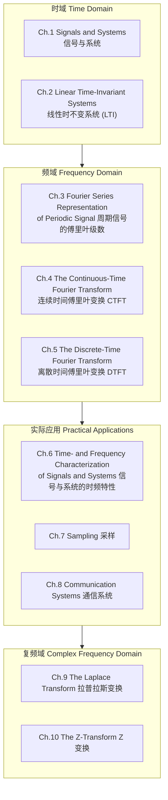

| 板块 Block | 章节 | 核心内容 | 难度定位 |
|---|---|---|---|
| **Time Domain 时域** | Ch.1–2 | 信号的基本描述、系统性质、**卷积 (convolution)** 与 LTI 系统 | 相对容易 |
| **Frequency Domain 频域** | Ch.3–5 | 傅里叶级数 (FS)、连续时间傅里叶变换 (CTFT)、离散时间傅里叶变换 (DTFT) | 本课核心工具 |
| **Practical Applications 实际应用** | Ch.6–8 | 时频特性刻画、**采样定理 (Sampling Theorem)**、调制与通信系统 | 傅里叶工具的落地 |
| **Complex Frequency Domain 复频域** | Ch.9–10 | **Laplace 变换**（连续）、**Z 变换**（离散） | 名字吓人，实为傅里叶的推广 |

### 4.1 全课其实只学两件事

整门课可以压缩成两条主线：

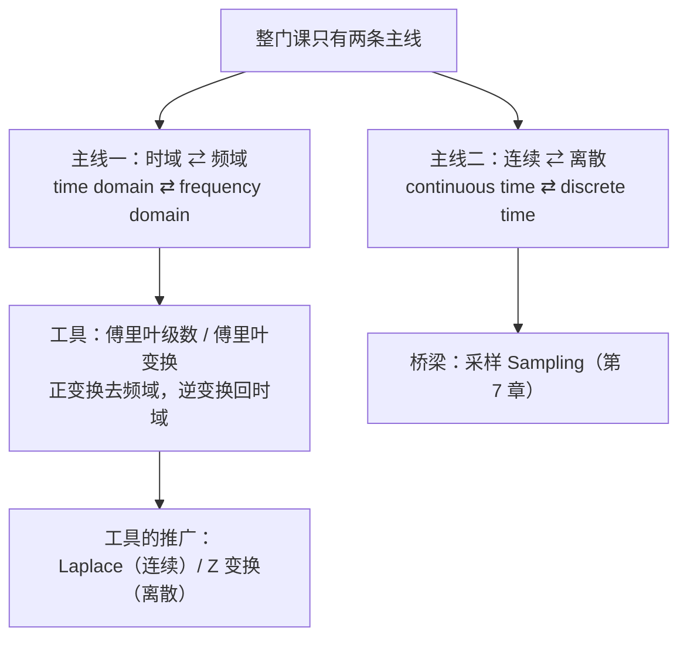

- **主线一**：在时域与频域之间来回切换，工具是**傅里叶**——它的作用像**一座桥 (a bridge)**。
- **主线二**：所有内容都分**连续时间**与**离散时间**两条平行线索来讲。

> [!important] 每一章其实都被"切成两半"（CT / DT）
> 这是课程目录看不出来、但**贯穿全书的组织方式**：
>
> | 章 | 连续时间 CT | 离散时间 DT |
> |---|---|---|
> | Ch.3 傅里叶级数 | **CTFS** | **DTFS** |
> | Ch.4 / Ch.5 傅里叶变换 | **CTFT**（第 4 章） | **DTFT**（第 5 章） |
> | Ch.9 / Ch.10 推广 | **Laplace 变换**（第 9 章） | **Z 变换**（第 10 章） |
>
> 全书的顺序永远是 **firstly the continuous-time case, and then the discrete-time case**——
> **每讲一个概念，都是"先连续、后离散"讲两遍。** 读书时先分清自己在哪一半，能省掉大量困惑。

### 4.2 周期用"级数"，非周期用"变换"

Ch.3 与 Ch.4/5 的分工由信号是否周期决定：

| 信号类型 | 用哪个工具 | 章节 |
|---|---|---|
| **周期信号 periodic signal** | **傅里叶级数 Fourier Series（级数）** | Ch.3 |
| **非周期信号 aperiodic signal** | **傅里叶变换 Fourier Transform（变换）** | Ch.4、Ch.5 |

而**傅里叶变换本身就是傅里叶级数的推广**——从周期推广到非周期。

### 4.3 为什么学完傅里叶还要学 Laplace 和 Z 变换

- 傅里叶级数/变换**要求信号收敛**——大致上要求是**有限能量信号**（幅度越来越小的信号）。
- 遇到**发散信号**（能量无穷大），甚至**常数信号**这类，**傅里叶无能为力**。
- 因此需要 **Laplace 变换**（CTFT 的推广）和 **Z 变换**（DTFT 的推广），它们**可应用的范围更宽**。

二者是傅里叶变换的 **advanced version / extension（更高级版本 / 推广）**；走的是不同路径，因为**连续与离散在数学表达上始终没有统一**。

> 具体的适用边界划在哪里，见 [[C1.1 连续时间与离散时间信号]] 的 1.1.2 节。

---

## 5. 换个角度看问题 From a Different Perspective

![[L01-投影示意图.png]]

图中的立体是**螺丝刀刀头的形状**（一头圆柱、削成扁平的刀口）。同一个物体，光从不同方向照过去：

| 光源方向 | 影子 |
|---|---|
| 从**下方** | **圆 circle** |
| 从**一侧** | **三角形 triangle** |
| 从**另一侧** | **正方形 square** |

图下注解：**"投影显示的仅仅是立体的'横断面'"**——**from a different perspective, you get different characteristics of this object**。
圆、三角、正方形**都是这个物体的特征 (characteristics / features)**，但**每一个都只是某个侧面，都不能代表它的全部**。

> [!important] 这张图是整门课的隐喻 (metaphor)
> - **同一个客观对象（信号）**，在不同的"观察角度/坐标系"下呈现出完全不同的样子。
> - 时域波形、频谱、s 域极点分布……都是同一个信号的**不同投影 (different projections / representations)**。
> - **没有哪个投影更"真实"**，但对某个具体问题，某一个投影会**特别简单**。
>   - 例：求 LTI 系统输出，时域要做**卷积积分 (convolution integral)**，频域只是**相乘 (multiplication)** → $Y(j\omega)=X(j\omega)H(j\omega)$。
> - 这就是"**变换 (transform)**"的全部动机：**换一个基 (basis) / 换一个域，把难算的运算变成好算的运算。**

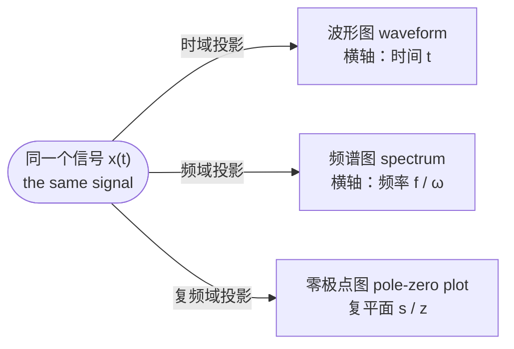

### 5.1 同一个隐喻在 AI 里的样子

多模态学习是这个隐喻最直接的现代版本。

机器学习了人类的 **文字 (documents / words)**、**图像 (image)**、**音频 (audio)**。以"苹果"为例：中文语音"píng guǒ"、英文单词"apple"、一张苹果的照片——**每一个都只是"苹果"这个概念的一个侧面表征**。神经网络做的事，就是把这些不同侧面**投影进同一个高维空间**——**嵌入空间 (embedding space) / 特征空间 (feature space)**，这个空间必然是**高维的**。

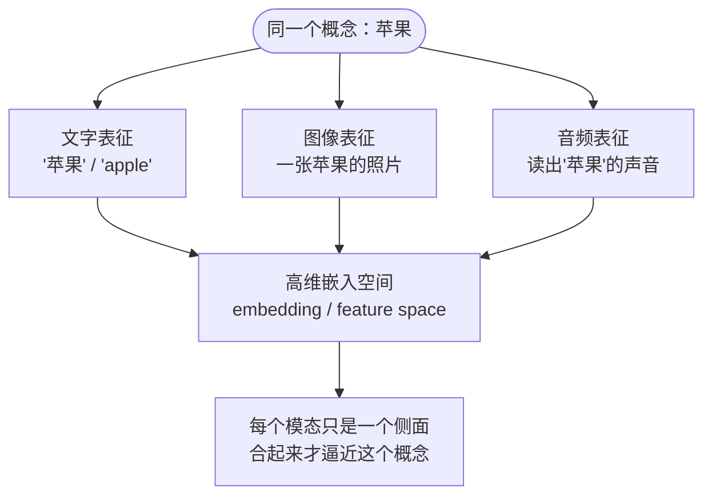

> [!tip] 一条方法论："认知要升维，落地要降维"
> - **理论研究、要把一个东西真正搞清楚 → 往往要"升维"**（加维度，看到更完整的结构）。
> - **要落地、要应用 → 要"降维"下来才好用**。
>
> 本课正是这个路线：为了搞清楚信号，从时域"升"到频域、再"升"到复频域（$s$ 平面）；而做工程时又要落回具体的滤波器、具体的采样率。

---

## 6. 声音与振动 Sound and Vibration

### 6.1 钢琴的发声机制

- 钢琴共有 **88 个琴键**，其中 **52 个白键 + 36 个黑键**。
- **每个琴键后面对应一套精密的杠杆系统**：按下琴键 → 杠杆启动 → **击锤 (hammer) 击打琴弦 (string)** → 发声。
- 琴弦由**铸铁框架**支撑，用来承受弦线的巨大张力。
- **弦的粗细长短决定音高**：

| 位置 | 弦 | 频率 |
|---|---|---|
| **越往右** | 越短、越细 | **频率越高 higher frequency** |
| **越往左** | 越长、越粗 | **频率越低 lower frequency** |

**物理链条：** 按键 → 琴槌击弦 → **琴弦振动 (string vibration)** → 空气压强的周期性起伏 → **声波 (sound wave)** → 耳膜/麦克风把它变成**电压随时间变化的信号**。

> [!important] "频率"最朴素的物理含义
> **每一根弦都有一个固有频率 (natural frequency)**，敲它一下它就以这个频率振动。
> **不同的弦有不同的频率**——这就是"频率成分"的由来。

### 6.2 同一场演奏的两种看法

这个例子直接铺垫了下一节的"时域 vs 频域"：

| 看法 | 你看到什么 |
|---|---|
| **时域看** | 按时间顺序敲键，声波在空气中**混合 (mixture)**、碰墙**反射产生回声**，前后音互相叠加——听到的是一段**连续的、各种频率混在一起**的声音 |
| **频域看** | 整件事其实只是 **"88 个频率里，每个键各敲了几下"** |

**同一场演奏，时域是"什么时候发生了什么"，频域是"哪些频率、各占多少"。**

> [!note] 为什么从"声音"讲起？（拓展）
> 因为声音是最直观的一维连续时间信号，而且**人耳本身就是一个天然的频谱分析仪 (spectrum analyzer)**：
> - **音高 (pitch)** ≈ 基频 (fundamental frequency)
> - **音色 (timbre)** ≈ 各次谐波 (harmonics) 的相对幅度
> - **响度 (loudness)** ≈ 幅度 (amplitude)
>
> **人耳做的就是傅里叶分析。**

---

## 7. 频率的两个单位 $f$ 与 $\omega$

| 符号 | 名称 | 单位 | 含义 |
|---|---|---|---|
| $f$ | **频率 frequency** | **Hz（赫兹）** | **一次每秒 / 一圈每秒** |
| $\omega$ | **角频率 angular frequency** | **rad/s（弧度每秒）** | 每秒转过多少弧度 |

$$\boxed{\ \omega = 2\pi f\ }\qquad\text{因为一圈 } = 2\pi \text{ 弧度}$$

$$T=\frac{1}{f}=\frac{2\pi}{\omega}$$

**两个例子：**

- **采样**：一秒采 1000 个样本点 → **1000 Hz**（即每 1 ms 记录一个点）。
- **转动**：车轮一秒转一圈 → **1 Hz**；用弧度描述则是 $2\pi$ rad/s。

> [!warning] 本课的记号习惯
> **本教材（Oppenheim）主要用角频率 $\omega$**。
> 看到 $\omega_0$ 要条件反射地想到"这是 rad/s，换算成 Hz 要除以 $2\pi$"。**两者只差一个 $2\pi$，但算错就是丢分。**

---

## 8. 时域与频域 Time Domain & Frequency Domain

> [!important] 核心定义对照表
> | | **时域 Time domain** | **频域 Frequency domain** |
> |---|---|---|
> | **自变量 Variable** | 时间 **Time (s)** | 频率 **Frequency (Hz)** |
> | **函数值 Function value** | 声波幅度 **Sound wave amplitude** | 该频率分量的能量 **Energy of the frequency component** |

引子：**音名 (pitch name)：C, D, E …**

### 8.1 案例一：中央 C（Middle-C）——单音

![[L01-中央C-时域与频域.png]]

- **左：时域波形**。横轴 Time (sec)，约 0.5 s → 0.545 s；纵轴 Voltage，范围 ±1.5。可见明显的**周期性 (periodicity)**，但单周期内波形并不是纯正弦——因为含有谐波。
- **右：频谱**。横轴 Frequency (Hz) 200 → 500；纵轴 Magnitude（$\times 10^4$）。在 **约 260 Hz 处有一根尖锐的主峰**。

**【拓展】**Middle-C（中央 C，$C_4$）的标准频率是 **261.63 Hz**，与图中主峰位置吻合。
时域里"看起来乱糟糟的一段波形"，在频域里被压缩成 **一根谱线 + 若干小峰**——信息被极大地"稀疏化 (sparsified)"了。
**这正是频域分析的价值：把时域中弥散在整段时间上的结构，集中到少数几个频率点上。**

### 8.2 案例二：和弦 C–E–G（Chord，do–mi–sol）——复合音

![[L01-和弦CEG-时域与频域.png]]

- **左：时域波形**。比单音复杂得多，肉眼几乎看不出"三个音"的结构，只能看出**有点周期性、比较杂**（三个不同频率一起振动）。
- **右：频谱**。出现 **三根主峰**，位置非常清晰，分别对应 C、E、G（**【拓展】**其标准频率约为 **261.6 / 329.6 / 392.0 Hz**）。

> [!important] 关键结论
> **时域上"叠加在一起、无法分辨"的多个成分，在频域上是彼此分开的独立谱线。**
> 从这个意义上，频域表征比时域**更接近信号的本源**——信号的本质就是振荡。
>
> 这就是 **分离 (separation) / 解混 (unmixing)** 能力——降噪、滤波、音源分离的物理基础。

### 8.3 把和弦里的 mi 单独剪出来

> **给一段和弦 do-mi-sol，要求把 mi 单独取出来——只要 mi，不要 do 和 sol。**

**在时域里：做不到。** 三个音叠加在同一段波形里，无从下手。

**在频域里：三步就完成——**

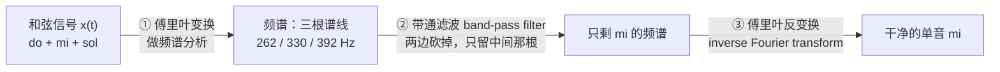

> [!important] 信号处理的基本套路（拓展）
> **变换到频域 → 在频域动手术 → 反变换回时域。**
> 降噪、均衡器 (EQ)、人声分离、图像去摩尔纹，全都是这个套路。

### 8.4 案例三：脑电图 EEG（Electroencephalogram）

![[L01-脑电图EEG-时域与频域.png]]

- **左 (e) Electroencephalogram (EEG)**：横轴 Time (msec) 0–1000 ms，纵轴 Voltage ±50（μV 量级）。时域上是一团**看似随机的噪声**，很像一个 random signal——看不出规律，也提取不出更多信息。
- **右 (e) Spectrum of EEG**：横轴 Frequency (Hz) 0–40，纵轴 Magnitude 0–3500。横轴上标注了 **delta / theta / alpha / beta** 四个频带。

**转到频率上，脑波是很有规律的**，而且**不同脑区（如语言区）的频率成分不一样，区别非常清晰**。

**【拓展】**四个频带的具体范围与生理含义：

| 频带 Band | 频率范围 | 典型生理状态 |
|---|---|---|
| **δ delta** | ~0.5–4 Hz | 深度睡眠 |
| **θ theta** | ~4–8 Hz | 困倦、浅睡 |
| **α alpha** | ~8–13 Hz | 清醒闭眼、放松 |
| **β beta** | ~13–30 Hz | 清醒、专注、思考 |

> [!note] 与 AI 方向的直接关联（拓展）
> 医学诊断、脑机接口 (BCI)、以及 AI 中的 EEG 分类任务，**特征几乎全部提取自频域**。

> [!tip] 三个案例的递进关系（拓展）
> 单音（一根谱线）→ 和弦（多根谱线，时域已难分辨）→ EEG（时域完全无结构，频域才有结构）。
> **信号越复杂，频域相对时域的优势越大。**

---

## 9. 傅里叶级数 Fourier Series

傅里叶级数有**三种写法**，对实信号 (for real $x(t)$) 三者 **mathematically equivalent（数学上完全等价）**。

但在写下公式之前，先用一个**周期矩形波**把傅里叶级数"造"出来——**理解了这个构造过程，第 3 章基本不用再重学。**

### 9.1 用矩形波从零构造傅里叶级数

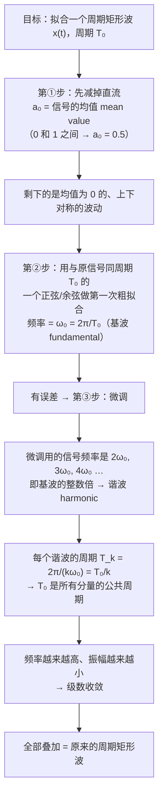

#### ① $a_0$ 是信号的均值

$a_0$ 就是 **均值 mean value**，即概率统计里的**期望**。

**为什么？** 因为其余每一项都是 $\cos$ / $\sin$，它们只在 $\pm1$ 之间左右摆动，**每一个正弦/余弦在一个周期上的平均值都是 0**，对整个信号的均值**没有贡献**。所以**整个信号的均值全部由 $a_0$ 承担**。

**具体例子**：一个在 0 和 1 之间跳变的周期矩形波，**均值就在 0 和 1 的中间，即 $a_0=0.5$**。
把 $a_0$ 拿掉之后，剩下的就是一个**上下对称、均值为 0** 的信号——这才是后面那些正余弦要拟合的对象。

#### ② 基波：先用同周期的正弦粗拟合

设原信号周期为 $T_0$，则**基波角频率 (fundamental frequency)**

$$\omega_0=\frac{2\pi}{T_0}$$

先用一个**周期同样是 $T_0$** 的正弦（带相位）去拟合大致形状——**但一定有误差**。

#### ③ 谐波：用整数倍频率"微调"

微调用的第二个频率是 **$2\omega_0$**，第三个是 **$3\omega_0$**，以此类推——这些叫 **谐波信号 (harmonic)**。

| 分量 | 角频率 | 周期 |
|---|---|---|
| 基波 fundamental | $\omega_0$ | $T_0=\dfrac{2\pi}{\omega_0}$ |
| 二次谐波 | $2\omega_0$ | $T_2=\dfrac{2\pi}{2\omega_0}=\dfrac{T_0}{2}$ |
| 三次谐波 | $3\omega_0$ | $T_3=\dfrac{T_0}{3}$ |
| $k$ 次谐波 | $k\omega_0$ | $T_k=\dfrac{T_0}{k}$ |

> [!important] 为什么必须用整数倍频率？
> 因为**最终合成的信号必须还是以 $T_0$ 为周期**。
> 只有当每个微调分量的周期都是 $T_0$ 的**整数分之一**时，$T_0$ 才是它们的**公共周期 (common period)**，叠加起来才仍然是周期 $T_0$ 的信号。

#### ④ 越调越细：频率升高、振幅减小 → 收敛

- 要拟合得越精准，**用到的频率就越高**（$k$ 越大）；
- 同时**振幅越来越小**（因为已经越来越接近，只需小修小补）。

**振荡频率越来越高、振幅越来越小**，这正是 **傅里叶级数的收敛性 (convergence)**。
这一点的"极限"就是 §9.6 的吉布斯现象——收敛，但在跳变点收敛得不够好。

#### ⑤ 频谱是怎么"投影"出来的

把时域轴与频域轴画成互相垂直的两个方向（二者是 **正交 (orthogonal)** 的），
再把分解出来的每一个正弦分量**沿垂直方向"投影"到频率轴上**：

- 投影的**位置**由它的频率决定：$\omega_0,\ 2\omega_0,\ 3\omega_0,\ 4\omega_0,\dots$
- 投影的**高度**就是它前面的**系数（振幅/权重）**

于是得到一排**长度递减的竖线**——

$$\boxed{\text{这排竖线就叫这个信号的\textbf{频谱 (spectrum / frequency spectrum)}}}$$

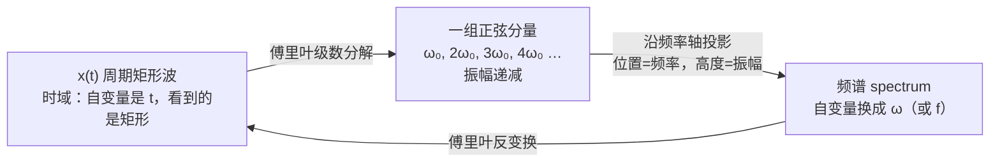

> [!tip] 这一段建立的三个术语
> - **基波频率 fundamental frequency**：$\omega_0$
> - **谐波 harmonic**：$k\omega_0$（$k\ge2$）
> - **频谱 spectrum**：以频率为自变量画出的、各频率分量的振幅（和相位）

### 9.2 三种形式的等价关系

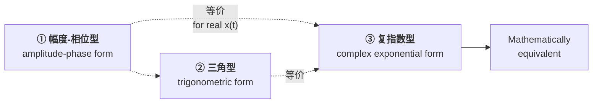

> [!warning] 数学课学的是前两个，本课用第三个
> - **大一数学课里的傅里叶级数 = 前两个公式**（形式一、形式二）——它们是 **实值的 (real-valued)**，没有虚部，全是正弦余弦。
> - **本课用第三个公式**（复指数型）——它是 **复值的 (complex-valued)**，更一般、数学基础更严格，**第 3 章展开讲**。

### 9.3 形式一：幅度–相位型（余弦叠加）

$$
x(t)=a_{0}+\sum_{k=1}^{+\infty} 2A_{k}\cos\!\left(k\omega_{0}t+\theta_{k}\right)
$$

- $a_0$：**直流分量 (DC component / mean value)**，即信号的平均值（就是 §9.1 里的均值）。
- $\omega_0$：**基波角频率 (fundamental angular frequency)**，$\omega_0 = 2\pi/T_0$。
- $k\omega_0$：**第 $k$ 次谐波 (the $k$-th harmonic)**。
- $A_k$：第 $k$ 次谐波的**幅度 (magnitude)**；$\theta_k$：**相位 (phase)**。

> [!tip] 物理意义最直观（拓展）
> 这个写法直接对应"**幅度谱 (magnitude spectrum) $A_k$ + 相位谱 (phase spectrum) $\theta_k$**"，就是 §8 那些频谱图画出来的东西。

### 9.4 形式二：三角型（正余弦叠加）

$$
x(t)=a_{0}+2\sum_{k=1}^{+\infty}\Bigl[B_{k}\cos k\omega_{0}t - C_{k}\sin k\omega_{0}t\Bigr]
$$

由形式一用**和角公式 (angle-addition formula)** 展开得到：

$$
\cos(k\omega_0 t+\theta_k)=\cos\theta_k\cos k\omega_0 t-\sin\theta_k\sin k\omega_0 t
$$

**【拓展】**由此可写出两组系数的对应关系：

$$
B_{k}=A_{k}\cos\theta_{k},\qquad C_{k}=A_{k}\sin\theta_{k}
$$
$$
A_{k}=\sqrt{B_{k}^{2}+C_{k}^{2}},\qquad \theta_{k}=\arctan\frac{C_{k}}{B_{k}}
$$

换句话说：形式一里那个相位 $\theta_k$，被和角公式**展开后吸收进了 $B_k$、$C_k$ 两个系数里**。两式描述的都是**实信号**（全是正弦余弦，没有虚部）。

### 9.5 形式三：复指数型（本课程主用）

$$
\boxed{\;x(t)=\sum_{k=-\infty}^{+\infty} a_{k}\,e^{\,jk\omega_{0}t}\;}
$$

- 求和范围是 $k=-\infty \to +\infty$，**包含负频率 (negative frequency)**。
- $a_k$ 是**复数 (complex-valued)** 的**傅里叶级数系数 (Fourier series coefficients)**。

> [!important] 三式互换的桥梁：欧拉公式 (Euler's formula)　—— 推导部分为拓展
> $$e^{j\phi}=\cos\phi+j\sin\phi \quad\Longrightarrow\quad \cos\phi=\frac{e^{j\phi}+e^{-j\phi}}{2}$$
>
> 令 $a_k = A_k e^{j\theta_k} = B_k + jC_k$，且对**实信号**有**共轭对称性 (conjugate symmetry)**：
> $$a_{-k}=a_{k}^{*}$$
> 则
> $$\sum_{k=-\infty}^{+\infty}a_k e^{jk\omega_0 t}=a_0+\sum_{k=1}^{+\infty}\left(a_k e^{jk\omega_0 t}+a_k^{*}e^{-jk\omega_0 t}\right)=a_0+\sum_{k=1}^{+\infty}2\,\mathrm{Re}\!\left\{a_k e^{jk\omega_0 t}\right\}$$
> 展开实部即得形式一与形式二。**这就是"Mathematically equivalent"的真正含义。**

#### 单频信号 single frequency

用欧拉公式展开 $e^{j\omega_0 t}$：

$$e^{\,j\omega_0 t}=\underbrace{\cos\omega_0 t}_{\text{实部}}+j\underbrace{\sin\omega_0 t}_{\text{虚部}}$$

- 实部和虚部**以完全相同的频率 $\omega_0$ 振荡**；
- 两者**只差 $\dfrac{\pi}{2}$ 的相位（即 90°）**。

因此 $e^{j\omega_0 t}$ 称为 **单频信号 (single frequency signal)**——**它只含一个频率**，是频域分析里最基本、最纯粹的那块积木。

于是复指数型傅里叶级数读作：**"把信号拆成一堆单频分量的加权和，$k$ 越大频率越高，权重就是 $a_k$"**。
而**这些 $a_k$ 就是这个信号的谱 (spectrum)**——即 §9.1⑤ 里"投影到频率轴上"的那些竖线。

#### 谐波集合 Harmonically Related Complex Exponentials

$$
\boxed{\ \Phi_k(t)=e^{\,jk\omega_0 t}=e^{\,jk(2\pi/T)t},\qquad k=0,\pm1,\pm2,\cdots\ }
$$

这一族信号称为**成谐波关系的复指数集**：每个成员的频率都是基波频率 $\omega_0$ 的整数倍，因此**共享同一个周期 $T$**——正是 §9.1③ 说的公共周期。

> [!warning] 为什么教材偏偏用最"抽象"的复指数型？（拓展）
> 1. **$e^{st}$ 是 LTI 系统的特征函数 (eigenfunction)**：复指数输入进 LTI 系统，输出还是同频率的复指数，只是被乘上一个复数 $H(j\omega)$。正弦函数不具备这种"进出同形"的性质（会混进相移，需要两个基）。
> 2. **形式最紧凑**：一个求和号搞定，不用分 $\cos$/$\sin$ 两项。
> 3. **可直接推广**：$k\omega_0$（离散谱线）→ 连续 $\omega$ 即得**傅里叶变换**；$j\omega \to s$ 即得**拉普拉斯变换**。
> 4. 代价：必须接受 **"负频率"** 这个数学记号——它没有物理实体，只是让共轭对成对出现、把余弦拆成两个旋转相量 (rotating phasors)。

### 9.6 方波的傅里叶合成与吉布斯现象

![[L01-方波的傅里叶合成.png]]

图中是一条**由多个正弦波叠加逼近出来的方波 (square wave)**，波形顶部和底部有明显的**波纹 (ripples)**。

这张图说明三件事：

1. **任何周期信号都可以由正弦/余弦叠加而成**——方波看起来"一点都不像正弦"，却正好是无穷多个奇次谐波的叠加（**【拓展】**具体级数）：
$$x(t)=\frac{4}{\pi}\sum_{k=1,3,5,\dots}^{\infty}\frac{1}{k}\sin(k\omega_0 t)$$
2. **叠加项越多，逼近越好**（逐次加谐波，方波边沿越来越陡）——正是 §9.1④ 的"微调"过程。
3. **【拓展】**顶部残留的波纹是 **吉布斯现象 (Gibbs phenomenon)**：在**跳变点 (discontinuity)** 附近，无论取多少项，过冲 (overshoot) 幅度都稳定在跳变高度的 **≈ 9 %**，不会消失，只会越挤越窄。
   → 这解释了为什么理想低通滤波会产生**振铃 (ringing)**，也是图像处理中锐利边缘出现"鬼影条纹"的根源。

---

## 10. 频域：频谱 Frequency Domain — Spectrum

### 10.1 "谱"这个词的来源：牛顿的棱镜实验

![[L01-棱镜色散实验.png]]

> [!important] 谱不是傅里叶提出的
> **"谱 (spectrum)"这个概念最早出自牛顿 (Newton) 的三棱镜实验 (prism experiment)**——那是人类第一次使用"谱"这个概念，比傅里叶早了一个多世纪。

**完整的实验：**

**这才是完整的证据链**：白光**不是**"被棱镜染上了颜色"，而是**本来就由各种颜色（频率）成分组成**，棱镜只是**把它们分开**；再用一块棱镜就能**把它们合回去**。

> [!important] 这正是傅里叶分析的物理原型
> **分解 (analysis) 与合成 (synthesis) 是可逆的一对**，对应**正变换与反变换**。
> - **白光** ≈ 时域信号（各频率成分混在一起，看上去只是"白"）
> - **棱镜** ≈ 变换算子
> - **彩色光带** ≈ 频谱 (spectrum)

**为什么不同颜色会被分开？** 因为**不同颜色的光波长不同**：**红光波长最长**（约 700 nm），**紫光波长最短**（约 400 nm）。波长不同 → **在同一个界面上折射的程度不同** → 传播路径被分开。
所以一束白光过棱镜后被**分解成不同的频率成分**——这就是一次实实在在的"分解"。

### 10.2 波长与频率的关系

> [!important] 公式
> $$c=\lambda f$$
> - $c$：**光速 (speed of light)**，$c \approx 3\times 10^{8}\ \mathrm{m/s}$
> - $\lambda$：**波长 (wavelength)**，单位 m
> - $f$：**频率 (frequency)**，单位 Hz
>
> 由于 $c$ 恒定，**频率越高 ⇔ 波长越短**，二者是同一件事的两种刻度。

### 10.3 电磁波谱 Electromagnetic Spectrum

![[L01-电磁波谱.png]]

**图表读法：**

- 上排刻度：**ν (Hz)**，从 $10^{24}$ 到 $10^{0}$，**← Increasing Frequency (ν)**（向左频率增大）
- 下排刻度：**λ (m)**，从 $10^{-16}$ 到 $10^{8}$，**Increasing Wavelength (λ) →**（向右波长增大）
- 下方放大框：**Visible spectrum（可见光谱）**，波长 **400 nm（紫）→ 700 nm（红）**

**各波段与典型应用：**

| 波段 Band | 中文 | 大致频率 | 波长量级 | 典型应用 |
|---|---|---|---|---|
| **γ rays** | γ 射线 | $>10^{19}$ Hz | — | 太空中的伽马射线，宇航服必须屏蔽 |
| **X rays** | X 射线 | $10^{16}\sim10^{19}$ Hz | — | 医院拍片；需**铅门封闭、穿防护衣，孕妇不能照** |
| **UV** | 紫外线 | $\sim10^{15}\sim10^{16}$ Hz | — | 伞上的"防紫外线 99.9 %"；**紫外会灼伤皮肤** |
| **Visible** | 可见光 | $\sim4\times10^{14}\sim7.5\times10^{14}$ Hz | **纳米级** | 人眼唯一能看到的一小段，在整个谱里只占极窄一条 |
| **IR** | 红外线 | $\sim10^{12}\sim10^{14}$ Hz | — | 热成像、红外遥控 |
| **Microwave** | 微波 | $\sim10^{9}\sim10^{12}$ Hz | **厘米级 → 毫米级** | **微波炉**；高频端是**毫米波 (mmWave)、太赫兹 (THz)**，即 **6G** 的研究方向（华工电信学院即设有毫米波、太赫兹团队） |
| **Radio waves (FM / AM)** | 无线电波 | $\sim10^{5}\sim10^{9}$ Hz | **米级** | **AM / FM 广播** |
| **Long radio waves** | 长波 | $<10^{5}$ Hz | 更长 | 远距离通信、导航 |

> [!important] 一条贯穿全表的规律
> **频率越高（波长越短）→ 能量越强 → 危害性越大。**
> 可见光无害 → 紫外能灼伤皮肤 → X 射线、伽马射线对人体有害，只能受控使用。
> **人类日常可用的波段，上限大致就到可见光这一段。**

### 10.4 通信频段与调制（第 8 章的预告）

无线通信的代际演进，本质是在电磁波谱上不断往高频走：

| 代际 | 频段 | 细节 |
|---|---|---|
| **3G** | **约 900 MHz** | 移动/联通打电话用的频段；手机关掉"高清通话"时用的还是它 |
| **4G / 5G** | **GHz** | **WiFi、蓝牙、无线鼠标**都在 **2.4 GHz** 左右 |
| **6G（研究中）** | **毫米波 / 太赫兹** | 当前的前沿方向 |

**为什么需要调制？** 人耳能听 20 Hz–20 kHz，但**说话的主频率大约只在 2–3 kHz**（声带振动的主要成分）。而无线信道在 MHz–GHz。

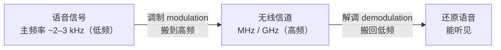

我们身边**全是电磁波信号**（WiFi、蓝牙……）飞来飞去，只是**人身上的传感器太少**——只有眼睛（只看得见可见光）、体温、触觉、听觉——所以感受不到。
**调制就是把一个能听见的低频信号，搬到听不见看不见的高频信道上去传输。**

> [!warning] 单位换算：频率按 1000，不是 1024
> $$1\ \mathrm{kHz}=10^3\ \mathrm{Hz},\quad 1\ \mathrm{MHz}=10^6\ \mathrm{Hz},\quad 1\ \mathrm{GHz}=10^9\ \mathrm{Hz},\quad 1\ \mathrm{THz}=10^{12}\ \mathrm{Hz}$$
> $1024$ 那一套是**计算机存储**的二进制习惯（$2^{10}$），**频率单位遵循 SI 词头，是十进制**。口语里两者常被混用，算题时一律按 1000。

> [!tip] 为什么在信号课里讲电磁波谱？（拓展）
> 因为它是"**频域**"这个抽象概念**唯一一个人人都亲眼见过的实例**：
> 你看到的"颜色"就是频率，"彩虹"就是一张频谱图。
> 后面学 **调制 (modulation)、频分复用 (FDM)、频带 (bandwidth)** 时，脑子里应该始终有这张图——所有通信技术做的事，就是**在这条轴上给不同用户分配不同的位置**。

---

## 11. 采样定理预告 Sampling Theorem（第 7 章正式证明）

> [!important] 结论（Nyquist 采样定理）
> $$\boxed{\ f_s \ \ge\ 2 f_{\max}\ }$$
> **只要用不低于原信号最高频率 2 倍的采样率去采样，就足以完美重建 (reconstruct) 原来的连续信号。**
> 英文表述：sample at **twice of the highest frequency of the original signal**。

**用音乐文件算这笔账：**

| 量 | 数值 | 说明 |
|---|---|---|
| 人耳听觉范围 **audio range** | **20 Hz – 20 kHz** | 超过 20 kHz 叫**超声 (ultrasound)**，人耳听不到；虎鲸、蝙蝠等动物能听到 |
| 所需最低采样率 | $2\times 20\ \mathrm{kHz}=40\ \mathrm{kHz}$ | 由采样定理 |
| **音乐文件实际采样率** | **44.1 kHz** | 比 40 kHz **略高一点就够用**——MP3 / WMA 文件属性里能查到 |
| **心电图 ECG 采样率** | **约 360 Hz（几百赫兹）** | ECG **没有那么高的频率成分** |

> 可以自己验证：右键音频文件 → 属性 (properties) → 查看 sampling frequency。

> [!warning] 一个必须纠正的直觉：采样点不是越多越好
> - **少了不够用**——极端情况，一秒只采一个点，整段语音完全无法还原。
> - **多了也不是好事**：采样点越多 → **存储开销越大**、**计算量和对设备的要求越高**，纯属负担。
>
> **采样定理的价值就在于给出了那个"刚刚好"的界**：达到 $2f_{\max}$ 就能**完美重建**，再多没有收益。

> [!note] 为什么是 2 倍？
> 需要用**傅里叶工具在频率上看这件事**（频谱的周期延拓与混叠），**第 7 章**才能证明。
> 这里先记住结论和它的两个用途：**① 选采样率；② 理解混叠 (aliasing) 的来源**。
> 参见 [[C1.2 自变量的变换]] 里离散频率以 $2\pi$ 为周期的讨论——那是混叠在离散域的表现。

---

## 12. "信号与系统"对 AI 本科生重要吗？

> [!abstract] Core Conclusion 核心结论
> It's a **foundational course（基础课）**. Its importance is **highly dependent on your AI sub-field（取决于你选的 AI 细分方向）**.

对通信方向自不必说；对 AI 方向而言，它虽不是"最重要"的一门，但**一定是非常重要的专业基础课**——因为 **AI 一定要跟信号打交道**。

### 12.1 关键理由 Key Reasons Why It Matters

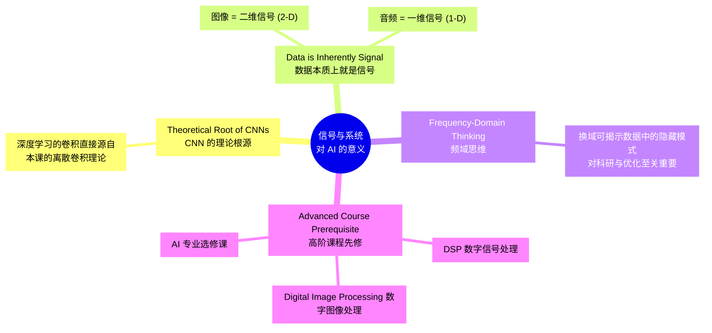

| 理由 Reason | 说明 |
|---|---|
| **Theoretical Root of CNNs** | Deep learning convolution originates directly from the **discrete convolution theory** taught here. |
| **Data is Inherently Signal** | Images (**2-D signals**) and audio (**1-D signals**) are the primary data for many AI applications. |
| **Frequency-Domain Thinking** | Shifting domains reveals **hidden patterns** in data, crucial for research and optimization. |
| **Advanced Course Prerequisite** | Essential foundation for **DSP、Digital Image Processing** and specialized AI electives. |

### 12.2 硬联系一：自动驾驶——车上每个传感器都是电磁波

"sensor-based AI (radar/LiDAR/EEG)" 属于 **Critical & Mandatory**。用"特斯拉 vs 国内厂商"的路线差异最容易看清：

| 方案 | 传感器 | 原理 |
|---|---|---|
| **特斯拉：纯视觉模式** | 只用**车载相机 (camera)** | **只用可见光成像** |
| **国内新能源车（华为 / 小米等）** | **激光雷达 LiDAR** | 主动发射激光，测回波 |
| | **毫米波雷达 mmWave radar** | 毫米级波长 |
| | **超声波雷达**（倒车雷达） | 几十年前就有的、最便宜的一种，**探测距离很短** |

> [!important] 被动成像 vs 主动感知
> - **可见光成像是被动的**——靠太阳光照上去、反射回来。
> - **雷达/超声是主动的**——**设备自己发射信号，再接收弹回来的回波**，通过**计算时间差**得到**距离 (distance) / 深度 (depth)**。
>
> 不管是自动驾驶还是机器人 (robots)，**每一个传感器的输出都是信号**，都要处理。

### 12.3 硬联系二：CNN 的卷积层，本质就是一个 LTI 系统

这是把整门课和深度学习钉在一起的那句话：

> **卷积 (convolution) 是 LTI 系统的一种输入输出关系。**
> **LTI = Linear Time-Invariant system（线性时不变系统）。**
> **所以神经网络里的卷积层，就是一个"线性时不变层"。**

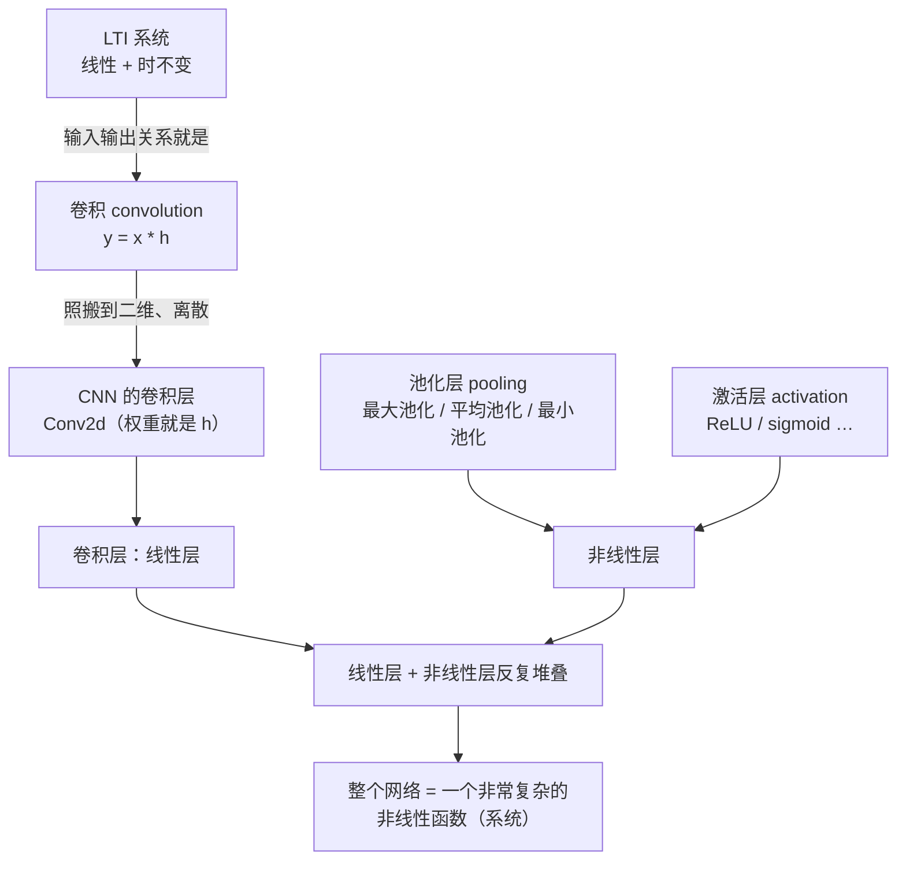

- **卷积层是线性的、时不变的**，网络中大量的权重参数都在这里。
- **池化层 (pooling)**：最大池化 / 平均池化 / 最小池化——**是非线性运算、非线性层**。
- **激活层 (activation)**：也是**非线性层**。
- **线性层和非线性层反复堆叠**，堆出来的就是一个**非常复杂的非线性函数**：给一个输入，经过这个系统，出来一个结果。

**LTI（也就是 CNN 里最关键、也最简单的那一层）就是第 2 章的内容**——卷积的计算与由来都在那里。
参见 [[C1.6 系统的基本性质]] 的 1.6.6 与 LTI 小节。

### 12.4 学习重点 Learning Focus for AI

> [!important] 🎯 Master These（必须吃透）
> - **Discrete Convolution** 离散卷积
> - **DFT / FFT** 离散傅里叶变换 / 快速傅里叶变换
> - **Sampling Theorem (anti-aliasing)** 采样定理（抗混叠）
> - **LTI Systems** 线性时不变系统

> [!tip] 💡 Conceptual Grasp（理解为主，不必死算）
> - **Z-Transform** Z 变换 与 **Laplace Transform** 拉普拉斯变换
> - 重点放在 **intuition（直觉理解）**，**skip heavy hand-calculations（跳过繁重的手算）**

**【拓展】这几个"必须吃透"的点在 AI 里具体长什么样：**

- **离散卷积** → CNN 的 `Conv2d`（严格说框架里实现的是**互相关 correlation**，与卷积差一个核翻转 (kernel flip)，这个区别本课会讲清楚）。
- **DFT/FFT** → 语音的**梅尔频谱图 (mel-spectrogram)**、图像的频域增强、快速卷积（**卷积定理**：时域卷积 = 频域相乘，$O(N^2)\to O(N\log N)$）。
- **采样定理 / 抗混叠** → 图像下采样前必须先低通滤波，否则出现**混叠 (aliasing)**、摩尔纹 (moiré)；GAN/扩散模型里 upsample/downsample 的伪影问题直接源于此。
- **LTI 系统** → "线性 + 时不变"是可以用频率响应 $H(j\omega)$ 完整刻画系统的前提；理解了它，才知道神经网络的**非线性激活为什么必不可少**（否则整个网络退化成一个线性系统）。

### 12.5 哪些方向 Critical & Mandatory（必修且关键）

- **Speech / audio processing（语音与音频处理）** —— Fourier Transforms
- **Low-level CV（底层计算机视觉）** —— image restoration（图像复原）
- **Sensor-based AI（基于传感器的 AI）** —— **radar / LiDAR / EEG**

### 12.6 后续课程链条

本课之后还有 **DSP —— Digital Signal Processing（数字信号处理）**，它**完全建立在本课的基础上**。
加上 Digital Image Processing，本课是这一整条线的**唯一入口**。

---

## 13. 上课形式与本讲作业

> [!warning] 从第二讲开始形式会变
> - **后面会有大量板书**，因为要做数学推导。
> - 写板书时会开灯，并可能**升起一片（或两片）投影屏**，只用黑板。
> - **想看清板书要尽量往前坐。**
> - 第一讲的板书属于随手示意，不必回看。

**本讲作业：无。** 作业从每章讲完后开始，共约 10 次线上作业。

---

## 14. 本讲知识点清单 Checklist

**课程与考核**

- [ ] 记住课程网站、QQ 群（入群答案 = 授课教师姓名）、联系方式
- [ ] 明确成绩构成：**30 % 平时 + 10 % 期中 + 60 % 期末（闭卷）**
- [ ] 记住期中考试安排：**第 5 章后 / 45 分钟 / 只有单选题**
- [ ] 记住作业节奏：**每章一次，约 10 次线上作业**
- [ ] 知道买书优先级：辅导书必备、主教材建议中文版、实验书不用买

**课程结构**

- [ ] 能默画课程四大板块结构（时域 / 频域 / 应用 / 复频域）与 10 章归属
- [ ] 能说出全书"**先连续后离散**"的组织方式：CTFS/DTFS、CTFT/DTFT、Laplace/Z
- [ ] 能说出**周期用级数、非周期用变换**，且变换是级数的推广
- [ ] 能说出为什么还要学 Laplace / Z（傅里叶有收敛条件）

**核心概念**

- [ ] 理解"投影"隐喻：**变换 = 换一个观察域**
- [ ] 说清时域与频域的**自变量**与**函数值**分别是什么
- [ ] 解释单音、和弦、EEG 三个案例分别说明了频域的什么优势
- [ ] 记住 $\omega=2\pi f$，以及本书主用 $\omega$（rad/s）
- [ ] 能复述**用矩形波构造傅里叶级数**的五步：均值 $a_0$ → 基波拟合 → 谐波微调 → 公共周期 $T_0$ → 收敛
- [ ] 能解释**频谱是怎么"投影"出来的**，说出基波频率与谐波的关系 $T_k=T_0/k$
- [ ] 写出傅里叶级数的**三种形式**，说明它们对实信号等价，并说出 $a_k$ 与 $A_k,\theta_k,B_k,C_k$ 的换算
- [ ] 记住 $e^{j\omega_0t}$ 是**单频信号**（实虚部同频、差 90°），$a_k$ 就是谱
- [ ] 理解方波合成与**吉布斯现象**

**物理与工程**

- [ ] 记住"**谱"的概念来自牛顿的棱镜实验**，且**两块棱镜可以把白光合回去**（= 分解与合成可逆）
- [ ] 记住 $c=\lambda f$，$c\approx 3\times10^{8}$ m/s，及可见光 400–700 nm
- [ ] 能沿电磁波谱说出各波段应用，以及"频率越高危害越大"的规律
- [ ] 会用采样定理算：人耳 20 Hz–20 kHz → 音乐 **44.1 kHz**；ECG 约 **360 Hz**
- [ ] 能说清**为什么采样点不是越多越好**（存储 + 计算负担）
- [ ] 记住通信频段：3G ≈ 900 MHz、WiFi/蓝牙 ≈ 2.4 GHz、6G 目标毫米波/太赫兹；**频率换算按 1000 不是 1024**

**与 AI 的联系**

- [ ] 说清信号与系统对 AI 的四条价值，及四个必须吃透的知识点
- [ ] 能说出**卷积 = LTI 系统的输入输出关系**，CNN 卷积层 = 线性时不变层，池化/激活 = 非线性层
- [ ] 能说出自动驾驶各传感器分别用电磁波谱的哪一段、被动成像与主动感知的区别

---

## 15. 自测问答 Self-Test Q&A

> [!question] Q1：为什么要引入"频域"？时域不够用吗？
> **A**：时域完全能描述信号（信息一点不少），但**不好算、不好看**。
> ① 对 LTI 系统，时域是卷积、频域是乘法；② 时域上混叠在一起的成分（和弦的三个音、EEG 的各频带），频域上是分离的；③ 很多物理/生理机制本身就定义在频率上（音高、颜色、脑电频带）。

> [!question] Q2："投影"图想说明什么？那个立体是什么形状？
> **A**：那是**螺丝刀刀头**。同一个三维物体投到不同平面得到三角形、正方形、圆。类比：同一个信号在不同域有不同表示，**每个表示只呈现对象的一个"横断面"**；选对域，问题就变简单。

> [!question] Q3：时域和频域的"自变量"和"函数值"分别是什么？
> **A**：时域——自变量是**时间 (s)**，函数值是**声波幅度**；频域——自变量是**频率 (Hz)**，函数值是**该频率分量的能量**。

> [!question] Q4：中央 C 的频谱为什么是一根尖峰而不是一条平坦曲线？
> **A**：因为它是**周期信号**，能量集中在基频（≈261.6 Hz）及其整数倍谐波上，因此频谱是**离散谱线**，而非连续分布。

> [!question] Q5：怎样把和弦里的 mi 单独取出来？
> **A**：时域做不到。频域三步：傅里叶变换 → **带通滤波**只留 mi 那根谱线 → 傅里叶反变换。这就是信号处理的基本套路。

> [!question] Q6：EEG 在时域看是噪声，为什么频域有结构？
> **A**：EEG 的信息编码在**节律 (rhythms)** 上——δ/θ/α/β 各频带的相对能量反映不同脑状态，且不同脑区频率成分不同。时域波形是这些节律的随机叠加，看不出规律；做频谱后各频带能量峰立刻显现。

> [!question] Q7：为什么傅里叶级数里的"微调"必须用基波频率的整数倍？
> **A**：因为合成信号必须仍以 $T_0$ 为周期。$k$ 次谐波的周期 $T_k=T_0/k$，$T_0$ 是所有分量的**公共周期**；若用非整数倍频率，叠加结果就不再是周期 $T_0$ 的信号。

> [!question] Q8：$a_0$ 为什么等于信号的均值？
> **A**：因为其余每一项都是正弦/余弦，**在一个周期上的平均值都是 0**，对整体均值没有贡献，所以均值全部由 $a_0$ 承担。周期矩形波在 0 与 1 之间跳变时，$a_0=0.5$。

> [!question] Q9：频谱是怎么从时域波形"得到"的？
> **A**：把分解出的每个正弦分量**投影到频率轴**上——位置由频率 $k\omega_0$ 决定，高度由振幅（系数）决定，得到一排长度递减的谱线，这就是**频谱 spectrum**。

> [!question] Q10：傅里叶级数三种形式为什么等价？对什么信号成立？
> **A**：对**实信号 $x(t)$** 成立。关键是 $a_{-k}=a_k^{*}$（共轭对称），使 $a_ke^{jk\omega_0t}+a_{-k}e^{-jk\omega_0t}=2\mathrm{Re}\{a_ke^{jk\omega_0t}\}=2A_k\cos(k\omega_0t+\theta_k)$，即复指数型自动坍缩为实的余弦叠加。

> [!question] Q11：为什么教材主用复指数形式 $\sum a_k e^{jk\omega_0 t}$？
> **A**：因为 $e^{st}$ 是 **LTI 系统的特征函数**（输入输出同形，只差一个复增益 $H$），形式最紧凑，且能自然推广到傅里叶变换、拉普拉斯变换和 Z 变换。

> [!question] Q12：什么叫"单频信号"？
> **A**：$e^{j\omega_0t}$——它的实部与虚部**以同一频率 $\omega_0$ 振荡，只差 90° 相位**。它是频域分析里最基本的积木；傅里叶级数就是把信号拆成一堆单频分量的加权和，权重 $a_k$ 就是谱。

> [!question] Q13：方波合成图上顶部的波纹是什么？多加几项能消掉吗？
> **A**：**吉布斯现象**。**不能消掉**——过冲幅度恒为跳变高度的约 9 %，增加项数只会让波纹变窄、更靠近跳变点，但峰值不下降。

> [!question] Q14："谱"这个词是谁最先用的？棱镜实验完整地说明了什么？
> **A**：**牛顿**，出自三棱镜实验。白光过棱镜分成彩虹，**再过一块棱镜又能合回白光**——说明白光本来就由不同频率成分组成，**分解与合成是可逆的**，这正是傅里叶正/反变换的物理原型。

> [!question] Q15：$c=\lambda f$ 说明什么？
> **A**：光速恒定，因此频率与波长互为倒数关系，**高频 ⇔ 短波长**。电磁波谱从 γ 射线（$>10^{19}$ Hz）到长波无线电（$<10^{5}$ Hz），可见光仅占其中极窄一段（400–700 nm）。

> [!question] Q16：音乐文件为什么用 44.1 kHz 采样？心电图为什么几百赫兹就够？
> **A**：由采样定理 $f_s\ge 2f_{\max}$。人耳上限 20 kHz → 需 40 kHz，44.1 kHz 略高一点即够；ECG 本身没有高频成分，最高频率低，几百赫兹（约 360 Hz）就足够。

> [!question] Q17：采样点越多越好吗？
> **A**：不是。少了无法重建；但超过 $2f_{\max}$ 之后**再多也不能提高重建质量**，只会增加**存储开销和计算负担**。

> [!question] Q18：为什么无线通信必须"调制"？
> **A**：人说话的主频率只有 2–3 kHz，而无线信道在 MHz–GHz。**调制 (modulation)** 把低频信号搬到高频信道上传输，接收端再**解调 (demodulation)** 搬回来。

> [!question] Q19：CNN 的卷积层和这门课是什么关系？
> **A**：**卷积就是 LTI（线性时不变）系统的输入输出关系**，所以卷积层本质上是一个**线性时不变层**；池化层和激活层是**非线性层**。线性层与非线性层堆叠，才让整个网络成为复杂的非线性函数。LTI 与卷积是第 2 章内容。

> [!question] Q20：对 AI 专业学生，本课最必须掌握的四个知识点是什么？
> **A**：**离散卷积、DFT/FFT、采样定理与抗混叠、LTI 系统**。Z 变换与拉普拉斯变换以**理解直觉**为主，不必陷入繁重手算。

> [!question] Q21：为什么学完傅里叶还要学 Laplace 和 Z 变换？
> **A**：傅里叶工具**有收敛条件**，大致只适用于有限能量（及有限功率）信号；对发散信号无能为力。Laplace（连续）与 Z 变换（离散）是它的**推广**，适用范围更宽。

---

## 16. 相关笔记 Related Notes

- [[信号与系统 MOC]]
- 下一节：[[C1.1 连续时间与离散时间信号]]
- 本讲埋下的伏笔分别在：[[C1.1 连续时间与离散时间信号]]（能量/功率分类与傅里叶适用边界）、[[C1.2 自变量的变换]]（离散频率的 $2\pi$ 周期性 → 混叠）、[[C1.6 系统的基本性质]]（LTI）
- 下一讲预告：**Chapter 1 Signals and Systems** —— 连续/离散时间信号、能量与功率、基本信号变换（时移、时反、尺度变换）、指数与正弦信号、单位冲激与单位阶跃、系统性质（记忆性、因果性、稳定性、时不变性、线性）
