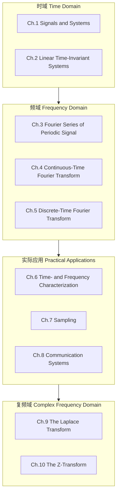
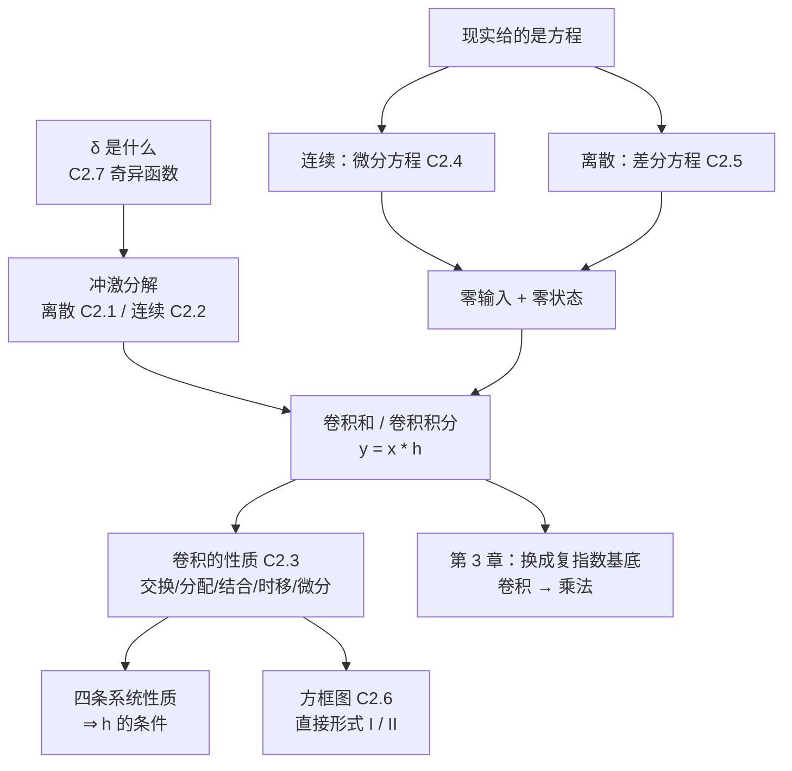

# 信号与系统 Signals and Systems — 课程索引 MOC

> [!info] 课程速览
> - **授课**：杨俊美（华南理工大学 电子与信息学院 副教授）｜yjunmei@scut.edu.cn｜13600497910
> - **开课单位**：未来技术学院 School of Future Technology
> - **课程网站**：https://ecourse.scut.edu.cn/web/gt/1/index.html?id=64312
> - **QQ 群**：信号与系统-25 人工智能，群号 1108991618
> - **教材**：Oppenheim《Signals and Systems》(2nd ed.)
> - **成绩**：考勤+作业 30 %｜期中 10 %｜期末 60 %

---

## 讲次笔记 Lecture Notes

| # | 笔记 | 主题 | 日期 |
|---|---|---|---|
| 01 | [[L01 绪论 Introduction]] | 课程说明、时域与频域、傅里叶级数三形式、频谱、对 AI 的意义 | 2026-08-31 |
| 02 | 并入 [[C1.1 连续时间与离散时间信号]]、[[C1.2 自变量的变换]] | 信号分类、能量与功率、三种基本变换、离散周期性、奇偶分解 | — |
| 03 | 并入 [[C1.3 指数信号与正弦信号]]、[[C1.4 单位冲激与单位阶跃函数]] | 指数信号与正交基底、CTFS/DTFS、冲激与第三种信号分解 | — |
| 04 | 并入 [[C1.4 单位冲激与单位阶跃函数]]、[[C1.5 连续时间与离散时间系统]]、[[C1.6 系统的基本性质]] | 连续冲激与阶跃（狄拉克函数、断点求导、$\delta(at)$ 书外结论与考试题型）、系统定义与三种互联、记忆性（未完） | — |

---

## Chapter 1　Signals and Systems 信号与系统

| 节 | 笔记 | 核心内容 |
|---|---|---|
| 1.1 | [[C1.1 连续时间与离散时间信号]] | 信号举例与数学表示（维度/通道）、连续 vs 离散、能量与功率、能量信号 / 功率信号判别 |
| 1.2 | [[C1.2 自变量的变换]] | 时移 / 时间反转 / 尺度变换、$x(at+b)$ 作图两条路径、周期信号、离散频率的 $2\pi$ 周期性、奇偶分解 |
| 1.3 | [[C1.3 指数信号与正弦信号]] | **频域的基底信号**：$e$ 的由来（连续复利极限）、欧拉公式与单频信号、谐波集与**正交性证明**、无穷维基底（希尔伯特空间）→ **CTFS**；一般复指数（包络×振荡）；离散实指数四形态、周期判据（$2\pi/\omega_0$ 有理）、基波频率 vs 谐波、离散谐波集只有 $N$ 个成员 → **DTFS** |
| 1.4 | [[C1.4 单位冲激与单位阶跃函数]] | **时域的基底信号**：$\delta[n]$ 与移位冲激、**第三种信号分解** $x[n]=\sum x[k]\delta[n-k]$（$x[k]$ 是值不是信号）；$\delta[n]$ / $u[n]$ 的差分与求和关系、抽样性质、$\delta(t)$ 的极限构造与近似、尺度性质 $\delta(at)=\delta(t)/\|a\|$ |
| 1.5 | [[C1.5 连续时间与离散时间系统]] | 系统定义与框图、RC 电路（微分方程）、银行账户（差分方程）、串联 / 并联 / 反馈互联 |
| 1.6 | [[C1.6 系统的基本性质]] | 记忆性、可逆性、因果性、稳定性（BIBO）、时不变性（三步判别法）、线性（叠加性）、**LTI 系统** |

---

## Chapter 2　Linear Time-Invariant Systems 线性时不变系统

| 笔记 | 课件页码 | 对应课件小节 | 核心内容 |
|---|---|---|---|
| [[C2.1 离散时间LTI系统与卷积和]] | p.1–16 | 2.1 | 冲激分解 → 时不变 + 线性 → **卷积和**；五步计算法（换元/反转/平移/相乘/求和）；三个标准例题（$u*a^nu$、$R_N*R_N$ 三角、$\alpha^nu*\beta^nu$）；有限长卷积 $L_y=L_x+L_h-1$ |
| [[C2.2 连续时间LTI系统与卷积积分]] | p.17–29 | 2.2 | 窄脉冲搭台阶 → $\Delta\to0$ → **卷积积分**；筛选性质；方波自卷积=三角、不等宽方波=梯形；面积关系 $\int y=\int x\cdot\int h$ |
| [[C2.3 LTI系统的性质]] | p.30–48 | 2.3 | 交换/分配/结合律（对应输入系统对等 / 并联 / 串联可换序）；时移与微分性质；**四条系统性质塌成 $h$ 的条件**（无记忆 $h=k\delta$、可逆 $h*h_1=\delta$、因果 $h(t)=0\ (t<0)$、稳定 $\int\|h\|<\infty$）；阶跃响应 $s=h*u$，$h=s'$ |
| [[C2.4 微分方程与连续时间系统求解]] | p.49–67 | 2.4 / 2.4.1 | LCCDE；经典法（齐次解+特解、特征根三型、撞车乘 $t$）；**零输入 + 零状态**；$y_h\ne y_{zi}$；只有 $y_{zs}=x*h$；$y=3x+2$ 为何不是 LTI |
| [[C2.5 差分方程与离散时间系统求解]] | p.68–87 | 2.4.2 | 差分方程；**迭代法**（计算机的做法，得不到闭式解）；经典法（$r^n$、重根乘 $n$、$\rho^n$）；零输入/零状态三例；连续↔离散对照表（$\mathrm{Re}\{s\}<0\leftrightarrow\|r\|<1$） |
| [[C2.6 LTI系统的方框图表示]] | p.88–96, 99 | 2.4.3 | 三种零件（加法器/乘常数/延迟器或积分器）；递归=反馈=记忆；**直接形式 I（$N+M$ 个 D）vs II（$\max(N,M)$ 个 D）**，省存储器靠交换律；为什么用积分器不用微分器 |
| [[C2.7 奇异函数]] | p.97–98 | 2.5 | $\delta$ 是脉冲族的极限（形状无关、面积为本）；$\delta=\delta*\delta$；**11 条公式**（相乘类"取值" vs 卷积类"搬移"）；$\delta(at)=\delta(t)/\|a\|$ 连续独有 |

> [!warning] Chapter 2 的阅读顺序说明（重要）
> 课件 2.4 一节长达 39 页，同时装着连续求解、离散求解、方框图三块内容，所以笔记**按知识依赖拆成了三篇**，编号与课件小节号不完全一致：
> - 笔记 **C2.4** = 课件 2.4 / 2.4.1（连续时间求解）
> - 笔记 **C2.5** = 课件 2.4.2 及其后的离散时间求解
> - 笔记 **C2.6** = 课件 2.4.3（方框图）
> - 笔记 **C2.7** = 课件 2.5（奇异函数）
>
> **建议阅读顺序就是笔记编号顺序 C2.1 → C2.7**。若想先补 $\delta$ 的基础，可以把 C2.7 提到 C2.1 之前读。

> [!tip] Chapter 2 的主线
> **$\delta$ 是什么（2.7）→ 用 $\delta$ 拆信号（2.1 / 2.2）→ 卷积 → 卷积的性质 = 电路的接法（2.3 / 2.6）→ 现实给的是方程，解方程（2.4 / 2.5）**
> 一句话：**一个 LTI 系统就是一条 $h$。**

> [!warning] Chapter 2 课件勘误（已复算验证，做题以修正值为准）
> | 课件页 | 课件写的 | 复算结果 |
> |---|---|---|
> | p.25–27 | $\int_{-0.5}^{0.5+t}\mathrm{d}t$ | 积分变量应为 $\mathrm{d}\tau$ |
> | p.62 | $K_1=2,\ K_2=3$ | 由课件自列的两式应得 $K_1=1,\ K_2=5$ |
> | p.72–73 | $y[1]=2C_1+3C_2-2$，答案 $-2^n+3^n-n2^{n+1}$ | $y_p[1]=-4$，应为 $y[n]=-3\cdot2^{n}+3^{\,n+1}-n2^{\,n+1}$ |
> | p.78 | $-\frac{C_1}{2}+\frac{C_2}{4}=-1$，得 $C_1=C_2=4$ | 题设 $y[-2]=\frac12$，应得 $C_1=C_2=-2$ |
> | p.79 | $C_5=5$ | 排版笔误，应为 $C_3=5$ |
> | p.94 | $\int[bx(\tau)-ay(t)]d\tau$ | 应为 $ay(\tau)$ |
> | p.98 (11) | $\int\delta'(t)\,d(t)$ | 应为 $dt$ |
> | p.47 | 多选题显示"此题未设置答案" | 按判据复算答案为 **A、B、D** |

> [!info] 「拓展」标注约定
> 已补充课堂转写稿的笔记里，标有 **（拓展）** / **【拓展】** 的段落 = **课堂上没有讲、由课件与教材延伸补充**的内容。
> 复习优先级：先吃透未标注的主干，再看拓展。尚未有转写稿的小节，篇首会注明「授课进度说明」，全篇不作标注。

> [!info] 授课进度
> - **Chapter 1**：已合并第 1–4 节课的转写稿。
> - **Chapter 2**：**尚无转写稿**，七篇笔记均依据课件整理，篇首都有「授课进度说明」，全章不作「拓展」标注。拿到第二章课堂录音转写稿后会做增量合并并补标。
> - `transcript/` 目录现有：第一节课-已合并、第二节课-已合并、第三节课-已合并、第四节课-已合并（四份均已并入 Chapter 1 笔记，文件名已按约定加「已合并」后缀）。**目录中没有未合并的转写稿。**

> [!info] 笔记来源
> 每篇笔记的 frontmatter `source` 列出了它的材料来源（课件 PDF + 对应的课堂转写稿）。
> 所有材料已按知识脉络**融合进正文**，不区分出处——读起来是一份完整讲义。

> [!tip] 贯穿全章的一条线：三种信号分解
> | # | 名称 | 域 | 分解式 | 出处 |
> |---|---|---|---|---|
> | ① | 奇偶分解 | 时域 | $x=x_e+x_o$ | [[C1.2 自变量的变换]] |
> | ② | 傅里叶分解 CTFS / DTFS | **频域** | $x(t)=\sum_k a_k e^{jk\omega_0 t}$ | [[C1.3 指数信号与正弦信号]] → 第 3 章 |
> | ③ | 冲激分解 | **时域** | $x[n]=\sum_k x[k]\delta[n-k]$ | [[C1.4 单位冲激与单位阶跃函数]] → **第 2 章卷积（已兑现）** |
>
> 1.3 与 1.4 分别给出**频域**与**时域**的基底信号，②③ 就是同一个信号的两套坐标。
> 第 2 章走完了 ③ 这条路（冲激 → 卷积）；第 3 章开始走 ② 那条路（复指数 → 频谱），届时**时域的卷积会变成频域的乘法**。

> [!tip] Chapter 1 的主线
> **信号怎么描述（1.1–1.4）→ 系统怎么描述（1.5）→ 系统怎么分类（1.6）**，
> 最后收敛到 **LTI 系统**——第 2 章起的唯一研究对象。

---

## 课程结构 Course Structure

### Chapter 2 内部地图

---

## 公式速查表（跨章累积）

### 信号与变换（Ch.1）

| 名称 | 公式 |
|---|---|
| 奇偶分解 | $x_e=\frac12[x(t)+x(-t)]$，$x_o=\frac12[x(t)-x(-t)]$ |
| 离散周期判据 | $\dfrac{\omega_0}{2\pi}$ 为有理数；$N$ 取最简分数的分子 |
| 冲激分解 | $x[n]=\sum_kx[k]\delta[n-k]$ |
| 冲激尺度性质 | $\delta(at)=\dfrac{1}{\|a\|}\delta(t)$（**连续独有**） |

### 卷积（Ch.2）

| 名称 | 连续 | 离散 |
|---|---|---|
| 信号分解 | $x(t)=\int x(\tau)\delta(t-\tau)d\tau$ | $x[n]=\sum_kx[k]\delta[n-k]$ |
| 卷积 | $y(t)=\int x(\tau)h(t-\tau)d\tau$ | $y[n]=\sum_kx[k]h[n-k]$ |
| 方波自卷积 | 三角：底宽 $2T$、峰值 $T$ | 三角：底宽 $2N-1$、峰值 $N$ |
| 不等宽方波 | 梯形：升 $T_1$ / 平 $T_2-T_1$ / 降 $T_1$ | 梯形序列 |
| 支撑 | $T_x+T_h$ | $L_x+L_h-1$，起点相加 |
| 面积/总和 | $\int y=\int x\cdot\int h$ | $\sum y=\sum x\cdot\sum h$ |

### 常用卷积结果

| 卷积 | 结果 |
|---|---|
| $u[n]*a^nu[n]$ | $\dfrac{1-a^{n+1}}{1-a}u[n]$ |
| $\alpha^nu[n]*\beta^nu[n]$ | $\dfrac{\beta^{n+1}-\alpha^{n+1}}{\beta-\alpha}u[n]$；$\alpha=\beta$ 时 $(n+1)\alpha^nu[n]$ |
| $e^{-at}u(t)*u(t)$ | $\dfrac{1-e^{-at}}{a}u(t)$ |
| $x*\delta(t-t_0)$ | $x(t-t_0)$ |
| $x*\delta'(t)$ | $x'(t)$ |
| $x*u(t)$ | $\int_{-\infty}^tx(\tau)d\tau$ |

### LTI 系统性质（Ch.2.3）

| 性质 | 判据 | 框图含义 |
|---|---|---|
| 无记忆 | $h=k\delta$ | — |
| 可逆 | $\exists h_1,\ h*h_1=\delta$ | 串联抵消 |
| 因果 | $h(t)=0\ (t<0)$；$h[n]=0\ (n<0)$ | 不看未来 |
| 稳定 (BIBO) | $\int\|h\|dt<\infty$；$\sum\|h[k]\|<\infty$（**充要**） | — |
| 并联 | $h_1+h_2$ | 分配律 |
| 串联 | $h_1*h_2$，可换序 | 结合律 + 交换律 |
| 阶跃响应 | $s=h*u$；$h=s'$ 或 $s[n]-s[n-1]$ | 实验里测 $s$ 更容易 |

### 方程求解（Ch.2.4 / 2.5）

| 项目 | 连续 | 离散 |
|---|---|---|
| 试探解 | $e^{st}$ | $r^{\,n}$ |
| 重根补 | 乘 $t^{k}$ | 乘 $n^{k}$ |
| 复根 | $e^{\sigma t}(K_1\cos\omega t+K_2\sin\omega t)$ | $\rho^{\,n}(C_1\cos\omega_0n+C_2\sin\omega_0n)$ |
| 衰减条件 | $\mathrm{Re}\{s\}<0$ | $\|r\|<1$ |
| 全响应 | $y=y_h+y_p=y_{zi}+y_{zs}$ | 同 |
| 零状态 | $y_{zs}=x*h$ | $y_{zs}=x*h$ |
| 零状态初值 | $y(0^-)=\cdots=0$ | $y[-1]=\cdots=y[-N]=0$ |
| 记忆元件 | 积分器 | 延迟器 D |
| 直接形式 I / II 的存储单元 | $N+M$ / $\max(N,M)$ | 同 |

### 常用数值

| 量 | 值 |
|---|---|
| $e^{-1}$ | 0.3679 |
| $e^{-2}$ | 0.1353 |
| $e^{-3}$ | 0.0498 |
| $\sum_{k\ge0}a^k$（$\|a\|<1$） | $\dfrac{1}{1-a}$ |
| $\sum_{k=0}^{n}a^k$ | $\dfrac{1-a^{n+1}}{1-a}$；$a=1$ 时为 $n+1$ |
| $\int_0^\infty e^{-at}dt$ | $1/a$ |

---

## 参考资料 References

- **教材**：Oppenheim, A. V.; Willsky, A. S.; Nawab, S. H. — *Signals and Systems*, 2nd ed.
- 徐科军 等《信号分析与处理》(3rd ed.)，清华大学出版社，2022
- Oppenheim & Schafer《离散时间信号处理》(3rd ed.)，黄建国 译，电子工业出版社，2015
- Haykin & Van Veen《信号与系统》(2nd ed.)，林秩盛 译，电子工业出版社，2013
- **辅导书**：《信号与系统辅导与题解》（第二版），宋琪、陆三兰 译，华中科技大学出版社，ISBN 9787560979595
- **实验**：《信号与系统仿真教程及实验指导》，安成锦、王雪莹、吴京，清华大学出版社，ISBN 9787302612124

---

## 面向 AI 的重点 Learning Focus for AI

> [!important] 必须吃透 Master These
> 离散卷积 Discrete Convolution｜DFT/FFT｜采样定理与抗混叠 Sampling Theorem (anti-aliasing)｜LTI 系统

> [!tip] 理解为主 Conceptual Grasp
> Z 变换 Z-Transform｜拉普拉斯变换 Laplace Transform（重直觉，跳过繁重手算）

> [!tip] 第 2 章与 AI 的具体接口
> - **卷积长度公式** $L_y=L_x+L_h-1$ = `np.convolve(..., 'full')` 的输出长度，也是 CNN 输出尺寸/padding 计算的来源；
> - **矩形 * 矩形 = 三角、反复卷积趋于钟形** = 多次滑动平均 ≈ 高斯模糊，堆叠小卷积核的等效感受野；
> - **级联可换序只对 LTI 成立** = conv-conv 可合并、conv-ReLU-conv 不可——激活函数存在的理由；
> - **直接形式 II** = `scipy.signal.lfilter` 的内部结构（转置直接 II 型），`sos` 二阶节级联依据结合律；
> - **BIBO 稳定 ⇔ $\sum\|h\|<\infty$** = IIR 滤波器设计的第一道门槛。
