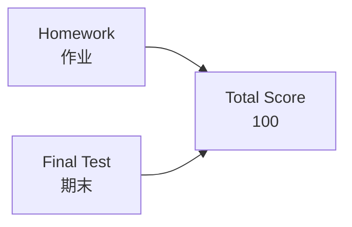

# C1.0 课程信息与 C++ 预备

> [!abstract] 本节地图
> ```mermaid
> flowchart LR
>   A["1.1 Why<br/>为什么学"] --> B["1.2 Rules<br/>课程规则"] --> C["1.3 C++ review<br/>模板与指针"]
>   C --> D["1.1 数据结构<br/>见 C1.1"]
> ```

> [!info] 标注说明
> 标有 **（拓展）** 或 **【拓展】** 的内容，是**课堂上没有讲到、由课件和教材延伸补充**的部分。
> 复习时可先掌握未标注的主干内容，行有余力再看拓展部分。

## 一、课程与教师信息

| 项目 | 内容 |
| --- | --- |
| 课程 | DATA STRUCTURE（数据结构） |
| 授课教师 | Ya-Hui Jia（贾雅慧） |
| 单位 | SFT, SCUT（华南理工大学 未来技术学院） |
| 邮箱 | jiayahui@scut.edu.cn |
| 课程群 | 群名称 Data Structure，群号 **309044012** |
| 群里提供 | Slides（课件）、Books（书）、Homework（作业）、Project（项目） |

> [!important] 群里到底有什么
> 课件第一页放二维码不是走形式——**所有资料只在 QQ 群发**，缺群等于缺资料：
> - **Slides**：每次课的课件；
> - **Books**：**两本教材的电子版都已上传到群文件**，可直接下载，不必买纸质书；
> - **Homework**：作业在群里布置；课后想确认作业细节，回群里看；
> - **Project**：项目相关通知。
>
> 一条约束：**下载后不要再上传到互联网上**，避免版权风险。

## 二、Why：为什么要学（Big Picture / Small Picture）

**Big Picture**：课件列出 Microsoft、Hadoop、Linux、Spark、iOS、PyTorch 六个 logo，配一句 "Learning Data Structure for Great rejuvenation of China."（为中华民族伟大复兴而学数据结构。）

> [!note] 这句口号是认真的
> 放这句话不是玩笑：当下在几乎所有技术领域都存在竞争关系——从**操作系统**（我们正在发展自主操作系统）到各类现代软件，尤其是**大语言模型**（目前基本形成美国与中国两大阵营）。这些系统的底层能力，正是从这门课的内容累积起来的。

> [!note] 这一页想说什么
> 这些不是随便挑的图标：操作系统的进程调度用队列、Hadoop/Spark 的 shuffle 用哈希表与排序、PyTorch 的计算图就是**有向无环图 (DAG)**。也就是说，你以后接触的每一个"大系统"，拆开来都是这门课的几种结构在反复组合。对做 AI 的人尤其直接：张量是数组、计算图是图、自动微分的反向传播是图上的**拓扑排序 (topological sort)**。

**Small Picture**（更现实的五条理由）：

1. 它是必修课 ☺。
2. 它是所有计算机相关专业的基础课 (basic course)。
3. 它是很多高级课程的地基（编译原理、操作系统、数据库、算法设计、机器学习）。
4. 它帮你找到好工作（面试八股的主战场）。毕业后想找算法或软件开发相关的工作，**面试大多要求现场写代码解决一个数据结构问题**，以此考察编程能力。
   - 补一句现实判断：**大模型辅助编程已经是趋势**，但你仍然必须掌握基础知识——否则无法调试自己的算法，也无法把它改得更好。
5. 它是 **408** 的一部分 ☹。
   - **408 是什么**：考研（硕士研究生入学考试）计算机学科专业基础综合的**统考科目代码**，内容为：**数据结构 + 计算机组成原理 + 操作系统 + 计算机网络**。
   - 为什么点出这条：如果最终没能拿到保研资格、或者绩点不够理想，考研是常见的下一条路，而**数据结构正是 408 的组成部分之一**——现在学扎实，等于提前准备。

## 三、目标与先修要求

> [!important] Objectives 三层目标（递进关系）
> 1. **Understand** the basic concepts —— 理解基本概念（最基础的一层，考试主要考这层）
> 2. **Implement** typical data structures —— 亲手实现典型数据结构（作业/项目考这层）
> 3. **Solve** specific problems —— 用它解决具体问题（最高一层，工程与竞赛考这层）

> [!important] 课堂提问：三个目标里哪一个"当下最不重要"？
> 答案是 **第 2 层「实现」**。理由：**现在有大模型可以辅助你把数据结构实现出来、把代码写出来。**
> 但这恰恰反证了第 1 层的重要性：**理解基本概念，才是你能与大模型有效沟通、准确表达需求，并且看懂、调试、改进它产出的代码的前提。** 而第 3 层「解决具体问题」，永远是任何一门课的最终目标。
> 这也解释了本课的考核重心为什么在概念理解上。

**Requirements（先修）**：
- 「Discrete Mathematics」离散数学 —— 本章 1.2 的六种关系直接来自离散数学的关系理论（自反、对称、传递）。**若离散数学在你的培养方案里不是必修，强烈建议选修**：它的基本知识对本课很重要。
- 「C++」—— 模板与指针是本课全部代码的语言底座。

## 四、考核与课堂规则



> [!warning] 成绩比例有两种口径，以群里/教务通知为准
> - **课件写的是**：Homework **30** + Final Test **70** = 100
> - **课堂上口述的是**：Homework **40%** + Final Test **60%** = 100
>
> 两者都记下来，最终以课程群或教务系统公布的为准。无论哪种口径，结论一致：**平时作业是能不能及格的关键筹码**（见下面的挂科数据）。

- **Homework + Final Test = Total 100**
- 不鼓励逃课，但鼓励自学（"Skipping is not encouraged but I do encourage you to learn more by yourself."）
- 迟到就安静地从后门找个后排座位坐下。
- **不要打扰别人**（Do **NOT** disturb others）。
- **不考勤**：本课程日常**不点名**。理由是"作业做完、期末通过，没理由不给高分"。
  - 但有一个例外：学校督导来听课检查时会有**形式化考勤**（考核的是授课教师，不是学生）。若能提前得到消息，会在群里通知，那一周尽量到场；如果到场率明显不足（比如不到一半），形式化考勤就会变成真考勤。

> [!warning] 这门课的难度：很可能是本学期最难的一门
> - **每年约 30%–40% 的学生期末考试不及格**，他们最终能通过这门课，是靠平时成绩把总分拉起来的。
> - 更早一届的数据：加上期末考试后，**平均每个班挂 15 人**——可以想象 60、70 分段有多密集。
> - 直接后果：**这门课在很大程度上决定了谁能保研、谁不能保研。**
> - 授课教师给出的承诺很简单：**"你来上课就行"**——只要坚持来上课，就能通过这门课。
>
> 结合上面的"不考勤"一起理解：**不点名不等于可以不来**，因为不来的代价在期末体现，而不是在考勤分上。

## 五、教材与参考书

> [!important] Textbook（教材）
> Mark Allen Weiss，《Data Structures and Algorithm Analysis in C++, **Fourth Edition**》，电子工业出版社 (Publishing House of Electronics Industry)

> [!note] Reference（参考书）
> Clifford A. Shaffer，《Data Structures and Algorithm Analysis in C++, **Third Edition**》，电子工业出版社

> [!important] 实际口径：两本书任选其一都可以当教材
> 课件把 Weiss 标为 Textbook、Shaffer 标为 Reference，但课堂上明确说：**这两本书任何一本都可以作为教材，另一本作参考，你自己选。** 两本内容只有细微差别。
> **两本的电子版都已上传到 QQ 群文件**，不想买纸质书就直接读电子版。
>
> 风格差异（可作为选择依据）：Weiss 偏"实现 + 分析"，Shaffer 偏"讲清楚为什么"，看不懂一本时对照另一本。

> [!warning] 读教材前的前置条件
> 想读懂这两本书里的程序，**必须先掌握 C++ 模板 (template)**。如果之前的编程课没有讲到模板，请自学补上——否则书里的代码根本读不下去。这也是下面 7.1 节存在的原因。

## 六、Project（大作业）

> [!important] Project 的安排
> - 课件上写的是 **"I have not decided yet."**（尚未决定做什么题目），这一点课堂上确认仍然成立。
> - 已经确定的部分：**Project 属于下学期的《数据结构实践》课程**，不是本学期这门课的考核内容。
> - **分组要求**：4–5 人一组，**最多不超过 5 人**。
> - **允许单干**：如果实在不想组队，一个人做也可以。
> - 现在就可以开始物色队友。

## 七、C++ 复习（1.3）

### 7.1 模板 Template

> [!important] 模板要解决的问题
> 想做一个**能装任何类型**的链表或数组（int、double、char……）。没有模板就得为每种类型各写一遍类；模板让"类型"变成参数，**避免为每种数据类型重复实现同一个类或函数**。
>
> 另一个更容易上手的例子：写一个"把两个数组对应位置相加"的函数。没有模板，就要为 `int`、`double`、`float`、`unsigned` 各写一份**逻辑完全相同**的函数；用模板只写一份，就能对所有这些类型生效。

```cpp
template <typename Type>
Type sqr( Type x ) {
    return x*x;
}
```

完整示例：

```cpp
#include<iostream>
using namespace std;

template <typename Type>
Type sqr( Type x ) {
    return x*x;
}

int main() {
    cout << "3 squared is "  << sqr<int>( 3 ) << endl;
    cout << "Pi squared is " << sqr<double>( 3.141592653589793 ) << endl;
    return 0;
}
```

> [!note] 补充：编译期发生了什么（拓展）
> `sqr<int>` 和 `sqr<double>` 不是"一个函数被调用两次"，而是编译器**实例化 (instantiate)** 出了两份独立的机器码。这就是 C++ 模板号称"零运行时开销"的原因：泛型的代价在编译期付掉了，代价是编译变慢、报错信息变长。
> 后面 `SqList<T>`、`LL<T>`、`Node<T>` 全部靠这个机制，见 [[C2.4 顺序表实现]]。

### 7.2 指针 Pointer

> [!important] 指针的核心直觉
> 每个变量都存放在内存的某个位置，**这个地址本身就是一个整数**——既然是整数，为什么不能把它存进另一个变量里？能存地址的变量就是指针。
> 存放着某个数据地址的那个变量，就叫这个数据的**指针 (pointer)**。

> [!note] 关于"看不懂指针"这件事
> 指针是 C 里最简单的想法之一，却是**绝大多数学生最过不去的一关**。现在读完定义仍然没有"通"的感觉是完全正常的——很多人是在后续学期、甚至更晚的某一天突然理解的。
> 但本课程会**大量**使用指针（整个第 2 章的链表、后面的树和图都靠它），所以看不懂也要先把用法练熟：**先会用，再理解**。
> 课件角落那张 xkcd 漫画是个双关冷笑话：一个人说"我这游戏打得太烂，能不能给我点 pointers（指点）"，对方甩给他一串内存地址（`0x3A28213A` 之类）。

```cpp
int m = 5;    // m is an int storing 5
int* ptr;     // a pointer to an int
ptr = &m;     // assign to ptr the address of m
cout << ptr << endl;
```

输出形如 `0xffffd352`，是一个 **32 位数字**（该机器使用 32 位地址）。

> [!warning] 易错点
> - `int* ptr` 中的 `*` 是**声明**指针；`*ptr` 中的 `*` 是**解引用**取值。同一个符号两种含义，是初学者最大的坑。
> - `ptr` 打印的是地址，`*ptr` 打印的才是 5。
> - 64 位系统上地址是 64 位（如 `0x7ffee3b4c8`）；课件里是 32 位环境。
>
> **随堂小测（自己动手做）**：`sizeof(int)` 是多少字节？`sizeof(double)` 呢？
> 参考答案：常见平台上 `int` 为 **4 字节**，`double` 为 **8 字节**；但**这依赖于平台和编译器，并非绝对**。建议自己在电脑上（甚至用虚拟机换不同操作系统）`cout << sizeof(int)` 实测一遍。这个数字在 [[C1.4 物理结构与存储分配]] 的地址公式 $Loc(i)=L_0+i\times u$ 里就是那个 $u$。
> - 术语上要分清（[[C2.5 单链表实现]] 会再强调）：`p` 是"结点的地址"，`Node *p` 声明的是"指向真结点的指针"；口头说"结点 p"时，指的其实是"p 指向的那个结点"。

### 7.3 内存分配 Memory Allocation

课件明确：C++ 有更高级的分配方式（智能指针等），但本课**只用最基础的 new/delete**，因为它把发生的事显式地摆出来。

> [!note] 为什么不用智能指针
> C++11 之后有**智能指针 (intelligent / smart pointer)**，例如 `shared_ptr`——它本质上是一类"包装过的指针"，**你忘记写 delete，它会替你释放**。
> 但智能指针属于高级程序设计的内容，**不在本课范围内**。本课坚持"**每一个 new 都对应一个 delete**"的写法，目的就是把内存分配与释放的过程完全显式地暴露出来，方便理解链表等结构在内存里到底发生了什么。

```cpp
int* x = new int(2);          // 分配 1 个 int，初值 2
cout << x << endl << *x << endl;
delete x;                     // 单个对象用 delete

int* x = new int[2];          // 分配 2 个 int 的数组
cout << x << endl << *x << endl;
delete[] x;                   // 数组必须用 delete[]
```

> [!important] 一个必须想清楚的问题：`new int[2]` 之后 `*x` 是什么？
> 对照两段代码：
> - `int* x = new int(2);` → `cout << x` 输出**地址**，`cout << *x` 输出 **2**（因为你明确给了初值 2）。
> - `int* x = new int[2];` → `cout << x` 同样输出**地址**（数组首地址），那么 `cout << *x` 输出什么？
>
> **答案是：不知道，谁也不知道。** 你只是申请了两个 int 大小的空间，**从未往里面写过任何值**，读出来的是那块内存里原本残留的任意内容。
> 这类值叫**未初始化值 / 垃圾值**，读它是未定义行为。**申请空间 ≠ 空间里有有意义的数据**——这个直觉在整个第 2 章（顺序表 `length` 与 `capacity` 的区别）会反复用到：下标在 $[length,\ capacity-1]$ 的格子虽然已分配，但读出来同样是垃圾值。

> [!warning] 三个必错点
> 1. **`new` 配 `delete`，`new[]` 配 `delete[]`**，混用是未定义行为（数组用 `delete` 会漏掉除首元素外的析构）。
> 2. `new int(2)` 是**值为 2 的一个 int**；`new int[2]` 是**两个 int 的数组**。圆括号与方括号一字之差，含义完全不同。
> 3. `delete` 之后指针仍指向原地址（**悬垂指针 dangling pointer**），良好习惯是 `x = nullptr;`。
>
> 在 [[C1.6 代码复杂度的计算方法]] 里，`new`/`delete` 被明确标红列为"需要考虑代价"的操作——它们不是 $\Theta(1)$ 那么简单，实际要向操作系统申请堆内存。

---

## 本节自测 Self-Test

> [!question] Q1：模板到底省了什么？
> **A**：省的是"为每种类型重写一遍代码"。编译器仍会为每个用到的类型生成一份代码，所以省的是**人工**，不是**代码体积**。

> [!question] Q2：`int* p; cout << p;` 和 `cout << *p;` 分别打印什么？
> **A**：前者打印 p 保存的**地址**，后者打印该地址处的**值**。若 p 未初始化，两者都是未定义行为。

> [!question] Q3：为什么本课不用 `vector`、`shared_ptr` 这些现成设施？（部分为拓展）
> **A**：因为本课要造的正是 `vector` 这类设施本身。用 new/delete 才能看清"容量、搬移、释放"这些在 STL 里被藏起来的代价，见 [[C2.4 顺序表实现]]。

> [!question] Q4：这门课的成绩怎么构成？教材用哪本？
> **A**：作业 + 期末，比例有 30/70（课件）与 40/60（课堂口述）两种口径，以群里通知为准；两本书任选其一作教材，电子版都在 QQ 群文件里。

> [!question] Q5：`int* x = new int[2]; cout << *x;` 会输出什么？
> **A**：不确定的垃圾值。只分配了空间但从未赋值，读取属于未定义行为。

> [!question] Q6：本课程点名吗？不来上课的真正代价是什么？
> **A**：日常不点名（督导检查时有形式化考勤）。真正代价在期末——每年 30%–40% 的学生期末不及格，靠平时分才通过，而这门课很大程度上决定保研资格。

> [!question] Q7：三个课程目标里，哪一个当下最不重要？为什么？
> **A**：**Implement（实现）** 最不重要，因为现在有大模型辅助写代码。**Understand（理解基本概念）** 反而最基础——你得先理解概念，才知道如何向模型表达你要什么、才能调试和改进它给出的代码；**Solve（解决具体问题）** 始终是最终目标。

---

**上一节**：无（本章起点） ｜ **下一节**：[[C1.1 数据结构的基本概念]]
**索引**：[[数据结构 MOC]]
