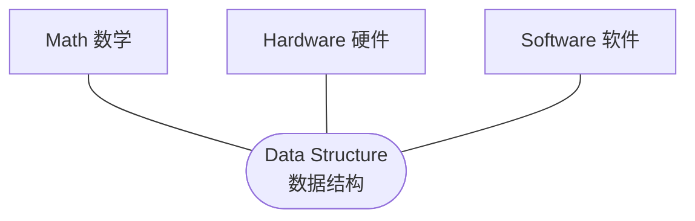
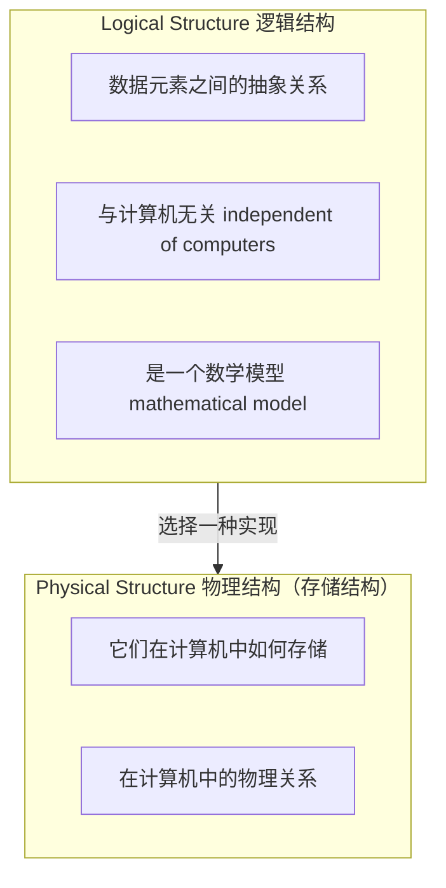

# C1.1 数据结构的基本概念

> [!abstract] 本节地图
> ```mermaid
> flowchart TD
>   L["图书馆的例子<br/>Library"] --> D["数据结构的定义<br/>Definition"]
>   D --> H["历史 History"]
>   D --> W["定位 Where：数学/硬件/软件的交集"]
>   D --> T["四层术语<br/>Data ⊃ Object ⊃ Element ⊃ Item"]
>   T --> S["数据结构 = 数据元素 + 结构(关系)"]
>   S --> TL["两个层次<br/>逻辑结构 / 物理结构"]
> ```

> [!info] 标注说明
> 标有 **（拓展）** 或 **【拓展】** 的内容，是**课堂上没有讲到、由课件和教材延伸补充**的部分。
> 复习时可先掌握未标注的主干内容，行有余力再看拓展部分。

## 一、从图书馆讲起（Library）

课件连放三张图书馆的照片：一个造型古怪的树状书架（"whatever"）、一面整齐的书墙（"Maybe by name?"）、一座巨大的现代图书馆（"How about this!"）。

> [!important] 三张图是一条按「规模」递进的思路链
> 问题始终是同一个：**你有一堆书，怎么组织它们？**
> 1. **只有几本书**（第一张图，"whatever"）：随便放。按颜色放、按心情放都行，因为一眼就能看到，随手就能拿到，**不需要结构**。
> 2. **书多了一些**（第二张图，"Maybe by name?"）：开始需要规则了——按**书名**排，或者按**作者名**排。
> 3. **多到开一间图书馆**（第三张图，"How about this!"）：这时必须有一套真正的组织体系。
>
> 关键结论：**图书馆本身就是一种古老的数据结构**——在数据都还存在纸上的年代，"怎么组织这些数据"就已经是一门学问了；**"图书馆学"至今仍是一个独立的专业。**
> 由此得到整门课的中心问题：**同样的数据，换一种组织方式，操作代价就完全不同。** 随便堆要一本本翻（$O(n)$），按名字排可以二分（$O(\log n)$），分学科分区相当于建了索引。后面每一章都是这句话的具体展开。

## 二、什么是数据结构（Definition）

> [!important] Definition 数据结构 Data Structure
> - A data structure is a **specialized format** for organizing, processing, retrieving and storing data.
>   （数据结构是用于**组织、处理、检索、存储**数据的一种专门格式。）
> - A data structure is a **data organization, management, and storage format** that enables efficient access and modification.
>   （数据结构是一种使**高效访问与修改**成为可能的数据组织、管理与存储格式。）
> - ……（课件用省略号表示：定义有很多版本，不必背某一句）

> [!important] 两条定义里，最值得抠的是「efficient」
> 定义有很多版本，课件只挑了两条，**不必背某一句**。正确的读法是找它们的公共词与差异词：
> - **公共词**：format（格式）、organizing / organization（组织）、storing / storage（存储）——说明数据结构的核心是"怎么组织和存放"。
> - **差异词**：第二条里有一个第一条没有的关键词——**efficient（高效）**。
>
> 为什么这个词最重要？**把书全部随便堆在地上，你照样能访问和修改它们，那也算是一种"数据结构"——但它不高效**，找一本书要花掉大量时间。
> 所以：**数据结构的目标不是"能存能取"，而是"高效地存取与修改"（efficient access and modification）。**

> [!note] 从定义里还能读出：数据结构不做数学计算
> 通读这两条定义，出现的词全部是 organizing、processing、retrieving、storing、access、modification、management，**没有任何加、减、乘、除这类数学运算的词**。
> 这就是 [[C1.2 抽象数据类型与容器操作]] 里那句 "It is **not** for numerical calculation" 的来源：数值计算是"计算方法"课的事，数据结构关心的是**数据的组织与搬移**。

## 三、历史 History

> [!important] Seeding Stage（萌芽期）
> 60 年代初，"数据结构"相关内容**散落在操作系统、编译原理等其他课程中**。**1968 年**，"Data Structure" 在部分美国大学中成为一门独立课程。

> [!important] Developing Stage（发展期）
> 此后"数据结构"快速膨胀，纳入了**图论 (graph theory)、集合论 (set theory)** 等内容。**70 年代末**成为部分中国高校的课程。大数据时代它仍在扩张，但本课不会讲那么远。

> [!note] 补充：1968 年为什么是关键年份（拓展）
> 这一年正是 Knuth《The Art of Computer Programming》第一卷出版、以及 NATO 提出"软件危机 / 软件工程"的年份。数据结构独立成课的动机就是：程序规模一大，**数据怎么组织**比**语句怎么写**更决定成败。

## 四、数据结构的定位 Where



课件用三个相交的圆表示：数据结构处在**数学、硬件、软件三者的交集**上。

> [!note] 三个圆各贡献了什么
> - **数学**：关系、集合、递推式、极限（$\Theta/O$ 的定义就是极限）。
> - **硬件**：数组之所以快是因为**内存连续 + CPU 缓存局部性**；链表之所以慢是因为指针跳转破坏局部性。
> - **软件**：ADT、封装、模板——把结构做成可复用的类。
> 这解释了为什么它的先修课是离散数学与 C++。
>
> 另外要明确：本课学的都是**很基础、很传统**的数据结构。大数据时代有大量高级结构，但先掌握这些基础，才具备分析和设计那些高级结构的能力。

## 五、四层术语（Concept and Terminology）

> [!important] 四个概念的包含关系（由大到小）
> ```mermaid
> flowchart LR
>   A["Data 数据<br/>anything that is used to describe a thing<br/>and can be put into a computer and processed"]
>   B["Data Object 数据对象<br/>a set of data elements with the same attributes<br/>（具有相同属性的数据元素的集合）"]
>   C["Data Element 数据元素<br/>an atomic unit of data that has precise meaning<br/>or precise semantics（语义）"]
>   D["Data Item 数据项<br/>an atomic state of a particular object<br/>concerning a specific property at a certain time point"]
>   A --> B --> C --> D
> ```

课件用**两张表**贯穿演示这四层（这是本节最该记住的图）：

**表 1（学生表）**

| Name | Gender | Age | Class |
| --- | --- | --- | --- |
| Mei-Mei Han | Female | 17 | Big data 1 |
| Lei Li | Male | 18 | Big data 2 |

**表 2（课程表）**

| Course | Teacher | Credit |
| --- | --- | --- |
| Data Structure | Ya-hui Jia | 3.5 |
| Machine Learning | Mr. who | 2.5 |

对应关系逐层拆开：

| 层次 | 在例子中对应什么 | 课件怎么圈的 |
| --- | --- | --- |
| **Data 数据** | 两张表**合起来**的全部内容 | 一个大框把两张表都框住 |
| **Data Object 数据对象** | 学生表是 Data Object 1，课程表是 Data Object 2 | 两张表分别框住 |
| **Data Element 数据元素** | 学生表中的**一整行**，如 (Mei-Mei Han, Female, 17, Big data 1) | 红圈圈住一整行 |
| **Data Item 数据项** | 一行中的**一个格子**，如 "Lei Li" | 红圈只圈一个单元格 |

> [!note] 这张表的读法（三个要点）
> 0. **只需要记住左边那一列的包含关系，四条定义本身不必背。** 由大到小：Data ⊃ Data Object ⊃ Data Element ⊃ Data Item。
> 1. **数据元素是"操作的最小整体"**：删除一个学生是删掉整行，不会只删掉他的年龄。所以后面所有算法的"一个元素"指的都是这一整行。数据元素在别的课程里也常被称作**一条记录 (record)** 或**一个条目 (entry)**。
> 2. **数据对象要求"同属性"**：学生表的两行属性相同（都有 Name/Gender/Age/Class），所以能构成一个对象；把学生行和课程行混在一起就不是一个数据对象了。这一点在 [[C2.1 线性表的定义与特性]] 会再次出现——"同一个表中的元素类型相同"。
> 3. **数据项的定义带"某个时间点 (at a certain time point)"**：因为年龄会变，数据项是"此刻的取值"，不是永恒属性。

> [!warning] 课程明确约定：object 与 element 会被混用
> 课件原话："However, sometimes if you check some English books or courses, you may find that **'object' and 'element' both mean 'element'**. So, for the rest of our class, I may misuse them, but you need to understand that in most cases, I mean **element**. If it is truly an **object**, I will tell you."
> **为什么会混用**：因为在绝大多数场景里，我们**只处理一个 data object**（比如就一张学生表），很少需要同时谈论多个数据对象，于是两个词就被当成一个用了。
> **实践口径**：以后听到 object，默认按 element 理解；真的指"数据对象"时会特别声明。课件后续若出现这种误用，不必纠结。
> **考试口径**：如果题目出现"数据对象"，仍按严格定义答——**具有相同性质的数据元素的集合**。
>
> 顺带记住一个更普遍的事实：**计算机领域的术语至今没有完全统一**，很多定义在不同教材里写法不同、甚至互相混用。遇到时以本课的口径为准。

## 六、数据结构 = 数据元素 + 结构

> [!important] 一句话定义
> A data structure is **a set of data elements** with specific "**structure**".
> "**Structure**" means the **relationship** between data elements.
> （数据结构 = 一组数据元素 + 它们之间的**关系**。）

> [!warning] 这句定义本身"像是废话，但确实说明了问题"
> "数据结构 = 一组数据元素 + 特定的结构"——单看这句几乎等于没说。它的信息量全在第二句上：**"结构"这个词被定义为"数据元素之间的关系"**。抓住"关系"这个词，这条定义就立住了。

> [!note] 为什么"关系"才是主角
> 数组和链表存的元素可以一模一样，区别只在"关系是怎么表达的"：数组用**位置相邻**表达前后关系，链表用**指针**表达。关系的表达方式一变，操作代价就全变了。
> 这句话是整章的种子：1.2 节把"关系"分成六类（[[C1.3 数据元素间的六种关系]]），第 2 章开始就是逐个实现这些关系。

## 七、数据结构的两个层次（Two Layers of DS）



| | Logical Structure 逻辑结构 | Physical Structure 物理结构 |
| --- | --- | --- |
| 关心什么 | 元素之间的**抽象**关系 | 元素在内存里**怎么放** |
| 是否依赖计算机 | 不依赖，是数学模型 | 依赖，就是内存布局 |
| 课件配图 | 一个"人脑"图标 | 一叠"数据库/磁盘"图标 |

> [!important] 一个绝佳的比喻：按身高排队
> 想象让全班同学按身高重新排序：
> - **只在脑子里排**：告诉大家"按身高排一下，但都别动"。此时每个人心里都清楚谁是第一个、谁是最后一个——**这个顺序真实存在，但没有任何人挪动位置**。这就是**逻辑结构**：抽象的、数学的、与计算机无关的关系。
> - **真的动起来**：最矮的同学坐到这个角落、最高的坐到那个角落，所有人换座位。**现实中的座位安排**才是**物理结构**。
>
> 一句话：**逻辑结构在你脑子里，物理结构在内存里。**

> [!important] 物理结构具体指内存里的事
> 说"物理结构"时，指的就是数据在**计算机的内存 (memory)** 中如何存放、彼此的物理位置关系如何。
> （补充一句现在的情况：谈"内存"时往往还要把 **GPU 显存**算进去，见 [[C1.5 算法与渐进分析]]。）

> [!important] 一对多的关系（考试高频）
> **一个逻辑结构是唯一的，但它的物理结构不唯一。**（课件在 [[C1.4 物理结构与存储分配]] 的总览图上明确标注：Logical Structure (**unique**)，Physical Structure (**nonspecific**)。）
> 例：逻辑上都是"线性表"，物理上既可以是顺序存储（数组），也可以是链式存储（链表）。同一个逻辑结构选不同的物理结构，就得到不同的时间/空间代价——这正是第 2 章 2.6 节比较表的全部内容，见 [[C2.7 两种实现的比较]]。

> [!warning] 易错点
> - "线性表"是**逻辑结构**；"顺序表""链表"是**物理结构（存储结构）**上的实现。把"线性表"和"顺序表"当同义词是最常见的错。
> - 栈和队列也是逻辑结构，各自都有顺序实现和链式实现。

---

## 本节自测 Self-Test

> [!question] Q1：数据、数据对象、数据元素、数据项，用一张学生表各举一例。
> **A**：整张表（连同别的表）是数据；学生表本身是一个数据对象；"Lei Li, Male, 18, Big data 2"这一行是数据元素；其中的"18"是数据项。

> [!question] Q2：为什么说"逻辑结构唯一，物理结构不唯一"？
> **A**：逻辑结构是数学模型（元素间抽象关系），一个问题一旦确定，关系就定了；但把这个关系落到内存里可以用连续空间（顺序）也可以用指针（链式），因此实现方式不唯一。

> [!question] Q3：课上会混用 object 和 element，考试该按哪个口径答？
> **A**：听课时按 element 理解；考试遇到"数据对象"按严格定义答——**具有相同性质的数据元素的集合**。

> [!question] Q4："结构"这个词的准确含义是什么？
> **A**：数据元素之间的**关系 (relationship)**，不是"形状"也不是"存储方式"。

> [!question] Q5：两条定义里最关键的一个词是什么？为什么？
> **A**：**efficient**。把书随便堆着也能存取，那也是一种组织方式，但不高效；数据结构追求的是高效的访问与修改。

> [!question] Q6：用"按身高排队"解释逻辑结构与物理结构的区别。
> **A**：只在脑子里排出顺序、人不动 = 逻辑结构；真的换座位、按身高坐好 = 物理结构。

> [!question] Q7：为什么 object 和 element 会被频繁混用？
> **A**：因为多数场景下只涉及一个数据对象，无需区分两者，久而久之两词被当成同义词使用。

---

**上一节**：[[C1.0 课程信息与C++预备]] ｜ **下一节**：[[C1.2 抽象数据类型与容器操作]]
**索引**：[[数据结构 MOC]]
