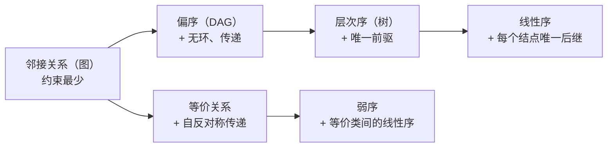

# C1.3 数据元素间的六种关系

> [!abstract] 本节地图
> ```mermaid
> flowchart TD
>   R["六种关系<br/>Six Relationships"]
>   R --> A["Linear ordering 线性序<br/>→ 数组 / 链表 / 栈 / 队列"]
>   R --> B["Hierarchical ordering 层次序<br/>→ 树 Tree"]
>   R --> C["Partial ordering 偏序<br/>→ DAG / 拓扑排序"]
>   R --> D["Equivalence relation 等价关系<br/>→ 并查集 Union-Find"]
>   R --> E["Weak ordering 弱序<br/>→ 等价类上的线性序"]
>   R --> F["Adjacency relation 邻接关系<br/>→ 图 Graph"]
> ```

> [!info] 标注说明
> 标有 **（拓展）** 或 **【拓展】** 的内容，是**课堂上没有讲到、由课件和教材延伸补充**的部分。
> 复习时可先掌握未标注的主干内容，行有余力再看拓展部分。

> [!important] 这六种关系属于「逻辑」层面，不是「物理」层面
> 本节讲的六种关系**全部属于抽象数据类型 ADT 的范畴**——它们描述的是数据元素之间的**逻辑关系**，与数据在计算机里怎么存放无关。
> 讲完这些抽象、逻辑的东西之后，下一节 [[C1.4 物理结构与存储分配]] 才转向物理结构，也就是数据在**内存**里如何存放。

## 一、为什么要研究"关系"

> [!important] 出发点
> However, we may want to store **not only elements, but relationships between the elements**.
> - 因此会产生基于关系的额外操作 (additional operations based on the relationships)。
> - 例：家谱数据库 (genealogical database)——我们不只想存人，还想查人与人之间的关系。
>
> **社交网络是最直观的例子**：在小红书、抖音这类平台上，"你关注了他、他没关注你"是一种**单向关系**；"互相关注"则会被标记为**朋友**，是另一种关系。在这个网络里，**你这个人只是一条数据，而你与其他人之间的关系同样需要被存储**。
>
> 更进一步：**大多数有意思的问题，问的都是关系，而不是数据本身。**

课件给的四个"有意思的问题"，全都是关于关系而非元素本身：

1. Are these two classes derived from the same base class?（两个类是否派生自同一基类？→ **层次关系**）
2. Can I take Data Structure if I failed C++?（挂了 C++ 还能修数据结构吗？→ **偏序/先修关系**）
3. Do both these pixels represent pavement on this image?（这两个像素是否同属路面？→ **等价关系**）
4. Can I get from here to WuShan in under two hours?（两小时内能到五山吗？→ **邻接关系/图**）

> [!note] 逐条看这四个问题问的是什么
> - **第 1 个（同一基类）**：类的继承层次——**层次关系**。
> - **第 2 个（挂了 C++ 能不能修数据结构）**：先修课关系——**偏序**。顺带一个现实差异：**在国内，前序课程没通过通常不影响选修后续课程**（学制固定、学费一次性缴纳）；**在国外则往往强制要求先修课通过才能选后续课**（按课程逐门缴费、逐门修读）。
> - **第 3 个（两个像素是否同属路面）**：**等价关系**。这是计算机视觉的问题——比如在一张医学图像里定位癌细胞，本质是在找像素之间满足什么关系才能把目标区域圈出来。
> - **第 4 个（两小时能否到五山）**：路径可达性——**邻接关系 / 图**。

> [!note] 第 3 个问题与 AI 方向的衔接（拓展）
> "两个像素是否属于同一区域"就是**图像分割 (image segmentation)**。经典做法（如 Felzenszwalb 图分割、连通域标记 connected component labeling）用的正是本节的**等价关系 + 并查集**。语义分割网络输出的 mask，本质上也是在像素集合上定义一个等价关系。

## 二、六种关系总览

课件明确列出六种（Summary of Relations）：Linear orderings、Hierarchical orderings、Partial orderings、Equivalence relations、Weak orderings、Adjacency relations，并总结："All of these are relationships that exist on the elements we may wish to store, access, and query."

| 关系 | 数学性质 | 直观例子 | 对应的数据结构 |
| --- | --- | --- | --- |
| 线性序 Linear ordering | 反对称、传递、任意两元素可比 | 整数、字母表、内存地址 | 数组、链表、栈、队列（第 2–4 章） |
| 层次序 Hierarchical ordering | 传递，每个元素只有一个直接前驱 | 文件目录 | 树 Tree |
| 偏序 Partial ordering | 传递，可有多个前驱/起点 | 课程先修关系 | DAG、拓扑排序 |
| 等价关系 Equivalence relation | **自反 + 对称 + 传递** | 同性别、同区域 | 并查集 Union-Find |
| 弱序 Weak ordering | 等价类之间的线性序 | 按年龄分组再排序 | 排序中的"相等键" |
| 邻接关系 Adjacency relation | 对称（无向图） | 好友关系 | 图 Graph |

## 三、逐个细说

### 3.1 线性序 Linear Orderings

> [!important] 定义
> A linear ordering is any relationship where any two elements $x$ and $y$ that can be compared, **exactly one of**
> $$x < y,\quad x = y,\quad y < x$$
> is true, and where the relation is **transitive**（传递）。
> - 这样的关系是**反对称的 (anti-symmetric)**。
> - 任何集合都可以按这种关系被**排序 (sorted)**。

线性序的例子（课件原表）：

| 类型 | 例子 |
| --- | --- |
| Integers 整数 | 1, 2, 3, 4, 5, 6, ... |
| Real numbers 实数 | 1.2, 1.2001, 1.24, 1.35, 2.78, ... |
| The alphabet 字母表 | a, b, c, d, e, f, ..., x, y, z |
| Memory 内存地址 | `0x00000000, 0x00000001, ..., 0xFFFFFFFF` |

课件结论：线性有序的集合可以用**数组或链表**存储。

> [!important] 最直观的线性序例子：按身高排队
> 让全班同学按身高排成一列，这就是最简单的线性关系：任意两人可比高矮，且满足传递性（A 比 B 高、B 比 C 高 ⟹ A 比 C 高），因此**整个集合可以被排序**。
> "反对称"在这里的含义也很直白：**a 比 b 高，那么 b 就一定不比 a 高。**

> [!note] "三分律"和"传递性"缺一不可（拓展）
> "恰好成立其一 (exactly one)"叫**三分律 (trichotomy)**，保证任意两个元素**必然可比**；传递性保证排序结果**自洽**（不会出现 a<b<c<a 的环）。
> 反例：石头剪刀布的"胜过"关系满足三分律但**不传递**，因此无法排序——这正是"最强的出招"不存在的原因。
> **内存地址本身是线性序**是极关键的一句：正因为地址有序且连续，数组才能用 $Loc(i)=L_0+i\times u$ 直接算地址，见 [[C1.4 物理结构与存储分配]]。

> [!important] 线性序上的查询与操作（课件原文）
> **Queries**：
> - 首元素和末元素是什么（the **front** and the **back**）？
> - 第 $k$ 个元素是什么？
> - 区间 $[a,b]$ 内的所有元素是哪些？
> - 给定容器中某个元素的引用：它的前驱和后继是什么？
>
> 用排队的例子逐条对照：谁最矮、谁最高（首末元素）；**第 $k$ 个是谁**；某个身高区间内有哪些人；某人的前后各是谁。
> 其中"第 $k$ 个是谁"在现实里非常常见：**学院只有 40 或 50 个保研名额时，大家最关心的就是"卡在第 50 名的到底是谁"** ——这就是一次典型的"取第 $k$ 个元素"查询。
>
> **Operations**：
> - 向有序表中插入元素（队伍已按身高排好，新转来一名同学，他该站在哪里？）
> - 在头部、尾部或第 $k$ 个位置插入元素
> - 对一组元素排序

> [!note] 这份清单就是第 2 章的接口
> "前驱/后继""第 k 个""头插/尾插"——[[C2.1 线性表的定义与特性]] 的每一个术语都在这里出现过。**线性表就是"线性序"这个关系的直接实现。**

### 3.2 层次序 Hierarchical Orderings

> [!important] 定义
> $x \prec y$ if $x$ **contains** $y$ within one of its subdirectories（$x$ 在其某个子目录中包含 $y$）。
> 课件例子：Windows 文件系统
> ```mermaid
> flowchart TD
>   TC["This computer"] --> C["C:/"]
>   TC --> D["D:/"]
>   C --> W["Windows"]
>   C --> P["Program Files"]
>   D --> S["Study"]
> ```

> [!important] 层次序上的查询（Operations on Hierarchical Orders）
> 若层次序是显式定义的（**the usual case**，通常情况），给定两个元素可以问：
> - 一个是否是另一个的前驱？（Does one element precede the other?）
> - 两者是否处于**同一深度**？（Are both elements at the same depth?）
> - 它们的**最近公共前驱**是谁？（What is the **nearest common predecessor**?）

> [!note] 三点补充（第 1 条为拓展）
> 1. **【拓展】"最近公共前驱"就是后面树那一章的 LCA（Lowest Common Ancestor）**，是树的经典问题。课堂上给的类比是**族谱**：两支同源的家族现在各自传到第几代（是否处于同一深度）、最近的共同祖先是谁——问的正是这三类问题。
> 2. 层次序的判定特征：**每个结点最多只有一个直接前驱**（一个文件夹只能有一个父文件夹）。这正是"树"与"图"的分界线。
> 3. 层次序**不是全序**：`C:/Windows` 和 `D:/Study` 之间没有先后关系，两者不可比。所以层次序也是一种偏序，只是加了"唯一父亲"的约束。

### 3.3 偏序 Partial Orderings

> [!important] 定义
> $x \prec y$ if $x$ **is a prerequisite of** $y$（$x$ 是 $y$ 的先修课）。
> **This is not a hierarchy**, as there are **multiple starting points** and **one class may have multiple prerequisites**.
> （不是层次结构：起点不唯一，一门课可以有多门先修课。）
> 课件配图是一张课程先修关系网（MATH 117 → MATH 119 → ECE 205 → …），线条交叉，明显不是树。

> [!important] 为什么它一定不是层次结构：看 MATH 215
> 图中 **MATH 215 没有任何前序课程**，它被画在第三学期。但你完全可以在第一学期或第二学期修它。
> 于是问题来了：**它的"深度"到底是多少？** 按图上位置算是 3，按最早可修算是 1——**它根本没有确定的深度**。
> 而层次结构（树）里每个结点的深度是唯一确定的，因为**每个结点只有一个直接前驱**。偏序则允许多个起点、允许一门课有两三门不同的前序课程，所以深度不唯一。**这就是偏序与层次序的分界。**

> [!important] 偏序上的操作（与层次序对比着记）
> - 给定两元素，一个是否先于另一个？
> - 哪些元素**没有前驱**？（**Not unique**，不像层次结构只有一个根）
> - 哪些元素**直接先于**某元素？（层次序只有**一个**直接前驱，偏序可以有多个）
> - 哪些元素**直接后继**某元素？

> [!note] 偏序 = DAG，操作 = 拓扑排序（拓展）
> 偏序关系画出来就是**有向无环图 (DAG)**。"哪些元素没有前驱"就是**入度为 0 的结点**，反复取入度 0 的结点就是**拓扑排序 (topological sort)**——排课表、编译依赖、Makefile、任务调度全靠它。
> **PyTorch 的 autograd 计算图就是一个 DAG**，反向传播的执行顺序就是它的拓扑序。这是本节离你专业最近的一条。

### 3.4 等价关系 Equivalence Relations

> [!important] 定义
> $x \sim y$ if $x$ and $y$ are of the **same gender**。
> 性质：This relationship is **symmetric and transitive**, but it is also **reflexive**:
> $$x \sim x \quad \text{for all } x$$
> 课件配图：几个圆点集合分别标注 XY、XX、XYY、XXY——即按性染色体分成若干**等价类 (equivalence class)**。

> [!important] 等价关系上的操作（Operations on Equivalence Relations）
> - 两个元素是否相关？
> - 遍历与某元素相关的所有元素
> - 统计与某元素相关的元素个数
> - 给定两个当前不相关的元素 $x, y$，**让它们相关（union 合并）**
>   - Not so easy：everything related to $x$ must now be related to everything related to $y$（与 $x$ 相关的一切都必须与 $y$ 相关的一切建立关系）

> [!note] 三条补充（第 3 条为拓展）
> 1. **等价关系 = 自反 + 对称 + 传递**（离散数学的标准三条），比线性序多了"自反"少了"可比"。它的作用是把集合**划分 (partition)** 成互不相交的等价类：同一个集合里的所有元素**彼此等价**。
> 2. 课件配图特意画了 XYY、XXY 两个小圆——提醒**等价类的大小可以差很多，而且划分必须覆盖全体、互不重叠**。
> 3. **【拓展】** 那句"Not so easy"是**并查集 (Union-Find / Disjoint Set)** 的引子：朴素做法合并两个类要 $O(n)$，而带路径压缩 + 按秩合并的并查集能做到近似 $O(1)$（准确说是反 Ackermann 函数 $\alpha(n)$）。这是后面的重要算法。

### 3.5 弱序 Weak Orderings

> [!important] 定义
> $x \sim y$ if $x$ and $y$ are the **same age**，并且 $x < y$ if $x$ is **younger than** $y$。
> **A weak ordering is a linear ordering of equivalence classes.**（弱序是**等价类之间的**线性序。）
> 若 $x$ 与 $y$ 同龄或更年轻，记 $x \lesssim y$。
> 课件配图：按年龄 -1、17、18、19、20、21、33?、41 排成一列的圆点堆，圆的大小表示该年龄的人数。

> [!important] 弱序 = 先分类，再把类排序
> 两步理解：**先按等价关系把元素分成若干类**（比如同年龄的人归为一类：17 岁一堆、18 岁一堆、19 岁一堆……），**再挑一个属性把这些类按线性关系排起来**（按年龄从小到大）。
> 所以弱序里"排序"的对象不是单个元素，而是**一整个等价类**。类内部的元素不分先后。
> 本课后续不会深入讨论弱序，但它会在 [[C1.5 算法与渐进分析]] 里以另一副面孔出现：**函数按"增长率"构成的正是一个弱序**。

> [!important] 弱序上的操作
> 与线性序、等价类的操作相同，但注意：
> - **可能有多个最小或最大元素**（There may be multiple smallest or largest elements）
> - **"下一个"或"上一个"元素可能与当前元素等价**（The next or previous element may be equivalent）

> [!note] 弱序是排序算法"稳定性"的来源（拓展）
> 排序时若两条记录的键相等（同一等价类），它们谁在前？保持输入相对次序的排序叫**稳定排序 (stable sort)**（归并、插入、冒泡稳定；快排、堆排不稳定）。**弱序 = 允许并列名次的排名**：奥运奖牌榜、比赛并列第一，都是弱序而非线性序。
> 课件里那个"-1"和"33?"的圆点是玩笑式的标注（年龄 -1 和存疑的 33 岁），但也提示：**弱序允许异常值单独成类**。

### 3.6 邻接关系 Adjacency Relations

> [!important] 定义
> $x \leftrightarrow y$ if $x$ and $y$ **are friends**。
> Like a tree, we will display such a relationship by **drawing a line connecting two individuals if they are friends (a graph)**。
> 课件配图：一张社交网络图，人形图标间连线交错。
>
> 现实中的社交网络也可以是**单向**的：某人关注了对方，对方没有回关。双向互关才被平台标记为"朋友"。两种情形都属于邻接关系，区别只在于**有向还是无向**。

> [!note] 邻接关系的特点（末两条为拓展）
> - 用双箭头 $\leftrightarrow$ 表示它是**对称**的（朋友是相互的）→ **无向图**；如果是"关注"这种单向关系就是**有向图**。
> - 它是**最一般的关系**：不要求自反、不要求传递（朋友的朋友不一定是朋友）、不要求可比。前五种关系都可以看成加了额外约束的图。
> - 因此**图是本课的终点**：数组/链表是"一条线"，树是"分叉的线"，图是"什么都行"。存储方式是邻接矩阵或邻接表。
> - AI 关联：GNN（图神经网络）、知识图谱、社交推荐都直接建立在邻接关系上。

## 四、六种关系的约束强度（自己整理的记忆线索）



> [!warning] 最容易混的两组
> - **层次序 vs 偏序**：唯一区别是"直接前驱是否唯一"。树是特殊的 DAG。
> - **等价关系 vs 弱序**：等价关系只分组不排序；弱序 = 分组 + 组间排序。

---

## 本节自测 Self-Test

> [!question] Q1：六种关系分别对应哪些数据结构？
> **A**：线性序→数组/链表/栈/队列；层次序→树；偏序→DAG/拓扑排序；等价关系→并查集；弱序→带并列的排序；邻接关系→图。

> [!question] Q2：等价关系的三条性质是什么？线性序缺哪一条？
> **A**：自反、对称、传递。线性序不对称（反对称），但要求任意两元素可比。

> [!question] Q3：为什么课程先修关系不是层次结构？
> **A**：因为起点不止一个，且一门课可以有多门先修课（多个直接前驱），而层次结构中每个结点只有一个直接前驱。

> [!question] Q4：弱序与线性序的关键差别？举一个日常例子。
> **A**：弱序允许"并列"，即多个元素同属一个等价类不分先后；线性序中任意两元素必分先后。例：按年龄排队，同龄的人不分先后。

> [!question] Q5：图像分割里"两个像素是否属于同一区域"属于哪种关系？会用到什么算法？（后半为拓展）
> **A**：等价关系；用并查集/连通域标记来维护和合并等价类。

> [!question] Q6：MATH 215 这个例子为什么能说明"先修关系不是层次结构"？
> **A**：它没有前序课程，被放在第三学期但第一学期也能修，因此**深度不唯一**；而层次结构中每个结点只有一个直接前驱、深度唯一。

> [!question] Q7：本节这六种关系属于逻辑层面还是物理层面？
> **A**：逻辑层面，全部属于 ADT 的范畴，与数据在内存中如何存放无关。

---

**上一节**：[[C1.2 抽象数据类型与容器操作]] ｜ **下一节**：[[C1.4 物理结构与存储分配]]
**索引**：[[数据结构 MOC]]
