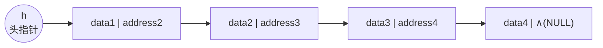
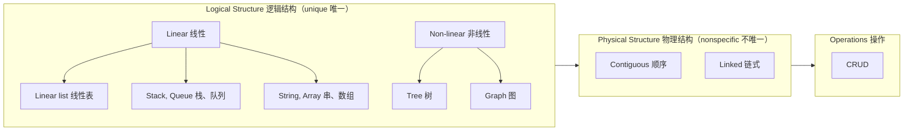

# C1.4 物理结构与存储分配

> [!abstract] 本节地图
> ```mermaid
> flowchart TD
>   M["Memory Allocation<br/>存储分配的三种基本形式"]
>   M --> C["Contiguous 顺序分配<br/>典型：数组 Arrays"]
>   M --> L["Linked 链式分配<br/>典型：链表 Linked lists"]
>   M --> I["Indexed 索引分配（选学）"]
>   C --> S["总览：逻辑结构 / 物理结构 / 操作"]
>   L --> S
> ```

> [!info] 标注说明
> 标有 **（拓展）** 或 **【拓展】** 的内容，是**课堂上没有讲到、由课件和教材延伸补充**的部分。
> 复习时可先掌握未标注的主干内容，行有余力再看拓展部分。

> [!important] 从「逻辑」转向「物理」
> 前面 [[C1.3 数据元素间的六种关系]] 讲的都是抽象、逻辑层面的东西。从本节开始转向**物理结构**——数据在你的计算机里、**具体说是在内存里**如何存放。
> 一句话概括本节：**物理结构的全部内容就是内存分配 (memory allocation)。**

## 一、三种基本的存储分配形式

> [!important] The basic forms of memory allocation
> - **Contiguous** 顺序（连续）分配
> - **Linked** 链式分配
> - **Indexed** 索引分配
>
> 典型代表 (The prototypical examples)：
> - Contiguous allocation → **Arrays 数组**
> - Linked allocation → **Linked lists 链表**
>
> **本课绝大多数时候只考虑前两种**（顺序与链式）；索引分配作为选学内容了解即可。

## 二、顺序分配 Contiguous Allocation

> [!important] 定义与致命限制
> An array stores $n$ elements in a **single contiguous space of memory**（数组把 $n$ 个元素放在一整块连续内存里）。
> Unfortunately, if more memory is required, **you cannot request the OS to allocate the next $m$ memory locations**. You can only allocate a **new array with capacity $n+m$**.
> （不幸的是，需要更多空间时，你**无法**要求操作系统"在原数组后面再接 $m$ 个位置"，只能重新申请一块容量为 $n+m$ 的新数组。）
>
> 对照课件那张图：紫色格子是原有的长度为 $n$ 的数组，绿色是想要追加的 $m$ 个格子。**你能不能直接要求操作系统把紧挨着紫色格子的那几格分给你？不能。**（能做到那是黑客手段，已经越出安全边界，不在讨论范围内。）
> 唯一的办法是：**重新申请一段长度为 $n+m$ 的连续空间，再把原数组里的数据整体拷贝过去。**
>
> 地址公式：
> $$Loc(i) = L_0 + i \times u$$
> 其中 $u$ 是**一个元素的大小 (size of one element)**，$L_0$ 是首地址。

> [!note] 这个公式为什么能成立，以及它的分量
> 内存地址本身是线性有序且连续编号的（见 [[C1.3 数据元素间的六种关系]] 的线性序例子），所以只要知道首地址、元素大小和下标，**一次乘法一次加法**就能算出任意元素的地址——这就是**随机存取 (random access)** 的全部秘密，代价 $\Theta(1)$，与 $n$ 无关。
> 反过来看链表：结点散落各处，地址无法计算，只能顺着指针一个个走，于是访问第 $i$ 个元素变成 $O(n)$。**"能不能算地址"是顺序存储与链式存储所有差异的总根源。**
>
> 公式里的 $u$ 就是**单个元素占多少字节**。随堂小测：`sizeof(int)` 和 `sizeof(double)` 各是多少？常见平台上分别是 **4** 和 **8** 字节，但**依平台与编译器而异**，建议自己写 `cout << sizeof(int)` 实测（甚至可以用虚拟机换不同操作系统对比）。

> [!warning] 易错点：下标从 0 还是从 1
> 课件此处写 $Loc(i)=L_0+i\times u$（下标 **从 0 起**）；而 [[C2.4 顺序表实现]] 里写的是 $Loc(e_i)=L_0+(i-1)\times m$（序号 **从 1 起**）。两式等价，差别只在"第 i 个"是从 0 数还是从 1 数。**做题先确认题目用哪套约定**，这是最常见的送分/送命点。

> [!note] 扩容的真实代价
> "只能申请新数组"意味着扩容必须：申请新空间 → **逐个拷贝 $n$ 个元素** → 释放旧空间，代价 $\Theta(n)$。这段代码在 [[C1.6 代码复杂度的计算方法]] 里作为 `update_capacity` 的例子被完整分析过。
> **【拓展】** STL `vector` 的做法是**每次容量翻倍**，使得 $n$ 次 push_back 的**均摊 (amortized)** 代价是 $O(1)$ 而不是 $O(n)$。这是"均摊分析"的经典入门例子。

## 三、链式分配 Linked Allocation

> [!important] 定义
> 存一个数据元素时，要**同时存两样东西**：
> - **The element itself** —— 元素本身
> - **A reference to the next item** —— 指向下一项的引用
>   - In C++ that reference is the **address of the next node**（在 C++ 中这个引用就是下一结点的地址）
>
> **术语澄清**：C++ 里另有一个概念叫**引用 (reference, `&`)**，但这里说的 "reference to the next item" **实际指的是指针 (pointer)** ——实现链表时用的是指针，不是 C++ 的引用。

课件配图（用 mermaid 复现）：



课件还特意画了一个小方块 `h → address1`：**头指针 h 本身也是一个变量，里面存的是第一个结点的地址**。

> [!note] 这张图要读出的三件事
> 1. 最后一个结点的指针域是 `∧`（即 NULL / 0），**它是遍历的终止条件**，写循环时忘判 NULL 就会越界崩溃。
> 2. 每个结点被拆成"数据域 + 指针域"两格——指针域是**为了表达关系而额外付出的空间**，这就是链表"存储密度低"的原因（见 [[C2.7 两种实现的比较]]）。
> 3. 图中的地址是**逻辑上的箭头**，物理上这四个结点可以散落在内存任何角落。"逻辑相邻 ≠ 物理相邻"是链式存储的定义性特征。

> [!important] 链式分配换来的好处
> 每次需要多存一个数据时，**不必再申请一整段连续的空间，只要申请一个格子**，把数据和"下一个的地址"放进去，再挂到链上即可。
> 直接后果：**内存中任何零散的空闲空间都能被利用起来**。这正是顺序存储做不到的事——它要求一整块连续区域，哪怕总空闲量足够，碎片化的空间也用不上。

## 四、索引分配 Indexed Allocation（选学）

![[C1-索引分配-图示.png]]

> [!important] 定义
> With **indexed allocation**, an **array of pointers** (possibly NULL) link to a sequence of allocated memory locations.
> （索引分配用一个**指针数组**（其中可以有 NULL）指向若干块已分配的内存。）
>
> 它其实是顺序分配与链式分配的**结合**：**先申请一个数组，但这个数组里存的不是数据，而是其他数组的首地址**——它是一个"地址的数组"；再用这些地址各自去指向真正存数据的数组。二维数组就是这么组织的。

课件用一个 $2\times3$ 矩阵演示两种语言的二维数组布局：
$$\begin{pmatrix} 1 & 2 & 3 \\ 4 & 5 & 6 \end{pmatrix}$$

| 布局 | 语言 | 指针数组指向什么 | 内存中的顺序 |
| --- | --- | --- | --- |
| **行优先 Row-major** | **C, Python** | 每个指针指向一**行** | 1, 2, 3, 4, 5, 6 |
| **列优先 Column-major** | **Matlab, Fortran** | 每个指针指向一**列** | 1, 4, 2, 5, 3, 6 |

> [!warning] 这不是冷知识，是性能陷阱（拓展）
> - 遍历二维数组时，**内层循环必须沿着内存连续的方向走**，否则每次访问都跳过一整行，缓存命中率暴跌，实测可以慢好几倍。C 里要写 `for i { for j { a[i][j] } }`，Fortran/Matlab 要反过来。
> - **NumPy 默认行优先（C order），可以指定 `order='F'`**；`np.ascontiguousarray` 就是在修这个问题。PyTorch 里 `.transpose()` 后张量变得非连续，很多算子会报错要你先 `.contiguous()`——本质就是这里的行/列优先布局问题。
> - 索引分配是**顺序与链式的折中**：外层指针数组可随机访问，内层块各自连续；数据库的索引、文件系统的 inode、以及 vector\<vector\<int\>\> 都是这个结构。

## 五、总览图：一张图看懂整章的分类

课件在本节末给了一张关键的总览图（Logical / Physical / Operations 三层）：



> [!important] 图上两个必须记住的标注
> - **Logical Structure (unique)** —— 逻辑结构是**唯一的**
> - **Physical Structure (nonspecific)** —— 物理结构是**不特定的**
>
> 含义：一个问题的逻辑结构一旦确定就定了；但把它落到内存里可以有多种选择，选哪种要看你最在意哪些操作的效率。这正是 [[C2.7 两种实现的比较]] 那张表的意义。

> [!note] 这张图也是本课的课程表
> **线性部分**：线性表（第 2 章）、**栈 Stack、队列 Queue**（第 3、4 章）、**串 String、数组 Array**；
> **非线性部分**：**树 Tree、图 Graph**；
> 此外还会学到**排序 sorting**、**哈希表 hash map** 等算法与结构。
> **你现在处在"线性 + 两种物理结构"这个格子里。**

---

## 本节自测 Self-Test

> [!question] Q1：为什么数组扩容不能"在后面接一段"？代价是多少？
> **A**：因为要求整块连续，后面的地址可能已被别的数据占用；只能申请 $n+m$ 的新数组并逐个拷贝，代价 $\Theta(n)$。

> [!question] Q2：$Loc(i)=L_0+i\times u$ 中的 $u$ 是什么？这个公式说明了什么？
> **A**：单个元素占用的字节数。公式说明数组能用常数时间算出任意元素地址，即随机存取 $\Theta(1)$。

> [!question] Q3：链表结点由哪两部分组成？最后一个结点的指针域是什么？
> **A**：数据域 + 指针域；最后一个结点指针域为 NULL（课件写作 ∧）。

> [!question] Q4：C 与 Fortran 的二维数组布局差别是什么？为什么要在意？（拓展）
> **A**：C/Python 行优先，Fortran/Matlab 列优先。遍历方向与布局不一致会大幅降低缓存命中率；也会影响 NumPy/PyTorch 中张量是否连续。

> [!question] Q5：为什么说"逻辑结构唯一、物理结构不唯一"？
> **A**：逻辑结构是问题本身决定的数学模型；物理结构是实现选择，同一逻辑结构可用顺序或链式实现，各有代价。

> [!question] Q6：链式存储相对顺序存储，在"利用内存"上的根本好处是什么？
> **A**：每次只申请一个结点大小的空间，因此内存中零散的空闲块都能被利用；顺序存储必须要一整块连续空间，碎片化的空闲区用不上。

> [!question] Q7：索引分配的结构是什么？
> **A**：先建一个存放**地址**的数组（指针数组），数组的每个元素指向另一块真正存数据的空间；二维数组是典型例子。

---

**上一节**：[[C1.3 数据元素间的六种关系]] ｜ **下一节**：[[C1.5 算法与渐进分析]]
**索引**：[[数据结构 MOC]]
