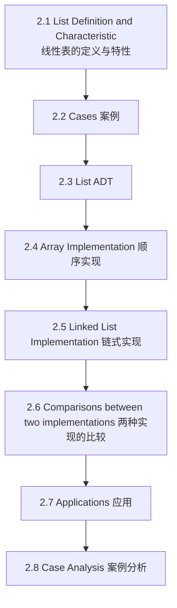
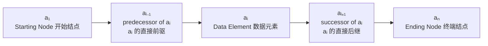
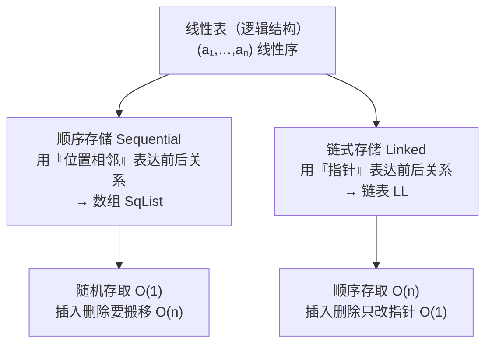

# C2.1 线性表的定义与特性

> [!abstract] 本节地图
> ```mermaid
> flowchart TD
>   A["线性结构 Linear Structure<br/>第 2、3、4 章的共同框架"] --> B["2 List 线性表"]
>   A --> C["3 Stack 栈"]
>   A --> D["4 Queue 队列"]
>   B --> E["定义：有限序列 (a1,…,an)"]
>   E --> F["术语：首/尾结点、前驱、后继、长度、空表"]
>   F --> G["三要素：逻辑结构 / 存储结构 / 操作"]
> ```

> [!info] 授课进度说明
> 目前拿到的授课转写稿覆盖到**第二节课**，内容截止于**第 1 章（绪论）全部讲完**——即算法与算法分析部分。
> **第 2 章尚未在课堂上讲授**，因此本篇内容全部来自**课件与教材整理**，暂不逐条区分"课堂讲过"与"拓展补充"。
> 等后续课程的转写稿补充进来后，会按与第 1 章相同的规则（在标题后加 **（拓展）**、段落前加 **【拓展】**）标注出课堂未讲的延伸内容。

## 一、未来三周的框架（Next 3 Weeks）

课件开篇就把第 2、3、4 章绑在一起：

> [!important] 三章共享一个框架
> - **2 List 线性表**
> - **3 Stack 栈**
> - **4 Queue 队列**
>
> 三者统称 **Linear Structure 线性结构**，每一个都要从三个角度讲：**(Logical, Storage, Operation)** —— 逻辑结构、存储结构、操作。

> [!note] 这个"三要素"就是本课的固定套路
> 它正是 [[C1.2 抽象数据类型与容器操作]] 里 ADT $=(D,R,O)$ 的翻版：逻辑结构对应 $R$、存储结构是 $R$ 的物理实现、操作就是 $O$。
> **以后学任何新结构，都按这三条自问自答**：它的元素之间是什么关系？关系怎么存？允许做哪些操作？栈和队列其实就是"操作被进一步限制的线性表"。

> [!important] Definition of Linear Structure 线性结构的定义
> If the structure is a **nonempty finite set** with **only one starting node and one ending node**, and **all the other nodes have only one predecessor and one successor**, which can be represented as
> $$(a_1,\ a_2,\ \dots,\ a_n)$$
> （非空有限集合，有且仅有一个开始结点和一个终端结点，其余每个结点有且仅有一个直接前驱和一个直接后继。）

> [!warning] 定义里的"nonempty"和"n=0 空表"矛盾吗
> 不矛盾，因为两处说的是不同层次：**线性结构的定义**（这一页）强调"有唯一首尾"，所以描述的是非空情形；**线性表的定义**（下一页）明确 $n=0$ 时是**空表 (empty list)**。
> 考试口径：**线性表允许为空；空表是线性表的特例。** 这是历年最爱设的判断题陷阱。

## 二、本章目标（Target）

课件给的四个 OPTION：

| 编号 | 内容 |
| --- | --- |
| 01 | Characteristics of the **List** —— 线性表的特性 |
| 02 | **Array** Implementation and Operation —— 顺序（数组）实现与操作 |
| 03 | **Linked List** Implementation and Operation —— 链式实现与操作 |
| 04 | **Time and Memory** —— 时间与内存（两种实现的比较） |

## 三、本章完整目录（Catalogue）



> [!note] 目录页出现了两个版本
> 第一次出现时只有 2.1–2.6；讲到 2.2 时目录扩成了 2.1–2.8（多出 **2.7 Applications** 和 **2.8 Case Analysis**）。本份课件的正文只讲到 2.6 + 作业，**2.7 / 2.8 尚未展开**，应在后续课时补充。

## 四、线性表的定义与术语

> [!important] Definition 线性表 Linear List
> **finite sequence of data elements**（数据元素的**有限序列**）：
> $$(a_1,\ a_2,\ \dots,\ a_{i-1},\ a_i,\ a_{i+1},\ \dots,\ a_n)$$
> - $n=0$：**empty list 空表**
> - $n$ is the **length** of the list —— $n$ 是表长
> - **Index** represents the **position** of this element in the list —— 下标表示元素在表中的位置

课件用红箭头标注的五个术语（用 mermaid 复现结构）：



| 术语 | 英文 | 含义 |
| --- | --- | --- |
| 开始结点 | Starting Node | $a_1$，无前驱 |
| 终端结点 | Ending Node | $a_n$，无后继 |
| 直接前驱 | predecessor of $a_i$ | $a_{i-1}$ |
| 直接后继 | successor of $a_i$ | $a_{i+1}$ |
| 表长 | length | $n$ |
| 空表 | empty list | $n=0$ |

> [!important] 线性表的四条特性（由定义直接推出，考试常考）
> 1. **有限性**：元素个数有限。
> 2. **有序性**：元素之间有明确的先后次序（这是 [[C1.3 数据元素间的六种关系]] 里的**线性序**）。
> 3. **同一性**：同一线性表中的元素**类型相同**（课件在 2.2 花名册案例中明确写出 "Elements in the same list share the same type."）。
> 4. **唯一首尾**：首结点无前驱，尾结点无后继，其余元素前驱后继各一个。

> [!warning] 三组最容易混的说法
> - **"序号 index" vs "值"**：$a_i$ 中的 $i$ 是**位置**，不是元素的值，也不代表大小顺序。线性表**不要求有序**（$(5,2,9)$ 也是合法线性表）。
> - **"逻辑相邻" vs "物理相邻"**：定义里的"相邻"是**逻辑上**的；物理上是否相邻由存储结构决定（顺序存储相邻，链式存储不一定）。
> - **序号从 1 还是从 0**：数学定义写 $a_1 \dots a_n$（**从 1 开始**），C++ 代码里 `elem[0]...elem[length-1]`（**从 0 开始**）。课件两套并用，做题时先看清楚，见 [[C2.4 顺序表实现]] 的地址公式。

> [!note] 为什么"直接"两个字不能丢
> $a_1$ 也在 $a_i$ 前面，但它不是 $a_i$ 的**直接**前驱。直接前驱是**紧邻**的那一个，且唯一。链表里 `p->next` 给的正是直接后继——这就是为什么单链表**删除第 i 个结点必须先找到第 i-1 个**（[[C2.5 单链表实现]]），因为它只能向后走，拿不到前驱。

## 五、把定义映射到后面两种实现



> [!important] 记住这张图
> 同一个逻辑结构、两种物理结构 —— 这正是 [[C1.1 数据结构的基本概念]] 说的"逻辑结构唯一、物理结构不唯一"。本章剩下的全部内容，就是把这两条分支各走一遍，最后在 [[C2.7 两种实现的比较]] 汇总。

---

## 本节自测 Self-Test

> [!question] Q1：线性结构的定义中，"唯一首尾 + 其余元素前驱后继各一"排除了哪两种结构？
> **A**：排除了树（一个结点可有多个后继）和图（前驱后继都可多个）。

> [!question] Q2：空表是线性表吗？表长为 1 的表首结点有后继吗？
> **A**：是，$n=0$ 即空表；表长为 1 时该结点既是首又是尾，无前驱也无后继。

> [!question] Q3：$(5, 2, 9, 1)$ 是合法线性表吗？
> **A**：是。线性表只要求"位置有序"，不要求"元素值有序"。

> [!question] Q4：线性表的三要素是什么？
> **A**：逻辑结构（线性序）、存储结构（顺序/链式）、操作（初始化、查找、插入、删除等）。

> [!question] Q5：为什么单链表删除第 $i$ 个元素要先找第 $i-1$ 个？
> **A**：因为删除要修改被删结点**前驱**的指针域，而单链表只能沿 next 向后走，无法从 $a_i$ 反查 $a_{i-1}$。

---

**上一节**：[[C1.6 代码复杂度的计算方法]] ｜ **下一节**：[[C2.2 案例：字母表·花名册·多项式]]
**索引**：[[数据结构 MOC]]
