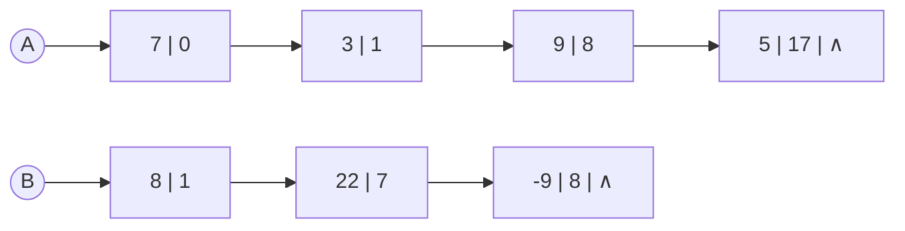

# C2.2 案例：字母表·花名册·多项式

> [!abstract] 本节地图
> ```mermaid
> flowchart TD
>   A["Case 1 字母表 Alphabet"] --> C["共同点：元素类型相同 + 关系是线性的"]
>   B["Case 2 花名册 Roster"] --> C
>   C --> D["Case 3 多项式 Polynomial"]
>   D --> E["稠密：只存系数，下标即指数"]
>   D --> F["稀疏：存 (系数,指数) 对"]
>   F --> G["顺序存储的困境：分配僵硬、空间浪费"]
>   G --> H["→ 链式存储 Linked Storage"]
> ```

> [!info] 授课进度说明
> 目前拿到的授课转写稿覆盖到**第二节课**，内容截止于**第 1 章（绪论）全部讲完**——即算法与算法分析部分。
> **第 2 章尚未在课堂上讲授**，因此本篇内容全部来自**课件与教材整理**，暂不逐条区分"课堂讲过"与"拓展补充"。
> 等后续课程的转写稿补充进来后，会按与第 1 章相同的规则（在标题后加 **（拓展）**、段落前加 **【拓展】**）标注出课堂未讲的延伸内容。

## 一、Case 1 字母表 Alphabet

$$(\ A,\ B,\ C,\ D,\ \dots,\ Z\ )$$

> [!important] 要点
> - **Elements are the letters.**（元素就是字母。）
> - **The relationship among them is linear.**（它们之间的关系是线性的。）

> [!note] 这个例子想让你注意什么
> 元素是**不可再分**的单个字母——对应 [[C1.1 数据结构的基本概念]] 里的"数据元素是原子单位"。这个案例在 [[C2.5 单链表实现]] 会再次出现（Alphabet Case），用来演示 a→b→…→z 的链式存储。

## 二、Case 2 花名册 Roster

| Number | Name | Gender | Age | Class |
| --- | --- | --- | --- | --- |
| 041810205 | Han Meimei | Female | 18 | Big-Data1 |
| 041810260 | Li Lei | Male | 20 | Big-Data1 |
| 041810284 | Chu Yue | Female | 19 | Big-Data2 |
| 041810360 | Luo Tong | Male | 18 | Big-Data2 |
| ⋮ | ⋮ | ⋮ | ⋮ | ⋮ |

> [!important] 要点（课件蓝框原文）
> - **Elements are the records**（元素是"记录"，即一整行）；**the relationship among them is linear too**。
> - **Elements in the same list share the same type.**（同一表中的元素类型相同。）

> [!note] 与第 1 章的对应
> "元素 = 一整行记录"正是 [[C1.1 数据结构的基本概念]] 里 data element 的定义（一行 = 元素，一格 = 数据项）。
> "类型相同"这句是线性表的**同一性**，它在代码里的体现就是模板参数 `template <typename T>` —— **一个 SqList\<T\> 里只能装同一种 T**。

## 三、Case 3 多项式 Polynomial（本节重点）

### 3.1 稠密多项式：只存系数

> [!important] 表示法
> $$P_n(x)=p_0+p_1x+p_2x^2+\dots+p_nx^n$$
> $$P=(p_0,\ p_1,\ p_2,\ \dots,\ p_n)$$
> **Array Represents**：Every exponential $i$ is indicated by the **index** of $p_i$.
> （每个指数 $i$ 由 $p_i$ 的**下标**隐含表示。）

例：$P(x)=10+5x-4x^2+3x^3+2x^4$

| Index (exponential) | 0 | 1 | 2 | 3 | 4 |
| --- | --- | --- | --- | --- | --- |
| Coefficient | 10 | 5 | -4 | 3 | 2 |

> [!note] 这一步的精髓：用"位置"省掉一维信息
> 指数根本不用存——**数组下标本身就是指数**。这是顺序存储最漂亮的用法：把一维信息编码进位置，省下一半空间。
> 同样的思路后面还会见到：哈希表用"位置=键的哈希值"，堆用"位置=完全二叉树的层序编号"（父子关系靠 $2i+1$、$2i+2$ 算出来，不用存指针）。**能用位置表达的关系就不要用额外空间存**。

### 3.2 多项式相加（数组版）

> [!important] 加法定义
> $$R_n(x)=P_n(x)+Q_m(x)$$
> $$R=(p_0+q_0,\ p_1+q_1,\ p_2+q_2,\ \dots,\ p_m+q_m,\ p_{m+1},\ \dots,\ p_n)$$
> （设 $n>m$：前 $m+1$ 项对应相加，剩下的高次项直接照抄。）

> [!important] 算法步骤（课件原文）
> - Create a new array C. **How long should it be?**（新数组 C 该开多长？）
> - Check **from low to high**, if the exponential values are the same, **add together**.
> - **Otherwise copy.**

> [!note] "How long should it be?" 的答案
> $\max(n,m)+1$。这个提问不是随口一问——它暴露了顺序存储的**根本困境：必须提前知道结果有多大**。这正是后面转向链式存储的动机。

### 3.3 稀疏多项式：灾难来了

> [!warning] Sparse 稀疏的例子
> $$S(x)=1+3x^{10000}+2x^{20000}$$
> 只有 **3 个非零项**，但用稠密数组要开 **20001 个格子**，其中 19998 个是 0。空间利用率约 **0.015%**。

> [!important] 解决办法：改存 (系数, 指数) 对
> $$P_n(x)=p_1x^{e_1}+p_2x^{e_2}+\dots+p_mx^{e_m}$$
> $$P=\bigl((p_1,e_1),\ (p_2,e_2),\ \dots,\ (p_m,e_m)\bigr)$$
> 只存**非零项 (Non-zero item in array)**。

课件的两个具体例子：

**(a) $A(x)=7+3x+9x^8+5x^{17}$**

| Index i | 0 | 1 | 2 | 3 |
| --- | --- | --- | --- | --- |
| Coefficient a[i] | 7 | 3 | 9 | 5 |
| Exponential | 0 | 1 | 8 | 17 |

**(b) $B(x)=8x+22x^7-9x^8$**

| Index i | 0 | 1 | 2 |
| --- | --- | --- | --- |
| Coefficient b[i] | 8 | 22 | -9 |
| Exponential | 1 | 7 | 8 |

> [!warning] 关键区别：数组下标的含义变了
> 稠密表示中，**下标 = 指数**；稀疏表示中，**下标只是"第几个非零项"，指数必须显式存**。
> 代价：每项从存 1 个数变成存 2 个数。**当非零项少于总项数一半时才划算**——这是稀疏表示的盈亏平衡点。
>
> **AI 关联**：这就是稀疏矩阵的 **COO 格式**（存 (行,列,值) 三元组）。scipy.sparse、PyTorch 的 `torch.sparse_coo_tensor`、以及模型剪枝后的稀疏权重存储，用的都是这个思想。判断"该不该用稀疏格式"用的也是同一个盈亏平衡计算。

### 3.4 顺序存储的困境 → 转向链式存储

> [!important] 课件的结论页
> **Sequential Storage**：
> - ✓ **Allocation is rigid.**（分配僵硬——必须预先确定大小。）
> - ✓ **Space complexity high.**（空间复杂度高。）
>
> ⟹ **Linked Storage 链式存储**

> [!note] 为什么多项式相加特别不适合顺序存储
> 两个多项式相加，结果的项数事先**不知道**：$A$ 有 4 项、$B$ 有 3 项，结果可能是 7 项（指数全不同），也可能是 4 项（指数全重合且系数不抵消），甚至更少（系数相加为 0，项消失）。
> **"结果规模不可预知 + 频繁插入删除"= 链式存储的经典适用场景**（正是 [[C2.7 两种实现的比较]] 表格里"何时使用链式"的两条：容量未知、频繁增删）。

### 3.5 多项式的链式存储与相加过程

链式存储下，每个结点存 **(系数, 指数)** 两个数据域 + 一个指针域：

![[C2-多项式链式存储.png]]

$$A_{17}(x)=7+3x+9x^8+5x^{17},\qquad B_8(x)=8x+22x^7-9x^8$$

用 mermaid 复现两条链的初始状态（`pa`、`pb` 是两个游标指针）：



**相加的四步演示（课件用黄色高亮标记已处理的结点）：**

**第 1 步**——`pa` 指向 $A$ 的 (3,1)，`pb` 指向 $B$ 的 (8,1)。$A$ 的首项 (7,0) 指数最小，$B$ 中没有指数 0 的项，**直接保留**（已变黄）：

![[C2-多项式相加-步骤1.png]]

**第 2 步**——两指针的指数都是 1，**系数相加** $3+8=11$，$A$ 的结点就地改成 (11,1)，两个指针同时后移：

![[C2-多项式相加-步骤2.png]]

**第 3 步**——`pa` 指向 (9,8)，`pb` 指向 (22,7)。$B$ 的指数 7 更小，把 $B$ 的结点**摘下来插入 $A$**（蓝箭头表示指针改接）：

![[C2-多项式相加-步骤3.png]]

**第 4 步**——两者指数都是 8，系数相加 $9+(-9)=0$，**该项消失，两个结点都被删除**；最后 $A$ 剩下的 (5,17) 直接接上：

![[C2-多项式相加-步骤4.png]]

> [!important] 从图里要读出的三条规则（课件只画图没写文字）
> 设 `pa`、`pb` 分别指向 $A$、$B$ 的当前项，比较两者指数 $e_a$ 与 $e_b$：
> 1. $e_a < e_b$：$A$ 的这一项保留，`pa` 后移。
> 2. $e_a > e_b$：把 $B$ 的这个**结点摘下插入到 $A$ 中**（不是复制，是转移，省一次 new），`pb` 后移。
> 3. $e_a = e_b$：系数相加。
>    - 和 $\ne 0$：改写 $A$ 结点的系数，删除 $B$ 的结点，两指针后移。
>    - 和 $= 0$：**两个结点都删掉**（这一项彻底消失），两指针后移。
> 最后把还没走完的那条链整体接到结果尾部。

> [!warning] 这个算法的三个易错点
> 1. **和为 0 必须删结点**，不能留一个系数为 0 的结点，否则多项式表示不唯一，后续运算会越积越多垃圾项。这正是第 4 步图里 $9x^8$ 和 $-9x^8$ 一起消失的原因。
> 2. **结果直接建在 A 上**（原地修改 A，销毁 B），所以调用后 $B$ 就不能再用了。若要保留 B，必须先复制。
> 3. **两条链必须按指数升序有序**，算法才成立。这是隐含前提，课件表格里 $A$ 的指数 0,1,8,17 和 $B$ 的 1,7,8 都是升序的。
>
> 时间复杂度：**$O(m+n)$**（两个指针各扫一遍，谁也不回头）——这就是"归并 (merge)"的雏形，归并排序的 merge 步骤与此完全同构。

---

## 本节自测 Self-Test

> [!question] Q1：稠密表示中为什么不用存指数？
> **A**：因为数组下标本身就是指数，用"位置"隐含编码了这一维信息。

> [!question] Q2：$S(x)=1+3x^{10000}+2x^{20000}$ 用稠密数组要多少格？浪费率多少？
> **A**：20001 格，只有 3 格有效，浪费率约 99.985%。

> [!question] Q3：什么时候稀疏表示反而更亏？
> **A**：非零项占比高时。每项要存两个数，若非零项超过总项数一半，稀疏表示占的空间反而更大。

> [!question] Q4：多项式相加时，若两项指数相同且系数之和为 0，应该怎么处理？
> **A**：两个结点都删除，该项不出现在结果中。

> [!question] Q5：为什么多项式相加适合链式存储？
> **A**：结果项数事先未知（可能增可能减），且过程中频繁插入删除结点，链式存储无需预分配且增删只改指针。

> [!question] Q6：多项式相加的时间复杂度是多少？和哪个经典算法同构？
> **A**：$O(m+n)$；与归并排序的 merge 步骤同构。

---

**上一节**：[[C2.1 线性表的定义与特性]] ｜ **下一节**：[[C2.3 线性表 ADT]]
**索引**：[[数据结构 MOC]]
