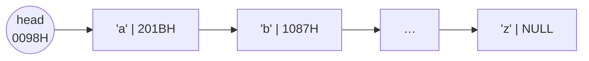
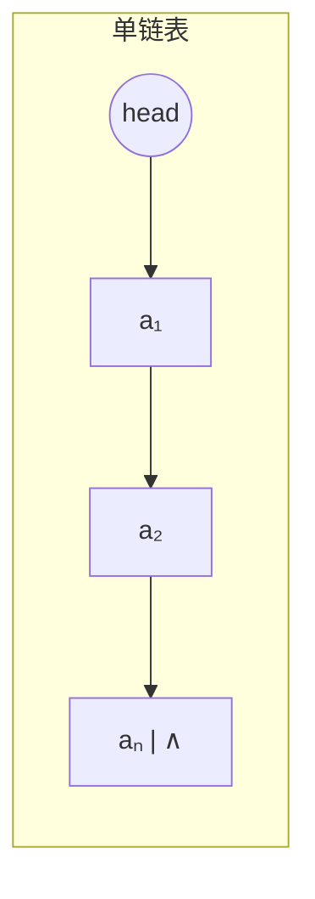
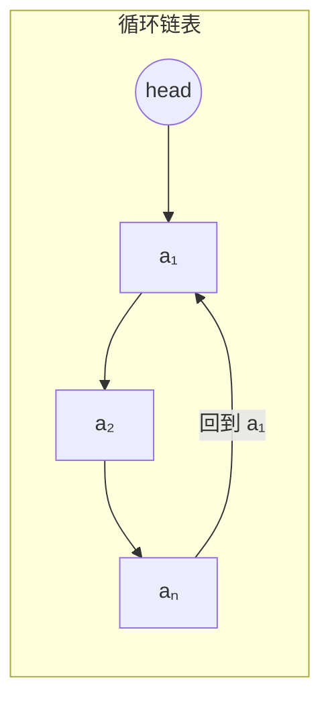

# C2.5 单链表实现

> [!abstract] 本节地图
> ```mermaid
> flowchart TD
>   A["Linked Storage 链式存储<br/>逻辑相邻 ≠ 物理相邻"] --> B["三种链表：单链 / 双链 / 循环"]
>   B --> C["术语：头指针 / 头结点 / 首元结点"]
>   C --> D["特性：顺序存取 Sequential Access"]
>   D --> E["优缺点 Pros and Cons"]
>   E --> F["结点定义 struct Node"]
>   F --> G["五个操作：初始化/取值/查找/插入/删除"]
>   G --> H["复杂度：查找 O(n)，已定位后增删 O(1)"]
>   H --> I["应用：约瑟夫问题"]
> ```

> [!info] 授课进度说明
> 目前拿到的授课转写稿覆盖到**第二节课**，内容截止于**第 1 章（绪论）全部讲完**——即算法与算法分析部分。
> **第 2 章尚未在课堂上讲授**，因此本篇内容全部来自**课件与教材整理**，暂不逐条区分"课堂讲过"与"拓展补充"。
> 等后续课程的转写稿补充进来后，会按与第 1 章相同的规则（在标题后加 **（拓展）**、段落前加 **【拓展】**）标注出课堂未讲的延伸内容。

## 一、链式存储的本质

> [!important] Linked Storage 定义
> The location of a node in memory is **arbitrary**, that is, **logically adjacent data elements are NOT necessarily physically adjacent**.
> （结点在内存中的位置是任意的：**逻辑上相邻的元素在物理上不一定相邻**。）

**Alphabet Case（字母表案例）**

Logical Structure 逻辑结构：$(a,\ b,\ \dots,\ y,\ z)$

Linked Storage 链式存储：



> [!important] 结点的两个域
> Every node has two fields：
> - **Data field 数据域**：store the data（存数据）
> - **Pointer field 指针域**：store the **position of the next node**（存下一结点的位置）
>
> 并且 **NULL = ∧ = 0**（课件明确写出这三者等价）。

> [!note] 图里那些十六进制地址要读懂
> 头指针 head 自己存放在 0098H，它的**值**是 'a' 结点的地址；'a' 结点的指针域存着 201BH（'b' 的地址）；'b' 的指针域存着 1087H。
> 注意 **201BH 和 1087H 没有大小规律** —— 这就是"物理位置任意"的直观体现。要是像数组那样连续，就不需要指针了。

## 二、三种链表 Some Linked Storage

> [!important] 三种链表的区别（课件原文）
> - **Linked List 单链表**：only one pointer to the **next** node（只有一个指向后继的指针）
> - **Double Linked List 双向链表**：one to **predecessor**, one to **successor**（一个指前驱、一个指后继）
> - **Circular Linked List 循环链表**：**tail points to head**（尾指向头）





双向链表见 [[C2.6 双向链表与循环链表]]。

> [!note] 循环链表的价值
> 尾结点的指针域不再是 NULL 而是指回首结点，好处是**从任一结点出发都能访问整个表**，且"尾接头"天然适合环形问题——本节末的**约瑟夫问题**正是它的杀手级应用。
> 代价：判断"走到头了"不能再用 `p == NULL`，必须用 `p == head`，写循环时容易死循环。

## 三、容易混淆的三个术语（Terminology that I loathe）

![[C2-头指针头结点首元结点.png]]

> [!important] 三个术语的严格定义（课件原文）
> - **Head Pointer 头指针**：the pointer **pointing to the first node**（指向第一个结点的指针）
> - **First Element Node 首元结点**：the **first element node**（第一个存放数据元素的结点）
> - **Head Node 头结点**：a node **before the first element node** storing some **metadata**（在首元结点之前的一个结点，存放一些元数据）

图上的顺序是：`head`（头指针）→ `info`（头结点）→ `a₁`（首元结点）→ `a₂` → … → `aₙ | ∧`

> [!warning] 三者的关系（考试高频，务必分清）
> - **头指针是必须有的**（没有它就找不到链表），它是一个**指针变量**，不是结点。
> - **头结点是可选的**，它是一个**真实存在的结点**，数据域不存元素（可存表长等元数据）。
> - **首元结点是第一个真正的数据结点**（即 $a_1$）。
> - 有头结点时：`head → 头结点 → 首元结点`；无头结点时：`head → 首元结点`。
> - **空表的判断因此不同**：无头结点时 `head == NULL`；有头结点时 `head->next == NULL`。

**Two Types 两种类型**（课件用 ZHAO/QIAN/SUN/LI/ZHOU/WU/ZHENG/WANG 的例子对比）：

![[C2-有无头结点对比.png]]

图 ① 是**无头结点**（H 直接指向 ZHAO）；图 ② 是**有头结点**（H 先指向一个蓝色空结点，再指向 ZHAO）。

> [!important] 本课程的明确立场
> "Somebody says that it is easy to manipulate the Linked List if there is a head node, but it indeed makes the structure **too complicated to understand**.
> Thus, **I prefer the one without head node**. Meanwhile, sometimes, it is very helpful to **set a tail pointer**."
> （有人说带头结点更好操作，但结构太难懂。**因此我倾向于不带头结点**；另外，设一个**尾指针**常常很有用。）

> [!note] 头结点到底解决了什么问题（"更好操作"指的就是这件事）
> 没有头结点时，**在表头插入/删除是特例**：要修改 `head` 本身，而不是某个结点的 `next`。所以代码里必须写 `if (index <= 0) { ... head = s; }` 这样的分支（下面 insert 的代码正是如此）。
> 有头结点时，第一个数据结点也有"前驱"（就是头结点），于是**所有位置的插入删除代码完全统一**，不用特判。
> **本课的约定：不带头结点，因此代码里会看到头部特判。** 但考研统考教材（严蔚敏）默认**带头结点**，做题时看清题目设定。
>
> **尾指针 tail 的价值**：把尾插从 $O(n)$（要走到尾）降为 $O(1)$。类定义里 `Node* tail; //optional` 就是这个用途。

## 四、链式存储的特性与优缺点

> [!important] Characteristics of the Linked Storage
> 1. The location of a node in memory is **arbitrary** —— 逻辑相邻不必物理相邻。
> 2. When accessing, you can **only enter the linked list through the head pointer**, and scan the remaining nodes through the pointer field of each node. So **the time spent to find the first node and the last node is not equal**.
> 访问时，只能通过头指针进入链表，并通过每个节点的指针域遍历其余节点。因此查找第一个节点和最后一个节点所耗费的时间并不相等。
>    ⟹ **Sequential Access 顺序存取**

> [!warning] 这是链表与顺序表最根本的差异
> 顺序表是**随机存取 (random access)**：访问第 1 个和第 1000 个都是 $O(1)$。
> 链表是**顺序存取 (sequential access)**：访问第 $i$ 个必须从头走 $i$ 步，$O(n)$。
> **"找首结点和找尾结点的时间不相等"** 这句话就是顺序存取的定义式表述。

> [!important] Pros 优点
> - **No capacity limit**（没有容量上限）
> - **'insert' and 'erase' are easy to be implemented, no need to move other elements.**（增删容易，不需要移动其他元素）

> [!important] Cons 缺点
> - **Low Storage Density** since of the pointers（因为指针，存储密度低）
> - **Sequential Access**（只能顺序存取）
存储密度 = 数据元素本身占用的存储空间 / 结点总的存储空间。

存储密度 = 数据元素本身占用的存储空间 / 结点总的存储空间。

顺序表只存数据，全部空间都用来存放有效数据，没有额外开销，存储密度接近 1。 链表的每一个结点，除了存放**数据域**，还要额外开辟**指针域**保存下一个结点的地址，指针也要占用内存。每存一份数据，都要附带额外的指针开销，总的存储空间里有一部分被指针占用，真正存放数据的占比下降，所以存储密度低。
> [!note] 两个优点与两个缺点是同一枚硬币
> "不需要移动元素"和"只能顺序存取"是同一件事的两面：**因为不靠位置表达关系，所以移动元素没意义；也正因为不靠位置，就没法用公式算地址。**
> 同理"没有容量上限"和"存储密度低"也是一体：按需一个个 new，所以不用预分配；但每个结点都要额外背一个指针。

## 五、结点定义与"指针 vs 结点"

```cpp
template <typename T>
struct Node {
    T data;        //the data elem
    Node* next;    //next node position
};
```

> [!important] Distinguish pointer and node（课件专门用一页强调）
> - **Pointer p**：the **address** of the node（p 是结点的地址）
> - **Node \*p**：the **real node**（\*p 才是那个真实的结点）
>
> 课件原话："I'd like to use **pointer** instead of the real node because of the symbol '\*'."（因为有 `*` 这个符号，习惯上直接说"指针"而不说"真结点"。）

> [!warning] 这一页存在的意义
> 后面讲插入时说的"把 p 的 next 指向 s"，严格说是"把 `*p` 这个结点的 next 域改为 s 的值"。**日常表述会混用"结点 p"和"指针 p"**，读的时候心里要清楚指的是哪一个。
> 语法上：`p` 是地址，`*p` 是结点，`p->data` 等价于 `(*p).data`。

## 六、类定义与初始化/销毁

```cpp
template <typename T>
class LL {
public:
    LL();                //initialization
    ~LL();               //destroy
    int getLength();     //get the length
    T get(int);          //get the i-th data
    Node* find(T);       //find the node
    bool insert(T, int); //insert a node
    void erase(int);     //erase a node
    bool empty();        //whether empty
private:
    int length;          //length of the LL
    Node* head;          //head pointer
    Node* tail;          //optional
};
```

```cpp
// Initialization 初始化
template <typename T>
LL::LL() {
    this->head = NULL;
    this->tail = NULL;
    this->length = 0;
}

// Destroy 销毁
template <typename T>
LL::~LL() {
    while (this->head != NULL) {
        Node* temp = this->head;
        this->head = this->head->next;
        delete temp;
    }
    this->tail = NULL;
    this->length = 0;
}
```

> [!warning] 析构函数里 `temp` 为什么不能省
> 必须**先把下一个结点的地址存起来，再删当前结点**。若写成
> ```cpp
> delete this->head;
> this->head = this->head->next;   // 错！head 已经被释放
> ```
> 就是访问已释放内存（悬垂指针），未定义行为。
> **"删链表必须留住后路"** —— 这个模式在后面所有链式结构（树的销毁、图的释放）里都会重复出现。

## 七、Easy Functions

```cpp
int LL::getLength() { return this->length; }        // Get length，O(1)
bool LL::empty()    { return this->length == 0; }   // Whether empty，O(1)
```

## 八、Retrieve：取第 $i$ 个元素

> [!important] 为什么链表的取值是 $O(n)$
> Since the data elements are **randomly stored in the memory**, we need to **count them one by one from the head pointer** to get the data element.
> （因为元素在内存中随机存放，只能从头指针开始一个个数。）

```cpp
template <typename T>
T LL::get(int index) {
    if (index < 0 || index >= this->length)
        exit(ERROR);            //if the index is illegal
    Node* ptr = this->head;
    for (int i = 0; i < index; i++) {
        ptr = ptr->next;        //move ptr index times
    }
    return ptr->data;
}
```

> [!note] 循环走几步？为什么是 `i < index`
> 要取下标 `index`，ptr 从 head（下标 0）出发，**走 `index` 步**正好到达。
> 验算：`index = 0` 时循环不执行，直接返回 head 的数据 ✓；`index = 2` 时走 2 步到达第 3 个结点 ✓。
> **易错点**：写成 `i <= index` 会多走一步，甚至越过尾部访问 NULL。

## 九、Search：按值查找

```cpp
template <typename T>
Node* LL::find(T e) {
    Node* ptr = this->head;      //define an iterator
    while(ptr != NULL) {         //search one by one
        if (ptr->data == e) {
            return ptr;          //if get, return
        }
        ptr = ptr->next;
    }
    return NULL;                 //otherwise, return NULL
}
```

> [!warning] 与顺序表 find 的两处差别
> 1. **返回类型是 `Node*` 而不是 `int`**：找不到返回 **NULL**（顺序表返回 -1）。因为链表没有天然下标，"位置"就是指针。
> 2. **终止条件是 `ptr != NULL`**：这是遍历链表的**标准写法**，忘判 NULL 就是段错误。
>
> 复杂度同样是 $O(n)$。

## 十、Insert：在第 $i$ 个元素之前插入

![[C2-单链表插入-图示.png]]

> [!important] Basic Steps 五个步骤（课件的五个 OPTION）
> 1. Find the position of $a_{i-1}$ as **p**（找到 $a_{i-1}$，记为 p）
> 2. Generate a new node **\*s**（生成新结点 s）
> 3. Set the value of \*s as x（把 s 的数据域设为 x）
> 4. **Next of \*s point to $a_i$** —— `s->next = p->next;`
> 5. **Next of \*p point to \*s** —— `p->next = s;`
>
> 核心两句：
> ```cpp
> s->next = p->next;
> p->next = s;
> ```

> [!warning] 课件的思考题："can we exchange these two steps?"（这两步能交换吗？）
> **答案：绝对不能。**
> 如果先执行 `p->next = s;`，那么 $a_i$ 的地址就**永远丢失了**——原本只有 `p->next` 记着它，一旦被覆盖，$a_i$ 及其后面的所有结点都成为**内存泄漏**，链表从此断成两截。
> 正确顺序的逻辑：**先让新结点抓住后面的链，再让前面的链松手指向新结点**。
> 记忆口诀：**"先连后断""新结点先接尾巴，前驱最后改口"**。这是链表操作的第一定律，双链表的四步顺序（[[C2.6 双向链表与循环链表]]）同样受它支配。

```cpp
template <typename T>
bool LL::insert(T e, int index){
    Node* s = new Node;         //create a new node
    if (!s) return false;
    s->data = e;
    if (index <= 0) {                       //insert at head
        s->next = head;
        head = s;
    }
    else if (index >= this->length) {       //insert at tail
        s->next = NULL;
        tail->next = s;
        tail = s;
    }
    else {                                  //insert in the middle
        Node* ptr = head;
        for (int i = 0; i < index - 1; i++) {
            ptr = ptr->next;
        }
        s->next = ptr->next;
        ptr->next = s;
    }
    this->length++;
    return true;
}
```

> [!note] 三个分支为什么必须分开写（这正是"不带头结点"的代价）
> - **头插**：要改的是 `head` 这个成员变量本身，不是某个结点的 next——所以必须特判。
> - **尾插**：有了 `tail` 指针可以 $O(1)$ 完成，不用遍历。
> - **中间插**：先走 `index-1` 步找到前驱 ptr，再做"先连后断"。
>
> 循环写 `i < index - 1` 是因为**要停在前驱上**（下标 `index-1`），而不是目标位置。**差一错误高发区。**

> [!warning] 这段代码的两个隐患
> 1. **空表尾插会崩溃**：若 `length == 0`，走 `index >= length` 分支时 `tail` 是 NULL，`tail->next = s` 是空指针解引用。应该先判空表。
> 2. **头插时没更新 tail**：空表头插后 tail 仍是 NULL，后续尾插必崩。
> 严谨写法应在头插分支里加 `if (tail == NULL) tail = s;`。**维护两个指针的代价，就是每个分支都要照顾到两个指针。**

> [!important] 复杂度
> - 已知位置（拿到 p）：**$O(1)$**，只改两个指针，**不需要移动任何元素**。
> - 从头找位置：$O(n)$。
> - 所以"链表插入是 $O(1)$"这句话**只在"已经定位"的前提下成立**。

## 十一、Erase：删除第 $i$ 个元素

![[C2-单链表删除-图示.png]]

> [!important] Steps 四个步骤（课件原文）
> 1. find the position of $a_{i-1}$ as **p**（找到前驱 p）
> 2. create a **ptr** point to $a_i$（用 ptr 指向待删结点）
> 3. set **p→next point to $a_{i+1}$**（把 p 的 next 跨过 $a_i$ 指向 $a_{i+1}$）
> 4. **free $a_i$**（释放 $a_i$）
>
> 图上标注：③ 是那条跨越的弧线，两个 ④ 是被切断的两条旧指针。

```cpp
template<typename T>
void LL<T>::erase(int index) {
    if (index < 0 || index >= this->length)
        return;                       //judge index feasibility
    Node<T>* p = this->head;          //the iterator
    if (index == 0) {                 //erase the first one
        this->head = this->head->next;
        delete p;
    }
    else {                            //erase another node
        for (int i = 0; i < index - 1; i++) {
            p = p->next;
        }
        Node<T>* ptr = p->next;
        p->next = ptr->next;
        delete ptr;
        if (p->next == NULL)
            this->tail = p;           //check tail
    }
    this->length--;                   //decrease length
}
```

> [!warning] 三个必考细节
> 1. **必须先保存 `ptr = p->next` 再改指针，最后才 delete**。顺序错了就访问已释放内存。**"先接后删"**——与插入的"先连后断"是同一条定律的两面。
> 2. **删尾结点后要更新 tail**（`if (p->next == NULL) this->tail = p;`）。忘了这一步，tail 就成了悬垂指针，下一次尾插必崩。这行代码是很多人写不出的。
> 3. **删头结点时要改 `head` 本身**，仍然是"不带头结点"带来的特判。
> 4. 若删的是第 0 个且表只有一个元素，`head` 变 NULL 但 `tail` 没更新——**代码在这里仍有漏洞**，严谨实现要补 `if (head == NULL) tail = NULL;`。

## 十二、时间复杂度总结

> [!important] 课件的两条结论
> 1. **Search 查找**：since we need to check the elements **one by one**, **$O(n)$**.
> 2. **Insert or erase 插入或删除**：**If we have already located the position, $O(1)$**.
>
> However, do not forget that, **if the one we want to erase is in the middle of the list, moving the iterator to the location is $O(n)$**.
> （但别忘了：若目标在表中间，把游标移过去仍然是 $O(n)$。）

| 操作 | 单链表 | 顺序表 | 说明 |
| --- | --- | --- | --- |
| 按下标取值 get | $O(n)$ | $O(1)$ | 链表必须从头走 |
| 按值查找 find | $O(n)$ | $O(n)$ | 都要逐个比 |
| 插入（已定位） | $O(1)$ | $O(n)$ | 链表改指针，顺序表搬元素 |
| 插入（含定位） | $O(n)$ | $O(n)$ | 链表输在定位，顺序表输在搬移 |
| 头插 | $O(1)$ | $O(n)$ | 链表的主场 |
| 尾插（有 tail） | $O(1)$ | $O(1)$ | 打平 |

> [!warning] 面试与考试最爱问的一句话
> **"链表插入删除是 $O(1)$"是一句半真半假的话。** 完整表述是：**修改指针的动作是 $O(1)$，但找到位置通常是 $O(n)$。** 只有在"已经持有该结点的指针"（例如 LRU 缓存中哈希表直接给出结点地址）时，$O(1)$ 才真正兑现。
> 这正是 **LRU Cache = 哈希表 + 双向链表** 这个经典设计的动机：哈希表负责 $O(1)$ 定位，双链表负责 $O(1)$ 增删。

## 十三、应用：约瑟夫问题 Josephus Problem

> [!important] 问题描述（课件原文）
> 在计算机科学与数学领域，约瑟夫环问题（又称约瑟夫排列）是一个与报数淘汰游戏相关的理论问题。人们围成一圈等待被处决。从圈中指定位置开始报数，并沿着指定方向绕圈进行。跳过指定数量的人之后，下一个人被处决。剩余的人重复该过程，从下一个人开始，保持相同方向，跳过相同数量的人，直到最后只剩下一人，此人得以幸存。
> （$n$ 个人围成一圈，从某人开始报数，每数到第 $m$ 个人就出列，然后从下一个人重新报数，直到只剩一人。）

**$n=8$，$m=3$ 的完整过程：**

![[C2-约瑟夫问题-n8m3.png]]

> [!note] 图的读法（课件只给了 9 个圆盘，没写解说）
> 每个圆盘是一个时刻的状态，编号 1–8 顺时针排列，**黑色扇形 = 已出列的人**，箭头 = 当前报数起点。
> 逐轮推演（起点为 1，每数 3 个出列一个）：
>
> | 轮次 | 从谁开始数 | 数到的三个人 | **出列** | 剩余 |
> | --- | --- | --- | --- | --- |
> | 1 | 1 | 1,2,3 | **3** | 1,2,4,5,6,7,8 |
> | 2 | 4 | 4,5,6 | **6** | 1,2,4,5,7,8 |
> | 3 | 7 | 7,8,1 | **1** | 2,4,5,7,8 |
> | 4 | 2 | 2,4,5 | **5** | 2,4,7,8 |
> | 5 | 7 | 7,8,2 | **2** | 4,7,8 |
> | 6 | 4 | 4,7,8 | **8** | 4,7 |
> | 7 | 4 | 4,7,4 | **4** | 7 |
> | 最终 | | | | **7 号生还** |
>
> 课件另一张图标注的 $n=41,\ k=3$ 是历史上真实的约瑟夫故事（幸存位置 31 和 16）。

> [!important] 为什么这道题放在链表这一章
> 因为它需要**循环链表**：
> - "围成一圈" → 尾结点指回首结点，天然就是循环链表；
> - "出列" → 删除一个结点，$O(1)$（因为报数时已经走到那里，位置已定位）；
> - 不需要像数组那样把后面的人整体前移。
>
> 用循环链表的复杂度是 $O(nm)$（每次数 $m$ 步、共删 $n$ 次）。

> [!note] 补充：还有一个 $O(n)$ 的递推解法（面试常考）
> 设 $J(n,m)$ 表示 $n$ 个人时**幸存者的下标（从 0 开始）**：
> $$J(1,m)=0,\qquad J(n,m)=\bigl(J(n-1,m)+m\bigr) \bmod n$$
> 验算 $n=8,m=3$：$J(1)=0 \to J(2)=1 \to J(3)=1 \to J(4)=0 \to J(5)=3 \to J(6)=0 \to J(7)=3 \to J(8)=6$。
> 下标 6 即第 **7** 个人，与上面手工推演结果一致 ✓。
> 这个递推的思想是：**每删掉一个人后重新编号，新编号 = (旧编号 - m) mod n**，反过来就得到上式。它把 $O(nm)$ 降到 $O(n)$，且不需要任何数据结构——**好的数学观察可以消灭数据结构**，这是很值得记住的一课。

---

## 本节自测 Self-Test

> [!question] Q1：头指针、头结点、首元结点三者的区别？空表怎么判？
> **A**：头指针是指向第一个结点的指针变量（必需）；头结点是首元结点之前的哑结点（可选，存元数据）；首元结点是第一个数据结点。空表：无头结点时 `head==NULL`，有头结点时 `head->next==NULL`。

> [!question] Q2：插入的两句 `s->next=p->next; p->next=s;` 能交换吗？后果是什么？
> **A**：不能。先执行 `p->next=s` 会丢失 $a_i$ 的地址，后半段链表全部泄漏，链表断裂。

> [!question] Q3：为什么本课的插入代码要分头/中/尾三个分支？
> **A**：因为不带头结点，表头插入需要修改 head 本身，无法用统一的 `p->next` 写法；带头结点则可统一。

> [!question] Q4：删除结点时为什么要检查 `if (p->next == NULL) tail = p;`？
> **A**：删的是尾结点时，原 tail 已被释放，必须把 tail 指向新的尾结点，否则 tail 成为悬垂指针。

> [!question] Q5："链表插入是 $O(1)$"这句话完整的表述应该是什么？
> **A**：指针修改是 $O(1)$，但定位到插入位置一般需要 $O(n)$；只有已持有该结点指针时才真正是 $O(1)$。

> [!question] Q6：$n=8$、$m=3$ 的约瑟夫问题谁生还？用递推式验证。
> **A**：第 7 个人。$J(n)=(J(n-1)+3)\bmod n$ 迭代到 $J(8)=6$（0 基），即第 7 个人。

> [!question] Q7：链表销毁时为什么要用临时指针 temp？
> **A**：必须先保存下一结点地址再删除当前结点，否则删除后无法获取后继（访问已释放内存）。

---

**上一节**：[[C2.4 顺序表实现]] ｜ **下一节**：[[C2.6 双向链表与循环链表]]
**索引**：[[数据结构 MOC]]
