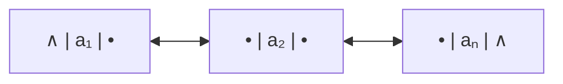
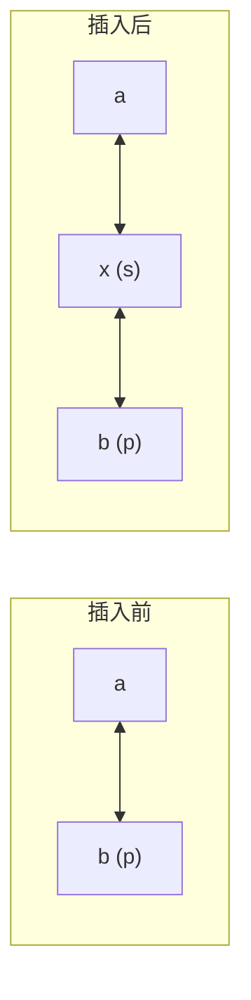
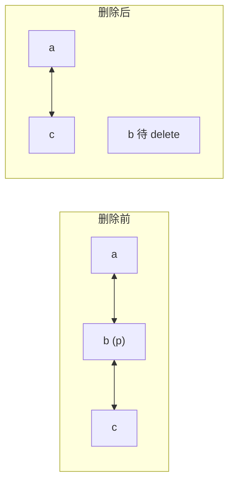
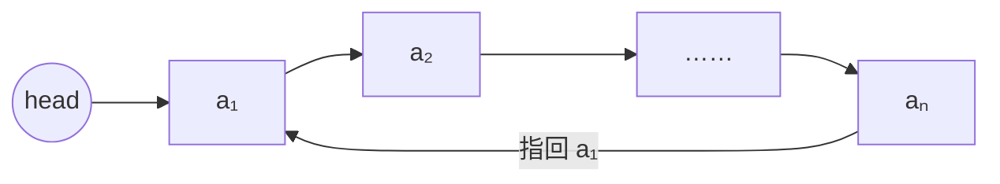

# C2.6 双向链表与循环链表

> [!abstract] 本节地图
> ```mermaid
> flowchart TD
>   A["单链表的痛点：<br/>只能向后走，拿不到前驱"] --> B["双向链表 DuLNode<br/>prior + data + next"]
>   B --> C["插入：四步改指针<br/>顺序不能乱"]
>   B --> D["删除：两步改指针"]
>   A --> E["循环链表：尾指回头"]
>   C --> F["口诀：先接新结点，后断旧链"]
>   D --> F
> ```

> [!info] 授课进度说明
> 目前拿到的授课转写稿覆盖到**第二节课**，内容截止于**第 1 章（绪论）全部讲完**——即算法与算法分析部分。
> **第 2 章尚未在课堂上讲授**，因此本篇内容全部来自**课件与教材整理**，暂不逐条区分"课堂讲过"与"拓展补充"。
> 等后续课程的转写稿补充进来后，会按与第 1 章相同的规则（在标题后加 **（拓展）**、段落前加 **【拓展】**）标注出课堂未讲的延伸内容。

## 一、为什么需要双向链表

> [!important] 单链表的结构性缺陷
> 单链表只有 `next`，因此：
> - 无法从 $a_i$ 得到 $a_{i-1}$；
> - 删除结点 $a_i$ 必须先找到它的前驱，于是"已经拿到待删结点的指针"也没用，仍要从头遍历 $O(n)$；
> - 逆序遍历只能先整体反转或用栈。
>
> 双向链表用**每结点多存一个指针**换掉这些麻烦。

## 二、结点结构 DuLNode

![[C2-双链表结点结构.png]]

```cpp
Struct DuLNode {
    ElemType data;
    DuLNode *prior;    //指向前驱
    DuLNode *next;     //指向后继
};
```

课件用配色强调：单链表结点是 `data | next` 两格（青 + 红），双链表结点是 `prior | data | next` 三格（黄 + 青 + 红）。



> [!important] 双链表的对称不变式
> 对任意结点 p（非首非尾）恒有：
> $$\texttt{p->prior->next} = \texttt{p} = \texttt{p->next->prior}$$
> 所有插入删除操作，做完之后都必须让这个等式重新成立 —— **这是检查自己指针有没有改漏的唯一标准。**

> [!warning] 代价
> 每个结点多一个指针：64 位系统上存一个 `int` 的结点从 12 字节涨到 **20 字节**（还有内存对齐），存储密度进一步下降到约 20%。
> 所以选双链表的理由必须是"**确实需要反向访问或 $O(1)$ 删除**"，不是"多个指针更保险"。

## 三、插入 Insert（四步，顺序是考点）

课件用四张递进的图逐步展示，在结点 p 之前插入结点 s（p 原本的前驱是 a，p 是 b）：

![[C2-双链表插入四步.png]]

> [!important] 四条语句（课件给的标准顺序）
> ```cpp
> 1. s->prior = p->prior;
> 2. p->prior->next = s;
> 3. s->next = p;
> 4. p->prior = s;
> ```

分步骤看课件的四张图：

| 步骤 | 语句 | 图上标记 | 含义 |
| --- | --- | --- | --- |
| 1 | `s->prior = p->prior;` | 青色①虚线，从 s 指向 a | 让新结点认前驱 |
| 2 | `p->prior->next = s;` | 红色②虚线，从 a 指向 s | 让前驱认新结点 |
| 3 | `s->next = p;` | 绿色③虚线，从 s 指向 p | 让新结点认后继 |
| 4 | `p->prior = s;` | 紫色④粗箭头，从 p 指向 s | 让后继认新结点 |



> [!warning] 为什么顺序不能随便换（本节最重要的一点）
> **关键：语句 2 和 4 都会覆盖信息，必须在信息还需要用的时候之后执行。**
> - 第 1 步必须在第 4 步之前：因为第 4 步 `p->prior = s` 会**销毁 p 原来的前驱地址**。如果先做第 4 步，第 1 步就取到 s 自己了（`s->prior = s`），链表自环。
> - 第 2 步必须在第 4 步之前，同理（`p->prior` 还得指着 a 才能改 a 的 next）。
> - 第 2 步必须在第 1 步之后吗？严格说不必，但**用 `s->prior` 来写 `s->prior->next = s;` 更安全**，两句成对更好记。
>
> **通用口诀（与单链表一致）：先让新结点连上两边，再让两边改口指向新结点。凡是"会覆盖原有地址"的赋值，一律放到最后。**
>
> 一个更好记的等价顺序（工程常用）：
> ```cpp
> s->prior = p->prior;
> s->next  = p;
> p->prior->next = s;
> p->prior = s;
> ```
> 即**先把 s 的两个指针都装好（读操作），再改动老结点（写操作）**。

> [!warning] 边界情况（课件未提，考试会考）
> 若 p 是**首元结点**，`p->prior` 是 NULL，第 2 步 `p->prior->next` 会**空指针崩溃**。因此需要特判，或者——这正是**双向循环链表带头结点**如此常用的原因：让 `p->prior` 永远非空，四条语句就永远成立，一个特判都不用写。

## 四、删除 Erase（两步）

课件展示删除 p 指向的结点 b（前驱 a，后继 c）：

![[C2-双链表删除两步.png]]

> [!important] 两条语句
> ```cpp
> 1. p->prior->next = p->next;
> 2. p->next->prior = p->prior;
> ```
> 图上标记：红色①从 a 跨到 c，青色②从 c 跨回 a。



> [!warning] 课件漏掉的第三步
> 课件只给了两句改指针，**但还必须 `delete p;`**，否则内存泄漏。完整版：
> ```cpp
> p->prior->next = p->next;
> p->next->prior = p->prior;
> delete p;                 // 课件未写，但必须有
> ```
> 另外这两句同样在首/尾结点处会解引用 NULL，需特判（或用循环链表规避）。

> [!important] 双链表最大的收益
> **只要拿到了待删结点的指针 p，删除就是真正的 $O(1)$**，不需要遍历找前驱。
> 对比单链表：即使拿到了 p，也要从头找前驱，仍是 $O(n)$（[[C2.5 单链表实现]]）。
>
> 这正是 **LRU Cache = 哈希表 + 双向链表**的原理：哈希表用 $O(1)$ 把 key 映射到结点指针，双链表用 $O(1)$ 把该结点挪到表头或删除。C++ 的 `std::list` 就是双向循环链表，它的 `erase(iterator)` 是 $O(1)$，而 `std::forward_list`（单链表）只能提供 `erase_after`。

## 五、循环链表 Circular Linked List

> [!important] 定义
> **Tail points to head**（尾结点的指针域指向头结点，而不是 NULL）。



| | 单链表 | 循环链表 |
| --- | --- | --- |
| 尾结点指针域 | NULL | 指向首结点（或头结点） |
| 遍历终止条件 | `p == NULL` | `p == head`（或 `p->next == head`） |
| 从任一结点出发 | 只能访问其后部分 | 可访问全表 |

> [!warning] 循环链表的两个坑
> 1. **循环条件写错会死循环**：`while (p != NULL)` 在循环链表里永远为真。必须写 `do { … } while (p != head);` 或 `while (p->next != head)`。
> 2. **空表判断**：带头结点的循环链表，空表是 `head->next == head`（自己指自己），不是 NULL。

> [!note] 三种链表的组合
> "单/双"与"循环/非循环"是**两个独立维度**，可以自由组合：
>
> | | 非循环 | 循环 |
> | --- | --- | --- |
> | **单链** | 最基础（本课默认） | 约瑟夫问题（[[C2.5 单链表实现]]） |
> | **双链** | 课件本节所讲 | **最常用**：`std::list`、LRU、内核链表 |
>
> **双向循环 + 头结点**是工程上最舒服的组合：所有结点的 prior 和 next 都非空，插入删除**永远不需要特判**，代码最短最不易错。Linux 内核的 `list_head` 就是这么设计的。

---

## 本节自测 Self-Test

> [!question] Q1：双链表的结点包含哪三个域？对任意中间结点 p 有什么恒等式？
> **A**：prior、data、next；恒有 `p->prior->next == p == p->next->prior`。

> [!question] Q2：双链表插入的四条语句，为什么 `p->prior = s;` 必须放最后？
> **A**：因为它会覆盖 p 原来的前驱地址；若提前执行，`s->prior = p->prior` 和 `p->prior->next = s` 都会取到 s 自己，造成自环。

> [!question] Q3：双链表删除只写两句改指针够吗？
> **A**：不够，还必须 `delete p` 释放结点，否则内存泄漏；且首尾结点需特判或使用循环链表。

> [!question] Q4：为什么双链表能把"已知结点的删除"做到 $O(1)$，而单链表不能？
> **A**：删除要改前驱的 next；双链表通过 `p->prior` 直接拿到前驱，单链表只能从头遍历找。

> [!question] Q5：循环链表的遍历终止条件是什么？空表如何判断（带头结点）？
> **A**：`p == head` 或 `p->next == head`；空表为 `head->next == head`。

> [!question] Q6：为什么工程上偏爱"带头结点的双向循环链表"？
> **A**：所有结点的 prior/next 均非空，插入删除无需边界特判，代码统一且不易出错。

---

**上一节**：[[C2.5 单链表实现]] ｜ **下一节**：[[C2.7 两种实现的比较]]
**索引**：[[数据结构 MOC]]
