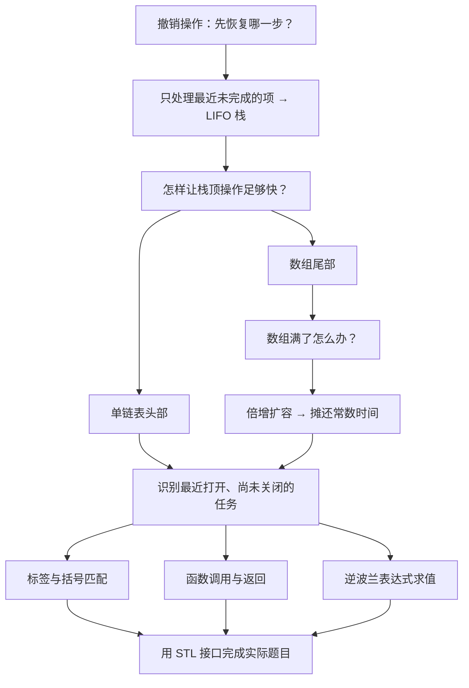
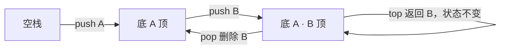
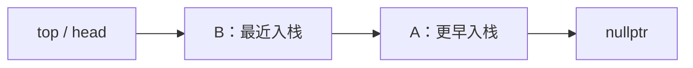
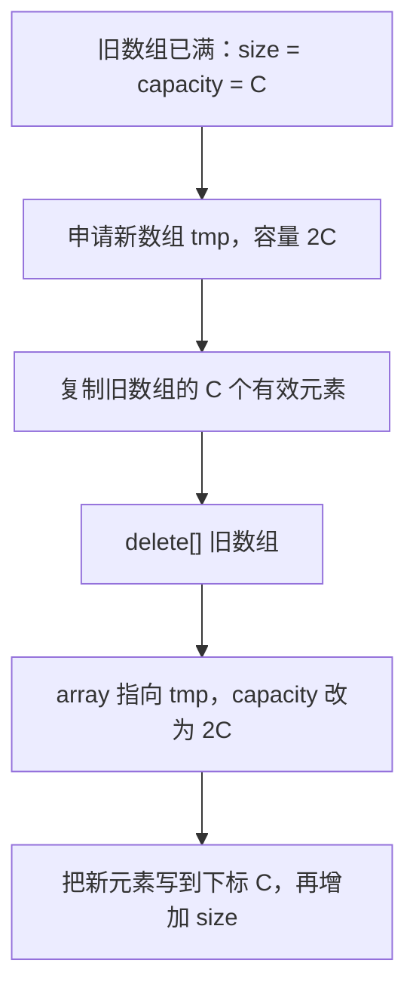
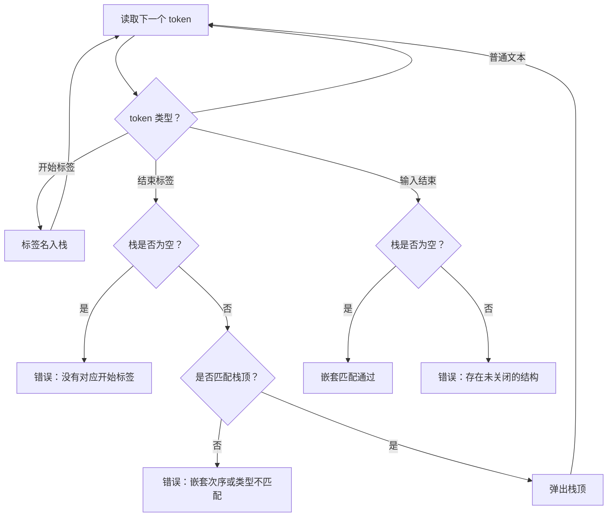
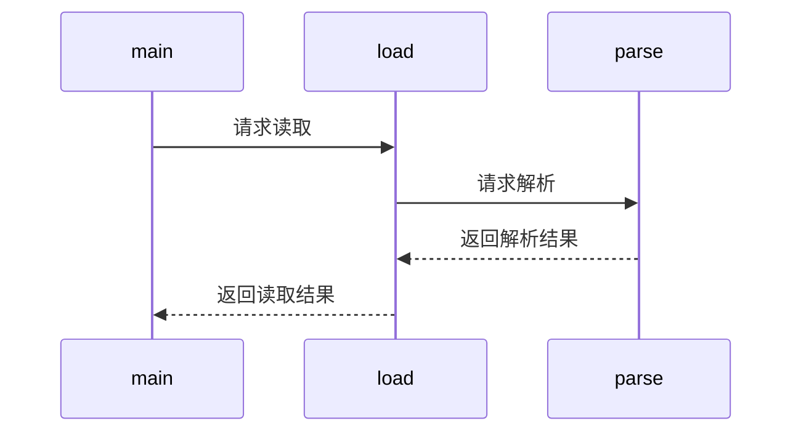

# C3.1 栈 Stack

> [!abstract] 这一讲的任务
> 上一章允许我们在线性表中任意位置增删，现在把规则收紧：只能碰最近放进去的元素。我们先弄清这种限制为什么有用，再实现栈、解决扩容的效率问题，最后用同一套操作完成标签匹配、函数调用和表达式求值。

> [!info] 怎么读这份讲义
> **全章只用这一个文件**。首次学习按目录顺读；复习时先看「十一、这一讲的三句话」，再做自测。
> 现有转写稿仅覆盖第一、第二节课；按已有 MOC 的记录，截止第 1 章。**没有本章转写稿，无法确认 Stack 的实际授课进度**，因此不逐段标注「课堂未讲」。正文以课件为骨架，独立增加的解释、代码与推导注明「（补充）」，不冒充课堂原话。
> PDF 全部 103 页已做文字与页面图像检查；未发现可确认的课堂手写批注。第 18 页有初始化顺序的红圈，第 100–102 页右下有红色禁止样式符号，**仅凭符号不能认定 STL 不考或禁止使用**。

> [!info] 课程信息与来源
> **Ya-Hui Jia（贾雅慧）｜SFT SCUT｜jiayahui@scut.edu.cn**。指定教材、考核等全课程信息见 [[C1.0 课程信息与C++预备]] 与 [[数据结构 MOC]]。
> 课件内容编号为 **3.2**，本库接在线性表之后记为**第 3 章**；文件名 C3.1 表示本章唯一的全章讲义，不表示只整理课件第一小节。



## 目录与课件对应

| 阅读入口 | 课件页码 | 内容 |
| --- | --- | --- |
| [[#零、开场：撤销为什么要倒着来]]、[[#一、把操作限制在线性表的一端]] | 1–6 | Stack ADT、LIFO、应用动机 |
| [[#二、链式栈：把链表头当作栈顶]] | 7–13 | 单链表接口、封装、边界检查 |
| [[#三、顺序栈：把数组尾当作栈顶]] | 14–24 | 成员、构造析构、top/pop/push、满栈策略 |
| [[#四、扩容：从一次很慢到整体很快]] | 25–45 | 扩容过程、加常数与乘常数、摊还分析 |
| [[#五、标签与括号匹配]] | 46–69 | XHTML、HTML/XML、C++ 语法错误 |
| [[#六、函数调用为什么天然形成栈]] | 70–72 | 子问题、返回地址、调用栈 |
| [[#七、逆波兰表达式：让顺序自己表达优先级]] | 73–99 | 后缀表达式、完整逐步求值 |
| [[#八、STL 的 stack：接口相同，细节别混]] | 100–102 | 容器适配器、接口与示例 |
| [[#九、章节作业与解题路线]] | 103 | LeetCode 20、682、1190 |
| [[#十、课件勘误与阅读边界]]、[[#十一、这一讲的三句话]]、[[#本节自测 Self-Test]] | 全章 | 校正口径、复习、自测 |

---

## 零、开场：撤销为什么要倒着来

你在编辑一张图片：先裁剪，再调亮，最后加文字。现在按一次撤销，最自然的是去掉刚加的文字；再按一次，才撤销调亮。若先撤销裁剪，后续操作所依赖的画布可能都变了。

我们需要保存操作历史，但不能随便挑一条拿出来执行：**最新留下、尚未撤销的那条，要先处理**。你刚才描述的，就是后进先出的访问规则。

> [!question] 停一下，先自己想想
> 用上一章的线性表能存这些操作吗？能。那为什么还要单独定义一种栈？

普通线性表允许按位置插入和删除，提供的自由超过了当前需求。自由越多，越容易误用；而且数组在中间插入会搬移元素。只允许在一端增删，可以同时让接口更贴近任务、让实现更高效。这正好接上 [[C1.2 抽象数据类型与容器操作]] 的思想：**ADT 描述允许做什么，不等于暴露底层能做的一切。**

## 一、把操作限制在线性表的一端

### 1.1 从历史记录到 Stack ADT（p.3–4）

> [!important] 栈 Stack 的定义
> 栈是具有明确线性次序、只允许在同一端逐个插入和删除元素的抽象数据类型。允许操作的这一端叫**栈顶 Top**，另一端叫**栈底 Bottom**。
> 入栈 **Push** 把新元素放到栈顶；出栈 **Pop** 删除当前栈顶；读取栈顶 **Top/Peek** 只观察，不删除。
> 最近入栈且尚未出栈的元素最先出栈，即 **Last In, First Out，LIFO，后进先出**。

用序列 $S=(a_1,a_2,\ldots,a_n)$ 表示栈，约定左侧为栈底，右侧为栈顶：

| 操作 | 前置条件 | 结果 |
| --- | --- | --- |
| `push(x)` | 存储资源允许；有界实现还需未满 | $S\gets(a_1,\ldots,a_n,x)$ |
| `top()` | $n>0$ | 读取 $a_n$，栈不变 |
| `pop()` | $n>0$ | 删除 $a_n$；是否返回它由接口约定 |
| `empty()` | 无 | 返回 $n=0$ 是否成立 |
| `size()` | 无 | 返回元素数 $n$ |

`size()` 是常用查询；课件自定义 Stack 的基本声明只列 `empty/top/push/pop`，STL 部分才显式列出 `size()`。



图里的左右方向只是画法。真实实现可以让栈顶处于数组尾部或链表头部；**LIFO 不要求内存在屏幕上向上增长**。

### 1.2 一次操作轨迹（补充）

| 动作 | 返回值（采用课件 pop 返回元素的接口） | 栈底 → 栈顶 |
| --- | --- | --- |
| `push(13)` | 无 | `[13]` |
| `push(42)` | 无 | `[13,42]` |
| `top()` | `42` | `[13,42]` |
| `pop()` | `42` | `[13]` |
| `push(7)` | 无 | `[13,7]` |
| `pop()` | `7` | `[13]` |
| `pop()` | `13` | `[]` |

> [!warning] 两个空栈边界
> 对空栈调用 `top()` 或 `pop()` 没有合法的栈顶可处理，属于**下溢 Underflow** 情形。课件自定义类通过抛出异常处理；不能据此推断 `std::stack` 也会抛相同异常。
> **上溢 Overflow** 是有界存储容量耗尽的问题，不是无界抽象栈固有的状态。

### 1.3 什么时候能想到栈（p.5–6）

课件列出：代码括号匹配、XML/XHTML 标签解析、跟踪函数调用、撤销/重做、逆波兰计算器和汇编语言。第 6 页用「大问题引出子问题，子问题完成后回到原问题」解释这种次序，并署参考 **Donald Knuth**，未列具体书名页码。

这些场景共同的判断句是：**新问题暂时盖住旧问题，新问题处理完才恢复旧问题。**

> [!note] 撤销与重做的两个栈（补充）
> 执行新操作时，把它记入撤销栈；撤销时从撤销栈取出，执行逆操作后放入重做栈；重做时反向转移。撤销后若执行全新的编辑，通常要清空原重做历史，避免沿着已失效的分支继续。
> 栈负责记录次序，操作能否撤销还取决于是否保存了逆操作或必要的旧状态。

停一下，我们得到的不是一种特别的数组，而是一套访问规则。接下来要选合适的位置，让这些规则执行得快。

## 二、链式栈：把链表头当作栈顶

### 2.1 为什么不用链表尾（p.7–8）

假设沿用 [[C2.5 单链表实现]]，保存头指针和尾指针。你可能会想，既然有尾指针，把栈顶放在尾部不也方便吗？读尾元素和尾插确实快，但尾删需要找到倒数第二个结点，单向指针无法向前走，只能从头遍历。

| 单链表操作（有 head 和 tail） | 头部 Front | 尾部 Back |
| --- | --- | --- |
| 直接访问该端元素 | $\Theta(1)$ | $\Theta(1)$ |
| 插入 | $\Theta(1)$ | $\Theta(1)$ |
| 删除 | $\Theta(1)$ | $\Theta(n)$ |

课件表头写 `Find`，这里指**读取已知端点**，不是任意按值查找。按值查找仍可能遍历整表。

**把栈顶设为链表头，push/top/pop 就都不需要遍历。** 在把一次元素访问、复制和结点分配视为常数成本的课程模型下，三者都是 $\Theta(1)$。第 7 页「最优为常数时间」针对这些基本操作的目标，不是说所有算法都能做到常数时间。



入栈 `C`：先令新结点指向 `B`，再把 `head` 改为 `C`。出栈：先保留旧头的值和地址，将 `head` 移向后继，再释放旧头。只有一个结点时，若底层维护 `tail`，删除后也要把 `tail` 置空。

### 2.2 复用 Single_list 的哪些接口（p.9）

课件复习的 `Single_list<Type>` 保存 `head`、`tail`、`length`，提供以下接口：

| 接口 | 用途 | 栈是否需要 |
| --- | --- | --- |
| 构造、析构 | 初始化、释放结点 | 由成员对象自动执行 |
| `size()`、`empty()` | 长度和判空 | 判空必需，长度可选 |
| `front()`、`back()` | 读取首尾 | 只需 `front()` |
| `head()`、`tail()` | 取得结点指针 | 不向栈使用者暴露 |
| `count(value)` | 统计值出现次数 | 不需要 |
| `push_front(value)`、`push_back(value)` | 头插、尾插 | 只需头插 |
| `pop_front()` | 删除并返回头元素 | 需要 |
| `erase(value)` | 按值删除 | 不需要 |

> [!warning] 课件声明中的命名问题（p.9）
> 展示代码同时出现名为 `head`、`tail` 的数据成员和同名成员函数。实际 C++ 类中不能照抄这种同名声明；可将数据成员改为 `head_`、`tail_`。本节重点是接口映射，底层链表实现应使用能编译的版本。

### 2.3 Stack 是怎样包住链表的（p.10–13）

下面将课件分散代码合到类内，改名 `ListStack` 避免与下一节冲突；`Single_list` 仍是课程已有依赖。课件的 `underflow()` 是课程异常类型，下面换成标准库异常，**这段不是独立的完整链表程序**。

```cpp
#include <stdexcept>

template <typename Type>
class ListStack {
private:
    Single_list<Type> list;
public:
    bool empty() const { return list.empty(); }

    Type top() const {
        if (empty()) throw std::underflow_error("empty stack");
        return list.front();
    }

    void push(Type const& obj) { list.push_front(obj); }

    Type pop() {
        if (empty()) throw std::underflow_error("empty stack");
        return list.pop_front();
    }
};
```

`Type const&` 表示以只读引用传入元素，避免传参时额外复制；末尾的 `const` 表示查询不修改当前栈对象。

> [!important] 不手写构造析构，不代表没有构造析构
> `list` 是对象成员，构造 `ListStack` 时会自动构造它，销毁 `ListStack` 时会自动析构它。因此这里无需额外写只会重复工作的构造、析构函数。底层 `Single_list` 仍必须正确释放结点，并正确处理复制行为。

我们只是把 `push_front` 换了一个更符合栈的名字 `push`，并隐藏其他接口。这种「存储复用、接口收窄」的思想会在 STL 部分再次出现。

## 三、顺序栈：把数组尾当作栈顶

### 3.1 换到数组后，应该选另一端（p.14–16）

数组头插会把已有元素整体后移，头删会前移；尾部增删只需操作最后一格。所以同样是栈，数组实现应选**有效元素区的尾部**。

| 连续数组操作 | 头部 | 尾部 |
| --- | --- | --- |
| 读取该端元素 | $\Theta(1)$ | $\Theta(1)$ |
| 插入 | $\Theta(n)$ | 未扩容时 $\Theta(1)$ |
| 删除 | $\Theta(n)$ | 不缩容时 $\Theta(1)$ |

保存三个成员：`Type* array` 指向数组首元素；`stack_size` 是当前元素数；`array_capacity` 是已分配容量。默认构造容量为 `10`，传入容量通过 `max(1,n)` 保证至少为 `1`。

> [!important] 始终成立的约定 Invariant
> $$0\le \text{stack\_size}\le \text{array\_capacity}$$
> 有效元素在下标 $[0,\text{stack\_size})$；非空时栈顶下标为 $\text{stack\_size}-1$；下次入栈位置为 $\text{stack\_size}$。
> `stack_size` 是**元素个数兼下一空位下标**，不是当前栈顶下标。

```text
下标       0      1      2      3      4
数组      [A]    [B]    [C]    [空]   [空]
                         ↑      ↑
                     当前栈顶  下次写入
stack_size = 3，array_capacity = 5
```

### 3.2 构造、析构与初始化顺序（p.17–19）

只有一个指针并不等于有了一块数组空间，构造时要真正申请数组：

```cpp
// 课件关键写法；成员声明顺序必须与这里的依赖一致。
Stack(int n = 10)
    : stack_size(0),
      array_capacity(std::max(1, n)),
      array(new Type[array_capacity]) {}

~Stack() { delete[] array; }
```

第 18 页红圈强调：**成员初始化按类内声明顺序执行，不按初始化列表的书写顺序执行。** `array` 的初始化需要已确定的 `array_capacity`，故容量成员必须声明在指针之前。

`new Type[C]` 创建数组；对应 `delete[]`，不能用单对象的 `delete`。课件把申请与归还简化为「向操作系统要内存、还内存」；实际通常经由运行库分配器，不必每次都直接进入操作系统。

### 3.3 判空、读栈顶与出栈（p.20–22）

判空直接写 `return stack_size == 0;`，比较表达式本来就是布尔值，无需再写一套 `if/else` 返回真假。

读栈顶先判空，再返回 `array[stack_size - 1]`。

课件出栈核心是：

```cpp
if (empty()) throw underflow();
--stack_size;
return array[stack_size];
```

假设原来有 `A,B,C`，`stack_size` 从 `3` 减为 `2`，返回 `array[2]` 中的 `C`。**新栈顶是 `array[1]` 中的 B**；`array[2]` 是刚被排除出有效区的旧栈顶。

> [!question] 课堂追问：不把 C 清零，真的删掉了吗？
> 对栈这个 ADT，删掉意味着 C 不再属于有效序列。此后 `top()` 只能看到 B，下次入栈会覆盖旧位置，逻辑删除已经完成。

不能用「写入 `0`」表示删除，因为元素类型可能是字符串或其他不能接收数字零的类型；而且清零并不会改变元素个数。

> [!note] 逻辑删除与对象析构（补充）
> 课件使用 `new Type[capacity]`，数组里的类类型对象在分配时就被构造。仅减小 `stack_size` 不会立即析构那个槽位的对象，资源可能保留到覆盖或 `delete[]` 时才释放。
> 这解释了教学数组栈与成熟容器的区别：不能把这份代码当成适用于任意大型资源对象的完整容器实现。

### 3.4 入栈与满栈的五种选择（p.23–24）

入栈顺序是先检查容量，再写 `array[stack_size] = obj`，最后 `++stack_size`。若先递增再按新下标写，会跳过应写位置。

固定数组满了可以抛上溢异常，但课件追问：这是不是最好的解决方式？它列出五种选择：

| 满栈策略 | 含义及适用边界（解释为补充） |
| --- | --- |
| 增大数组 | 保留已有数据，后续专门分析效率 |
| 抛异常 | 明确告诉调用者操作未完成 |
| 忽略新元素 | 必须由业务明确接受丢弃，不能默默冒充成功 |
| 替换当前栈顶 | 改变通常的 push 语义，须事先约定 |
| 让入栈进程等待 | 需要另一个执行者移除元素并唤醒，否则可能一直等 |

有界栈可增加 `bool full() const`。抽象栈不规定固定容量，但任何实际程序最终都受内存限制。

### 3.5 可编译的固定容量版本（补充）

下面保留课件的数组与下标思路，补上标准异常和禁用复制。用 `Type=int` 跟踪最容易；一般类型须可默认构造和复制。`pop()` 先复制返回值再修改大小，便于理解，但并非完整的通用异常安全容器。

```cpp
#include <algorithm>
#include <stdexcept>

template <typename Type>
class ArrayStack {
private:
    int stack_size;
    int array_capacity;
    Type* array;

public:
    explicit ArrayStack(int n = 10)
        : stack_size(0), array_capacity(std::max(1, n)),
          array(new Type[array_capacity]) {}

    ~ArrayStack() { delete[] array; }

    ArrayStack(ArrayStack const&) = delete;
    ArrayStack& operator=(ArrayStack const&) = delete;

    bool empty() const { return stack_size == 0; }
    bool full() const { return stack_size == array_capacity; }
    int size() const { return stack_size; }

    Type top() const {
        if (empty()) throw std::underflow_error("empty stack");
        return array[stack_size - 1];
    }

    void push(Type const& obj) {
        if (full()) throw std::overflow_error("full stack");
        array[stack_size] = obj;
        ++stack_size;
    }

    Type pop() {
        if (empty()) throw std::underflow_error("empty stack");
        Type result = array[stack_size - 1];
        --stack_size;
        return result;
    }
};
```

为什么禁止复制？默认复制只会复制 `array` 地址，两个栈会指向同一数组，最后重复释放。要允许复制，必须实现独立数组的深复制；此处先限制操作，避免在讲栈时引入完整资源管理实现。

停一下，两种实现已经统一起来：**链表取头，数组取尾，都是为了避免搬移或遍历。** 现在剩下的难题是：数组满了，怎样扩容才不让 push 越来越慢？

## 四、扩容：从一次很慢到整体很快

### 4.1 扩容不是把原数组原地拉长（p.25–35）

数组不能保证原地址后面还有连续空位，所以课件演示的是**申请另一块更大的数组，再搬过去**。



课件 p.26–35 的图用 `WATERLOO` 演示：原容量与元素数均为 `8`，扩容后容量变为 `16`，原先的 `8` 个元素位置次序不变。图中红箭头表示复制，淡灰旧数组表示已释放；`tmp` 和 `tmp_array` 都表示新数组的临时指针。扩容本身不增加 `stack_size`，后续入栈才增加。

课件 `double_capacity()` 合并后的原理代码如下。**只在已满时调用**，所以复制到 `array_capacity` 正好等于复制全部有效元素：

```cpp
void double_capacity() {
    Type* tmp_array = new Type[2 * array_capacity];
    for (int i = 0; i < array_capacity; ++i) {
        tmp_array[i] = array[i];
    }
    delete[] array;
    array = tmp_array;
    array_capacity *= 2;
}
```

不能先删旧数组再复制，否则读的是已释放内存；不能先把 `array` 指向新数组再寻找旧数据，否则丢失旧地址。临时指针的任务就是在搬迁过程中让新旧两块内存都可访问。

### 4.2 接入数组栈的教学改进（补充）

在上一节类中增加下面的私有函数，并把 `push()` 里的 `throw overflow_error` 换为 `double_capacity()`；同时增加头文件 `<memory>`、`<limits>`。其余代码不变。

```cpp
// 放在 ArrayStack 的 private 区域。
void double_capacity() {
    if (array_capacity > std::numeric_limits<int>::max() / 2)
        throw std::length_error("capacity too large");

    const int new_capacity = 2 * array_capacity;
    std::unique_ptr<Type[]> tmp(new Type[new_capacity]);
    for (int i = 0; i < stack_size; ++i)
        tmp[i] = array[i];

    delete[] array;
    array = tmp.release();
    array_capacity = new_capacity;
}
```

`unique_ptr` 暂时管理新数组：若复制途中抛异常，会自动回收它。全部复制成功后 `release()` 转移所有权，后续由栈的析构函数释放。这里循环使用 `stack_size`，即使以后改成未满时预扩容，也不会读取未使用槽位。

这仍是服务于本章的教学版本：不支持移动独占型元素，不完整实现标准容器的对象生命周期管理。分析时间时，假定单个元素的复制、构造和销毁成本为常数。

### 4.3 一次 push 的最坏情况（p.36–37）

不满时只有写值、加一，成本 $\Theta(1)$。已有 $n$ 个元素且满时，需要复制 $n$ 个元素，再写新值，这一次为 $\Theta(n)$。

> [!question] 停一下，先自己想想
> 有一次 push 是线性的，是否意味着连续做很多次 push，每次都应按线性时间理解？

不能直接这么推。关键在于昂贵扩容出现的频率。一次搬家后能住很久，和每添一件家具就搬一次家，总花费完全不同。

> [!important] 摊还分析 Amortized Analysis
> 从规定的初始状态出发，把一串 $n$ 次操作的**总成本**除以 $n$，得到这串操作的每次摊还成本。若总成本为 $\Theta(f(n))$，对应摊还量为 $\Theta(f(n)/n)$。
> 这是对一串操作的确定性记账，**不需要假定随机输入或概率分布**，因此不等于概率意义的平均情况分析。

下面统一从**空栈、固定初始容量**出发，只做连续入栈、不缩容。先数「搬旧元素」的复制次数 $C(n)$；每次新元素本身还要写一次，故总时间为 $\Theta(n+C(n))$。不能把「没有搬旧元素」误认为「入栈不花时间」。

### 4.4 每次只加 1：几乎每次都要搬（p.38、40）

假设初始容量为 `1`。插入第 $k$ 个元素时，前面有 $k-1$ 个元素需要复制；第一个元素不触发搬迁。

$$
\begin{aligned}
C_1(n)
&=0+1+2+\cdots+(n-1)\\
&=\sum_{k=1}^{n}(k-1)\\
&=\frac{n(n+1)}2-n\\
&=\frac{n(n-1)}2=\Theta(n^2).
\end{aligned}
$$

除以 $n$，摊还复制次数为 $(n-1)/2$，因此 push 摊还时间是 $\Theta(n)$。

课件图每一列是一轮插入后的数组，灰格是已有元素，粉格是本轮新元素，红箭头表示搬迁。列越往右，要复制的旧元素越多，形成三角形累计工作量，和 [[C1.6 代码复杂度的计算方法]] 的三角形循环求和相同。

**空间代价**：每次插入结束后容量恰好等于大小，未用槽位为 `0`。课件 p.40 用 $\Theta(1)$ 概括浪费空间，但精确的 `0` 不应写成严格的 $\Theta(1)$；若只表示常数上界，应写 $O(1)$。此处不包括搬迁时临时共存的新旧数组。

### 4.5 每次加固定 m：把慢的常数变小，没有改变增长阶（p.43–44）

觉得每次加 `1` 太少，改成加 `4`、`8` 或 `100` 呢？先设初始容量为固定正整数 $m$，每次扩容加 $m$，插入总数 $n=\ell m$。

需要搬迁的次数序列是：

$$m,2m,3m,\ldots,(\ell-1)m.$$

所以

$$
\begin{aligned}
C_m(n)
&=\sum_{k=1}^{\ell-1}km
=m\frac{\ell(\ell-1)}2\\
&=\frac{n^2}{2m}-\frac n2
=\Theta\left(\frac{n^2}{m}\right),\\
\frac{C_m(n)}n&=\frac{n}{2m}-\frac12.
\end{aligned}
$$

**当 $m$ 是不随 $n$ 变化的常数**，摊还时间仍为 $\Theta(n)$。新容量插入一项后至多剩下 $m-1$ 个空位，空间浪费为常数上界 $O(m)=O(1)$。

不能一边把 $m$ 当常数推 $\Theta(n)$，一边又令 $m=n$ 来反驳结论；那已经换了增长策略。

### 4.6 每次翻倍：昂贵复制之间隔着越来越多的便宜操作（p.39、41–42）

初始容量 `1`，容量序列为 `1,2,4,8,…`。先按课件取 $n=2^h$，其中 $h$ 是非负整数。插满 $n$ 个元素时，最后一次扩容是从 $n/2$ 到 $n$，之后一直填空位。

$$
\begin{aligned}
C_2(n)
&=1+2+4+\cdots+2^{h-1}\\
&=\sum_{k=0}^{h-1}2^k
=2^h-1=n-1.
\end{aligned}
$$

这个等比数列怎么得到和？设 $S=1+2+\cdots+2^{h-1}$，则 $2S=2+4+\cdots+2^h$，相减留下 $S=2^h-1$。

搬旧元素只需 $n-1$ 次，再加写新元素的 $n$ 次，合计 $2n-1$ 次元素写入，属于 $\Theta(n)$；每次 push 摊还为 $\Theta(1)$。

> [!example] 同样插入 8 个元素
> - 每次加 1：搬迁 $0+1+2+3+4+5+6+7=28$ 次，再加 8 次新写入，共 36 次。
> - 每次翻倍：搬迁 $1+2+4=7$ 次，再加 8 次新写入，共 15 次。
> - 每次加 4、初始容量 4：只在插入第 5 个时搬 4 次，共 12 次写入。这个小规模例子更快，不代表它在 $n$ 不断增长时仍优于倍增；渐进结论看的是长期增长。

课件图中的倍增列越来越疏：白格表示为后续插入预留的空间。因此「少复制」是以「暂时留空位」换来的。

### 4.7 任意 n 也成立，不必靠猜（补充）

课件 p.41 先限定 $n$ 为 2 的幂，然后把中间规模的行为视作类似。我们可以补出严格界。

当 $n>1$，插入结束后的容量是 $2^{\lceil\log_2 n\rceil}$，故

$$
C_2(n)=2^{\lceil\log_2 n\rceil}-1<2n.
$$

因此总时间 $\Theta(n+C_2(n))=\Theta(n)$，任意长度前缀的 push 摊还时间都是 $\Theta(1)$。

> [!warning] 「每次平均复制 1 次」不是任意时刻的精确常数
> 当 $n=8$，复制均值 $7/8=0.875$；当 $n=9$，刚扩容到 16，累计复制 $1+2+4+8=15$ 次，均值 $15/9\approx1.667$，已经大于 1。
> 所以正确结论是**摊还复制次数有常数上界**；单次扩容仍可能复制当前全部元素。

### 4.8 一般乘 r 与第 45 页的口径（补充）

设固定 $r>1$，先忽略容量取整，初始容量为 `1`，终点取 $n=r^h$，则

$$
C_r(n)=1+r+\cdots+r^{h-1}=\frac{n-1}{r-1},
\qquad
\frac{C_r(n)}n=\frac{1-1/n}{r-1}.
$$

所以填满一轮容量时，平均复制次数趋近 $1/(r-1)$。对任意刚扩容后的前缀，常数上界可以取约 $r/(r-1)$，不是始终不超过 $1/(r-1)$。实际用整数容量时要向上取整并保证容量增长；固定倍率下仍有 $\Theta(1)$ 的摊还结论。

倍率越接近 `1`，复制越频繁；倍率越大，复制越少但空位通常越多。**时间与空间的权衡**才是表格要传达的重点。

下面保留 p.45 的原表数值，避免修正时丢失课件口径：

| 策略 | 课件 Copies per Insertion | 课件 Unused Memory |
| --- | --- | --- |
| 加 1 | $n-1$ | $0$ |
| 加 m | $n/m$ | $m-1$ |
| 乘 2 | $1$ | $n$ |
| 乘 r | $1/(r-1)$ | $(r-1)n$ |

> [!warning] 这张表不能当作同一口径的精确等式
> 加 1 的 $n-1$ 对应第 $n$ 次插入的搬迁量，整串平均是 $(n-1)/2$；加 $m$ 的 $n/m$ 省略常数与边界；乘 2 的 `1` 和乘 $r$ 的 $1/(r-1)$ 接近**恰好填满容量时的平均值**，不是单次最坏值，也不是任意前缀的精确最坏摊还常数。
> 空位栏也用到了扩容前满数组规模的近似记号：旧容量为 $C$，扩成 $rC$ 并插入一个后，精确空位是 $(r-1)C-1$；若用插入后的元素数 $n=C+1$ 表示，就是 $(r-1)(n-1)-1$。

可放心用于复杂度比较的统一版本：

| 策略（从空栈连续入栈，不缩容） | n 次 push 总时间 | 每次 push 摊还时间 | 插入完成后空位 |
| --- | --- | --- | --- |
| 每次加 1 | $\Theta(n^2)$ | $\Theta(n)$ | 0 |
| 每次加固定 m | $\Theta(n^2)$ | $\Theta(n)$ | 至多 $m-1$ |
| 每次乘固定 r>1 | $\Theta(n)$ | $\Theta(1)$ | $O(n)$，某些时刻为 0 |

> [!note] 空间结论的两个边界（补充）
> **搬迁峰值**：旧容量 $C$ 翻倍时，新旧数组短暂共存，占 `3C` 个槽位；这是临时总占用，不是最终空位。
> **大量出栈以后**：本实现不缩容，容量由历史最大规模决定。若从很大栈弹到只剩一个，不能再说容量始终是当前元素数的常数倍。上面的 $O(n)$ 空位界针对连续入栈的分析过程。

停一下，我们并没有让每次搬家变快，而是让搬家更少。这个分析以后还会用在动态数组、缓冲区等结构中。

## 五、标签与括号匹配

### 5.1 为什么数目相等还不够（p.46–50）

你写了 `([)]`，左右圆括号各一个，左右方括号也各一个，却仍然不合法。只统计数量看不出交叉嵌套；读到 `)` 时，最近打开的其实是 `[`。

于是问题变成：**记录所有已打开但未关闭的结构，并始终先关闭最近打开的那个。** 这正好是栈。

课件先用 XHTML。标记语言 Markup Language 给正文添加结构或呈现信息；HTML 是 HyperText Markup Language；这里选择遵循 XML 规则的 XHTML，重点只讨论成对、嵌套的开始与结束标签。

```html
<html>
 <head><title>Hello</title></head>
 <body><p>This appears in the <i>browser</i>.</p></body>
</html>
```

`<title>` 是开始标签，`</title>` 是结束标签；应比较规范化后的标签名 `title`，而不是把两段完整字符串直接比较。

### 5.2 扫描规则与全部栈状态（p.50–63）

从左到右读：开始标签入栈；结束标签必须匹配栈顶，匹配成功就弹出；普通文本不影响栈；读完后栈必须为空。课件 p.50 的句子在 `and` 处结束，后续动画明确给出了「匹配后出栈」这一步。

| 当前标签 | 动作 | 处理后的栈底 → 栈顶 |
| --- | --- | --- |
| `<html>` | 入栈 html | `[html]` |
| `<head>` | 入栈 head | `[html,head]` |
| `<title>` | 入栈 title | `[html,head,title]` |
| `</title>` | 匹配 title，弹出 | `[html,head]` |
| `</head>` | 匹配 head，弹出 | `[html]` |
| `<body>` | 入栈 body | `[html,body]` |
| `<p>` | 入栈 p | `[html,body,p]` |
| `<i>` | 入栈 i | `[html,body,p,i]` |
| `</i>` | 匹配 i，弹出 | `[html,body,p]` |
| `</p>` | 匹配 p，弹出 | `[html,body]` |
| `</body>` | 匹配 body，弹出 | `[html]` |
| `</html>` | 匹配 html，弹出 | `[]` |

这是 p.51–62 动画的完整动作序列。图中淡灰标签表示已经退出有效栈区，不是仍留在栈里等待匹配的标签。



> [!important] 三种错误，缺一不可
> ① 结束标签与栈顶名称不符，例如 `<a><b></a></b>`；② 遇到结束标签时栈为空，例如 `</a>`；③ 输入结束栈仍非空，例如 `<a>`。
> 只检查最后栈空不够，中途遇到错误就必须报告；只检查中途不出错也不够，末尾仍可能漏关。

### 5.3 这个算法为什么正确、复杂度怎么算（补充）

扫描任意前缀后，栈从底到顶恰好保存该前缀中**尚未匹配的开始符号**，顺序由外到内。读到开始符号，就增加一个最内层；读到结束符号，就必须消掉这个最内层，其他层不能越过它关闭。这个不变式同时解释了算法和三类错误。

若 token 数为 $N$，每个 token 至多入栈一次、出栈一次，栈操作数为 $O(N)$。括号只有固定几种，比较是常数时间；标签名较长时，还应计入读取和比较字符的成本。最大嵌套深度为 $d$，栈存 $O(d)$ 个条目，最坏 $O(N)$。

### 5.4 HTML 与 XML 的界限（p.64–65）

课件展示一段旧式 HTML，省略了部分结束标签，甚至让斜体跨越列表项：

```html
<html>
  <head><title>Hello</title></head>
  <body><p>This is a list of topics:
  <ol>
    <li><i>veni
    <li>vidi
    <li>vici</i>
  </ol>
```

课件说明：列表开始隐含前一段落的结束，新的列表项隐含前一项结束，文件末尾又隐含一些结束标签。这需要 HTML 专门的解析规则，不能简单把所有开始标签入栈、等待同名结束标签就完事。

XML 是 eXtensible Markup Language，面向结构化信息交换；XHTML 是采用 XML 规则表达的 HTML。这里要记的是**严格成对嵌套适合栈模型**。课件关于旧 HTML 的说明用于历史对比，不是完整的现代网页解析规范。

> [!note] 真实解析器还需要什么（补充）
> 本例省略了属性、引号、注释、自闭合标签等词法细节。例如 `<item/>` 不会留下一个等待结束标签的未闭合项。单纯检查配对只解决结构问题，不负责判断整个文档是否满足全部语言规则。
> 不要用简单截取 `<` 和 `>` 的办法直接充当生产环境的 XML/HTML 解析器。

### 5.5 C++ 中是同一个嵌套问题（p.66–69）

课件示例：

```cpp
void initialize(int* array, int n) {
    for (int i = 0; i < n; ++i) {
        array[i] = 0;
    }
}
```

小括号 `()` 包住参数和控制条件，方括号 `[]` 表示下标，花括号 `{}` 包住作用域。它们的闭合次序必须由内到外。

| 课件错误示例 | 问题 | 课件编译输出中的关键信息 |
| --- | --- | --- |
| `std::vector<int> v(100];` | `(` 被 `]` 结束，应改为 `v(100);` | `expected ')' before ']' token` |
| `v[0] = 3];` | 多出 `]`，应为 `v[0] = 3;` | `expected ';' before ']' token` |

报错位置通常是解析器第一次发现不能继续的位置，不一定就是你最早写错的位置。具体诊断文字随编译器而异。课件 p.67 还用未配对左括号的漫画强调「没关完就一直悬着」的直觉，其信息已融入上面的嵌套解释。

### 5.6 仅括号字符串的完整实现（补充）

适用输入只包含 `()[]{}`；这也对应作业 20 的范围。代码对其他字符返回 `false`，**不直接解析完整 C++ 源码**，因为字符串字面量、注释里的括号不应按语法括号处理。

```cpp
#include <stack>
#include <string>

bool valid_brackets(std::string const& s) {
    std::stack<char> st;
    for (char c : s) {
        if (c == '(' || c == '[' || c == '{') {
            st.push(c);
        } else {
            char expected;
            if (c == ')') expected = '(';
            else if (c == ']') expected = '[';
            else if (c == '}') expected = '{';
            else return false;

            if (st.empty() || st.top() != expected) return false;
            st.pop();
        }
    }
    return st.empty();
}
```

`||` 短路求值：栈空时不会继续执行 `st.top()`，从而避免空栈访问。此函数对空串返回 `true`，符合空序列的配对定义；原题输入长度另有非空约束。

## 六、函数调用为什么天然形成栈

### 6.1 把大任务暂停，先解决子任务（p.70–72）

假设主程序 `main` 调用 `load` 读文件，`load` 又调用 `parse` 解析内容。`parse` 没结束前，`load` 的后续工作要暂停；`parse` 完成后，必须回到 `load` 的调用位置之后，最后才回到 `main`。



调用顺序是 `main → load → parse`，返回方向倒过来。最新进入且尚未结束的调用最先完成，这就是 LIFO。课件指出 CPU 为函数调用提供专门支持；这里的核心是**保存并恢复调用现场**。

### 6.2 栈帧与递归（补充）

一次尚未返回的调用需要记住：回到哪里继续执行，以及本次调用仍要使用的局部状态。常见实现把这些信息组织为**栈帧 Stack Frame**。具体哪些参数放寄存器、哪些内容放内存，取决于平台和调用约定，不能认为所有参数都一定放在栈上。

以阶乘递归为例：

```cpp
int factorial(int n) {  // 本例只讨论非负且结果不溢出的 n
    if (n == 0) return 1;
    return n * factorial(n - 1);
}
```

`factorial(3)` 先等待 `factorial(2)`，后者等待 `factorial(1)`，再等待 `factorial(0)`。到达基例后逐层返回：

$$0!=1,\quad1!=1\times1=1,\quad2!=2\times1=2,\quad3!=3\times2=6.$$

每层参数 `n` 都属于自己的调用，不会被下一层改成同一个值。未做相关优化时，递归深度为 $\Theta(n)$，辅助调用空间也为 $\Theta(n)$；不能只数函数体里声明了几个变量。

> [!warning] 两种「栈」不要混成一种实现
> 本章的 Stack ADT 是逻辑访问规则；程序调用栈是运行时保存调用现场的一种机制。自己写的数组栈可以把数据动态分配在堆上，仍然是栈 ADT。
> 调用栈过深可能耗尽运行时栈空间，这与自定义有界数组栈的 `overflow_error` 不是同一个异常机制。

> [!note] 与 AI 实践的联系（补充）
> 遍历模型结构、表达式树或搜索空间时，深度优先过程可以用递归，也可以显式保存待恢复状态到栈。两者都在管理「做完子任务后回哪里」。
> 自动微分需要按依赖的逆序传播梯度，但存在分支和共享结点时还要管理完整计算图与梯度累加，不能简单等同于把前向函数列表倒着弹出。

现在我们知道如何恢复程序的旧任务。下一步把「还没算完的子表达式」也看成待处理任务，就能得到不用括号的计算方式。

## 七、逆波兰表达式：让顺序自己表达优先级

### 7.1 同样的数和符号，括号一变答案就变（p.73）

你要写一个计算器，输入 `(3 + 4) × 5 − 6`。从左往右看见 `+`，不能对一般中缀表达式立即计算，因为接下来可能有优先级更高的乘法；还要处理括号。我们习惯的**中缀表达式 Infix Notation**，把运算符写在操作数之间，优先级和括号负责决定计算顺序。

| 课件中缀表达式 | 先算什么 | 结果 |
| --- | --- | --- |
| $(3+4)\times5-6$ | $3+4=7$，再 $7\times5=35$，最后减 6 | 29 |
| $3+4\times5-6$ | $4\times5=20$，再 $3+20-6$ | 17 |
| $3+4\times(5-6)$ | $5-6=-1$，再 $4\times(-1)=-4$，最后加 3 | −1 |
| $(3+4)\times(5-6)$ | 两组括号得 7 和 −1，再相乘 | −7 |

能不能在写表达式时，就把计算次序编进去，让读取者不再比较运算优先级？

### 7.2 先给材料，再下指令（p.74–79）

把二元运算 `a op b` 改为 `a b op`，即先写两个操作数，再写运算符。这叫**后缀表达式 Postfix Notation**，也叫**逆波兰表示法 Reverse-Polish Notation，RPN**。

课件将名称关联到数学家 **Jan Łukasiewicz**，提及其在逻辑领域的贡献，并配有人物照片和文字游戏漫画。理解名字即可，无需把这些装饰图当作算法步骤。

例如 `(3+4)×5−6` 写为：

```text
3 4 + 5 × 6 −
```

读到 `3`、`4`，先保存；读到 `+`，材料已齐，取出两数算成 `7`。接着读 `5`，遇 `×` 算成 `35`；读 `6`，遇 `−` 算成 `29`。

| 中缀 | 后缀 | 逐次运算结果 |
| --- | --- | --- |
| $(3+4)\times5-6$ | `3 4 + 5 × 6 −` | 7 → 35 → 29 |
| $3+4\times5-6$ | `3 4 5 × + 6 −` | 20 → 23 → 17 |
| $3+4\times(5-6)$ | `3 4 5 6 − × +` | −1 → −4 → −1 |
| $(3+4)\times(5-6)$ | `3 4 + 5 6 − ×`（补充） | 7、−1 → −7 |

> [!important] RPN 求值规则
> 从左到右扫描 token：操作数入栈；遇二元运算符，**先弹右操作数 b，再弹左操作数 a**，计算 `a op b`，结果重新入栈。
> 运算符的元数固定、token 划分明确时，不需要括号，也不用在求值阶段比较运算符优先级。

这里栈中保存的既可能是原始数字，也可能是已算好的子表达式结果。更早的值留在栈底，等待其后完整子表达式计算结束。

> [!warning] 减法、除法不能颠倒
> `4 30 −` 应算 `4−30=−26`。先弹的是 `30`，它是右操作数；若照弹出次序算成 `30−4` 就错了。加法和乘法有交换律，会掩盖这个错误。

课件 p.77–78 强调「操作数先准备好，再执行运算」，并列举 PostScript、PDF 的相关操作数在前的指令表示，以及部分 HP 计算器。这可帮助理解汇编中先装入寄存器再运算的过程：

```text
MOVE.L #$2A, D1    ; 把十六进制 2A，即十进制 42，装入 D1
MOVE.L #$100, D2   ; 把十六进制 100，即十进制 256，装入 D2
ADD D2, D1        ; D1 ← D1 + D2，得到 298
```

这里是课件给定的汇编风格，不是跨处理器通用语法。**RPN、调用栈、寄存器机器具有相关的计算直觉，但不能由此推出所有处理器都直接按 RPN 指令运行**；p.75 的广泛表述应按教学类比理解。

### 7.3 课件大题：从空栈一直算到 250（p.80–98）

> [!question] 课件原题（p.80）
> Evaluate the following reverse-Polish expression using a stack:
> ```text
> 1 2 3 + 4 5 6 × − 7 × + − 8 9 × +
> ```
> 建议先遮住下表，自己写出每读一个 token 后的完整栈。约定左侧栈底、右侧栈顶。

| 步骤 | token | 动作 | 操作后的栈底 → 栈顶 |
| --- | --- | --- | --- |
| 0 | 开始 | 初始化 | `[]` |
| 1 | `1` | 入栈 | `[1]` |
| 2 | `2` | 入栈 | `[1,2]` |
| 3 | `3` | 入栈 | `[1,2,3]` |
| 4 | `+` | 弹 3、2，算 $2+3=5$ | `[1,5]` |
| 5 | `4` | 入栈 | `[1,5,4]` |
| 6 | `5` | 入栈 | `[1,5,4,5]` |
| 7 | `6` | 入栈 | `[1,5,4,5,6]` |
| 8 | `×` | 弹 6、5，算 $5\times6=30$ | `[1,5,4,30]` |
| 9 | `−` | 弹 30、4，算 $4-30=-26$ | `[1,5,-26]` |
| 10 | `7` | 入栈 | `[1,5,-26,7]` |
| 11 | `×` | 弹 7、−26，算 $-26\times7=-182$ | `[1,5,-182]` |
| 12 | `+` | 弹 −182、5，算 $5+(-182)=-177$ | `[1,-177]` |
| 13 | `−` | 弹 −177、1，算 $1-(-177)=178$ | `[178]` |
| 14 | `8` | 入栈 | `[178,8]` |
| 15 | `9` | 入栈 | `[178,8,9]` |
| 16 | `×` | 弹 9、8，算 $8\times9=72$ | `[178,72]` |
| 17 | `+` | 弹 72、178，算 $178+72=250$ | `[250]` |

最终必须**恰好剩一个值**，答案为 `250`；本题最大栈深为 `5`，出现在读到数字 `6` 后。

> [!warning] 动画文字笔误
> p.82 标题误写 `Push 1`，高亮 token 和栈内新增元素均是 `2`，应为入栈 2；p.95 同样误写 `Push 1`，应为入栈 9。
> p.92 用 `−182+5` 描述加法也得到 −177，但按通用弹栈规则应写成 `5+(−182)`。这里结果没错，学习时仍保持「先弹右、再弹左」。

### 7.4 反推中缀，检查算的是不是同一个式子（p.98–99）

把栈中的数字换成表达式字符串，遇 `op` 就把 `a`、`b` 合成 `(a op b)`，可以恢复完整括号结构：

$$
\bigl(1-((2+3)+((4-(5\times6))\times7))\bigr)+(8\times9).
$$

按运算优先级去掉不必要括号，仍必须保留改变结合结构的括号：

$$1-(2+3+(4-5\times6)\times7)+8\times9=250.$$

如果把括号随意删掉，就变成课件 p.99 的另一个式子：

$$1-2+3+4-5\times6\times7+8\times9=-132.$$

核算：乘法先得到 `210` 与 `72`，其余为 $1-2+3+4=6$，故 $6-210+72=-132$。它的课件后缀表示是：

```text
1 2 − 3 + 4 + 5 6 7 × × − 8 9 × +
```

此序列先算 `6×7` 再与 `5` 相乘，在本例精确整数算术里与原式等价。**两题使用了相同的数和运算符，但运算符出现的位置不同，表达的是不同的运算结构。**

### 7.5 完整求值函数与非法输入（补充）

下面用 Python 写一个易读、可运行的四则运算求值器。支持多位整数和负数；除法明确约定为**整数除法向零截断**，例如 `−7/2` 得 `−3`。这项除法约定是补充，课件题目没有除法。

```python
def eval_rpn(tokens):
    st = []
    for token in tokens:
        if token not in {"+", "-", "*", "/"}:
            st.append(int(token))
            continue
        if len(st) < 2:
            raise ValueError("操作数不足")
        b = st.pop()             # 右操作数
        a = st.pop()             # 左操作数
        if token == "+":
            result = a + b
        elif token == "-":
            result = a - b
        elif token == "*":
            result = a * b
        else:
            if b == 0:
                raise ZeroDivisionError("除数为零")
            q = abs(a) // abs(b)
            result = -q if (a < 0) != (b < 0) else q
        st.append(result)
    if len(st) != 1:
        raise ValueError("表达式结束后必须恰好留下一个结果")
    return st[0]
```

使用 `.split()` 将空格分隔的 token 列表传入，乘号与减号用程序里的 `*`、`-`：

```python
expr = "1 2 3 + 4 5 6 * - 7 * + - 8 9 * +"
assert eval_rpn(expr.split()) == 250
```

空串、`1 +`、`1 2` 都不合法：分别对应没有结果、操作数不够、多出未消费的操作数。`int(token)` 也会拒绝不能解析的整数 token。

每个 token 只读一次；二元运算弹两次、压一次，在单次整数运算视为常数的模型下，时间 $\Theta(N)$、辅助空间 $O(N)$。若处理任意精度大整数，需另外计入位数相关的算术成本。

> [!note] 从中缀转后缀的思路（补充）
> 对只含二元 `+ - * /` 和括号的表达式，可以另设一个**运算符栈**：数字直接输出；左括号入栈；右括号令栈内运算符依次输出直到左括号，丢弃这对括号；读到运算符时，先输出栈顶优先级更高或相同的运算符，再压入当前运算符；最后清空运算符栈。
> 这里同级先弹是因为这四种二元运算符采用左结合；扩展到乘方、单目负号时需要另行定义结合性和词法规则。
> **转换时保存运算符，求值时保存操作数**，这两种栈的职责不同。

## 八、STL 的 stack：接口相同，细节别混

### 8.1 用已有容器包装出栈接口（p.100–102）

回想链式栈：真正存数据的是 `Single_list`，外层 Stack 只负责选出需要的接口。标准模板库 **Standard Template Library，STL** 中的 `std::stack` 也采用这种思路，称为**容器适配器 Container Adaptor**；课件用词是 `wrapper`。

课件为讲接口给出简化声明：构造、`empty()`、`size()`、`top()`、`push()`、`pop()`。实际 `std::stack` 还带底层容器模板参数，默认底层为 `std::deque<T>`，可用支持 `back/push_back/pop_back` 的 `vector`、`list` 等替换；`size()` 返回底层 `size_type`，不固定是 `int`；`top()` 有可修改与只读引用版本。[C++ 标准草案 stack 定义](https://eel.is/c++draft/stack)

```cpp
#include <iostream>
#include <stack>

int main() {
    std::stack<int> istack;
    istack.push(13);
    istack.push(42);
    std::cout << "Top: " << istack.top() << '\n';
    istack.pop();
    std::cout << "Top: " << istack.top() << '\n';
    std::cout << "Size: " << istack.size() << '\n';
}
```

输出：

```text
Top: 42
Top: 13
Size: 1
```

### 8.2 最大的接口陷阱：pop 不返回值

| 操作 | 课件自定义 Stack | std::stack |
| --- | --- | --- |
| `top()` | 返回元素的值 | 返回栈顶引用 |
| `pop()` | 返回被删除的元素 | 返回 `void`，只删除 |
| 空栈 `top/pop` | 示例显式抛下溢异常 | 使用前须确保非空，不能依赖自动抛下溢异常 |
| 存储方式 | 本章手写链表或数组 | 由底层容器负责 |

要取得并删除栈顶，写：

```cpp
if (!istack.empty()) {
    int value = istack.top();
    istack.pop();
    // 此时 value 是保留下来的独立副本。
}
```

不能写 `int value = istack.pop();`。也不要保存栈顶引用后弹出元素，再继续使用那条引用。

**这里又回到本章起点：实现可以换，允许的访问规则保持一致。** 底层容器能随机访问，不代表 `std::stack` 向你暴露下标访问或遍历接口。

## 九、章节作业与解题路线

> [!todo] 课件作业（p.103）
> 课件原文：**Homework: 20, 682, 1190**。
> 以下按本课程前章作业使用的 LeetCode 平台核对题意，题解思路与手算属于补充。课件本页未列提交方式或截止日期，不自行补造。

### 9.1 LeetCode 20：有效的括号（补充）

只包含 `()[]{}` 的输入要满足类型相同、顺序正确、每个右括号有对应左括号；具体题意见 [20. Valid Parentheses](https://leetcode.com/problems/valid-parentheses/description/)。本讲 5.6 的函数即可解决。

自选轨迹 `([)]`：读 `(` 后栈只有左圆括号；读 `[` 后从栈底到栈顶为左圆括号、左方括号；遇 `)`，栈顶却是 `[`，立即判错。不要继续弹栈直到找到 `(`，那会掩盖交叉嵌套。

时间 $O(N)$，空间最坏 $O(N)$。记住三种失败条件：空栈遇右括号、类型不符、读完仍有左括号。

### 9.2 LeetCode 682：棒球比赛（补充）

维护有效得分记录：数字增加新得分，`C` 撤销最近得分，`D` 增加最近得分的两倍，`+` 增加最近两个有效得分之和。最终求有效记录总和；原题保证操作有效。[682. Baseball Game](https://leetcode.com/problems/baseball-game/description/)

自选例子 `3, 4, C, D, +`：

| 操作 | 有效得分记录 |
| --- | --- |
| `3` | `[3]` |
| `4` | `[3,4]` |
| `C` | `[3]` |
| `D` | `[3,6]` |
| `+` | `[3,6,9]` |

最终总分 $3+6+9=18$。关键是 `+` **新增**结果，原有两个得分仍然有效；它和 RPN 的「消费两个操作数」不同。

```python
def baseball_score(operations):
    st = []
    for op in operations:
        if op == "C":
            st.pop()
        elif op == "D":
            st.append(2 * st[-1])
        elif op == "+":
            st.append(st[-2] + st[-1])
        else:
            st.append(int(op))
    return sum(st)
```

数组支持查看倒数两个元素；若严格使用 `std::stack`，可临时弹出顶部，读取下一项后把顶部恢复，再压入新分数。不要忘记恢复。整体时间 $O(N)$、辅助空间 $O(N)$。

### 9.3 LeetCode 1190：逐层反转括号内子串（补充）

从最内层括号开始反转其中内容，逐层向外，最终不保留括号；输入保证括号匹配。[1190. Reverse Substrings Between Each Pair of Parentheses](https://leetcode.com/problems/reverse-substrings-between-each-pair-of-parentheses/description/)

先写容易验证的字符栈版本：普通字符和左括号入栈；遇右括号，弹出到左括号为止，这些弹出的字符已经倒序；丢弃左括号，再按弹出顺序放回。

自选例子 `(ab(cd)e)`：先把 `cd` 反转为 `dc`，外层内容成为 `abdce`；再整体反转得 `ecdba`。

```python
def reverse_parentheses(s):
    st = []
    for ch in s:
        if ch != ")":
            st.append(ch)
        else:
            segment = []
            while st[-1] != "(":
                segment.append(st.pop())
            st.pop()             # 丢弃左括号
            st.extend(segment)   # segment 已经反转，不能再 reverse 一次
    return "".join(st)
```

> [!warning] 一趟扫描不自动等于线性时间
> 外层只遍历一遍字符串，但同一个字符可能随每一层括号反复弹出、压回。嵌套深度与字符数都随 $N$ 增长时，时间最坏 $O(N^2)$；存储空间 $O(N)$。

想进一步优化，可以先用栈配对括号位置，再把括号视为传送门：遇括号就跳到匹配处并反转扫描方向，普通字母直接输出。这样通过扫描方向表达反转，避免真的来回搬字符。

```python
def reverse_parentheses_linear(s):
    pairs = [-1] * len(s)
    st = []
    for i, ch in enumerate(s):
        if ch == "(":
            st.append(i)
        elif ch == ")":
            j = st.pop()
            pairs[i], pairs[j] = j, i

    result = []
    i, direction = 0, 1
    while 0 <= i < len(s):
        if s[i] in "()":
            i = pairs[i]
            direction = -direction
        else:
            result.append(s[i])
        i += direction
    return "".join(result)
```

配对阶段每个括号入栈、出栈一次。跳转阶段用改变方向表示每层反转，不复制子串；每个普通字符被输出一次，每对括号只发生常数次控制转移，总时间 $O(N)$、空间 $O(N)$。先理解字符栈版本，再读这个优化，比较容易把握为什么要「跳转后反向」。

## 十、课件勘误与阅读边界

| 页码 | 课件内容 | 本讲采用的解释或修正 |
| --- | --- | --- |
| 7 | 将最优运行时间概括为常数 | 针对本章基本栈操作；不能推广为所有算法 |
| 8 | 链表表格 `Find` 两端均为常数 | 指有端点指针时访问该端；不是按值查找 |
| 9 | 数据成员与成员函数都叫 head/tail | 实际 C++ 必须改名避免冲突 |
| 15 | 标题写 Destructor | 正文实际在介绍数组、大小、容量三个成员 |
| 18 | 成员声明和初始化列表被红圈标出 | 按成员声明顺序初始化，容量先于数组 |
| 22 | 减小大小后读取旧栈顶 | 返回旧栈顶；新的栈顶下标仍为新 size−1 |
| 24 | 满栈时的多种策略 | 是实现或业务选择，不都是标准 push 语义 |
| 40 | 加 1 的浪费空间写 Θ(1) | 插入结束的未用槽位精确为 0，可说 O(1) 上界 |
| 41–45 | 倍增先只算 2 的幂；对比表混用常数口径 | 补任意 n 的严格界，并保留原表与修正说明 |
| 50 | 策略句子止于 and | 后续动画确认匹配成功后要 pop |
| 64、68–69 | 旧 HTML 容错与 XHTML 解析器「纠错」的概括 | 作为课件历史性对比；不能当作严格 XML 解析器的通用保证 |
| 75、77–78 | 把 RPN 与处理器计算机制直接关联 | 用来解释先准备操作数的思想，不泛化为所有处理器架构 |
| 82、95 | `Push 1` | 分别应入栈 2、入栈 9；图与表达式高亮可交叉确认 |
| 92 | 先写 −182 再写 5 的加法 | 数值正确；通用规则仍按左操作数 5 加右操作数 −182 |
| 100 | STL 接口为简化声明，节号写 3.2.5.5 | 按 100–102 页整体归入 STL；实际 size_type 与底层参数另作说明 |
| 100–102 | 右下角红色禁止样式符号 | 未知具体教学含义，不据此标「不考」或「不准用 STL」 |

**页面覆盖**：p.1–103 全部检查，未跳读正文或演示页。p.26–35 扩容动画重组为流程与代码；p.51–62 标签动画重组为完整状态表；p.80–98 RPN 动画重组为完整计算表。操作结构、扩容流程、解析流程和调用过程用 Mermaid 或文字图重画；不裁切封面、人物照片及装饰漫画，没有额外图片依赖。

**数值核对**：课件算术结果 29、17、−1、−7、250、−132，以及大题各中间结果均复算一致；第 45 页问题是统计口径，非表达式算错。本文新增扩容样例、整数除法、递归和练习样例也已独立核算。

**内容来源边界**：未取得指定教材正文，也没有本章课堂转写；补充推导与代码是依据本章内容和标准算法知识展开。外部资料只用于核对实际 STL 接口与作业题意，相关链接已放在对应段落。

## 十一、这一讲的三句话

1. **栈限制在同一端操作，最新入栈且尚未出栈的元素最先处理；识别这种任务次序，比背 push/pop 更重要。**
2. **链表用头部、数组用尾部；倍增数组栈的单次 push 最坏是线性，但从空栈连续执行时摊还为常数。**
3. **匹配、调用和 RPN 都用栈保存尚未完成的上下文；先判空、正确理解栈顶、先弹右操作数，是避免错误的关键。**

### 操作复杂度速查

以下忽略单个元素类型内部的复杂成本；数组版本不缩容，链式版本维护大小时 `size()` 才为常数。

| 操作 | 链式栈（栈顶在头） | 固定数组栈 | 倍增数组栈 |
| --- | --- | --- | --- |
| `empty/top` | $\Theta(1)$ | $\Theta(1)$ | $\Theta(1)$ |
| `pop` | $\Theta(1)$ | $\Theta(1)$ | $\Theta(1)$ |
| `push` 单次最坏 | $\Theta(1)$ | 未满 $\Theta(1)$，满则报告失败 | $\Theta(n)$ |
| 连续 push 摊还 | $\Theta(1)$ | 容量内 $\Theta(1)$ | $\Theta(1)$ |
| 存储 | $\Theta(n)$，每个结点有指针 | $\Theta(C)$ | $\Theta(C)$，C 取决于历史最大规模 |

### 高频公式与核对值

| 内容 | 公式或数值 | 前提 |
| --- | --- | --- |
| 数组栈顶下标 | size−1 | 非空 |
| 下次入栈下标 | size | 有可用容量 |
| 每次加 1 总复制数 | $n(n-1)/2$ | 初始容量 1 |
| 每次加 m 总复制数 | $n^2/(2m)-n/2$ | 初始容量 m，n 为 m 的倍数 |
| 每次翻倍总复制数 | $n-1$ | 初始容量 1，$n=2^h$ |
| 任意 n 倍增总复制上界 | $C_2(n)<2n$ | 从空栈只入栈 |
| n=8：加 1 / 加 4 / 翻倍复制数 | 28 / 4 / 7 | 初始容量分别 1 / 4 / 1 |
| n=9：倍增复制数、最终容量 | 15、16 | 初始容量 1 |
| 课件 RPN 大题 | 250；最大栈深 5 | p.80–98 |
| 课件无括号对照式 | −132 | p.99 |

**下一章预告**：如果任务必须按到达先后公平处理，最新到的反而不能插队，我们就需要「先进先出」的队列 Queue。

## 本节自测 Self-Test

> [!question] Q1：依次执行 push A、push B、top、pop、push C、pop、pop，三次 pop 的结果是什么？top 会改变栈吗？

> [!success]- Q1 参考答案
> push A 后 `[A]`，push B 后 `[A,B]`；top 返回 B，栈仍 `[A,B]`。第一次 pop 返回 B，栈成 `[A]`；push C 得 `[A,C]`，接着返回 C、A，最终空栈。
> 三次 pop 为 **B、C、A**；top 不改变栈。

> [!question] Q2：既然单链表有 tail，为什么不把栈顶放尾部？

> [!success]- Q2 参考答案
> tail 能直接读尾元素，也能尾插，但删尾后必须更新 tail 为倒数第二个结点。单向指针不能从尾向前走，需要从 head 扫描，成本 Θ(n)。把栈顶放头部只需改 head，读、插、删均不遍历。

> [!question] Q3：数组容量 5，有效元素为 A、B、C，size=3。执行一次 pop 后，返回哪个槽位？新栈顶在哪里？下次 push D 写哪里？

> [!success]- Q3 参考答案
> 原栈顶 `array[2]=C`。pop 后 size=2，返回旧槽位下标 2 的 C；新栈顶 `array[1]=B`。随后 push D 写 `array[2]`，size 加回 3。被删槽位没有清零也不影响逻辑正确性。

> [!question] Q4：初始容量 1，连续 push 9 个元素，倍增时分别复制多少个元素？能不能说每次最多复制 1 个？

> [!success]- Q4 参考答案
> 第 2、3、5、9 次插入触发扩容，分别复制 1、2、4、8 个，合计 15 个。加上 9 次新元素写入，合计 24 次元素写入。最终容量 16、元素数 9、空位 7；复制均值 15/9≈1.667。
> 不能说单次最多复制 1 个：第 9 次就复制了 8 个。正确结论是摊还 Θ(1)，单次最坏 Θ(n)。

> [!question] Q5：为什么把扩容增量从 1 改成固定的 100，仍无法得到摊还常数时间？

> [!success]- Q5 参考答案
> 对 n=100ℓ，总复制数为 $100(1+2+\cdots+(\ell-1))=n^2/200-n/2$；除以 n 得 $n/200-1/2$，仍随 n 线性增加。100 只改变常数，不改变 Θ(n) 的摊还阶。

> [!question] Q6：`([)]`、`)`、`(()` 分别属于哪类括号错误？

> [!success]- Q6 参考答案
> `([)]`：读到右圆括号时，栈顶是左方括号，类型或嵌套顺序不符。
> `)`：一开始栈空，没有对应左括号。
> `(()`：第一个 `(` 入栈，第二个 `(` 入栈，`)` 只弹出一个；输入结束还剩一个左括号，未关闭。

> [!question] Q7：求 `8 3 − 2 /`，除法采用向零截断。遇到减号时先弹出的是谁？

> [!success]- Q7 参考答案
> 读入 8、3 后 `[8,3]`；减号先弹右操作数 3，再弹左操作数 8，得到 5，栈为 `[5]`；读 2 得 `[5,2]`；除号先弹 2 再弹 5，算 5/2 向零截断为 2，最终 `[2]`。

> [!question] Q8：RPN 最后只要栈不为空就能返回答案吗？

> [!success]- Q8 参考答案
> 不够，必须恰好一个值。`1 2` 最后有两个数，没有运算将它们组成一个完整表达式。中途遇运算符还须检查有至少两个操作数，如 `1 +` 不能继续。除法另需检查除数不为零。

> [!question] Q9：为什么 `int x = st.pop();` 对课件自定义栈可以，对 std::stack 不行？

> [!success]- Q9 参考答案
> 课件自定义接口的 pop 返回 Type，std::stack 的 pop 返回 void。后者应先确保非空，再 `int x = st.top(); st.pop();`。x 保存的是值副本，不能用已被删除栈顶的悬空引用代替。

> [!question] Q10：`factorial(3)` 为什么不只有 O(1) 辅助空间？作业 1190 为什么外层扫描一遍仍可能 O(N²)？

> [!success]- Q10 参考答案
> 阶乘会同时存在参数为 3、2、1、0 的 4 个未完全返回的调用；推广到 n，有 n+1 层，未优化的辅助空间 Θ(n)。
> 字符栈版括号反转中，字母可能被每层括号重新弹出并压回。当字母数和嵌套深度都为 Θ(N)，总字符搬移可达 Θ(N²)。预先配对括号、跳转并反向扫描，才能避免重复搬移而做到 O(N)。

---

上一章：[[C2.7 两种实现的比较]] ｜ 前置：[[C2.4 顺序表实现]]、[[C2.5 单链表实现]]、[[C1.6 代码复杂度的计算方法]] ｜ 返回：[[数据结构 MOC]]
