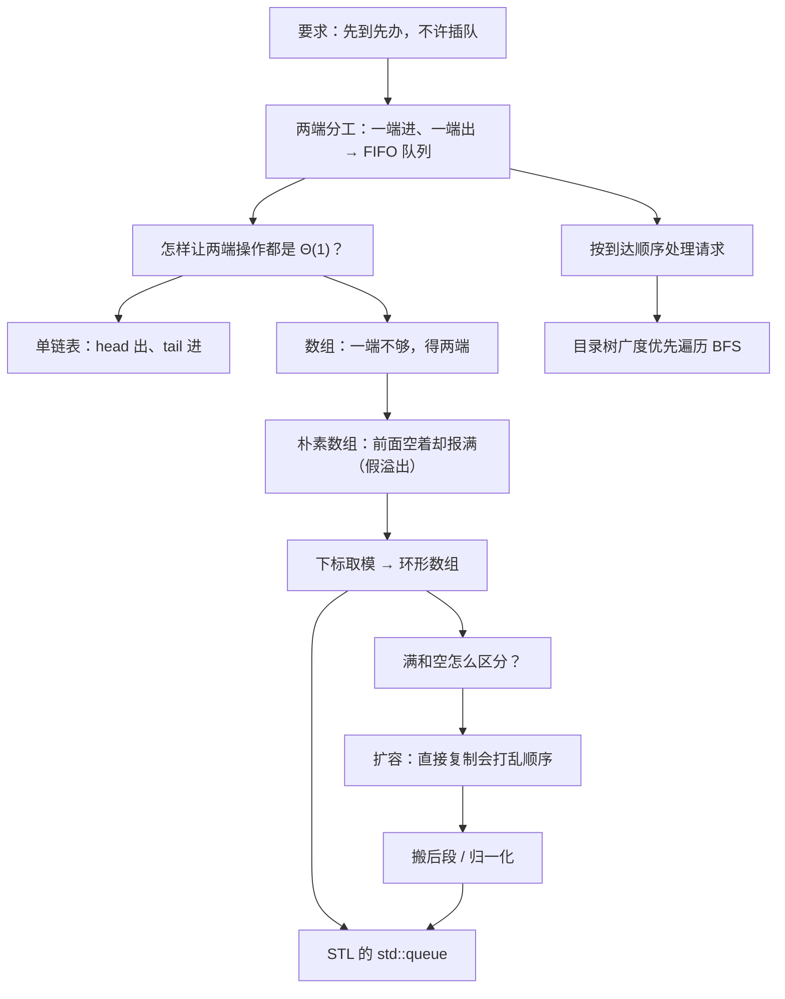
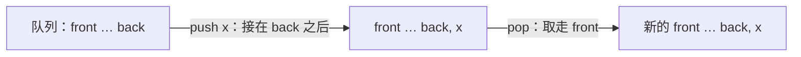
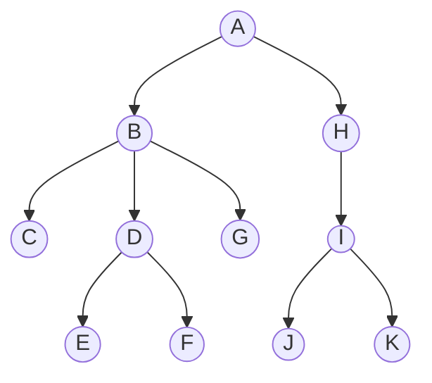

# C4.1 队列 Queue

> [!abstract] 这一讲的任务
> 上一章的栈把「最近来的」排在最前面。可现实里更多的场景恰恰相反：食堂窗口、打印机、服务器请求，谁先到谁先办，插队是不能容忍的。这一讲把线性表的两端分开用——一端只进、一端只出，得到队列。真正要花力气的不是概念（概念十分钟就懂），而是**用数组实现它时冒出来的那串坑**：假溢出、环形下标、满与空撞车、扩容时元素顺序被打乱。最后我们用队列做一次目录树的广度优先遍历。

> [!info] 怎么读这份讲义
> **全章只用这一个文件**，首次学习按目录顺读，复习时直接看「十三、这一讲的三句话」。
> 第五、六节是本讲的难点与考点集中区（假溢出 → 环形数组 → 满空判别），不要跳。
> 正文以课件为骨架；**课件没写、由教材与通行讲法补出的独立小节，标题末尾写「（补充）」**；推测性的内容会明说是推测，不冒充课件事实。

> [!info] 标注说明与授课进度
> 标有 **（拓展）** 或 **【拓展】** 的内容，是**课堂上没有讲到、由课件和教材延伸补充**的部分；复习时先掌握未标注的主干，行有余力再看拓展。
> **授课进度**：现有转写稿只到第四节课，内容停在第 3 章栈的「扩容过程」，队列尚未开讲。因此本篇**不逐条标注**「课堂未讲」（否则整篇都是标注，没有信息量）——请按「整篇尚未授课」理解。拿到队列的转写稿后，再按实际讲到的内容做合并与标注退役。

> [!info] 课程信息与来源
> **Ya-Hui Jia（贾雅慧）｜SFT SCUT｜jiayahui@scut.edu.cn**。指定教材、考核方式等全课程信息见 [[C1.0 课程信息与C++预备]] 与 [[数据结构 MOC]]。
> 课件内容编号为 **3.3**（接在栈的 3.2 之后），本库把队列记为**第 4 章**，与 MOC 的章节编号保持一致；文件名 C4.1 表示本章唯一的全章讲义，不表示只整理了课件第一小节。



## 目录与课件对应

| 阅读入口 | 课件页码 | 内容 |
| --- | --- | --- |
| [[#零、开场：窗口前的队伍]]、[[#一、把插入和删除分到两端]] | 1–6 | Queue ADT、FIFO、术语别名、异常 |
| [[#二、为什么到处都是队列]] | 7 | 客户–服务器模型与各类服务 |
| [[#三、两条实现路线与硬指标]] | 8 | 两种实现、Θ(1) 要求 |
| [[#四、链式队列：头出尾进]] | 9–12 | 单链表接口、Queue-as-List、四个函数 |
| [[#五、顺序队列：朴素做法是怎么撞墙的]] | 13–23 | 一端/两端数组、成员变量、构造析构、朴素 push/pop、假溢出 |
| [[#六、环形数组：让下标转圈]] | 24–26 | 循环下标、正确的 push/pop、满空判别、满了的几种处置 |
| [[#七、扩容：顺序不能在搬家时丢掉]] | 27–29 | 直接复制为什么错、搬后段、归一化 |
| [[#八、应用：目录树的广度优先遍历]] | 30–45 | BFS 动机、算法、逐步推演、结果次序 |
| [[#九、STL 的 queue]] | 46 | 容器适配器、示例、pop 无返回值 |
| [[#十、排队论 Queuing Theory（补充）]] | 课件列于提纲但无幻灯片 | 到达率、服务率、Little 公式 |
| [[#十一、章节作业与解题路线]] | 48 | LeetCode 225/641/649/1700 与匹配算法大作业 |
| [[#十二、课件勘误与阅读边界]]、[[#十三、这一讲的三句话]] | 全章 | 校正口径与复习 |

---

## 零、开场：窗口前的队伍

中午十一点五十，食堂窗口前站了十几个人。你走过去，站到最后一个人身后。打饭阿姨从最前面那位开始，一个一个来。没有人会因为「我刚到，我最新」而被优先处理——恰恰相反，**在队伍里待得最久的那个人先走**。

再看两个一模一样的场景：

- 实验室的打印机，三个人同时发了文件，打印机按提交时间依次打；
- 你在网站上点了一下，请求排进服务器的待处理队列，服务器空出来就取最早的那条。

这三件事的共同规则只有一句：**先来的先服务**。

> [!question] 停一下，先自己想想
> 上一章的栈也是「只在一端操作」的线性表。如果用栈来管理食堂队伍，会发生什么？

会发生：刚来的人被立刻服务，而第一个来的人只要后面不断有人来，就**永远排不到**——这在调度里叫**饥饿 Starvation**。栈的 LIFO 不是「坏」，它只是服务于另一类任务（撤销、匹配、回溯）。当任务要求的是公平和到达顺序时，我们需要把栈的规则翻过来。

翻过来的做法只有一个改动：**不要在同一端进出，而是一端只进、另一端只出**。你刚才在食堂排的那一次队，就是一次完整的队列操作。

## 一、把插入和删除分到两端

### 1.1 从队伍到 Queue ADT（p.3）

> [!important] 队列 Queue 的定义
> 队列是一种抽象数据类型，它：
> - 使用**明确的线性次序 explicit linear ordering**；
> - 插入和删除**逐个进行**；
> - **对插入的对象没有任何限制**，新插入（*pushed onto*）的对象被指定为队列的**队尾 Back**；
> - 被指定为**队首 Front** 的对象，是**在队列里待得最久**的那一个；
> - 删除操作（*popping from the queue*）删除**当前的队首**。

请注意定义里那句「对插入的对象没有任何限制」：它是在和后面要学的**优先队列 Priority Queue** 划界——普通队列不看元素的值，只看到达顺序；优先队列才按值排序。（这一区别到堆 heap 一章会重新出现。）

### 1.2 FIFO：先进先出（p.4）

> [!important] FIFO
> 队列也叫**先进先出 first-in–first-out（FIFO）**结构：最先入队的元素最先出队。
> 对照记：栈是 **LIFO**（后进先出），队列是 **FIFO**（先进先出）。两者都只允许在端点操作，区别仅在于**出的那一端是不是进的那一端**。

课件第 4 页用三条色块画了这件事：



图里的左右只是画法。真正被约束的是：**写入永远发生在 back 那一端，删除永远发生在 front 那一端。**

### 1.3 四个操作与它们的别名（p.5）

同一件事，不同的书和不同的库用不同的名字，考试和读代码时都会遇到：

| 本课件用法 | 常见别名 | 含义 |
| --- | --- | --- |
| `push` | **enqueue**（入队） | 在队尾插入一个元素 |
| `pop` | **dequeue**（出队） | 删除队首元素 |
| `front` | **head**（队头）、peek | 读队首元素，不删除 |
| （队尾位置） | **tail**、back | 最近入队的那一端 |

> [!warning] 最容易混的一组词
> `pop` 在**栈**里删的是**最后进来的**，在**队列**里删的是**最先进来的**。两边函数名一样，语义相反。读别人代码时先确认容器类型，再判断 `pop` 的含义。
> 另外，`front` 只读不删，`pop` 才删。很多人写出 `q.pop()` 之后才发现自己没有把队首的值存下来。

### 1.4 一次操作轨迹（补充）

设队列写作「队首 → 队尾」：

| 动作 | 返回值（按课件 pop 返回元素的接口） | 队首 → 队尾 |
| --- | --- | --- |
| `push(13)` | 无 | `[13]` |
| `push(42)` | 无 | `[13,42]` |
| `front()` | `13` | `[13,42]` |
| `pop()` | `13` | `[42]` |
| `push(7)` | 无 | `[42,7]` |
| `pop()` | `42` | `[7]` |
| `pop()` | `7` | `[]` |

把同样的动作序列喂给栈，三次取出的是 42、7、13；喂给队列，取出的是 13、42、7。**同一串输入，出来的次序正好体现了两种 ADT 的全部差别。**

### 1.5 两个异常（p.6）

课件原文：「There are two exceptions associated with this abstract data structure」，但幻灯片上**只列出了一条**：

> 对空队列调用 `pop` 或 `front` 是**未定义操作 undefined operation**。

> [!important] 「两个异常」指的是两种调用，不是两条独立规则（勘误订正）
> 这一行其实已经写全了：`front` 一个、`pop` 一个，**在空队列上各算一个异常**，合起来就是两个。
> 对照第 5 章可以确认这个数法：双端队列课件（[[C5.1 双端队列 Deque]] p.4）写的是「**四个**错误」，对应 `front`/`back`/`pop_front`/`pop_back` 四个操作，同样只跟了一行说明。**课件此处并无遗漏。**

> [!warning] 但**上溢 Overflow** 这一页确实没提（易错点）
> 抽象队列没有容量上限，可定长数组实现有。再 `push` 一个满了的定长队列就没位置可放，这是**实现层面**的问题。
> 两者的性质不同，别混：
> - **下溢 Underflow** 是**抽象层面**的错误——空队列没有队首，和用什么实现无关；
> - **上溢 Overflow** 是**实现层面**的限制——抽象队列没有容量上限，是定长数组带来的问题；链式实现只受系统内存限制。
> 这一条在第六节还会以 `bool full()` 的形式回来。

## 二、为什么到处都是队列

课件第 7 页给的主线是**客户–服务器模型 client-server model**：

- 多个客户端向一个或多个服务器请求服务；
- 服务器忙的时候，一部分客户端必须等待；
- 这些客户端被放进一个队列，**按到达顺序 in the order of arrival** 得到服务。

课件随后列举：

- 超市、银行、机场安检都在用队列（现实世界的队列）；
- **SSH Secure Shell 和 SFTP 是客户端**；
- 大多数共享计算机服务是服务器：Web、文件、ftp、数据库、邮件、打印机、**WOW（魔兽世界）**等。

> [!note] 补充：还有哪些地方藏着队列
> - **操作系统调度**：就绪队列、I/O 请求队列；带时间片的轮转调度 Round-Robin 就是「出队→跑一个时间片→没跑完再入队尾」。
> - **缓冲区 Buffer**：键盘输入、网络收包、音视频播放，生产者写入队尾、消费者从队首取，速度不匹配时由队列吸收抖动。
> - **广度优先搜索 BFS**：本讲第八节的主角，也是图论、最短路（无权图）、树的层序遍历的共同骨架。
> - **消息队列**：RabbitMQ、Kafka 之类中间件的核心抽象就是这个 ADT 的分布式版本。
>
> **接你的专业方向**：训练神经网络时的 `DataLoader` 用的是**预取队列**——工作进程不断把准备好的 batch 推进队尾，GPU 从队首取，用来把数据预处理和计算重叠起来；`num_workers` 和 `prefetch_factor` 调的就是这条队列的生产速度和容量。异步推理服务的 batching 队列也是同一个东西。

> [!question] 课堂追问
> 银行取号是 FIFO，可急诊室不是——重伤先治。急诊室用的是哪种数据结构？

不是队列，是**优先队列 Priority Queue**：出队的不是待得最久的，而是优先级最高的。它的高效实现是**堆 heap**，本课程后面有专门一章（课件目录中的 `heap.pptx`）。这里先留个记号：**「先进先出」和「最优先先出」是两种不同的 ADT，不要因为都排队就混为一谈。**

## 三、两条实现路线与硬指标

课件第 8 页把这一章的工程目标写死了：

> 我们考察两种实现：**单链表 Singly linked lists** 和**环形数组 Circular arrays**。
> 要求：**所有队列操作都必须在 Θ(1) 时间内完成。**

这个「Θ(1)」是本讲后面所有折腾的唯一理由。请把它当作一条验收标准：**任何让某个操作退化成 Θ(n) 的方案，直接淘汰。**

> [!question] 停一下，先自己想想
> 第 2 章我们已经有了顺序表和链表，两个都能存线性序列。那直接拿一个来用不行吗？为什么还要专门设计？

因为「能做」和「Θ(1) 地做」是两回事。队列需要**在一端插、在另一端删**，而第 2 章的结论是：顺序表在头部插删要搬 Θ(n) 个元素；单链表在尾部删要先找前驱，也是 Θ(n)。**两端同时快，要专门设计。**这正是 [[C1.2 抽象数据类型与容器操作]] 里那条思想的实例：**减少允许的操作，换取实现上的性能。**

## 四、链式队列：头出尾进

### 4.1 先撞一次墙：哪一端当队首（p.9）

课件第 9 页给出单链表带 `list_head` 和 `list_tail` 两个指针时的代价表：

| 操作 | 队首 / 第 1 个 | 队尾 / 第 n 个 |
| --- | --- | --- |
| Find（查看） | Θ(1) | Θ(1) |
| Insert（插入） | Θ(1) | Θ(1) |
| **Erase（删除）** | **Θ(1)** | **Θ(n)** |

课件结论：「删除只可能在头部做到 Θ(1)」，所以「抽象队列的行为可以通过**在尾部插入**来实现」。

> [!question] 停一下，先自己想想
> 如果反过来——把**队尾放在链表头、队首放在链表尾**，会怎样？

会挂在删除上。出队要删「队首」，而队首在链表尾；单链表的指针只指向后继，删掉尾结点必须把 `list_tail` 挪到**倒数第二个**结点，而想找到倒数第二个只能**从头遍历**，代价 Θ(n)。**它违反第三节那条硬指标，直接淘汰。**

> [!important] 记住这条对应关系
> **队首 = 链表头（出队 → `pop_front`）；队尾 = 链表尾（入队 → `push_back`）。**
> 这和第 3 章的栈形成一个漂亮的对照：栈把**头部同时当作进和出**的那一端；队列把**头部当出、尾部当进**。两者都只碰指针，不遍历。
> 对照 [[C2.5 单链表实现]]：`push_back` 之所以是 Θ(1)，全靠维护了 `tail` 指针；没有 `tail` 的裸单链表做不到。

### 4.2 复用已有的 Single_list（p.10）

课件说明这个类来自 **Project 1**（课程配套项目）：

```cpp
template <typename Type>
class Single_list {
    public:
        int size() const;
        bool empty() const;
        Type front() const;
        Type back() const;
        Single_node<Type> *head() const;
        Single_node<Type> *tail() const;
        int count( Type const & ) const;

        void push_front( Type const & );
        void push_back( Type const & );
        Type pop_front();
        int erase( Type const & );
};
```

注意这份接口里**只有 `pop_front`，没有 `pop_back`**——这不是遗漏，正是 4.1 那张表的结论写进了接口：删尾做不到 Θ(1)，索性不提供。**ADT 的接口本身就在表达实现的能力边界。**

### 4.3 Queue-as-List：用组合而不是继承（p.11）

```cpp
template <typename Type>
class Queue{
    private:
        Single_list<Type> list;
    public:
        bool empty() const;
        Type front() const;
        void push( Type const & );
        Type pop();
};
```

课件强调：这个队列类**只有一个私有成员变量**——一个单链表。

> [!note] 为什么是「有一个 has-a」而不是「是一个 is-a」（补充）
> 如果让 `Queue` 继承 `Single_list`，使用者就能调到 `push_front`、`erase` 这些**破坏 FIFO 约束**的函数，队列的语义就守不住了。把链表设为**私有成员**，只把四个合法操作暴露出去，外界**除了 FIFO 什么都做不了**。
> 这在 C++ 里叫**组合 composition**，在 STL 里叫**容器适配器 container adapter**——第九节的 `std::queue` 用的正是同一招。第 3 章的 Stack-as-List 也是这么做的。

### 4.4 四个函数（p.12）

课件说「实现和 Stack-as-List 非常相似」：

```cpp
template <typename Type>
bool Queue<Type>::empty() const {
    return list.empty();
}

template <typename Type>
void Queue<Type>::push( Type const &obj ) {
    list.push_back( obj );
}

template <typename Type>
Type Queue<Type>::front() const {
    if ( empty() ) {
        throw underflow();
    }
    return list.front();
}

template <typename Type>
Type Queue<Type>::pop() {
    if ( empty() ) {
        throw underflow();
    }
    return list.pop_front();
}
```

四个函数一共四行实质代码，因为**难的部分都在 `Single_list` 里做完了**。

> [!important] 停一下，我们刚才干了什么
> 我们没有写任何新的数据结构，只是**给已有的链表套了一层壳**，把可用操作从十几个砍到四个。砍掉的不是功能，是**误用的可能**——这就是 ADT 的价值。
>
> 链式队列的代价（把 `Single_list` 的实现代入）：
>
> | 操作 | 复杂度 | 原因 |
> | --- | --- | --- |
> | `empty` | Θ(1) | 读一个计数或判空指针 |
> | `front` | Θ(1) | 读 `head` 指向的结点 |
> | `push` | Θ(1) | 靠 `tail` 指针直接接上 |
> | `pop` | Θ(1) | 改 `head`，删旧结点 |
>
> **全部达标，没有摊还、没有最坏情况例外**——这是链式队列相对数组队列最干净的优势。代价是每个元素多存一个指针（存储密度约 1/3，见 [[C2.7 两种实现的比较]]），且结点分散、缓存不友好。

> [!warning] 出队时别忘了释放结点（补充）
> `pop_front` 必须 `delete` 掉被摘下的结点，否则每出队一次泄漏一个结点。`Single_list` 里已经处理了这件事，但自己手写链式队列时这是最常见的漏洞。另外队列析构时要把剩余结点全部释放。

## 五、顺序队列：朴素做法是怎么撞墙的

### 5.1 一端数组不行（p.13）

把队列放在一个**一端数组 one-ended array**（只在尾部增删，就是第 3 章栈的用法）里：

| 操作 | 队首 / 第 1 个 | 队尾 / 第 n 个 |
| --- | --- | --- |
| Find | Θ(1) | Θ(1) |
| **Insert** | **Θ(n)** | Θ(1) |
| **Erase** | **Θ(n)** | Θ(1) |

课件结论：一端数组**无法让所有操作都是 Θ(1)**。

原因就是 [[C2.4 顺序表实现]] 里算过的搬移代价：数组的下标必须连续，删掉 `array[0]` 之后要把后面 n−1 个元素整体前移一格。**一次出队搬 n 个元素，和硬指标差得远。**

> [!question] 停一下，先自己想想
> 可是删掉队首之后，为什么非得搬？让它空着不行吗？

正是这个念头救了我们——它就是下一页要做的事。**让队首「向右走」，而不是让数据「向左搬」。**

### 5.2 两端数组（p.14）

课件第 14 页：使用**两端数组 two-ended array**，通过「在尾部 push、在头部 pop」，所有操作都能 Θ(1)：

| 操作 | 队首 / 第 1 个 | 队尾 / 第 n 个 |
| --- | --- | --- |
| Find | Θ(1) | Θ(1) |
| Insert | Θ(1) | Θ(1) |
| Remove | Θ(1) | Θ(1) |

「两端数组」的意思是：**数据不再从下标 0 开始**，而是在数组中间占据一段连续区间，两头都留有余地；我们只记住这一段的起点和终点。出队时起点右移一格，入队时终点右移一格——**谁都不搬家**。

### 5.3 需要记住哪些信息（p.15–16）

要存数组，C++ 的做法是存**首元素的地址**：

```cpp
Type *array;
```

另外还需要：

```cpp
int queue_size;      // 当前队列里的元素个数
int ifront;          // index of the front entry，队首下标
int iback;           // index of the back entry，队尾下标
int array_capacity;  // 数组容量
```

完整类定义（课件 p.16）：

```cpp
template <typename Type>
class Queue{
    private:
        int queue_size;
        int ifront;
        int iback;
        int array_capacity;
        Type *array;
    public:
        Queue( int = 10 );
        ~Queue();
        bool empty() const;
        Type front() const;
        void push( Type const & );
        Type pop();
};
```

和第 3 章的 Stack-as-Array 相比，**多出来的成员只有 `ifront`**：栈只需要知道一端，队列要知道两端。`Queue( int = 10 )` 表示默认容量 10。

### 5.4 构造函数：为什么 `iback = -1`（p.17–18）

课件先约定语义，再定初值：

- `iback` 是**最近一次入队**的对象的下标；
- `ifront` 是**当前队首**对象的下标；
- 入队的动作是「**先让 `iback` 加一，再把新元素放到那个位置**」。

> [!question] 停一下，先自己想想
> 既然入队是「先加一再写入」，那么空队列时 `iback` 应该初始化成几，才能让**第一次入队正好写到下标 0**？

课件给的答案：

```cpp
iback  = -1;
ifront =  0;
```

第一次 `push` 时 `++iback` 得到 0，元素写进 `array[0]`，而 `ifront` 本来就是 0，**队首队尾同时指向这个唯一的元素，完全自洽**。

> [!important] −1 不是魔法数，是「先加后用」这条约定倒推出来的
> 换一种约定，初值就换：如果入队写成「**先写入再加一**」（也就是让 `iback` 表示**下一个可写位置**），那就该初始化 `iback = 0`。两种约定都能用，**但必须全程一致**，混用就会差一格。
> 这也是后面第六节判满判空时最大的分歧点——**先问清楚 `iback` 指的是「最后一个元素」还是「下一个空位」**。

构造函数（p.18）：

```cpp
#include <algorithm>
// ...

template <typename Type>
Queue<Type>::Queue( int n ):
queue_size( 0 ),
iback( -1 ),
ifront( 0 ),
array_capacity( std::max(1, n) ),
array( new Type[array_capacity] ) {
    // Empty constructor
}
```

课件说明：`new Type[array_capacity]` 是向操作系统申请 `array_capacity` 个对象的空间。

`std::max(1, n)` 是防御性写法——防止使用者传进 0 或负数导致 `new Type[0]` 甚至 `new Type[-3]`。这就是要 `#include <algorithm>` 的原因。

### 5.5 初始化顺序：课件专门圈出来的坑（p.19）

> [!warning] 初始化按**类声明中的顺序**执行，不按初始化列表里写的顺序
> 课件第 19 页用两个红圈把这件事标了出来：左边是构造函数的初始化列表，右边是类声明，两者的成员顺序必须对应。
> 关键在最后两个：`array( new Type[array_capacity] )` **用到了** `array_capacity`。如果在类声明里把 `array` 写在了 `array_capacity` **前面**，那么初始化 `array` 时 `array_capacity` **还是未定义的垃圾值**，`new Type[垃圾值]` 的后果可能是崩溃，也可能是悄悄分配了错误的大小——**后者更可怕，因为程序还能跑，只是偶尔越界**。
> 编译器一般会给出 `-Wreorder` 警告（当你打开这个警告时）。**看到 `-Wreorder` 不要忽略。**

> [!warning] 课件 p.19 与 p.16 的类声明不一致（勘误）
> - p.16 的成员顺序是 `queue_size, ifront, iback, array_capacity, array`；p.19 是 `queue_size, iback, ifront, array_capacity, array`。`ifront` 和 `iback` 互换了位置。**这两个互不依赖，谁先谁后都不影响正确性**，但初始化列表要跟着换，否则触发上面那条警告。
> - 更要紧的是：**p.19 的类声明里写的是 `Type top() const;`**，而 p.16 写的是 `Type front() const;`。队列没有 `top`，**这是从第 3 章 Stack 复制幻灯片时留下的笔误**，以 p.16 的 `front()` 为准。

### 5.6 析构、empty、front（p.20–21）

析构函数和 Stack-as-Array 完全一样：

```cpp
template <typename Type>
Queue<Type>::~Queue() {
    delete [] array;
}
```

数组用 `new[]` 申请，就必须用 `delete[]` 释放，不能用 `delete`——见 [[C1.0 课程信息与C++预备]]。

```cpp
template <typename Type>
bool Queue<Type>::empty() const {
    return ( queue_size == 0 );
}

template <typename Type>
Type Queue<Type>::front() const {
    if ( empty() ) {
        throw underflow();
    }
    return array[ifront];
}
```

`front()` 直接读 `array[ifront]`，**不需要任何计算**——这就是 5.2 那步「不搬家，只挪下标」换来的。

### 5.7 朴素的 push 和 pop（p.22）

课件原话：「a naïve implementation of push and pop will cause difficulties」——**这是一段故意写错的代码，用来引出问题**：

```cpp
template <typename Type>
void Queue<Type>::push( Type const &obj ) {
    if ( queue_size == array_capacity ) {
        throw overflow();
    }

    ++iback;
    array[iback] = obj;
    ++queue_size;
}

template <typename Type>
Type Queue<Type>::pop() {
    if ( empty() ) {
        throw underflow();
    }

    --queue_size;
    ++ifront;
    return array[ifront - 1];
}
```

`pop` 的写法值得停一下：它先把 `ifront` 往右挪一格，再返回 `array[ifront - 1]`，也就是**挪动之前的那个队首**。逻辑没错，但这个 `-1` 在下一节会变成一颗雷。

### 5.8 假溢出：明明有空位却报满（p.23）

课件给的具体情形：

- 数组容量 **16**；
- 执行了 **16 次 push**；
- 执行了 **5 次 pop**；
- 此时 **queue_size = 11**；
- 再执行**一次 push**。

此刻的状态是：下标 0–4 已经空出来（它们的元素已经出队），有效元素占据下标 **5–15**，`ifront = 5`，`iback = 15`。

![[C4-环形数组-下标循环.png]]

> [!question] 停一下，先自己想想
> `queue_size` 是 11，容量是 16，判满的条件 `queue_size == array_capacity` 显然不成立，所以不会抛 overflow。那么 `++iback` 之后，新元素会被写到哪里？

写到 `array[16]`——**数组越界**。C++ 不做边界检查，这行代码不会报错，它会安静地覆盖掉数组后面那块不属于你的内存，程序可能立刻崩溃，也可能跑到很久以后才在毫不相干的地方出错。

课件把这个现象总结为一句：**「数组没有满，但我们却无法再往里放任何对象。」**

> [!important] 这个现象有个名字：假溢出 False Overflow（补充）
> 队列的活动区间在数组里**整体向右漂移**：入队推动右端，出队推动左端，两端都只增不减。于是**左边空出来的格子再也回不去**，数组还没装满就先撞到了右边界。
> 这是**顺序队列独有的毛病**——栈的两端里有一端（栈底）是钉死的，只有栈顶在动，所以栈永远不会假溢出。**「队列比栈难实现的那一点点」，说的就是这里。**

## 六、环形数组：让下标转圈

### 6.1 一个念头：右边走到头，就回到左边（p.24）

课件第 24 页的解法出奇地简单：

> 不要把数组看成范围 0, …, 15，而要把下标看成**循环的**：
> …, 15, 0, 1, …, 15, 0, 1, …, 15, 0, 1, …
> 这称为**环形数组 circular array**。

也就是把那条直的数组**首尾粘起来接成一个环**（见上面那张图的下半部分）。粘上之后，5.8 里「右边到头」的困境消失了：15 的下一格就是 0，而 0 正好是空的。

> [!important] 环形数组不改变内存，只改变下标的算法
> 内存里还是那 16 个连续的格子，**没有任何东西真的绕成了圈**。变的只有一件事：算「下一格」时不再用 `i+1`，而是用 `(i+1) mod capacity`。
> 这是本讲最值得记住的一步思想：**当线性的下标不够用时，把它换成模意义下的下标。**后面的哈希表（`hashing.pptx`）、卷积的循环移位、FFT 的循环卷积，用的都是同一招。

### 6.2 正确的 push（p.25）

课件给出的环形推进写法：

```cpp
++iback;
if ( iback == capacity() ) {
    iback = 0;
}
```

配合课件第 25 页的图：`iback` 从 15 走到 0，新元素（红色格子）落在下标 0，`ifront` 仍在 5。

> [!note] 三种等价写法，选哪个（补充）
> ```cpp
> // 写法一：判断回绕（课件用法）
> ++iback;  if ( iback == array_capacity ) iback = 0;
>
> // 写法二：取模
> iback = ( iback + 1 ) % array_capacity;
>
> // 写法三：先加再模（容量为 2 的幂时可用位运算）
> iback = ( iback + 1 ) & ( array_capacity - 1 );   // 仅当 capacity 是 2 的幂
> ```
> 三者结果相同。写法一最快（一次比较）且最直观；写法二最短，但整数除法比比较慢，在高频路径上有区别；写法三只有在容量是 2 的幂时成立——**这也是很多工业级环形缓冲区把容量强制取成 2 的幂的原因**。
> **易错点**：写成 `iback = (iback + 1) % queue_size` 是错的——**模的是容量，不是元素个数**。

补全后的两个函数（补充，把课件 p.22 的朴素版本改对）：

```cpp
template <typename Type>
void Queue<Type>::push( Type const &obj ) {
    if ( queue_size == array_capacity ) {
        throw overflow();          // 或在此处扩容，见第七节
    }

    ++iback;
    if ( iback == array_capacity ) {
        iback = 0;
    }
    array[iback] = obj;
    ++queue_size;
}

template <typename Type>
Type Queue<Type>::pop() {
    if ( empty() ) {
        throw underflow();
    }

    Type e = array[ifront];        // 先把队首存下来
    ++ifront;
    if ( ifront == array_capacity ) {
        ifront = 0;
    }
    --queue_size;
    return e;
}
```

> [!warning] 课件 p.22 的 `return array[ifront - 1];` 在环形版本里会炸（勘误 / 易错点）
> 当 `ifront` 从 15 回绕成 0 时，`array[ifront - 1]` 就是 **`array[-1]`**——越界读，取到数组前面的内存。
> 正确做法是**先把队首的值取出来保存，再移动 `ifront`**，如上面的 `Type e = array[ifront];`。
> 这是本讲最典型的一道改错题：给你课件 p.22 的代码，问在环形数组下哪一行会出问题。

### 6.3 满和空怎么区分（补充）

> [!question] 课堂追问
> 环形队列的队首队尾都在转圈。请问：当 `ifront` 和 `iback` 的关系完全相同时，队列到底是**满的**还是**空的**？

这是环形队列的经典难点。考虑容量 16、`ifront = 5` 的情形：

- 如果队列**空**了（所有元素都出队），`ifront` 追上了 `iback`；
- 如果队列**满**了（转了一圈填回来），`iback` 的下一格又正好是 `ifront`。

**只看两个下标，分不出这两种情况。**通行的三种解法：

| 方案 | 判空 | 判满 | 代价 |
| --- | --- | --- | --- |
| **① 存元素个数**（本课件的做法） | `queue_size == 0` | `queue_size == array_capacity` | 多一个 `int`，每次增删要维护它 |
| **② 牺牲一个存储单元** | `front == rear` | `(rear + 1) % M == front` | 浪费一格，永远装不满 |
| **③ 加一个标志位** | `tag == 0 && front == rear` | `tag == 1 && front == rear` | 多一个 bool，每次增删要维护 |

**本课件采用的是方案 ①**——这就是 `queue_size` 这个成员存在的全部理由。它最省心：判满判空各一次比较，容量能用满。

> [!note] 方案 ② 是国内教材的标准讲法（拓展，但很可能考）
> 严蔚敏等《数据结构》的循环队列用的是方案 ②，而且**约定不同**：那里的 `rear` 指向**下一个可写位置**（不是最后一个元素），`front` 指向队首。于是：
>
> $$\text{判空：} front = rear \qquad \text{判满：} (rear+1) \bmod M = front \qquad \text{队长：} (rear - front + M) \bmod M$$
>
> 队长公式里那个 `+M` 是为了把可能的负数掰回正区间（C++ 的 `%` 对负数返回负值）。
> **两套约定不能混用**：本课件的 `iback` 指最后一个元素，所以判满写成 `(iback + 2) % M == ifront` 才对应——极易写错，所以课件才干脆用 `queue_size`。做题时**先看清题目给的 `rear` 是哪一种**。

### 6.4 数组满了，有哪些出路（p.26）

课件第 26 页：「和栈一样，数组填满时有若干种处置方式」，并写「我们有五个选项」，但幻灯片上**只列了四条**：

1. **增大数组**（Increase the size of the array）；
2. **抛出异常**（Throw an exception）；
3. **忽略这次 push**（Ignore the element being pushed）；
4. **让推入的进程「睡眠」**，直到别人从队首弹出一个元素为止（Put the pushing process to "sleep"）。

课件另加一句：**提供一个成员函数 `bool full()`**，让使用者可以先问再推。

> [!warning] 课件此处不完整（勘误）
> 写了「five options」却只列出四条。按第 3 章栈的对应页，缺的那一条大概率是**覆盖已有元素**（丢掉最旧的队首，给新元素腾位）。**这是推测，不是课件原文**，请以课堂讲授为准。
> 顺带一提，「覆盖最旧的」在工程上很常见：日志环形缓冲区、音视频抖动缓冲、`collections.deque(maxlen=N)` 都是这个策略——新数据比旧数据有价值时，丢旧的比阻塞更合理。

> [!note] 第 4 个选项背后是生产者–消费者模型（补充）
> 「让推入方睡眠，直到有人出队」就是**阻塞队列 blocking queue**：队满则生产者阻塞，队空则消费者阻塞。操作系统课里的信号量、条件变量，Java 的 `BlockingQueue`，Go 的带缓冲 channel，Python 的 `queue.Queue`，全是这一条的实现。
> 单线程程序里这个选项没有意义——没有别人会来帮你出队，睡下去就是死锁。**这条选项隐含了「多线程 / 多进程」的前提。**

## 七、扩容：顺序不能在搬家时丢掉

第六节的四个选项里，选项 1「增大数组」听起来最省事。但课件第 27 页立刻泼了一盆冷水：

> 遗憾的是，如果我们选择扩容，事情会**稍微复杂一些**——**直接复制是行不通的**。

### 7.1 直接复制为什么错（p.27）

课件的情形：容量 16 的数组已经**装满**，元素在环上是连续的，但在内存里被切成了两段——`ifront = 6`，元素顺序是 6, 7, …, 15, 0, 1, …, 5，`iback = 5`。

现在申请一个容量 32 的新数组，把旧数组的第 0–15 格**原样复制**到新数组的第 0–15 格。复制完之后 `ifront` 还是 6、`iback` 还是 5。

![[C4-扩容三种做法.png]]

> [!question] 停一下，先自己想想
> 复制之后数据一个没丢，下标也没变，看起来天衣无缝。那么下一次 push 会写到哪一格？会发生什么？

`iback` 是 5，下一次 push 写 `array[6]`——**而 `array[6]` 正是队首**。新元素把队首覆盖掉了。

问题的本质是：**环形数组的「逻辑顺序」和「内存顺序」不是一回事**，它绕过了数组末尾。直接复制保住了内存顺序，却把**新空出来的 16 格全挂在了逻辑序列的中间**（第 5 格和第 6 格之间），而队列只会从 `iback` 往后长。**空间扩了，却在错的地方。**

### 7.2 解法一：把后段搬到新数组的末尾（p.28）

课件的第一个方案：

> 把**队首及其之后的那一段**（下标 `ifront` 到旧数组末尾）搬到新数组的**末尾**。
> 这样，下一次 push 发生在**位置 6**。

具体到例子：下标 6–15 这 10 个元素搬到新数组的 22–31（因为 32 − 10 = 22），下标 0–5 的 6 个元素留在原地。于是 `ifront = 22`，`iback = 5`，逻辑顺序变成 22, 23, …, 31, 0, 1, …, 5——**在环上仍然连续**，而空闲的 6–21 共 16 格正好接在 `iback` 之后。下一次 push 写下标 6，完全正确。

### 7.3 解法二：归一化（p.29）

课件的第二个方案，**归一化 normalization**：

> 把队首映射回**位置 0**。
> 这样，下一次 push 发生在**位置 16**。

也就是按逻辑顺序重排：原来的第 `ifront` 个元素放到新数组的 0 号位，依次往后，16 个元素占满 0–15。于是 `ifront = 0`，`iback = 15`，下一次 push 写 16。

```cpp
// 归一化扩容（补充：课件给了思路与图，未给代码）
template <typename Type>
void Queue<Type>::resize() {
    Type *tmp = new Type[2 * array_capacity];

    for ( int k = 0; k < queue_size; ++k ) {
        tmp[k] = array[(ifront + k) % array_capacity];
    }

    delete [] array;
    array = tmp;
    array_capacity *= 2;
    ifront = 0;
    iback  = queue_size - 1;      // 空队列时回到 -1，与构造函数一致
}
```

那句 `array[(ifront + k) % array_capacity]` 就是整段代码的核心：**按逻辑序遍历一个环形数组的标准写法**。注意取模用的是**旧容量**。

> [!important] 两种解法怎么选
> | | 搬后段（p.28） | 归一化（p.29） |
> | --- | --- | --- |
> | 复制的元素数 | 只搬后段（≤ n） | 全部 n 个 |
> | 复制后是否仍绕圈 | **是**，仍分两段 | **否**，变回一段连续 |
> | 实现 | 一次 `memcpy` 式的块搬移 | 一个带取模的循环 |
> | 之后的行为 | 与扩容前无异 | 短期内不再触发回绕，缓存更友好 |
>
> 两者都是 Θ(n)，**渐进复杂度相同**。归一化的好处是把结构「理顺」了，代价是搬得多一点；搬后段省一点复制。工程上归一化更常见，因为它让状态更简单、更好调试。

### 7.4 扩容的代价：结论直接搬第 3 章（补充）

扩容的摊还分析在 [[C3.1 栈 Stack]] 已经完整做过一遍，队列这里**一字不差地适用**：每次扩容要复制当前全部元素，所以

- **每次加固定常数 m**：总复制数 $C(n)=\dfrac{n^2}{2m}-\dfrac n2$，push 的摊还代价是 $\Theta(n)$ —— **不达标**；
- **每次容量翻倍**：总复制数 $C(n)<2n$，push 的摊还代价是 $\Theta(1)$ —— **达标**。

> [!warning] 「摊还 Θ(1)」不等于「每次 Θ(1)」
> 触发扩容的那一次 push 仍然是 Θ(n)。说「push 是常数时间」时，心里要清楚这是**摊还意义**下的。对实时系统（每一次操作都有时限）而言，这个区别是致命的——它们通常预先分配足够大的环形缓冲区，宁可满了就丢，也不接受一次不可预测的长停顿。

## 八、应用：目录树的广度优先遍历

### 8.1 为什么不一头扎到底（p.30–31）

课件换了一个应用场景：在**目录树**里找东西。

课件第 30 页给出这棵树（`A` 是根目录）：



课件第 31 页给出动机：

> 我们**宁愿先搜索更浅的目录**，而不是一头扎进某一个子目录、把它的全部内容都翻完再回来。
> 这样的搜索叫**广度优先遍历 breadth-first traversal**——**在下降一层之前，先搜完这一层的所有目录。**

> [!question] 停一下，先自己想想
> 为什么「先浅后深」通常更划算？

因为**你要找的东西大概率离根很近**。桌面上的文件、项目根目录下的 `README`，都在浅层；而某个深处的 `node_modules` 子树可能有几十万个文件。如果一头扎进去，可能要翻很久才回到第二层——**明明答案就在眼皮底下**。
在无权图里，这个直觉有个严格版本：**BFS 找到的第一条路径就是最短路径**（边数最少）。这一条会在图论一章重新出现。

### 8.2 算法只有四行（p.32）

> 最简单的实现是：
> - 把根目录**放进队列**；
> - **只要队列非空**：
>   - **弹出**队首的目录；
>   - 把它的**所有子目录压入**队列。
>
> 目录从队列里出来的顺序，就是广度优先的顺序。

```cpp
// 补充：把课件的四行文字写成代码
void breadth_first( Directory *root ) {
    Queue<Directory *> q;
    q.push( root );

    while ( !q.empty() ) {
        Directory *d = q.pop();
        visit( d );                          // 处理这个目录
        for ( Directory *sub : d->children() ) {
            q.push( sub );
        }
    }
}
```

> [!important] 为什么这样就能按层出来（补充：课件没有证明）
> 关键性质：**队列里任意时刻至多只有相邻的两层**，并且浅的那一层全部排在深的那一层前面。
> 归纳地看：第 $k$ 层的结点被处理时，它压入的孩子都属于第 $k+1$ 层，而它们被接到队尾——排在所有尚未处理的第 $k$ 层结点**之后**。于是第 $k$ 层必然全部出完，才轮得到第 $k+1$ 层。
> **这正是 FIFO 的直接后果**：换成栈（LIFO），孩子会被立刻取出，遍历就变成一头扎到底的**深度优先 DFS**。

> [!important] 一个换容器就换算法的漂亮例子
> 上面那段代码里，**只要把 `Queue` 换成 `Stack`，其余一个字不改，BFS 就变成了 DFS**。
> 算法的形状完全由容器的出队规则决定——这大概是整门课里最能说明「选对数据结构 = 解决一半问题」的例子。

### 8.3 逐步推演（p.33–45）

课件用 13 页逐帧演示。下表把每一步的队列状态完整列出（队首在左），**已核对与课件每一帧一致**：

| 步骤 | 动作 | 执行后的队列（队首 → 队尾） | 已输出的次序 |
| --- | --- | --- | --- |
| 0 | push 根目录 A | `A` | （空） |
| 1 | pop A，push B、H | `B H` | A |
| 2 | pop B，push C、D、G | `H C D G` | A B |
| 3 | pop H，push I | `C D G I` | A B H |
| 4 | pop C（无子目录） | `D G I` | A B H C |
| 5 | pop D，push E、F | `G I E F` | A B H C D |
| 6 | pop G（无子目录） | `I E F` | A B H C D G |
| 7 | pop I，push J、K | `E F J K` | A B H C D G I |
| 8 | pop E | `F J K` | A B H C D G I E |
| 9 | pop F | `J K` | A B H C D G I E F |
| 10 | pop J | `K` | A B H C D G I E F J |
| 11 | pop K，队列空 | （空） | **A B H C D G I E F J K** |
Queue q;
Queue.push(root);
while(!q.empty()){
for(auto x:q.front()->children){
q.push(x);
cout<<x->data<<endl;
}
q.pop();
}


课件第 45 页给出最终结果：

$$\textbf{A B H C D G I E F J K}$$

按层切开看，它确实是层序：

| 层 | 结点 |
| --- | --- |
| 0 | A |
| 1 | B H |
| 2 | C D G I |
| 3 | E F J K |

> [!question] 课堂追问
> 上表第 7 步队列是 `E F J K`——`E F` 来自第 2 层的 D，`J K` 来自第 2 层的 I，它们都是第 3 层。但同一时刻队列里为什么没有混进第 4 层？

因为这棵树只有 4 层（0–3），第 3 层没有孩子。更一般地，**队列里同时存在的层数至多为 2**：正在处理第 $k$ 层时，队里是「第 $k$ 层的剩余部分 + 第 $k+1$ 层已生成的部分」。第 $k+2$ 层的结点要等它的父亲（第 $k+1$ 层）被弹出才会入队，那时第 $k$ 层早已走空。
**这条性质有实用价值**：如果要按层分组输出（LeetCode 102「二叉树的层序遍历」那类题），只要在每轮开始时记下当前 `size()`，就知道这一层有多少个结点，循环这么多次即是一层。

### 8.4 代价（补充）

- **时间**：每个结点恰好入队一次、出队一次，每条边被检查一次，故为 $\Theta(V+E)$；对一棵有 $n$ 个结点的树就是 $\Theta(n)$。
- **空间**：队列的峰值长度等于**最宽那一层的结点数**。对一棵完全二叉树，最后一层约有 $n/2$ 个结点，所以最坏空间是 $\Theta(n)$。
  对照 DFS：栈的深度等于**树高**，对平衡树是 $\Theta(\log n)$，对一条链是 $\Theta(n)$。
  **所以宽而浅的树用 DFS 省内存，窄而深的树用 BFS 省内存**——两者没有绝对优劣。

## 九、STL 的 queue

课件第 46 页的示例：

```cpp
#include <iostream>
#include <queue>
using namespace std;

int main() {
    queue <int> iqueue;

    iqueue.push( 13 );
    iqueue.push( 42 );
    cout << "Head: " << iqueue.front() << endl;
    iqueue.pop();                                // no return value
    cout << "Head: " << iqueue.front() << endl;
    cout << "Size: " << iqueue.size() << endl;

    return 0;
}
```

逐行核对输出：

| 行 | 队列状态（队首 → 队尾） | 输出 |
| --- | --- | --- |
| `push(13)` | `[13]` | |
| `push(42)` | `[13,42]` | |
| `front()` | `[13,42]` | `Head: 13` |
| `pop()` | `[42]` | （无输出，**无返回值**） |
| `front()` | `[42]` | `Head: 42` |
| `size()` | `[42]` | `Size: 1` |

> [!warning] 最大的接口陷阱：`pop()` 不返回值
> 课件在那一行专门用蓝色标了 `// no return value`。这和本讲第四、五节自定义的 `Type pop()` **不一样**：
> ```cpp
> int x = iqueue.pop();          // 编译错误：void 不能赋给 int
> int x = iqueue.front(); iqueue.pop();   // 正确
> ```
> 为什么标准库要这么设计？因为「返回一个值」和「删除它」如果写在同一个函数里，**在返回值的拷贝构造抛出异常时，元素已经被删了，却没人收到它——数据凭空丢失**。把两件事分开，`front()` 只读、`pop()` 只删，就不存在这个窗口。这叫**异常安全 exception safety**。
> `std::stack` 也是同样的设计（见 [[C3.1 栈 Stack]]），**两个容器踩的是同一个坑**。

> [!note] 关于 `std::queue` 还要知道的几件事（补充）
> - 它是**容器适配器 container adapter**，不是独立容器：默认底层是 `std::deque<int>`，也可以写成 `std::queue<int, std::list<int>>`。**不能用 `std::vector` 做底层**，因为 `vector` 没有 Θ(1) 的 `pop_front`。
> - 提供的接口就那么几个：`empty / size / front / back / push / pop / emplace / swap`。
> - **不能遍历**，没有 `begin()/end()`，也不能按下标访问——这正是 ADT「只暴露必要操作」的体现。想遍历说明你要的可能不是队列。
> - 对空队列调用 `front()` 或 `pop()` 是**未定义行为**，标准库**不会**替你抛异常（和课件自定义类不同）。**判空是调用者的责任。**
> - 若要在两端都能操作，用 `std::deque`（双端队列）——正是下一讲的内容，课件文件 `3.04.Deques.pptx`。

## 十、排队论 Queuing Theory（补充）

课件第 2 页的提纲里列了 **Queuing theory**，但**后续幻灯片中没有任何一页讲它**。这里按通行讲法补一个最小骨架，供理解应用背景；**它是否属于考核范围，以课堂讲授为准。**

> [!note] 三个最基本的量（拓展）
> 排队论研究的是「随机到达 + 有限服务能力」下队列的行为，最简单的模型记作 **M/M/1**：到达服从泊松过程（平均到达率 $\lambda$），服务时间服从指数分布（平均服务率 $\mu$），**1 个服务台**。
> 定义**服务强度** $\rho=\lambda/\mu$：
> - $\rho \ge 1$ 时队列**无限增长**——来的比走的快，再大的缓冲区也会满；
> - $\rho < 1$ 时系统稳定，平均队长 $L=\dfrac{\rho}{1-\rho}$。
>
> 注意 $L$ 在 $\rho \to 1$ 时**趋于无穷**：利用率从 0.8 提到 0.95，平均排队长度从 4 涨到 19。**这就是为什么服务器不能按 100% 利用率去设计。**
>
> **Little 公式**（适用范围远比 M/M/1 广）：
> $$L = \lambda W$$
> 平均队长 = 平均到达率 × 平均停留时间。知道其中两个就能算第三个——这条公式在容量规划里几乎天天用到。
>
> 这一节直接服务于第十一节的大作业：那道题要求「**最小化平均排队时间**」，用的就是 $W$ 这个量。

## 十一、章节作业与解题路线

课件第 48 页「Homework and Lab」：

> [!todo] 作业 #4（队列）
> **第一部分：LeetCode 225、641、649、1700**
> **第二部分（Lab）：实现一个游戏匹配算法。**
> 以 LOL 为例，5 个角色组成一队：top、jun、mid、adc、sup。每位玩家有一个**排位分数 ranking score** 和一个**请求时间 requesting time**。把 5 个不同的角色组成一队（**不需要考虑两队之间的对战**）。目标：**1）最小化平均排队时间；2）最小化每队内部的平均分数差距。**
> *课件未注明提交方式与截止日期，以群通知为准（第 1 章作业是交到 QQ 群文件的指定子文件夹，文件名为学号）。*

### 11.1 LeetCode 225：用队列实现栈（补充）

**题意**：只用队列的标准操作（push to back、peek/pop from front、size、empty），实现栈的 `push / pop / top / empty`。

**为什么出这道题**：它逼你把本讲和上一讲的差别摸透——**FIFO 怎么变成 LIFO**。

**思路（单队列法，push 时旋转）**：入栈时先 `push` 到队尾，然后把**它前面的所有元素**依次出队再入队（转 `size-1` 次），新元素就被转到了队首。

```cpp
void push(int x) {
    q.push(x);
    for (int i = 0; i + 1 < (int)q.size(); ++i) {   // 注意 size 要先取或用 i+1<size
        q.push(q.front());
        q.pop();
    }
}
```

复杂度：`push` 为 $O(n)$，`pop / top` 为 $O(1)$。也可用两个队列做到 `pop` 为 $O(n)$、`push` 为 $O(1)$——**代价只能在两端之间转移，消不掉**。

### 11.2 LeetCode 641：设计循环双端队列（补充）

**题意**：实现 `MyCircularDeque`，支持两端插入删除、取两端元素、判空判满，容量固定。

**这就是本讲第六节的直接练习**，而且是双端版：`insertLast` 用 `(rear+1)%k`，`insertFront` 用 **`(front-1+k)%k`**——**注意 `+k`**，C++ 对负数取模返回负值，`(0-1)%5` 得 −1 而不是 4。
判满判空用本讲 6.3 的方案 ①（存个数）最省事。

**这道题同时是下一讲 Deque 的预习。**

### 11.3 LeetCode 649：Dota2 参议院（补充）

**题意**：字符串由 `R` 和 `D` 组成表示两党议员的**发言顺序**，轮到某议员时他可以禁言一名对方议员；被禁言者跳过其所有回合。轮次循环进行，问最终哪方获胜。

**为什么是队列题**：「按顺序轮流、跳过被禁言者、一轮结束回到开头继续」——**轮转调度**，正是队列的典型形态。

**思路（双队列）**：把 R 和 D 的**下标**分别放进两个队列。每轮取两队队首 $i$ 和 $j$：下标小的那个先行动，禁掉对方（对方直接出队不再入队），自己则以 `i + n` 的新下标重新入队（表示进入下一轮）。某一队空了，另一方获胜。
复杂度 $O(n)$。**这里的 `i + n` 是队列版的「转一圈」，和 6.1 的取模思想是同一回事。**

### 11.4 LeetCode 1700：无法吃午餐的学生数量（补充）

**题意**：学生排成队列，每人想要方形或圆形三明治（0/1）；栈顶的三明治若合口味则学生取走离开，否则该学生**到队尾重新排队**。若队列中所有学生都不要栈顶那个，过程停止，问剩几人。

**为什么是队列题**：题面直接就是「队首不满意就去队尾」，**一个栈 + 一个队列**的模拟题。

**关键优化**：直接模拟在最坏情况下可能循环很久，**但不必真的模拟**——只要统计队列中想要 0 和想要 1 的人数各是多少。按顺序处理栈顶三明治，只要还有人想要它就消耗一个、对应计数减一；一旦**没有人想要栈顶这个**，过程立即停止，**剩下的两类人数之和就是答案**。复杂度 $O(n)$。
**这是本讲的「读懂 ADT 语义就能免去模拟」的典型例子。**

### 11.5 Lab：游戏匹配算法（补充）

这道题没有标准答案，是一道**开放的设计题**，评分多半看你的取舍是否讲得清。拆成三步看：

1. **数据结构**：五个角色各维护一条**等待队列**（按请求时间入队 → 天然满足先到先服务）。每条队列内可再按分数组织（如有序结构或分桶），以便快速找到分数接近的人。
2. **组队触发**：五条队列都非空时即可组出一队。朴素做法是各取队首（**纯 FIFO，最小化等待时间，但分差可能很大**）；另一端是等待更久、挑分数最接近的五个人（**分差小，但等待时间长**）。
3. **两个目标的冲突**：题目给的两个目标**天然矛盾**——「排队时间最短」要求来了就组队，「分差最小」要求多等一会挑人。常见的工程解法是**放宽窗口**：给每位玩家一个可接受分差 $\Delta$，随等待时间**线性增长**（等得越久越不挑），先尝试在窗口内配对，超时则强行成队。这正是真实排位匹配系统的做法。
4. **评价**：用第十节的量来汇报——模拟一批到达，报出平均等待时间 $W$、平均队内分差，并画出两者随参数变化的权衡曲线。**能把 trade-off 画成一条曲线，比给一个数字有说服力得多。**

> [!note] 与第 1 章作业的呼应
> 作业 #1 要求「画出比较次数随规模增长的曲线」。这道 Lab 的自然交法同样是**一张权衡曲线**，而不是一个数。**这门课反复在训练同一件事：把算法的行为量化并画出来。**

## 十二、课件勘误与阅读边界

| 位置 | 课件写的 | 实际情况 |
| --- | --- | --- |
| p.2 提纲 | 列出 **Queuing theory** | 后续幻灯片**没有任何一页**讲排队论；本篇第十节为补充，是否考核以课堂为准 |
| p.6 | 「There are **two** exceptions」 | **不是遗漏**：`front` 和 `pop` 在空队列上各算一个，合为两个（对照 [[C5.1 双端队列 Deque]] p.4 的「四个错误」写法）。但**上溢确实未提**，定长实现仍需自行处理 |
| p.19 | 类声明中写 `Type **top**() const;` | 队列没有 `top`，应为 `front()`（见 p.16）。系从第 3 章 Stack 复制幻灯片所致 |
| p.16 vs p.19 | 成员顺序 `ifront, iback` vs `iback, ifront` | 两者互不依赖，不影响正确性；但**初始化列表必须与所选顺序一致**，否则触发 `-Wreorder` |
| p.22 | `return array[ifront - 1];` | 在**环形**版本下，`ifront` 回绕为 0 时会读到 `array[-1]`，越界。应先取值再移动下标 |
| p.26 | 「we have **five** options」 | 只列出**四条**。缺的一条推测为「覆盖最旧元素」，**属推测，非课件原文** |
| p.9 / p.13 / p.14 | 表中的 Θ 符号在转换后显示为特殊字形 | 内容按 Θ（确切阶）理解，与 [[C1.5 算法与渐进分析]] 一致 |

**阅读边界**：

- 原课件是 `3.03.Queues.pptx`，本次用 LibreOffice 转为 PDF 后逐页读图整理，**48 页全部读过，未跳页**；转换可能影响个别字形（如 Θ），不影响文字内容。
- 转出的 PDF 已保存为 `pdfs/3.03.Queues.pdf`，页码与本篇引用一致。
- **未发现课堂手写批注**；p.19 的两个红圈是课件自带的强调标记（原 pptx 中的图形），不是课堂板书。
- 尚无本章转写稿，**队列在课堂上是否已讲、讲到哪里，无法从课件判断**。

## 十三、这一讲的三句话

1. **队列只是把栈的出口挪到了另一端**：FIFO vs LIFO，一个改动带来完全不同的应用面——栈服务于嵌套与回溯，队列服务于公平与层序。
2. **概念十分钟，实现一小时，坑全在数组版**：假溢出 → 环形下标取模 → 满空判别 → 扩容时逻辑顺序与内存顺序分离。链式实现全程 Θ(1)，没有这些麻烦。
3. **换一个容器就换一个算法**：同一段遍历代码，用队列得到 BFS（按层），用栈得到 DFS（扎到底）。

### 操作复杂度速查

| 操作 | 链式队列 | 定长环形数组队列 | 倍增环形数组队列 |
| --- | --- | --- | --- |
| `empty / size` | Θ(1) | Θ(1) | Θ(1) |
| `front` | Θ(1) | Θ(1) | Θ(1) |
| `push` 单次最坏 | Θ(1) | 未满 Θ(1)，满则按 6.4 处置 | **Θ(n)**（触发扩容时） |
| `push` 摊还 | Θ(1) | Θ(1) | **Θ(1)** |
| `pop` | Θ(1) | Θ(1) | Θ(1) |
| 存储 | Θ(n)，每结点多一个指针 | Θ(C) | Θ(C)，C 取决于历史最大规模 |

### 环形队列公式速查

设容量为 $M$。**两套约定不要混用**：

| | 本课件约定（`iback` = 最后一个元素） | 国内教材约定（`rear` = 下一个空位） |
| --- | --- | --- |
| 入队位置 | `iback = (iback + 1) % M` 后写入 | 写入 `rear` 后 `rear = (rear + 1) % M` |
| 出队 | 取 `array[ifront]` 后 `ifront = (ifront + 1) % M` | 同左 |
| 判空 | `queue_size == 0` | `front == rear` |
| 判满 | `queue_size == M` | `(rear + 1) % M == front`（**牺牲一格**） |
| 队长 | `queue_size` | `(rear - front + M) % M` |
| 初值 | `ifront = 0, iback = -1` | `front = rear = 0` |

### 关键数值核对

| 内容 | 数值 | 出处 |
| --- | --- | --- |
| 假溢出例子 | 容量 16，16 次 push、5 次 pop → size = 11，`ifront=5`、`iback=15`，再 push 越界到下标 16 | p.23 |
| 环形后的落点 | `(15 + 1) % 16 = 0` | p.25 |
| 搬后段扩容 | 后段 10 个元素落到新数组 22–31（32 − 10 = 22），`ifront=22`，下次 push 写 6 | p.28 |
| 归一化扩容 | 16 个元素占 0–15，`ifront=0`、`iback=15`，下次 push 写 16 | p.29 |
| BFS 结果 | **A B H C D G I E F J K**（已逐帧核对，与 p.45 一致） | p.33–45 |
| STL 示例输出 | `Head: 13` / `Head: 42` / `Size: 1` | p.46 |

**下一讲预告**：队列只准一端进、一端出，栈只准一端进出。如果两端都允许进也允许出呢？那就同时是栈也是队列——**双端队列 Deque**，见 [[C5.1 双端队列 Deque]]。作业里的 LeetCode 641 已经先让你写一个了。

---

上一章：[[C3.1 栈 Stack]] ｜ 下一章：[[C5.1 双端队列 Deque]] ｜ 前置：[[C2.5 单链表实现]]、[[C2.4 顺序表实现]]、[[C1.2 抽象数据类型与容器操作]] ｜ 返回：[[数据结构 MOC]]
