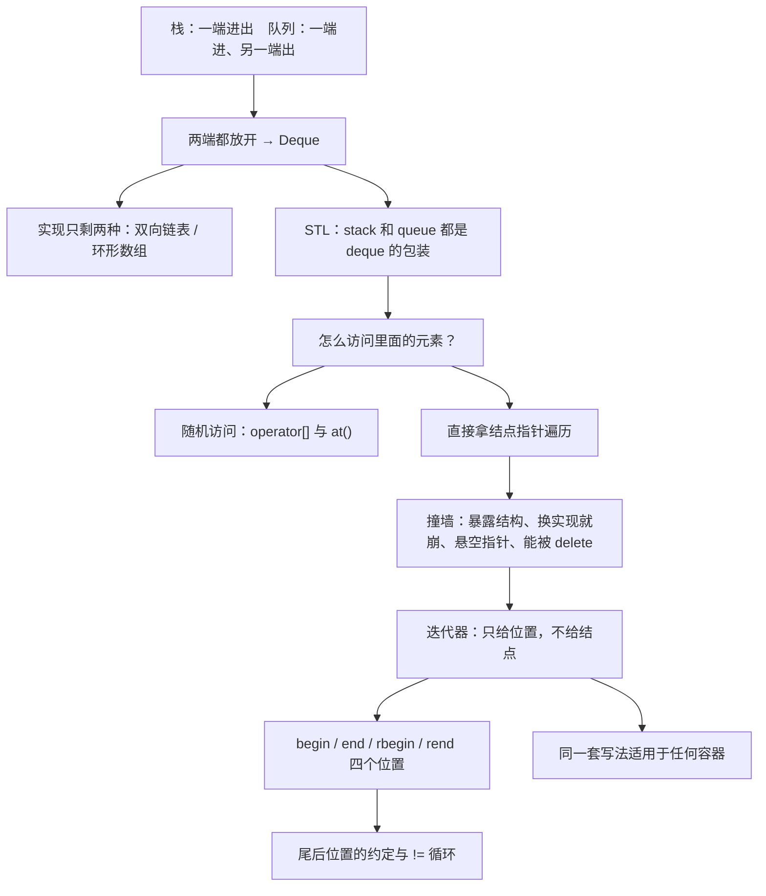

# C5.1 双端队列 Deque

> [!abstract] 这一讲的任务
> 栈只在一端进出，队列一端进、另一端出。这一讲把最后一道限制也拆掉：**两端都能进，两端都能出**。ADT 本身十分钟就能讲完——课件也确实只用了四页。真正占掉全章三分之二篇幅的是另一件事：**怎么让外部代码遍历一个容器，却又不碰到它的内部结构**。答案是**迭代器 Iterator**，一个远远超出这门课范围的设计模式。你之后写的每一段 C++、Python、Java 遍历代码，用的都是它。

> [!info] 怎么读这份讲义
> **全章只用这一个文件**，首次学习按目录顺读，复习时直接看“十二、这一讲的三句话”。
> **第六至第九节是本讲的重心**（暴露内部结构的危险 → 迭代器 → 四个端点位置 → 易错用法），课件用了 20 页讲它，不要因为“这是 STL 用法”就跳过——它同时是本课程唯一系统讲设计模式的地方。
> 正文以课件为骨架；**课件没写、由标准与通行讲法补出的独立小节，标题末尾写“（补充）”**；推测性内容会明说是推测。

> [!info] 标注说明与授课进度
> 标有 **（拓展）** 或 **【拓展】** 的内容，是**课堂上没有讲到、由课件和教材延伸补充**的部分；复习时先掌握未标注的主干，行有余力再看拓展。
> **授课进度**：现有转写稿只到第四节课，内容停在第 3 章栈的“扩容过程”，队列与双端队列都尚未开讲。因此本篇**不逐条标注**“课堂未讲”，请按“整篇尚未授课”理解。拿到对应转写稿后再做合并与标注退役。

> [!info] 课程信息与来源
> **Ya-Hui Jia（贾雅慧）｜SFT SCUT｜jiayahui@scut.edu.cn**。全课程信息见 [[C1.0 课程信息与C++预备]] 与 [[数据结构 MOC]]。
> 课件内容编号为 **3.4**（接在队列的 3.3 之后），本库记为**第 5 章**，与 MOC 章节编号一致。
> **本章课件没有作业页**——前四章每章末尾都有 Homework，这一章没有。不能据此断定不布置作业，以群通知为准。



## 目录与课件对应

| 阅读入口 | 课件页码 | 内容 |
| --- | --- | --- |
| [[#零、开场：撤销、重做，还有浏览器的两个箭头]]、[[#一、把两端都放开]] | 3–4 | Deque ADT、六个操作、四个错误 |
| [[#二、它能拿来干什么]] | 5 | 当栈也当队列、迷宫求解 |
| [[#三、实现：为什么只剩两个选择]] | 6 | 双向链表与环形数组 |
| [[#四、STL 的 deque]] | 7–9 | 容器地位、接口、示例逐行核对 |
| [[#五、访问元素：下标与 at]] | 10–11 | `operator[]` vs `at()`、越界的两种下场 |
| [[#六、为什么不能把结点直接交出去]] | 12–15 | Project 1 的遍历写法、四条罪状、悬空指针、`delete head()` |
| [[#七、迭代器：只交出位置，不交出结点]] | 16–23 | 设计模式、档案助理类比、三个运算符、逐帧演示 |
| [[#八、四个端点位置]] | 24–27 | begin/end/rbegin/rend、空容器、比较运算符 |
| [[#九、易错用法与完整示例]] | 28–30 | 为什么用 `!=`、不能写 `*end()`、完整程序核对 |
| [[#十、为什么要迭代器]] | 31–32 | 四条理由、现代写法（补充） |
| [[#十一、课件勘误与阅读边界]]、[[#十二、这一讲的三句话]] | 全章 + 33 | 校正口径、参考文献、复习 |

---

## 零、开场：撤销、重做，还有浏览器的两个箭头

你在写文档，按了十次 Ctrl+Z。这十步撤销记录用栈存——[[C3.1 栈 Stack]] 已经讲过了。

但真实的编辑器还有第二个约束：**撤销记录不能无限增长**。假设上限是 100 步，你做到第 101 步时，要丢掉哪一条？

> [!question] 停一下，先自己想想
> 新记录从栈顶进。要丢的是**最老的那一条**，它在栈底。用栈能拿到栈底吗？

不能。栈的接口只给你栈顶。想丢最老的，你得把 99 条全弹出来、丢掉最后一条、再压回去——$\Theta(n)$，而且代码丑得不能看。

你需要的是一个**两头都能动**的容器：新记录从一端进，旧记录从另一端丢。同一个容器，**一端当栈用，另一端当垃圾口**。

再看一个更熟的：浏览器的后退和前进。后退按钮是一个栈，前进按钮是另一个栈；而历史记录本身有长度上限，超了要从最老的一端扔。**又是两端都要动。**

你刚才描述的这个东西，就是双端队列。

## 一、把两端都放开

### 1.1 Deque ADT（p.3）

> [!important] 双端队列 Deque 的定义
> 抽象双端队列（Deque ADT）是一种强调特定操作的抽象数据结构：
> - 使用**明确的线性次序**；
> - 插入和删除**逐个进行**；
> - **允许在双端队列的前端和后端都进行插入**。
>
> 名字读作 “deck”，来自 **d**ouble-**e**nded **que**ue。

![[C5-双端队列-四个操作.png]]

课件第 3 页的图把四个动作画在了两端：左端可以 Push 也可以 Pop，右端同样。**对称**是这个 ADT 的全部内容。

### 1.2 六个操作（p.4）

课件给出的命名：

| | 前端 front | 后端 back |
| --- | --- | --- |
| 读 | `front` | `back` |
| 插入 | `push_front` | `push_back` |
| 删除 | `pop_front` | `pop_back` |

这套命名在 STL 里原样使用。注意课件第 8 页的一句话：**“The signatures use stack terminology”**——用的是 `push/pop` 这套栈的词汇，而不是 `enqueue/dequeue`。

### 1.3 “四个错误”（p.4）

课件原文：“There are four errors associated with this abstract data type”，随后只写了一行：

> 对空的 deque 调用 **access（读）或 pop** 是未定义操作。

> [!important] 这里的“四个”指的是四种调用，不是四条独立的规则
> 读有两个（`front`、`back`），弹出有两个（`pop_front`、`pop_back`），**2 × 2 = 4**——这一行确实覆盖了四个错误。
> 对照着看就更清楚：**队列**那一章（[[C4.1 队列 Queue]]，课件 p.6）说的是“**两个**异常”，对应 `front` 和 `pop` 这两个操作；**栈**同理。三章用的是同一套数法。

> [!warning] 但**上溢 Overflow** 确实没有出现在这一页（易错点）
> 上一章的队列专门有一页讲“数组满了的几个选项”，这一章一句没提。原因是这一章的重心整个转向了 STL：STL 的 `deque` 是**动态增长**的，不存在固定容量的上溢问题。
> 如果考的是**自己实现一个定长环形 deque**（比如 LeetCode 641），**满的判断仍然要自己写**——别被这一页的“只有四个错误”误导。

### 1.4 三种 ADT 的统一视角（补充）

到这里，第 3–5 章的三个 ADT 可以放在一张表里看。它们**存的东西完全一样**（一个线性序列），区别只在**开放哪几个端点**：

| ADT | 前端插入 | 前端删除 | 后端插入 | 后端删除 | 出的次序 |
| --- | --- | --- | --- | --- | --- |
| 栈 Stack | — | — | ✓ | ✓ | LIFO |
| 队列 Queue | — | ✓ | ✓ | — | FIFO |
| **双端队列 Deque** | ✓ | ✓ | ✓ | ✓ | 由调用方决定 |

> [!question] 课堂追问
> 既然 deque 什么都能做，为什么不干脆只教 deque，把栈和队列都扔掉？

因为**限制本身是有价值的**。这正好回到 [[C1.2 抽象数据类型与容器操作]] 那条主线：

1. **限制换来性能**：只需要一端，实现可以更简单更快（栈的数组实现连 `ifront` 都不用存）。
2. **限制换来正确性**：把容器声明成 `stack`，编译器就替你保证没人会从底部偷偷取元素。**类型就是文档，也是护栏。**
3. **限制换来可读性**：别人读到 `std::stack`，立刻知道这里是 LIFO 语义，不用去翻你怎么用它。

用 deque 当栈**能跑**，但把意图丢掉了。**ADT 的意义从来不是“能做什么”，而是“承诺不做什么”。**

## 二、它能拿来干什么

### 2.1 一个顶两个（p.5）

课件第 5 页第一条：**作为通用工具很有用——它可以当队列用，也可以当栈用。**

- 只用 `push_back` + `pop_front` → 队列；
- 只用 `push_back` + `pop_back` → 栈。

这也解释了第四节要讲的那件事：**STL 的 `stack` 和 `queue` 默认就是拿 `deque` 包出来的**。

### 2.2 迷宫求解（p.5）

课件第 5 页第二条，写得很压缩：

> 考虑解一个迷宫：在**前端**添加或删除已构造的路径；
> 一旦找到解，**从后端迭代**得到这条解。

展开成课堂上会讲的那一段：

走迷宫是**深度优先 + 回溯**。手里维护一条“当前路径”：

1. 每往前走一格，`push_front` 把这一格记上；
2. 走进死胡同，`pop_front` 把这一格撤掉，退回去换个方向——**这两步合起来，前端就是一个栈**；
3. 走到出口时，容器里从前端到后端依次是“出口 … 起点”，是**倒着的**；
4. 所以课件说**从后端迭代**——`back` 一侧是起点，从那里读出来正好是“起点 → 出口”的正序路径。

> [!important] 为什么这里非 deque 不可
> 搜索阶段只需要栈，输出阶段只需要**从另一端按顺序读**。
> 用 `std::stack` 做不到第 4 步——它根本不让你遍历（见 [[C3.1 栈 Stack]] 第八节）。你得把整个栈倒进另一个容器再反转。
> **一个容器同时满足“搜索时当栈用”和“输出时顺序读”，这就是 deque 的典型用法。**

### 2.3 单调双端队列：滑动窗口最大值（补充）

> [!note] 本章课件没有作业页，但这道题几乎必考（拓展）
> **问题**：给一个数组和窗口宽度 $k$，每次窗口右移一格，输出窗口内的最大值。
> 朴素做法：每个窗口扫一遍，$O(nk)$。
>
> **用 deque 做到 $O(n)$**：队列里存**下标**，并维持一个不变量——**对应的值从前到后严格递减**。
> - 新元素进来前，把队尾所有**比它小**的下标 `pop_back` 掉（它们永远不可能再当最大值了——有一个更大的、更新的元素在它们右边）；
> - 然后 `push_back` 新下标；
> - 如果队首下标已经滑出窗口，`pop_front`；
> - **队首下标对应的值就是当前窗口最大值**。
>
> 每个下标最多入队一次、出队一次，总代价 $O(n)$。
>
> 这个结构叫**单调队列 Monotonic Deque**。它**必须两端都能删**：队尾删是为了维护单调性，队首删是为了踢掉过期元素——**换成栈或队列都做不了**。
> 这是 deque 除了“当栈当队列”之外，真正不可替代的用法。（LeetCode 239 是原题。）

## 三、实现：为什么只剩两个选择

课件第 6 页只有一句话：

> 实现方式是明确的：**我们必须使用双向链表或者环形数组。**

> [!question] 停一下，先自己想想
> 为什么是“必须”？前几章用得好好的**单链表**，为什么这里连提都不提？

因为 deque 要求 `pop_back` 是 $\Theta(1)$。单链表即使维护了 `tail`，删尾也必须先找到**倒数第二个**结点，而单向指针走不回去，只能从头扫——$\Theta(n)$。[[C4.1 队列 Queue]] 第四节已经撞过这堵墙：队列只删前端，所以单链表够用；**deque 两端都要删，单链表当场出局。**

于是只剩两条路：

| 实现 | 为什么行 | 代价 |
| --- | --- | --- |
| **双向链表 Double_list** | 每个结点有 `prev` 和 `next`，两端都能 $\Theta(1)$ 插删（见 [[C2.6 双向链表与循环链表]]） | 每个元素多两个指针，存储密度约 1/5；**不支持随机访问** |
| **环形数组 Circular array** | 两端下标各自取模推进，两端都能 $\Theta(1)$（见 [[C4.1 队列 Queue]] 第六节） | 容量有限，扩容是 $\Theta(n)$；**但支持 $\Theta(1)$ 随机访问** |

> [!important] 这张表解释了第五节的一个关键事实
> `std::deque` 提供 `operator[]` 和 `at()`——**随机访问**。而双向链表做不到随机访问。
> 所以 **STL 的 `deque` 不可能是用双向链表实现的**，它走的是数组那条路（准确说是分段数组，见 4.4）。
> 课件第 6 页说“两者皆可”，讲的是 **ADT 层面**；第 10 页起讲的 `std::deque` 已经是**具体实现**了，两者别混。

## 四、STL 的 deque

### 4.1 它在 STL 里的地位（p.7）

> C++ 标准模板库（STL）提供了 `deque` 数据结构的一个实现。
> **STL 的 `stack` 和 `queue` 都是围绕这个结构的包装（wrappers）。**
> 实现方式**没有被规定**，但标准给出了任何实现都必须满足的**约束条件**。

> [!important] “不规定实现，只规定约束”是标准库的核心哲学
> C++ 标准不会说“deque 必须用分段数组”。它说的是：`push_front`、`push_back`、`pop_front`、`pop_back` 必须是**常数时间**；`operator[]` 必须是**常数时间**；在两端插入**不会使指向已有元素的引用失效**。
> 只要能同时满足这几条，编译器厂商怎么实现都行。
> 这正是 [[C1.2 抽象数据类型与容器操作]] 里 ADT 思想的工业级版本：**契约写在接口上，实现是自由的。**
> 第 7 页那张缩略图画的就是某种分段结构，但在转出的 PDF 里**太小、无法辨认细节**，下面 4.4 用一张自绘图说明通行实现。

### 4.2 接口（p.8）

```cpp
deque<T>
```

签名沿用栈的词汇：

```cpp
T &front();
void push_front(T const &);
void pop_front();
T &back();
void push_back(T const &);
void pop_back();
```

> [!warning] 注意 `front()` 和 `back()` 返回的是**引用 `T &`**，不是值
> 这意味着 `ideque.front() = 99;` 是**合法的**，会直接改掉容器里的元素。
> 这一点和课件前几章自定义的 `Type front() const`（返回副本）**不一样**。返回引用省掉了一次拷贝，但也把修改权交了出去。第 22 页 `*itr = 11` 能改值，同样是因为解引用返回的是引用。

### 4.3 课件示例逐行核对（p.9）

```cpp
#include <iostream>
#include <deque>
using namespace std;

int main() {
    deque<int> ideque;

    ideque.push_front( 5 );
    ideque.push_back( 4 );
    ideque.push_front( 3 );
    ideque.push_back( 6 );          // 3 5 4 6

    cout << "Is the deque empty?  " << ideque.empty() << endl;
    cout << "Size of deque:  " << ideque.size() << endl;
    for ( int i = 0; i < 4; ++i ) {
        cout << "Back of the deque:  " << ideque.back() << endl;
        ideque.pop_back();
    }
    cout << "Is the deque empty?  " << ideque.empty() << endl;

    return 0;
}
```

先把容器建起来的过程走一遍（**这是最容易算错的地方**）：

| 语句 | 前端 → 后端 |
| --- | --- |
| `push_front(5)` | `5` |
| `push_back(4)` | `5 4` |
| `push_front(3)` | `3 5 4` |
| `push_back(6)` | `3 5 4 6` |

与课件注释的 `// 3 5 4 6` 一致。再逐行对输出：

| 输出行 | 值 | 说明 |
| --- | --- | --- |
| `Is the deque empty?` | `0` | 非空；`bool` 以 `0/1` 打印 |
| `Size of deque:` | `4` | |
| `Back of the deque:` | `6` → `4` → `5` → `3` | 从后端连弹四次 |
| `Is the deque empty?` | `1` | 已空 |

**已独立复算，与课件输出完全一致。**

> [!note] 顺带一个 C++ 细节（补充）
> `empty()` 返回 `bool`，`cout` 默认把它打成 `0/1`。想打成 `false/true` 要加 `cout << boolalpha;`。
> 另外 `empty()` 判空比 `size() == 0` 更值得养成习惯：对某些容器（如 `std::list`）`size()` 可能是 $\Theta(n)$，而 `empty()` 永远是 $\Theta(1)$。

### 4.4 deque 内部到底长什么样（补充）

> [!question] 停一下，先自己想想
> `deque` 既能 $\Theta(1)$ 随机访问（像数组），又能 $\Theta(1)$ 在**前端**插入（数组做不到，头插要整体后移）。两件事怎么可能同时成立？

答案是：**它不是一整块连续内存**。

![[C5-STL-deque-内部结构.png]]

通行实现把元素切成若干**固定大小的块 buffer**，再用一个**中控数组 map**（一组指向各块的指针）把它们串起来：

- **`push_front`**：如果当前首块前面还有空位就直接写；没有就新开一块，把指针挂到 map 的前一个槽。**已有元素一个都不搬。**
- **`push_back`**：对称。
- **`ideque[k]`**：先算出 $k$ 落在第几块、块内第几格（两次除法/取模），再两次跳转取到。**块大小是常数，所以是 $\Theta(1)$。**

> [!important] 这给了两条能直接用来判断题的结论
> 1. **deque 的元素在内存里不连续**。所以 `&ideque[0] + k` **不等于** `&ideque[k]`——`vector` 可以这么干，`deque` 不行。需要传给 C 接口的连续缓冲区时，只能用 `vector`。
> 2. **在两端插入不会让指向已有元素的引用或指针失效**（因为没有搬家），**但会让迭代器失效**。`vector` 则是两者一起失效（扩容会整体搬）。这条差异在标准里是明文规定的，也是 9.4 的伏笔。
>
> **这一小节是补充内容，课件没有展开；但它是“为什么 deque 能两头都快”的唯一解释，不知道这个，第五节的随机访问就会显得像变魔术。**

## 五、访问元素：下标与 at

### 5.1 三种访问方式（p.10）

课件列出三种：

- **两个随机访问成员函数**
  - 重载的下标运算符：`ideque[10]`
  - `at()` 成员函数：`ideque.at( 10 );`
- **迭代器设计模式**（第七节起）

> **`operator[]` 和 `at(int)` 的区别在于：后者在访问超出 deque 范围的位置时会抛出 `out_of_range` 异常。**

> [!important] 一句话记住
> **`at()` 检查越界，`operator[]` 不检查。**
> 不检查不是偷懒，是**为速度**：`operator[]` 在热循环里不该为每次访问多付一次比较。C++ 的一贯立场是“不为你没用到的东西付费”——要安全就显式要 `at()`。
> 代价是：`operator[]` 越界属于**未定义行为 undefined behaviour**，可能读到垃圾、可能崩、也可能什么都不发生——**最危险的正是“什么都不发生”**，因为 bug 会潜伏到很久以后。

### 5.2 课件示例：那个 0 和那个异常（p.11）

这一页是全章信息密度最高的一页，逐段拆开看：

```cpp
#include <iostream>
#include <deque>
using namespace std;

int main() {
    deque<int> ideque;
    ideque.push_front( 3 );   ideque.push_back( 4 );
    ideque.push_front( 5 );   ideque.push_back( 6 );  //  5 3 4 6

    for ( int i = 0; i <= ideque.size(); ++i ) {
        cout << ideque[i] << " " << ideque.at( i ) << "  ";
    }

    cout << endl;
    return 0;
}
```

先建容器：`push_front(3)` → `3`；`push_back(4)` → `3 4`；`push_front(5)` → `5 3 4`；`push_back(6)` → **`5 3 4 6`**。与注释一致。

课件给出的实际运行结果：

```
5 5  3 3  4 4  6 6  0
terminate called after throwing an instance of 'std::out_of_range'
  what():  deque::_M_range_check
Abort
```

> [!question] 停一下，先自己想想
> 容器只有 4 个元素，为什么输出里会多出一个 `0`？这个 `0` 是从哪来的？

逐次迭代：

| `i` | `ideque[i]` | `ideque.at(i)` | 结果 |
| --- | --- | --- | --- |
| 0 | `5` | `5` | 打印 `5 5` |
| 1 | `3` | `3` | 打印 `3 3` |
| 2 | `4` | `4` | 打印 `4 4` |
| 3 | `6` | `6` | 打印 `6 6` |
| **4** | **越界，未定义行为** | **抛 `out_of_range`** | 先打印出 `0`，随后程序终止 |

关键在最后一行：`cout << ideque[i] << ...` 是**从左往右**求值的（这个例子里两个调用被 `<<` 隔开，`operator[]` 先被打印出来）。所以：

1. `ideque[4]` 越界，**没有任何检查**，读到了相邻内存里的值——这次恰好是 `0`；
2. 然后 `ideque.at(4)` 做了范围检查，抛出 `std::out_of_range`；
3. 没有人 `catch`，`terminate` 被调用，程序 `Abort`。

`deque::_M_range_check` 是 libstdc++ 里那个检查函数的内部名字，**它出现在报错里就说明是 `at()` 抛的**。

> [!warning] 这一页要带走三件事
> 1. **那个 `0` 不是“正确答案”，是垃圾值。** 换台机器、换个编译选项，它可能是别的数，也可能直接段错误。**未定义行为最坏的表现就是看起来正常。**
> 2. **`at()` 救了这个程序。** 如果整段只用 `operator[]`，程序会安静地打印一个错误的数然后正常退出——你根本不会发现有 bug。
> 3. **循环条件本身就是 bug**：`i <= size()` 应该是 `i < size()`。差一错误 off-by-one，见 [[C2.4 顺序表实现]] 里关于下标从 0 起的讨论。

> [!note] 还有一个编译器会警告的问题（补充）
> `int i` 和 `ideque.size()`（返回**无符号**的 `size_type`）比较，属于**有符号与无符号比较**，`-Wsign-compare` 会报警。
> 后果不只是警告：比较时 `int` 会被转成无符号数。如果哪天循环里写出 `i >= 0` 之类的条件，无符号数**永远 ≥ 0**，直接死循环。
> 稳妥写法：`for (size_t i = 0; i < ideque.size(); ++i)`，或者干脆用第十节的范围 for。

## 六、为什么不能把结点直接交出去

接下来五页（p.12–15）是一段完整的“**撞墙**”演示。课件先给出一个看起来没问题的写法，再连着三页把它砸烂。

### 6.1 Project 1 里的遍历写法（p.12）

> 在 Project 1 中，你应该对这种遍历 `Single_list` 的技术很熟悉：

```cpp
Single_list<int> list;

for ( int i = 0; i < 10; ++i ) { list.push_front( i ); }

for ( Single_node<int> *ptr = list.head(); ptr != 0; ptr = ptr->next() ) {
    cout << ptr->value();
}
```

这段代码能跑，逻辑也对：从头结点开始，一路顺着 `next()` 走到空指针为止。（`ptr != 0` 是老式写法，现代 C++ 写 `ptr != nullptr`。）

### 6.2 四条罪状（p.13）

> 这种做法有严重的问题：
> - **它暴露了底层结构**；
> - 一旦用户能访问到这个结构，**实现就再也改不动了**；
> - **实现会随类的不同而不同**：
>   - `Single_list` 要用 `Single_node`；
>   - `Double_list` 要用 `Double_node`；
> - **基于数组的数据结构根本没有 `head()` 或 `next()` 的对应物。**

逐条翻译成人话：

1. **暴露结构**：使用者现在知道你内部是链表了。他们会开始依赖这件事。
2. **改不动**：哪天你想把 `Single_list` 换成更快的实现，全公司调用你这个类的代码**全部编译不过**。接口一旦泄露，就变成了永久承诺。
3. **不通用**：遍历链表和遍历双链表要写两套循环；再加一个容器就再写一套。
4. **数组没有对应概念**：数组遍历是 `for (int i = 0; i < n; ++i)`，压根没有“结点”也没有 `next()`。**你写不出一段同时适用于链表和数组的遍历代码。**

第 4 条最致命：它意味着**遍历这件事没有统一写法**。这就是迭代器要解决的问题。

### 6.3 更要命的：悬空指针（p.14）

> 更关键的是，下面这段代码会发生什么？

```cpp
Single_list<int> list;
for ( int i = 0; i < 10; ++i ) { list.push_front( i ); }

Single_node<int> *ptr = list.head();
list.pop_front();
cout << ptr->value() << endl;                 // ??
```

> [!question] 课堂追问
> `ptr` 指向的结点已经被 `pop_front()` 删掉了。这一行会打印什么？会崩溃吗？

**不一定崩溃，这才是可怕的地方。**

`pop_front()` 内部 `delete` 了那个结点，那块内存被还给堆管理器。但 `ptr` 里的地址值**一个比特都没变**——它成了**悬空指针 dangling pointer**。此后：

- 那块内存还没被别人拿走 → 读到的可能还是旧值 `9`，**程序看起来完全正常**；
- 那块内存已被重新分配 → 读到的是别人的数据，**污染了另一个对象**；
- 堆管理器把它还给了操作系统 → **段错误**。

三种结果都可能，取决于运行时机。**这类 bug 在开发机上跑一百遍都不出问题，一上线就炸。**

问题的根源不在使用者粗心，而在**接口允许他们拿到结点指针**。`list` 完全不知道外面还有个 `ptr` 指着它刚删掉的东西。

### 6.4 还能更糟（p.15）

```cpp
Single_list<int> list;
for ( int i = 0; i < 10; ++i ) { list.push_front( i ); }

delete list.head();              // ?!
```

使用者**直接把容器的内部结点 `delete` 了**。

`list` 对此毫不知情：它的 `head` 指针还指着那块已经释放的内存，`size` 还是 10。接下来任何一次操作都在未定义行为上跳舞；等 `list` 析构时还会**再 delete 一次**同一块内存——**双重释放 double free**，这是最经典的堆破坏漏洞之一。

> [!important] 停一下，我们刚才干了什么
> 课件用四页演示了同一件事：**把内部结构的指针交给外界，就等于把对象的生命周期管理权也一起交出去了**，而外界既没有义务也没有能力管好它。
> 解决方向因此很清楚：**要能遍历，但不能交出结点。** 要交出去的应该是一个“**位置**”——一个只能读值、只能往前挪一格的受限凭证。

## 七、迭代器：只交出位置，不交出结点

### 7.1 这是一个设计模式（p.16）

> Project 1 为了**便于评分**才暴露底层数据结构——**但这不是好的编程实践。**
> C++ STL 用**迭代器 iterator** 的概念来解决这个问题：
> - 迭代器**并非 C++ 独有**；
> - 它是业界公认的、针对某一类特定问题的解决方案；
> - 这样的解决方案称为**设计模式 design pattern**。

> [!note] 关于设计模式（补充）
> 设计模式是对**反复出现的设计问题**的成熟解法的命名与总结，出自 1994 年 GoF 的《设计模式》一书，迭代器是其中之一。
> 它不是语法，是**约定**：任何语言、任何容器，只要提供“取起点、读当前、往前挪、判断是否到头”这四件事，就算实现了迭代器模式。
> Python 的 `for x in lst` 背后是 `__iter__` / `__next__`，Java 是 `Iterator` 接口，Rust 是 `Iterator` trait——**全是同一个模式**。这门课里能学到的通用性最强的一个知识点，就在这一页。

### 7.2 档案助理（p.18–19）

课件用了一个类比：

> 设想一套有行政助理管理的档案系统。
> 你关心的**不是报告是怎么归档的**（只要够快就行），你只需要能**给助理下指令**。
> 当然，**如果你的助理病了，愿上帝保佑你……**

你可以要求助理：

> - 从**第一份**或**最后一份**文件开始；
> - 请求**看一眼**他当前拿着的文件；
> - **修改**他当前拿着的文件；
> - 请求他**移到下一份**，或者**移到上一份**。

这个类比的对应关系很干净：

| 类比里的动作 | 迭代器 | 对应代码 |
| --- | --- | --- |
| 从第一份 / 最后一份开始 | 取得迭代器 | `begin()` / `rbegin()` |
| 看一眼当前文件 | 解引用读 | `*itr` |
| 修改当前文件 | 解引用写 | `*itr = 11` |
| 移到下一份 / 上一份 | 移动 | `++itr` / `--itr` |

**关键是：你从头到尾没有碰过档案柜。** 你不知道文件是按字母排的、按日期排的，还是分散在三个房间里——**换一套归档方式，你的指令一个字都不用改**。这正是 6.2 第 2、3、4 条罪状的解法。

> [!note] “助理病了”那句玩笑其实有技术含义（补充）
> 它对应的就是 6.3 的**迭代器失效**：一旦容器被改动，手里的迭代器可能就不再有效了。谁来保证有效，是 9.4 的内容。

### 7.3 三个被重载的运算符（p.20）

> 在 C++ 中，迭代器**重载**了若干运算符：
> - 一元 **`*`** 返回迭代器所指位置上存储的值的**引用**；
> - **`operator ++`** 把迭代器更新到**下一个**位置；
> - **`operator --`** 把迭代器更新到**上一个**位置。
>
> 注意：**它们看起来像指针，但并不是指针。**

> [!important] “像指针但不是指针”这句话的分量
> 迭代器是一个**类对象**，内部可能存着指针，也可能存着“第几块 + 块内第几格”这样一对下标（想想 4.4 的分段结构）。
> 它**只把指针的语法借了过来**（`*`、`++`、`--`、`==`、`!=`），却**不提供指针的危险能力**：你不能 `delete` 一个迭代器，不能拿它去做任意地址算术，也拿不到底层结点。
> 这就是 6.3、6.4 两个灾难的根治办法：**语法一样方便，权限却被收窄了。**
> 顺带：`operator --` 的存在要求容器能往回走。单向链表的迭代器就**只有 `++` 没有 `--`**——C++ 把这称为迭代器的**类别 category**（前向、双向、随机访问）。`deque` 的迭代器是**随机访问迭代器**，所以还支持 `itr + 5`、`itr2 - itr1` 这类操作。

### 7.4 三步走（p.21–23）

课件用三页做了一次逐帧演示，容器是 `3 5 4 6`：

**第一步（p.21）：取得迭代器**

```cpp
deque<int> ideque;
ideque.push_front( 5 ); ideque.push_back( 4 );
ideque.push_front( 3 ); ideque.push_back( 6 );
// the deque is now 3 5 4 6

deque<int>::iterator itr = ideque.begin();
```

此时 `itr` 指向首元素 `3`，也就是 `front()` 所在的位置。

**第二步（p.22）：读和写**

```cpp
cout << *itr << endl;            // prints 3

*itr = 11;
cout << *itr << " == " << ideque.front() << endl;
// prints 11 == 11
```

容器变成 `11 5 4 6`。**注意第二行证明的是：`*itr` 写进去的就是容器本体**——不是副本。这正是 7.3 里“返回引用”的直接后果。

**第三步（p.23）：前进**

```cpp
++itr;
cout << *itr << endl;            // prints 5
```

`itr` 移到第二个元素，打印 `5`。

> [!question] 停一下，先自己想想
> 为什么课件写 `++itr` 而不是 `itr++`？两者对结果有区别吗？

对这段代码的**结果**没区别，但对**效率**有。`itr++` 必须先**复制**一份旧迭代器、再自增、最后返回那份旧副本；`++itr` 直接自增并返回自身引用。对 `int` 而言编译器会优化掉，但**迭代器是类对象，那份副本可能真的要构造**。
所以 C++ 的习惯是：**不需要旧值时，一律写前置 `++`。** 这个习惯从这里开始养成，后面写算法时会跟你一辈子。

## 八、四个端点位置

### 8.1 begin / end / rbegin / rend（p.24–25）

> `begin()` 和 `end()` 返回的迭代器分别指向：
> - deque 中的**第一个位置（head）**，以及
> - **最后一个值之后**的那个位置。
>
> `rbegin()` 和 `rend()` 返回的**反向迭代器**分别指向：
> - deque 中的**最后一个位置（tail）**，以及
> - **第一个位置之前**的那个位置。

![[C5-迭代器-四个位置.png]]

> [!important] 一张表记住四个位置与两个访问函数的关系
> | | 指向 | 能否解引用 | 对应元素 |
> | --- | --- | --- | --- |
> | `begin()` | 第一个元素 | ✓ | 与 `front()` 同一个 |
> | `end()` | 最后一个元素**之后** | **✗** | 无 |
> | `rbegin()` | 最后一个元素 | ✓ | 与 `back()` 同一个 |
> | `rend()` | 第一个元素**之前** | **✗** | 无 |
>
> `end()` 和 `rend()` 指的是**位置**，不是值。**对它们解引用是未定义行为。**

> [!question] 课堂追问
> 为什么要设计一个“最后一个之后”的虚位置？直接让 `end()` 指向最后一个元素，循环写 `itr <= end()` 不是更自然吗？

三个理由，每一个都足够：

1. **空容器怎么办？** 若 `end()` 指向最后一个元素，空容器就没有“最后一个元素”可指，这个函数无法定义。而尾后位置永远存在——见 8.2。
2. **循环条件统一。** 用尾后位置，循环写成 `itr != end()`，**在空容器上自然地一次都不执行**。换成 `<=` 就得对空容器另写一个分支。
3. **左闭右开区间。** `[begin, end)` 的元素个数恰好是 `end - begin`，两个区间首尾相接不重不漏。这和数组下标从 0 开始是同一套设计哲学：**半开区间让算术变干净。** 对照 [[C1.4 物理结构与存储分配]] 里 $Loc(i)=L_0+i\times u$ 从 0 起算的好处。

### 8.2 空容器时两端重合（p.26）

```cpp
#include <iostream>
#include <deque>
using namespace std;

int main() {
    deque<int> ideque;

    cout << (  ideque.begin() == ideque.end()  ) << " "
         << ( ideque.rbegin() == ideque.rend() ) << endl;

    return 0;
}
```

输出：

```
1 1
```

空容器里，“第一个位置”和“最后一个之后”是**同一个位置**，正向反向都一样。

> [!important] 这就是标准的判空写法
> `begin() == end()` 与 `empty()` 等价。**所有基于迭代器的算法都靠这条来处理空输入**——它们不需要知道 `size()`，甚至不需要容器本身，只要一对迭代器。
> 这解释了为什么 `std::sort(v.begin(), v.end())` 这样的算法**完全不接触容器类型**：它只认迭代器。**容器和算法被彻底解耦了**，这是 STL 设计上最漂亮的一点。

### 8.3 比较运算符（p.27）

> 因为我们可以有**多个迭代器**指向同一个 deque 里的值，所以自然可以使用比较运算符 `==` 和 `!=`。

两个迭代器相等，意思是**它们指向同一个位置**（不是“所指的值相等”）。这一点常被搞混：

```cpp
deque<int> d;
d.push_back(7); d.push_back(7);
auto a = d.begin();
auto b = d.begin() + 1;
// *a == *b  为真（值都是 7）
// a == b    为假（位置不同）
```

## 九、易错用法与完整示例

### 9.1 为什么循环条件要用 `!=`（p.28）

> 这段代码多少能说明为什么 `end()` 指的是最后一个位置**之后**：

```cpp
for ( int i = 0; i != ideque.size(); ++i ) {
    cout << ideque[i] << end;
}

for ( deque<int>::iterator itr = ideque.begin(); itr != ideque.end(); ++itr ) {
    cout << *itr << end;
}
```

两个循环形状完全一样：**起点、终点、推进**，只是一个用下标一个用迭代器。课件想让你看到的是这种**对应关系**——`begin()` 对应 `0`，`end()` 对应 `size()`，两者都是“到不了的那一个”。

> [!warning] 用 `!=` 而不是 `<`（易错点）
> 下标可以写 `i < size()`，迭代器却应当写 `itr != end()`。原因是**不是所有迭代器都支持 `<`**：链表的迭代器只能一格一格挪，无法比较先后。写 `!=` 的代码能套用到任何容器上，写 `<` 的不能。
> **这正是迭代器统一接口的价值所在，不要在最后一步把它丢掉。**

> [!warning] 课件这两页把 `endl` 写成了 `end`（勘误）
> p.28 两处 `cout << ... << end;` 应为 `endl`。`end` 在这里是未声明的标识符，**无法编译**。属于打字遗漏，不影响要讲的道理。

### 9.2 不要对 `end()` 解引用（p.29）

> 注意：**修改 deque 最后一个位置之外的东西，会导致未定义行为。**
>
> 不要这样写：
> ```cpp
> deque<int>::iterator itr = ideque.end();
> *itr = 3;                            // wrong
> ```
>
> 你应该使用正确的成员函数：
> ```cpp
> ideque.push_back( 3 );               // right
> ```

这是 8.1 那张表的直接应用：`end()` 是位置不是值，**读它、写它都是未定义行为**。想在末尾放一个新元素，要用 `push_back`——**容器会替你处理分配、更新大小、维护内部结构**，而 `*itr = 3` 三件事一件都没做。

### 9.3 完整示例逐行核对（p.30）

```cpp
#include <iostream>
#include <deque>
using namespace std;

int main() {
    deque<int> ideque;
    ideque.push_front( 5 );  ideque.push_back( 4 );
    ideque.push_front( 3 );  ideque.push_back( 6 );    // 3 5 4 6

    deque<int>::iterator itr = ideque.begin();
    cout << *itr << endl;
    ++itr;
    cout << *itr << endl;

    while ( itr != ideque.end() ) {
        cout << *itr << " ";
        ++itr;
    }

    cout << endl;

    return 0;
}
```

| 步骤 | `itr` 指向 | 输出 |
| --- | --- | --- |
| `begin()` | `3` | |
| `cout << *itr` | `3` | `3`（换行） |
| `++itr` | `5` | |
| `cout << *itr` | `5` | `5`（换行） |
| `while` 第 1 轮 | `5` | `5 ` |
| `while` 第 2 轮 | `4` | `4 ` |
| `while` 第 3 轮 | `6` | `6 ` |
| `while` 第 4 轮 | `end()` | 循环结束 |

课件给出的实际输出：

```
3
5
5 4 6
```

**已独立复算，完全一致。**

> [!question] 停一下，先自己想想
> 为什么 `5` 被打印了**两次**？

因为 `++itr` 之后先单独打印了一次，**而 `while` 循环并没有再往前挪**——它是从当前位置（仍然是 `5`）开始遍历的。这不是 bug，是课件故意安排的，用来说明**迭代器是有状态的**：它记着自己走到哪儿了，不会因为你换了一段代码就重置。

### 9.4 迭代器失效（补充）

> [!warning] 课件没讲，但这是迭代器最常见的实战陷阱（拓展）
> 6.3 的悬空指针问题，迭代器**缓解**了但**没有根除**：容器被修改后，原有的迭代器可能失效，此时用它同样是未定义行为。
>
> ```cpp
> for (auto itr = d.begin(); itr != d.end(); ++itr) {
>     if (*itr < 0) d.erase(itr);      // 危险：erase 之后 itr 失效
> }
> ```
>
> 正确写法是接住 `erase` 的返回值——它返回**指向下一个元素的有效迭代器**：
>
> ```cpp
> for (auto itr = d.begin(); itr != d.end(); ) {
>     if (*itr < 0) itr = d.erase(itr);
>     else          ++itr;
> }
> ```
>
> **`deque` 的失效规则比较特别**（回到 4.4 的分段结构）：
> - 在**两端**插入 → **所有迭代器失效**，但**指向已有元素的引用和指针仍然有效**（元素没被搬动）；
> - 在**中间**插入或删除 → 迭代器、引用、指针**全部失效**；
> - 在**两端**删除 → 只有指向被删元素的那些失效。
>
> 对照 `vector`：扩容会整体搬家，**迭代器和引用一起失效**。
> **“迭代器失效”几乎是每一场 C++ 面试都会问的题，而这门课的课件没讲——这就是它标为拓展但值得优先看的原因。**

## 十、为什么要迭代器

### 10.1 课件给的四条理由（p.31）

> 既然你已经理解了迭代器做什么，我们来看看为什么它是标准的软件工程解法；它们：
> - **不暴露底层结构**；
> - **只需要 $\Theta(1)$ 的额外内存**；
> - **提供统一接口**，无论底层是 vector、deque 还是任何其他数据结构都能用；
> - **即使底层实现改变，接口也不变**。

逐条对回第六节的四条罪状，是严丝合缝的：

| 第六节的问题 | 迭代器的回答 |
| --- | --- |
| 暴露底层结构（p.13 ①） | 只交出位置，拿不到结点 |
| 实现改不动（p.13 ②） | 接口与实现解耦，随便换 |
| 每个类要写一套遍历（p.13 ③） | 统一 `begin/end/*/++` |
| 数组没有 `head()`/`next()`（p.13 ④） | 数组的迭代器就是指针的包装，照样能用 |
| 悬空指针（p.14） | 不给结点，也就无从悬空（但仍需注意失效，见 9.4） |
| 能被 `delete`（p.15） | 迭代器不是指针，`delete` 它编译不过 |

“$\Theta(1)$ 额外内存”这条也值得一提：迭代器本身只是几个字节的位置信息，**遍历一个十亿元素的容器也不会多占内存**——对照一下“先把所有元素拷进一个新数组再遍历”的做法就知道这不是废话。

> [!note] 课件此处的 Θ 在转出的 PDF 中显示为异体字形
> 原文是 “Require $\Theta(1)$ additional memory”，按 [[C1.5 算法与渐进分析]] 的口径理解。

### 10.2 小结（p.32）

> 本讲我们介绍了更一般的 deque 抽象数据结构：
> - 允许从**两端**插入和删除；
> - 内部可以用**双向链表**或**两端数组**表示。
>
> **更重要的是，我们考察了 STL 与迭代器这一设计模式。**

课件自己都强调“更重要的是迭代器”——**这一章的考点重心不在 deque 上。**

### 10.3 现代 C++ 的写法（补充）

> [!note] 课件的写法是 C++03 风格，实际写代码请用下面这些（拓展）
> **1. 用 `auto` 省掉冗长的类型名**
> ```cpp
> for (auto itr = d.begin(); itr != d.end(); ++itr) { ... }
> ```
>
> **2. 只读遍历用 `cbegin()/cend()`**，拿到 `const_iterator`，写操作直接编译失败——把“我不改它”这个意图写进类型里。
>
> **3. 不需要迭代器本身时，直接用范围 for（C++11）**
> ```cpp
> for (int x : d)        { cout << x << " "; }   // 只读，拷贝一份
> for (int &x : d)       { x *= 2; }             // 要改
> for (const auto &x : d){ cout << x << " "; }   // 只读且不拷贝（大对象用这个）
> ```
> 范围 for **在编译期就是展开成 `begin()/end()` 循环的**，不是新语法糖那么简单——理解了第七、八节，你就知道它为什么能对任何容器生效。
>
> **4. 反向遍历**：`for (auto itr = d.rbegin(); itr != d.rend(); ++itr)`。注意反向迭代器的 `++` 是**往前端走**——方向已经被封装进去了，不要写成 `--`。

## 十一、课件勘误与阅读边界

| 位置 | 课件写的 | 实际情况 |
| --- | --- | --- |
| p.4 | 「four errors」只跟了一行说明 | **不是遗漏**：`front`/`back`/`pop_front`/`pop_back` 四个操作在空容器上各算一个，2×2=4。但**上溢 Overflow 确实没提**，自己实现定长版本时仍要处理 |
| p.11 | 输出里多出一个 `0` | 这是 `ideque[4]` 越界读到的**垃圾值**，不是正确结果；随后 `at(4)` 抛 `out_of_range` 终止程序 |
| p.11 | `for ( int i = 0; i <= ideque.size(); ++i )` | 两处问题：应为 `<` 而非 `<=`；`int` 与无符号 `size()` 比较会触发 `-Wsign-compare` |
| p.28 | `cout << ideque[i] << end;` 与 `cout << *itr << end;` | `end` 应为 **`endl`**，否则无法编译（两处） |
| p.6 | 「必须使用双向链表或环形数组」 | ADT 层面成立；但 `std::deque` 要提供 $\Theta(1)$ 随机访问，**不可能是双向链表**，它走分段数组路线（见 4.4） |
| p.7 | 内部结构缩略图 | 在转出的 PDF 中**过小无法辨认**，4.4 的说明与自绘图为补充，基于通行实现，非课件原图内容 |
| p.31 | Θ 符号显示为异体字形 | 转换所致，按 Θ 理解 |

**另外要更正一处本库此前的判断**：[[C4.1 队列 Queue]] 原先把队列课件 p.6「两个异常」只列一条判为遗漏，并推测缺的是上溢。对照本章 p.4 的「四个错误」写法后可以确认，**那里的「两个」指的是 `front` 和 `pop` 两个操作**，课件并无遗漏。该处已同步修正。

**阅读边界**：

- 原课件是 `3.04.Deques.pptx`，用 LibreOffice 转为 PDF 后逐页读图整理，**33 页全部读过，未跳页**；转出的 PDF 已保存为 `pdfs/3.04.Deques.pdf`，页码与本篇引用一致。
- **未发现课堂手写批注**。
- 尚无本章转写稿，**课堂是否讲过、讲到哪里无法从课件判断**。
- 本章课件**没有作业页**，第 33 页是参考文献。

### 课件自带参考文献（p.33）

1. Donald E. Knuth, *The Art of Computer Programming, Volume 1: Fundamental Algorithms*, 3rd Ed., Addison Wesley, 1997, §2.2.1, p.238.
2. Weiss, *Data Structures and Algorithm Analysis in C++*, 3rd Ed., Addison Wesley, §3.3.1, p.75.

> [!note] 版本差异
> 课程 MOC 记录的指定教材是 Weiss 的**第 4 版**，而这页引的是**第 3 版**，章节号可能对不上。查书时以书里的目录为准，不要照搬 §3.3.1 这个编号。

## 十二、这一讲的三句话

1. **Deque 把栈和队列的限制全拆了**：两端都能进出，所以能当栈也能当队列；但**限制本身有价值**，选 `stack` 而不是 `deque`，是在用类型表达意图。
2. **本章真正的重点不是 deque，是迭代器**：把结点指针交给外界会导致悬空指针和双重释放，交出一个只能读、只能挪的“位置”才安全——这是一个跨语言的设计模式。
3. **`end()` 是最后一个元素之后的位置，不是元素**：它让空容器有统一写法、让循环条件写成 `!=`、让 `[begin, end)` 的算术保持干净。

### 操作复杂度速查

| 操作 | 双向链表实现 | 环形数组 / 分段数组实现 |
| --- | --- | --- |
| `front` / `back` | $\Theta(1)$ | $\Theta(1)$ |
| `push_front` / `push_back` | $\Theta(1)$ | 摊还 $\Theta(1)$（扩容那次 $\Theta(n)$） |
| `pop_front` / `pop_back` | $\Theta(1)$ | $\Theta(1)$ |
| **随机访问 `[k]`** | **$\Theta(n)$** | **$\Theta(1)$** |
| 中间插入删除 | 已定位后 $\Theta(1)$ | $\Theta(n)$ |
| 存储开销 | 每元素两个指针 | 每块少量元数据 |

### 迭代器速查

| 写法 | 含义 | 注意 |
| --- | --- | --- |
| `d.begin()` | 首元素位置 | 空容器时等于 `end()` |
| `d.end()` | **尾后**位置 | **不可解引用** |
| `d.rbegin()` / `d.rend()` | 末元素 / 首元素之前 | `++` 是往前端走 |
| `*itr` | 读/写当前元素（返回引用） | 越过尾后即 UB |
| `++itr` / `--itr` | 前进 / 后退 | 优先用前置形式 |
| `itr1 != itr2` | 位置是否不同 | 循环条件用 `!=`，不用 `<` |
| `d.at(k)` | 带检查的随机访问 | 越界抛 `out_of_range` |
| `d[k]` | 不检查的随机访问 | 越界是 UB，可能“看起来正常” |

### 关键核对值

| 内容 | 结果 | 出处 |
| --- | --- | --- |
| `push_front(5), push_back(4), push_front(3), push_back(6)` | `3 5 4 6` | p.9 |
| 上式连续 `back()` + `pop_back()` 四次 | `6 4 5 3` | p.9 |
| `push_front(3), push_back(4), push_front(5), push_back(6)` | `5 3 4 6` | p.11 |
| p.11 程序输出 | `5 5  3 3  4 4  6 6  0` 后 `out_of_range` 终止 | p.11 |
| p.26 空容器比较 | `1 1` | p.26 |
| p.30 程序输出 | `3` / `5` / `5 4 6` | p.30 |

**下一讲预告**：到这里，线性结构（表、栈、队列、双端队列）全部讲完——它们的共同点是每个元素**最多只有一个前驱和一个后继**。可现实里的关系往往不是一条线：一个目录有多个子目录，一道菜有多个原料。当“后继”可以有很多个时，线性结构就不够用了——下一章进入**树 Tree**（课件 `tree_part1.pptx`）。[[C1.3 数据元素间的六种关系]] 里那个“层次序”，终于要派上用场了。

---

上一章：[[C4.1 队列 Queue]] ｜ 前置：[[C2.6 双向链表与循环链表]]、[[C3.1 栈 Stack]]、[[C1.2 抽象数据类型与容器操作]] ｜ 返回：[[数据结构 MOC]]
