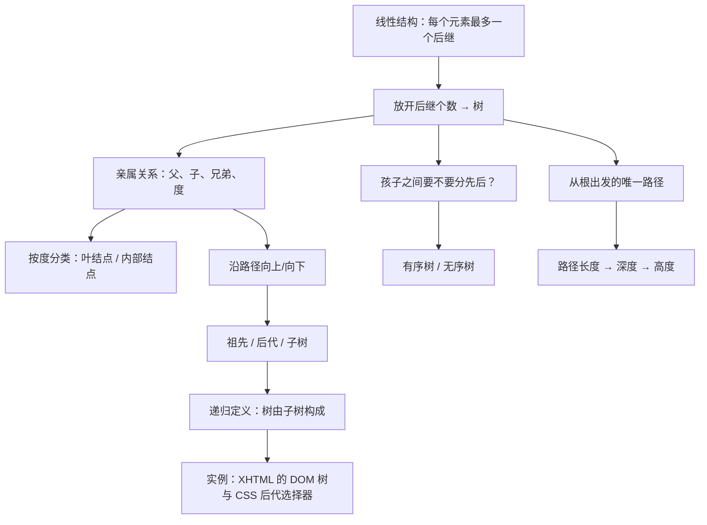
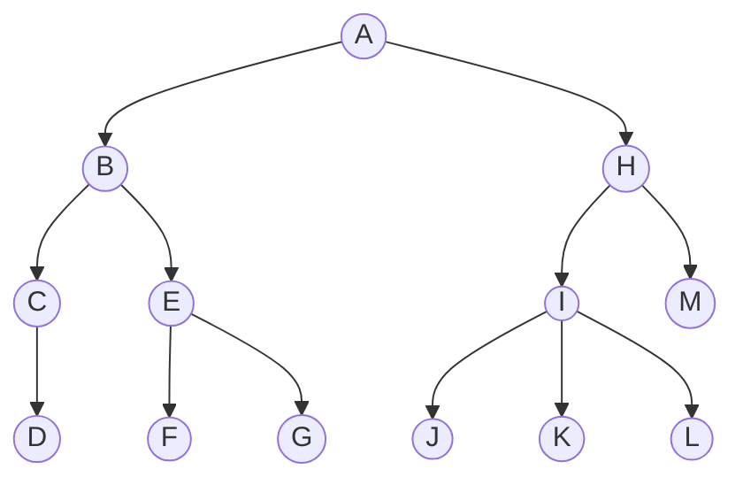
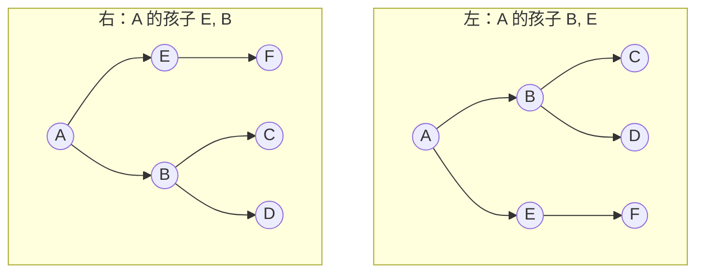
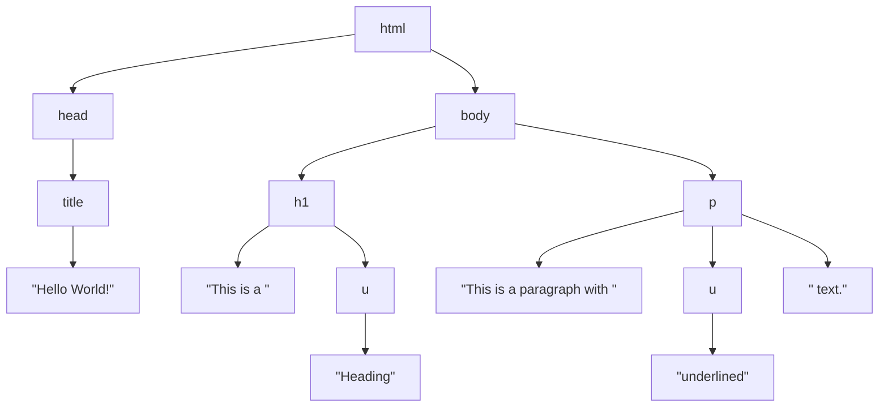

# C6.1 树的概念与术语

> [!abstract] 这一讲的任务
> 前五章的所有结构都是**一条线**：每个元素最多一个前驱、一个后继。这一讲开始，后继可以有很多个。课件第 3 页原话是：**“树是你在大一编程课里没见过的第一种数据结构。”**
> 这一讲不写代码，只干一件事：**把一整套术语弄准**。树这一章后面要讲的所有东西——二叉树、BST、AVL、红黑树、B+ 树——全部建立在“度、深度、高度、祖先、子树”这几个词上。**这几个词有一个记错，后面每一个定理都会算错。**尤其要当心的是：**本课件的高度和深度从 0 开始数，而国内教材从 1 开始数**，第六节专门讲这件事。

> [!info] 怎么读这份讲义
> 第二到第五节是术语的正篇，**每个术语都配了同一棵示例树**，建议对着同一张图把所有词过一遍。
> **第六节是本篇最该反复看的一节**，它处理两套教材口径不一致的问题，是考试最容易翻车的地方。
> 第七节是课件给的 XHTML/CSS 例子，读起来轻松，但它把“祖先/后代”这两个抽象概念落到了你天天见的东西上，值得看完。
> 标题末尾写“（补充）”的小节是课件没有、由通行讲法补出的内容。

> [!info] 标注说明与授课进度
> 标有 **（拓展）** 或 **【拓展】** 的内容，是**课堂上没有讲到、由课件和教材延伸补充**的部分；复习时先掌握未标注的主干。
> **授课进度**：现有转写稿只到第四节课（停在第 3 章栈的扩容），树尚未开讲。本篇**不逐条标注**“课堂未讲”，按整篇尚未授课理解。

> [!info] 课程信息与来源
> **Ya-Hui Jia（贾雅慧）｜SFT SCUT｜jiayahui@scut.edu.cn**。全课程信息见 [[C1.0 课程信息与C++预备]] 与 [[数据结构 MOC]]。
> 树的课件分装在三个 pptx 里（`tree_part1/2/3`），每个里面又打包了好几个各有 Outline 和 Summary 的小节。**课件自己的编号 4.x / 5.x / 6.x 是乱的**（`tree_part2` 里 6.1 排在 4.9 前面），本库统一记为**第 6 章**，按知识依赖顺序编号，对应关系见 [[数据结构 MOC]]。



## 目录与课件对应

| 阅读入口 | 课件页码 | 内容 |
| --- | --- | --- |
| [[#零、开场：你每天都在用树]]、[[#一、从一条线到一棵树]] | 1–4 | 树的定义、与链表的对照 |
| [[#二、一家人：孩子、父亲、兄弟、度]] | 5–10 | children/parent/degree/siblings/leaf/internal |
| [[#三、孩子要不要分先后]] | 11 | 有序树与无序树 |
| [[#四、路径、深度、高度]] | 12–18 | path、length、depth、height、空树高度 |
| [[#五、祖先、后代、子树]] | 19–23 | ancestor/descendant/strict、递归定义、subtree |
| [[#六、两套口径：从 0 数还是从 1 数（补充）]] | — | 与国内教材的差异，**考试重灾区** |
| [[#七、实例：XHTML 的树与 CSS 选择器]] | 24–35 | DOM 树、标签嵌套、后代选择器 |
| [[#八、课件勘误与阅读边界]]、[[#九、这一讲的三句话]] | 全篇 | 校正口径与复习 |

---

## 零、开场：你每天都在用树

打开电脑的文件管理器，看一眼左边那一栏。

`文档` 里面有 `课程`，`课程` 里面有 `数据结构`，`数据结构` 里面有 `课件` 和 `作业`。你能从任何一个文件夹一路点回到硬盘根目录，而且**只有一条路**可以回去。

> [!question] 停一下，先自己想想
> 这个结构能用前五章的任何一种线性结构表示吗？

不能——至少不能直接表示。线性结构的约定是“每个元素最多一个后继”，可 `课程` 文件夹底下同时躺着 `数据结构`、`大学物理`、`离散数学`。**一个前驱，多个后继**，这条线在这里分叉了。

再看几个同样的东西：

- 公司的组织架构：一个 CEO，几个 VP，每个 VP 手下若干总监；
- 家谱；
- 这门课的知识地图本身（[[数据结构 MOC]] 里那张 mermaid 图）；
- 你正在看的这个网页的 HTML 结构（第七节会展开）。

它们共同的形状——**一个起点、可以分叉、任意两点之间只有一条路**——就是树。

> [!note] 课件第 3 页放了一张 xkcd 漫画
> 出处 `http://xkcd.com/71/`，两个人在林子里走散的段子，配文是“Trees are the first data structure different from what you've seen in your first-year programming courses”。**纯装饰，没有知识点**，本篇不复现。

## 一、从一条线到一棵树

### 1.1 定义（p.4）

> [!important] 有根树 Rooted Tree
> **有根树数据结构把信息存放在结点 nodes 中。**
> 与链表类似：
> - 存在一个**第一个结点**，称为**根 root**；
> - 每个结点有**可变数量**的指向后继的引用；
> - **除根之外的每个结点，恰好有一个结点指向它。**

课件配的示例树（后面几乎所有术语都用这棵，**请记住它**）：



> [!important] 这三条就是全部
> 把定义和 [[C2.5 单链表实现]] 逐条对照：
>
> | | 单链表 | 树 |
> | --- | --- | --- |
> | 入口 | `head` 一个 | `root` 一个 |
> | 后继个数 | **恰好 0 或 1 个** | **0 个或多个** |
> | 指向自己的结点 | 0 或 1 个 | 根是 0 个，**其余恰好 1 个** |
>
> **只改了中间那一行**，就从链表变成了树。第三条“恰好一个”排除了两种退化情况：某个结点有两个父亲（那是**图**，不是树），以及出现回路（那也是图）。

> [!note] 从这条定义能直接推出的一条性质（补充）
> **$n$ 个结点的树恰好有 $n-1$ 条边。**
> 证明一行：每条边可以和它下端的那个结点一一对应（每个非根结点恰好被一条边指着），非根结点有 $n-1$ 个，所以边有 $n-1$ 条。
> 这条在图论一章会以“树 = 连通且无环 = 连通且恰好 $n-1$ 条边”的形式重新出现，**是判断题常客**。

## 二、一家人：孩子、父亲、兄弟、度

课件用亲属关系命名，直接抄了过来（p.5–6）：

> - 所有结点都有**零个或多个子结点 child nodes 或 children**：图中 **I 有三个孩子：J、K 和 L**；
> - 除根结点外，所有结点都有**一个父结点 parent node**：**H 是 I 的父亲**；
> - 结点的**度 degree** 定义为它的孩子数：$\deg(I)=3$；
> - **父亲相同的结点互为兄弟 siblings**：**J、K、L 是兄弟**。

> [!warning] 度是“孩子数”，不是“连出去的边数”（易错点）
> 在这门课的定义里 $\deg(I)=3$，**不把指向父亲 H 的那条边算进去**。
> 图论里结点的度通常是“关联的边数”，那样算 I 的度是 4。**两套体系，别串。**看到“度”先确认是树的度还是图的度。
> 另外还有一个词：**树的度 = 所有结点的度的最大值**。课件这一页没提，但后面 N 叉树会用到。

### 2.1 按度分类（p.8）

> **度为零的结点也叫叶结点 leaf nodes。**
> **其余所有结点称为内部结点 internal nodes**，也就是它们位于树的内部。

对着示例树点一遍：

| 类别 | 结点 | 判据 |
| --- | --- | --- |
| **根 root** | A | 没有父亲 |
| **叶结点 leaf** | D、F、G、J、K、L、M | 度为 0 |
| **内部结点 internal** | A、B、C、E、H、I | 度 > 0 |

> [!question] 停一下，先自己想想
> 根结点 A 一定是内部结点吗？

**不一定。** 只有一个结点的树里，那个结点既是根又是叶（度为 0），**它不是内部结点**。“根”和“叶/内部”是两套互不干涉的分类：前者看有没有父亲，后者看有没有孩子。**期末判断题很喜欢考这种边界。**

### 2.2 系统发生树：度只能是 2 或 0（p.7、9、10）

课件用一张**系统发生树 Phylogenetic tree**（食肉目 Carnivoramorpha 的演化关系图，出自 Wesley-Hunt & Flynn 的论文）来举例，并指出：

> **系统发生树的结点，度为 2 或 0。**

p.9 把所有**叶结点**标红，p.10 把所有**内部结点**标蓝，是同一张图的两种高亮。

生物学上这很自然：内部结点代表“某个祖先物种分化成了两支”，所以度为 2；叶结点是现存物种，不再分化。**这类每个内部结点都恰好有两个孩子的树，后面会正式定义为“满二叉树 full binary tree”**（见 C6.4）。

> [!note] 这张图太大太细，本篇不裁切
> p.7/9/10/14/16/18/21/22 用的是同一张系统发生树，只是高亮不同的部分（叶、内部、路径、深度、高度、后代、祖先）。**信息全部在正文里写出来了，图本身是同一张。**

## 三、孩子要不要分先后

课件 p.11：

> 如果**忽略孩子的顺序**，这两棵树是相等的——**无序树 unordered trees**。
> 如果**顺序是相关的**，它们就是不同的——**有序树 ordered trees**。
> - 我们通常考察**有序树（线性序）**；
> - 在**层次序 hierarchical ordering** 中，顺序是不相关的。

课件给的两棵树：左边是 A 的孩子依次为 B、E；右边是 A 的孩子依次为 E、B（B 的孩子仍是 C、D，E 的孩子仍是 F）。



> [!important] 什么时候顺序重要
> - **重要**：二叉树的“左孩子”和“右孩子”不能互换（[[C1.3 数据元素间的六种关系]] 里的线性序）；HTML 里两个 `<p>` 的先后决定了页面上谁在上面；表达式树里 `a - b` 的左右一换答案就变号。
> - **不重要**：文件夹里的文件本来没有内在次序（你按名字排还是按时间排，都不改变目录结构本身）；公司组织架构里两个平级 VP 没有先后。
>
> 课件那句“我们通常考察有序树”是本课程的默认设定——**这一章后面所有的树都是有序树**，尤其二叉树的左右之分是硬性的。

## 四、路径、深度、高度

这一节的四个词是全章使用频率最高的，**而且最容易和国内教材冲突**（见第六节）。

### 4.1 路径（p.12–13）

> **路径 path** 是一个结点序列 $(a_0, a_1, \ldots, a_n)$，其中 $a_{k+1}$ 是 $a_k$ 的孩子。
> **这条路径的长度是 $n$。**
> 例：路径 **(B, E, G) 的长度是 2**。

> [!important] 路径长度数的是**边**，不是结点
> $(a_0,\ldots,a_n)$ 一共 $n+1$ **个结点**，$n$ **条边**，而**长度定义为 $n$**。
> 课件 p.14 把这件事说得更直白：那张系统发生树上标了两条路径，**“长度 10（11 个结点）”和“长度 4（5 个结点）”**——括号里特意写出结点数，就是提醒你两者差 1。
> **看到“路径长度”先在心里默念一句：数边。**

### 4.2 深度（p.15）

> 对树中的**每个结点**，从**根结点到该结点存在唯一的一条路径**。
> **这条路径的长度就是该结点的深度 depth。**
> 例：**E 的深度是 2，L 的深度是 3。**

“唯一”这两个字是第一节那条定义（除根外恰有一个父亲）的直接推论：从任何结点往上走，每一步的父亲都是确定的，一路走到根，**路只有一条**。

对示例树把深度全列出来：

| 深度 | 结点 |
| --- | --- |
| 0 | A |
| 1 | B、H |
| 2 | C、E、I、M |
| 3 | D、F、G、J、K、L |

> [!important] **根的深度是 0**
> 这是本课件的口径。课件 p.16 在系统发生树上画了几条横线，标出深度 0、4、9、14、17 的结点，**第一条线（最顶上那个结点）标的就是 0**。
> **记住这一条，第六节要用它和另一套口径对打。**

### 4.3 高度（p.17–18）

> **树的高度 height** 定义为**树内任何结点的最大深度**。
> **只有一个结点的树，高度是 0**——只有根结点。
> **为方便起见，我们定义空树的高度为 $-1$。**

示例树的高度是 3（最深的是 D、F、G、J、K、L 那一层）。课件 p.18 给出系统发生树的高度是 **17**。

> [!question] 停一下，先自己想想
> 空树的高度为什么要定义成 $-1$ 这么别扭的值？直接定义成 0 不行吗？

因为要让下面这条**递推式**在所有情况下都成立：

$$h(\text{树}) = 1 + \max_{\text{各棵子树}} h(\text{子树})$$

单结点的树没有子树，但如果我们认为它有“空子树”，那么 $h = 1 + (-1) = 0$ ✓，正好等于定义。如果空树高度取 0，这里就会算出 $1+0=1$，和“单结点树高度为 0”矛盾，**递归实现就要额外写一个特判分支**。

把 $-1$ 当作“**递归的边界值**”来记，而不是当成一个奇怪的约定。C6.3 的 `height()` 递归函数会原样用到它。

> [!important] 深度和高度的方向正好相反
> - **深度**：从**根**往下数到这个结点——**每个结点**都有自己的深度；
> - **高度**：从这个结点往下数到**最深的叶子**——严格说每个结点也都有自己的高度，而**“树的高度”指的是根结点的高度**。
>
> 一句话记：**深度向上数到根，高度向下数到叶。** 两者在根结点处相遇：树的高度 = 最大深度。

## 五、祖先、后代、子树

### 5.1 祖先与后代（p.19）

> 如果从结点 $a$ 到结点 $b$ 存在一条路径：
> - $a$ 是 $b$ 的**祖先 ancestor**；
> - $b$ 是 $a$ 的**后代 descendant**。
>
> 因此，**一个结点既是自己的祖先，也是自己的后代**。
> - 可以加上形容词 **strict（真）** 来排除相等：若 $a$ 是 $b$ 的后代**且** $a \neq b$，则 $a$ 是 $b$ 的**真后代 strict descendant**。
>
> **根结点是所有结点的祖先。**

> [!warning] “包含自己”是这门课的约定，不是通例（易错点）
> 之所以会包含自己，是因为长度为 **0** 的路径 $(a)$ 也是合法路径——只有一个结点、零条边。
> 课件 p.20 的例子把这一点写得很明确：
> - **B 的后代是 B、C、D、E、F、G**（**含 B 自己**）；
> - **I 的祖先是 I、H、A**（**含 I 自己**）。
>
> 很多教材默认“祖先”不含自身。**做题时按题目给的定义走**；这门课默认含，要排除就说 strict。

p.21、p.22 在系统发生树上分别标出某个结点的全部后代（蓝）和全部祖先（红），是同一件事的可视化。

### 5.2 递归定义（p.23）

> 另一种看待树的方式是**递归地定义**它：
> - **一个度为 0 的结点是一棵树**；
> - **一个度为 $n$ 的结点是一棵树，如果它有 $n$ 个孩子，且它的所有孩子都是互不相交的树**（即没有交叉的结点）。

> [!important] 这是本章后面所有算法的基础
> 第一节那个定义是“从外面看树长什么样”，这个定义是“**树由更小的树构成**”。所有树的算法——求大小、求高度、遍历、插入、删除——都写成：**处理根，然后对每棵子树递归**。
> 注意“**互不相交 disjoint**”这个限定：如果两棵子树共用了某个结点，那个结点就有两个父亲，违反第一节的定义，**得到的是图不是树**。

### 5.3 子树（p.23）

> 给定树中任意结点 $a$（树根为 $r$），**由 $a$ 及其所有后代构成的集合**，称为**以 $r$ 为根的这棵树的一棵子树 subtree**。

在示例树里，以 E 为根的子树是 `{E, F, G}`，以 H 为根的子树是 `{H, I, M, J, K, L}`。

> [!note] “子树”这个词后面会被反复使用（补充）
> - 二叉树里专门称**左子树 left subtree** 和**右子树 right subtree**（C6.4）；
> - BST 的定义就是“左子树全小于根、右子树全大于根”（C6.6）；
> - AVL 的平衡条件是“左右子树高度差不超过 1”（C6.7）。
>
> **每次看到“子树”，脑子里要浮现的是“某个结点带着它下面所有的东西整块拿走”**，而不是“随便一块”。

## 六、两套口径：从 0 数还是从 1 数（补充）

> [!warning] 【拓展】**本篇最重要的一节，考试重灾区**
> 本课件（以及绝大多数英文教材，Weiss、CLRS、ECE250 都是）用的是**从 0 起算**的口径；而**国内教材（严蔚敏等《数据结构》）用的是从 1 起算**的口径。两套换算差 1，一旦搞混，**所有和高度有关的公式全部错位**。
>
> | 概念 | **本课件（英文教材）** | **国内教材** |
> | --- | --- | --- |
> | 根结点的**深度** | **0** | 根在**第 1 层**（层数 level 从 1 起） |
> | **高度**的含义 | 最大深度 = **最长路径的边数** | 树的**层数** = 最长路径的**结点数** |
> | 单结点树的高度 | **0** | **1** |
> | 空树的高度 | **−1** | **0** |
> | 两者关系 | $h_{课件} = h_{国内} - 1$ | |
>
> **换算口诀：英文数边，中文数点；中文 = 英文 + 1。**
>
> 这个差别会直接影响后面的公式。举个马上要用到的例子（C6.5 完美二叉树）：
> - 本课件：高度 $h$ 的完美二叉树有 $2^{h+1}-1$ 个结点；
> - 国内教材：深度（层数）$k$ 的满二叉树有 $2^k-1$ 个结点。
>
> **两个公式是同一件事**（令 $k = h+1$），但你要是记混了，$h=3$ 的树就会从 15 个结点算成 7 个。
>
> **实操建议**：做题时先花三秒确认题目用的是哪套——**看它说“高度为 1 的树有几个结点”**，答 1 就是英文口径，答 2 就是中文口径。本库的所有笔记统一用课件口径，遇到国内教材的题目自行 +1。

> [!note] 顺带把另外两个国内教材常考、课件没提的词补上（拓展）
> - **森林 Forest**：$m(m \geq 0)$ 棵互不相交的树的集合。把一棵树的根去掉，剩下的就是一片森林——这个操作在“森林与二叉树的转换”里是核心。
> - **树的度**：树中所有结点的度的最大值（区别于“结点的度”）。
> - **结点的层次 level**：国内教材里根在第 1 层，孩子在第 2 层，依此类推。

## 七、实例：XHTML 的树与 CSS 选择器

课件 p.24：

> **XHTML 的 XML 具有树结构。**
> **层叠样式表 CSS 利用这个树结构来修改 HTML 的显示方式。**

### 7.1 一份文档就是一棵树（p.25–28）

课件给的文档：

```html
<html>
    <head>
        <title>Hello World!</title>
    </head>
    <body>
        <h1>This is a <u>Heading</u></h1>

        <p>This is a paragraph with some
        <u>underlined</u> text.</p>
    </body>
</html>
```

> **嵌套的标签定义了一棵以 HTML 标签为根的树。**

课件 p.27 画出了这棵树，复现如下（叶子上的引号内容是文本结点）：



课件 p.28 把这棵树和 Firefox 里渲染出来的页面并排放在一起，用箭头指明哪个结点对应页面上的哪一块。

> [!important] 这棵树有个正式名字：**DOM 树**（补充）
> Document Object Model。浏览器读进 HTML 后**第一件事**就是把它解析成这棵树，之后所有的渲染、JavaScript 操作（`document.getElementById`、`appendChild`）都是在**改这棵树**。
> 你写的每一个网页、每一次用 F12 打开开发者工具看到的那个可折叠的结构，**就是本讲的这棵树**。

### 7.2 为什么标签必须嵌套（p.29）

> **XML 标签 `<tag>...</tag>` 必须是嵌套的。**
> 例如要得到这个效果：<u>1 2 3 **4 5 6**</u> **7 8 9**（1–6 有下划线，4–9 加粗）
> 可以用：
> ```html
> <u>1 2 3 <b>4 5 6</b></u><b> 7 8 9</b>
> ```
> **不可以用**：
> ```html
> <u>1 2 3 <b>4 5 6</u> 7 8 9</b>
> ```

> [!question] 停一下，先自己想想
> 第二种写法为什么不行？它看起来更短，意思也很清楚。

因为**交叉的标签画不出树来**。`<u>` 的范围是 1–6，`<b>` 的范围是 4–9，两者**部分重叠但谁也不包含谁**——这在树里意味着 4、5、6 这三个结点同时是 `u` 和 `b` 的孩子，**有两个父亲**，违反第一节那条“除根外恰有一个父亲”。

于是合法写法只能把重叠部分拆开：`<b>` 被切成 `<b>4 5 6</b>`（在 `u` 内）和 `<b>7 8 9</b>`（在 `u` 外）两段。

> [!important] 这一页和第 3 章是同一件事
> **标签必须正确嵌套，等价于左右标签必须匹配**——这正是 [[C3.1 栈 Stack]] 第五节用栈做的 XHTML 标签匹配。
> 现在可以把两章接起来：**栈检查的是“这串标签能不能构成一棵树”**，能匹配就能建树，不能匹配就建不出来。浏览器的 HTML 解析器内部真的就是一个栈。

### 7.3 CSS 用的是“后代”关系（p.30–35）

> CSS 利用这个树结构来描述 HTML 应当如何显示。例如：
```css
> <style type="text/css">
>     h1 { color:blue; }
> </style>
```
> 表示**所有从 `h1` 头部标签后代 descendant 而来的文本/装饰都应该是蓝色的**。

p.31 演示 `h1 {color:blue;}` 的效果：树里 `h1` 及其整棵子树被标蓝，页面上标题连同里面的 `Heading` 一起变蓝。

p.32 再加一条 `u {color:red;}`：**所有** `u` 标签都变红，于是标题里的 `Heading` 也变成了红色。

p.33 提出问题：

> 假设你**不想**让标题（`h1`）里的下划线内容变红。更具体地说，你只想让**段落内**的下划线文本变红。
> 也就是说，你只希望 `<u>text</u>` 在它是 `<p>` 标签的**后代**时才被标红。

p.34 给出解法，并用红圈圈出了关键的那两个字母：

```css
<style type="text/css">
    h1 { color:blue; }
    p u { color:red; }
</style>
</style>
```

p.35 教你怎么读这条规则：

> 可以把第二条样式读作：“**从下划线标签（`<u>`）后代而来的文本/装饰，且该 `<u>` 本身是段落标签的后代，应当被着成红色**”。

> [!important] `p u` 中间那个空格，就是“后代选择器”
> CSS 里 **`A B`（空格分隔）的含义是：选中所有作为 A 的后代的 B**——正是第五节定义的 descendant 关系，而且是**任意深度**的后代，不要求是直接孩子。
> 对照着看：
>
> | 写法 | 含义 | 对应本讲的术语 |
> | --- | --- | --- |
> | `u` | 所有 u | 全体结点中标签为 u 的 |
> | `p u` | **p 的后代**中的 u | **后代 descendant**（任意深度） |
> | `p > u` | p 的**直接孩子**中的 u | **孩子 child**（深度差恰为 1） |
>
> 第三行是 CSS 的“子选择器”，**课件没提，属于补充**。但它正好把“孩子”和“后代”的区别落到了实处：**孩子是后代，后代不一定是孩子。**
>
> 在本例的树里，`h1` 下的 `u` 和 `p` 下的 `u` 都是 `u`；只有后者是 `p` 的后代，所以只有它变红——**这就是为什么 p.34 的页面里标题的 `Heading` 又变回了蓝色。**

## 八、课件勘误与阅读边界

| 位置 | 课件写的 | 实际情况 |
| --- | --- | --- |
| p.5 | “H is the parent I” | 漏了 of，应为 “H is the parent **of** I”。纯打字遗漏 |
| p.34 | 样式代码块末尾出现了两行 `</style>` | 多写了一个闭合标签，应只有一个。不影响要讲的道理 |
| p.7/9/10/14/16/18/21/22 | 系统发生树 | **同一张图的八种高亮**（叶、内部、路径、深度、高度、后代、祖先）。图本身来自 Wesley-Hunt & Flynn 关于食肉目系统发生的论文，属引用插图 |
| 全篇 | 深度/高度从 0 起算 | 与国内教材**从 1 起算**冲突，见第六节。**这不是课件的错，是两套惯例**，但必须知道差异 |

**阅读边界**：

- 本篇覆盖 `pdfs/tree_part1.pptx` 的 **p.1–35**，对应课件编号 **4.1.1–4.1.3**。转出的 PDF 保存为 `pdfs/tree_part1.pdf`，页码一致。
- **35 页全部读过，未跳页**。
- **未发现课堂手写批注**；p.34 的红圈是课件自带的强调标记。
- 树的课件共 620 页，分三个 pptx；本库拆成 10 篇，本篇是第 1 篇。拆分方案见 [[数据结构 MOC]]。

## 九、这一讲的三句话

1. **树只比链表多放开了一条规则**：后继可以有多个，其余照旧——一个入口（根）、除根外每个结点恰有一个前驱。这一条就同时排除了“两个父亲”和“回路”。
2. **深度向上数到根，高度向下数到叶**；两者都**数边不数点**，根深度为 0，空树高度为 −1（这个 −1 是为了让递归式 $h=1+\max h_{子树}$ 无需特判）。
3. **国内教材从 1 起算，本课件从 0 起算，差 1**。凡是涉及高度的公式，先确认口径再套。

### 术语速查

| 英文 | 中文 | 定义（本课件口径） |
| --- | --- | --- |
| root | 根 | 唯一没有父亲的结点 |
| child / parent | 孩子 / 父亲 | 直接的后继 / 前驱 |
| siblings | 兄弟 | 父亲相同的结点 |
| degree | 度 | 该结点的**孩子数**（不含指向父亲的边） |
| leaf node | 叶结点 | 度为 0 |
| internal node | 内部结点 | 度 > 0 |
| ordered / unordered tree | 有序 / 无序树 | 孩子的先后是否有意义（本课程默认有序） |
| path | 路径 | 结点序列 $(a_0,\ldots,a_n)$，后者是前者的孩子 |
| path length | 路径长度 | **$n$ 条边**（结点数 $-1$） |
| depth | 深度 | 根到该结点的路径长度，**根为 0** |
| height | 高度 | 最大深度；**单结点为 0，空树为 −1** |
| ancestor / descendant | 祖先 / 后代 | 有路径相连；**含自身**，排除自身要说 strict |
| subtree | 子树 | 某结点连同它的全部后代 |
| forest（补充） | 森林 | 互不相交的树的集合 |

### 示例树核对值

以本篇的 A–M 示例树为准（13 个结点）：

| 问题 | 答案 |
| --- | --- |
| 结点数 / 边数 | 13 / 12 |
| 树的高度 | 3 |
| 叶结点 | D、F、G、J、K、L、M（7 个） |
| 内部结点 | A、B、C、E、H、I（6 个） |
| $\deg(I)$、$\deg(A)$、$\deg(C)$ | 3、2、1 |
| E 的深度、L 的深度 | 2、3 |
| B 的后代 | B、C、D、E、F、G（含自身） |
| I 的祖先 | I、H、A（含自身） |

**下一讲预告**：术语有了，接下来要把树**真的建出来**。一个结点可能有 3 个孩子，也可能有 30 个——`Type *child1, *child2, ...` 显然写不下去。课件的解法是把孩子们**存进一个线性表**，也就是让第 2 章的链表回来给树打工——见 [[C6.2 抽象树与通用实现]]。

---

前置：[[C1.3 数据元素间的六种关系]]、[[C2.5 单链表实现]] ｜ 下一篇：[[C6.2 抽象树与通用实现]] ｜ 返回：[[数据结构 MOC]]
