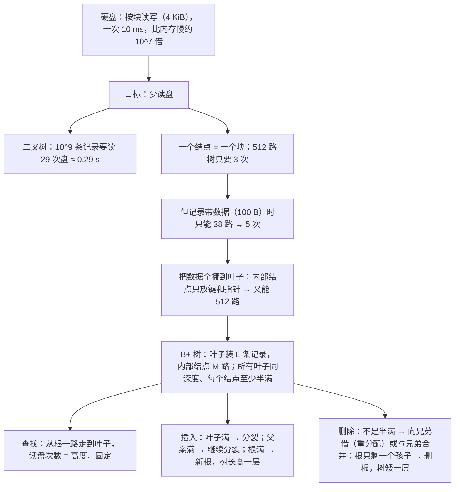

# C6.10 B+树

> [!abstract] 这一讲的任务
> [[C6.9 多路搜索树]] 的结论是：**多路树在“跳一个结点很贵”的时候才值得用**。这一讲先把“贵”算清楚：从磁盘读一个块要 10 毫秒，比内存慢上千万倍。
> 于是设计目标变成：**一个结点正好占一个磁盘块，树尽量矮，每次查找读盘次数尽量少且固定**。
> B+ 树的答案有三条：
> 1. **数据全放在叶子里**，内部结点只放“路标”（键和指针），所以内部结点能分出 512 个岔；
> 2. **所有叶子在同一深度**，每个结点**至少半满**，保证树不长歪；
> 3. 插入满了就**分裂**，删除空了就**合并或重分配**，树只会**从根部长高或变矮**。
>
> 结果是：十亿条记录，**任何一次查找都只读 3 次盘**。

> [!info] 怎么读这份讲义
> 第一、二节是动机：硬盘有多慢、二叉树为什么在磁盘上不行，**数字很多，建议对着表看**。
> 第三、四节讲 B+ 树的结构是怎么一步步推出来的，第五节是正式定义（**必背**）。
> **第七到第九节是主体**：一棵 $M=5$、$L=3$ 的小 B+ 树上的查找、插入（分裂）、删除（合并、重分配）。建议把第七节的初始树抄在纸上，每一步自己做一遍再对表。
> 标题末尾写“（补充）”的小节是课件没有、由通行讲法补出的内容。

> [!info] 标注说明与授课进度
> 标有 **（拓展）** 或 **【拓展】** 的内容，是**课堂上没有讲到、由课件和教材延伸补充**的部分。
> **授课进度**：现有转写稿只到第四节课（停在第 3 章栈的扩容），树尚未开讲，本篇按整篇尚未授课理解。

> [!info] 课程信息与来源
> **Ya-Hui Jia（贾雅慧）｜SFT SCUT｜jiayahui@scut.edu.cn**。全课程信息见 [[C1.0 课程信息与C++预备]] 与 [[数据结构 MOC]]。
> 本篇覆盖 `tree_part3` 的 **p.52–175**（`tree_part3` 到此结束，第 6 章也到此结束）。这一段**没有布置作业**。
> 记号：本篇按课件用 $M$ 表示内部结点的分叉数、$L$ 表示一个叶子块最多装几条记录。



## 目录与课件对应

| 阅读入口 | 课件页码 | 内容 |
| --- | --- | --- |
| [[#零、开场：十亿个账户]] | 52 | 动机 |
| [[#一、硬盘为什么慢]] | 53–63 | 容量与速度、按字节寻址与按块寻址、块内的浪费 |
| [[#二、把大树放上磁盘]] | 64–75 | 二叉树、512 路树、带数据的 38 路树 |
| [[#三、数据全放进叶子]] | 75–82 | 内部结点只存“每棵子树的最小键” |
| [[#四、为 4 KiB 的块选 M 和 L]] | 83–92 | $L=39$、$M=512$、十亿条记录读 3 次盘 |
| [[#五、B+ 树的定义]] | 93–99 | 形状规则、半满规则、根的特例 |
| [[#六、树有多高]] | 100–102 | 最好 / 最坏高度、为什么块内操作算 $\Theta(1)$ |
| [[#七、例子与查找]] | 103–108 | $M=5$、$L=3$ 的树；查 14、65、71 |
| [[#八、插入：满了就分裂]] | 109–149 | 55, 87, 60, 11, 35, 86，再加 70, 65, 77, 80 |
| [[#九、删除：不够半满就借或合并]] | 150–174 | 98, 75, 39, 59, 35, 88 |
| [[#十、课件勘误与阅读边界]] | 全部 | |

## 零、开场：十亿个账户

一家银行有十亿个账户，每个账户一条记录：4 字节的账号作键，外加 100 字节的信息（户名、余额……）。柜员输入账号，系统要**立刻**调出这条记录。

> [!question] 停一下，先自己想想
> 十亿条记录、每条 104 字节，约 100 GB。它放得进内存吗？如果只能放在硬盘上，用我们学过的 AVL 树或红黑树来索引，查一次要多久？

放不进（课件的设定还是 32 位地址，只能访问 4 GiB 内存，见 2.1 节），只能放在硬盘上。平衡二叉树高度至少 29，**每往下走一层就可能读一次盘**，一次 10 毫秒，查一个账户约 0.3 秒。柜台前排着长队，这不可接受。

这一讲要把它压到 **30 毫秒**，而且对任何账户都一样快。

## 一、硬盘为什么慢

### 1.1 容量与速度（p.53–55）

| 存储 | 容量量级 | 访问频率（课件的粗略数字） |
| --- | --- | --- |
| 缓存 | KiB–MiB | 1 GHz |
| 内存（SDRAM） | MiB–GiB | 100 MHz |
| 硬盘（10 ms 寻道） | GiB–TiB | **100 Hz** |

硬盘盘片每分钟 3600–7200 转（p.53）。从缓存到硬盘，速度差 $10^9/10^2=10^7$，**一千万倍**（p.55）。

> [!note] 单位（p.54）
> | 十进制 | 二进制 |
> | --- | --- |
> | 1 kB = 1000 B | 1 KiB = $2^{10}$ B = 1024 B |
> | 1 MB = $10^6$ B | 1 MiB = $2^{20}$ B = 1 048 576 B |
> | 1 GB = $10^9$ B | 1 GiB = $2^{30}$ B ≈ $1.073\times10^9$ B |
> | 1 TB = $10^{12}$ B | 1 TiB = $2^{40}$ B ≈ $1.100\times10^{12}$ B |
>
> 本篇的块大小 4 KiB = **4096** 字节。

### 1.2 按字节寻址对按块寻址（p.56–59）

- **内存按字节寻址**（p.56）：每个字节有自己的地址，可以单独读写。要改一个比特，读写它所在的那个字节就行。
- **硬盘按块寻址**（p.57）：块大小可以格式化时设定，本课统一取 **4 KiB**。要读一个字节，**必须把它所在的整个块读进内存**。
- 硬盘上的 I/O 控制器以块为单位读写，通过 **DMA（直接内存访问）** 把块拷进内存（p.58）。改一个字节，要先把整块读进来、改完、再整块写回去（p.59 的图）。

> [!important] 由此得出的设计原则（p.63）
> **读一个块的代价，和读块里的一个字节一样**。
> 所以既然每次读盘都要付 10 毫秒，就应该**让每次读进来的 4096 个字节都有用**——把一个结点做成正好一个块那么大。

### 1.3 块内的浪费（p.60–62）

文件总是占**整数个块**，最后一块可能没装满。课件的例子：一张 69 714 字节的图片，

$$\lceil 69714/4096\rceil = 18 \text{ 块},\qquad 18\times4096 = 73\,728 \text{ 字节},$$

浪费 $73728-69714=4014$ 字节（p.62）。块越大，平均浪费越多。

## 二、把大树放上磁盘

### 2.1 设定（p.64–66）

- $10^9$ 条记录，4 字节有序键，外加数据；
- 指针 / 块地址 32 位（4 字节）；
- 必须放在硬盘上：32 位地址只能访问 4 GiB 内存，而且内存断电就丢；
- **根结点常驻内存**（读它不算读盘）；
- 处理器 3 GHz，硬盘寻道 10 ms。

课件在这里提醒（p.66）：**我们一直默认“平衡树都是 $\Theta(\ln n)$，彼此差不多”**。在磁盘上这个默认不成立了——底数差别会变成几倍的时间差别。

### 2.2 二叉搜索树（p.67–68）

- 最小高度 $\lfloor\lg 10^9\rfloor=29$；
- 光是指针就要 $10^9\times2\times4$ 字节 $=8\times10^9$ 字节 ≈ **7.45 GiB**（课件说“almost 8 GiB”），超出 32 位地址能访问的 4 GiB；
- 两个结点几乎不可能在同一个块里，所以走到叶子要读 **29** 个块（根在内存里），约 **0.29 秒**。

### 2.3 512 路搜索树（p.69–70）

一个块里尽量多塞键和指针：

$$\frac{4096\ \text{B}}{4\ \text{B（键）}+4\ \text{B（指针）}}=512.$$

一个块放一个 512 路结点。最优高度 $\lfloor\log_{512}10^9\rfloor=3$（$\log_{512}10^9\approx3.32$），读 3 次盘，**30 ms**，比二叉树快近 10 倍（$290/30\approx9.7$）。

### 2.4 可是记录还要带数据（p.71–74）

只存键和指针，就像只存学号、银行账号，却不存对应的信息（p.71）。实际每条记录还有 100 字节数据。如果数据和键一起放在结点里：

- 每条记录 = 4 B 键 + 4 B 指针 + 100 B 数据 = 108 B；
- 一个块：$\lfloor(4096-4)/108\rfloor=$ **37** 条记录，加上第 38 个指针（减掉的那 4 B），剩 $4096-37\times108-4=$ **96** 字节没用（p.73）；
- 所以只能做 **38 路**树，高度 $\lfloor\log_{38}10^9\rfloor=5$（$\log_{38}10^9\approx5.70$）；
- 读 5 次盘，比 512 路树的 3 次**慢 67%**（p.74）。

> [!question] 停一下，先自己想想
> 38 路树里，有多大比例的记录在叶子上？（提示：[[C6.9 多路搜索树]] 6.2 节。）

约 $37/38\approx97\%$（p.75）。**几乎所有数据本来就在叶子里**，上面几层装的那一点点数据，却让每个内部结点的分叉数从 512 掉到了 38。

## 三、数据全放进叶子

### 3.1 想法（p.75–79）

既然 97% 的数据都在叶子，那就**把所有数据（键和 100 字节信息）都挪到叶子里**。内部结点只负责告诉你“该去哪个叶子”。

p.76 是一棵带数据的 3 路树；p.77 把数据全挪到最底层，但内部结点就不知道往哪走了。怎么给内部结点加“路标”？

- p.78：每棵子树存最小值和最大值——**太贵**；
- p.79：回到目标——**每个结点（叶子或内部）都正好占一个块**。内部结点不存数据，就能存更多的键和指针。

### 3.2 路标：每棵子树的最小键（p.80–82）

课件的做法：**内部结点存“除第一棵以外，每棵子树里的最小键”**。

p.80 用了一个 5 路结点：根存 `33 68`，意思是

- 第 1 棵子树：键 $<33$；
- 第 2 棵子树：$33\le$ 键 $<68$；
- 第 3 棵子树：键 $\ge68$。

第一棵子树不需要路标（它的范围是“比第一个路标小”）。每一层都这样做（p.81）。

> [!question] 课堂追问（p.82）：在 p.81 的树里找 28 和 63

- **28**：根 `33 68`，$28<33$ → 第 1 棵 `9 16 25 30`；$25\le28<30$ → 叶子 `25 28` → **找到**。
- **63**：根，$33\le63<68$ → 第 2 棵 `41 47 56 60`；$63\ge60$ → 叶子 `60 64` → **不在**。

> [!important] B+ 树和二叉搜索树的一个关键区别
> BST 里，一个键**只出现一次**。B+ 树里，内部结点的键只是**叶子里某个键的副本**（“这棵子树从这里开始”），同一个键可能在内部结点和叶子里各出现一次。**真正的数据只在叶子里。**
> 所以 B+ 树的查找**永远要走到叶子**，即使在内部结点里看到了要找的键（p.102）。

## 四、为 4 KiB 的块选 M 和 L

### 4.1 叶子块（p.84–85）

每条记录 = 4 B 键 + 100 B 数据 = 104 B（叶子里不需要子树指针）：

$$L=\left\lfloor\frac{4096}{104}\right\rfloor=39,\qquad 4096-39\times104=40 \text{ 字节剩余}.$$

### 4.2 内部块（p.86–87）

只存键和指针：一个块能放 512 对键–地址，**做 512 路树**（$M=512$）。准确地说，512 路结点需要 511 个键和 512 个指针，共 4092 字节，剩下的 4 字节可以用来记录当前有几个孩子（p.87）。不是所有内部块都会装满。

### 4.3 十亿条记录要读几次盘（p.88–92）

- 叶子块：$\lceil10^9/39\rceil=25\,641\,026$ 个；
- 一棵高度 $h$ 的 512 路树，最底层能挂 $512^{h+1}$ 个孩子（这里就是叶子块）；
- $h=\lceil\log_{512}25\,641\,026\rceil-1=\lceil2.73\rceil-1=2$；
- **算上最底下那一层叶子，整棵树高度 3**。

查找一次（p.89–92）：根常驻内存，在根里查到该去哪个孩子；读第 2 层（10 ms）；读第 3 层，查出该去哪个叶子（10 ms）；读叶子块（10 ms），在 39 条记录里找到目标。

> [!important] 结论
> **十亿条记录，每次查找恰好 3 次读盘，30 毫秒**。和 2.3 节“只存键”的 512 路树一样快，但现在每条记录都带着 100 字节数据。

## 五、B+ 树的定义

### 5.1 形状（p.93–96）

- **叶子块**：装至多 $L$ 条按键排序的记录的数组；
- **内部块**：$M$ 路结点，至多 $M-1$ 个键、$M$ 棵子树；
- **所有叶子在同一深度**（p.94）——这保证**任何记录的访问时间都一样**。

p.95–96：$M=32$、$L=8$ 时，高度 1 的完美 B+ 树装 $32\times8=256$ 条记录，高度 2 的装 $32\times32\times8=8192$ 条。

### 5.2 正式定义（p.97–99）

实际情况下结点通常不满（p.97），所以要加规则防止树长歪：

> [!important] B+ 树（阶为 M）的定义
> 1. **所有数据都存在叶子块**里。
> 2. 如果总共不超过 $L$ 条记录，**根就是一个叶子块**。
> 3. 否则，**所有叶子块**：
>    - 在**同一深度**；
>    - 各装 $\lceil L/2\rceil$ 到 $L$ 条记录，即**至少半满**。
> 4. **根**要么是叶子块，要么是有 **2 到 $M$** 个孩子的 $M$ 路结点。
> 5. **其余内部块**是有 $\lceil M/2\rceil$ 到 $M$ 个孩子的 $M$ 路结点，也是**至少半满**。
> 6. 内部块存至多 $M-1$ 个键，**第 $k$ 个键是第 $k+1$ 棵子树里的最小键**（课件 p.99 写作“key $k$ 是 sub-tree $k$ 的最小键”，是从 1 开始给键编号、从 0 开始给子树编号的写法）。

$L$ 取决于记录大小和块大小（p.98），$M$ 取决于键和指针的大小。

> [!note] 为什么根可以例外
> 根只要求至少 2 个孩子。树刚从一个叶子长成两层时，根只有 2 个孩子；如果也要求根半满（256 个孩子），小树就没法存在了。

## 六、树有多高

### 6.1 最好和最坏（p.100–101）

仍以 $M=512$、$L=39$ 为例。课件这里的“高度”**把叶子那一层也算进去**，和 4.3 节一致：

| 记录数 | 最好（全满：叶子 39、内部 512） | 最坏（全半满：叶子 20、内部 256） |
| --- | --- | --- |
| $10^9$ | $\lceil\log_{512}\lceil10^9/39\rceil\rceil=\lceil2.73\rceil=$ **3** | $\lceil\log_{256}\lceil10^9/20\rceil\rceil=\lceil3.20\rceil=$ **4** |
| $10^{13}$ | $\lceil\log_{512}\lceil10^{13}/39\rceil\rceil=\lceil4.21\rceil=$ **5** | $\lceil\log_{256}\lceil10^{13}/20\rceil\rceil=\lceil4.86\rceil=$ **5** |

（$\lceil39/2\rceil=20$，$512/2=256$；所有对数值都由程序核算。）

**十万亿条记录，最坏也只要读 5 次盘。** 半满规则让最坏情况和最好情况只差一两层。

### 6.2 为什么块内操作算 Θ(1)（p.102）

块大小固定为 4 KiB，所以 $L$、$M$ 是由块大小决定的**常数**。块内的数组插入是 $O(L)$、$O(M)$，但它们都是常数，而且比起一次 10 ms 的读盘可以忽略。于是：

- 所有块操作都算 $\Theta(1)$；
- 查找、插入、删除的代价都是**树高 × 一次块操作**，即 $\Theta(\ln n)$；
- 和 AVL 树不同，**B+ 树的每次查找都一定走到叶子**。

## 七、例子与查找

### 7.1 课件的例子树（p.103–104）

$M=5$（内部结点 3 到 5 个孩子，根 2 到 5 个），$L=3$（叶子 2 到 3 条记录）。

```
根: [21 49 67]
├─ [7 12 18]      叶子: (2 3 4) (7 8 9) (12 14 15) (18 20)
├─ [27 32 39 43]  叶子: (21 24 26) (27 28 30) (32 33 36) (39 40 42) (43 45 48)
├─ [54 58 63]     叶子: (49 51 52) (54 56) (58 59 61) (63 64 66)
└─ [74 79 85 91]  叶子: (67 69 71) (74 75 78) (79 81 82) (85 88) (91 92 98)
```

根的三个键把记录分成四段（p.104）：$x<21$、$21\le x<49$、$49\le x<67$、$x\ge67$。

> [!warning] 课件说这棵树有 54 条记录，实际是 51 条
> 18 个叶子，其中 3 个只有 2 条记录，共 $18\times3-3=51$ 条。后面插入 6 条后的树（p.138）恰好 57 条，与 51 吻合。

### 7.2 三次查找（p.105–107）

| 查找 | 在根里 | 在内部结点里 | 结果 |
| --- | --- | --- | --- |
| 14 | $14<21$ → 第 1 棵 | $12\le14<18$ → 第 3 个叶子 `(12 14 15)` | 找到 |
| 65 | $49\le65<67$ → 第 3 棵 | $65\ge63$ → 第 4 个叶子 `(63 64 66)` | 不在 |
| 71 | $71\ge67$ → 第 4 棵 | $71<74$ → 第 1 个叶子 `(67 69 71)` | 找到 |

### 7.3 代价（p.108）

根在内存里，每次查找读 2 个块（内部结点 + 叶子），**20 ms**。如果还要修改这条记录，要把叶子写回去，**30 ms**。

## 八、插入：满了就分裂

### 8.1 规则（p.109）

1. 按查找的路径找到该放的叶子；
2. 叶子没满：在数组里插进去（$O(L)$），写回；
3. 叶子满了：**分裂成两个叶子**，记录对半分，每个都至少半满；
4. 分裂出新叶子，**父结点要加一个键和一个指针**；父结点也满了就继续分裂，一直可能到根。

![[C6-B+树-分裂.png]]

> [!important] 叶子分裂和内部分裂的区别（补充，图上两行）
> - **叶子分裂**：右半边的最小键被**复制**到父结点当路标，这条记录本身**留在叶子里**。
> - **内部分裂**：中间那个键被**移**到上一层，**不再留在**本层。
>
> 原因：数据只能在叶子里，所以叶子里的键一个都不能少；内部结点的键只是路标，挪上去就行。

### 8.2 六次插入（p.110–138）

从 7.1 节的树出发（每一步都检查过：叶子 2–3 条、内部 3–5 个孩子、根 2–5 个孩子）：

| 插入 | 发生了什么 | 读 + 写 | 课件页 |
| --- | --- | --- | --- |
| 55 | 落在 `(54 56)`，没满，变 `(54 55 56)` | 20 + 10 = **30 ms** | 110–115 |
| 87 | 落在 `(85 88)`，变 `(85 87 88)` | 30 ms | 113–114 |
| 60 | `(58 59 61)` 满了，两个兄弟也满 → 分裂成 `(58 59)` `(60 61)`，父结点加键 60：`[54 58 60 63]` | 20 + 30 = **50 ms**（写两个叶子和父亲） | 116–119 |
| 11 | `(7 8 9)` 满，兄弟也满 → `(7 8)` `(9 11)`，父结点 `[7 9 12 18]` | 50 ms | 120–123 |
| 35 | `(32 33 36)` 满 → `(32 33)` `(35 36)`；父结点 `[27 32 39 43]` 已有 5 个孩子，再加一个就 6 个 → **父结点分裂**成 `[27 32]` 和 `[39 43]`，**35 升到根**：`[21 35 49 67]` | 20 + 50 = **70 ms**（两个叶子、两个内部块、根） | 124–129 |
| 86 | `(85 87 88)` 满 → `(85 86)` `(87 88)`；父结点 `[74 79 85 91]` 分裂成 `[74 79]` 和 `[87 91]`，85 上升；**根也满了**（将有 6 个孩子）→ 根分裂成 `[21 35]` 和 `[67 85]`，**49 成为新根** | 20 + 70 = **90 ms**（再加旧根、新兄弟、新根） | 130–137 |

> [!note] 课件的一个小口径：先看兄弟有没有空
> p.118、p.121 都说“Both (immediate) siblings are full, so split”，言下之意是：**如果相邻兄弟有空位，可以把一条记录挪给兄弟，而不必分裂**（插入时的重分配）。课件没有演示这种情况，演示里用到的都是“兄弟也满”的情形。

插入 86 后的树（p.138），**所有叶子都在深度 3**：

```
根: [49]
├─ [21 35]
│   ├─ [7 9 12 18]    (2 3 4) (7 8) (9 11) (12 14 15) (18 20)
│   ├─ [27 32]        (21 24 26) (27 28 30) (32 33)
│   └─ [39 43]        (35 36) (39 40 42) (43 45 48)
└─ [67 85]
    ├─ [54 58 60 63]  (49 51 52) (54 55 56) (58 59) (60 61) (63 64 66)
    ├─ [74 79]        (67 69 71) (74 75 78) (79 81 82)
    └─ [87 91]        (85 86) (87 88) (91 92 98)
```

> [!important] 停一下，我们刚才干了什么
> 树**只能通过在顶上加一个新根来长高**（p.138）。分裂从叶子往上传，传到根，根一分为二，再在上面加一个只有 2 个孩子的新根——这就是为什么根的下限是 2 而不是 $\lceil M/2\rceil$。
> 也正因为长高发生在最顶上，**所有叶子永远在同一深度**，不需要任何旋转。这和 AVL、红黑树靠旋转维持平衡完全不同。

### 8.3 分裂之后，树变得“松”了（p.139–148）

p.138 的树里很多结点只是半满。课件列举（p.139）：

- **10、19、34、37、38、62、89、90**：落进的叶子还有空位，直接插；
- **22、23、29、31、41、44、46、47、68、70、72、73、76、77、80、83、84、93……**：叶子满了要分裂，但**父结点还有空**，只改父结点；
- **0、1、13、16、17、50、57、65**（p.142）：叶子满、父结点也满，父结点也要分裂。

接着演示了四次（逐步核对）：

| 插入 | 发生了什么 | 课件页 |
| --- | --- | --- |
| 70 | `(67 69 71)` → `(67 69)` `(70 71)`；父结点 `[74 79]` → `[70 74 79]` | 140–142 |
| 65 | `(63 64 66)` → `(63 64)` `(65 66)`；父结点 `[54 58 60 63]` 满 → 分裂成 `[54 58]` 和 `[63 65]`，60 上升：`[60 67 85]` | 143–144 |
| 77 | `(74 75 78)` → `(74 75)` `(77 78)`；父结点 `[70 74 79]` → `[70 74 77 79]` | 145 |
| 80 | `(79 81 82)` → `(79 80)` `(81 82)`；父结点 `[70 74 77 79]` 满 → 分裂成 `[70 74]` 和 `[79 81]`，77 上升：`[60 67 77 85]` | 146–148 |

### 8.4 分裂其实很少发生（p.149）

演示用的 $M=5$、$L=3$ 太小，所以看起来每插几个就要分裂。实际参数下（课件取 $M=512$、$L=32$）：

- 一个叶子刚分裂完是半满（16 条），**平均要再插 16 条才会再分裂**；
- 一个内部结点刚分裂完有 256 个孩子，**要再发生 256 次叶子分裂才会再分裂**。

所以分裂是**相当少见**的事件。

## 九、删除：不够半满就借或合并

### 9.1 规则（p.150–153）

删除后，叶子可能**不足半满**（少于 $\lceil L/2\rceil$ 条）：

- **重分配**：相邻兄弟有多余的记录（多于半满），就**借一条过来**，并更新父结点的路标；
- **合并**：相邻兄弟也只有半满，就**把两个叶子合成一个**，父结点少一个孩子。

合并会让父结点少一个孩子，父结点也可能不足半满（少于 $\lceil M/2\rceil$ 个孩子），同样用借或合并处理，可能一直传到根。**如果根只剩一个孩子，就删掉根，让那个孩子当新根**，树矮一层（p.151）。

为了方便找兄弟，**B+ 树的叶子块通常按顺序串成单链表或双链表**（p.153）。

> [!tip] 叶子串成链表的另一个好处（补充）
> 区间查询（“找出所有 $30\le$ 键 $<60$ 的记录”）只要找到第一个叶子，然后**沿着链表往右读**，不用回到上层。这是数据库索引普遍用 B+ 树而不是 B 树的主要原因之一。

### 9.2 六次删除（p.154–174）

从 8.2 节插入 86 后的树（p.138）出发：

| 删除 | 发生了什么 | 课件页 |
| --- | --- | --- |
| 98 | `(91 92 98)` → `(91 92)`，仍半满，写回即可 | 155–156 |
| 75 | `(74 75 78)` → `(74 78)`，把后面的记录往前挪，写回 | 157–158 |
| 39 | `(39 40 42)` → `(40 42)`；父结点路标 39 改成 40：`[40 43]`。这样以后重新插入 39 会落进 `(35 36)` | 159–160 |
| 59 | `(58 59)` → `(58)`，不足半满。**两个选择**：向左兄弟 `(54 55 56)` 借 56 → `(54 55)` `(56 58)`，路标 58 改 56（重分配，p.162）；或与右兄弟 `(60 61)` 合并成 `(58 60 61)`，父结点去掉 60：`[54 58 63]`（合并，p.163–164）。**课件最终取了合并** | 161–164 |
| 35 | `(35 36)` → `(36)`，与右兄弟合并成 `(36 40 42)`；父结点 `[40 43]` 只剩 `[43]`、**2 个孩子，不足半满**（上一层路标 35 改成 36）。可以从隔壁 `[54 58 63]` 借一个叶子过来（重分配，p.167，要经过根）；课件认为更合理的是和**同一个父亲下的**兄弟 `[27 32]` 合并成 `[27 32 36 43]`。于是 `[21 36]` 只剩 `[21]`、2 个孩子，也不足半满 → 与兄弟 `[67 85]` 合并，把根里的 49 拉下来：`[21 49 67 85]`。**根只剩一个孩子 → 删根**，树矮一层 | 165–171 |
| 88 | `(87 88)` → `(87)`，与右兄弟合并成 `(87 91 92)`；父结点 `[87 91]` 只剩 `[87]`、2 个孩子 → 与左兄弟 `[74 79]` 合并成 `[74 79 85 87]`，根去掉 85：`[21 49 67]` | 172–174 |

最终结果（p.174），高度回到 2：

```
根: [21 49 67]
├─ [7 9 12 18]    (2 3 4) (7 8) (9 11) (12 14 15) (18 20)
├─ [27 32 36 43]  (21 24 26) (27 28 30) (32 33) (36 40 42) (43 45 48)
├─ [54 58 63]     (49 51 52) (54 55 56) (58 60 61) (63 64 66)
└─ [74 79 85 87]  (67 69 71) (74 78) (79 81 82) (85 86) (87 91 92)
```

> [!question] 课堂追问
> 删 39 时课件把父结点的路标 39 改成了 40。不改行不行？

**行**（补充）。路标只需要满足“第 $k$ 棵子树的所有键 $\ge$ 第 $k$ 个路标”。删掉 39 以后，那个叶子里剩下的 40、42 仍然都 $\ge39$，所以路标 39 仍然能正确引导查找。改成 40 的好处是路标和叶子的最小键保持一致（课件的定义第 6 条），代价是多写一次父结点。很多实现为了少读写磁盘选择**不改**。

### 9.3 小结（p.175）

- B+ 树用来存放**大量（GiB 级）数据**；
- 内部结点是存键和指针的 $M$ 路结点，叶子块存 $L$ 条带键的记录；
- **除根以外，所有结点始终至少半满**；
- 插入靠**分裂**，删除靠**重分配和合并**；
- **B\* 树浪费的空间更少**。

> [!note] 【拓展】B\* 树是什么
> B\* 树把“至少半满”提高到“**至少 2/3 满**”：插入时如果结点满了，先尝试把记录挪给兄弟；兄弟也满了，就把**两个满结点拆成三个**（每个 2/3 满），而不是一个拆成两个。空间利用率更高，代价是插入更复杂。课件只提了一句，不在本课范围内。

## 十、课件勘误与阅读边界

| 位置 | 课件写的 | 实际情况 |
| --- | --- | --- |
| p.61 | $18\times4098$ bytes = 73 728 bytes | 应为 $18\times$ **4096**；$18\times4098=73\,764$。结果 73 728 是对的 |
| p.74 | “the **maximum** height would be $\lfloor\log_{38}10^9\rfloor=5$” | 这是 38 路树的**最小（最优）**高度，与 p.70 的 512 路树口径一致 |
| p.87 | “we could store 512 key-address pairs” | 512 路结点实际是 511 个键 + 512 个指针（4092 B），剩 4 B，课件后半句说的就是这 4 B |
| p.99 | “key $k$ represents the smallest key in sub-tree $k$” | 键从 1 编号、子树从 0 编号时才成立；按例子树，第 $k$ 个键是第 $k+1$ 棵子树的最小键。见 5.2 节 |
| p.103 | “$M=5$, $L=3$ and **54** records” | 实际是 **51** 条。见 7.1 节 |
| p.149 | 用 $L=32$ | 前面一直用 $L=39$，这里换了个方便整除的数，结论不变 |
| p.150 | “it may occur that an **insertion** will result in a violation” | 应为 **erasure**（这一页讲的是删除） |
| p.151 与 p.152 | 两页完全相同 | 重复页 |
| p.173 | “The parent, too, is now **half full**” | 该结点只剩 2 个孩子，**不足半满**（下限 $\lceil5/2\rceil=3$） |

**阅读边界**：

- 本篇覆盖 `pdfs/tree_part3.pptx` 的 **p.52–175**，全部读过。
- **按帧抽读的页**：p.89–92（查找过程的逐层放大动画）、p.110–148（插入）、p.154–174（删除）是同一棵树的逐帧动画，每页都看过，本篇整理成每步一行的表格和关键状态的结果树，每一步都手工检查了结点上下限。
- **未发现课堂手写批注**，没有红色禁止符号，**没有作业**。

## 十一、这一讲的三句话

1. **硬盘按块读写、一次约 10 ms，所以磁盘上的树要让“一个结点 = 一个块”，并让树尽量矮**。把数据全放进叶子（$L=39$），内部结点只放键和指针（$M=512$），十亿条记录只要 3 次读盘。
2. **B+ 树的规则：所有叶子同一深度；除根以外所有结点至少半满；根至少 2 个孩子；内部结点的键是右边子树的最小键**。于是最坏高度和最好高度只差一两层，而且每次查找都要走到叶子。
3. **插入满了就分裂（叶子复制键上去、内部结点把中间键移上去），一路可能分裂到根，根分裂就长出新根；删除不足半满就向兄弟借或与兄弟合并，根只剩一个孩子就删根**。树只在顶部长高或变矮，所以永远平衡，不需要旋转。

### 规则速查

| | 叶子块 | 内部块（非根） | 根 |
| --- | --- | --- | --- |
| 装什么 | 记录（键 + 数据） | 键和指针 | 叶子，或键和指针 |
| 下限 | $\lceil L/2\rceil$ 条 | $\lceil M/2\rceil$ 个孩子 | 2 个孩子（是叶子时不限） |
| 上限 | $L$ 条 | $M$ 个孩子（$M-1$ 个键） | $M$ 个孩子 |
| 超上限 | 分裂，右半最小键**复制**上去 | 分裂，中间键**移**上去 | 分裂，**新建根** |
| 低于下限 | 向兄弟借，或与兄弟合并 | 同左 | 只剩 1 个孩子时删根 |

### 关键核对值

| 内容 | 结果 | 出处 |
| --- | --- | --- |
| 缓存对硬盘 | 约 $10^7$ 倍 | p.55 |
| 69 714 字节的文件 | 18 块、73 728 字节、浪费 4014 字节 | p.61–62 |
| BST 存 $10^9$ 条 | 高 29，读 29 次，0.29 s；指针约 7.45 GiB | p.67–68 |
| 纯键 512 路树 | 高 3，30 ms | p.69–70 |
| 带 100 B 数据的多路树 | 37 条 / 块、38 路、高 5、慢 67% | p.72–74 |
| 叶子 $L$ | $\lfloor4096/104\rfloor=39$，剩 40 B | p.85 |
| $10^9$ 条的叶子块数 | 25 641 026 | p.88 |
| $10^9$ 条最好 / 最坏高度 | 3 / 4 | p.100 |
| $10^{13}$ 条最好 / 最坏高度 | 5 / 5 | p.101 |
| 例子树记录数 | 51（课件写 54） | p.103，自算 |
| 插入 55 / 60 / 35 / 86 的耗时 | 30 / 50 / 70 / 90 ms | p.115–137 |
| 删除 35 之后 | 删根，高度从 3 降到 2 | p.170–171 |

**第 6 章小结**：从 [[C6.1 树的概念与术语]] 的定义，到 [[C6.6 二叉搜索树]] 的“有序 + 查找”，再到 [[C6.7 平衡与AVL树]]、[[C6.8 红黑树]] 的“平衡二叉树”，最后到 [[C6.9 多路搜索树]] 和本篇的“为磁盘设计的多路平衡树”——整章都在回答同一个问题：**怎样让树高始终可控**。在内存里，答案是旋转；在磁盘上，答案是分裂与合并。

---

上一篇：[[C6.9 多路搜索树]] ｜ 前置：[[C6.5 完美二叉树·完全二叉树与N叉树]]、[[C6.7 平衡与AVL树]] ｜ 返回：[[数据结构 MOC]]
