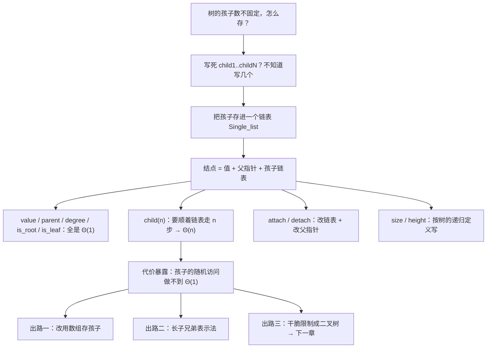
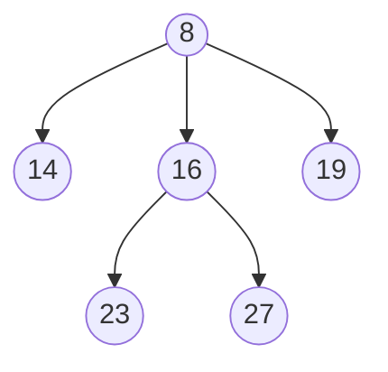
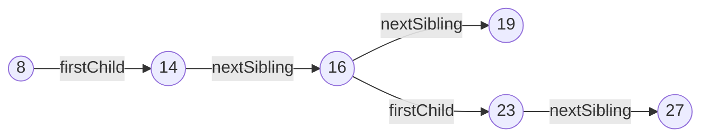

# C6.2 抽象树与通用实现

> [!abstract] 这一讲的任务
> 上一讲把树的术语说清楚了，但一行代码都没写。现在动手：**一个结点可能有 1 个孩子，也可能有 30 个，怎么存？**
> `Type *child1, *child2, *child3;` 这条路一开始就走不通——你不知道要写几个。课件的解法很省事：**把孩子们塞进一个链表**，让第 2 章的 `Single_list` 回来给树打工。
> 这一讲同时是一次代价的暴露：**这样存，取第 $n$ 个孩子要 $\Theta(n)$**。课件的小结页自己承认了这一点，而它正是下一章要把树限制成**二叉树**的全部动机。

> [!info] 怎么读这份讲义
> 第二、三节是类的设计与全部成员函数，按顺序读。
> **第四节（size 与 height）是本篇最值得琢磨的一节**：两个函数把“树的递归定义”第一次变成了可运行的代码，而且课件在这里埋了一个**真正的 C++ 陷阱**（`this == nullptr`），第六节专门拆。
> 第五节的两种替代表示法（数组、长子兄弟）是考试常考的对照题。
> 标题末尾写“（补充）”的小节是课件没有、由通行讲法补出的内容。

> [!info] 标注说明与授课进度
> 标有 **（拓展）** 或 **【拓展】** 的内容，是**课堂上没有讲到、由课件和教材延伸补充**的部分。
> **授课进度**：转写稿只到第四节课（停在第 3 章栈的扩容），树尚未开讲，本篇按整篇尚未授课理解。

> [!info] 课程信息与来源
> **Ya-Hui Jia（贾雅慧）｜SFT SCUT｜jiayahui@scut.edu.cn**。全课程信息见 [[C1.0 课程信息与C++预备]] 与 [[数据结构 MOC]]。
> 本篇覆盖 `tree_part1` 的 p.36–52，课件编号 4.2.1–4.2.4。



## 目录与课件对应

| 阅读入口 | 课件页码 | 内容 |
| --- | --- | --- |
| [[#零、开场：写不出来的那个类]]、[[#一、抽象树要提供什么操作]] | 36–38 | 层次序、容器操作清单、度可以各不相同 |
| [[#二、设计：把孩子存进链表]] | 39–41 | 类的设计思路、完整类定义、内存图 |
| [[#三、简单的那几个函数]] | 42–47 | 构造、value、parent、is_root、degree、is_leaf、child(n)、attach、detach |
| [[#四、size 与 height：递归定义变成代码]] | 48–49 | 两个递归函数 |
| [[#五、别的存法]] | 50–51 | 数组存孩子、长子兄弟表示法 |
| [[#六、课件代码里的两个真问题（补充）]] | — | `this == nullptr`、`begin/end` 与 `head/next` 混用 |
| [[#七、小结与代价]] | 52 | 课件小结、为什么下一章要限制成二叉树 |
| [[#八、课件勘误与阅读边界]]、[[#九、这一讲的三句话]] | 全篇 | 校正口径与复习 |

---

## 零、开场：写不出来的那个类

照着 [[C2.5 单链表实现]] 的样子，你大概会这么起手写一个树结点：

```cpp
template <typename Type>
class Tree_node {
    Type value;
    Tree_node *child1;
    Tree_node *child2;
    // ...然后呢？
};
```

> [!question] 停一下，先自己想想
> 写到第三行就卡住了。示例树里 C 只有 1 个孩子、A 有 2 个、I 有 3 个。**写几个 `child` 指针才够？**

写 3 个：那 C 和 A 白白浪费掉一半空间，而且明天来一个有 10 个孩子的结点就崩了。
写 100 个：每个结点都背着 100 个指针，一棵 1000 结点的树光指针就要 800 KB，其中 99% 是 `nullptr`。

问题的本质是：**孩子的个数在编译期不知道，在运行期还会变。**

而“个数不定、还能增删的一串东西”——这不就是[[C2.1 线性表的定义与特性|线性表]]吗？

**所以解法是：不要在结点里写死指针，而是给每个结点挂一个装孩子的容器。** 课件选的容器是单链表。

## 一、抽象树要提供什么操作

### 1.1 层次序（p.37）

> **有限个对象的一个层次序 hierarchical ordering，可以存放在一棵树数据结构中。**

“层次序”这个词来自 [[C1.3 数据元素间的六种关系]]——六种关系里的第二种。上一讲 3.3 节说过，层次序里**孩子之间的先后是不相关的**，这和本讲要实现的“通用树”正好对上。

### 1.2 容器操作清单（p.37）

> 对一个按层次存储的容器，操作包括：
> - **访问根 Accessing the root**；
> - 给定容器中的一个对象：
>   - **访问当前对象的父结点**；
>   - **求当前对象的度**；
>   - **取得某个孩子的引用**；
>   - **把一棵新子树挂到当前对象上**；
>   - **把这棵树从它的父亲上摘下来**。

这份清单就是接下来要实现的全部 API。把它和 [[C1.2 抽象数据类型与容器操作]] 的“容器六问”对照着看：**问的还是那几个问题（怎么进、怎么出、怎么找、怎么数），只是从一条线搬到了一棵树上。**

### 1.3 度可以各不相同（p.38）

> **抽象树（抽象层次）不限制结点的个数。**在这棵树中，各结点的度各不相同：

课件用上一讲那棵 A–M 树，给出了完整的度分布（**已逐个核对，与树形一致**）：

| 度 Degree | 结点 Nodes |
| --- | --- |
| 0 | D, F, G, J, K, L, M |
| 1 | C |
| 2 | A, B, E, H |
| 3 | I |

核对一下：$7\times 0 + 1\times 1 + 4\times 2 + 1\times 3 = 12$，正好等于边数 $13-1=12$ ✓。**所有结点的度之和 = 边数 = 结点数 − 1**，这是上一讲 1.1 那条性质的另一种说法，可以拿来自查。

## 二、设计：把孩子存进链表

### 2.1 设计思路（p.39）

> 我们用一个类来实现抽象树或层次结构，这个类：
> - **存一个值**；
> - **把孩子们存在一个链表里**。

一句话，两件事。**注意课件没有单独的“树类”和“结点类”**——`Simple_tree` 这一个类同时扮演两个角色：它是一个结点，也是“以它为根的那棵子树”。这正好对应上一讲 5.2 的递归定义：**结点即树**。

### 2.2 完整类定义（p.40）

```cpp
template <typename Type>
class Simple_tree {
    private:
        Type node_value;
        Simple_tree *parent_node;
        Single_list<Simple_tree *> children;

    public:
        Simple_tree( Type const & = Type(), Simple_tree * = nullptr );

        Type value() const;
        Simple_tree *parent() const;
        int degree() const;
        bool is_root() const;
        bool is_leaf() const;
        Simple_tree *child( int n ) const;
        int height() const;

        void insert( Type const & );
        void attach( Simple_tree * );
        void detach();
};
```

三个私有成员，逐个说：

| 成员 | 作用 | 为什么需要 |
| --- | --- | --- |
| `node_value` | 这个结点存的数据 | 树是拿来存东西的 |
| `parent_node` | 指向父亲 | 支持 1.2 清单里的“访问父结点”；上一讲说过除根外每个结点恰有一个父亲 |
| `children` | **存孩子指针的单链表** | 解决开场那个“写几个指针”的问题 |

> [!important] 注意 `children` 的类型：`Single_list<Simple_tree *>`
> 链表里装的是**指针**，不是对象。为什么不能是 `Single_list<Simple_tree>`？
> 1. 那样每次 `push_back` 都要**拷贝整棵子树**，代价爆炸；
> 2. 更要命的是，`Simple_tree` 的定义里包含 `Single_list<Simple_tree>`，而这个链表又要存 `Simple_tree`……**类型自己包含自己，编译期无限递归，编译不过**。
>
> 存指针就没有这个问题：指针的大小是固定的，编译器算得出来。**“递归的数据结构必须通过指针（或引用）来递归”**，这是 C++ 里一条硬规则，链表的 `next` 指针、树的孩子指针都是同一个道理。

### 2.3 内存里长什么样（p.41）

课件 p.41 画了一棵六结点树（根 8，孩子 14、16、19；16 的孩子 23、27）在内存里的样子。每个 `Simple_tree` 对象是一个方框，里面有：`parent` 指针、`element` 值，以及嵌在里面的那个链表（`list_head`、`list_tail`、`node_count`）。

这棵树的逻辑形状是：



而每个方框里的 `node_count` 正好是该结点的度：8 的是 3，16 的是 2，其余都是 0。

> [!question] 停一下，先自己想想
> 图里从每个孩子回指父亲的那些虚线箭头，能不能省掉？

能省，树照样是树——光靠 `children` 链表就足以从根走到任何结点。但省掉之后，**1.2 清单里的“访问父结点”就变成了“从根开始搜索整棵树，直到找到谁的孩子链表里有我”**，代价 $\Theta(n)$。
`detach()`（把自己从父亲的孩子链表里删掉）也会从 $O(\deg)$ 退化成 $\Theta(n)$。
**用每结点一个指针的空间，换两个操作从 $\Theta(n)$ 到 $\Theta(1)$**——这笔交易和 [[C2.6 双向链表与循环链表]] 里“加 `prior` 指针”是同一笔。

## 三、简单的那几个函数

### 3.1 构造、取值、取父亲（p.42）

课件说“大部分功能与 `Single_list` 类很相似”：

```cpp
template <typename Type>
Simple_tree<Type>::Simple_tree( Type const &obj, Simple_tree *p ):
node_value( obj ),
parent_node( p ) {
    // Empty constructor
}

template <typename Type>
Type Simple_tree<Type>::value() const {
    return node_value;
}

template <typename Type>
Simple_tree<Type> *Simple_tree<Type>::parent() const {
    return parent_node;
}
```

注意构造函数**没有初始化 `children`**——它是一个类类型成员，会自动调用 `Single_list` 自己的默认构造函数变成空表。这和 [[C4.1 队列 Queue]] 里必须手写 `array( new Type[...] )` 不同：**裸指针要自己管，类对象会自己管。**

### 3.2 is_root、degree、is_leaf（p.43）

```cpp
template <typename Type>
bool Simple_tree<Type>::is_root() const {
    return ( parent() == nullptr );
}

template <typename Type>
int Simple_tree<Type>::degree() const {
    return children.size();
}

template <typename Type>
bool Simple_tree<Type>::is_leaf() const {
    return ( degree() == 0 );
}
```

三个函数正好把上一讲的三个术语变成了三行代码，而且每一行都**直接对应定义**：

| 术语（C6.1） | 定义 | 代码 |
| --- | --- | --- |
| 根 | 没有父亲 | `parent() == nullptr` |
| 度 | 孩子数 | `children.size()` |
| 叶 | 度为 0 | `degree() == 0` |

> [!note] 这三个都是 $\Theta(1)$，但有个前提（补充）
> `degree()` 是常数时间，**当且仅当 `Single_list::size()` 是常数时间**——也就是链表内部维护了一个计数器（p.41 的图里那个 `node_count` 就是它）。
> 如果链表的 `size()` 要现数一遍，`degree()` 和 `is_leaf()` 就都变成 $\Theta(\deg)$ 了。**容器的复杂度会原样传染给用它的类**，这一点在自己搭数据结构时要时刻记着。

### 3.3 取第 n 个孩子：第一次撞墙（p.44）

> **访问第 $n$ 个孩子需要一个 for 循环（$\Theta(n)$）：**

```cpp
template <typename Type>
Simple_tree<Type> *Simple_tree<Type>::child( int n ) const {
    if ( n < 0 || n >= degree() ) {
        return nullptr;
    }

    auto *child = children.head();

    // Skip the first n - 1 children
    for ( int i = 0; i < n; ++i ) {
        child = child->next();
    }

    return child;
}
```

> [!warning] **这就是整个设计的代价所在**
> 前面几个函数都是 $\Theta(1)$，偏偏这一个不是。原因在 [[C2.5 单链表实现]] 里早就讲过：**链表不支持随机访问**，要拿第 $n$ 个只能从头走 $n$ 步。
> 对 `child(0)` 无所谓，但如果算法要反复访问“第 2 个孩子”，代价就上来了。课件的小结页（p.52）把这条列为这个实现的主要缺点，而它正是**下一章把树限制成二叉树**的全部理由：**只有左右两个孩子，就可以各给一个指针，随机访问回到 $\Theta(1)$。**

> [!warning] 课件注释写反了（勘误）
> 注释写的是 `// Skip the first n - 1 children`，但循环 `for (int i = 0; i < n; ++i)` 执行了 **$n$ 次**，跳过的是**前 $n$ 个**孩子，落在下标 $n$ 上（从 0 开始编号）。
> 代码是对的（`child(0)` 返回 `head()`，不进循环），**注释少算了一个**。

### 3.4 挂上去：insert 与 attach（p.45、47）

课件 p.45 给的是**用一个值新建孩子**：

```cpp
template <typename Type>
void Simple_tree<Type>::attach( Type const &obj ) {
    children.push_back( new Simple_tree( obj, this ) );
}
```

新结点的父指针直接传 `this`，一步到位。

p.47 给的是**把一棵已有的树挂过来**，多了一道检查：

> 把一棵全新的树作为子树挂上去，则**首先要检查这棵树是不是已经是别的结点的子树**：
> - 如果是，**必须先把它摘下来，然后才能添加**。

```cpp
template <typename Type>
void Simple_tree<Type>::attach( Simple_tree<Type> *tree ) {
    if ( !tree->is_root() ) {
        tree->detach();
    }

    tree->parent_node = this;
    children.push_back( tree );
}
```

> [!question] 课堂追问
> 如果省掉那三行 `if`，直接 `tree->parent_node = this; children.push_back(tree);` 会怎样？

会留下一棵**结构被破坏**的树：`tree` 现在出现在**两个**父亲的孩子链表里（老父亲的链表没被清理），但它的 `parent_node` 只指着新的那个。于是：

- 从老父亲往下遍历，还能走到 `tree`——它被**数了两次**，`size()` 算出来偏大；
- 从 `tree` 往上走，只能回到新父亲——**上下两条路对不上**；
- 更糟的是，析构老父亲时会 `delete` 掉 `tree`，而新父亲还指着它——**悬空指针**，和 [[C5.1 双端队列 Deque]] 6.3 节那个问题一模一样。

**违反的是 C6.1 那条“除根外恰有一个父亲”。**数据结构的不变量一旦破坏，后面所有算法的正确性都没了保证——`attach` 里那个 `if` 就是在守这条不变量。

### 3.5 摘下来：detach（p.46）

> 把一棵树从它的父亲上摘下来：
> - **如果它已经是根，什么也不做**；
> - **否则，把这个对象从父亲的孩子链表里删掉，并把父指针置零。**

```cpp
template <typename Type>
void Simple_tree<Type>::detach() {
    if ( is_root() ) {
        return;
    }

    parent()->children.erase( this );
    parent_node = nullptr;
}
```

**两步缺一不可**：只删链表不清父指针，`this` 会变成“认着一个已经不认它的父亲”的孤儿；只清父指针不删链表，父亲还会遍历到它。

> [!important] 顺序也不能反
> 必须**先**用 `parent()` 找到父亲、删掉链表项，**再**把 `parent_node` 置零。反过来写的话，`parent()` 已经是 `nullptr`，`parent()->children` 就是空指针解引用，**当场崩溃**。
> 这和 [[C2.5 单链表实现]] 那条“**先连后断**”是同一类纪律：**改指针之前，先确认你还需要用它走到哪里。**

## 四、size 与 height：递归定义变成代码

这两个函数是本篇的重点。它们**长得几乎一样**，因为它们都是上一讲 5.2 那条递归定义的直译。

### 4.1 求大小（p.48）

> 假设我们想求一棵树的大小：
> - **空树的大小为 0，没有孩子的树大小为 1**；
> - **否则，大小等于 1 加上所有孩子的大小之和。**

```cpp
template <typename Type>
int Simple_tree<Type>::size() const {
    if ( this == nullptr ) {
        return 0;
    }

    int tree_size = 1;

    for ( auto *child = children.begin(); child != children.end(); child = child->next() ) {
        tree_size += child->size();//递归
    }

    return tree_size;
}
```

$$\text{size}(T) = 1 + \sum_{c \,\in\, \text{children}(T)} \text{size}(c)$$

### 4.2 求高度（p.49）

> 假设我们想求一棵树的高度：
> - **空树的高度为 $-1$，没有孩子的树高度为 0**；
> - **否则，高度等于 1 加上任一子树的最大高度。**

```cpp
#include <algorithm>

template <typename Type>
int Simple_tree<Type>::height() const {
    if ( this == nullptr ) {
        return -1;
    }

    int tree_height = 0;

    for ( auto *child = children.begin(); child != children.end(); child = child->next() ) {//遍历子树，使用递归函数求子树的高度，再求最大值
        tree_height = std::max( tree_height, 1 + child->height() );
    }

    return tree_height;
}
```

$$h(T) = 1 + \max_{c \,\in\, \text{children}(T)} h(c), \qquad h(\varnothing) = -1$$

> [!important] 这就是上一讲那个 $-1$ 的用处
> C6.1 第 4.3 节留过一个伏笔：空树高度定义成 $-1$ 是为了让递归式不用特判。现在**伏笔回收**：
> 叶结点没有孩子，循环一次都不进，直接返回 `tree_height = 0` ✓。
> 而如果哪天你要写“左右子树都可能为空”的二叉树版本（下一章），`h = 1 + max(h(left), h(right))` 在两个子树都空时算出 $1 + (-1) = 0$ ✓，**照样不用特判**。
> **约定不是随便定的，是为了让后面的式子干净。**

> [!question] 停一下，先自己想想
> `size()` 和 `height()` 的代码几乎一模一样，只有三处不同。是哪三处？为什么是这三处？

| | `size()` | `height()` |
| --- | --- | --- |
| 空树返回 | `0` | `-1` |
| 初值 | `1`（把自己数上） | `0`（自己这一层不加高度） |
| 合并方式 | **求和** `+=` | **取最大** `std::max` |

三处差别全部来自定义本身：**大小要把所有孩子都算进来（求和），高度只关心最深的那一条路（取最大）**。
这个“遍历孩子 + 用某种方式合并结果”的骨架，在整章会反复出现（求叶子数、求某值出现次数、求最大值……）。**把它当模板记住，换一个合并方式就是一个新算法。**

> [!note] 两者的复杂度（补充）
> 都是 $\Theta(n)$：每个结点恰好被访问一次，每条边恰好被走一次。
> **注意不是 $\Theta(n^2)$**——虽然 `child(n)` 是 $\Theta(n)$，但这里**没有用 `child(n)`**，而是顺着链表一路 `next()` 走下去，每个孩子只经过一次。**这是个好习惯：遍历容器要用迭代，不要在循环里反复调用按下标访问的函数。**（那样写就真成 $\Theta(n^2)$ 了，是新手常见的性能错误。）

## 五、别的存法

### 5.1 用数组存孩子（p.50）

> 用数组来存孩子实现树也类似，**不过我们必须处理整个结构**。用数组实现通用树的构造函数大致如下：

```cpp
template <typename Type>
Simple_tree<Type>::Simple_tree( Type const &obj, Simple_tree *p ):
node_value( obj ),
parent_node( p ),
child_count( 0 ),
child_capacity( 4 ),
children( new Simple_tree *[child_capacity] ) {
    // Empty constructor
}
```

课件那句“**必须处理整个结构**”说的是：数组带来了[[C3.1 栈 Stack|栈]]那一章的全部麻烦——**容量、扩容、析构时 `delete[]`、初始化顺序**（`children` 的初始化用到了 `child_capacity`，所以声明顺序不能反，见 [[C4.1 队列 Queue]] 5.5 节）。

换来的好处是：**`child(n)` 变成 $\Theta(1)$**（直接 `children[n]`）。

| | 链表存孩子 | 数组存孩子 |
| --- | --- | --- |
| `child(n)` | $\Theta(n)$ | **$\Theta(1)$** |
| 加一个孩子 | $\Theta(1)$ | 摊还 $\Theta(1)$（满了要扩容，那次 $\Theta(\deg)$） |
| 删一个孩子 | 找到后 $\Theta(1)$ | $\Theta(\deg)$（要搬后面的元素） |
| 空间 | 每个孩子一个链表结点（多一个指针） | 有空位浪费（初始就占 4 个指针） |

**又是 [[C2.7 两种实现的比较]] 那张表**，只是这次比的是“孩子容器”。

### 5.2 长子兄弟表示法（p.51）

> 还有一些别的表示树结构的方式，比如**你的教材里提到的那种，叫做长子/兄弟表示法 first child / next sibling representation**。
> **好处是我们不用在结点里显式地存一个链表。**

```cpp
template <typename Type>
struct TreeNode
{
    Type element;
    TreeNode* firstChild;
    TreeNode* nextSibling;
    TreeNode* parent;        // optional
}
```

课件给出的示意：还是那棵 `8 → (14, 16, 19)`、`16 → (23, 27)` 的树，右下角画出它在这种表示法下的样子——8 只连向 14，14 横着连 16，16 横着连 19；16 竖着连 23，23 横着连 27。



> [!important] 它其实还是链表，只是把链表拆开嵌进了结点里
> `firstChild` 相当于孩子链表的 `head`，`nextSibling` 相当于链表结点的 `next`。**信息完全一样，只是不再需要一个独立的 `Single_list` 对象**——课件说的“不用显式存一个链表”就是这个意思。
> 好处：每个结点固定两个指针，结构整齐、省掉链表对象的额外开销。
> 代价：**`child(n)` 仍然是 $\Theta(n)$**（沿 `nextSibling` 走 n 步），求度也要数一遍。**这个表示法解决的是空间和整齐度，不解决随机访问。**

> [!important] 【拓展】它还有一个国内教材反复强调的性质
> 长子兄弟表示法又叫**孩子兄弟表示法**，而它画出来的结构——每个结点恰好两个指针——**本身就是一棵二叉树**。
> 于是有了那条经典结论：**任何一棵树（乃至森林）都可以唯一地转化成一棵二叉树**，转换规则就是“长子当左孩子，右兄弟当右孩子”。反过来也能唯一还原。
> 这意味着**研究二叉树不是在研究一个特例，而是在研究全部的树**——这是下一章敢于把注意力全部压在二叉树上的底气。**国内考研题里“树/森林与二叉树的转换”就是考这个。**

> [!question] 课堂追问（课件 p.51 的红字）
> 课件在这一页用**红色**写了一句：**“I can see the node, but where is the tree?”**（我看到结点了，可树在哪儿？）

这是一句故意的提问。`struct TreeNode` 描述的是**一个结点**，不是一棵树——它没有 `size()`、没有 `height()`、没有任何操作，甚至没人知道哪个结点是根。

对比 2.2 节的 `Simple_tree`：那个类**同时是结点和树**（它有 `is_root()`、`height()` 这些树的操作）。而 `TreeNode` 只是一块数据，要用它必须再包一层：

```cpp
template <typename Type>
class Tree {
    private:
        TreeNode<Type> *root;      // 这里才是“树”
    public:
        int size() const;
        int height() const;
        // ...
};
```

**这正是 [[C1.2 抽象数据类型与容器操作]] 的老问题：数据的摆放方式（结点）不等于抽象数据类型（树）。**课件用一句红字把这个区别点了出来。

## 六、课件代码里的两个真问题（补充）

> [!warning] 【拓展】问题一：`if ( this == nullptr )` 是未定义行为
> p.48 的 `size()` 和 p.49 的 `height()` 都以这一行开头：
> ```cpp
> if ( this == nullptr ) { return 0; }        // 或 return -1;
> ```
> 意图很清楚：想让 `((Simple_tree*)nullptr)->size()` 返回 0。**但这在 C++ 里是不合法的。**
> 在空指针上调用成员函数，**在进入函数体之前就已经是未定义行为了**——根本轮不到那行 `if` 去判断。而且现代编译器（GCC、Clang）会做这样的推理：“既然调用发生了，`this` 就一定不是空的”，于是**直接把这行 `if` 整个优化删掉**。打开 `-O2` 之后，这个保护形同虚设。
>
> **正确写法是在调用之前判断**，比如把递归改成：
> ```cpp
> for ( ... ) {
>     if ( child != nullptr ) { tree_size += child->size(); }
> }
> ```
> 或者写成静态/自由函数，把指针作为参数传进去：
> ```cpp
> template <typename Type>
> int size( Simple_tree<Type> const *t ) {
>     if ( t == nullptr ) { return 0; }
>     // ...
> }
> ```
> **这不是吹毛求疵**：`this == nullptr` 是 C++ 里被明确点名的经典错误，一旦写进作业代码，在调试构建下能跑、在发布构建下行为就变了，非常难查。

> [!warning] 【拓展】问题二：`begin/end` 与 `head/next` 混用
> p.48、p.49 的循环写的是：
> ```cpp
> for ( auto *child = children.begin(); child != children.end(); child = child->next() )
> ```
> 但 p.44 用的是 `children.head()`，而 [[C5.1 双端队列 Deque]] 4.2 节抄过的 Project 1 版 `Single_list` 接口里**只有 `head()` 和 `tail()`，没有 `begin()`/`end()`**。
> 更别扭的是这里把两套风格搅在了一起：`begin()/end()` 是**迭代器**的词汇（迭代器该用 `++child` 推进），而 `child->next()` 是**结点指针**的词汇。两者不能混着用。
> 按 Project 1 的接口，应当写成：
> ```cpp
> for ( auto *child = children.head(); child != nullptr; child = child->next() )
> ```
> **这是课件在不同页之间口径不一致**，不影响要讲的算法，但照抄会编译不过。

## 七、小结与代价

课件 p.52 的小结：

> 本讲我们看了通用树的一种实现：
> - **存每个结点的值**；
> - **把所有孩子存在一个链表里**；
> - **没有简单的（$\Theta(1)$ 的）方式访问孩子**；
> - **如果改用数组或其他表示法，会有另一些问题……**

> [!important] 停一下，我们刚才干了什么
> 我们用一个链表解决了“孩子个数不定”这个问题，代价是**孩子的随机访问退化成 $\Theta(n)$**。第三条小结就是课件自己承认的这笔账。
> 而最后那句省略号（“different problems...”）在说：**换成数组也不是白得的**——扩容、删除时搬移、空间浪费，问题只是换了个样子。
>
> **那么出路在哪？**
> 出路是**回到 [[C1.2 抽象数据类型与容器操作]] 的老办法：减少允许的东西，换取性能。**既然“任意多个孩子”是一切麻烦的根源，那就**限制每个结点最多两个孩子**——两个指针写得下，随机访问回到 $\Theta(1)$，而且由 5.2 节那条“任何树都能唯一转成二叉树”可知，**这个限制并没有让我们失去表达能力**。
>
> 这就是下一讲的全部动机。

## 八、课件勘误与阅读边界

| 位置 | 课件写的 | 实际情况 |
| --- | --- | --- |
| p.44 | 注释 `// Skip the first n - 1 children` | 循环执行 $n$ 次，跳过的是**前 $n$ 个**孩子。代码正确，注释少算一个 |
| p.48 / p.49 | `if ( this == nullptr )` | **未定义行为**，且会被 `-O2` 优化掉。应在调用前判空，见第六节 |
| p.48 / p.49 | `children.begin()` / `children.end()` 配 `child->next()` | Project 1 的 `Single_list` 只有 `head()/tail()`；且迭代器词汇与结点词汇混用。照抄编译不过 |
| p.45 / p.47 | 两个同名 `attach`（一个收 `Type const &`，一个收 `Simple_tree *`） | 是**函数重载**，合法；但 p.40 的类定义里列的是 `insert( Type const & )` 和 `attach( Simple_tree * )`，**p.45 的实现却写成了 `attach( Type const & )`**——与类定义对不上，应为 `insert` |
| p.52 | Θ 符号显示为异体字形 | 转换所致，按 Θ 理解（[[C1.5 算法与渐进分析]] 口径） |

**阅读边界**：

- 本篇覆盖 `pdfs/tree_part1.pptx` 的 **p.36–52**，课件编号 **4.2.1–4.2.4**；**17 页全部读过，未跳页**。
- **未发现课堂手写批注**；p.51 的红字 “I can see the node, but where is the tree?” 是课件自带的提问。
- p.41 的内存结构图信息密度很高但可辨认，本篇用文字和 mermaid 复述了其逻辑结构，未做裁切。

## 九、这一讲的三句话

1. **孩子个数不定，就别写死指针，挂一个容器**——`Simple_tree` = 值 + 父指针 + 孩子链表，`Single_list<Simple_tree *>` 里存的必须是**指针**，否则类型自己包含自己，编译不过。
2. **`size()` 和 `height()` 是同一个骨架**：空树返回边界值 → 自己算一份 → 遍历孩子递归合并。差别只在**边界值**（0 / −1）、**初值**（1 / 0）和**合并方式**（求和 / 取最大）。
3. **这个实现的代价是 `child(n)` 为 $\Theta(n)$**——链表不支持随机访问。想要 $\Theta(1)$，要么用数组（带来扩容和搬移），要么**限制孩子数为 2**，那就是下一章的二叉树。

### 接口与复杂度速查

| 成员函数 | 作用 | 复杂度 |
| --- | --- | --- |
| `value()` | 取结点值 | $\Theta(1)$ |
| `parent()` | 取父结点 | $\Theta(1)$ |
| `is_root()` | 是否为根（`parent()==nullptr`） | $\Theta(1)$ |
| `degree()` | 孩子数（`children.size()`） | $\Theta(1)$，前提是链表维护计数 |
| `is_leaf()` | 是否为叶（`degree()==0`） | $\Theta(1)$ |
| **`child(n)`** | 取第 $n$ 个孩子 | **$\Theta(n)$** |
| `insert(obj)` | 新建一个孩子挂上 | $\Theta(1)$ |
| `attach(tree)` | 挂一棵已有的树（先 detach） | $\Theta(\deg)$（detach 要在父链表里删） |
| `detach()` | 从父亲上摘下来 | $\Theta(\deg_{父})$ |
| `size()` | 结点总数 | $\Theta(n)$ |
| `height()` | 树高 | $\Theta(n)$ |

### 三种表示法对照

| | 孩子链表（课件主线） | 孩子数组 | 长子兄弟 |
| --- | --- | --- | --- |
| 结点里存什么 | 值 + 父 + `Single_list` | 值 + 父 + 指针数组 + 计数 + 容量 | 值 + 父 + `firstChild` + `nextSibling` |
| `child(n)` | $\Theta(n)$ | **$\Theta(1)$** | $\Theta(n)$ |
| 加孩子 | $\Theta(1)$ | 摊还 $\Theta(1)$ | $\Theta(1)$（头插）或 $\Theta(\deg)$（尾插） |
| 额外空间 | 每孩子一个链表结点 | 预留容量可能浪费 | **每结点固定 2 个指针，最省** |
| 特别之处 | 直观 | 要自己管扩容与析构 | **本身就是一棵二叉树**，树↔二叉树可唯一互转 |

**下一讲预告**：树建好了，可我们还没真正"用"过它——上一次用树还是 [[C4.1 队列 Queue]] 里那次目录的广度优先遍历。现在把遍历这件事系统地讲一遍：**除了一层一层地走，还能怎么走？走法不同，能解决的问题也不同**——见 [[C6.3 树的遍历]]。

---

上一篇：[[C6.1 树的概念与术语]] ｜ 前置：[[C2.5 单链表实现]]、[[C1.2 抽象数据类型与容器操作]] ｜ 下一篇：[[C6.3 树的遍历]] ｜ 返回：[[数据结构 MOC]]
