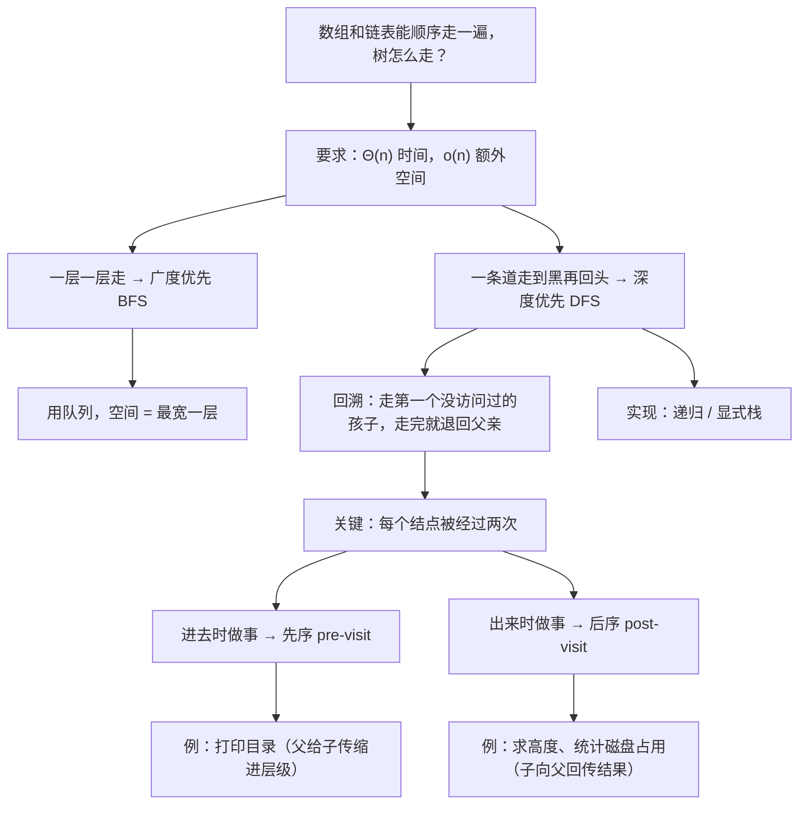
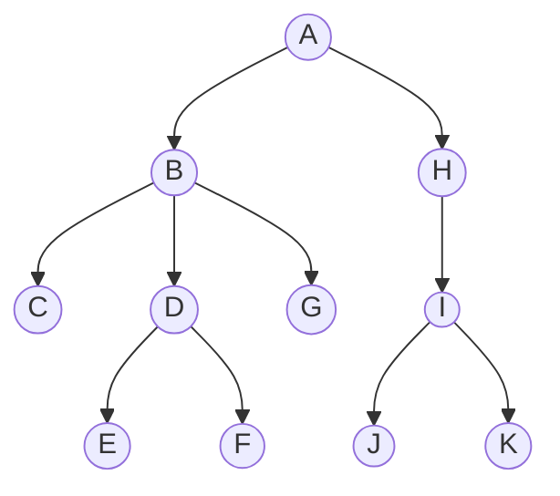
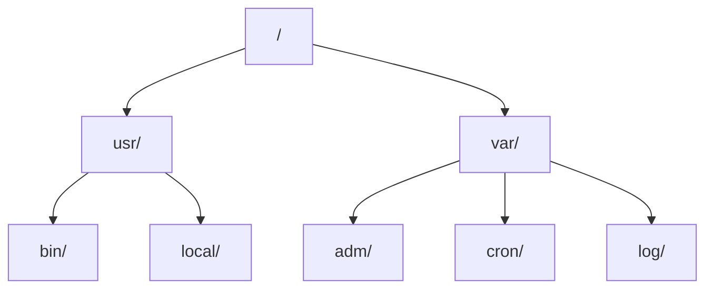

# C6.3 树的遍历

> [!abstract] 这一讲的任务
> 树建好了，可它到现在还是死的——你没有办法把里面的东西一个不漏地过一遍。数组和链表可以从头走到尾，[[C5.1 双端队列 Deque]] 还专门给它们造了迭代器；**树该怎么走？**
> 这一讲给出两条路：**一层一层地走**（广度优先，用队列，已在 [[C4.1 队列 Queue]] 里见过），和**一条道走到黑再回头**（深度优先，用递归或栈）。
> 但真正的重点在后半段：深度优先走一遍的时候，**每个结点其实被经过两次**——进去时一次、出来时一次。**在哪一次做事情，决定了你能解决哪类问题。**这是本讲最值钱的一句话，也是后面 BST、AVL、表达式树全部算法的骨架。

> [!info] 怎么读这份讲义
> 第二节（BFS）是旧知识回顾，读得快一点没关系。
> **第三、四节是核心**：回溯的定义、“每个结点访问两次”、以及先序/后序两个位置。
> 第五节的四条设计准则（课件 p.63）看起来抽象，但第六节用三个例子（求高度、打印目录、统计占用）把它一条条落到实处——**这三个例子是同一个模板的三种填法**，对着看最省力。
> 标题末尾写“（补充）”的小节是课件没有、由通行讲法补出的内容。

> [!info] 标注说明与授课进度
> 标有 **（拓展）** 或 **【拓展】** 的内容，是**课堂上没有讲到、由课件和教材延伸补充**的部分。
> **授课进度**：转写稿只到第四节课（停在第 3 章栈的扩容），树尚未开讲，本篇按整篇尚未授课理解。

> [!info] 课程信息与来源
> **Ya-Hui Jia（贾雅慧）｜SFT SCUT｜jiayahui@scut.edu.cn**。全课程信息见 [[C1.0 课程信息与C++预备]] 与 [[数据结构 MOC]]。
> 本篇覆盖 `tree_part1` 的 p.53–73，课件编号 4.3–4.3.4。**本篇末尾有作业**（p.73）。



## 目录与课件对应

| 阅读入口 | 课件页码 | 内容 |
| --- | --- | --- |
| [[#零、开场：怎么把一棵树“读”出来]]、[[#一、遍历要满足什么]] | 53–54 | 背景、与迭代器的对照、Θ(n) 时间与 o(n) 空间 |
| [[#二、广度优先：一层一层地走]] | 55–57 | BFS 定义、队列实现、代价 |
| [[#三、深度优先：一条道走到黑]] | 58–59 | 回溯算法、每个结点被访问两次 |
| [[#四、两种实现：递归与栈]] | 60–62 | 递归代码、标签输出、显式栈、空间都是 Θ(h) |
| [[#五、四条设计准则]] | 63 | 什么时候用 DFS、设计时要回答的四个问题 |
| [[#六、三个应用：同一个模板的三种填法]] | 64–72 | 求高度、打印目录层次、统计磁盘占用 |
| [[#七、先序与后序（补充）]] | — | 名字、与二叉树三种遍历的关系 |
| [[#八、本讲作业]] | 73 | LeetCode 559、589、590 |
| [[#九、课件勘误与阅读边界]]、[[#十、这一讲的三句话]] | 全篇 | 校正口径与复习 |

---

## 零、开场：怎么把一棵树“读”出来

假设你要统计一个项目文件夹占了多少磁盘空间。

你不能只看最外层——真正占地方的东西可能埋在 `node_modules/.cache/webpack/` 里面第七层。**你必须把每一个文件夹都走到。**

> [!question] 停一下，先自己想想
> 对数组你会写 `for (int i = 0; i < n; ++i)`，对链表你会写 `while (ptr != nullptr) ptr = ptr->next()`。**对一棵树，这个 `for` 循环该怎么写？**

写不出来。因为线性结构里“下一个”是唯一确定的，而树里“下一个”**有好几个候选**：往下走哪个孩子？走完这个孩子之后回到哪里？

**遍历 traversal 要解决的就是这件事：给“下一个”定一个规则，并保证每个结点不重不漏地被访问恰好一次。**

## 一、遍历要满足什么

课件 p.54：

> 存放在数组或链表中的所有对象都可以被**顺序访问**。
> 讨论双端队列时，我们引入了 C++ 的**迭代器**：它允许用户逐个走过容器中的所有对象。
> **问题：我们怎样才能以一种可预测且高效的方式遍历树中的所有对象？**
> - **要求：$\Theta(n)$ 的运行时间和 $\mathrm{o}(n)$ 的内存。**

> [!important] 注意那个小写的 $\mathrm{o}(n)$
> 这是**小 o**，不是大 O。按 [[C1.5 算法与渐进分析]] 的定义，$\mathrm{o}(n)$ 表示**严格低于线性**——也就是额外空间必须比 $n$ **更小一个数量级**，$\Theta(n)$ 是**不合格**的。
> 这条要求很硬：它直接排除了“把所有结点先抄进一个数组再遍历”这种偷懒做法。
> 后面会看到，两种遍历都做到了：DFS 的空间是 $\Theta(h)$（树高），BFS 的空间是最宽一层的结点数。**对一棵平衡的树，$h=\Theta(\lg n)$，远小于 $n$**；但对退化成链的树 $h=n$，这条要求其实是踩线的——课件没有细究这一点。

课件 p.55 给出两条路线：

> 我们已经见过一种遍历：
> - **广度优先遍历**在进入深度 $k+1$ 之前，先访问深度 $k$ 的所有结点；
> - **用队列很容易实现。**
>
> 另一种做法是**总是尽可能往深走，之后再访问其他兄弟**：**深度优先遍历 depth-first traversals**。

## 二、广度优先：一层一层地走

### 2.1 定义与代价（p.56）

> 广度优先遍历访问给定深度上的所有结点：
> - **可以用队列实现**；
> - **运行时间是 $\Theta(n)$**；
> - **内存可能很贵：某一深度上的最大结点数**；
> - **顺序：A B H C D G I E F J K**。

这里的示例树和 [[C4.1 队列 Queue]] 第八节那棵目录树**是同一棵**（A→B,H；B→C,D,G；D→E,F；H→I；I→J,K）：



**遍历结果 A B H C D G I E F J K 已独立复算，与课件一致**，也与 [[C4.1 队列 Queue]] 第 8.3 节那张逐步表格完全吻合。

### 2.2 实现（p.57）

> **实现之前已经讨论过：**
> - 创建一个队列，把根结点入队；
> - 只要队列非空：
>   - **把队首结点的所有孩子入队**；
>   - **把队首结点出队**。

> [!warning] 这两步的顺序与队列那一章写反了（勘误）
> [[C4.1 队列 Queue]] p.32 写的是**先 pop 再 push 孩子**，这里写的是**先 push 孩子再 pop**。
> **两种写法的遍历顺序完全一样**——因为孩子接在队尾，而 pop 取的是队首，互不干扰。但**先 push 后 pop 更容易写错**：你得先把队首结点的指针保存下来，否则 pop 之后就找不到它是谁、也就没法取它的孩子了。
> 稳妥的写法仍然是**先取出、再展开**：
> ```cpp
> while (!q.empty()) {
>     Node *n = q.front(); q.pop();     // 先取出
>     visit(n);
>     for (auto *c : n->children()) q.push(c);   // 再展开
> }
> ```

> [!important] 空间代价：队列里最多装多少
> 课件那句“某一深度上的最大结点数”说的是：**BFS 的峰值空间 = 树最宽那一层的结点数**。
> 对一棵完全二叉树，最后一层约有 $n/2$ 个结点——**BFS 的空间是 $\Theta(n)$，踩到了第一节那条 $\mathrm{o}(n)$ 的红线**。
> 这正是下一节 DFS 值得学的原因之一：**DFS 的空间只和树高有关，与宽度无关。**

## 三、深度优先：一条道走到黑

### 3.1 回溯算法（p.58）

课件先定义走法，再给它起名：

> 为了讨论深度优先遍历，我们先定义一个在树中行走的**回溯算法 backtracking algorithm**：
> - **在任一结点，前进到第一个尚未访问过的孩子**；
> - **或者，如果所有孩子都已访问过（叶结点是一种特殊情况），就回溯到父结点，并重复这个决策过程**。
>
> **当根的所有孩子都被访问过时，结束。**

课件 p.58 在 A–M 那棵树上画了一条红色的曲线，**像绳子一样绕着整棵树贴边走了一圈**。

> [!important] 这条“绕树一周”的曲线是理解 DFS 的最好方式
> 想象你沿着树的外缘走一圈，左手始终扶着墙。每根树枝你都会走两遍——**下去一遍，上来一遍**。
> 走完一圈回到起点，正好把每个结点都经过了。

### 3.2 每个结点被经过两次（p.59）

> 我们把这样一条路径定义为**深度优先遍历 depth-first traversal**。
> **注意在这种方案下，每个结点可能被访问两次：**
> - **第一次是这个结点被靠近时（在任何孩子之前）**；
> - **最后一次是它被靠近时（在所有孩子之后）**。

![[C6-深度优先-绕树一周.png]]

> [!important] **本讲最重要的一句话**
> 深度优先遍历给了你**两个做事的时机**：
> - **进去的时候**（还没碰任何孩子）——这时你知道的是**从根到这里的信息**（比如当前深度、路径上的祖先）；
> - **出来的时候**（所有孩子都处理完了）——这时你知道的是**整棵子树的信息**（比如子树有多大、多高、总共占多少空间）。
>
> **要往下传的东西，在进去时做；要往上收的东西，在出来时做。** 第六节的三个例子就是这句话的三次演示。

> [!question] 停一下，先自己想想
> 课件说“每个结点**可能**被访问两次”，为什么是“可能”而不是“一定”？还有，叶结点算被访问几次？

严格说，一个度为 $d$ 的结点在绕树一周时**总共被经过 $d+1$ 次**：进去一次，每从一个孩子回来一次（共 $d$ 次）。
但**有意义的时机只有两个**：第一次（进去）和最后一次（出来）。中间那些“从某个孩子回来、准备去下一个孩子”的时刻，课件没有单独命名。
叶结点 $d=0$，所以进去和出来是**同一时刻**——它只被经过一次，但**两个时机都在那一刻发生**。
（对二叉树来说，中间那一次也有名字，叫**中序 in-order**——见第七节。）

## 四、两种实现：递归与栈

### 4.1 递归实现（p.60）

> 深度优先遍历可以用**递归**实现：

```cpp
template <typename Type>
void Simple_tree<Type>::depth_first_traversal() const {
    // Perform pre-visit operations on the value
    std::cout << "<" << node_value << ">";

    // Perform a depth-first traversal on each of the children
    for ( auto *child = children.head(); child != children.end(); child = ptr->next() ) {
        child->depth_first_traversal();
    }

    // Perform post-visit operations on the value
    std::cout << "</" << node_value << ">";
}
```

**这就是整个 DFS 的骨架，只有三块**：

```
pre-visit（进去时做的事）
    for 每个孩子：递归
post-visit（出来时做的事）
```

课件把两个时机做成了**打开标签和关闭标签**，输出效果非常直观。

### 4.2 输出核对（p.61）

> **在这棵树上执行，输出会是：**

```
<A><B><C><D></D></C><E><F></F><G></G></E></B><H><I><J></J><K></K><L></L></I><M></M></H></A>
```

**已在示例树上逐结点独立复算，与课件完全一致。**核对方法：A 的孩子是 B、H；B 的是 C、E；C 的是 D；E 的是 F、G；H 的是 I、M；I 的是 J、K、L。

> [!important] 这段输出就是一份 XML
> 回头看 [[C6.1 树的概念与术语]] 第七节：**HTML 文档是一棵树**。现在反过来了——**一棵树做一次深度优先遍历，在 pre-visit 打开标签、post-visit 关闭标签，输出的就是这棵树对应的 XML 文档**。
> 两件事其实是一件事：**XML/HTML 的文本形式，正是树的深度优先遍历结果**。浏览器解析 HTML 建树、和这里遍历树输出 HTML，是互逆的两个过程。
> 顺带也解释了 [[C3.1 栈 Stack]] 为什么能用栈检查标签匹配——**因为 DFS 本身就是用栈实现的**（下一小节）。

### 4.3 用显式栈实现（p.62）

> 或者，我们可以用一个**栈**：
> - 创建一个栈，把根结点压入栈；
> - 只要栈非空：
>   - **弹出栈顶结点**；
>   - **把该结点的所有孩子按相反顺序压入栈顶**。
> - **运行时间是 $\Theta(n)$**；
> - **栈中的对象都是从根到当前结点路上尚未访问的兄弟**；
>   - **如果每个结点最多两个孩子，所需内存是 $\Theta(h)$：树的高度**。
>
> **在递归实现中，内存也是 $\Theta(h)$：递归只是把内存藏了起来。**

> [!question] 停一下，先自己想想
> 为什么孩子要**按相反顺序**压栈？

因为栈是 LIFO。要让**第一个孩子先被处理**，它就必须**最后被压入**（最靠近栈顶）。如果按正序压，弹出来的顺序会是最后一个孩子在前——遍历结果就镜像了。
对照 BFS 用队列时**不需要反序**（FIFO，先压先出），这个差别正是 [[C4.1 队列 Queue]] 8.2 节那句“**换个容器就换个算法**”的延续。

> [!important] “递归只是把内存藏了起来”——这句话值得抄下来
> 很多人以为递归不占内存，因为代码里看不见栈。但 [[C3.1 栈 Stack]] 第六节讲过：**每一层未返回的函数调用都在调用栈上占着一个栈帧**。
> DFS 递归到最深处时，调用栈上同时压着从根到当前结点的**整条路径**，也就是 $\Theta(h)$ 层。**和显式栈的空间完全一样，只是记账方式不同。**
> 实际后果是：对一棵退化成链的树（$h = n$），递归版 DFS 会**栈溢出 stack overflow**，而显式栈版只是多用一点堆内存。**这是工程上把递归改成迭代的主要理由。**

### 4.4 两种遍历的代价对照（补充）

| | 广度优先 BFS | 深度优先 DFS |
| --- | --- | --- |
| 用什么容器 | **队列** | **栈**（或递归的调用栈） |
| 时间 | $\Theta(n)$ | $\Theta(n)$ |
| 空间 | **最宽一层的结点数**（完全二叉树约 $n/2$） | **$\Theta(h)$**（树高） |
| 宽而浅的树 | 空间吃亏 | 空间划算 |
| 窄而深的树 | 空间划算 | 空间吃亏（还可能栈溢出） |
| 典型用途 | 层序输出、无权图最短路 | 求子树信息、表达式求值、回溯搜索 |

**没有哪个绝对更好**，这一点和 [[C4.1 队列 Queue]] 8.4 节的结论一致。

## 五、四条设计准则

课件 p.63 给出**什么时候该用 DFS**：

> 深度优先遍历在下列情况下使用：
> - **父结点需要关于它所有孩子或后代的信息**，或者
> - **孩子需要关于它的父结点或祖先的信息**。

> [!important] 这两条正好对应 3.2 节那两个时机
> - **孩子需要祖先的信息** → 信息**从上往下传** → 在 **pre-visit** 时把信息作为参数传给递归调用；
> - **父结点需要后代的信息** → 信息**从下往上收** → 在 **post-visit** 时合并各个孩子的**返回值**。
>
> 一句话：**向下传参数，向上传返回值。**

然后给出设计一个 DFS 时必须回答的四个问题：

> 在设计深度优先遍历时，需要考虑：
> 1. **在遍历孩子之前**，必须执行哪些初始化、操作和计算？
> 2. 在递归遍历孩子时：
>    - a) **在递归调用时必须向孩子传递什么信息？**
>    - b) **孩子必须传回什么信息，这些信息该如何汇总？**
> 3. **一旦所有孩子都被遍历完**，哪些操作和计算依赖于递归遍历中汇总的信息？
> 4. **必须向父结点传回什么信息？**

> [!important] 把这四问和代码骨架对齐
> ```cpp
> 返回类型 dfs( 参数 ) {          // ← 问 2a：父亲传下来什么
>     // 【问 1】pre-visit：孩子之前要做的事
>
>     for ( 每个孩子 c ) {
>         auto r = c->dfs( 传给孩子的参数 );   // ← 问 2a
>         // 【问 2b】把 r 汇总进来
>     }
>
>     // 【问 3】post-visit：依赖汇总结果的操作
>     return 给父亲的结果;                     // ← 问 4
> }
> ```
> **这个模板是本讲的全部内容。**下面三个应用就是把四个空填上三遍。

## 六、三个应用：同一个模板的三种填法⭐

课件 p.64 列出三个例子，主题都是**目录结构**：

> 树的应用：显示目录结构及其中文件的信息
> - **求树的高度**；
> - **打印层次结构**；
> - **确定内存占用**。

### 6.1 求高度：只往上收（p.65）

> `int height() const` 函数本质上是递归的：
> 1. **在遍历孩子之前**，我们假设该结点没有孩子，把高度置零：$h_{current} = 0$；
> 2. **在递归遍历孩子时**，每个孩子返回它的高度 $h$，如果 $1 + h > h_{current}$ 就更新；
> 3. **一旦所有孩子都被遍历完**，返回 $h_{current}$。
>
> **当根返回一个值时，那就是树的高度。**

这就是 [[C6.2 抽象树与通用实现]] 4.2 节那个 `height()` 函数，现在用四问的语言重讲了一遍：

| 四问 | 本例的答案 |
| --- | --- |
| 1. 孩子之前做什么 | `tree_height = 0` |
| 2a. 传给孩子什么 | **什么都不传** |
| 2b. 孩子传回什么、怎么汇总 | 传回子树高度 $h$，用 `max(tree_height, 1+h)` 汇总 |
| 3. 孩子之后做什么 | 无 |
| 4. 传给父亲什么 | `tree_height` |

**纯粹的“往上收”**，2a 那一栏是空的。

### 6.2 打印目录层次：只往下传（p.66–68）

课件 p.66 给出目标：把左边的目录树，打印成右边那种缩进格式。



目标输出：

```
/
    usr/
        bin/
        local/
    var/
        adm/
        cron/
        log/
```

p.67 用四问给出设计：

> 对一个目录，我们把根的**制表层级 tab level 初始化为 0**。
> 然后我们做：
> 1. **在遍历孩子之前**，我们必须：
>    - a) **缩进适当数量的制表符**，并且
>    - b) **打印目录名，后面跟一个 `/`**；
> 2. 在递归遍历孩子时：
>    - a) **必须把当前制表层级加一传给孩子**，并且
>    - b) **不需要传回任何信息**；
> 3. **一旦所有孩子都被遍历完，我们就完成了。**

p.68 给出代码（假设 `void print_tabs( int n )` 打印 $n$ 个制表符）：

```cpp
template <typename Type>
void Simple_tree<Type>::print( int depth ) const {
    print_tabs( depth );
    std::cout << value()->directory_name() << '/' << std::endl;

    for ( auto *child = children.head(); child != children.end(); child = ptr->next() ) {
        child->print( depth + 1 );
    }
}
```

| 四问 | 本例的答案 |
| --- | --- |
| 1. 孩子之前做什么 | **缩进 + 打印目录名**（这就是 pre-visit） |
| 2a. 传给孩子什么 | **`depth + 1`** |
| 2b. 孩子传回什么 | **什么都不传**（返回类型是 `void`） |
| 3. 孩子之后做什么 | 无 |
| 4. 传给父亲什么 | 无 |

**和上一个例子正好相反**：这里 2b 和 4 是空的，全靠 2a 往下传。

> [!important] 为什么打印必须在 pre-visit
> 因为父目录要显示在子目录**上面**。如果把打印挪到 post-visit（所有孩子之后），输出会变成：
> ```
>         bin/
>         local/
>     usr/
>         ...
>     var/
> /
> ```
> **每个目录都出现在它内容的下面**，整个层次倒过来了。
> **做事的时机不是随便选的，它直接决定了输出的形状。**

### 6.3 统计磁盘占用：两头都要（p.69–72）

这是三个例子里最完整的一个，**pre、post 两个时机都用上了**。

课件 p.69 点出关键约束：

> 假设我们需要确定一个目录及其所有子目录的内存占用：
> - **我们必须先确定并打印所有子目录的占用，才能确定当前目录的占用。**

p.70 给出具体的树和期望输出。各目录自身占用：`/` 7 kB，`usr/` 4 kB，`bin/` 12 kB，`local/` 15 kB，`var/` 3 kB，`adm/` 6 kB，`cron/` 5 kB，`log/` 9 kB。

期望输出：

```
        bin/ 12
        local/ 15
    usr/ 31
        adm/ 6
        cron/ 5
        log/ 9
    var/ 23
/ 61
```

> [!example] 数值核对（已独立复算，与课件一致）
> - `usr/` = 自身 4 + bin 12 + local 15 = **31** ✓
> - `var/` = 自身 3 + adm 6 + cron 5 + log 9 = **23** ✓
> - `/` = 自身 7 + usr 31 + var 23 = **61** ✓
>
> 也可以横着验一遍：所有目录自身占用之和 = 7+4+12+15+3+6+5+9 = **61** ✓——**根的总占用必然等于全部结点自身占用之和**，这是个很好的自查手段。

p.71 给出设计：

> 1. **在遍历孩子之前**，我们必须：
>    - a) **把内存占用初始化为当前目录自身的占用**；
> 2. 在递归遍历孩子时：
>    - a) **把当前制表层级加一传给孩子**，并且
>    - b) **每个孩子会返回它的目录内部所用的内存，这必须加到当前的内存占用上**；
> 3. **一旦所有孩子都被遍历完**，我们必须：
>    - a) **打印适当数量的制表符**，
>    - b) **打印目录名后跟 `/ `**，并且
>    - c) **打印该目录及其后代所用的内存**。

p.72 给出代码：⭐

```cpp
template <typename Type>
int Simple_tree<Type>::du( int depth ) const {
    int usage = value()->memory_usage();

    for ( auto *child = children.head(); ptr != children.end(); ptr = ptr->next() ) {
        usage += ptr->du( depth + 1 );
    }

    print_tabs( depth );
    std::cout << value()->directory_name() << "/ " << usage << std::endl;

    return usage;
}
```

| 四问 | 本例的答案 |
| --- | --- |
| 1. 孩子之前做什么 | `usage = 自身占用` |
| 2a. 传给孩子什么 | **`depth + 1`**（往下传缩进） |
| 2b. 孩子传回什么、怎么汇总 | 传回子树总占用，**累加** |
| 3. 孩子之后做什么 | **打印缩进、目录名、总占用**（post-visit） |
| 4. 传给父亲什么 | `usage` |

> [!important] 停一下，我们刚才干了什么
> **同一个模板，填了三次，得到三个完全不同的程序**：
>
> | | 往下传（2a） | 往上收（2b/4） | 打印时机 |
> | --- | --- | --- | --- |
> | 求高度 | — | ✓ 取最大 | — |
> | 打印目录 | ✓ 缩进层级 | — | **pre-visit** |
> | 统计占用 | ✓ 缩进层级 | ✓ 求和 | **post-visit** |
>
> 第三个例子之所以必须在 post-visit 打印，就是 p.69 那句话：**总占用要等所有孩子都算完才知道**。而缩进层级又必须从上面传下来。**两个方向同时用上，这才是完整的 DFS。**
>
> 顺带注意输出的形状：这次是**子目录先打印、父目录后打印**，正好和 6.2 相反——因为打印挪到了 post-visit。**`du` 命令的真实输出就是这个顺序**，你在终端里跑 `du -h` 看到的就是它。

> [!note] 这个函数的名字 `du` 不是随便起的（补充）
> Unix 的 `du`（disk usage）命令干的就是这件事。课件把它照搬过来当函数名，是一个小彩蛋。

## 七、先序与后序（补充）

> [!note] 【拓展】课件在这一讲没有给这两个时机起正式名字
> 通行的叫法是：
> - 在 **pre-visit** 做事的遍历叫**先序遍历 pre-order traversal**（也叫前序）；
> - 在 **post-visit** 做事的遍历叫**后序遍历 post-order traversal**。
>
> 对**二叉树**还多出第三个时机：处理完左子树、还没处理右子树的那一刻，叫**中序遍历 in-order traversal**。通用树没有这个概念，因为孩子有好几个，“中间”在哪儿不唯一。
> 这三个名字在**下一讲**（[[C6.4 二叉树]]，课件 p.95–96）会正式出现，而且是**贯穿整章树的核心工具**：
> - **中序**遍历一棵 BST，得到的是**升序序列**（C6.6）；
> - **后序**遍历一棵表达式树，得到的是**逆波兰表达式**（C6.4，接 [[C3.1 栈 Stack]] 第七节）；
> - **先序**遍历用于序列化一棵树、复制一棵树。
>
> **记忆法：这个"序"字说的是根被访问的位置。** 先序 = 根在最前，中序 = 根在中间，后序 = 根在最后；左右子树的相对顺序永远是"先左后右"。

## 八、本讲作业

> [!todo] 作业 #5（树的遍历，课件 p.73 已列出）
> **LeetCode 559、589、590。**
> 课件未注明提交方式与截止日期，以群通知为准（第 1 章的作业是交到 QQ 群文件的指定子文件夹，文件名为学号）。

三道题**题意已按 LeetCode 原题核对**，而且**选得非常贴合本讲**——全部是 **N 叉树**（也就是本章的通用树，不是二叉树）：

### 8.1 LeetCode 559：N 叉树的最大深度（补充）

**题意**：给一棵 N 叉树，返回它的最大深度（**根到最远叶子的结点数**）。

**这就是 6.1 节那个 `height()`**，只差一个换算：题目的“深度”数的是**结点数**，本课件的 `height()` 数的是**边数**，所以 **答案 = height + 1**（这正是 [[C6.1 树的概念与术语]] 第六节那个口径差异，**第一次在做题时踩到**）。

```cpp
int maxDepth(Node* root) {
    if (root == nullptr) return 0;          // 空树 0，对应 height = -1
    int best = 0;
    for (Node* c : root->children) best = max(best, maxDepth(c));
    return best + 1;
}
```

四问填法：只往上收，取最大——**和 6.1 一模一样**。复杂度 $\Theta(n)$。

### 8.2 LeetCode 589：N 叉树的先序遍历（补充）

**题意**：返回 N 叉树的先序遍历结果。

**就是本讲 4.1 节的 pre-visit**：

```cpp
void dfs(Node* n, vector<int>& out) {
    if (n == nullptr) return;
    out.push_back(n->val);                  // pre-visit
    for (Node* c : n->children) dfs(c, out);
}
```

题目通常会追问**能不能用迭代（非递归）做**——那就是本讲 4.3 节的**显式栈**版本，**注意孩子要反序压栈**：

```cpp
vector<int> preorder(Node* root) {
    vector<int> out;
    if (!root) return out;
    stack<Node*> s; s.push(root);
    while (!s.empty()) {
        Node* n = s.top(); s.pop();
        out.push_back(n->val);
        for (auto it = n->children.rbegin(); it != n->children.rend(); ++it)
            s.push(*it);                    // 反序压栈
    }
    return out;
}
```

`rbegin()/rend()` 正是 [[C5.1 双端队列 Deque]] 第八节的反向迭代器——**这两讲在这里接上了**。

### 8.3 LeetCode 590：N 叉树的后序遍历（补充）

**题意**：返回 N 叉树的后序遍历结果。

递归版把 `push_back` 挪到循环**之后**即可（本讲的 post-visit）。

迭代版有个漂亮的技巧：**按“根→反序孩子”做一次先序，最后把结果整个反转**，就得到后序：

```cpp
vector<int> postorder(Node* root) {
    vector<int> out;
    if (!root) return out;
    stack<Node*> s; s.push(root);
    while (!s.empty()) {
        Node* n = s.top(); s.pop();
        out.push_back(n->val);
        for (Node* c : n->children) s.push(c);   // 这次是正序压栈
    }
    reverse(out.begin(), out.end());
    return out;
}
```

> [!question] 课堂追问
> 为什么“正序压栈 + 最后反转”就等于后序？

正序压栈得到的访问序列是「根 → 最后一个孩子的子树 → … → 第一个孩子的子树」，把它整个反转，就变成「第一个孩子的子树 → … → 最后一个孩子的子树 → 根」——**根跑到了最后，孩子恢复了正序**，正是后序的定义。
**建议做题时手动在三个结点的小树上验一遍**，比背下来可靠。

## 九、课件勘误与阅读边界

| 位置 | 课件写的 | 实际情况 |
| --- | --- | --- |
| p.57 | BFS 步骤写成「先 push 孩子，再 pop 队首」 | 遍历顺序不受影响，但与 [[C4.1 队列 Queue]] p.32 的「先 pop 再 push」写反了。**先 pop 再展开更不容易出错**，见 2.2 节 |
| p.55 | “Another approach is to visit always go as deep as possible” | 语法有误（`visit always go`），意为“总是尽可能往深走”。纯打字问题 |
| p.60 / p.68 / p.72 | `for ( auto *child = children.head(); child != children.end(); child = ptr->next() )` | **循环变量混用**：初始化用 `child`，递增却写 `ptr`；p.72 更是整行都用 `ptr` 而初始化用 `child`。**照抄编译不过**。另外 `head()` 配 `end()` 也是两套词汇混用（同 [[C6.2 抽象树与通用实现]] 第六节） |
| p.61 | “the ouput would be” | 应为 `output`。纯打字遗漏 |
| p.71 | 页眉编号写的是 4.3.4.2 | 本页讲的是内存占用，应属 **4.3.4.3**（与 p.69、p.70 同节）。编号复制错位 |
| p.72 | 页眉标题写的是 “Printing a Hierarchy” | 本页是 `du` 函数，应为 “Determining Memory Usage”。标题复制错位 |
| p.54 | $\mathrm{o}(n)$ 内存的要求 | BFS 的峰值空间是最宽一层，对完全二叉树约 $n/2 = \Theta(n)$，**严格说不满足 $\mathrm{o}(n)$**。课件没有讨论这个矛盾 |

**阅读边界**：

- 本篇覆盖 `pdfs/tree_part1.pptx` 的 **p.53–73**，课件编号 **4.3–4.3.4**；**21 页全部读过，未跳页**。
- **未发现课堂手写批注**。
- p.65 那张标了 6、5、2 等数字的树图用于演示高度的递归计算，图中数字为各子树高度示意，本篇用文字说明其原理，未做裁切。
- 「绕树一周」那张图是**本篇自绘**（python），课件 p.58/59/61 的红色曲线是同一个意思，自绘版额外标出了每个结点的 pre/post 两个时机。

## 十、这一讲的三句话

1. **树的遍历只有两条路**：一层一层走（BFS，用队列，空间 = 最宽一层）和一条道走到黑（DFS，用栈或递归，空间 = 树高）。**换容器就换算法**，这句话第三次出现了。
2. **深度优先时每个结点有两个做事的时机**：进去时（pre-visit，知道从根到这里的信息）和出来时（post-visit，知道整棵子树的信息）。**向下传参数，向上传返回值。**
3. **四问模板填三遍就是三个程序**：求高度只往上收；打印目录只往下传、在 pre-visit 打印；统计磁盘占用两头都要、在 post-visit 打印。**时机选错，输出的形状就整个反过来。**

### 遍历速查

| | BFS | DFS |
| --- | --- | --- |
| 容器 | 队列（孩子正序入队） | 栈（孩子**反序**入栈）或递归 |
| 时间 | $\Theta(n)$ | $\Theta(n)$ |
| 空间 | 最宽一层的结点数 | $\Theta(h)$ |
| 危险 | 宽树时内存爆炸 | 深树时**栈溢出** |
| 本例结果 | `A B H C D G I E F J K` | `<A><B><C><D></D></C>…</A>` |

### DFS 四问模板

```cpp
返回类型 dfs( 从父亲传来的参数 ) {
    // 1. pre-visit：初始化；需要祖先信息的事在这里做
    for ( 每个孩子 c ) {
        auto r = c->dfs( 加工后的参数 );   // 2a 向下传
        // 2b 汇总 r（求和 / 取最大 / 计数 …）
    }
    // 3. post-visit：依赖全部子树结果的事在这里做
    return 结果;                            // 4 向上传
}
```

### 三个应用的核对值

| 项目 | 结果 |
| --- | --- |
| BFS 遍历序 | `A B H C D G I E F J K` |
| DFS 标签输出 | `<A><B><C><D></D></C><E><F></F><G></G></E></B><H><I><J></J><K></K><L></L></I><M></M></H></A>` |
| `usr/` 总占用 | 4 + 12 + 15 = **31** |
| `var/` 总占用 | 3 + 6 + 5 + 9 = **23** |
| `/` 总占用 | 7 + 31 + 23 = **61**（= 全部自身占用之和） |

**下一讲预告**：[[C6.2 抽象树与通用实现]] 的账还没还——`child(n)` 仍然是 $\Theta(n)$。既然“任意多个孩子”是一切麻烦的根源，那就**只允许两个**：左孩子和右孩子。两个指针写得下，随机访问回到 $\Theta(1)$，而且孩子有了**左右之分**，通用树里"没有自然次序"的问题也一并解决了。更妙的是，本讲的三个时机在二叉树上正好有三个名字——先序、中序、后序。见 [[C6.4 二叉树]]。

---

上一篇：[[C6.2 抽象树与通用实现]] ｜ 前置：[[C4.1 队列 Queue]]、[[C3.1 栈 Stack]] ｜ 下一篇：[[C6.4 二叉树]] ｜ 返回：[[数据结构 MOC]]
