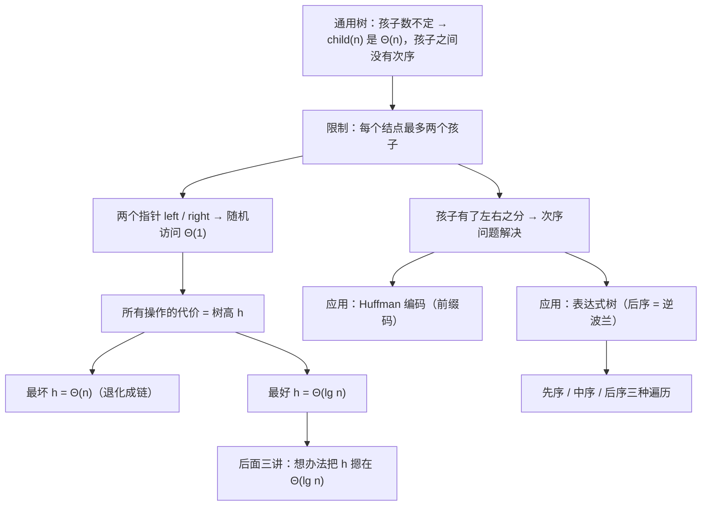
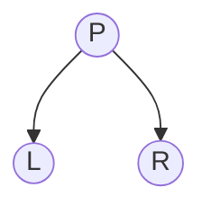
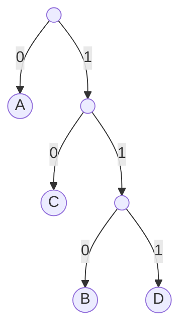
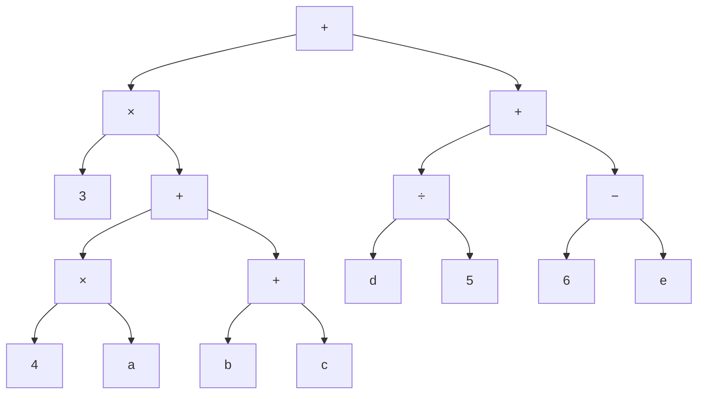

# C6.4 二叉树

> [!abstract] 这一讲的任务
> [[C6.2 抽象树与通用实现]] 留下一笔账：孩子存在链表里，取第 $n$ 个要 $\Theta(n)$。这一讲用一招把账还了——**规定每个结点最多两个孩子**。两个指针写得下，随机访问回到 $\Theta(1)$；而且孩子从此有了**左右之分**，通用树里“结点和孩子之间没有自然次序”的毛病也一并解决。
> 更重要的是，限制之后**二叉树的形状和性能直接挂钩**：所有操作的代价都取决于**树高**，而树高在最好和最坏之间差了整整一个数量级（$\Theta(\lg n)$ 对 $\Theta(n)$）。**后面 BST、AVL、红黑树整整三讲，干的都是同一件事：把树高摁在 $\Theta(\lg n)$。**
> 这一讲的后半段给两个漂亮的应用：**Huffman 编码**（压缩）和**表达式树**（编译），并正式给出**先序、中序、后序**三种遍历。

> [!info] 怎么读这份讲义
> 第二、三节是定义和形态，要点是**“空子树也算一个孩子”这个口径**（第 2.3 节，和 [[C6.1 树的概念与术语]] 的度冲突，必须看）。
> **第五节（运行时间）是全章的纲**：它预告了后面三讲要解决的问题。
> 第六、七节的两个应用可以当作独立的小专题读；**Huffman 是考试高频**，表达式树则把 [[C3.1 栈 Stack]] 的逆波兰表达式接了回来。
> 第八节的三种遍历篇幅不长，但**是后面每一讲都要用的工具**。

> [!info] 标注说明与授课进度
> 标有 **（拓展）** 或 **【拓展】** 的内容，是**课堂上没有讲到、由课件和教材延伸补充**的部分。
> **授课进度**：转写稿只到第四节课（停在第 3 章栈的扩容），树尚未开讲，本篇按整篇尚未授课理解。

> [!info] 课程信息与来源
> **Ya-Hui Jia（贾雅慧）｜SFT SCUT｜jiayahui@scut.edu.cn**。全课程信息见 [[C1.0 课程信息与C++预备]] 与 [[数据结构 MOC]]。
> 本篇覆盖 `tree_part1` 的 p.74–97，课件编号 5.1–5.1.4。**本篇末尾有作业**（p.97，分必做与选做）。



## 目录与课件对应

| 阅读入口 | 课件页码 | 内容 |
| --- | --- | --- |
| [[#零、开场：把账还了]]、[[#一、为什么值得限制成两个]] | 74–76 | 提纲、现实中的二叉结构、通用树的毛病 |
| [[#二、定义：左子树与右子树]] | 77–79 | 定义、左右子树、五结点的各种形态、$\lg n$ 与底数无关 |
| [[#三、四个形态术语]] | 80–82 | 满结点、空结点/空子树、满二叉树 |
| [[#四、结点类]] | 83–84 | `BinaryNode`、为什么没有统一的 BinaryTree 类 |
| [[#五、运行时间：全章的纲]] | 85–86 | 代价取决于高度、三种高度、对数有多小 |
| [[#六、应用一：Huffman 编码]] | 87–90 | 前缀码、为什么等长码浪费、构造过程、WPL |
| [[#七、应用二：表达式树]] | 91–94 | 运算符在内部、后序 = 逆波兰、人用中缀机器用后缀 |
| [[#八、三种遍历]] | 95–96 | 先序、中序、后序的定义与代码 |
| [[#九、本讲作业]] | 97 | LeetCode 94、100（必做）；101、144、145（选做） |
| [[#十、课件勘误与阅读边界]]、[[#十一、这一讲的三句话]] | 全篇 | 校正口径与复习 |

---

## 零、开场：把账还了

回到 [[C6.2 抽象树与通用实现]] 最后那笔账：

```cpp
Single_list<Simple_tree *> children;   // 孩子存在链表里
Simple_tree *child( int n );           // 要走 n 步，Θ(n)
```

麻烦全都来自“孩子个数不定”。

> [!question] 停一下，先自己想想
> 如果规定**每个结点最多只有两个孩子**，那个类会变成什么样？

```cpp
Type element;
BinaryNode *left;      // 就这两个
BinaryNode *right;
```

链表没了，`size()`、`node_count`、`push_back` 全都没了。取任何一个孩子都是**一次解引用**——$\Theta(1)$。

**代价是什么？**看起来我们失去了表达三个孩子的能力。但 [[C6.2 抽象树与通用实现]] 5.2 节已经给过答案：**长子兄弟表示法能把任何一棵树唯一地转成二叉树**。所以这个限制**没有真的丢掉表达能力**，只是换了一种摆放方式。

于是这笔买卖成了：**几乎白得的 $\Theta(1)$ 随机访问**。

## 一、为什么值得限制成两个

### 1.1 现实中本来就有很多二叉结构（p.76）

课件先铺垫（p.75 用了一张果园的照片配 0/1 数字，写着“This is not a binary tree”——**纯玩笑，无知识点**），然后给出理由：

> **通用树里任意数量的孩子往往是不必要的——很多现实中的树本来就限制为两个分支：**
> - **用二元运算符的表达式树**（第七节）；
> - **一个个体的祖先树：父母、祖父母等**（每人恰好两个生物学父母）；
> - **系统发生树**（[[C6.1 树的概念与术语]] 2.2 节，度为 2 或 0）；
> - **无损编码算法**（第六节的 Huffman）。
>
> **通用树也存在一些问题：**
> - **结点和它的孩子之间没有自然的次序。**

> [!important] 最后那一条才是关键
> 前四条只是说“二叉够用”，最后一条说的是“**二叉更好**”：通用树的孩子躺在一个链表里，谁在前谁在后完全取决于你插入的顺序，**没有任何语义**。
> 而二叉树的两个孩子有**名字**：`left` 和 `right`。一旦有了名字，就可以往上面挂规则：
> - 「左边的都比我小，右边的都比我大」→ **二叉搜索树**（C6.6）；
> - 「左边走 0，右边走 1」→ **Huffman 编码**（第六节）；
> - 「左边是被减数，右边是减数」→ **表达式树**（第七节）。
>
> **限制不是损失，是给结构赋予意义的前提。**这一点和 [[C1.2 抽象数据类型与容器操作]] 那条“减少操作换取性能”一脉相承，只是这次换来的是**语义**。

## 二、定义：左子树与右子树

### 2.1 定义（p.77）

> **二叉树是这样一种限制：每个结点恰好有两个孩子：**
> - **每个孩子要么为空，要么是另一棵二叉树**；
> - **这个限制让我们可以把两个孩子标记为左子树和右子树**。
>
> 在这里，回忆一下 $\lg(n) = \Theta(\log_b(n))$ 对任意 $b$ 成立。



> [!warning] **“恰好两个孩子”与 [[C6.1 树的概念与术语]] 的度不是一个口径**（重要）
> C6.1 说“度 = 孩子数”，叶结点的度是 **0**。而这里说每个结点“**恰好**两个孩子”，只不过孩子**可以是空的**。
> 两种说法并不矛盾，只是**数的东西不同**：
> - **按 C6.1 的度数**：叶结点度为 0，只有左孩子的结点度为 1；
> - **按本页的说法**：每个结点都有两个“位置”，只是位置上可能放着空树。
>
> **做题时看题目问的是哪个。**问“度为 2 的结点有几个”，数的是**非空孩子**；说“二叉树每个结点有两个子树”，指的是**两个位置**。
> 把空子树当成真实存在的东西，在 2.3 节的“空结点”和 C6.6 的 BST 插入里非常好用——**新结点插在哪里？插在某个空子树的位置上。**

> [!note] 那句关于对数的提醒是什么意思（补充）
> $\lg n$（以 2 为底）和 $\ln n$（以 e 为底）、$\log_{10} n$ 只差一个**常数倍**：$\log_b n = \lg n / \lg b$。按 [[C1.5 算法与渐进分析]]，常数倍在 $\Theta$ 里被吃掉了，所以**渐进分析里写哪个底都一样**。
> 课件在这里特意提一句，是因为接下来讲二叉树高度会频繁出现 $\lg n$——**别纠结底数**。

### 2.2 左右子树（p.78）

> 我们也把这两棵子树称作：
> - **左子树 left-hand sub-tree**，以及
> - **右子树 right-hand sub-tree**。

课件用一红一蓝两个大圈把根的两棵子树整个圈了出来，强调它们**各自又是一棵完整的二叉树**——又是那条递归定义（[[C6.1 树的概念与术语]] 5.2 节）。

### 2.3 五个结点能摆出多少种（p.79）

课件展示了**六种**五结点二叉树的形态（根都标成红色）。这一页想说的是：**结点数一样，形状可以差很多**——有的矮胖，有的瘦长成一条链。

> [!note] 【拓展】五个结点到底有多少种二叉树？
> 答案是 **42** 种，由**卡特兰数 Catalan number** 给出：
> $$C_n = \frac{1}{n+1}\binom{2n}{n}$$
> $C_0=1, C_1=1, C_2=2, C_3=5, C_4=14, C_5=42$。
> 课件只画了 6 种作为示意。**卡特兰数是国内考研常考点**（“$n$ 个结点能构成多少棵不同的二叉树”），而且它和 [[C3.1 栈 Stack]] 里的括号匹配是同一个数列——$n$ 对括号的合法排列数也是 $C_n$。**这不是巧合**：一棵二叉树的先序遍历配上空子树标记，就是一个合法的括号序列。

## 三、四个形态术语

这三页给出三个后面反复要用的词。

### 3.1 满结点（p.80）

> **满结点 full node 是左右子树都非空的结点。**

课件用一张大树做图例：**黑色 = 满结点，蓝色 = 两者都不是，绿色 = 叶结点**。

于是二叉树的结点按非空孩子数分成三类：

| 非空孩子数 | 名称 | 课件图中的颜色 |
| --- | --- | --- |
| 2 | **满结点 full node** | 黑 |
| 1 | （没有专名，课件写 neither） | 蓝 |
| 0 | **叶结点 leaf node** | 绿 |

### 3.2 空结点 / 空子树（p.81）

> **空结点 empty node 或空子树 null sub-tree，是任何可以挂上一个新叶结点的位置。**

课件把同一棵树的所有空位用**虚线小圈**画了出来。

> [!important] 这个定义的说法很妙：**空结点是“位置”，不是“东西”**
> 它和 [[C5.1 双端队列 Deque]] 里 `end()` 的思路完全一样——**指的是一个位置，不是一个值**。
> 为什么要给空位起名字？因为后面**所有的插入操作都发生在空子树的位置上**：
> - BST 插入一个新值，就是沿着比较一路走到某个空子树，把新叶子放进去（C6.6）；
> - 红黑树把空子树画成黑色的 NIL 结点，用它来数“黑高”（C6.8）。
>
> **把空位当成真实存在的东西，很多定理才好表述。**

> [!note] 数一数空子树有多少个（补充）
> $n$ 个结点的二叉树，一共有 $n+1$ 个空子树位置。
> 一行证明：每个结点提供 2 个孩子位置，共 $2n$ 个；其中 $n-1$ 个被非根结点占了（每个非根结点占一个位置）；剩下 $2n-(n-1) = n+1$ 个是空的。
> **这条性质在红黑树里会直接用到**，也是国内教材的常见填空题。

### 3.3 满二叉树（p.82）

> **满二叉树 full binary tree 是每个结点都满足下列之一的树：**
> - **是一个满结点**，或者
> - **是一个叶结点**。
>
> **它们的应用有：**
> - **表达式树**（第七节）；
> - **Huffman 编码**（第六节）。

也就是：**没有任何结点只有一个孩子**。

> [!warning] 【拓展】**“满二叉树”这个中文词是一个翻译陷阱**（考试重灾区）
> | 英文 | 定义 | 常见中译 |
> | --- | --- | --- |
> | **full binary tree** | 每个结点要么 0 个孩子，要么 2 个孩子 | 本课件所指；国内常译作**正则二叉树 / 严格二叉树** |
> | **perfect binary tree** | 所有叶子在同一层，内部结点全满 | **国内教材的“满二叉树”**（下一讲 C6.5） |
> | **complete binary tree** | 除最后一层外都填满，最后一层从左往右连续 | **完全二叉树**（下一讲 C6.5） |
>
> **国内教材说的“满二叉树”，对应的是英文的 perfect binary tree，不是这一页的 full binary tree。**
> 一句话区分：**本页的 full 只管“不许只有一个孩子”，不管形状整不整齐；国内的“满”要求整整齐齐一层不缺。**
> 这个坑和 [[C6.1 树的概念与术语]] 第六节的高度口径并列，是这一章最容易丢分的两个地方。做题时先确认题目用的是哪套。

为什么表达式树和 Huffman 树都是满二叉树？因为：

- **表达式树**：内部结点是**二元**运算符，必然有两个操作数（p.92 会说到这一点）；
- **Huffman 树**：构造时永远是**两两合并**，不会产生只有一个孩子的结点。

## 四、结点类

### 4.1 BinaryNode（p.83）

```cpp
template < typename Comparable>
struct BinaryNode
{
    Comparable element;
    BinaryNode* left;
    BinaryNode* right;
    BinaryNode(const Comparable& theElement, BinaryNode* lt, BinaryNode* rt)
          : element( theElement ), left( lt ), right( rt ) { }
};
```

和 [[C6.2 抽象树与通用实现]] 的 `Simple_tree` 对照，**少了两样东西**：

| | `Simple_tree` | `BinaryNode` |
| --- | --- | --- |
| 孩子 | `Single_list<Simple_tree*> children` | **`left` 和 `right` 两个裸指针** |
| 父指针 | 有 `parent_node` | **没有** |
| 取第 $n$ 个孩子 | $\Theta(n)$ | **$\Theta(1)$** |

> [!note] 两个细节（补充）
> 1. **模板参数叫 `Comparable` 而不是 `Type`**——这是在预告：这个结点将来是给**二叉搜索树**用的，元素必须能比大小（C6.6）。命名本身就是一种文档。
> 2. **没有父指针**。通用树需要它是为了 `detach()`（把自己从父亲的孩子链表里删掉）。二叉树的操作几乎都是**从根往下**递归的，递归调用的栈天然保存了来路，所以大多数实现省掉了父指针。**需要往上走的时候（比如 AVL 的旋转后回溯、BST 求前驱后继），要么加父指针，要么靠递归返回。**

### 4.2 为什么没有统一的 BinaryTree 类（p.84）

> **由于没有定义任何具体的操作，二叉树类并没有一个通用的定义。**
> **对不同的应用，二叉树可以用不同的方式构建。**

> [!important] 这一页回答了 [[C6.2 抽象树与通用实现]] 5.2 节那句红字
> 当时课件问“I can see the node, but where is the tree?”。这里给出了答案：**二叉树本身不是一个 ADT，它是一种"形状"。**
>
> 想想我们已经见过的：
>
> | 用途 | 结点里存什么 | 规则 |
> | --- | --- | --- |
> | 表达式树 | 运算符或操作数 | 内部是运算符，叶子是操作数 |
> | Huffman 树 | 字符与权重 | 左 0 右 1，叶子才是字符 |
> | 二叉搜索树 | 可比较的值 | 左 < 根 < 右 |
> | 堆 | 可比较的值 | 父 ≤ 子（或 ≥） |
>
> **形状一样，规则完全不同，操作也完全不同**——所以没法定义一个统一的 `BinaryTree` 类。这正是 [[C1.2 抽象数据类型与容器操作]] 的核心：**ADT 由操作定义，不由存储方式定义。**

## 五、运行时间：全章的纲

### 5.1 代价取决于高度（p.85）

> 回忆一下，对链表和数组，某些操作要 $\Theta(n)$ 时间。
> **我们将会看到，二叉树上各种操作的运行时间取决于树的高度。**
> 我们会看到：
> - **最坏显然是 $\Theta(n)$**；
> - **在平均情况下，高度是 $\Theta(\sqrt{n})$**；
> - **最好情况是 $\Theta(\ln n)$**。

> [!important] **这三行是整章树的路线图**
> - **最坏 $\Theta(n)$**：树退化成一条链（每个结点只有一个孩子）——**这时二叉树就是一个链表**，一点好处都没有；
> - **最好 $\Theta(\lg n)$**：树尽可能矮胖；
> - 中间那个 $\Theta(\sqrt n)$ 是平均。
>
> **后面三讲（BST → 平衡的定义 → AVL / 红黑树）全部是在对付这件事**：怎样保证树**永远**不退化，把高度钉死在 $\Theta(\lg n)$。

> [!warning] 【拓展】那个 $\Theta(\sqrt n)$ 有前提，而且不是你最常遇到的那个
> $\Theta(\sqrt n)$ 是在**“所有形状等概率”**的模型下算出来的——也就是从全部 $C_n$ 棵（卡特兰数那么多）二叉树里等概率挑一棵。
> 但实际中更常见的是另一个模型：**按随机顺序把 $n$ 个值插进一棵 BST**。在那个模型下，平均高度是 $\Theta(\lg n)$（准确说约 $4.311\lg n$），**不是 $\Theta(\sqrt n)$**。
> 两个模型给出不同答案，是因为**随机插入更容易产生矮胖的树**（很多不同的插入顺序会得到同一棵矮树，而细长的树只有极少数顺序能生成）。
> 课件没有区分这两个模型。**记结论时把前提一起记**：说平均高度前先问一句“随机的是形状还是插入顺序”。
>
> **补充（课件后文自己的口径）**：`tree_part2` p.71 明确写的是——随机插入生成的 BST 平均高度是 $\Theta(\ln n)$；而**经过反复的随机插入与删除之后**，平均高度会涨到约 $\Theta(\sqrt n)$（删除时总用右子树最小值顶替，这个不对称的习惯会让树慢慢变歪，属于经验性结论）。所以课件这里的 $\sqrt n$，按它后文的解释，更接近“插入 + 删除长期混合”的情形。见 [[C6.7 平衡与AVL树]] 1.1 节。

### 5.2 对数有多小（p.86）

> **如果我们能做到并维持 $\Theta(\lg n)$ 的高度，那么许多操作都可以在 $\Theta(\lg n)$ 内完成。**
> **对数时间并不比常数时间差多少：**

| | 值 | 对应量级 |
| --- | --- | --- |
| $\lg(1\,000)$ | $\approx 10$ | kB |
| $\lg(1\,000\,000)$ | $\approx 20$ | MB |
| $\lg(1\,000\,000\,000)$ | $\approx 30$ | GB |
| $\lg(1\,000\,000\,000\,000)$ | $\approx 40$ | TB |
| $\lg(1000^n)$ | $\approx 10n$ | |

> [!important] 把这张表读出感觉来
> **十亿个数据，只要 30 次比较就能定位。** 对照 [[C1.5 算法与渐进分析]] 里线性查找要十亿次——**这就是为什么整章都在追求 $\Theta(\lg n)$**。
> 同一张表在 [[C1.6 代码复杂度的计算方法]] 讲二分查找时出现过一次，现在它以树高的形式回来了。**二分查找的每一次"砍一半"，对应的正是在一棵平衡二叉树里往下走一层。**
>
> 顺带记一个换算：$\lg 1000 \approx 10$，因为 $2^{10} = 1024 \approx 1000$。**这个近似值值得背下来**，估算的时候到处都能用。
> （课件在这一页右侧放了 xkcd #394 那张调侃 kB 单位混乱的漫画，**纯装饰**。）

## 六、应用一：Huffman 编码

### 6.1 问题：等长编码太浪费（p.87）

> 在计算机科学和信息论中，**Huffman 码是一种特殊的最优前缀码**，常用于**无损数据压缩**。这种编码由 David A. Huffman 在 MIT 读 Sc.D. 期间提出，发表于 1952 年的论文《A Method for the Construction of Minimum-Redundancy Codes》。

课件用字符串 **ABACCDA** 做例子，给出两张编码表：

| 等长编码 | | | 不等长编码 | |
| --- | --- | --- | --- | --- |
| A | `00` | | A | `0` |
| B | `01` | | B | `00` |
| C | `10` | | C | `1` |
| D | `11` | | D | `01` |

- 等长：ABACCDA → `00010010101100`，共 **14 位**；
- 不等长：ABACCDA → `000011010`，共 **9 位**。

**省了 5 位。**

> [!warning] 课件左边那串编码印错了（勘误）
> 课件 p.87 左下角印的是 `000110010101100`（**15 位**），但按 A=00、B=01、C=10、D=11 逐字符拼出来应当是：
> $$\underbrace{00}_{A}\ \underbrace{01}_{B}\ \underbrace{00}_{A}\ \underbrace{10}_{C}\ \underbrace{10}_{C}\ \underbrace{11}_{D}\ \underbrace{00}_{A} = \texttt{00010010101100}$$
> 共 **14 位**。**已用程序独立复算确认。**
> 而且课件那串是 15 位——**奇数位长度的等长 2 位编码根本不可能**，这本身就能看出是排版错误。右边那串 `000011010`（9 位）是**正确**的。

### 6.2 撞墙：省下来的位数是有代价的（p.88）

> [!question] 停一下，先自己想想
> 不等长编码看起来白赚 5 位。那为什么不把每个字符都编得更短一点，比如 A=`0`、B=`1`、C=`0`、D=`1`？

课件用一个反例点破了这件事。拿右边那张表去解码 `0000`：

- `0 0 0 0` → **AAAA**
- `0 00 0` → **ABA**
- `00 00` → **BB**

**同一串二进制，解出了三个不同答案。** 课件把这个现象叫做 *replicated*（重复/歧义）。

问题出在：**A 的编码 `0` 是 B 的编码 `00` 的前缀**，也是 D 的编码 `01` 的前缀。解码器读到一个 `0` 时，没法判断这是一个完整的 A，还是 B 或 D 的开头。

> [!important] 课件用红字给出的关键结论（p.88）
> **要设计不等长编码方案，任何一个字符的编码都不能是另一个字符编码的前缀——这叫前缀编码 prefix encoding。**
>
> 名字有点绕：**“前缀码”的意思是“没有任何码字是别的码字的前缀”**，不是“带前缀的码”。

### 6.3 用二叉树保证前缀性质（p.89）

课件给出解法（配一个思考气泡：**“Use binary tree to design prefix encoding”**）：

**把字符全部放在叶结点上，从根到叶的路径就是编码：左边走 `0`，右边走 `1`。**

课件给的编码表和树：

| 字符 | 编码 |
| --- | --- |
| A | `0` |
| B | `110` |
| C | `10` |
| D | `111` |




> [!important] 为什么放在叶子上就自动是前缀码
> 一个编码是另一个的前缀，意味着在树上**一个结点是另一个的祖先**。
> 而**所有字符都在叶结点**上，叶结点之间**谁也不是谁的祖先**（祖先关系只沿着一条根到叶的路径成立）。
> **所以只要字符全在叶子上，前缀性质自动成立，一行证明都不用写。**这就是用树来做这件事的全部理由。
>
> 反过来看 6.2 那张出问题的表：A=`0`、B=`00`——A 在从根到 B 的路上，**A 是个内部结点**，这才出的事。

### 6.4 构造：总是合并最小的两个（p.90）

课件给出 Huffman 算法：

> **基本思想：权重大的靠近根。**
> **操作：总是合并最小的两个。**

用课件给的例子（权重 a=7, b=5, c=2, d=4）走一遍：

![[C6-Huffman-构造过程.png]]

| 步骤 | 当前的堆（权重） | 动作 | 新结点 |
| --- | --- | --- | --- |
| 0 | 7, 5, 2, 4 | — | — |
| 1 | 7, 5, **2, 4** | 合并最小的两个 | **6** |
| 2 | 7, **5, 6** | 合并最小的两个 | **11** |
| 3 | **7, 11** | 合并最小的两个 | **18** |

最终树的编码（左 0 右 1）：

| 字符 | 权重 | 编码 | 码长 |
| --- | --- | --- | --- |
| a | 7 | `0` | 1 |
| b | 5 | `10` | 2 |
| c | 2 | `110` | 3 |
| d | 4 | `111` | 3 |

> [!example] 加权路径长度 WPL（已用程序独立复算）
> $$\text{WPL} = \sum_{\text{叶}} w_i \times l_i = 7\times1 + 5\times2 + 2\times3 + 4\times3 = 7+10+6+12 = \textbf{35}$$
> 对照等长编码：4 个字符要 2 位，$2 \times (7+5+2+4) = 2\times18 = \textbf{36}$ 位。
> **Huffman 省了 1 位**——这个例子省得不多，因为权重比较接近。**权重越悬殊，Huffman 省得越多**（想想英文里 e 和 z 的频率差距）。
> 顺带注意：**根结点的权重 18 正好等于所有叶子权重之和**，这是个好用的自查。

> [!important] 为什么“合并最小的两个”是对的（补充，课件没证）
> 直觉：WPL 里每个叶子的权重乘的是它的深度。**要让总和小，就得让大权重的叶子深度小**（靠近根），小权重的叶子可以深一点。
> 而“合并”这个动作会让被合并的两棵子树里**所有叶子的深度都加一**。既然每次合并都要付出“子树全体深度 +1”的代价，**那就让代价最小的两棵（权重和最小）先被合并**——它们会被埋得最深，正是我们想要的。
> 这是一个**贪心算法**，严格证明需要交换论证，不在本课程范围内。
>
> **实现要点**：每一步都要取出“当前最小的两个”，这正是**优先队列**的活；用**堆**实现的话，$n$ 个字符的构造代价是 $O(n \lg n)$。堆是本课程后面的一章（课件 `heap.pptx`）——**Huffman 是堆的头号应用**。

> [!warning] 课件 p.90 的排版在转换后有遮挡
> 那两条紫色的横幅（“Basic thought”和“Operations”）**盖住了中间几步的树形图**，只能看清第一步的 `2 c / 4 d` 和最后一步的完整树。
> 本篇的构造图是**自绘**的，按“每次合并最小两个”的规则复原了全部四步，**与课件最终那棵树（a 在最浅层，b 次之，c、d 最深）一致**。若课堂讲授的中间步骤与此不同，以课堂为准。
**哈夫曼树构建**——不断合并权值最小的两个结点：

1. 把所有字符看作独立结点（森林）
2. 循环执行，直到只剩1个结点：
   - 选出当前权值最小的两个结点
   - 合并成新结点，新权值 = 两者之和
   - 把这两个旧结点从待选集合移除，新结点加入
3. 剩下的最后一个结点即为树根

`n`个叶子 → 需要合并 `n-1` 次 → 总结点数 = `2n-1`

**编码规则**：从根走到叶子，沿途每条边记0或1，拼起来即该字符的编码。

- 左孩子记0、右孩子记1（常见约定，但**非强制**——不同教材可能反过来，或按"谁先合并"分左右）
- 左右分配方式不影响编码长度、WPL、前缀码性质，只影响具体的0/1字符串长什么样
- 做题时以题目/老师给定的约定为准；若答案和标准答案"镜像"，先检查是不是左右约定不同，而不是断定算错

**前缀码性质**：所有字符都在叶子结点上，因此没有一个字符的编码是另一个字符编码的前缀，解码时不会有歧义。

**带权路径长度（WPL）**：
$$WPL = \sum_{i=1}^{n} w_i \times l_i$$
其中 $w_i$ 是第$i$个叶子的权值，$l_i$ 是它的编码长度（到根的路径长度）。

哈夫曼树是所有满足给定权值的二叉树中 **WPL最小** 的一棵，这就是"最优二叉树"名称的由来——也是它能实现高频字符编码短、低频字符编码长这一最优压缩效果的数学依据。

**自查技巧**：
- 权值最大的字符，编码应该最短
- 内部结点（合并结点）数量应等于 叶子数−1

**例题**：a=5, b=9, c=12, d=13, e=16, f=45
合并顺序：a+b=14 → c+d=25 → 14+e=30 → 25+30=55 → f+55=100
编码：f=0（1位），c=100，d=101，e=111（3位），a=1100，b=1101（4位）
WPL = 45×1+12×3+13×3+16×3+5×4+9×4 = 224
## 七、应用二：表达式树

### 7.1 把式子画成树（p.91）

> **任何含二元运算符的基本数学表达式，都可以用二叉树表示。**
> 例如：$3(4a + b + c) + d/5 + (6 - e)$



> [!important] 树本身就表达了运算优先级，不需要括号
> 原式里的括号是为了告诉人“先算哪个”。而在树里，**先算哪个是由形状决定的**：孩子必须先算完，父亲才能算。
> **括号在树里消失了**——这正是下一节逆波兰表达式不需要括号的根本原因。

### 7.2 几条观察（p.92）

> **观察：**
> - **内部结点存运算符**；
> - **叶结点存字面量或变量**；
> - **没有结点只有一棵子树**；
> - **顺序不相关的**：加法和乘法（**可交换 commutative**）；
> - **顺序相关的**：减法和除法（**不可交换 non-commutative**）；
> - **可以用一元的取负和取倒数来替换不可交换的运算符**：
>   $$(a/b) = a\,b^{-1} \qquad (a-b) = a + (-b)$$

第三条正好呼应 3.3 节：**表达式树是满二叉树**——二元运算符必然有两个操作数，不会出现只有一个孩子的结点。

> [!warning] 最后一条和第三条自相矛盾（勘误）
> 一元的取负 $(-b)$ 和取倒数 $b^{-1}$ **只有一个操作数**，把它们放进树里就会产生**只有一棵子树的结点**，直接违反第三条“没有结点只有一棵子树”，树也就不再是满二叉树。
> 课件没有点出这个矛盾。**准确的说法应该是**：如果只用二元运算符，树是满二叉树；一旦引入一元运算符，就不是了。
> （实际的编译器确实要处理一元运算符，所以真实的表达式树**不一定**是满二叉树。）

### 7.3 后序遍历 = 逆波兰表达式（p.93）

> **一次后序深度优先遍历，把这样一棵树转换成逆波兰格式。**

课件给出的结果：

$$\texttt{3 4 a × b c + + × d 5 ÷ 6 e − + +}$$

**已在树上逐结点独立复算，与课件完全一致。**核对过程（自底向上）：

| 子树 | 后序结果 |
| --- | --- |
| `×(4, a)` | `4 a ×` |
| `+(b, c)` | `b c +` |
| `+(×(4,a), +(b,c))` | `4 a × b c + +` |
| `×(3, 上式)` | `3 4 a × b c + + ×` |
| `÷(d, 5)` | `d 5 ÷` |
| `−(6, e)` | `6 e −` |
| `+(÷, −)` | `d 5 ÷ 6 e − +` |
| 根 `+` | `3 4 a × b c + + × d 5 ÷ 6 e − + +` |

> [!important] 三讲在这里汇合了
> - [[C3.1 栈 Stack]] 第七节：**用栈求值一个逆波兰表达式**；
> - [[C6.3 树的遍历]] 第七节：**后序遍历 = 出来时才做事**；
> - 本节：**表达式树的后序遍历就是逆波兰表达式**。
>
> 为什么必然如此？后序的规则是「左、右、根」——**先输出两个操作数，再输出运算符**，这正是逆波兰的定义。
> 反过来也成立：**逆波兰表达式可以唯一地还原成一棵表达式树**，方法就是 [[C3.1 栈 Stack]] 那个求值算法，只不过把"算出数值"换成"建一个结点"。

### 7.4 人用中缀，机器用后缀（p.94）

> **人按中序 in-order 思考；计算机按后序 post-order 思考：**
> - **两个操作数都必须先被载入寄存器**；
> - **然后才对这些寄存器调用运算**。
>
> **大多数语言使用中序记法（C、C++、Java、C# 等）**：
> - **因此必须把中序翻译成后序。**

> [!important] 这一页解释了编译器在干什么
> 你写 `x = 3 * (a + b);`，CPU 没法直接执行——它的指令长这样：
> ```
> load  r1, a
> load  r2, b
> add   r3, r1, r2      ← 两个操作数先就位，再调用运算
> load  r4, #3
> mul   r5, r4, r3
> ```
> **这个指令序列的顺序，就是表达式树的后序遍历。**
> 所以编译器做的是：中缀源码 → **建表达式树**（语法分析）→ **后序遍历**（代码生成）。
> **本讲和 [[C3.1 栈 Stack]] 合起来，已经把"编译器怎么处理算术表达式"这件事讲全了。**

## 八、三种遍历

[[C6.3 树的遍历]] 第七节埋的伏笔，在这里回收。

### 8.1 三个定义（p.95）

> - **先序遍历 Preorder Traversal：父、左孩子、右孩子**
> - **中序遍历 Inorder Traversal：左孩子、父、右孩子（二叉树特有，因为一般树不知道什么时候去处理父）**
> - **后序遍历 Postorder Traversal：左孩子、右孩子、父**

课件用同一棵三结点的树（根 2，左 1，右 3）演示：

| 遍历 | 结果 |
| --- | --- |
| 先序 | **213** |
| 中序 | **123** |
| 后序 | **132** |

> [!important] 记忆法：“序”说的是**根**的位置
> - **先**序 = 根在**最前** → 根 左 右
> - **中**序 = 根在**中间** → 左 根 右
> - **后**序 = 根在**最后** → 左 右 根
>
> **左右子树的相对顺序永远是"先左后右"**，三种遍历只挪动根的位置。
> 对照 [[C6.3 树的遍历]] 3.2 节的“绕树一周”：先序是**第一次**经过结点时输出，后序是**最后一次**经过时输出，中序是**中间那次**（左子树回来、右子树还没去）。**通用树没有中序，就是因为孩子多于两个时“中间”不唯一。**

### 8.2 三段代码（p.96）

```cpp
void preOrder(BiTree root) {
    cout << root->data;          //parent first
    preOrder(root->leftChild);   //then left child
    preOrder(root->rightChild);  //then right child
}

void inOrder(BiTree root) {
    inOrder(root->leftChild);    //left child first
    cout << root->data;          //then parent
    inOrder(root->rightChild);   //then right child
}

void postOrder(BiTree root) {
    postOrder(root->leftChild);  //left child first
    postOrder(root->rightChild); //then right child
    cout << root->data;          //then parent
}
```

**三个函数一模一样，只是那行 `cout` 放的位置不同。**

> [!warning] 课件这三段都少了递归出口（勘误 / 易错点）
> 三个函数都**没有判断 `root == nullptr`**。走到叶结点的空孩子时，`root->leftChild` 就是对空指针解引用——**直接崩溃**。
> 正确写法每个函数开头都要加：
> ```cpp
> if (root == nullptr) return;
> ```
> **递归三要素：出口、递归式、收敛。**这里漏掉的是出口。课件大概是为了突出"三个函数只差一行"而省略了，但照抄是跑不起来的。
>
> 另外这三个函数用的是 `BiTree`、`leftChild`、`rightChild`，和 p.83 的 `BinaryNode`、`left`、`right` **不是同一套命名**——课件这一页应该是从别处借来的。

> [!note] 三种遍历能不能唯一确定一棵树（拓展，考试高频）
> - **先序 + 中序** → 能唯一确定 ✓
> - **后序 + 中序** → 能唯一确定 ✓
> - **先序 + 后序** → **不能**（无法区分只有左孩子和只有右孩子的情况）✗
>
> 道理在于：**中序告诉你左右子树的分界线在哪**（根的左边全是左子树，右边全是右子树），而先序/后序告诉你**根是谁**。两者配合才能递归地切下去。
> 先序和后序都只能确定根，没人告诉你分界线，所以不行。
> **LeetCode 105（先序+中序建树）、106（后序+中序建树）就是这两道题**，值得顺手做掉。

## 九、本讲作业

> [!todo] 作业 #6（二叉树，课件 p.97 已列出）
> **必做 Compulsory：LeetCode 94、100**
> **选做 Optional：LeetCode 101、144、145**
> 课件未注明提交方式与截止日期，以群通知为准。

**五道题题意已按 LeetCode 原题核对**，而且全部是本讲内容的直接练习：

| 题号 | 题名 | 对应本讲 |
| --- | --- | --- |
| **94** | 二叉树的中序遍历 Binary Tree Inorder Traversal | 8.1 节中序 |
| **100** | 相同的树 Same Tree | 递归比较两棵树 |
| 101 | 对称二叉树 Symmetric Tree | 递归 + 镜像 |
| 144 | 二叉树的先序遍历 | 8.1 节先序 |
| 145 | 二叉树的后序遍历 | 8.1 节后序 |

### 9.1 LeetCode 94 / 144 / 145：三种遍历（补充）

递归版就是 8.2 节那三段（**记得补上 `if (root == nullptr) return;`**）。三道题真正想考的是**迭代版**：

**中序（94）的迭代版**是三者里最值得写的：

```cpp
vector<int> inorderTraversal(TreeNode* root) {
    vector<int> out;
    stack<TreeNode*> s;
    TreeNode* cur = root;
    while (cur != nullptr || !s.empty()) {
        while (cur != nullptr) { s.push(cur); cur = cur->left; }  // 一路向左，全部压栈
        cur = s.top(); s.pop();
        out.push_back(cur->val);                                   // 中序：弹出时输出
        cur = cur->right;
    }
    return out;
}
```

这段代码把 [[C6.3 树的遍历]] 4.3 节那句话演活了：**栈里装的正是"从根到当前结点路上还没处理完的祖先"**。

**先序（144）** 用 [[C6.3 树的遍历]] 8.2 节的写法，注意**右孩子先压栈**（这样左孩子先弹出）。
**后序（145）** 用 [[C6.3 树的遍历]] 8.3 节那个技巧：按「根→右→左」做一次先序，最后整个 `reverse`。

### 9.2 LeetCode 100：相同的树（补充）

**题意**：判断两棵二叉树是否完全相同（结构相同且对应结点值相等）。

**这是本讲递归定义的最直白应用**：

```cpp
bool isSameTree(TreeNode* p, TreeNode* q) {
    if (p == nullptr && q == nullptr) return true;    // 都空：相同
    if (p == nullptr || q == nullptr) return false;   // 一空一不空：不同
    return p->val == q->val
        && isSameTree(p->left,  q->left)
        && isSameTree(p->right, q->right);
}
```

三行覆盖了全部情况，复杂度 $\Theta(n)$。**注意前两个 `if` 的顺序不能换**——先排除“都空”，剩下的“有一个空”才一定是不同。

### 9.3 LeetCode 101：对称二叉树（补充）

**题意**：判断一棵树是否**镜像对称**。

关键在于想清楚**要比的不是"左子树和右子树相同"，而是"左子树和右子树互为镜像"**：

```cpp
bool isMirror(TreeNode* a, TreeNode* b) {
    if (!a && !b) return true;
    if (!a || !b) return false;
    return a->val == b->val
        && isMirror(a->left,  b->right)     // 注意：左配右
        && isMirror(a->right, b->left);     // 右配左
}
bool isSymmetric(TreeNode* root) {
    return root == nullptr || isMirror(root->left, root->right);
}
```

和 100 只差两行——**把最后两个递归调用的左右交叉一下**。

> [!question] 停一下，先自己想想
> 能不能这样做：中序遍历一遍，看结果是不是回文？

**不行。** 反例：一棵树根为 1、左孩子为 2、右孩子也是 2，但左孩子有个右孩子 3、右孩子有个右孩子 3。两种不同结构可能给出同一个中序序列，而空结点在序列里没有留下痕迹。
**除非把空结点也输出成占位符**，否则遍历序列丢失了结构信息——这正是 8.2 节那条“先序+后序不能唯一确定一棵树”的同一个道理。

## 十、课件勘误与阅读边界

| 位置 | 课件写的 | 实际情况 |
| --- | --- | --- |
| p.87 | 等长编码结果 `000110010101100`（15 位） | **应为 `00010010101100`（14 位）**。已用程序独立复算；且 2 位等长编码的总长必为偶数，15 位不可能。右边那串 `000011010` 正确 |
| p.92 | “No nodes have just one sub tree” 与最后一条引入一元取负/取倒数 | **两条自相矛盾**：一元运算符只有一个操作数，会产生只有一棵子树的结点。见 7.2 节 |
| p.96 | 三个遍历函数 | **都缺少递归出口 `if (root == nullptr) return;`**，照抄会空指针崩溃。且命名（`BiTree`/`leftChild`）与 p.83 的 `BinaryNode`/`left` 不一致 |
| p.90 | 排版 | 两条紫色横幅**遮住了中间几步的构造图**（pptx→PDF 转换所致）。本篇的构造图为自绘复原 |
| p.77 | “each node has **exactly two** children” | 与 [[C6.1 树的概念与术语]] 的“度 = 孩子数”不是同一口径：这里把空子树也算作孩子。见 2.1 节 |
| p.82 | full binary tree | 中译“满二叉树”与**国内教材的“满二叉树”（= perfect binary tree）不是一回事**。见 3.3 节 |
| p.85 | 平均高度 $\Theta(\sqrt n)$ | 成立于“所有形状等概率”的模型；在“随机插入顺序”的模型下平均高度是 $\Theta(\lg n)$。课件未区分 |
| p.85/86 | Θ 显示为异体字形 | 转换所致，按 Θ 理解 |

**阅读边界**：

- 本篇覆盖 `pdfs/tree_part1.pptx` 的 **p.74–97**，课件编号 **5.1–5.1.4**；**24 页全部读过，未跳页**。
- **未发现课堂手写批注**。
- p.75（果园照片，标“This is not a binary tree”）和 p.86 右侧（xkcd #394，调侃 kB 单位）是**装饰图**，无知识点，未复现。
- Huffman 构造图为**本篇自绘**（python），因课件 p.90 中间步骤被横幅遮挡。

## 十一、这一讲的三句话

1. **限制成两个孩子，换来的不只是 $\Theta(1)$ 随机访问，更是"左"和"右"这两个名字**——有了名字才能挂规则（左小右大 → BST，左 0 右 1 → Huffman，左被减右减数 → 表达式树）。而长子兄弟表示法保证了这个限制**没有损失表达能力**。
2. **二叉树上一切操作的代价都等于树高**：最坏 $\Theta(n)$（退化成链），最好 $\Theta(\lg n)$。**后面三讲全部在对付这一句话。**
3. **三种遍历只差一行 `cout` 的位置**，而"序"说的是根的位置：先序（根左右）、中序（左根右）、后序（左右根）。**表达式树的后序就是逆波兰，编译器生成代码用的就是它。**

### 形态术语速查

| 英文 | 定义 | 中译与注意 |
| --- | --- | --- |
| full node | 左右子树都非空 | 满结点 |
| leaf node | 左右子树都空 | 叶结点 |
| empty node / null sub-tree | 可以挂新叶子的**位置** | 空结点 / 空子树；$n$ 个结点有 $n+1$ 个 |
| **full binary tree** | 每个结点要么 0 个孩子要么 2 个 | 国内多译**正则/严格二叉树**；**不是**国内的“满二叉树” |
| perfect binary tree | 所有叶子同层、内部全满 | **这才是国内说的“满二叉树”**（见 C6.5） |

### 关键核对值

| 内容 | 结果 | 出处 |
| --- | --- | --- |
| ABACCDA 等长（2 位）编码 | `00010010101100`，**14 位**（课件印错为 15 位） | p.87 |
| ABACCDA 不等长（非前缀码） | `000011010`，9 位，**但有歧义** | p.87–88 |
| `0000` 的三种解码 | AAAA / ABA / BB | p.88 |
| ABACCDA 用 A=0,B=110,C=10,D=111 | `0110010101110`，13 位 | p.89 |
| Huffman 构造（7,5,2,4） | 2+4=6 → 5+6=11 → 7+11=18；码长 1,2,3,3 | p.90 |
| 该例 WPL | $7+10+6+12 = \mathbf{35}$（等长需 36） | 自算 |
| 表达式树后序 | `3 4 a × b c + + × d 5 ÷ 6 e − + +` | p.93 |
| 三结点树（2,1,3）三种遍历 | 先序 213、中序 123、后序 132 | p.95 |
| $n$ 结点二叉树的空子树数 | $n+1$ | 补充 |
| 5 结点二叉树的形态数 | 42（卡特兰数 $C_5$） | 补充 |

**下一讲预告**：这一讲说"最好情况树高是 $\Theta(\lg n)$"，可什么样的树才算"最好"？下一讲把两种最整齐的形态定义清楚——**完美二叉树**（每一层都填满）和**完全二叉树**（只有最后一层可以缺，且缺在右边），并证明关于它们的四个定理。完全二叉树还有一个惊人的性质：**它可以完全不用指针，直接存进一个数组**——这将是堆那一章的地基。见 [[C6.5 完美二叉树·完全二叉树与N叉树]]。

---

上一篇：[[C6.3 树的遍历]] ｜ 前置：[[C3.1 栈 Stack]]、[[C1.5 算法与渐进分析]] ｜ 下一篇：[[C6.5 完美二叉树·完全二叉树与N叉树]] ｜ 返回：[[数据结构 MOC]]
