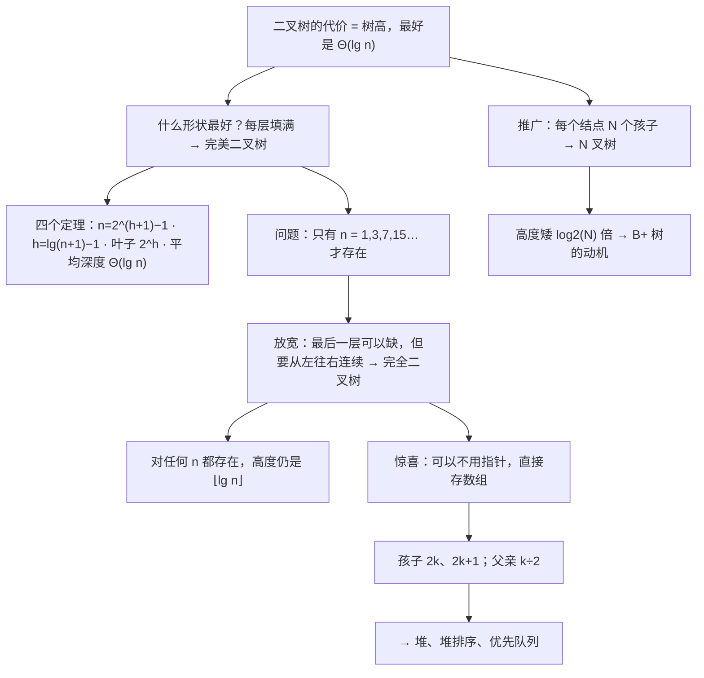

# C6.5 完美二叉树·完全二叉树与 N 叉树

> [!abstract] 这一讲的任务
> [[C6.4 二叉树]] 说“最好情况下树高是 $\Theta(\lg n)$”，但没说什么样的树才算最好。这一讲把两种最整齐的形态定义清楚：
> - **完美二叉树 perfect**：每一层都填满，是理想情况，但**只有 $n = 1, 3, 7, 15, \ldots$ 时才存在**；
> - **完全二叉树 complete**：允许最后一层缺，但必须从左往右连续填——**对任何 $n$ 都存在**，而且高度仍是 $\lfloor \lg n \rfloor$。
>
> 完全二叉树还有一个惊人的性质：**它可以完全不用指针，直接存进一个数组**，靠下标算术找父亲和孩子。这是**堆**那一章的地基。
> 最后把二叉推广到 $N$ 叉，回答一个实际问题：**分叉更多，树会矮多少？**（答案：矮 $\log_2 N$ 倍，这条结论到 B+ 树那一讲会变成“为什么一个结点要放 512 个键”。）

> [!info] 怎么读这份讲义
> 第二节的**四个定理**是本讲的骨干，四个都用**数学归纳法**证明；第一次读可以先记结论、再回头看证明。
> **第三节（完全二叉树）和第四节（数组存储）是全讲最实用的部分**——数组存储那几个下标公式要背下来，堆、堆排序、优先队列全靠它。
> 第五节的 $N$ 叉树读得快一点没关系，但**第 5.4 节那个"矮 $\log_2 N$ 倍"的结论要记住**，它是 B+ 树的动机。
> **口径警告**：本讲有两处中英文术语不对应，分别在 1.1 和 3.1，都标了 warning，务必看。

> [!info] 标注说明与授课进度
> 标有 **（拓展）** 或 **【拓展】** 的内容，是**课堂上没有讲到、由课件和教材延伸补充**的部分。
> **授课进度**：转写稿只到第四节课（停在第 3 章栈的扩容），树尚未开讲，本篇按整篇尚未授课理解。

> [!info] 课程信息与来源
> **Ya-Hui Jia（贾雅慧）｜SFT SCUT｜jiayahui@scut.edu.cn**。全课程信息见 [[C1.0 课程信息与C++预备]] 与 [[数据结构 MOC]]。
> 本篇合并了课件的**三个小节**：完美二叉树（p.98–115）、完全二叉树（p.116–134）、$N$ 叉树（p.135–150），课件编号 5.2–5.4。**本篇无作业页。**



## 目录与课件对应

| 阅读入口 | 课件页码 | 内容 |
| --- | --- | --- |
| [[#零、开场：什么叫“最好的形状”]]、[[#一、完美二叉树]] | 98–102 | 标准定义、递归定义、例子 |
| [[#二、四个定理]] | 103–113 | 结点数、高度、叶子数、平均深度 |
| [[#三、完全二叉树]] | 114–120 | 完美的局限、定义、递归定义 |
| [[#四、完全二叉树的高度]] | 121–123 | $h = \lfloor \lg n \rfloor$ 及其归纳证明 |
| [[#五、数组存储：把指针全扔掉]] | 124–133 | 层序放入数组、下标公式、为什么只对完全树有效 |
| [[#六、N 叉树]] | 135–150 | 定义、结点数与高度、矮多少倍、模板实现 |
| [[#七、课件勘误与阅读边界]]、[[#八、这一讲的三句话]] | 全篇 | 校正口径与复习 |

---

## 零、开场：什么叫“最好的形状”

[[C6.4 二叉树]] 第五节留下一句话：二叉树上一切操作的代价等于树高，最坏 $\Theta(n)$，最好 $\Theta(\lg n)$。

> [!question] 停一下，先自己想想
> 给定 $n$ 个结点，要让树尽可能矮，应该怎么摆？

**每一层都塞满**。第 0 层 1 个，第 1 层 2 个，第 2 层 4 个……每往下一层容量翻倍，所以用最少的层数装下最多的结点，就是把每层都填满。

这种“每层都满”的树，就是这一讲的第一个主角。

## 一、完美二叉树

### 1.1 两个等价的定义（p.99–100）

> **标准定义**：
> **高度为 $h$ 的完美二叉树 perfect binary tree 是这样一棵二叉树：**
> - **所有叶结点的深度都是 $h$**；
> - **其他所有结点都是满结点**。

> **递归定义**：
> - **高度 $h = 0$ 的二叉树是完美的**；
> - **高度 $h > 0$ 的二叉树是完美的，当且仅当它的两棵子树都是高度 $h-1$ 的完美二叉树。**

> [!warning] **“perfect binary tree”才是国内教材说的“满二叉树”**（口径警告一）
> 这是 [[C6.4 二叉树]] 3.3 节那个翻译陷阱的另一半，在这里必须再说一遍：
>
> | 英文 | 定义 | 国内常用译名 |
> | --- | --- | --- |
> | full binary tree | 每个结点 0 个或 2 个孩子，**形状可以不整齐** | 正则 / 严格二叉树 |
> | **perfect binary tree** | **每层填满** | **满二叉树** ← 本节 |
> | complete binary tree | 最后一层可缺、从左往右连续 | 完全二叉树 ← 第三节 |
>
> **做题时看到“满二叉树”，先确认是中文题还是英文题。**中文题里的“满”＝本节的 perfect。

> [!important] 递归定义比标准定义好用
> 第二节的四个定理**全部**用递归定义来证：把高度 $h+1$ 的树拆成“一个根 + 两棵高度 $h$ 的完美子树”，归纳假设就能直接套上去。
> 而标准定义（“所有叶子同深度”）虽然好懂，却不好做归纳。**两个定义等价，但用途不同**——这在数学里很常见。

### 1.2 例子（p.101–102）

课件画出了 $h = 0, 1, 2, 3, 4$ 的完美二叉树。结点数依次是 **1, 3, 7, 15, 31**——每次翻倍再加一。

p.102 放了一张**棕榈树（Hyphaene Compressa, Doum Palm）**的照片，说它的分叉正好是 $h=3$ 和 $h=4$ 的完美二叉树，并调侃“**note they're the wrong-way up**”（注意它们是倒着长的）。**纯配图，无知识点。**

> [!note] 数据结构的树为什么根在上面（补充）
> 现实里的树根在下、枝在上；数据结构的树反过来。这个惯例没有深刻原因，据说只是因为**写字和画图都是从上往下**，根在上面画起来顺手。
> 课件那句玩笑其实点出了一件事：**"树"只是一个比喻**，真正定义它的是 [[C6.1 树的概念与术语]] 里那三条规则，不是它长得像不像树。

## 二、四个定理

课件 p.103 预告：

> 我们现在来看描述完美二叉树性质的**四个定理**：
> - **完美树有 $2^{h+1} - 1$ 个结点**；
> - **高度是 $\Theta(\ln n)$**；
> - **有 $2^h$ 个叶结点**；
> - **结点的平均深度是 $\Theta(\ln n)$**。
>
> **这些定理的结果将让我们确定二叉树上各种操作的最优运行时间性质。**

### 2.1 定理一：结点数 $n = 2^{h+1} - 1$（p.104–109）

**证明用数学归纳法**（课件 p.104 列出三步：验证 $h=0$、假设对任意 $h$ 成立、证明 $h$ 成立推出 $h+1$ 成立）。

**基础情形**（p.105）：$h = 0$ 时只有一个结点，$n = 1$；公式给出 $2^{0+1} - 1 = 2 - 1 = 1$ ✓。

**归纳步骤**（p.106–108）：假设高度为 $h$ 的完美二叉树有 $n = 2^{h+1} - 1$ 个结点。要证高度 $h+1$ 的树有 $2^{(h+1)+1} - 1 = 2^{h+2} - 1$ 个结点。

用**递归定义**：高度 $h+1$ 的完美二叉树 = 一个根 + 两棵高度 $h$ 的完美子树。所以

$$\underbrace{(2^{h+1} - 1)}_{\text{左子树}} + \underbrace{1}_{\text{根}} + \underbrace{(2^{h+1} - 1)}_{\text{右子树}} = 2 \cdot 2^{h+1} - 1 = 2^{h+2} - 1 \quad ✓$$

**已独立复算。**课件 p.108 把左子树标红、右子树标蓝、根留白，正好对应这三项。

**结论**（p.109）：由数学归纳法，对所有 $h \ge 0$ 成立。

> [!example] 代几个数验证
> | $h$ | $2^{h+1}-1$ | 逐层累加 |
> | --- | --- | --- |
> | 0 | 1 | 1 |
> | 1 | 3 | 1+2 |
> | 2 | 7 | 1+2+4 |
> | 3 | 15 | 1+2+4+8 |
> | 4 | 31 | 1+2+4+8+16 |
>
> 右边那一列其实给出了另一条证法：**等比数列求和** $\sum_{k=0}^{h} 2^k = 2^{h+1}-1$。归纳法和求和公式给的是同一个结果，第六节的 $N$ 叉树版本用的就是求和那条路。

### 2.2 定理二：高度 $h = \lg(n+1) - 1$（p.110–111）

**这条不用归纳，直接把定理一反解出来：**

$$n = 2^{h+1} - 1 \;\Rightarrow\; n + 1 = 2^{h+1} \;\Rightarrow\; \lg(n+1) = h+1 \;\Rightarrow\; \boxed{h = \lg(n+1) - 1}$$

课件 p.111 再补一个**引理**，说明这个式子就是 $\Theta(\ln n)$：

$$\lim_{n\to\infty} \frac{\lg(n+1) - 1}{\ln n} = \lim_{n\to\infty} \frac{\frac{1}{(n+1)\ln 2}}{\frac{1}{n}} = \lim_{n\to\infty} \frac{n}{(n+1)\ln 2} = \frac{1}{\ln 2}$$

极限是一个**非零有限常数**，所以按 [[C1.5 算法与渐进分析]] 的定义，$\lg(n+1)-1 = \Theta(\ln n)$。

> [!note] 这里用的是洛必达法则（补充）
> 分子分母都趋于无穷，求导后再取极限。分子 $\lg(n+1)-1 = \frac{\ln(n+1)}{\ln 2} - 1$ 的导数是 $\frac{1}{(n+1)\ln 2}$，分母 $\ln n$ 的导数是 $\frac 1n$。
> **这一步的意义**：它严格说明了“换底只差常数倍”（[[C6.4 二叉树]] 2.1 节那句提醒），所以写 $\lg$、$\ln$ 还是 $\log_{10}$ 在 $\Theta$ 里都一样。

### 2.3 定理三：叶结点数 $= 2^h$（p.112）

**归纳法**：

- $h = 0$ 时有 $2^0 = 1$ 个叶结点 ✓；
- 假设高度 $h$ 的完美二叉树有 $2^h$ 个叶子。高度 $h+1$ 的树由两棵高度 $h$ 的完美子树组成，各有 $2^h$ 个叶子，合计 $2 \cdot 2^h = 2^{h+1}$ ✓。

**推论（课件称之为 Consequence）：超过一半的结点是叶结点。**

$$\frac{2^h}{2^{h+1} - 1} > \frac{2^h}{2^{h+1}} = \frac12$$

> [!important] 这条推论比定理本身更有用
> 它说的是：**完美二叉树里一半以上的结点都堆在最底下那一层。**
> 直接后果：
> - [[C6.3 树的遍历]] 4.4 节说“BFS 的空间等于最宽一层” ——**最宽那层就有 $n/2$ 个结点**，所以 BFS 对完美二叉树真的很吃内存；
> - 很多树算法的代价其实由**叶子数**主导，而叶子数就是 $\Theta(n)$；
> - 反过来，**若只处理内部结点，工作量也只减半，改不了阶。**

### 2.4 定理四：平均深度 $= \Theta(\ln n)$（p.113）

课件先给出一个推论：**随机选一个结点，有 50-50 的机会是叶结点**（就是 2.3 的推论）。

然后计算平均深度。深度为 $k$ 的结点有 $2^k$ 个（课件在右侧列了一张表：深度 0、1、2、3、4、5 对应 1、2、4、8、16、32 个结点）：

$$\bar d = \frac{\displaystyle\sum_{k=0}^{h} k \cdot 2^k}{2^{h+1}-1}$$

分子是**所有结点深度之和**（课件用蓝圈标出），分母是**结点总数**（红圈标出）。课件给出的化简：

$$\frac{h2^{h+1} - 2^{h+1} + 2}{2^{h+1}-1} = \frac{h(2^{h+1}-1) - (2^{h+1}-1) + 1 + h}{2^{h+1}-1} = h - 1 + \frac{h+1}{2^{h+1}-1} \approx h - 1 = \Theta(\ln n)$$

**已独立复算，与课件一致。**关键用到的求和公式是 $\sum_{k=0}^{h} k\,2^k = (h-1)2^{h+1} + 2$。

> [!important] 平均深度 ≈ $h - 1$ 说明了什么
> 树高是 $h$，而**平均深度只比 $h$ 小 1**。也就是说，**绝大多数结点都挤在靠近底部的那两三层**——这和 2.3 的推论是一回事（一半在最底层，再加上倒数第二层的四分之一，前面所有层加起来还不到四分之一）。
>
> **实际意义**：查一个随机结点的平均代价，和查最深结点的最坏代价**几乎一样**。所以对完美二叉树来说，**平均情况和最坏情况没有实质差别，都是 $\Theta(\lg n)$**——这是个好消息。

### 2.5 完美二叉树是理想情况（p.114–115）

> **完美二叉树被认为是理想情况：**
> - **高度和平均深度都是 $\Theta(\ln n)$。**
>
> **我们将努力寻找尽可能接近完美二叉树的树。**

最后那句话是整章的宣言：**后面的完全二叉树、AVL、红黑树，全都是"尽可能接近完美"的各种妥协方案。**

## 三、完全二叉树

### 3.1 完美的局限（p.117）

> **完美二叉树有理想的性质，但结点数受到限制**：$n = 2^{h+1}-1$，$h = 0,1,\ldots$
> $$1, 3, 7, 15, 31, 63, 127, 255, 511, 1023, \ldots$$
> **我们需要这样的二叉树：**
> - **和完美二叉树相似，但是**
> - **对所有 $n$ 都有定义。**

> [!question] 停一下，先自己想想
> 你有 12 个结点要存，可完美二叉树只允许 7 个或 15 个。怎么办？

放宽一点：**除了最后一层，其他层都填满；最后一层从左往右连续填，允许右边缺一块。**

### 3.2 定义（p.118–119）

> **完全二叉树 complete binary tree：在每一深度上从左到右填充。**
> **这个顺序与广度优先遍历的顺序完全相同。**

课件用 9 棵树演示了 $n = 1$ 到 $n = 12$ 的完全二叉树，每次新增的结点标成红色——**红点总是出现在最后一层的最右边**。

> [!important] 第二句话是全节的关键
> **“填充顺序 = 广度优先遍历顺序”**（[[C6.3 树的遍历]] 第二节）。这句话是第五节数组存储的全部依据：**按 BFS 顺序把结点抄进数组，位置就一一对应。**

> [!warning] **complete binary tree = 国内教材的“完全二叉树”**（口径警告二，这次是对上的）
> 和 1.1 节那个陷阱不同，**这个词中英文是一致的**。
> 但有一个细节要注意：国内教材通常用**编号**来定义——「对 $n$ 个结点的二叉树编号，若每个结点的编号都与同深度满二叉树中相同位置的结点编号一致，则为完全二叉树」。
> **两种说法等价**，而“编号一致”那个说法其实已经在暗示第五节的数组存储了。

### 3.3 递归定义（p.120）

> **递归定义**：只有一个结点的二叉树是高度 $h=0$ 的完全二叉树；高度为 $h$ 的完全二叉树满足下列之一：
> - **左子树是高度 $h-1$ 的完全树，右子树是高度 $h-2$ 的完美树**；或者
> - **左子树是高度 $h-1$ 的完美树，右子树是高度 $h-1$ 的完全树**。

课件画了两棵树对应这两种情况（红色标完全、蓝色标完美）。

> [!question] 课堂追问
> 这两条为什么能覆盖所有情况？为什么第一条里右子树的高度是 $h-2$ 而不是 $h-1$？

因为最后一层是**从左往右**填的，所以只有两种可能：

1. **最后一层的结点还没填到右半边**：那么左子树自己还没填满（是"完全但不完美"，高度 $h-1$），而右子树**根本没有最后一层**——它的高度只有 $h-2$，且必然是完美的；
2. **最后一层已经填过了左半边，正在填右半边**：那么左子树已经填满（完美，高度 $h-1$），右子树正在填（完全，高度 $h-1$）。

**第一条里那个 $h-2$ 不是笔误，它正是"左边还没填完，右边还没开始"的形式化表述。**这个细节非常容易看漏。

## 四、完全二叉树的高度

### 4.1 定理：$h = \lfloor \lg n \rfloor$（p.121）

> **$n$ 个结点的完全二叉树，高度是 $h = \lfloor \lg(n) \rfloor$。**

> [!important] 和完美二叉树的公式对照
> | | 公式 |
> | --- | --- |
> | 完美 | $h = \lg(n+1) - 1$ |
> | 完全 | $h = \lfloor \lg n \rfloor$ |
>
> 完美树是完全树的特例：$n = 2^{h+1}-1$ 时，$\lfloor \lg(2^{h+1}-1) \rfloor = h$ ✓（因为 $2^h \le 2^{h+1}-1 < 2^{h+1}$）。**两个公式在完美树上给出同一个答案。**
>
> **这条定理是全讲最该记住的一个式子**：它保证了**完全二叉树的高度永远是 $\Theta(\lg n)$，对任何 $n$ 都成立**——这正是 3.1 节想要的东西。

### 4.2 证明（p.121–123）

**基础情形**：$n = 1$ 时 $\lfloor \lg 1 \rfloor = 0$，而单结点树的高度确实是 0 ✓。

**归纳步骤**：假设 $n$ 个结点的完全树高度是 $\lfloor \lg n \rfloor$，要证 $n+1$ 个结点时是 $\lfloor \lg(n+1) \rfloor$。分两种情况：

**情况 1：$n$ 个结点的树是完美的**（p.122）——此时再加一个结点必然要开新的一层，高度增加。

树是完美的，所以 $n = 2^{h+1}-1$。由 $2^h < 2^{h+1}-1 < 2^{h+1}$（$h \ge 1$ 时）：

$$h = \lg(2^h) < \lg(2^{h+1}-1) < \lg(2^{h+1}) = h+1 \;\Rightarrow\; h \le \lfloor \lg(2^{h+1}-1) \rfloor < h+1$$

所以 $\lfloor \lg n \rfloor = h$。而加一个结点后：

$$\lfloor \lg(n+1) \rfloor = \lfloor \lg(2^{h+1}-1+1) \rfloor = \lfloor \lg(2^{h+1}) \rfloor = h+1 \quad ✓$$

**高度确实增加了 1。**

**情况 2：$n$ 个结点的树完全但不完美**（p.123）——此时最后一层还没填满，加一个结点**不改变高度**。

不完美意味着 $2^h \le n < 2^{h+1}-1$，于是 $2^h + 1 \le n+1 < 2^{h+1}$：

$$h = \lg(2^h) < \lg(2^h+1) \le \lg(n+1) < \lg(2^{h+1}) = h+1$$
$$\Rightarrow\; h \le \lfloor \lg(2^h+1) \rfloor \le \lfloor \lg(n+1) \rfloor < h+1$$

所以 $\lfloor \lg(n+1) \rfloor = h$，**高度不变** ✓。

**由数学归纳法，对所有 $n \ge 1$ 成立。**

> [!important] 两种情况分别对应什么
> - **情况 1**：树刚好塞满，下一个结点只能开新层 → 高度 +1；
> - **情况 2**：最后一层还有空位，新结点填进去 → 高度不变。
>
> 这正好解释了**高度只在 $n$ 跨过 $2^h$ 时才增长**：$n=1$ 时 $h=0$，$n=2,3$ 时 $h=1$，$n=4..7$ 时 $h=2$，$n=8..15$ 时 $h=3$……**这就是 $\lfloor \lg n \rfloor$ 的含义。**

## 五、数组存储：把指针全扔掉

这是本讲最实用的一节。

### 5.1 按层序抄进数组（p.124–125）

> **我们能够把一棵完全树存成一个数组：**
> - **按广度优先顺序遍历这棵树，把各项放进数组。**

课件用一棵 12 结点的完全树（层序是 3, 9, 5, 14, 10, 6, 8, 17, 15, 13, 23, 12）演示，遍历一遍就得到数组。

### 5.2 插入和删除（p.126–127）

> **要在保持完全二叉树结构的前提下插入一个结点，必须插到数组的下一个位置。**
> **要在保持完全树结构的前提下删除一个结点，必须删掉数组中的最后一个元素。**

课件演示：插入 19 → 挂在结点 6 的右孩子，同时写进数组末尾；删除则去掉数组最后一项（结点 12）。

> [!important] 这两条约束正是**堆**的操作方式
> 堆（课件 `heap.pptx`，本课程后面一章）就是一棵完全二叉树，它的插入永远是“**放到数组末尾，再往上冒泡**”，删除永远是“**把末尾元素搬到根，再往下沉**”。
> **为什么非要这样？**因为只有这样才能保持“完全”这个形状，而形状一旦破坏，5.4 节的下标公式就全部失效了。

### 5.3 留空第 0 格（p.128–131）

> **把第一项留空会带来一个好处：**
> - **下标为 $k$ 的结点，它的孩子在 $2k$ 和 $2k+1$**；
> - **下标为 $k$ 的结点，它的父亲在 $k \div 2$**。

![[C6-完全二叉树-数组存储.png]]

课件 p.130–131 用具体例子验证：**结点 10 的下标是 5，它的孩子 13 和 23 的下标是 10 和 11；它的父亲是结点 9，下标 $5/2 = 2$**（整数除法）。**已在图上复核，全部正确。**

> [!important] 为什么一定要空出第 0 格
> 如果根放在下标 0，公式会变成孩子 $2k+1$、$2k+2$，父亲 $\lfloor (k-1)/2 \rfloor$——能用，但**多了那些 ±1，手算和写代码都更容易错**。
> 空出一格换来的是极其干净的 $2k$、$2k+1$、$k/2$，**代价只有一个元素的空间**。这笔买卖非常划算。
> （不过第六节的 $N$ 叉树版本课件又改回了“根在下标 0”，注意别混。）

课件 p.129 给出 C++ 的位运算写法：

```cpp
parent      = k >> 1;
left_child  = k << 1;
right_child = left_child | 1;
```

> [!note] 这三行为什么成立（补充）
> - `k >> 1` 是 $k$ 右移一位，等于 $\lfloor k/2 \rfloor$——**正是整数除以 2**；
> - `k << 1` 是左移一位，等于 $2k$；
> - `left_child | 1` 是把最低位置 1。因为 $2k$ 一定是偶数（最低位为 0），或上 1 就得到 $2k+1$。
>
> 位运算比乘除快（虽然现代编译器会自动把 `/2` 优化成移位），**更重要的是它读起来直接说明了"下标就是从根出发的路径的二进制编码"**：从根开始，每往左走一层就在二进制末尾追加一个 0，往右走追加一个 1。**结点 11 = 二进制 1011 = 根 → 左 → 右 → 右。**这个视角在堆和位图索引里很有用。

### 5.4 为什么只对完全树有效（p.132–133）

> [!question] 课堂追问（课件 p.132 原问）
> **为什么不把任意一棵树都按广度优先存成数组？**

> **有大量内存被浪费的可能。**
> 考虑这棵 12 个结点的树，**会需要一个大小为 32 的数组**；**给结点 K 加一个孩子，需要的内存就翻倍。**

p.133 给出最坏情况：

> **在最坏情况下，需要指数级的内存。**
> 这些结点会被存在第 **1, 3, 6, 13, 26, 52, 105** 号位置。

> [!example] 复核那串下标（已独立复算）
> 那是一条**左右交替**下降的链：A（根，下标 1）→ 右孩子 G（$2\times1+1 = 3$）→ 左孩子 B（$2\times3 = 6$）→ 右孩子 F（$2\times6+1 = 13$）→ 左孩子 E（$2\times13 = 26$）→ 左孩子 C（$2\times26 = 52$）→ 右孩子 D（$2\times52+1 = 105$）。
> **7 个结点，数组要开到 106。**
> 更一般地：一条深度为 $h$ 的链，最深的那个结点下标约为 $2^h$——**$n$ 个结点需要 $\Theta(2^n)$ 的数组**。

> [!important] 一句话总结这一节
> **数组存储用"形状必须完全"换来了"不需要任何指针"。**
> - 省下的：每个结点两个指针（对 `int` 元素来说，指针比数据还大）；
> - 换来的额外好处：**元素在内存里连续**，缓存友好，遍历极快；
> - 付出的代价：**树的形状被锁死了**，任何破坏“完全”的插入删除都不被允许。
>
> 所以它只适用于形状天然就完全的结构——**堆**。而 BST、AVL、红黑树的形状由数据决定，**没法用数组存**。

## 六、N 叉树

课件最后一节（p.135–150）把二叉推广到 $N$ 叉，节奏很快（“This topic **quickly** looks at…”）。

### 6.1 定义与例子（p.136–138）

> **二叉树的一种推广是被称为 $N$ 叉树 N-ary trees 的一类树：**
> - **每个结点有 $N$ 棵子树，其中任何一棵都可以是空树。**

- **三叉树 ternary（3-ary）**：课件画了两个例子，并注明“**我们通常不画出空子树**”；
- **四叉树 quaternary（4-ary）**：课件给了一棵完美四叉树，并说“**在某些条件下，四叉树所需的操作数可能略少（例如用于堆）；渐进行为是相似的**”。

> [!note] 四叉堆真的存在（补充）
> 标准的二叉堆每次下沉要比较 2 个孩子，走 $\lg n$ 层；四叉堆每次比较 4 个孩子，但只走 $\log_4 n = \frac12 \lg n$ 层。总比较次数差不多，**但内存访问次数少一半**——在缓存友好性上四叉堆确实常常更快。课件那句“略少”说的就是这件事。

### 6.2 完美 $N$ 叉树的结点数（p.139）

每个结点 $N$ 个孩子，所以第 $k$ 层有 $N^k$ 个结点：

$$n = \sum_{k=0}^{h} N^k = 1 + N + N^2 + \cdots + N^h = \frac{N^{h+1}-1}{N-1}$$

这是**等比数列求和**。代入 $N = 2$：$\frac{2^{h+1}-1}{2-1} = 2^{h+1}-1$ ✓ **正好回到定理一。**

### 6.3 高度（p.140–141）

反解出 $h$：

$$h = \log_N\big(n(N-1)+1\big) - 1$$

课件 p.141 再证明可以简化成 $\log_N(n)$：由 $\log_N(nN) - 1 = \log_N(n)$，且

$$\lim_{n\to\infty} \frac{\log_N(n(N-1)+1) - 1}{\log_N(n)} = 1$$

所以**两者渐进等价**，实用中直接写 $h \approx \log_N n$。

### 6.4 矮多少倍：本节最该记住的结论（p.142–143）

> 完美二叉树的高度约为 $\lg(n)$。因此，若 $N$ 叉树的高度是 $\log_N(n)$，两者高度之比为：
> $$\frac{\log_2 n}{\log_N n} = \frac{\log_2 n}{\log_2 n / \log_2 N} = \log_2 N$$

> **因此：**
> - **完美四叉树的高度约为同样结点数的完美二叉树的 $\frac12$**（$\log_2 4 = 2$）；
> - **完美 16 叉树的高度约为 $\frac14$**（$\log_2 16 = 4$）。

> [!important] **这条结论是 B+ 树的全部动机**
> 现在看起来只是“矮一点”，好像没什么用——反正都是 $\Theta(\lg n)$，常数倍在渐进分析里被吃掉了。
> 但到了 **B+ 树**那一讲（课件 `tree_part3`）会看到：当每一层意味着**一次磁盘寻道（约 10 毫秒）**时，**常数倍就是一切**。
> 十亿条记录：
> - 二叉搜索树，$h \approx \lg(10^9) \approx 30$ → **30 次磁盘访问 = 0.3 秒**；
> - 512 叉树，$h \approx \log_{512}(10^9) = 3$ → **3 次磁盘访问 = 30 毫秒**。
>
> **快十倍。**这就是所有数据库索引都用 B+ 树而不是二叉树的原因。**把这条结论记住，到 B+ 树那一讲就不用重新理解了。**

### 6.5 完全 $N$ 叉树与数组存储（p.144）

> **完全 $N$ 叉树的高度是** $h = \lfloor \log_N((N-1)n) \rfloor$。
> **和完全二叉树一样，完全 $N$ 叉树也可以高效地存进数组：**
> - **假设根在下标 0**；
> - **下标为 $k$ 的结点，父亲在** $\left\lfloor \dfrac{k-1}{N} \right\rfloor$；
> - **下标为 $k$ 的结点，孩子在** $kN + j$，**其中 $j = 1, \ldots, N$**。

> [!warning] 注意这里的根在下标 **0**，和 5.3 节不一样（易错点）
> 第五节为了公式好看，特意把下标 0 留空、根放在 1。这一页又改回了根在 0。
> **代入 $N=2$ 检验**：孩子在 $2k+1$ 和 $2k+2$，父亲在 $\lfloor (k-1)/2 \rfloor$——正是 5.3 节提过的“根在 0”的那套公式。**两套都对，但不能混用。**做题前先看清根在哪个下标。

### 6.6 实现：为什么要把 N 做成模板参数（p.145–149）

课件先给出“显然的”实现（p.145）：把 $N$ 存成一个成员变量，孩子数组动态分配。

然后列出**这种实现的问题**（p.146）：

> - **需要动态内存分配**；
> - **需要写析构函数来释放内存**；
> - **无法做任何优化**；
> - **动态内存分配未必总是可用（嵌入式系统）**。
>
> **解法？把 $N$ 在编译期指定……**

于是改成**两个模板参数**（p.147）：

```cpp
#include <algorithm>

template <typename Type, int N>
class Nary_tree {
    private:
        Type node_value;
        Nary_tree *children[std::max(N, 2)];   // an array of N children
    public:
        Nary_tree( Type const & = Type() );
        // ...
};

template <typename Type, int N>
Nary_tree<Type, N>::Nary_tree( Type const &e ): node_value( e ) {
    for ( int i = 0; i < N; ++i ) {
        children[i] = nullptr;
    }
}
```

用法（p.148）：

```cpp
Nary_tree<int, 4> i4tree( 1975 );   // create a 4-way tree
std::cout << i4tree.value() << std::endl;
```

好处（p.149）：

> 因为数组大小（第 2 个模板参数）在**编译期**就确定了：
> - **编译器可以做某些优化**；
> - **所有内存一次性分配**，**甚至可能在编译期分配在栈上**；
> - **不需要析构函数。**

> [!important] 这一段其实在讲一个通用的 C++ 设计权衡（补充）
> **把一个量从"运行期的变量"提升为"编译期的常量"**，能换来：数组大小固定（可以是成员而不是指针）、循环可以展开、不需要动态分配、不需要析构函数。
> 代价是：**$N$ 不同的树是完全不同的类型**——`Nary_tree<int,3>` 和 `Nary_tree<int,4>` 不能互相赋值，也不能装进同一个容器。而且每个用到的 $N$ 都会生成一份代码（模板膨胀）。
> 标准库里同一对立面的例子就是 **`std::array<T,N>`（编译期大小）vs `std::vector<T>`（运行期大小）**——完全是同一个权衡。
> 课件那句“嵌入式系统可能没有动态内存分配”是真的：很多安全关键系统（航空、汽车）的编码规范**直接禁止 `new`**。

### 6.7 小结（p.150）

> **$N$ 叉树与二叉树类似，只是每个结点最多可以有 $N$ 个孩子。**
> **在结点数相同的情况下，二叉树的高度约为 $N$ 叉树高度的 $\log_2(N)$ 倍。**

## 七、课件勘误与阅读边界

| 位置 | 课件写的 | 实际情况 |
| --- | --- | --- |
| p.100 | “is a **prefect** binary tree” | 应为 **perfect**。纯拼写错误 |
| p.136 | “any of which **may be may be** empty trees” | 重复了 “may be”。纯打字错误 |
| p.145 | `children( new *Nary_tree[N] )` | **语法错误**，应为 `new Nary_tree*[N]`（指向指针的数组）。照抄编译不过 |
| p.128 vs p.144 | 根的下标：p.128 是 **1**（留空第 0 格），p.144 是 **0** | 两套公式都正确但**不能混用**。见 6.5 节 |
| p.99 / p.117 等 | 页码显示为断成两行的 “10 0”“11 6” | pptx→PDF 转换时页码框换行所致，不影响内容 |
| p.103 等 | Θ 显示为异体字形 | 转换所致，按 Θ 理解 |
| 1.1 节 | perfect binary tree | **中译“满二叉树”指的就是它**，不是 [[C6.4 二叉树]] p.82 的 full binary tree。见 1.1 节 |

**阅读边界**：

- 本篇覆盖 `pdfs/tree_part1.pptx` 的 **p.98–150**，课件编号 **5.2–5.4**，共 53 页；**全部读过，未跳页**。
- 本篇按用户确认的拆分方案，把课件的**三个独立小节**（完美二叉树 p.98–115、完全二叉树 p.116–134、$N$ 叉树 p.135–150）合并为一篇。
- **未发现课堂手写批注**；p.99 左侧的红色箭头是课件自带的指示标记。
- p.102（棕榈树照片）是装饰图，无知识点，未复现。
- 数组存储那张图是**本篇自绘**（python），综合了课件 p.124–131 的信息。
- **本篇无作业页**；`tree_part1` 的作业在 p.73（见 [[C6.3 树的遍历]]）和 p.97（见 [[C6.4 二叉树]]）。

## 八、这一讲的三句话

1. **完美二叉树是理想但稀有**（只在 $n = 2^{h+1}-1$ 时存在）；**完全二叉树是对所有 $n$ 都可用的次优解**，而且高度仍然是 $\lfloor \lg n \rfloor = \Theta(\lg n)$。整章后面的工作都是“尽可能接近完美”。
2. **完全二叉树可以扔掉全部指针，直接存数组**：留空第 0 格后，孩子在 $2k$、$2k+1$，父亲在 $k/2$。**代价是形状被锁死**——这就是堆的全部机制，也是它只能用于堆的原因。
3. **$N$ 叉树比二叉树矮 $\log_2 N$ 倍**。现在看只是常数倍，**但当每一层等于一次磁盘寻道时，常数倍就是十倍的性能差**——这是 B+ 树的动机。

### 四个定理速查（完美二叉树，高度 $h$，结点数 $n$）

| 定理 | 公式 | 备注 |
| --- | --- | --- |
| 结点数 | $n = 2^{h+1}-1$ | 等比求和；$h=0,1,2,3,4 \to 1,3,7,15,31$ |
| 高度 | $h = \lg(n+1)-1 = \Theta(\lg n)$ | 由上式反解 |
| 叶结点数 | $2^h$ | **超过一半的结点是叶子** |
| 平均深度 | $\approx h-1 = \Theta(\lg n)$ | 平均与最坏几乎一样 |

### 三种形态对照

| | 定义 | 存在条件 | 高度 | 国内译名 |
| --- | --- | --- | --- | --- |
| **full** | 每结点 0 或 2 个孩子 | 任意 | 不定 | 正则/严格二叉树 |
| **perfect** | 每层填满 | 仅 $n = 2^{h+1}-1$ | $\lg(n+1)-1$ | **满二叉树** |
| **complete** | 最后一层从左连续填 | **任意 $n$** | $\lfloor \lg n \rfloor$ | **完全二叉树** |

### 数组存储速查

| 约定 | 孩子 | 父亲 | 出处 |
| --- | --- | --- | --- |
| **根在下标 1**（留空第 0 格） | $2k$、$2k+1$ | $\lfloor k/2 \rfloor$，即 `k >> 1` | p.128（**推荐**） |
| 根在下标 0 | $2k+1$、$2k+2$ | $\lfloor (k-1)/2 \rfloor$ | p.144 的 $N=2$ 特例 |
| $N$ 叉，根在下标 0 | $kN+j,\ j=1..N$ | $\lfloor (k-1)/N \rfloor$ | p.144 |

### 关键核对值

| 内容 | 结果 |
| --- | --- |
| 完美二叉树 $h=0..4$ 的结点数 | 1, 3, 7, 15, 31 |
| 完美二叉树深度 0..5 的结点数 | 1, 2, 4, 8, 16, 32 |
| 平均深度求和公式 | $\sum_{k=0}^{h} k2^k = (h-1)2^{h+1}+2$ |
| 结点 10 在示例树中的下标 | 5；孩子 10、11；父亲 2 |
| 12 结点的退化树所需数组 | 大小 32（再加一个孩子就翻倍） |
| p.133 那条链的下标 | 1, 3, 6, 13, 26, 52, 105 |
| 四叉树 / 16 叉树相对二叉树的高度 | $\frac12$ / $\frac14$ |
| $N$ 叉完美树结点数 | $\dfrac{N^{h+1}-1}{N-1}$ |

**下一讲预告**：形状的问题讨论完了，可我们还是没给二叉树**规定任何内容上的规则**——[[C6.4 二叉树]] 4.2 节说过，二叉树只是个形状，不是 ADT。下一讲给它加上第一条内容规则：**左子树的值全部小于根，右子树的值全部大于根**。这一条规则会让查找变成一路向下的比较，代价正好是树高。这就是**二叉搜索树 BST**——`tree_part2` 的开头。至于怎么保证那棵树不退化成链，那是再往后两讲的事。

---

上一篇：[[C6.4 二叉树]] ｜ 前置：[[C1.5 算法与渐进分析]]、[[C6.3 树的遍历]] ｜ 下一篇：C6.6 二叉搜索树（待整理） ｜ 返回：[[数据结构 MOC]]
