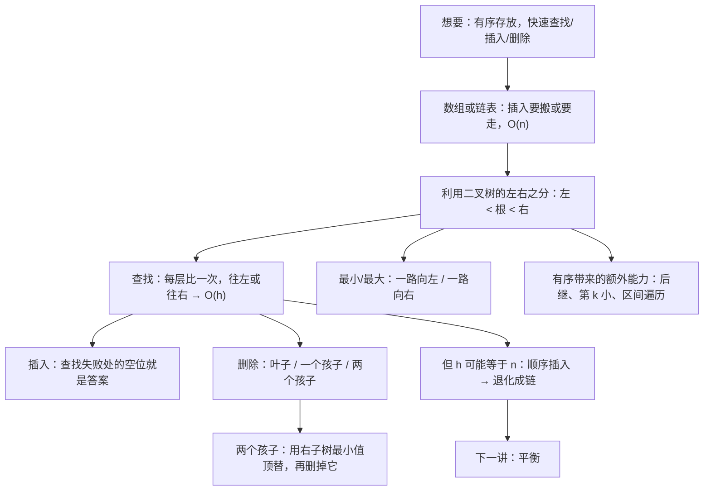
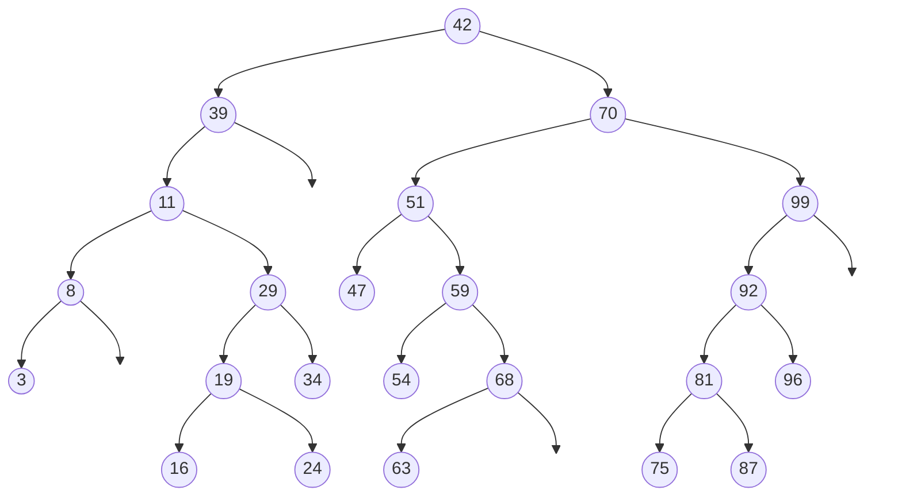
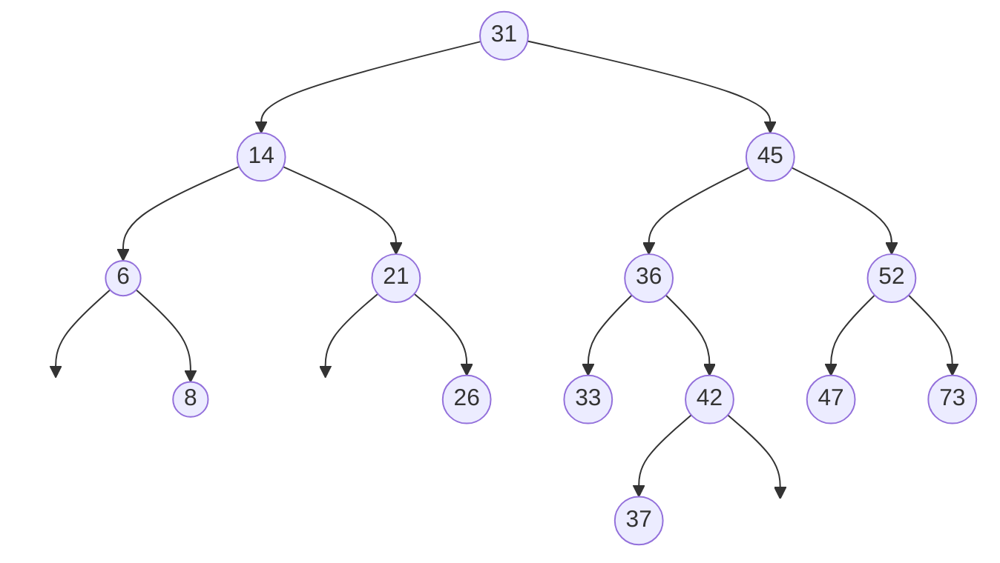
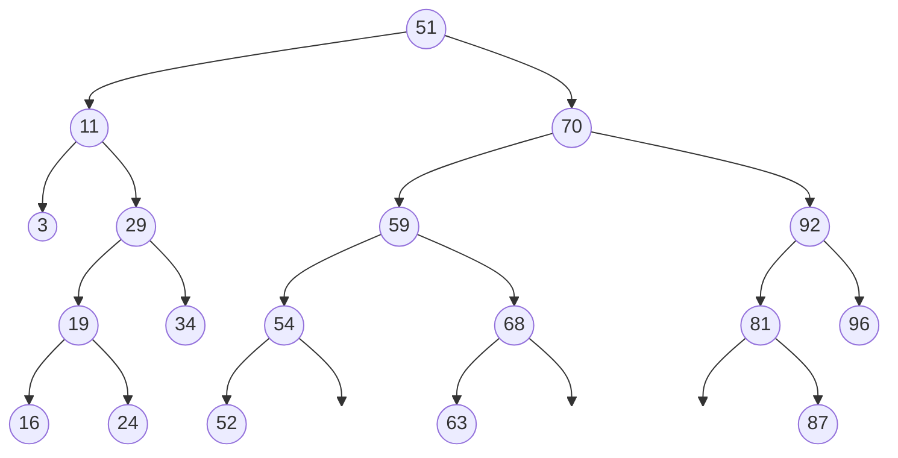
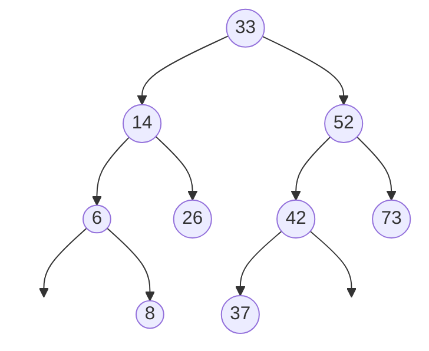

# C6.6 二叉搜索树

> [!abstract] 这一讲的任务
> [[C6.4 二叉树]] 说过，二叉树只是一个形状，不是 ADT。这一讲给它加上第一条**内容规则**：**左子树里的值都比根小，右子树里的值都比根大**。
> 就这一条规则，查找变成了“每到一个结点比一次、往左或往右走一步”——**代价正好是树高**。插入同理：查找失败时停下的那个空位，就是新值该待的地方。
> 真正难的是**删除**：删掉一个有两个孩子的结点，树会裂成两半，得找一个人来顶替它的位置。课件给出的答案是**右子树里最小的那个**，这一讲会讲清楚为什么偏偏是它。
> 最后课件自己泼了一盆冷水：**所有操作都是 $O(h)$，而 $h$ 可能等于 $n$**。按顺序插入 1, 2, 3, … 就能把 BST 变成一条链表。下一讲的全部工作就是堵住这个洞。

> [!info] 怎么读这份讲义
> 第一节讲**为什么需要一种新的 ADT（有序表）**，是动机，读快点没关系。
> **第三至第五节（查找、插入、删除）是本讲的主体**，删除的三种情况是考试必考点。
> **每一节都有课件自带的黑板例题**（p.34、p.60），课件没给答案——本篇在 4.4 节和 5.6 节给出了完整的模拟过程与答案，**建议先自己在纸上画一遍再对答案**。
> 第六节的后继与第 $k$ 小是“有序”这件事带来的额外能力，也是 BST 和哈希表的分水岭。
> 标题末尾写“（补充）”的小节是课件没有、由通行讲法补出的内容。

> [!info] 标注说明与授课进度
> 标有 **（拓展）** 或 **【拓展】** 的内容，是**课堂上没有讲到、由课件和教材延伸补充**的部分。
> **授课进度**：现有转写稿只到第四节课（停在第 3 章栈的扩容），树尚未开讲，本篇按整篇尚未授课理解。

> [!info] 课程信息与来源
> **Ya-Hui Jia（贾雅慧）｜SFT SCUT｜jiayahui@scut.edu.cn**。全课程信息见 [[C1.0 课程信息与C++预备]] 与 [[数据结构 MOC]]。
> 本篇覆盖 `tree_part2` 的 **p.1–69**，课件编号 6.1.1–6.1.7。**本篇末尾有作业**（p.69）。
> 注意 `tree_part2` 里课件编号是乱的：这一节是 **6.1**，紧接着的“平衡”那一节编号却是 **4.9**。本库按依赖顺序排，平衡放进下一篇 [[C6.7 平衡与AVL树]]。



## 目录与课件对应

| 阅读入口 | 课件页码 | 内容 |
| --- | --- | --- |
| [[#零、开场：一本不停加页的通讯录]]、[[#一、有序表：一种新的 ADT]] | 2–5 | 抽象有序表、它要回答的查询、数组与链表为什么不够 |
| [[#二、定义：左小右大]] | 6–13 | 定义、例子、退化树、同一组数据的多种形状、重复值约定 |
| [[#三、实现与查找]] | 14–21 | 类接口、最小值、最大值、查找 |
| [[#四、插入]] | 22–34 | 空位即插入点、两个演示、代码、**黑板例题一** |
| [[#五、删除]] | 35–61 | 三种情况、七次删除演示、为什么用右子树最小值、代码、**黑板例题二**、清空 |
| [[#六、有序带来的能力：后继与第 k 小]] | 62–67 | 前驱后继、第 k 个元素、为此需要的 size 字段 |
| [[#七、代价全在树高]] | 68–69 | $O(h)$、退化、下一讲的方向、作业 |
| [[#八、课件勘误与阅读边界]]、[[#九、这一讲的三句话]] | 全篇 | 校正口径与复习 |

---

## 零、开场：一本不停加页的通讯录

你手上有一本纸质通讯录，按姓名拼音排序。每认识一个新朋友，就要把他的名字**插到正确的位置**。

> [!question] 停一下，先自己想想
> 如果这本通讯录是一个**数组**（每页固定位置），插入一个排在中间的名字要做什么？如果是一个**链表**（每页写着“下一页在哪”），又要做什么？

- **数组**：用二分查找，$O(\lg n)$ 就能找到该插在哪——但插进去要把后面所有人**往后挪一格**，$O(n)$。
- **链表**：插进去只要改两个指针，$O(1)$——但要**找到**插入位置，只能从第一页一页页翻，$O(n)$。

两种结构各卡住一半：**数组找得快、插得慢；链表插得快、找得慢**。这就是 [[C2.7 两种实现的比较]] 那张表的老问题。

> [!important] 这一讲要的是两头都快
> 二分查找之所以快，是因为每比一次就**扔掉一半**。如果我们把“中间那个元素”放在根上，“左半边”放在左子树、“右半边”放在右子树……**二分查找的过程就变成了在一棵树上往下走**，而树上插入只需要挂一个新结点，不需要搬任何东西。
> 你刚才想的，就是二叉搜索树。

## 一、有序表：一种新的 ADT

### 1.1 显式顺序 vs 隐式顺序（p.3）

> 之前我们讨论过**抽象表 Abstract Lists**：对象由**程序员显式地**线性排序。
> 现在我们讨论**抽象有序表 Abstract Sorted List**：
> - 这种关系基于一个**隐式的线性顺序**。
>
> 某些操作不再有意义：
> - **`push_front` 和 `push_back` 被一个通用的 `insert` 取代。**

> [!important] “显式”和“隐式”是什么意思
> - **显式 explicit**：你说它在第几个，它就在第几个。[[C2.3 线性表 ADT]] 的 `Insert(i, e)` 就是这样，位置 $i$ 由调用者决定。
> - **隐式 implicit**：位置由**值本身**决定。你只说“插入 42”，它自己知道该待在 41 和 43 中间。
>
> 所以 `push_front` 在有序表里没有意义——你没有权力决定一个值排在最前面，**值的大小已经替你决定了**。
> 这正是 [[C1.3 数据元素间的六种关系]] 里第一种关系“线性序”的两种来源：**人为排的**和**值自带的**。

### 1.2 有序表要回答的查询（p.4）

> 可以对有序表 ADT 中的数据提出的查询包括：
> - **找最小值和最大值**；
> - **找第 $k$ 大的值**；
> - **给定一个对象（它可能在、也可能不在容器里），找它的下一个更大和上一个更小的对象**；
> - **遍历落在区间 $[a, b]$ 内的对象**。

这四个查询都依赖“有序”。**第六节会看到，BST 能在 $O(h)$ 内回答全部四个。**

### 1.3 数组和链表为什么不够（p.5）

> 如果用数组或链表实现抽象有序表，**会有操作是 $O(n)$ 的**：
> - 因为插入可能发生在链表或数组的任何位置，我们**要么遍历、要么复制**，平均 $O(n)$ 个对象。

就是开场那个两难。

## 二、定义：左小右大

### 2.1 利用左右之分（p.6–8）

> 回忆一下，在二叉树中我们可以**规定两个孩子的顺序**。
> 我们将利用这个顺序：
> - **要求左子树中的所有对象都小于根结点存储的对象**，并且
> - **要求右子树中的所有对象都大于根对象。**

课件 p.7 用两个三角形示意：根是 42，左边三角形里装着 15、3、22、29、40、23（全都 < 42），右边装着 50、65、91、46、88、57、73、59（全都 > 42），并说明**两棵子树本身也都是二叉搜索树**。

p.8 指出这个结构**已经可以用来查找了**：看根结点，没找到的话——

> - **若对象小于根结点存储的值，继续在左子树中查找**；
> - **否则，继续在右子树中查找。**
>
> 对线性序，下面三者**必有其一**成立：$a < b$，$a = b$，$a > b$。

> [!important] 这是 [[C6.4 二叉树]] 那句“名字比形状更重要”的第一次兑现
> 那一讲 1.1 节说过：有了“左”“右”这两个名字，才能往上面挂规则。**“左小右大”就是挂上去的第一条规则**，它把二叉树从“一个形状”变成了“一个 ADT”。
> 最后那句“三者必有其一”也不是废话：它是“线性序”的定义（[[C1.3 数据元素间的六种关系]]），保证了每次比较都能明确地往一边走，**不会出现“往哪边都行”或“往哪边都不行”的情况**。如果数据只有偏序（有些元素之间没法比），BST 就建不起来。

### 2.2 正式定义（p.9）

> 于是我们把**非空二叉搜索树**定义为具有以下性质的二叉树：
> - **左子树（如果有）是一棵二叉搜索树，并且其中所有值都小于根的值**，并且
> - **右子树（如果有）是一棵二叉搜索树，并且其中所有值都大于根的值。**

> [!warning] “所有值”三个字是最容易漏掉的（易错点）
> 常见的错误理解是“**左孩子** < 根 < **右孩子**”——只比直接的孩子。这是**不够的**。
> 反例：
> ```mermaid
> flowchart TD
>   R((10)) --> L((5))
>   R --> RR((15))
>   L --> LL((2))
>   L --> LR((12))
> ```
> 每个结点都满足“左孩子 < 自己 < 右孩子”，但 12 在 10 的**左子树**里，而 12 > 10——**这不是 BST**。在这棵树里查找 12，从根出发会往右走（12 > 10），永远找不到它。
> **定义要求的是整棵子树，不是直接孩子。**这也是 LeetCode 98「验证二叉搜索树」最经典的错法。

> [!note] 一条等价的判别法（补充）
> **一棵二叉树是 BST，当且仅当它的中序遍历结果严格递增。**
> 这把 [[C6.4 二叉树]] 第八节的中序遍历和本讲接了起来：中序的顺序是“左、根、右”，而 BST 的规则是“左 < 根 < 右”——**两者是同一件事的两种说法**。上面那个反例的中序是 2, 5, 12, 10, 15，在 12→10 处下降，一眼就能看出不是 BST。

### 2.3 例子（p.10）

课件给了三棵 BST：
- 一棵整数树（根 29）；
- 一棵字母树（根 O，按字母表顺序比较）；
- 一棵**二进制串**树（根 10000，按数值大小比较）。

> [!note] 三棵树想说的是：只要能比大小，什么都能放
> 数字按大小、字母按字典序、二进制串按数值。这呼应了 3.1 节要讲的类接口：**BST 对元素唯一的要求就是能比较**。

### 2.4 退化树（p.11）

> **不幸的是，有可能构造出退化的 degenerate 二叉搜索树**：

课件画了一条从 3 一路往右下斜到 91 的链：3 → 15 → 22 → 23 → 29 → 40 → 42 → 46 → 50 → 57 → 59 → 65 → 73 → 88 → 91。

> **这等价于一个链表，即 $O(n)$。**

### 2.5 同一组数据，多种形状（p.12）

> **所有这些二叉搜索树存的是同样的数据。**

课件把同样 16 个数（3, 15, 22, 23, 29, 40, 42, 46, 50, 57, 59, 65, 73, 88, 91，以及 2.3 节那棵树的全部值）摆成了四种形状：一棵接近完美的（根 46，高度 3）、一棵中等的（根 29）、一棵根为 3 的歪斜树、一条纯链。

> [!question] 停一下，先自己想想
> 数据一模一样，为什么形状能差这么多？形状是由什么决定的？

**由插入顺序决定。** BST 不会自己调整形状，新值永远挂在查找失败处的那个空位上（第四节）。
- 按 46, 23, 65, 15, 40, 57, 88, … 这种“先中间、再两边”的顺序插入 → 得到矮胖的树；
- 按 3, 15, 22, 23, … 这种**已排好序**的顺序插入 → 每个新值都比前面所有值大，永远挂在最右边 → **退化成链**。

**讽刺的是：数据越有序，BST 越糟。**而现实中的数据恰恰经常是有序的（时间戳、自增 ID、按字母表导入的名单）。这就是第七节那盆冷水的来源。

### 2.6 重复值约定（p.13）

> **除非另有说明，我们假设任何二叉树中都不存放重复值。**
> - 现实中，**很少有**必须把容器里的重复值作为独立实体分别存放的情况。
>
> **你总可以通过修改我们将要讲的算法来处理重复值。**

> [!note] 真要存重复值怎么办（补充）
> 两种常见做法：
> 1. **每个结点加一个计数器**：插入已存在的值时计数 +1，删除时 −1，减到 0 才真正删结点。**最常用**，不破坏树的形状；
> 2. **约定“相等往右放”**（或往左）：把规则改成“左 < 根 ≤ 右”。简单，但大量重复值会让树退化。
>
> C++ 标准库里的 `std::set` 不存重复，`std::multiset` 存重复，**底层都是红黑树（BST 的一种，见 C6.8）**。

## 三、实现与查找

### 3.1 类接口（p.14–17）

> 我们会按照当年写 `Single_list` 类的思路来实现一棵二叉搜索树：
> - **一个 `Binary_search_tree` 类会存放一个指向根的指针。**
>
> 我们会使用模板，但我们会**要求这个类重载比较运算符**。

p.15 列出所需的运算符：

```cpp
bool operator<=( Type const &, Type const & );
bool operator< ( Type const &, Type const & );
bool operator==( Type const &, Type const & );
```

> 也就是说，我们**能够比较这个类的两个实例**。例如：`int` 和 `double`。

p.16–17 给出完整的类定义（与 Weiss 教材一致）：

```cpp
#include "Binary_node.h"

template < typename Comparable >
class BinarySearchTree
{
public:
    BinarySearchTree() { root = nullptr; }
    ~BinarySearchTree() { makeEmpty(); }
    const Comparable findMin() const
        { BinaryNode<Comparable>* x = findMin(root); return x->element; }
    const Comparable findMax() const
        { BinaryNode<Comparable>* x = findMax(root); return x->element; }
    bool contains(const Comparable& x) const { return contains(x, root); }
    bool isEmpty() const { return root == nullptr; }
    void makeEmpty() { makeEmpty(root); }
    void insert(const Comparable& x) { insert(x, root); }
    void remove(const Comparable& x) { remove(x, root); }
    void print() { print(root); }

private:
    BinaryNode<Comparable> * root;
    void insert(const Comparable& x, BinaryNode<Comparable>*& t);
    void remove(const Comparable& x, BinaryNode<Comparable>*& t);
    BinaryNode<Comparable>* findMin(BinaryNode<Comparable>* t) const;
    BinaryNode<Comparable>* findMax(BinaryNode<Comparable>* t) const;
    bool contains(const Comparable& x, BinaryNode<Comparable>* t) const;
    void makeEmpty(BinaryNode<Comparable>*& t);
    void print(BinaryNode<Comparable>* t);
};
```

> [!important] 注意这个“公有接口 + 私有递归版本”的结构
> 每个公有函数（如 `contains(x)`）都只有一行：**调用同名的私有版本，并把 `root` 传进去**。真正干活的是私有的那个（如 `contains(x, t)`）。
> 为什么这么设计？
> 1. **递归需要一个“当前子树”参数**，而使用者不应该知道、也不应该能传进一个子树指针；
> 2. 这回答了 [[C6.2 抽象树与通用实现]] 5.2 节那句“I can see the node, but where is the tree?”——**`BinaryNode` 是结点，`BinarySearchTree` 才是树**，它持有 `root` 并对外提供 ADT 操作，结点细节全部藏在 `private` 里。
> 3. 这也是 [[C5.1 双端队列 Deque]] 第六节“不要把结点交出去”那条原则的延续。

> [!important] `insert`、`remove`、`makeEmpty` 的参数是 `BinaryNode*&`——**指针的引用**
> 这是本讲最关键的一个 C++ 细节，第四节会专门讲。现在先记住：**只有这三个会修改树结构的函数用了 `*&`**，只读的 `contains`、`findMin`、`findMax` 用的是普通指针 `*`。

> [!note] 课件要求三个运算符，其实一个就够（补充）
> 看第 3.4、4.3、5.5 节的代码：**全程只用了 `<`**。“相等”是用“既不 `x < y` 也不 `y < x`”推出来的。
> C++ 标准库的 `std::set`、`std::map`、`std::sort` 全都**只要求 `<`**（严格弱序），就是这个道理。课件 p.15 列出 `<=` 和 `==` 是 ECE250 原课件的写法，实际代码里没用到。

### 3.2 最小值：一路向左（p.18）

```cpp
BinaryNode<Comparable>* findMin(BinaryNode<Comparable>* t) const {
    if (t == nullptr)
        return nullptr;
    if (t->left == nullptr)
        return t;
    return findMin(t->left);
}
```

> **运行时间 $O(h)$。**

课件的例子树（后面插入、删除都用它，**请记住这棵树**）：



从 42 一路向左：42 → 39 → 11 → 8 → **3**。3 没有左孩子，它就是最小值。

### 3.3 最大值：一路向右（p.19）

```cpp
BinaryNode<Comparable>* findMax(BinaryNode<Comparable>* t) const {
    if (t != nullptr)
        while (t->right != nullptr)
            t = t->right;
    return t;
}
```

从 42 一路向右：42 → 70 → **99**。99 没有右孩子，它就是最大值。

> **极值不一定是叶结点。**

99 有一个左孩子 92，但它仍然是最大值——**“最大”只要求没有右孩子，不要求没有孩子。**同理，最小值只要求没有左孩子。

> [!note] 同一件事，两种写法（补充）
> `findMin` 是**递归**写的，`findMax` 是**循环**写的，课件故意把两种写法各演示一遍。
> 这种“只往一个方向走、不回头”的递归叫**尾递归**——递归调用是函数的最后一步，没有任何“回来之后要做的事”。尾递归**总能**改写成循环，而且循环版不占调用栈（[[C6.3 树的遍历]] 4.3 节说过，递归会把内存藏在调用栈里）。
> 对比一下 [[C6.3 树的遍历]] 的 DFS：它回来之后还要处理下一个孩子，**不是尾递归**，所以改成循环就得自己维护一个栈。

### 3.4 查找（p.20–21）

> 要判断成员资格，**按照线性关系遍历这棵树**：
> - **若找到了含有该值的结点**，例如 81，返回 1；
> - **若到达了一个空结点**，例如 36，**该对象不在树中**。

- 查 81：42 → 70（81 > 42）→ 99（81 > 70）→ 92（81 < 99）→ **81** ✓ 找到；
- 查 36：42 → 39（36 < 42）→ 11（36 < 39）→ 29（36 > 11）→ 34（36 > 29）→ **34 的右孩子是空的** ✗ 不在树中。

**已在例子树上独立核对。**

```cpp
bool contains(const Comparable& x, BinaryNode<Comparable>* t) const
{
    if (t == nullptr) return false;
    else if (x < t->element)
        return contains(x, t->left);
    else if (t->element < x)
        return contains(x, t->right);
    else
        return true;
}
```

> **运行时间 $O(h)$。**

> [!important] 为什么是 $O(h)$ 而不是 $\Theta(h)$
> 找到得早就提前返回（比如查的正好是根，一次比较就结束）。**最坏情况**是走到最深的叶子，才是 $h$ 次比较。所以准确的说法是“最坏 $\Theta(h)$”，也就是 $O(h)$。
> 课件在这一章统一用 $O(h)$，就是这个意思——见 [[C1.5 算法与渐进分析]] 里大 O 与 Θ 的区别。

> [!question] 停一下，先自己想想
> 查找 36 失败时停在了“34 的右孩子”这个空位上。**这个空位有什么特别的？**

**如果现在要插入 36，它就该放在这里。**查找失败的地方，正是插入的地方——这就是第四节的全部内容。

## 四、插入

### 4.1 插入永远发生在空位上（p.22–26）

> 回忆一下，有序表是**隐式有序**的：
> - **像 `push_front` 和 `push_back` 这样的成员函数没有意义**；
> - **插入由一个 `insert` 成员函数完成，它把对象放到正确的位置。**

> **插入将在叶结点处进行：**
> - **任何空结点都是一个可能的插入位置。**

课件在例子树上把所有空位都画成了蓝色小圈（这就是 [[C6.4 二叉树]] 3.2 节定义的“空子树”），并指出：

> **能插入某个空结点的值，取决于周围的结点。**

然后连续三页举例：

| 空位 | 课件说能放的值 | 为什么（补充） |
| --- | --- | --- |
| 47 的右孩子 | **48、49 或 50** | 在 47 的右边，又在 51 的左子树里，所以必须在 $(47, 51)$ 之间 |
| 34 的右孩子 | **35、36、37 或 38** | 在 34 的右边，又在 39 的左子树里，所以必须在 $(34, 39)$ 之间 |
| 75 的左孩子 | **71 到 74** | 在 75 的左边，又在 70 的右子树里，所以必须在 $(70, 75)$ 之间 |

**已在例子树上独立核对。**

> [!important] 每个空位对应一个开区间
> 从根走到一个空位，一路上每往右拐一次就收紧一次下界，每往左拐一次就收紧一次上界。**走到空位时，上下界围出的开区间就是能放进来的全部值。**
> 更漂亮的是：**这些区间正好把整条数轴无缝切开**。任何一个不在树里的值，都恰好落在唯一一个空位的区间里——所以插入位置总是唯一确定的。
> 这和 [[C6.4 二叉树]] 3.2 节那条“$n$ 个结点有 $n+1$ 个空子树”对上了：$n$ 个值把数轴切成 $n+1$ 段，**一段对应一个空位**。

### 4.2 两次插入演示（p.27–31）

> 像查找一样，我们沿着树往下走：
> - **如果在树里找到了这个对象，就直接返回**——对象已经在二叉搜索树里了（不存重复值）；
> - **否则，我们会到达一个空结点**；
> - **对象就插入到那个位置**；
> - **运行时间是 $O(h)$。**

**插入 52**（p.28–29）：42 → 70 → 51 → 59 → 54 → **54 的左孩子为空** → 新建叶结点 52，挂为 54 的左孩子。

**插入 40**（p.30–31）：42 → 39 → **39 的右孩子为空** → 新建叶结点 40，挂为 39 的右孩子。

> [!question] 课堂追问
> 插入 40 时，40 被直接挂在了 39 的右边，树高有没有变？插入 52 呢？

插入 40：39 原来的右子树为空，现在多了一个深度 2 的叶子——**树高不变**（原来最深的是 16、24、63、75、87，深度 5）。
插入 52：挂在 54 下面，深度 5——**树高仍是 5，不变**。
**只有插在最深那层下面，树高才会 +1。**而第七节会看到，“按顺序插入”恰恰每次都插在最深处。

### 4.3 代码（p.32–33）

```cpp
void insert(const Comparable& x, BinaryNode<Comparable>*& t) {
    if (t == nullptr)
        t = new BinaryNode<Comparable>( x, nullptr, nullptr );
    else if (x < t->element)
        insert(x, t->left);
    else if (t->element < x)
        insert(x, t->right);
    else
        ;
}
```

> 假定如果 `obj < value()` 和 `obj > value()` **两个条件都不成立**，那么 `obj == value()`，**因此我们什么也不做**——对象已经在二叉搜索树里了。

> [!important] **为什么参数必须是 `BinaryNode*& t`（指针的引用）**
> 看第一行：`t = new BinaryNode(...)`。这一行要做的，是**让父结点的那个孩子指针指向新结点**。
>
> 如果参数是普通指针 `BinaryNode* t`：
> - 递归调用 `insert(x, t->left)` 时，传进去的是 `t->left` 的**一份拷贝**；
> - 在里面执行 `t = new ...`，改的只是这份拷贝；
> - **函数一返回，拷贝就没了，父结点的 `left` 还是 `nullptr`**——新结点凭空消失，还顺带泄漏了内存。
>
> 用引用 `BinaryNode*& t`，`t` 就**是**父结点的那个 `left` 本身（不是拷贝），给它赋值就直接改到了父结点身上。
>
> 这一招的妙处在于：**不需要父指针，也不需要单独处理“插在根上”的情况**。空树时 `t` 就是 `root` 本身的引用，`t = new ...` 直接就设好了根。
> 课件 p.58 也会专门说：“为了正确地删除一个结点，我们必须修改指向它的那个成员变量——为此，**我们按引用传递那个成员变量**。”

> [!note] 不用引用的写法长什么样（补充）
> 如果语言不支持引用（比如 C、Java），通常改成**返回新的子树根**：
> ```cpp
> BinaryNode* insert(const Comparable& x, BinaryNode* t) {
>     if (t == nullptr) return new BinaryNode(x, nullptr, nullptr);
>     if (x < t->element)      t->left  = insert(x, t->left);
>     else if (t->element < x) t->right = insert(x, t->right);
>     return t;
> }
> ```
> 调用方写 `root = insert(x, root);`。**效果完全一样**，只是“谁来赋值”从被调函数挪到了调用方。本篇 4.4 节验证答案用的 python 程序就是这种写法。**Java 版的 Weiss 教材用的就是这一种。**

### 4.4 黑板例题一（p.34）

> [!example] 课件原题
> 按给定顺序，把下列对象插入一棵初始为空的二叉搜索树：
> $$31,\ 45,\ 36,\ 14,\ 52,\ 42,\ 6,\ 21,\ 73,\ 47,\ 26,\ 37,\ 33,\ 8$$
> - 哪些值可以放在：**21 的左边？26 的右边？47 的左边？**
> - **怎样判断 40 是否在这棵树里？**
> - **插入哪些值会让树变高？**

**课件没有给答案。以下由程序逐步模拟得出，建议先自己在纸上画一遍再对照。**

**建成的树**（高度 4）：



**逐步插入的关键判断**（前几步写全，后面同理）：

| 插入 | 路径 | 落点 |
| --- | --- | --- |
| 31 | 空树 | 根 |
| 45 | 31 → 右 | 31 的右孩子 |
| 36 | 31 → 右 45 → 左 | 45 的左孩子 |
| 14 | 31 → 左 | 31 的左孩子 |
| 52 | 31 → 45 → 右 | 45 的右孩子 |
| 42 | 31 → 45 → 36 → 右 | 36 的右孩子 |
| 6 | 31 → 14 → 左 | 14 的左孩子 |
| 21 | 31 → 14 → 右 | 14 的右孩子 |
| 73 | 31 → 45 → 52 → 右 | 52 的右孩子 |
| 47 | 31 → 45 → 52 → 左 | 52 的左孩子 |
| 26 | 31 → 14 → 21 → 右 | 21 的右孩子 |
| 37 | 31 → 45 → 36 → 42 → 左 | 42 的左孩子 |
| 33 | 31 → 45 → 36 → 左 | 36 的左孩子 |
| 8 | 31 → 14 → 6 → 右 | 6 的右孩子 |

中序遍历验证：6, 8, 14, 21, 26, 31, 33, 36, 37, 42, 45, 47, 52, 73 ——**严格递增** ✓。

**问题 1：能放在哪里**（按 4.1 节的开区间法）

| 位置 | 开区间 | 若只考虑整数 |
| --- | --- | --- |
| **21 的左边** | $(14, 21)$ | **15 到 20** |
| **26 的右边** | $(26, 31)$ | **27 到 30** |
| **47 的左边** | $(45, 47)$ | **46** |

**问题 2：怎样判断 40 是否在树里**

$31 \to 45\ (40>31) \to 36\ (40<45) \to 42\ (40>36) \to 37\ (40<42) \to$ **37 的右孩子为空** → **40 不在树中**。共比较 5 次。
（顺带：如果要插入 40，它就挂在 37 的右边。）

**问题 3：插入哪些值会让树变高**

树高是 4，最深的结点是 **37**（深度 4）。只有插在深度 4 的结点下面，才会出现深度 5 的新结点、让树高变成 5。
深度 4 的结点只有 37 一个，它的两个空位对应的区间是：
- **37 的左边**：$(36, 37)$ ——**没有整数**；
- **37 的右边**：$(37, 42)$ ——**38、39、40、41**。

> [!important] 所以答案是 **38、39、40、41**（若允许非整数，还有 36 与 37 之间的任何值）
> 其他所有值都会落在深度 ≤ 4 的空位上，不改变树高。**这一问很容易误答成“比 73 大的数”或“比 6 小的数”**——但 73 和 6 所在的位置并不是最深的（73 深度 3，6 深度 2），往那边插只会让那条路变长，追不上 37 那条路。

### 4.5 空位与区间的一张图（补充）

把 4.1 节和 4.4 节的想法画在一起：**BST 的中序遍历把所有值排成一行，而每个空位恰好对应相邻两个值之间的缝隙。**

| 例题一的中序 | 6 | 8 | 14 | 21 | 26 | 31 | 33 | 36 | 37 | 42 | 45 | 47 | 52 | 73 |
| --- | --- | --- | --- | --- | --- | --- | --- | --- | --- | --- | --- | --- | --- | --- |

14 个值切出 15 个缝隙（包括两端的 $(-\infty, 6)$ 和 $(73, +\infty)$），树上也恰好有 15 个空位——**一一对应**。这就是为什么插入位置总是唯一的。

## 五、删除

### 5.1 三种情况（p.35）

> **被删除的结点不一定是叶结点。**
> 有三种可能的情形：
> - **结点是叶结点**，
> - **它恰好有一个孩子**，或
> - **它有两个孩子（它是一个满结点）**。

课件用插入 52 和 40 之后的那棵例子树演示，**连续删除七次**：75、40、8、39、99、42、47。

### 5.2 情况一：叶结点，直接删（p.36–39）

> **叶结点直接删除即可，父结点相应的成员变量置为 `nullptr`。**

- **删 75**（p.36–37）：42 → 70 → 99 → 92 → 81 → **75**。75 是叶子，删掉，**81 的 `left_tree` 置为 `nullptr`**。
- **删 40**（p.38–39）：同理，删掉，**39 的 `right_tree` 置为 `nullptr`**。

### 5.3 情况二：一个孩子，把子树提上来（p.40–45）

> **如果一个结点只有一个孩子，我们可以直接把那个孩子所在的子树提升上来。**

- **删 8**（p.40–41）：8 只有左孩子 3。删掉 8，**11 的 `left_tree` 改为指向 3**。

> **提升一个单独的结点和提升一整棵子树，没有区别。**

- **删 39**（p.42–43）：39 只有一个孩子 11，而 11 下面还挂着整棵子树（3、29、19、16、24、34）。删掉 39，**42 的 `left_node` 改为指向 11**，整棵子树跟着上移一层。课件强调：**注意顺序仍然保持**。
- **删 99**（p.44–45）：99 只有左孩子 92（下面还有 81、87、96）。删掉 99，**70 的 `right_tree` 改为指向 92**。

> [!question] 停一下，先自己想想
> 把 11 那整棵子树直接接到 42 下面，**为什么不会破坏“左小右大”？**

因为 11 那棵子树原本就在 39 的左子树里，而 39 在 42 的左子树里——**所以子树里的每个值都已经小于 42 了**。它们和 42 的大小关系根本没变，变的只是中间少了 39 这一层。
更一般地：**一个结点只有一个孩子时，它的整棵子树的值和它自己的值，在它的祖先们看来是一样的**（都在同一个区间里）。删掉它、把孩子提上来，祖先们感受不到任何区别。

### 5.4 情况三：两个孩子，找人顶替（p.46–57）

这是真正的难点。

> 最后，我们考虑删除一个**满结点**的问题，例如 **42**。
> 我们会做两件事：
> - **用右子树中的最小对象替换 42**；
> - **从右子树中删掉那个对象。**

**删 42**（p.46–49）：

1. 右子树（以 70 为根）的最小值：70 → 51 → **47**（47 没有左孩子）；
2. **把 47 复制到根上**（p.47：“我们暂时在树里有两个 47”）；
3. **从右子树中递归删除 47**（p.48）：47 是叶结点——**情况一**，直接删，**51 的 `left_tree` 置为 `nullptr`**（p.49）。

课件 p.49 特别指出：

> **注意树仍然是有序的：47 是右子树中最小的对象。**

**再删一次根 47**（p.50–54）：

> 假设我们想再次删除根 47：
> - **我们必须复制右子树的最小值**；
> - **我们也可以提升左子树中的最大对象，得到类似的结果。**

1. 右子树最小值：70 → **51**（51 此时已经没有左孩子了）；
2. **把 51 复制到根上**（p.51）；
3. **从右子树中递归删除 51**（p.52–54）：51 只有一个右孩子 59——**情况二**，把 59 那棵子树提上来，**70 的 `left_tree` 改为指向 59**。

> **注意：七次删除之后，剩下的树仍然是正确有序的。**（p.55）

**七次删除后的最终树**（已独立模拟核对，与课件 p.55 一致）：



### 5.5 为什么偏偏是右子树的最小值（p.50, 56–57）

> [!question] 课堂追问（课件 p.56 原问）
> 在两次删除满结点的例子里，我们提上来的分别是：**一个没有孩子的结点**、**一个只有右孩子的结点**。
> **删除满结点时，有没有可能提上来的是一个有两个孩子的结点？**

**不可能。** 课件 p.57 给出了理由：

> 回忆一下，我们提升的是**右子树中的最小值**：
> - **如果那个结点有左子树，那棵左子树里会有更小的值。**

所以“右子树的最小值”**必然没有左孩子**——最多只有一个右孩子。于是删掉它时，只会落入**情况一或情况二**，**递归最多再进行一次就结束**，永远不会连环触发情况三。

> [!important] 把整件事的道理串起来
> 删除满结点时，要找的顶替者必须满足：**比左子树所有值都大，比右子树所有值都小**——这样放到这个位置上，“左小右大”才不会被破坏。
> 符合条件的人只有两个：
> - **右子树里最小的**（中序遍历里紧跟在被删结点**后面**的那个，叫**后继 successor**）；
> - **左子树里最大的**（中序遍历里紧挨在被删结点**前面**的那个，叫**前驱 predecessor**）。
>
> 课件 p.50 那句“也可以提升左子树中的最大对象”说的就是后者。两者都行，**课件和 Weiss 教材统一用后继**。
> **而且这两个人都必然“好删”**：后继没有左孩子，前驱没有右孩子，删掉它们只会是情况一或二。

> [!warning] 【拓展】“永远用后继”有一个长期副作用
> 如果每次删满结点都用后继顶替，**右子树会被持续地削掉**，而左子树原封不动。经过大量随机的插入和删除交替之后，树会**越来越往左偏**。
> 课件下一节（p.71，见 [[C6.7 平衡与AVL树]]）提到的“随机插入和删除之后，平均高度会升到 $\Theta(\sqrt n)$”，正是这个现象（Eppinger 1983、Culberson 1985 的实验与分析结论）。
> 一个简单的缓解办法是**交替使用前驱和后继**，或随机选一个。但根本的解决办法还是下一讲的**主动平衡**。

### 5.6 代码（p.58–59）

> 为了正确地删除一个结点，**我们必须修改指向这个结点的那个成员变量**：
> - 为此，**我们按引用传递那个成员变量**。
>
> 另外：**若删除了对象我们返回 1，若没找到返回 0。**

```cpp
void remove(const Comparable& x, BinaryNode<Comparable>*& t) {
    if (t == nullptr)
        return; // Item not found; do nothing
    if (x < t->element)
        remove(x, t->left);
    else if (t->element < x)
        remove(x, t->right);
    else if (t->left != nullptr && t->right != nullptr) // Two children
    {
        t->element = findMin(t->right)->element;
        remove(t->element, t->right);
    }
    else
    {
        BinaryNode<Comparable>* oldNode = t;
        t = (t->left != nullptr) ? t->left : t->right;
        delete oldNode;
    }
}
```

> [!important] 读懂最后那个 `else` 分支——它同时处理了情况一和情况二
> ```cpp
> t = (t->left != nullptr) ? t->left : t->right;
> ```
> - **一个孩子**：哪边不空就用哪边，把子树提上来——情况二；
> - **没有孩子**：`t->left` 是空，于是取 `t->right`——也是空，`t` 被置为 `nullptr`——**情况一**。
>
> **一行代码吃掉了两种情况**，这是 Weiss 版写法的精巧之处。而它能成立，靠的又是 `t` 是一个**引用**：给 `t` 赋值就等于改了父结点的指针（4.3 节）。
>
> 注意先用 `oldNode` 保存旧指针，**再**改 `t`，**最后** `delete`。顺序反了（先 delete 再读 `t->left`）就是访问已释放内存。这和 [[C2.5 单链表实现]] 那条“先连后断”是同一个纪律。

> [!warning] 课件 p.58 与 p.59 对不上（勘误）
> p.58 说“若删除了对象我们**返回 1**，没找到**返回 0**”，但 p.59 的 `remove` 返回类型是 **`void`**，什么都不返回。
> 这是 ECE250 原课件（返回 `int`）和 Weiss 教材版代码（返回 `void`）混用留下的痕迹。**以 p.59 的代码为准**；如果需要返回值，把返回类型改成 `bool` 并在各分支返回即可。

### 5.7 黑板例题二（p.60）

> [!example] 课件原题
> 在前面生成的二叉搜索树中（即 4.4 节例题一建好的树），依次：
> **删除 47、删除 21、删除 45、删除 31、删除 36**

**课件没有给答案。以下按 p.59 的代码（满结点用右子树最小值顶替）由程序逐步模拟得出。**

| 删除 | 属于哪种情况 | 具体操作 | 删后树高 |
| --- | --- | --- | --- |
| **47** | 情况一：叶子 | 直接删，52 的左孩子置空 | 4 |
| **21** | 情况二：只有右孩子 26 | 26 提上来，成为 14 的右孩子 | 4 |
| **45** | 情况三：两个孩子（36 子树、52 子树） | 右子树最小值是 **52**（47 已删）→ 52 顶替 45 → 再删原来的 52（只有右孩子 73，情况二）| 4 |
| **31**（根） | 情况三：两个孩子 | 右子树最小值：52 → 36 → **33** → 33 顶替根 → 删原来的 33（叶子，情况一） | 4 |
| **36** | 情况二：只剩右孩子 42（左孩子 33 已被提走） | 42 子树提上来，成为 52 的左孩子 | **3** |

**最终的树**（高度 3）：



中序遍历：6, 8, 14, 26, 33, 37, 42, 52, 73 ——**严格递增** ✓，删除全程保持有序。

> [!warning] 删 45 这一步最容易算错
> 很多人会直接写“用 47 顶替 45”——**但 47 在第一步已经被删掉了**。此时 45 的右子树是 52 → 73，最小值是 **52** 本身（52 没有左孩子了）。
> 同理，删 36 时要注意：36 原来有两个孩子（33 和 42），但 **33 在上一步删 31 时已经被提到根上去了**，所以此时 36 只剩一个孩子，属于情况二，不是情况三。
> **删除序列里每一步都要基于上一步的结果**，不能回到原始树去看。

### 5.8 清空（p.61）

```cpp
void makeEmpty(BinaryNode<Comparable>*& t) {
    if (t != nullptr)
    {
        makeEmpty(t->left);
        makeEmpty(t->right);
        delete t;
    }
    t = nullptr;
}
```

> [!important] 这是一次**后序遍历**
> 左、右、根——先清空两棵子树，最后才 `delete` 自己。
> 为什么非得后序？因为如果先 `delete t`，再去访问 `t->left`，那就是在读一块已经释放的内存。**只有孩子都处理完了，才能安全地删掉父亲。**
> 这正是 [[C6.3 树的遍历]] 第五节那条准则：“**父结点需要关于它所有后代的信息**”时用后序。这里父亲需要的“信息”是：**孩子们都已经被安全删掉了**。
> 最后那行 `t = nullptr` 让父结点（或 `root`）的指针不再悬空——又一次用到了引用参数。

## 六、有序带来的能力：后继与第 k 小

### 6.1 为什么这些操作是 BST 的独门绝技（p.62–63）

> 我们快速考察另外两个基于关系的查询，**它们在一个排好序的数组上计算起来非常快**：
> - **找前一个和后一个值**，以及
> - **找第 $k$ 个值**。

> 到目前为止的所有操作，都是**对任何容器都适用的操作**：计数、插入等。
> - **如果这些是唯一相关的操作，就用哈希表 hash table。**
>
> **线性有序数据特有的操作**包括：
> - **给定一个对象（可能在、也可能不在容器里），找它的下一个更大和上一个更小的对象**；
> - **找容器的第 $k$ 个值**；
> - **遍历落在区间 $[a, b]$ 内的对象。**
>
> 我们将聚焦于找下一个更大的对象——**其他的都可以类推。**

> [!important] 这一段是 BST 和哈希表的分水岭
> 哈希表（本课程后面一章，`hashing.pptx`）的查找、插入、删除平均是 $\Theta(1)$，**比 BST 的 $O(\lg n)$ 还快**。那为什么还需要 BST？
> 因为哈希表**把顺序打乱了**。它能告诉你“42 在不在”，但回答不了“比 42 大的下一个是谁”“第 5 小的是谁”“30 到 50 之间有哪些”。
> **只问“在不在”——用哈希表；需要“排序”相关的查询——用 BST。**这是选型时最重要的一条判据。
> 顺带：C++ 的 `std::map`（红黑树）有 `lower_bound`、`upper_bound`，`std::unordered_map`（哈希表）没有，**原因就在这里**。

### 6.2 下一个更大的：两种情况（p.64–65）

以七次删除后的那棵树（根 51）为例。

**情况 A：结点有右子树**（p.64）

> **如果结点有右子树，那棵子树中的最小对象就是下一个更大的对象。**

课件用蓝色箭头标出了所有这类结点的后继：11 → 16、19 → 24、29 → 34、51 → 52、59 → 63、70 → 81、81 → 87、92 → 96。**已逐个核对。**

**情况 B：结点没有右子树**（p.65）

> 如果**没有右子树**：
> - **它就是从根到这个结点的路径上（如果有的话）下一个更大的对象。**

课件标出：3 → 11、16 → 19、24 → 29、34 → 51、52 → 54、54 → 59、63 → 68、68 → 70、87 → 92。**已逐个核对。**（96 是最大值，没有后继。）

> [!important] 情况 B 的直观说法：往上找，找到第一个“从左边上来”的祖先
> 没有右子树，说明比它大的东西不在它下面，只能在它上面。从它往根走，路上经过的祖先分两种：
> - 如果你是从某个祖先的**右子树**里上来的，这个祖先比你**小**，跳过；
> - 如果你是从某个祖先的**左子树**里上来的，这个祖先比你**大**——**第一个这样的祖先就是后继**。
>
> 例：34 → 29（从右边上来，29 < 34，跳过）→ 11（从右边上来，跳过）→ **51（从左边上来，51 > 34）**。所以 34 的后继是 51 ✓。
> **实现上**，因为 `BinaryNode` 没有父指针（[[C6.4 二叉树]] 4.1 节），不能真的“往上走”。常见做法是**从根往下找的时候顺手记录**：每往左拐一次，就把当前结点记为“候选后继”；走到目标时，最后记下的那个候选就是答案。

> [!note] 这个算法对“不在树里的值”也有效（补充）
> 课件特别强调了“**可能在、也可能不在容器里**”。比如问“比 36 大的下一个是谁”，36 不在树里——没关系，从根往下查找 36，一路记录“往左拐时的结点”，查找失败时最后记下的那个就是答案（这里是 51）。
> 这正是 `std::map::upper_bound` 的实现原理。

```cpp
// 补充：求严格大于 x 的最小值（x 可以不在树中），O(h)
const BinaryNode<Comparable>* next_larger(const Comparable& x,
                                          const BinaryNode<Comparable>* t) {
    const BinaryNode<Comparable>* candidate = nullptr;
    while (t != nullptr) {
        if (x < t->element) {         // 当前结点比 x 大：是候选，再往左找更小的
            candidate = t;
            t = t->left;
        } else {                      // 当前结点 ≤ x：答案只能在右边
            t = t->right;
        }
    }
    return candidate;                 // nullptr 表示没有比 x 大的
}
```

### 6.3 第 k 个元素（p.66–67）

> 有序表上的另一个操作可能是找第 $k$ 大的对象：
> - **回忆一下 $k$ 从 0 到 $n-1$**；
> - **若左子树有 $\ell = k$ 个值，返回当前结点**；
> - **若左子树有 $\ell > k$ 个值，返回左子树的第 $k$ 个值**；
> - **否则左子树有 $\ell < k$ 个值，于是返回右子树的第 $(k - \ell - 1)$ 个值。**

> [!warning] 课件说的“第 $k$ **大**”，实际是“第 $k$ **小**”（勘误）
> 按这个算法，$k=0$ 返回最左边那个，也就是**最小值**。所以课件 p.66 的 “$k^{th}$ largest” 应该是 “$k^{th}$ **smallest**”（或者说“排序后下标为 $k$ 的元素”）。p.4 和 p.63 的措辞也是同一个问题。
> **以算法为准：$k$ 是升序排列后的下标，从 0 开始。**

课件的例子（七次删除后的树，$n = 18$）：根 51 的左子树有 **7** 个结点，所以 51 的下标就是 **7**；右子树有 **10** 个结点。70 的左子树有 5 个，所以 70 的下标是 $7 + 1 + 5 = $ **13**。11 的左子树有 1 个，所以 11 的下标是 **1**。

完整的下标（中序遍历，已独立复算，与课件一致）：

| 下标 | 0 | 1 | 2 | 3 | 4 | 5 | 6 | **7** | 8 | 9 | 10 | 11 | 12 | **13** | 14 | 15 | 16 | 17 |
| --- | --- | --- | --- | --- | --- | --- | --- | --- | --- | --- | --- | --- | --- | --- | --- | --- | --- | --- |
| 值 | 3 | **11** | 16 | 19 | 24 | 29 | 34 | **51** | 52 | 54 | 59 | 63 | 68 | **70** | 81 | 87 | 92 | 96 |

> [!example] 手算：找 $k = 10$
> 1. 在 51：左子树 $\ell = 7 < 10$ → 去右子树找第 $10 - 7 - 1 = 2$ 个；
> 2. 在 70：左子树 $\ell = 5 > 2$ → 去左子树找第 2 个；
> 3. 在 59：左子树（54、52）$\ell = 2 = k$ → **返回 59**。
>
> 对照上表，下标 10 确实是 59 ✓。共访问 3 个结点。

> **这要求 `size()` 在 $\Theta(1)$ 时间内返回**（p.67）：
> - 我们必须有一个成员变量 `int tree_size;`，**存放该结点的后代数**；
> - **这需要 $\Theta(n)$ 的额外内存**；
> - 可以在 `Binary_node` 类里实现，**构造函数把大小设为 1**。

> [!important] 为什么非得存下来
> 如果每次都现算 `size()`（[[C6.2 抽象树与通用实现]] 4.1 节那种递归），光算一次左子树大小就要 $\Theta(\text{子树大小})$，整个查找就退化成 $\Theta(n)$ 了。
> 存下来之后，每个结点问一次 `size()` 只要 $\Theta(1)$，**找第 $k$ 个就是 $O(h)$**。
> **代价**：插入和删除时，路径上**每个祖先的 `tree_size` 都要更新**（插入 +1、删除 −1）。好在这条路径本来就要走，只是每步多做一次加减，**不改变 $O(h)$ 的阶**。
> 这种“在结点里多存一点汇总信息，换取某类查询变快”的技巧叫**增强 augmentation**，下一讲的 AVL 树（每个结点存高度）用的是同一招。

> [!warning] 课件 p.67 的代码返回类型写错了（勘误）
> ```cpp
> bool Binary_search_tree<Type>::size() const { return root()->size(); }
> ```
> `size()` 返回的是结点个数，**返回类型应为 `int`**，写成 `bool` 会把所有非零大小都变成 `true`（即 1）。

## 七、代价全在树高

### 7.1 $O(h)$ 的阴影（p.68）

> 二叉搜索树上**几乎所有相关操作都是 $O(h)$** 的：
> - **如果树接近链表，运行时间就是 $O(n)$**：
>   - **把 1, 2, 3, 4, 5, 6, 7, …, $n$ 插入一棵空的二叉搜索树**；
> - **我们能做到的最好情况是树是完美的：$O(\ln n)$**；
> - **我们的目标是找到能维持 $\Theta(\ln n)$ 高度的树结构。**
>
> 我们将看到：
> - **AVL 树**，
> - **B+ 树**，
>
> **两者都保证高度保持在 $\Theta(\ln n)$。**
> **其他方法也存在。**

> [!important] 停一下，我们刚才干了什么
> 这一讲建立了一个几乎完美的数据结构：**查找、插入、删除、找最值、找后继、找第 $k$ 个，全部都是 $O(h)$**，而且支持哈希表做不到的所有“有序”查询。
> 但所有这些承诺都挂在同一根绳子上：**$h$**。而 BST 自己**完全不管** $h$ 有多大——它老老实实地把新值挂在查找失败的地方，哪怕这意味着越长越歪。
> 最讽刺的是，最容易让它退化的输入，恰恰是**已经排好序的数据**——而那是现实中最常见的数据。
>
> **所以下一讲的问题不是“怎么查找”，而是“怎么在插入和删除之后，主动把树扶正”。**

### 7.2 各操作代价汇总（补充）

| 操作 | 代价 | 最好（完美树） | 最坏（退化成链） |
| --- | --- | --- | --- |
| `contains` 查找 | $O(h)$ | $\Theta(\lg n)$ | $\Theta(n)$ |
| `findMin` / `findMax` | $O(h)$ | $\Theta(\lg n)$ | $\Theta(n)$ |
| `insert` | $O(h)$ | $\Theta(\lg n)$ | $\Theta(n)$ |
| `remove` | $O(h)$（满结点时还要找后继，但总路径仍 ≤ $h$） | $\Theta(\lg n)$ | $\Theta(n)$ |
| 后继 / 前驱 | $O(h)$ | $\Theta(\lg n)$ | $\Theta(n)$ |
| 第 $k$ 个 | $O(h)$，需每个结点存 `tree_size` | $\Theta(\lg n)$ | $\Theta(n)$ |
| `makeEmpty` | $\Theta(n)$（每个结点都要删） | $\Theta(n)$ | $\Theta(n)$ |
| 中序遍历输出全部 | $\Theta(n)$ | $\Theta(n)$ | $\Theta(n)$ |

> [!note] 顺带得到一个排序算法（补充）
> 把 $n$ 个数依次插进 BST，再中序遍历输出——**结果就是排好序的**。这叫**树排序 tree sort**。
> 代价是 $n$ 次插入，每次 $O(h)$：树平衡时 $\Theta(n \lg n)$，退化时 $\Theta(n^2)$。**和快速排序的性能特点一模一样**——这不是巧合：BST 的根相当于快排的枢轴，左右子树相当于分区后的两半。

### 7.3 作业（p.69）

> [!todo] 作业 #7（二叉搜索树，课件 p.69）
> **LeetCode 108、700。**
> 课件未注明提交方式与截止日期，以群通知为准。

两道题**题意已按 LeetCode 原题核对**：

**LeetCode 700：二叉搜索树中的搜索 Search in a Binary Search Tree（补充）**

给定 BST 的根和一个值，返回值等于它的那个结点（没有则返回空）。**就是本讲 3.4 节的 `contains`，只是返回结点而不是 `bool`**：

```cpp
TreeNode* searchBST(TreeNode* root, int val) {
    while (root != nullptr && root->val != val)
        root = (val < root->val) ? root->left : root->right;
    return root;
}
```

用循环写（3.3 节说过，只往一个方向走的递归都能改成循环），$O(h)$ 时间、$O(1)$ 额外空间。

**LeetCode 108：将有序数组转换为二叉搜索树 Convert Sorted Array to Binary Search Tree（补充）**

给定一个**升序**数组，构造一棵**高度平衡**的 BST（每个结点左右子树高度差不超过 1）。

> [!question] 停一下，先自己想想
> 如果把数组元素**按顺序**一个个 `insert` 进去，会得到什么？

**一条链**——正是 7.1 节那个最坏情况。这道题逼你换个思路：**不要一个个插，而是直接“造”出平衡的树。**

做法：**取中间元素当根，左半边递归建左子树，右半边递归建右子树。**

```cpp
TreeNode* build(const vector<int>& a, int lo, int hi) {   // 区间 [lo, hi)
    if (lo >= hi) return nullptr;
    int mid = lo + (hi - lo) / 2;
    TreeNode* t = new TreeNode(a[mid]);
    t->left  = build(a, lo, mid);
    t->right = build(a, mid + 1, hi);
    return t;
}
TreeNode* sortedArrayToBST(vector<int>& nums) {
    return build(nums, 0, nums.size());
}
```

每个元素只被访问一次，$\Theta(n)$。每次都从正中间切，左右两半的大小最多差 1，所以**建出来的树高度是 $\lfloor \lg n \rfloor$**——正是 [[C6.5 完美二叉树·完全二叉树与N叉树]] 第四节的完全二叉树高度。

> [!important] 这道题和开场那段话是同一件事
> 开场说“把中间元素放在根上，左半放左子树，右半放右子树，二分查找就变成了在树上往下走”——**108 就是把这句话写成代码。**
> 它也回答了 2.5 节那个问题的反面：**同一组数据，只要插入顺序对，就能得到最矮的树**。可惜现实中插入顺序由不得你——这就是为什么需要下一讲的 AVL 树。
> 顺带注意 `mid = lo + (hi - lo) / 2` 而不是 `(lo + hi) / 2`：后者在 `lo + hi` 超过 `int` 范围时会溢出。**这是二分查找最著名的 bug**，Java 标准库里藏了 9 年才被发现。

## 八、课件勘误与阅读边界

| 位置 | 课件写的 | 实际情况 |
| --- | --- | --- |
| p.7 | “Graphically, we may relationship” | 漏了动词，应为 “we may **represent this** relationship” |
| p.29、31、37、39、41、45、49、54 | 成员变量叫 `left_tree` / `right_tree` | p.16–17、p.32、p.59 的代码里叫 **`left` / `right`**。是 ECE250 原课件与 Weiss 版代码混用 |
| p.43 | “`left_node` of 42” | 同上，又是另一种叫法，应为 `left` |
| p.15 | 要求重载 `<=`、`<`、`==` 三个运算符 | 全部代码**只用了 `<`**，另两个用不到。见 3.1 节 |
| p.58 vs p.59 | p.58 说“删除成功返回 1、未找到返回 0” | p.59 的 `remove` 返回 **`void`**。以代码为准 |
| p.66、p.4、p.63 | “the $k^{th}$ **largest** value” | 按算法 $k=0$ 返回最小值，应为 **smallest**（升序下标） |
| p.67 | `bool Binary_search_tree<Type>::size() const` | 返回类型应为 **`int`** |
| p.20 | 找到时 “return 1” | p.21 的代码返回 `true`。意思一样，写法不一 |
| p.52 | “We must proceed by delete 51” | 语法小错，应为 “by deleting 51” |

**阅读边界**：

- 本篇覆盖 `pdfs/tree_part2.pptx` 的 **p.1–69**，课件编号 **6.1.1–6.1.7**；**69 页全部读过，未跳页**（插入、删除的逐帧演示页每页都有新的文字说明，不属于可跳读的纯动画帧）。
- **未发现课堂手写批注**。
- 两道黑板例题（p.34、p.60）**课件没有给答案**，本篇 4.4 节和 5.7 节的答案由程序按课件 p.32、p.59 的算法逐步模拟得出，并已人工逐步核对。
- `tree_part2` 从 p.78 起的若干页右下角有**红色禁止样式符号**（和 [[C3.1 栈 Stack]] p.100–102 的符号相同），出现在下一篇 [[C6.7 平衡与AVL树]] 的范围内，本篇不涉及。

## 九、这一讲的三句话

1. **二叉搜索树只加了一条规则：左子树全部小于根，右子树全部大于根**（是整棵子树，不是直接孩子）。等价地说：**中序遍历严格递增**。于是查找、插入都变成“每层比一次、往一边走”，代价 $O(h)$；**查找失败的空位，就是插入的位置**。
2. **删除分三种：叶子直接删；一个孩子把子树提上来；两个孩子用右子树最小值（后继）顶替，再去删那个后继**——后继必然没有左孩子，所以递归最多再走一层。代码里靠 **`BinaryNode*&`（指针的引用）** 省掉了父指针和根的特判。
3. **BST 的全部承诺都挂在 $h$ 上，而它自己完全不管 $h$**。按顺序插入 1, 2, 3, … 就退化成链表。**有序数据恰恰最常见**——所以下一讲要让树学会自己保持平衡。

### 三种删除速查

| 情况 | 判断 | 操作 | 例子（课件） |
| --- | --- | --- | --- |
| 叶子 | 两个孩子都空 | 直接删，父指针置空 | 75、40、（删 42 时的）47 |
| 一个孩子 | 恰有一个孩子非空 | 删掉，把那个孩子（连同整棵子树）提上来 | 8、39、99、（删 47 时的）51 |
| 两个孩子 | 两个孩子都非空 | 用**右子树最小值**覆盖本结点的值，再在右子树里删掉那个最小值 | 42、47 |

### 后继速查

| 情况 | 后继在哪 |
| --- | --- |
| 有右子树 | **右子树的最小值**（进右子树后一路向左） |
| 无右子树 | **第一个“从左边上来”的祖先**（从根往下找时，最后一次往左拐的结点） |
| 是最大值 | 没有后继 |

### 关键核对值

| 内容 | 结果 | 出处 |
| --- | --- | --- |
| 例子树最小 / 最大 | 3 / 99（99 不是叶子） | p.18–19 |
| 查 81 的路径 | 42 → 70 → 99 → 92 → 81 | p.20 |
| 查 36 失败处 | 34 的右孩子 | p.20 |
| 47 右 / 34 右 / 75 左 空位能放的值 | 48–50 / 35–38 / 71–74 | p.24–26 |
| 七次删除 | 75、40、8、39、99、42、47 | p.36–55 |
| 删除后的根 | 51 | p.55 |
| 第 $k$ 个例子：51、70、11 的下标 | 7、13、1 | p.66 |
| $k=10$ | 59（访问 51 → 70 → 59） | 自算 |
| 例题一建成后高度 | 4 | 自算 |
| 例题一：21 左 / 26 右 / 47 左 | 15–20 / 27–30 / 46 | 自算 |
| 例题一：查 40 | 31 → 45 → 36 → 42 → 37 → 空，不在 | 自算 |
| 例题一：让树变高的值 | **38、39、40、41** | 自算 |
| 例题二：五次删除后的根与高度 | 33，高度 3 | 自算 |

**下一讲预告**：BST 的问题是它不管树高。那就给树高立一条规矩——**每个结点的左右子树高度差不能超过 1**。一旦某次插入打破了这条规矩，就在出问题的地方做一次**旋转**，把树扶正。旋转只改几个指针，代价 $\Theta(1)$；而这条规矩能保证树高永远是 $\Theta(\lg n)$。这就是 **AVL 树**。不过在那之前，得先回答一个问题：**“平衡”到底该怎么定义？**课件给了三种答案。见 [[C6.7 平衡与AVL树]]。

---

上一篇：[[C6.5 完美二叉树·完全二叉树与N叉树]] ｜ 前置：[[C6.4 二叉树]]、[[C2.7 两种实现的比较]]、[[C1.6 代码复杂度的计算方法]] ｜ 下一篇：[[C6.7 平衡与AVL树]] ｜ 返回：[[数据结构 MOC]]
