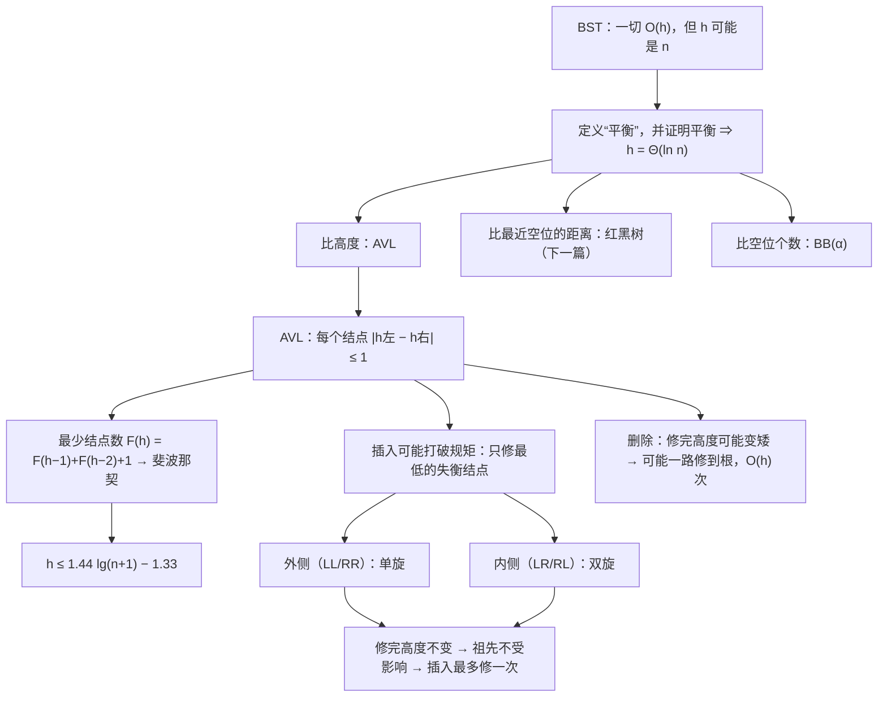

# C6.7 平衡与AVL树

> [!abstract] 这一讲的任务
> [[C6.6 二叉搜索树]] 留下的洞是：BST 的所有操作都是 $O(h)$，可它自己完全不管 $h$。
> 这一讲先回答“**平衡到底怎么定义**”，课件给了三种答案：比**高度**（AVL 树）、比**到最近空位的距离**（红黑树）、比**空位的个数**（BB(α) 树）。
> 然后只深入第一种：**AVL 树要求每个结点左右子树的高度差不超过 1**。
> 这一讲要证明两件事：这条规矩**足够强**，能把树高压在 $\Theta(\ln n)$；这条规矩又**足够便宜**，插入破坏了它，只需在一个地方改几个指针（一次**旋转**）就能恢复。

> [!info] 怎么读这份讲义
> 第一、二节是动机和定义，**红黑树、BB(α) 只要认识名字和各自比的是什么**，红黑树下一篇细讲。
> **第四到第八节是主体**：AVL 的定义、树高的证明、两种失衡与两种修正。**失衡分四类（LL/LR/RR/RL）、修正分单旋和双旋**，是必考点。
> 第九、十节是课件的逐帧演示，本篇把几十页动画压成了表格和结果树，**建议先自己在纸上做一遍再对表**。
> 标题末尾写“（补充）”的小节是课件没有、由通行讲法补出的内容。

> [!info] 标注说明与授课进度
> 标有 **（拓展）** 或 **【拓展】** 的内容，是**课堂上没有讲到、由课件和教材延伸补充**的部分。
> **授课进度**：现有转写稿只到第四节课（停在第 3 章栈的扩容），树尚未开讲，本篇按整篇尚未授课理解。

> [!info] 课程信息与来源
> **Ya-Hui Jia（贾雅慧）｜SFT SCUT｜jiayahui@scut.edu.cn**。全课程信息见 [[C1.0 课程信息与C++预备]] 与 [[数据结构 MOC]]。
> 本篇覆盖 `tree_part2` 的 **p.70–207**。这一段**没有布置作业**。
> 课件编号仍是乱的：平衡部分标 **4.9.x**（接在 6.1 的 BST 之后），AVL 部分干脆没有编号。本库按依赖顺序排。



## 目录与课件对应

| 阅读入口 | 课件页码 | 内容 |
| --- | --- | --- |
| [[#零、开场：按学号录入的花名册]]、[[#一、为什么要谈平衡]] | 70–75 | 平均高度、平衡的直观例子 |
| [[#二、平衡的三种定义]] | 76–86 | 高度平衡、空路径长度平衡（红黑树）、权重平衡（BB(α)） |
| [[#三、两个原型例子]] | 87–96 | 3-2-1 和 3-1-2 两条“小链表”怎么扶正 |
| [[#四、AVL 树的定义]] | 97–102 | 定义、1–4 个结点的所有形状、42 个结点的例子 |
| [[#五、AVL 树有多高]] | 103–109 | 最少结点数的递推、斐波那契、1.44 倍 |
| [[#六、插入之后哪里会坏]] | 110–126 | 高度变化沿路径传播、只修最低的失衡结点 |
| [[#七、情况一：外侧失衡，单旋]] | 127–138 | 通用图、三组例子、指针改动 |
| [[#八、情况二：内侧失衡，双旋]] | 139–153 | 单旋为什么不行、拆出 d、指针改动 |
| [[#九、四种情况汇总]] | 154 | LL/LR/RR/RL |
| [[#十、插入演示：连插八个数]] | 155–191 | 73, 77, 76, 80, 74, 64, 55, 70 |
| [[#十一、删除]] | 192–203 | 删 1 引发连续三次修正 |
| [[#十二、AVL 树能用数组存吗]] | 204–206 | $n^{1.44}$ 的空间 |
| [[#十三、课件勘误与阅读边界]] | 全部 | |

## 零、开场：按学号录入的花名册

教务系统要把新生花名册建成一棵 BST，方便按学号查人。新生名单是从 Excel 导出来的——**已经按学号排好了序**。

> [!question] 停一下，先自己想想
> 按 202601、202602、202603…… 的顺序往一棵空 BST 里插 3000 个学号，树长什么样？查最后一个学号要比较几次？

每个新学号都比已有的都大，于是永远挂在最右边。[[C6.6 二叉搜索树]] 7.1 节已经算过：这棵树退化成一条**向右的链表**，高度 2999，查最后一个人要比较 3000 次。和一个没排序的链表没有任何区别。

而**有序输入恰恰是最常见的输入**：导出的表格、自增的 ID、按时间先后到达的订单。BST 在最常见的情况下表现最差。

> [!important] 这一讲要的是一条“规矩”
> 我们没法控制数据以什么顺序到达，只能控制**树的形状**。办法是给树立一条规矩，一旦某次插入破坏了它，就当场把树扶正。
> 这条规矩要同时满足两个条件：
> 1. **足够严**：只要规矩成立，树高就一定是 $\Theta(\ln n)$；
> 2. **足够松**：破坏之后修复的代价很小，不能每插一次就把整棵树重排一遍。
>
> 完美树的规矩最严（每层都满），但插一个数就可能要整体重排，太贵。AVL 树找到了中间那个点。

## 一、为什么要谈平衡

### 1.1 运行时间取决于树高（p.71–72）

| 情形 | 树高 |
| --- | --- |
| 最好 | $\Theta(\ln n)$（完美或完全树） |
| 最坏 | $\Theta(n)$（退化成链） |
| 随机插入生成的 BST，平均 | $\Theta(\ln n)$ |
| 随机插入**再**随机删除，长期下去 | 课件说会涨到 $\Theta(\sqrt{n})$ |

最后一行的意思是：删除时总拿**右子树最小值**顶替（[[C6.6 二叉搜索树]] 5.5 节），这个不对称的习惯会慢慢让树往一边歪。这是一个经验性质的结论（Eppinger 1983 的模拟、Culberson 1985 的分析），课件只给了结论，本篇不展开证明。

> [!note] 平均情况救不了我们
> 即使平均高度是 $\Theta(\ln n)$，也不能保证**每一次**都快；而且正如开场所说，现实里的输入经常不是随机的。所以课件的要求是（p.72）：**运行时间永远不能落进 $\omega(\ln n)$**，也就是树高必须**始终**保持在 $\Theta(\ln n)$。

### 1.2 什么叫“平衡”：直觉（p.73–75）

- **完美二叉树**：每个结点左右两边的后代一样多，显然平衡。**链表**显然不平衡。
- p.74 的例子：根的一边很重、另一边很轻，大家都会说“根不平衡”。
- p.75 的例子更微妙：**根**看起来左右差不多，但它的**左子树**内部歪得厉害。

> [!important] p.75 的教训：平衡必须对每个结点都成立
> 只看根是不够的。一棵“根平衡、子树歪”的树，照样可以很高。所以后面所有的定义都是**递归的**：不仅根要平衡，每棵子树也要平衡。

## 二、平衡的三种定义

课件 p.76 列出三种可以量化的比法，**每一种都要另外证明**“满足它 ⇒ 高度是 $\Theta(\ln n)$”：

| 比什么 | 名称 | 代表 | 本课在哪讲 |
| --- | --- | --- | --- |
| 左右子树的**高度** | 高度平衡 height balancing | **AVL 树** | 本篇第四节起 |
| 左右子树的**空路径长度**（从该结点到最近空位的距离） | 空路径长度平衡 null-path-length balancing | **红黑树** | [[C6.8 红黑树]] |
| 左右子树的**空位个数** | 权重平衡 weight balancing | **BB(α) 树** | 本节 2.3，仅介绍 |

p.77 还预告了 **B+ 树**：它也是平衡的，但**不是二叉树**，见 [[C6.10 B+树]]。

> [!warning] p.78–85 页角的红色禁止符号
> `tree_part2` 的 p.78–85（红黑树、权重平衡树这几页）右下角有红色禁止样式符号，和 [[C3.1 栈 Stack]] p.100–102 的符号相同。课件没有说明它的含义。
> 本库的处理和 C3.1 一样：**单凭这个符号不能推断“不考”**。而且红黑树在 p.208 起又有整整 88 页的正式讲解（下一篇），所以红黑树本身显然是要学的；被打标记的可能只是这几页的简介。**以老师课上的说法为准。**

### 2.1 红黑树：先认识三条规则（p.78–79）

每个结点涂成红色或黑色（一个比特就够），要求：

1. **根是黑的**；
2. **红结点的孩子都是黑的**（不能有连续两个红）；
3. **从根走到任何一个空位，路过的黑结点个数都相同**。

由此可以推出：从某个结点出发，经过一棵子树到达空位的最短路径，和经过另一棵子树的最短路径相比，**长的不超过短的两倍**（全黑的路径最短，红黑交替的路径最长，而两者黑结点数相同）。这就是“空路径长度平衡”。

> [!note] 课件 p.79 的两句补充
> - 高度为 $h$ 的完美树，空路径长度是 $h+1$（每条路都要走满 $h+1$ 个结点才出去）。
> - 任何**不完美**的高度为 $h$ 的树，空路径长度都**小于** $h+1$（总有一个空位离根更近）。
>
> 详细的定理、最坏情况、插入算法都在 [[C6.8 红黑树]]。

### 2.2 空位：再复习一次（p.80）

**空位**（empty node / null subtree）是树中**下一次插入可能填上的位置**，也就是所有空指针的位置。[[C6.4 二叉树]] 证明过：**$n$ 个结点的二叉树恰有 $n+1$ 个空位**。p.80 的例子是 9 个结点、10 个空位。

### 2.3 权重平衡：BB(α) 树（p.81–85）

在每个结点处，看左右两棵子树**各占多少比例的空位**：

| 课件页 | 该结点左 / 右 | 评价 |
| --- | --- | --- |
| p.81（根） | 5/10、5/10 | 完全平衡 |
| p.82 | 2/5、3/5 | 还行 |
| p.83 | 4/5、1/5 | 明显偏 |

**BB(α) 树**（bounded balance，$0 < \alpha \le 1/3$）要求：**每个结点处，左右两边的空位比例都落在 $[\alpha,\ 1-\alpha]$ 里**。

- 只有一个结点：两边各 1 个空位，比例都是 $1/2$。
- 两个结点：共 3 个空位，一边 1 个一边 2 个，比例 $1/3$ 和 $2/3$。这就是 $\alpha$ 不能超过 $1/3$ 的原因——否则**两个结点的树都不合法**。

课件 p.85 给出：当
$$\frac14 \le \alpha \le 1-\frac{\sqrt2}{2} \approx 0.2929$$
时，所有操作都能在 $\Theta(\ln n)$ 内完成。

> [!warning] p.85 前半句“α 小于 0.25 时树高可能是 ω(ln n)”站不住
> 只要 $\alpha > 0$ 是一个固定常数，按定义每往下走一层，子树里的空位最多剩 $(1-\alpha)$ 倍，所以深度 $d$ 满足 $(n+1)(1-\alpha)^d \ge 1$，即
> $$h \le \log_{1/(1-\alpha)}(n+1) = \Theta(\ln n).$$
> 也就是说，**任何固定 α 的 BB(α) 树高度都是 Θ(ln n)**，不会是 $\omega(\ln n)$。
> 文献里对 α 取值范围的限制，真正针对的是另一件事：**α 太小或太大时，靠单旋、双旋未必能把失衡修回来**（Nievergelt–Reingold 1973 给出上界 $1-\sqrt2/2$，Blum–Mehlhorn 1980 修正了下界）。课件的后半句“α 大于 $1-\sqrt2/2$ 时维持平衡的代价可能超过 $\Theta(\ln n)$”方向是对的。
> 这一页恰好在带红色禁止符号的范围内，了解即可。

> [!important] 停一下，我们刚才干了什么
> 三种定义比的东西不同，但**结构一样**：都是“每个结点处，左右两边的某个量不能差太多”，而且都要单独证明它能把高度压到 $\Theta(\ln n)$。
> 本课深入的是第一种——**比高度**，因为它最直观，修复手段（旋转）也会在红黑树里原样再用一次。

## 三、两个原型例子

课件在讲 AVL 之前，先用三个结点的小例子演示“扶正”（p.89–96）。**后面所有的旋转，都是这两个例子加上几棵子树。**

**例子一**（p.89–92）：从 3→2 开始，插入 1，得到一条**一路向左**的链 3–2–1。
修法：**把中间的 2 提成根，3 降为 2 的右孩子，1 仍是 2 的左孩子**。结果是一棵以 2 为根的完美树。

**例子二**（p.93–96）：从 3→1 开始，插入 2，得到一条**先左后右**的折线 3–1–2。
修法：**把最下面的 2 直接提成根，1 和 3 分别做它的左右孩子**。结果也是以 2 为根的完美树。

```mermaid
flowchart LR
  subgraph 例子一：一条直线
    A3["3"] --> A2["2"] --> A1["1"]
  end
  subgraph 修正后
    B2["2"] --> B1["1"]
    B2 --> B3["3"]
  end
  subgraph 例子二：一个折角
    C3["3"] --> C1["1"] --> C2["2"]
  end
```

> [!question] 停一下，先自己想想
> 两个例子修完长得一模一样，那它们的区别在哪？

区别在于**谁被提上去**：
- 直线（3–2–1）：提的是**中间**那个结点 2，它原本就在第二层，往上挪一层就行。
- 折角（3–1–2）：中间的 1 不是三个数的中位数，提它上去 3–1–2 仍然歪着；必须把**最下面**那个 2（中位数）一口气提两层。

这就是后面“单旋”和“双旋”的全部区别。**原则只有一条：三个结点里，谁是中位数谁当根**。

## 四、AVL 树的定义

### 4.1 定义（p.97–98）

AVL 树得名于两位苏联数学家 **Adelson-Velskii 和 Landis**（1962）。先回忆高度的约定（本库一直沿用）：

- 空树高度 $-1$；
- 单个结点高度 $0$。

> [!important] 定义：AVL 平衡
> 一棵二叉搜索树是 **AVL 平衡** 的，当且仅当：
> 1. 根的**左右子树高度差至多为 1**；并且
> 2. 左右子树**本身也都是 AVL 树**。
>
> 第 2 条就是 p.75 的教训——平衡必须递归地对每个结点成立。

每个结点的“左高减右高”称为它的**平衡因子**（balance factor），AVL 树里只能是 $-1, 0, 1$。

### 4.2 例子（p.99–102）

p.99：1、2、3、4 个结点的 AVL 树（以 5 为根的几种形状：5；5→7；3←5→7；再在 3 下挂 1）。

p.100–102：一棵 42 个结点的 AVL 树。
- 根的两棵子树高度都是 4，根平衡；
- 任选其他结点（如 AF、BL），左右高度分别是 2 与 3、1 与 2，差都不超过 1。

> [!question] 课堂追问
> 完全二叉树一定是 AVL 树吗？

**一定是**（p.103）。完全树只有最后一层不满，而且最后一层从左往右连续填。任取一个结点，它左右两棵子树要么一样高，要么左边比右边高 1。所以完全 BST 必然 AVL 平衡。反过来当然不成立：AVL 树允许每个结点都“歪一点”，这正是后面计算最坏高度时要利用的。

## 五、AVL 树有多高

这一节回答“规矩够不够严”。思路是反过来问：**高度为 $h$ 的 AVL 树，最少要有几个结点？** 如果最少结点数随 $h$ 指数增长，那么 $n$ 个结点的 AVL 树高度就只能是对数级。

### 5.1 上界容易：完美树（p.103）

高度为 $h$ 的 AVL 树**最多** $2^{h+1}-1$ 个结点（完美树）。难的是下界。

### 5.2 最少结点数的递推（p.104–106）

记 $F(h)$ 为高度 $h$ 的 AVL 树**最少**的结点数。从 p.99 的小例子直接读出：
$$F(0)=1,\quad F(1)=2,\quad F(2)=4.$$

要让结点尽量少，又要高度恰好是 $h$、还要满足 AVL：

- 一边的子树高度必须是 $h-1$（否则整棵树到不了高度 $h$），而且它自己也要尽量少——取**高度 $h-1$ 的最省 AVL 树**；
- 另一边允许比它矮 1，就取**高度 $h-2$ 的最省 AVL 树**；
- 再加上根。

$$
F(h)=\begin{cases}1 & h=0\\ 2 & h=1\\ F(h-1)+F(h-2)+1 & h>1\end{cases}
$$

![[C6-AVL-最少结点树.png]]

### 5.3 解出来是斐波那契（p.106–107）

两边同加 1：
$$F(h)+1 = \bigl(F(h-1)+1\bigr) + \bigl(F(h-2)+1\bigr)$$
所以 $F(h)+1$ 满足斐波那契递推。用 $\mathrm{Fib}(1)=\mathrm{Fib}(2)=1$ 的标准编号，$F(h)+1=\mathrm{Fib}(h+3)$：

| $h$ | 0 | 1 | 2 | 3 | 4 | 5 | 6 | 7 | 8 |
| --- | --- | --- | --- | --- | --- | --- | --- | --- | --- |
| $F(h)+1$ | 2 | 3 | 5 | 8 | 13 | 21 | 34 | 55 | 89 |
| $F(h)$ | 1 | 2 | 4 | 7 | 12 | 20 | 33 | 54 | 88 |

利用斐波那契的通项 $\mathrm{Fib}(k)\approx \phi^k/\sqrt5$（$\phi=\frac{1+\sqrt5}{2}\approx1.6180$ 是黄金比）：
$$F(h)\approx \frac{\phi^3}{\sqrt5}\,\phi^h - 1 \approx 1.8944\,\phi^h - 1,$$
即 $F(h)=\Omega(\phi^h)$：**最少结点数随高度指数增长**。（$\phi^3/\sqrt5 = 4.2361/2.2361 = 1.8944$，已核对。）

### 5.4 反过来就是高度的上界（p.107）

$n$ 个结点的 AVL 树，高度 $h$ 必须满足 $F(h)\le n$，解出
$$h \le \log_\phi\!\left(\frac{n+1}{1.8944}\right) = \log_\phi(n+1) - 1.3277 = 1.4404\,\lg(n+1) - 1.3277.$$

三个常数都核对过：$\log_\phi 1.8944 = 1.3277$，$1/\lg\phi = 1.4404$。

> [!important] 一句话结论
> **AVL 树的高度最多是完全树的约 1.44 倍**。完全树高度 $\lfloor \lg n\rfloor$，AVL 最坏也只是 $1.44\lg n$ 左右。所以 AVL 上的查找、插入、删除都是 $O(\ln n)$。

### 5.5 几个具体的数（p.108–109）

| $n$ | 最矮（完全树 $\lfloor\lg n\rfloor$） | 最高（最大的 $h$ 使 $F(h)\le n$） | 相差 |
| --- | --- | --- | --- |
| 7 | 2 | 3 | 1 |
| 88（p.108） | 6 | 8 | **2** |
| 4096 | 12 | 15 | 3 |
| $10^6$（p.109） | 19 | 27 | 8 |

$n=10^6$ 那一行：$F(27)=832039\le10^6<F(28)=1346268$，所以最高 27；课件写的“$<28$”对。最矮那一栏课件写成 $\log_2(10^6)-1\approx19$，结果对，但式子不严谨，直接写 $\lfloor \lg 10^6\rfloor = 19$ 更干净。

> [!warning] p.107 的“n = 3 时可以高到两倍”对 AVL 不成立
> 3 个结点的 AVL 树只能是完美树（$F(2)=4>3$，高度到不了 2），最矮最高都是 1。程序枚举 $n\le5000$：AVL 最高与最矮高度之比的最大值是 **1.5**，出现在 $n=7$（3 对 2）。
> “两倍”大概是在说普通 BST（3 个结点连成链高度 2，完美树高度 1）。“$n\ge4096$ 时最多差 45%”是渐近的 $1.44$ 的说法，可以接受。

## 六、插入之后哪里会坏

### 6.1 两个观察（p.110）

- 插入一个结点，任何子树的高度**最多增加 1**；
- 删除一个结点，任何子树的高度**最多减少 1**。

所以一次插入之后，平衡因子最多从 $\pm1$ 变成 $\pm2$，不会更糟。

### 6.2 课件的例子树（p.111–126）

```
            36
         /      \
       12        44
      /  \      /  \
     7    17   38   45
    / \     \
   3  10    27
```

| 插入 | 发生了什么 | 课件页 |
| --- | --- | --- |
| 15 | 挂在 17 的左边，17 的高度没变，**谁的高度都没变** | 112–113 |
| 42 | 挂在 38 的右边，38、44 的高度各加 1，但仍然平衡 | 114–115 |
| 23 | 挂在 27 的左边，27、17、12、36 的高度都加 1；**17 和 36 失衡** | 117–119 |
| 6（在插 23 并修好之后） | 3、7、12、36 的高度都加 1；**只有根 36 失衡** | 123–125 |

> [!important] 失衡的必要条件（p.116）
> 一次插入要让某个结点失衡，必须同时满足：
> 1. 插入前，这个结点的两棵子树**已经差 1**；
> 2. 新结点插在**较高**的那一边，并且让那一边**又长高了 1**。
>
> 所以失衡的结点一定在**从新结点到根的路径上**，其他地方的结点一个都不会受影响。

### 6.3 只修最低的那个（p.120–122）

插 23 之后有两个结点失衡：17 和 36。课件的做法是：**只修路径上最低的那个失衡结点（17）**。

修法：把 23 提到 17 的位置，17 做 23 的左孩子，得到 `23(17, 27)`。修完之后，**根 36 自动恢复了平衡**。

> [!question] 停一下，先自己想想
> 为什么修好 17，36 就自己好了？

因为修好之后，以 23 为根的这棵子树的**高度和插入之前 17 那棵子树的高度一样**（都是 1）。对 36 来说，它的左子树高度根本没变——那它当然和插入前一样平衡。
这件事在第七、八节会被严格证明：**两种修正都会让子树恢复到插入前的高度**。这就是 AVL 插入最多只修一次的原因。

> [!note] 顺带一提：插 23 其实是“内侧”情况
> 从 17 往下看：23 在 17 的**右**孩子 27 的**左**边，是一个折角，对应第三节的例子二。所以这里提的是最下面的 23，而不是中间的 27。课件在这里还没引入分类，第八节会讲这种情况的一般做法。

插 6 之后只有根 36 失衡，而且 6 在 36 的**左**孩子 12 的**左**子树里——这是一条直线，对应例子一。课件由此引出一般情况（p.126）。

## 七、情况一：外侧失衡，单旋

### 7.1 设定（p.127–130）

设 $f$ 是**最低的失衡结点**，$b$ 是它的左孩子。插入前：

- $b$ 的两棵子树 $B_L$、$B_R$ 高度都是 $h$，所以 $b$ 的高度是 $h+1$；
- $f$ 的右子树 $F_R$ 高度是 $h$，$f$ 的高度是 $h+2$（左边高 1，平衡）。

现在新值 $a$ 落进 $B_L$，让 $B_L$ 长到 $h+1$。$b$ 仍然平衡（左 $h+1$、右 $h$），但 $b$ 长到了 $h+2$，而 $F_R$ 还是 $h$：**$f$ 失衡**。

因为新结点在 $f$ 的**左**孩子的**左**子树里，这叫 **左-左（LL）失衡**，也叫**外侧**失衡。

p.130 给了 $h=-1, 0, 1$ 三个具体例子，插入的都是 7：

| $h$ | 插入前 | 插入 7 后 |
| --- | --- | --- |
| $-1$ | `17(9, –)` | 7 挂在 9 左边：17–9–7 一条直线 |
| $0$ | `17(9(6,15), 26)` | 7 挂在 6 右边 |
| $1$ | `17(9(6(5,8),15(12,16)), 26(21,29))` | 7 挂在 8 左边 |

### 7.2 修法：把 b 提上去（p.131–135）

就是例子一：**提升 $b$ 到 $f$ 的位置，$f$ 降为 $b$ 的右孩子**。唯一要多想的是 $B_R$ 放哪：

- $B_R$ 里的值满足 $b<x<f$；
- 旋转后 $b$ 的右孩子被 $f$ 占了，而 $f$ 的左孩子（原来是 $b$）空出来了；
- $f$ 的左边正好放“比 $f$ 小、比 $b$ 大”的东西——**$B_R$ 挂到 $f$ 的左边**。

![[C6-AVL-两种修正.png]]

课件的代码（p.132–134，此时 `this` 指向失衡的 $f$；`p_to_this` 指课件里“$f$ 的父亲指向 $f$ 的那个指针”）：

```cpp
AVL_node<Type> *b  = left(),
               *BR = b->right();

b->p_right_tree = this;   // f 成为 b 的右孩子
p_to_this       = b;      // f 原来的父亲改指 b
p_left_tree     = BR;     // B_R 成为 f 的左孩子
```

**只改三个指针**，外加更新 $f$ 和 $b$ 的高度，$\Theta(1)$。

### 7.3 修完的高度（p.135–138）

| 结点 | 修正后的高度 |
| --- | --- |
| $f$ | 左 $B_R$ 高 $h$、右 $F_R$ 高 $h$ → $h+1$ |
| $b$ | 左 $B_L$ 高 $h+1$、右 $f$ 高 $h+1$ → **$h+2$** |

$b$ 是新的子树根，高度 $h+2$，**和插入前 $f$ 的高度一模一样**。所以（p.136）：**这次插入对所有祖先的影响到此为止**，不用再往上查。

p.137 把这个修法用到 6.2 节插 6 的例子上（在 36 处单旋，12 升为根）；p.138 是三个小例子修正后的样子。程序重放的结果：

| $h$ | 修正后 |
| --- | --- |
| $-1$ | `9(7, 17)` |
| $0$ | `9(6(–,7), 17(15,26))` |
| $1$ | `9(6(5,8(7,–)), 17(15(12,16), 26(21,29)))` |
| 6.2 节的插 6 | `12(7(3(–,6),10), 36(23(17,27), 44(38,45)))` |

> [!warning] p.137 右图画错了一处
> 课件右图中，36 的左孩子 23 下面画的是 **38、45**，右孩子 44 下面也画的是 **38、45**。
> 正确的是：**23 的孩子是 17 和 27**（旋转前它们就在 23 下面，单旋根本没动它们），44 的孩子才是 38 和 45。见上表最后一行。

## 八、情况二：内侧失衡，双旋

### 8.1 设定（p.139–141）

同样的初始树，但这次新值 $c$ 满足 $b<c<f$，落进 $B_R$，让 $B_R$ 长到 $h+1$。$f$ 又失衡了。

新结点在 $f$ 的**左**孩子的**右**子树里：**左-右（LR）失衡**，也叫**内侧**失衡。

p.141 的三个例子，插入的都是 14：

| $h$ | 插入前 | 插入 14 后 |
| --- | --- | --- |
| $-1$ | `21(6, –)` | 14 挂在 6 右边：21–6–14 一个折角 |
| $0$ | `21(6(3,18), 26)` | 14 挂在 18 左边 |
| $1$ | `21(6(3(1,5),18(10,19)), 26(24,29))` | 14 挂在 10 右边 |

### 8.2 单旋为什么不行（p.142–144）

照搬情况一，把 $b$ 提上去：$B_L$（高 $h$）留在 $b$ 左边，$f$ 带着 $B_R$（高 $h+1$）和 $F_R$（高 $h$）到了右边，$f$ 的高度是 $h+2$。**$b$ 的左边 $h$、右边 $h+2$，还是失衡**——只是从左边歪变成了右边歪（p.143：“The imbalance is just shifted to the other side”）。

这正是第三节例子二的教训：折角的时候，**中间那个结点不是中位数**，提它没用。

### 8.3 拆开 B_R，把 d 提上去（p.145–150）

把 $B_R$ 再拆一层：它的根叫 $d$，左右子树 $D_L$、$D_R$ 在插入前高度都是 $h-1$。新值落进 $D_L$（叫 $c$）或 $D_R$（叫 $e$）都会造成这种失衡（p.146）。

现在三个结点 $b<d<f$，**中位数是 $d$**。修法就是例子二：**把 $d$ 一口气提到 $f$ 的位置，$b$、$f$ 分别做它的左右孩子**。四棵子树按大小顺序依次挂上：

| 子树 | 值的范围 | 挂到哪里 |
| --- | --- | --- |
| $B_L$ | $x<b$ | $b$ 的左边（不动） |
| $D_L$ | $b<x<d$ | **$b$ 的右边** |
| $D_R$ | $d<x<f$ | **$f$ 的左边** |
| $F_R$ | $x>f$ | $f$ 的右边（不动） |

课件的代码（p.147–150）：

```cpp
AVL_node<Type> *b  = left(),
               *d  = b->right(),
               *DL = d->left(),
               *DR = d->right();

d->p_left_tree  = b;      // b 成为 d 的左孩子
d->p_right_tree = this;   // f 成为 d 的右孩子
p_to_this       = d;      // f 原来的父亲改指 d
b->p_right_tree = DL;     // D_L 挂到 b 的右边
p_left_tree     = DR;     // D_R 挂到 f 的左边
```

**改五个指针**，外加更新三个结点的高度，仍是 $\Theta(1)$。

> [!question] 课堂追问
> 为什么叫“双旋”？代码里明明只有一段。

因为这个效果等价于**先在 $b$ 处做一次向左的单旋**（把 $d$ 提到 $b$ 的位置，折角变直线），**再在 $f$ 处做一次向右的单旋**（把 $d$ 提到 $f$ 的位置）。很多教材就是这么实现的：直接调用两次单旋函数。课件把两步合成了一段指针赋值，结果完全一样。

### 8.4 修完的高度（p.151–153）

- $b$：左 $B_L$ 高 $h$，右 $D_L$ 高 $h-1$ 或 $h$ → $h+1$；
- $f$：左 $D_R$ 高 $h-1$ 或 $h$，右 $F_R$ 高 $h$ → $h+1$；
- $d$：左右都是 $h+1$ → **$h+2$**，又是插入前 $f$ 的高度。

所以和情况一一样，**祖先不受影响**。区别是这次**三个结点的高度都变了**（p.152）。

p.153 三个例子修正后（程序重放，与课件图一致）：

| $h$ | 修正后 |
| --- | --- |
| $-1$ | `14(6, 21)` |
| $0$ | `18(6(3,14), 21(–,26))` |
| $1$ | `18(6(3(1,5),10(–,14)), 21(19,26(24,29)))` |

## 九、四种情况汇总

左边的两种讲完了，右边是镜像（p.154）。以 $f$ 表示最低的失衡结点：

| 名称 | 新结点在哪 | 形状 | 修法 | 谁当新根 |
| --- | --- | --- | --- | --- |
| **LL** | $f$ 的左孩子的左子树 | 外侧 / 直线 | 一次右旋（单旋） | $f$ 的左孩子 |
| **RR** | $f$ 的右孩子的右子树 | 外侧 / 直线 | 一次左旋（单旋） | $f$ 的右孩子 |
| **LR** | $f$ 的左孩子的右子树 | 内侧 / 折角 | 先左旋再右旋（双旋） | $f$ 的左孩子的右孩子 |
| **RL** | $f$ 的右孩子的左子树 | 内侧 / 折角 | 先右旋再左旋（双旋） | $f$ 的右孩子的左孩子 |

p.154 的两个镜像例子（程序核对）：

- **RR**：`36(12(7,23), 57(51(44),73(62,87)))` 插 67 → 在 36 处单旋 → `57(36(12(7,23),51(44)), 73(62(–,67),87))`。
- **RL**：`36(12(7,23), 72(53(44,61),83(–,95)))` 插 67 → 在 36 处双旋，53 当根 → `53(36(12(7,23),44), 72(61(–,67),83(–,95)))`。

> [!tip] 考场上的判断口诀（补充）
> 1. 从新结点往上找，**第一个平衡因子变成 ±2 的结点**就是 $f$；
> 2. 从 $f$ 往新结点走**两步**，记下方向：两步同向（LL/RR）是直线，单旋；两步反向（LR/RL）是折角，双旋；
> 3. 不管单旋双旋，都是**这三个结点里中位数当根**，剩下的子树按从小到大依次挂回去。

## 十、插入演示：连插八个数

课件 p.155–191 在一棵 29 个结点的 AVL 树上连续插入 8 个数。初始树（p.155）：

```
51(30(18(12(–,15),24(21,27)), 42(36(33,39),45(–,48))),
   69(63(57(54,60),66), 87(81(75(72,78),84), 93(90,96))))
```

每一步的结果都用程序按上面的算法重放，与课件的结果树逐一核对：

| 插入 | 最低失衡结点 | 类型 | 提升的结点 | 课件页 |
| --- | --- | --- | --- | --- |
| 73 | 81 | LL | 75 | 156–162 |
| 77 | 87 | LR | 81 | 163–169 |
| 76 | 78 | LL | 77 | 170–173 |
| 80 | 69 | **RL** | 75 | 174–177 |
| 74 | 72 | RR | **73** | 178–181 |
| 64 | — | 不失衡 | — | 182–183 |
| 55 | 69 | LL | 63 | 184–187 |
| 70 | 51（根） | RL | **63** | 188–191 |

> [!warning] 这一段课件有三处文字和图对不上（以图为准）
> - **p.176**：写“A **left-right** imbalance”。p.175 刚说是 right-left，路径 69 → 81（右）→ 75（左）也确实是 **RL**。p.176 是笔误。
> - **p.179**：页面文字框底部被截掉的一行是“75 is that value”，而这一步提升的是 **73**（72 → 73 → 74 一条向右的直线，73 是中间那个）。p.180 的图是对的。
> - **p.189**：同样被截掉的一行是“75 is that node”，p.190 改成了“**63** is that node”。路径 51 → 75（右）→ 63（左），提升的是 **63**。
>
> 后两处在放映时看不到（被图挡住或截在框外），但导出文字时会出现，复习时如果看到别被搞糊涂。

最终结果（p.191，程序核对一致）：

```
63(51(30(18(12(–,15),24(21,27)), 42(36(33,39),45(–,48))), 57(54(–,55),60)),
   75(69(66(64,–),73(72(70,–),74)), 81(77(76,78(–,80)), 87(84,93(90,96)))))
```

> [!question] 停一下，先自己想想
> 插 70 那一步，最低的失衡结点竟然是根 51。为什么这次修正会改变整棵树的根？

因为 $f$ 就是根，提上来的 63 自然成了新根。51 带着整棵左子树降为 63 的左孩子；63 原来的左子树 `57(54(–,55),60)` 按“$b$ 的右边放 $D_L$”的规则挂到了 51 的右边。**旋转是局部操作，但“局部”可以正好是整棵树**。

## 十一、删除

### 11.1 删除为什么更麻烦（p.192）

删除先按普通 BST 的办法删（[[C6.6 二叉搜索树]] 第五节），然后**像插入一样，沿路径往上检查每个结点是否失衡**。

区别在于：插入的修正会让子树**回到插入前的高度**，所以修一次就停；删除的修正却可能让子树**比删除前矮 1**，这个“变矮”会继续往上传，让更上面的结点失衡。**最坏要一路修到根，共 $O(h)$ 次**。

> [!note] 删除时“直线”和“折角”怎么判断
> 删除后，失衡结点 $f$ 较高的那一侧不是“新结点所在的一侧”（根本没有新结点），而是**被删一侧的对面**。看那个较高孩子的哪一边更高：同向就单旋，反向就双旋。**如果那个孩子两边一样高，用单旋**（程序和大多数教材都这样做；双旋在这种情况下会出错）。这一条课件没有明说，是补充。

### 11.2 课件的例子：删 1（p.193–203）

一棵 54 个结点、高度 7 的 AVL 树，删掉最小值 1：

| 步骤 | 失衡结点 | 类型 | 提升 | 课件页 |
| --- | --- | --- | --- | --- |
| 1 | 3（1 的父亲 2 没事，祖父 3 失衡） | RR | 5 | 195–197 |
| 2 | 8 | RL | 11 | 198–200 |
| 3 | 21（根） | RR | 34 | 201–203 |

**一次删除，三次旋转**，每次修完子树都变矮 1，把问题推给了上一层。程序重放的最终结果，根变成 34：

```
34(21(11(8(5(3(2,4),6(–,7)),9(–,10)), 16(13(12,14(–,15)),18(17,19(–,20)))),
      26(23(22,24(–,25)), 31(28(27,30(29,–)),33(32,–)))),
   42(37(35(–,36), 40(38(–,39),41)),
      47(45(43(–,44),46), 52(49(48,51(50,–)),53(–,54)))))
```

> [!warning] p.202–203 的结果图有一棵子树被画错了
> 课件图中 37 的右子树画成了 `39(38, 40(–,41))`，而 p.193–201 里它一直是 **`40(38(–,39), 41)`**。
> 这棵子树在整个删除过程中**完全没有被碰过**（三次旋转分别发生在 3、8、21 处），不应该变。两种画法都是合法的 AVL 子树、高度也一样，所以不影响结论，但它不是这次删除的结果。

p.203 最后说：**大多数删除一次旋转都不需要，需要多次的更少**。$O(h)$ 是最坏情况。

## 十二、AVL 树能用数组存吗

[[C6.5 完美二叉树·完全二叉树与N叉树]] 讲过：完全树可以按层存进数组，$\Theta(n)$ 空间；任意树却可能要 $O(2^n)$ 空间（一条链要占满 $2^n$ 个格子）。AVL 树介于两者之间，要多少（p.204–206）？

最坏的 AVL 树高度约为 $\log_\phi n - 1.3277$，按层存需要 $2^{h+1}-1$ 个格子：
$$2^{\log_\phi n - 1.3277 + 1} = 2^{-0.3277}\cdot 2^{\log_\phi n} = 2^{-0.3277}\, n^{\log_\phi 2} \approx 0.7968\, n^{1.44}.$$

（用到 $2^{\log_\phi n} = n^{\log_\phi 2}$，$\log_\phi2 = 1.4404$，$2^{-0.3277}=0.7968$，都核对过。）

所以是 $O(n^{1.44})$：**比指数好得多，但比链式存储的 $\Theta(n)$ 差**。$n=1000$ 时大约是 2 万个格子对 1000 个结点（p.206 的图），而且每次旋转都要在数组里整块搬子树。**AVL 树用链式存储**。

## 十三、课件勘误与阅读边界

| 位置 | 课件写的 | 实际情况 |
| --- | --- | --- |
| p.85 | α < 0.25 时树高可能是 $\omega(\ln n)$ | 任何固定 $\alpha>0$，BB(α) 树高都 $\le\log_{1/(1-\alpha)}(n+1)=\Theta(\ln n)$。取值范围的真正约束是“旋转能否恢复平衡”。见 2.3 节 |
| p.107 | “With $n=3$ nodes, it can be twice the height” | 3 个结点的 AVL 树只能是完美树；AVL 最高 / 最矮之比最大为 1.5（$n=7$）。见 5.5 节 |
| p.109 | 最矮高度 $\log_2(10^6)-1\approx19$ | 结果对，式子应为 $\lfloor\lg 10^6\rfloor=19$ |
| p.122 | “neither is the root now balanced again, too” | 语病，意思是“根也随之恢复平衡了” |
| p.137 右图 | 23 的孩子画成 38、45 | 应为 **17、27**。见 7.3 节 |
| p.176 | “A left-right imbalance” | 应为 **right-left**（p.175 写对了） |
| p.179（被截掉的一行） | “75 is that value” | 应为 **73** |
| p.189（被截掉的一行） | “75 is that node” | 应为 **63**（p.190 写对了） |
| p.202–203 | 37 的右子树画成 `39(38,40(–,41))` | 未被改动，仍应为 `40(38(–,39),41)`。见 11.2 节 |
| p.192 | “Insertions will only cause one imbalance that must be fixed” | 准确说法是**至多一次**修正（插入可能不引起任何失衡，如 p.112 插 15） |
| p.207 | “Each insertion requires **at least** one correction” | 应为 **at most**。p.112–115 插 15、42，p.182–183 插 64，都不需要修正 |

**阅读边界**：

- 本篇覆盖 `pdfs/tree_part2.pptx` 的 **p.70–207**，全部读过。
- **按帧抽读的页**：p.156–161、163–168、170–172、174–176、178–180、184–186、188–190 是插入演示的逐帧动画（同一棵树、逐步高亮），p.194–202 是删除演示的逐帧动画。这些页都看过，但本篇只把每步的**失衡结点、类型、提升结点和结果树**整理成表，没有逐帧转述。每一步都用程序重放核对。
- p.78–85 右下角有红色禁止样式符号，含义课件未说明，见第二节的提示框。
- **未发现课堂手写批注**。这一段**没有作业**。

## 十四、这一讲的三句话

1. **平衡必须对每个结点递归成立，而且必须被证明能把树高压到 $\Theta(\ln n)$**。AVL 比高度：每个结点左右子树高度差 $\le1$。高度 $h$ 的 AVL 树最少 $F(h)=F(h-1)+F(h-2)+1$ 个结点，$F(h)+1$ 是斐波那契数，所以 $h\le1.44\lg(n+1)-1.33$，**最多是完全树的 1.44 倍**。
2. **插入后只修路径上最低的失衡结点，而且只修一次**：外侧（LL/RR）单旋、内侧（LR/RL）双旋，本质都是“三个结点里的中位数当根，四棵子树按大小挂回去”。修完子树回到插入前的高度，祖先一个都不受影响，代价 $\Theta(1)$。
3. **删除则可能一路修到根**：修正会让子树变矮，失衡往上传，最坏 $O(h)$ 次旋转。但每次旋转仍是 $\Theta(1)$，总代价仍是 $O(\ln n)$。AVL 树不适合用数组存（要 $\Theta(n^{1.44})$ 空间）。

### 四种失衡速查

| 类型 | 判定（从 $f$ 往新结点走两步） | 修法 | 新根 |
| --- | --- | --- | --- |
| LL | 左、左 | 右旋一次 | $f$.left |
| RR | 右、右 | 左旋一次 | $f$.right |
| LR | 左、右 | 双旋 | $f$.left.right |
| RL | 右、左 | 双旋 | $f$.right.left |

### 关键核对值

| 内容 | 结果 | 出处 |
| --- | --- | --- |
| $F(0..8)$ | 1, 2, 4, 7, 12, 20, 33, 54, 88 | p.106，自算延伸 |
| 常数 | $1.8944=\phi^3/\sqrt5$，$1.3277=\log_\phi1.8944$，$1.4404=1/\lg\phi$ | p.107，自算 |
| $n=88$ 高度范围 | 6 到 8 | p.108 |
| $n=10^6$ 高度范围 | 19 到 27 | p.109，自算 |
| p.111 树插 23 | 17、36 失衡，修 17（RL），结果 `23(17,27)` | p.117–122 |
| 再插 6 | 36 失衡（LL），12 成根 | p.123–137 |
| 八次插入的类型 | LL, LR, LL, RL, RR, 无, LL, RL | p.155–191 |
| 八次插入后的根 | 63 | p.191 |
| 删 1 的旋转次数 | 3 次（3 处 RR、8 处 RL、21 处 RR），新根 34 | p.193–203 |
| 数组存储空间 | $\approx0.7968\,n^{1.44}$ | p.205 |

**下一讲预告**：AVL 树每个结点要记一个高度（课件说一个字节），而且删除可能一路旋转到根。有没有一种平衡树，**每个结点只多存一个比特**，而且插入删除的旋转次数更少？代价是树可以歪得更厉害一点——**红黑树**。它比的不是高度，而是“从根走到空位，路过几个黑结点”。见 [[C6.8 红黑树]]。

---

上一篇：[[C6.6 二叉搜索树]] ｜ 前置：[[C6.5 完美二叉树·完全二叉树与N叉树]]、[[C6.4 二叉树]] ｜ 下一篇：[[C6.8 红黑树]] ｜ 返回：[[数据结构 MOC]]
