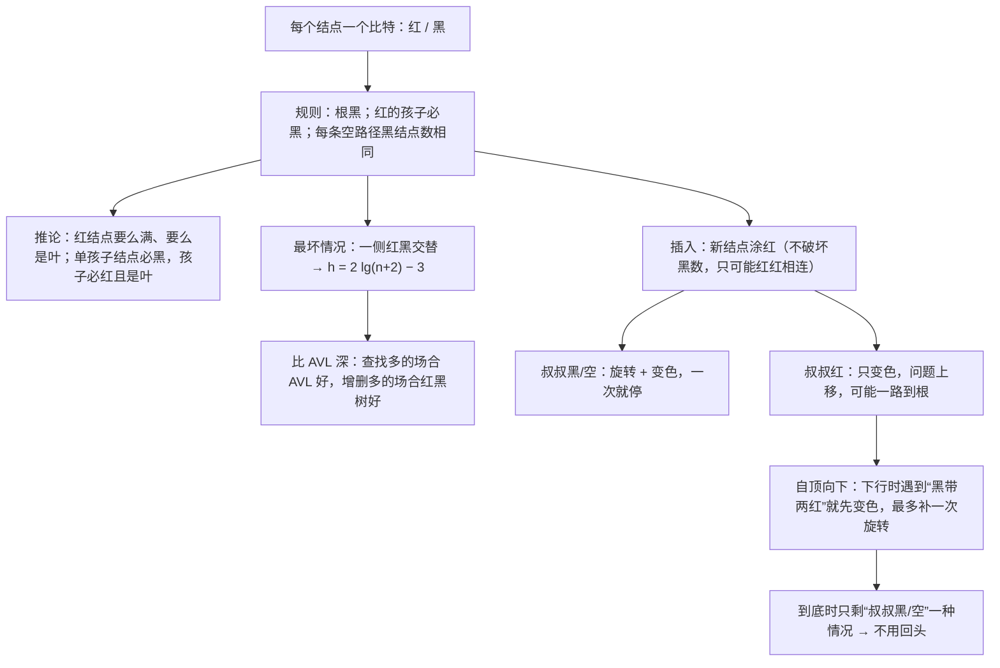

# C6.8 红黑树

> [!abstract] 这一讲的任务
> [[C6.7 平衡与AVL树]] 的 AVL 树每个结点要记一个高度，删除时还可能一路旋转到根。红黑树换了一种思路：**每个结点只多存一个比特——红或黑**，用三条关于颜色的规则间接地限制树高。
> 这一讲要回答三件事：
> 1. 三条颜色规则**为什么能保证树高是 $\Theta(\ln n)$**，最坏能歪到什么程度（答案：约 $2\lg n$，比 AVL 的 $1.44\lg n$ 差）；
> 2. 插入之后怎么修：**要么变色，要么旋转**，而且旋转一次就能停；
> 3. 为什么可以**自顶向下**插入：一边往下找位置，一边提前把隐患排掉，**完全不用回头**。

> [!info] 怎么读这份讲义
> 第一、二节是规则和推论，**三条规则必须背下来**，两条推论（红结点要么满要么是叶；只有一个孩子的结点必黑、孩子必红且是叶）是理解插入的钥匙。
> 第三、四节算最坏树高，思路和 AVL 那一篇完全平行，可以对照着读。
> **第六到第八节是主体**：自底向上插入的两种情况、自顶向下插入的一条规则、两组逐步演示。
> 课件**明确不讲删除**（p.294），本篇第九节只给一段标注为拓展的概述。
> 标题末尾写“（补充）”的小节是课件没有、由通行讲法补出的内容。

> [!info] 标注说明与授课进度
> 标有 **（拓展）** 或 **【拓展】** 的内容，是**课堂上没有讲到、由课件和教材延伸补充**的部分。
> **授课进度**：现有转写稿只到第四节课（停在第 3 章栈的扩容），树尚未开讲，本篇按整篇尚未授课理解。

> [!info] 课程信息与来源
> **Ya-Hui Jia（贾雅慧）｜SFT SCUT｜jiayahui@scut.edu.cn**。全课程信息见 [[C1.0 课程信息与C++预备]] 与 [[数据结构 MOC]]。
> 本篇覆盖 `tree_part2` 的 **p.208–295**（`tree_part2` 到此结束）。这一段**没有布置作业**。
> [[C6.7 平衡与AVL树]] 2.1 节已经预告过红黑树的三条规则（课件 p.78–79，带红色禁止符号的那几页），本篇是正式讲解。



## 目录与课件对应

| 阅读入口 | 课件页码 | 内容 |
| --- | --- | --- |
| [[#零、开场：一个比特能做什么]] | 209 | 与 AVL 的对比动机 |
| [[#一、规则]] | 210–213 | 空路径的定义、三条规则、两个例子 |
| [[#二、两条推论]] | 214–220 | 红结点的形状、单孩子结点的形状 |
| [[#三、小红黑树长什么样]] | 221–224 | 1–7 个结点、完美树与完全树 |
| [[#四、最坏情况有多高]] | 225–238 | 最坏树的构造、递推、$2\lg(n+2)-3$、对照表 |
| [[#五、红黑树与 AVL 树怎么选]] | 239–240 | 空间、深度、旋转次数 |
| [[#六、自底向上插入]] | 241–250 | 新结点涂红、两种情况、递归上行 |
| [[#七、自底向上插入演示]] | 251–266 | 46, 5, 10, 90, 95, 99 |
| [[#八、自顶向下插入]] | 267–293 | 核心观察、同一组插入重做一遍、两种结果对比 |
| [[#九、删除（课件不讲）]] | 294 | |
| [[#十、课件勘误与阅读边界]] | 全部 | |

## 零、开场：一个比特能做什么

回顾 AVL 树为了保持平衡付出的代价：

- 每个结点要存自己的**高度**（课件 p.239 说一个字节，假设高度不超过 255）；
- 插入后要沿路径往上**逐个更新高度**，直到遇到失衡结点；
- 删除可能引起 $O(h)$ 次旋转，**一路修到根**。

> [!question] 停一下，先自己想想
> 如果每个结点只能多存 **1 个比特**，你能用它表达“平衡”吗？一个比特连“左高、一样高、右高”三种状态都装不下。

红黑树的答案是：**不直接记录平衡状态，而是给结点涂颜色，再对颜色的分布立规矩**。规矩本身不提“高度”，但能推出高度的上界。代价是它对平衡的要求比 AVL 松，树可以更歪。

这就是 C++ 标准库里 `std::map`、`std::set` 在主流实现（如 GCC 的 libstdc++）中用的结构（补充）。它们面对的正是**增删频繁**的场景。

## 一、规则

### 1.1 空路径（p.210–211）

课件先定义一个术语：**空路径**（null path）是**从根出发、终点不是满结点的路径**。换句话说，走到一个“至少缺一个孩子”的结点就停，从那里再往下一步就是空位。

p.210 的例子树：

```
            H
        /       \
       C         L
      / \       / \
     B   F     J   P
    /   / \   / \  /
   A   D   G I  K N
        \        / \
         E      M   O
```

非满结点有 B、A、D、E、G、I、K、P、M、O 共 10 个，所以空路径共 **10 条**（p.211）：

| 终点 | 路径 | 终点 | 路径 |
| --- | --- | --- | --- |
| B | H, C, B | I | H, L, J, I |
| A | H, C, B, A | K | H, L, J, K |
| D | H, C, F, D | P | H, L, P |
| E | H, C, F, D, E | M | H, L, P, N, M |
| G | H, C, F, G | O | H, L, P, N, O |

（满结点 H、C、F、L、J、N 不会成为空路径的终点。）

> [!note] 和通行说法的对应（补充）
> 大多数教材的说法是“**从任一结点到其所有后代空位（NIL）的路径上，黑结点数相同**”。课件的“空路径”只从根出发，但因为规则对每棵子树同样成立（见 p.242 的重述），两种说法等价。

### 1.2 三条规则（p.212）

> [!important] 红黑树的定义
> 每个结点涂红色或黑色，并且：
> 1. **根是黑的**；
> 2. **红结点的孩子必须是黑的**（不能有两个红结点直接相连）；
> 3. **每条空路径上的黑结点个数相同**。

p.213 给了两棵例子树（只画颜色、不标值），可以自己数一下每条空路径的黑结点数来验证。

> [!tip] 怎么记（补充）
> 规则 3 保证“**黑的部分是完美平衡的**”；规则 2 保证“**红的只能插空，不能扎堆**”。所以任何一条路径，最多就是在黑结点之间每隔一个塞一个红结点——**最长的路径不超过最短路径的两倍**。这就是 [[C6.7 平衡与AVL树]] 2.1 节说的“空路径长度平衡”。

## 二、两条推论

### 2.1 红结点要么是满结点，要么是叶子（p.214–215）

> [!important] 定理
> 每个红结点要么是**满结点**（两个孩子都是黑的），要么是**叶子**。

**证明**：假设红结点 $S$ 恰有一个孩子 $L$。

- 由规则 2，$L$ 必须是黑的；
- 在 $S$ 处结束的那条空路径（$S$ 缺一个孩子，所以它是非满结点）有 $k$ 个黑结点；
- 任何经过 $L$ 继续往下的空路径，至少多一个黑结点 $L$，有 $\ge k+1$ 个黑结点；
- 与规则 3 矛盾。$\blacksquare$

### 2.2 只有一个孩子的结点（p.216–220）

> [!important] 推论
> 如果结点 $P$ **恰有一个孩子** $C$，那么：
> 1. $C$ 是**红**的；
> 2. $C$ 是**叶子**；
> 3. $P$ 是**黑**的。

逐条证明：

1. **若 $C$ 是黑的**（p.217）：在 $P$ 处结束的空路径比经过 $C$ 的空路径少一个黑结点，违反规则 3。所以 $C$ 红。
2. **若 $C$ 不是叶子**（p.218）：$C$ 是红的，它的孩子不能是红的（规则 2）；也不能是黑的——否则经过那个黑孙子的路径又比在 $P$ 处结束的路径多了黑结点。所以 $C$ 没有孩子。
3. **若 $P$ 是红的**（p.219）：红 $P$ 的孩子 $C$ 也是红的，违反规则 2。所以 $P$ 黑。

p.220 在两棵例子树上圈出了所有单孩子结点，确实都是“黑带一个红叶子”。

> [!question] 课堂追问
> 这条推论对后面的插入有什么用？

它说明**红黑树里“残缺”的地方长得非常规整**：要么是空位，要么是“黑结点下挂一个红叶子”。插入新结点时，它的父亲、祖父、叔叔只可能是有限的几种颜色组合，所以修复规则才能只分两种情况（第六节）。

## 三、小红黑树长什么样

### 3.1 1–7 个结点（p.221–223）

课件画出了 1 到 7 个结点的所有红黑树形状（每种只画了一个代表，镜像、左右互换的不重复画）。p.223 特别强调：**7 个结点的红黑树大多数都很矮**——6 种里有 4 种是高度 2 的完美树，只是颜色不同。

### 3.2 两个现成的例子（p.224）

- **完美树全涂黑**就是红黑树（每条路径黑结点数都是 $h+1$）。
- **完全树**：**最底层涂红、其余全黑**，也是红黑树。最底层可能没填满，但缺孩子的结点都在倒数第二层，它们的空路径和走到红叶子的空路径黑结点数一样。

## 四、最坏情况有多高

思路和 [[C6.7 平衡与AVL树]] 第五节完全一样：**给定树高，最少要多少个结点？**

### 4.1 构造最坏树（p.225–233）

要让树尽量高、结点尽量少，就要有**一条红黑交替的长路径**，其余部分能省则省。

记 $k$ 为每条空路径上的黑结点数。

- $k=1$：黑根下挂一个红孩子，高度 1，**2 个结点**。
- $k=2$：高度 3，**6 个结点**（p.225）。
- $k=3$（p.226–229）：先放一个黑根、一个红孩子，红孩子下面接 $k=2$ 的最坏树。但这样**两个顶端结点的另一侧**（黑根的右边、红孩子的右边）的空路径只有 1 或 2 个黑结点，不合规（p.227）。补救办法：在这两个缺口各挂一棵**全黑的完美树**，补足黑结点数。结果是高度 5、**14 个结点**。
- $k=4$（p.231–233）：同法，高度 7、**30 个结点**。

p.230 指出：高度 5 的最坏红黑树，**根的左子树高 4、右子树高 1**。AVL 树绝不允许这样（差不能超过 1）。所以课件说“这暗示 AVL 树可能更好”。

### 4.2 递推与解（p.234–236）

最坏树的高度是 $h=2k-1$，结点数 $F(k)$ 满足
$$F(1)=2,\qquad F(k) = F(k-1) + 2 + 2\,(2^{k-1}-1).$$

三项分别是：下面接的上一棵最坏树；新加的一黑一红两个结点；补缺口的两棵高度 $k-2$ 的完美树（每棵 $2^{k-1}-1$ 个结点）。

解出来（课件 p.235 用 Maple 解，已手算核对）：
$$F(k) = 2^{k+1} - 2.$$

验证：$F(1)=2$，$F(2)=6$，$F(3)=14$，$F(4)=30$，都和上面的构造一致。

代入 $k = (h+1)/2$，令 $n = F(k)$：
$$n = 2^{(h+3)/2} - 2 \quad\Longrightarrow\quad h_{\text{worst}} = 2\lg(n+2) - 3.$$

对比 AVL 的 $h_{\text{worst}}\approx 1.44\lg n$：**红黑树最坏约 $2\lg n$，更深**。但两者都是 $\Theta(\ln n)$。

> [!note] 这个构造真的是最坏的吗？
> 课件没有证明“这样构造出来的就是结点最少的”。本篇用程序穷举了所有合法的红黑树（按根的颜色、黑高、树高三个参数做动态规划）：高度 1、3、5、7、9 的红黑树最少分别有 **2、6、14、30、62** 个结点，和 $2^{k+1}-2$ 完全一致。所以对奇数高度，课件的构造确实是最省的。

### 4.3 对照表（p.237–238）

p.237 画了两条曲线（$n$ 从 0 到 100），红黑树的最坏高度始终在 AVL 之上。p.238 列出给定高度下最坏树的结点数：

| 高度 | AVL 最坏树 | 红黑树最坏树 |
| --- | --- | --- |
| 1 | 2 | 2 |
| 3 | 7 | 6 |
| 5 | 20 | 14 |
| 7 | 54 | 30 |
| 9 | 143 | 62 |
| 11 | 376 | 126 |
| 13 | 986 | 254 |
| 15 | 2583 | 510 |
| 17 | 6764 | 1022 |
| 19 | 17710 | 2046 |
| 21 | 46367 | 4094 |
| 23 | **121392** | 8190 |
| 25 | 317810 | 16382 |
| 27 | 832039 | 32766 |
| 29 | 2178308 | 65534 |
| 31 | 5702886 | **131070** |
| 33 | 14930351 | 262142 |

AVL 列就是 [[C6.7 平衡与AVL树]] 的 $F(h)=\mathrm{Fib}(h+3)-1$，红黑列是 $2^{(h+3)/2}-2$，全部由程序核对。

> [!warning] p.238 表中高度 23 的 AVL 值印错了
> 课件写 **121492**，应为 **121392**（$\mathrm{Fib}(26)=121393$，减 1）。其余各行都对。
> 课件的结论“131070 个结点的 AVL 树高度 23，红黑树最高可达 31”不受影响：$F_{\text{AVL}}(23)=121392\le131070<F_{\text{AVL}}(24)=196417$，所以 AVL 最高 23；$131070=2^{17}-2$ 恰好是高度 31 的最坏红黑树。

## 五、红黑树与 AVL 树怎么选

| 比较项 | AVL 树 | 红黑树 |
| --- | --- | --- |
| 每个结点的额外空间（p.239） | 一个字节存高度；也可以压到 **2 比特**，只存 $-1/0/1$ 三种平衡状态 | **1 比特**存颜色 |
| 最坏高度 | $\approx1.44\lg n$ | $\approx2\lg n$ |
| 查找多的场景（p.240） | **更好**（树更矮） | 稍差 |
| 插入删除多的场景（p.240） | 旋转更多，而且要**递归回到根** | **更好**（可以自顶向下，不用回头） |

> [!important] 一句话结论
> **AVL 更矮，红黑更省事**。查多改少用 AVL，改得频繁用红黑树。这也是标准库容器普遍选红黑树的原因（补充）。

## 六、自底向上插入

课件讲两种插入（p.241）：**自底向上**（先插到叶子，再往上修）和**自顶向下**（从根往下走的过程中顺手修）。前者用来讲原理，后者是实际用的版本。

### 6.1 新结点为什么涂红（p.242–243）

三条规则里：

- 规则 1、2 是**局部**的，只涉及一个结点和它的邻居；
- 规则 3 是**全局**的：在任何地方新加一个**黑**结点，经过它的所有路径都会多一个黑，**它的所有祖先都跟着不平衡**。

所以新结点**一律涂红**：规则 3 自动保持（黑结点数没变），只可能破坏规则 2（父亲也是红的）。然后**从新结点往根走，修复“红红相连”**。

### 6.2 父亲是黑的：什么都不用做（p.244）

新的红结点挂在黑父亲下面，三条规则全满足，结束。

### 6.3 父亲是红的：看叔叔（p.245–250）

父亲 $P$ 是红的，那么祖父 $G$ 一定是黑的（插入前树是合法的，$P$ 红则 $G$ 不能红）。把 $G$ 的另一个孩子叫**叔叔** $U$。

![[C6-红黑树-插入修正.png]]

**情况一：叔叔是黑的或不存在——旋转**（p.245、p.248）

这就是 AVL 的两种修正原样搬过来：

- $G, P, X$ 一条直线（如 $G$ 左 → $P$ 左 → $X$）：在 $G$ 处**单旋**，$P$ 升上来；
- 一个折角（$G$ 左 → $P$ 右 → $X$）：**双旋**，$X$ 升上来。

然后**新的子树根涂黑，两个孩子涂红**。子树根是黑的，上面不可能再出红红冲突；每条路径的黑结点数也没变。**修完就结束**。

p.245 的两个例子：`C→B→A`（直线）修成 `B(A, C)`，B 黑、A 和 C 红；`C→B→A` 折角（A 在 B 的右边）修成 `A(B, C)`，A 黑。

**情况二：叔叔是红的——变色**（p.246、p.249）

$G$ 是黑的、两个孩子都是红的。**把 $G$ 涂红，$P$ 和 $U$ 涂黑**。每条经过 $G$ 的路径还是恰好一个黑（原来是 $G$，现在是 $P$ 或 $U$），规则 3 保持。

但 $G$ 变红了，如果 $G$ 的父亲也是红的，**红红冲突就被推到了上面两层**（p.246 图上的问号）。把 $G$ 当成新的 $X$，**继续往上检查**（p.249）。

**到根为止**（p.250）：如果最后根被涂成了红色，直接把它涂黑。这会让每条路径都多一个黑结点，规则 3 仍然成立。

> [!question] 停一下，先自己想想
> 情况二可能一直往上传到根，情况一却修一次就停。那一次插入最多要旋转几次？

**最多一次单旋或一次双旋**。因为只要进入情况一，修完就结束；而情况二只变色、不旋转。所以一次插入 = 若干次变色 + 至多一次（单或双）旋转。

> [!warning] p.245 和 p.247 的“祖父只有一个孩子”只在最底层成立
> 课件把情况一描述成“the grandparent has one child (the parent)”。在刚插入的那一层，这是对的：由第二节的推论，叔叔如果存在又是黑的，路径黑数会不等，所以叔叔只能**不存在**。
> 但往上递归时（p.247–248），叔叔完全可以**存在而且是黑的**。p.248 的图里 $E$、$G$ 就是这样的黑叔叔；第七节插 90、插 99 时，叔叔 58、11 也都是黑结点。所以准确的条件是“**叔叔是黑的，或者不存在**”。

## 七、自底向上插入演示

初始红黑树（p.251，每条空路径 3 个黑结点）。下面的表示法里 `R`/`B` 表示颜色，`–` 表示空：

```
20B( 11B( 7B(3R, –), 24R( 14B(–, 17R), 26B ) ),
     55R( 35B( 32B, 39B(–, 42R) ),
          66B( 58B(–, 62R), 77R( 73B(69R, –), 85B(79R, 88R) ) ) ) )
```

> [!warning] 这棵树的根标错了：它不是一棵二叉搜索树
> 根是 20，可左子树里有 **24 和 26**，都比 20 大。只要根的值在 27 到 31 之间（比如 30），整棵树就是合法的 BST。
> 所幸后面插入的 46、5、10、90、95、99 都不在 20 到 26 之间，和根比较的方向不变，**所有演示步骤都不受影响**。本篇程序重放时把根换成了 29.5，结果与课件逐图一致。

依次插入 6 个数（程序重放，与课件每一张图核对）：

| 插入 | 位置 | 发生了什么 | 课件页 |
| --- | --- | --- | --- |
| 46 | 42 的右边 | 父亲 42 红，叔叔（39 的左边）空 → 情况一。39→42→46 是直线，在 39 处单旋：**42 黑，39、46 红** | 252–253 |
| 5 | 3 的右边 | 父亲 3 红，叔叔空 → 情况一。7→3→5 是折角，双旋：**5 黑，3、7 红** | 254–255 |
| 10 | 7 的右边 | 父亲 7 红，叔叔 3 红 → 情况二。**5 变红，3、7 变黑**。5 的父亲 11 是黑的，结束 | 256–257 |
| 90 | 88 的右边 | 叔叔 79 红 → 变色：**85 红，79、88 黑**。85 与父亲 77 红红相连；77 的兄弟 58 黑 → 情况一。66→77→85 是直线，在 66 处单旋：**77 黑，66、85 红** | 258–260 |
| 95 | 90 的右边 | 父亲 90 红，叔叔（88 的左边）空 → 情况一。88→90→95 直线，单旋：**90 黑，88、95 红** | 261–262 |
| 99 | 95 的右边 | 叔叔 88 红 → 变色（90 红）；90 与 85 红红，叔叔 66 红 → 再变色（77 红，66、85 黑）；77 与 55 红红，叔叔 11 黑 → 情况一。20→55→77 直线，**在根处单旋：55 成新根** | 263–266 |

最终结果（p.266）：

```
55B( 20R( 11B( 5R(3B, 7B(–, 10R)), 24R(14B(–, 17R), 26B) ),
          35B( 32B, 42B(39R, 46R) ) ),
     77R( 66B( 58B(–, 62R), 73B(69R, –) ),
          85B( 79B, 90R(88B, 95B(–, 99R)) ) ) )
```

> [!important] 停一下，我们刚才干了什么
> 插 99 那一步最能说明问题：**两次变色把冲突从底层一路推到了根下面，最后一次旋转才终结**。这就是自底向上的缺点——必须先走到底，再**一路走回来**。下一节的自顶向下就是为了消掉这个“回来”。

## 八、自顶向下插入

### 8.1 核心观察（p.267–268）

- **变色**可能引起一连串往上的修正，一直到根；
- **旋转**不会引起任何往上的修正。

那就**在往下走的路上，提前把所有可能引起连锁变色的地方消掉**：

> [!important] 自顶向下插入的规则
> 从根往下找插入位置的过程中，**每遇到一个“黑结点带两个红孩子”，就立刻变色**（它变红，两个孩子变黑）。
> 如果这次变色让它和它的父亲红红相连，就在那里做**一次旋转**（单旋或双旋，同第六节情况一）。这次旋转保证不会给更上面带来问题。
> 如果变色的是根，把根涂回黑。
> 走到底插入新的红结点时，如果父亲是红的，**叔叔一定是黑的或不存在**（红叔叔的情况早在路上被消掉了），所以最多再做一次旋转，结束。

> [!question] 课堂追问
> 为什么路上的那次旋转“保证不会给更上面带来问题”？

因为在往下走的过程中，**上面经过的每个“黑带两红”都已经被处理过了**。刚变红的结点 $X$ 如果和父亲 $P$ 红红相连，$P$ 的兄弟（$X$ 的叔叔）一定是黑的——否则 $X$ 的祖父就是一个“黑带两红”，在走到它的时候就已经被变色了。于是这里只会是情况一，旋转后子树根是黑的，一切在局部结束。

### 8.2 同一组插入，自顶向下重做（p.269–293）

从同一棵初始树出发（程序重放，与课件逐图一致）：

| 插入 | 下行时遇到的“黑带两红” | 到底时 | 课件页 |
| --- | --- | --- | --- |
| 46 | 无（路径 20, 55, 35, 39, 42） | 父 42 红 → 在 39 处单旋 | 270–271 |
| 5 | 无（路径 20, 11, 7, 3） | 父 3 红 → 双旋，5 升上来 | 272–273 |
| 10 | **5**（孩子 3、7 都红）→ 变色；5 的父亲 11 黑，没事 | 父 7 黑，直接插 | 274–276 |
| 90 | **85**（孩子 79、88）→ 变色；85 与 77 红红 → 在 66 处单旋，77 升上来 | 父 88 黑，直接插 | 277–280 |
| 95 | **77**（孩子 66、85）→ 变色；77 与 55 红红 → **在根 20 处单旋，55 成新根** | 父 90 红 → 在 88 处单旋 | 281–285 |
| 99 | **根 55**（孩子 20、77）→ 变色，根变红 → 涂回黑（每条路径多一个黑）；再往下遇到 **90**（孩子 88、95）→ 变色，90 的父亲 85 黑，没事 | 父 95 黑，直接插 | 287–292 |

插 95 时（p.283）课件特意指出：**这次在根处的旋转，自底向上插 95 时是不需要的**。自顶向下是“宁可错杀”：路上见到“黑带两红”就处理，不管这次插入会不会真的走到那一步。

最终结果（p.292）：

```
55B( 20B( 11B( 5R(3B, 7B(–, 10R)), 24R(14B(–, 17R), 26B) ),
          35B( 32B, 42B(39R, 46R) ) ),
     77B( 66B( 58B(–, 62R), 73B(69R, –) ),
          85B( 79B, 90R(88B, 95B(–, 99R)) ) ) )
```

和自底向上的结果比：**形状完全相同，只有 20 和 77 的颜色不同**（这里是黑，自底向上是红）。自顶向下的这棵每条空路径有 **4** 个黑结点（根被涂回黑时全体加了一），自底向上那棵是 3 个。两棵都是合法的红黑树（p.286、p.293）。

> [!warning] p.293 的左右两图标反了
> p.293 说“左边是自底向上、右边是自顶向下”，但**左图**里 20、77 是黑的（这是 p.292 自顶向下的结果），**右图**里 20、77 是红的（这是 p.266 自底向上的结果）。两图位置对调了。p.286 那一组对比是对的。

> [!tip] 两种插入的对比（补充）
>
> | | 自底向上 | 自顶向下 |
> | --- | --- | --- |
> | 走几趟 | 下去一趟，回来一趟 | **只下去一趟** |
> | 旋转次数 | 至多一次（单或双） | 路上可能有几次，每次 $\Theta(1)$ |
> | 需要什么 | 递归栈或父指针 | 只需记住最近的几个祖先 |
> | 结果 | 两种做法得到的树可能不同，但都是合法的红黑树 | |

## 九、删除（课件不讲）

课件 p.294 原话：“Deletion is just crazy. I really do not think I can clearly teach you guys the deletion process. I will give you guys a video and a guideline. Try to understand it by yourself.”

所以**删除不在课堂讲授范围内**，老师会另发视频和指引，以老师给的材料为准。

> [!note] 【拓展】删除的思路，只看个轮廓
> 1. 先按普通 BST 删除（[[C6.6 二叉搜索树]] 第五节）：两个孩子的结点用后继的值替换，问题转化为删掉一个**至多一个孩子**的结点。
> 2. 删掉的是**红**结点：什么都不用做（黑数不变）。
> 3. 删掉的是**黑**结点，且它有一个红孩子：把红孩子涂黑顶上，结束。
> 4. 删掉的是**黑叶子**：这条路径少了一个黑，称为“**双黑**”。根据兄弟的颜色、兄弟孩子的颜色分四种情况处理，有的变色后把双黑往上推，有的旋转后直接结束。
>
> 一次删除**最多三次旋转**，变色可能一路到根。和插入一样，也有自顶向下的版本。这部分细节请以老师发的视频为准。

## 十、课件勘误与阅读边界

| 位置 | 课件写的 | 实际情况 |
| --- | --- | --- |
| p.238 | 高度 23 的 AVL 最坏树有 121492 个结点 | 应为 **121392**。见 4.3 节 |
| p.245、p.247 | 情况一是“祖父只有一个孩子（即父亲）” | 只在最底层成立；往上递归时应为“**叔叔是黑的或不存在**”。见 6.3 节 |
| p.251 起 | 根的值是 20 | 左子树里有 24、26，**不是 BST**。根应在 27–31 之间，不影响演示。见第七节 |
| p.293 | 左图为自底向上、右图为自顶向下 | **两图对调了**。见 8.2 节 |
| p.221–223 | “All red-black trees with 1…7 nodes” | 每种只画了一个代表形状，不含镜像和左右换位，“all”指的是本质不同的形状 |

**阅读边界**：

- 本篇覆盖 `pdfs/tree_part2.pptx` 的 **p.208–295**，全部读过。
- **按帧抽读的页**：p.252–266（自底向上演示）、p.270–292（自顶向下演示）是同一棵树的逐帧动画，每页都看过，但本篇只整理成每步一行的表格和最终结果树。每一步都用程序重放核对。
- p.294 删除页：老师声明不讲，另发视频，本篇只给拓展概述。
- **未发现课堂手写批注**。这一段**没有作业**。

## 十一、这一讲的三句话

1. **红黑树用一个比特的颜色和三条规则（根黑、红不连红、每条空路径黑数相同）间接保证平衡**：最长路径不超过最短路径的两倍。最坏树一侧红黑交替、另一侧挂完美树，结点数 $2^{k+1}-2$，**最坏高度 $2\lg(n+2)-3$**，比 AVL 的 $1.44\lg n$ 深，但仍是 $\Theta(\ln n)$。
2. **插入的新结点一律涂红，只可能造成红红相连**：叔叔黑或空，就旋转（单旋或双旋，和 AVL 一样）再变色，一次结束；叔叔红，就只变色，把问题推上去两层。所以**一次插入最多一次旋转**。
3. **自顶向下插入在下行时见到“黑带两红”就先变色**（必要时补一次旋转），于是到底时只剩“叔叔黑或空”一种情况，**不用回头**。这是红黑树相对 AVL 的最大工程优势：**AVL 更矮适合多查，红黑树更省事适合多改**。

### 插入速查

| 父亲 | 叔叔 | 形状 | 操作 | 之后 |
| --- | --- | --- | --- | --- |
| 黑 | — | — | 什么都不做 | 结束 |
| 红 | 黑或空 | 直线 | 在祖父处单旋，新子树根黑、两孩子红 | 结束 |
| 红 | 黑或空 | 折角 | 双旋，新结点当子树根（黑）、两边红 | 结束 |
| 红 | 红 | 任意 | 祖父变红，父亲和叔叔变黑 | 以祖父为新结点继续向上；到根则涂黑 |

### 关键核对值

| 内容 | 结果 | 出处 |
| --- | --- | --- |
| p.210 例子树的空路径条数 | 10 | p.211 |
| 最坏树结点数 $F(k)$ | $2^{k+1}-2$：2, 6, 14, 30, 62 | p.234–235，穷举核对 |
| 最坏高度 | $2\lg(n+2)-3$；$n=30$ 时 7，$n=131070$ 时 31 | p.233、p.236、p.238 |
| 自底向上六次插入 | 旋转、双旋、变色、变色+旋转、旋转、变色×2+根处旋转 | p.251–266 |
| 自底向上最终根 | 55 | p.266 |
| 自顶向下插 95 | 路上在根处旋转一次，到底再旋转一次 | p.281–285 |
| 两种最终结果的差别 | 形状相同，仅 20、77 的颜色不同；黑高 3 对 4 | p.266 vs p.292 |

**下一讲预告**：AVL 树和红黑树都是**二叉**的，每个结点只存一个值、分出两个岔。如果每个结点存**好几个值**、分出**好几个岔**，树就能更矮更胖——当数据放在磁盘上、每访问一个结点就要读一次磁盘时，“矮”就是一切。这就是**多路搜索树**，它是 B 树和 B+ 树的前身。见 [[C6.9 多路搜索树]]。

---

上一篇：[[C6.7 平衡与AVL树]] ｜ 前置：[[C6.6 二叉搜索树]] ｜ 下一篇：[[C6.9 多路搜索树]] ｜ 返回：[[数据结构 MOC]]
