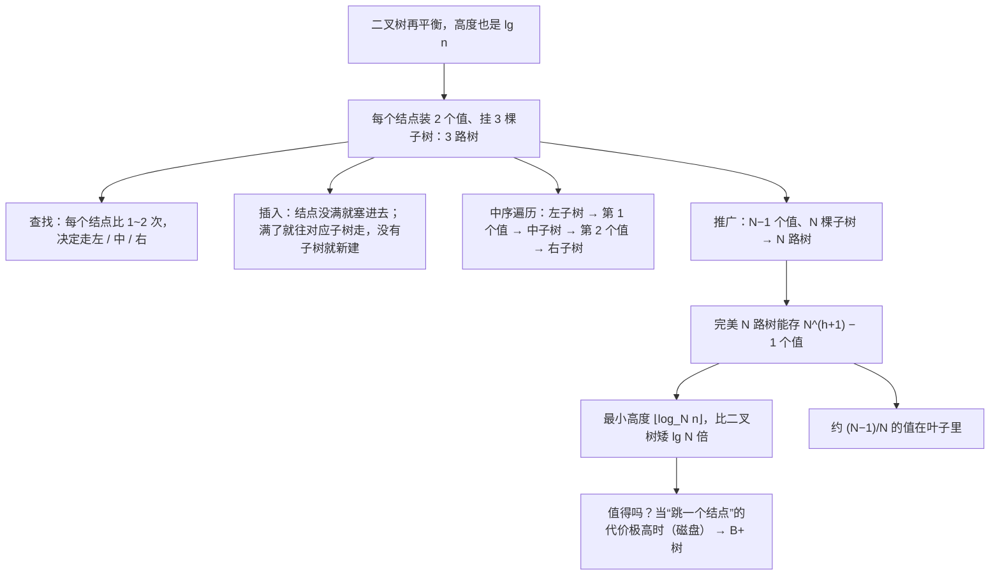

# C6.9 多路搜索树

> [!abstract] 这一讲的任务
> [[C6.7 平衡与AVL树]] 和 [[C6.8 红黑树]] 都在想办法让二叉树别太高。可二叉树再平衡，高度也是 $\lg n$ 级别：一百万个数，至少 19 层。
> 这一讲换个思路：**让每个结点多装几个值、多分几个岔**。一个结点存 $N-1$ 个有序的值、挂 $N$ 棵子树，这就是 **$N$ 路搜索树**。
> 分叉多了，树自然就矮：最小高度从 $\lfloor\lg n\rfloor$ 降到 $\lfloor\log_N n\rfloor$。代价是每个结点里的操作变复杂了。
> 这一讲只讲**定义、查找、插入、中序遍历和容量计算**，不讲平衡。它是下一讲 **B+ 树** 的地基。

> [!info] 怎么读这份讲义
> 第一、二节是 3 路树的定义和代码，第三节是 3 路树的插入演示，**建议先自己在纸上把 14 个数插一遍再对表**。
> 第四节是中序遍历，第五节把 3 路推广到 $N$ 路，第六节算容量和高度，**第六节的公式在 B+ 树那一篇会反复用到**。
> 第七节回答“什么时候值得用多路树”，这是通往 [[C6.10 B+树]] 的桥。
> 标题末尾写“（补充）”的小节是课件没有、由通行讲法补出的内容。

> [!info] 标注说明与授课进度
> 标有 **（拓展）** 或 **【拓展】** 的内容，是**课堂上没有讲到、由课件和教材延伸补充**的部分。
> **授课进度**：现有转写稿只到第四节课（停在第 3 章栈的扩容），树尚未开讲，本篇按整篇尚未授课理解。

> [!info] 课程信息与来源
> **Ya-Hui Jia（贾雅慧）｜SFT SCUT｜jiayahui@scut.edu.cn**。全课程信息见 [[C1.0 课程信息与C++预备]] 与 [[数据结构 MOC]]。
> 本篇覆盖 `tree_part3` 的 **p.1–51**，课件编号 6.4.1–6.4.3.4。这一段**没有布置作业**。
> 课件在这里有两种记号混用：$N$ 路树和 $M$ 路树说的是同一件事（p.40 的代码里 `N` 和 `M` 甚至出现在同一页）。本篇统一写 $N$，到 B+ 树那一篇再按课件改用 $M$。



## 目录与课件对应

| 阅读入口 | 课件页码 | 内容 |
| --- | --- | --- |
| [[#零、开场：一次查找要翻几页]] | — | 为什么要更矮的树 |
| [[#一、中序遍历只对搜索树有意义]] | 3 | 普通 $N$ 叉树没有“中间” |
| [[#二、3 路树：定义与实现]] | 4–10 | 结点结构、搜索树条件、`find`、`insert` |
| [[#三、插入演示：连插 14 个数]] | 11–37 | 68, 27, 91, 38, 82, 14, 62, 45, 76, 4, 51, 8, 98, 57 |
| [[#四、中序遍历]] | 38–39 | 代码与结果 |
| [[#五、推广到 N 路树]] | 40–42 | 数组存值和子树指针 |
| [[#六、容量与高度]] | 43–49 | $N^{h+1}-1$、叶子占比、最小高度、8 路树例子 |
| [[#七、多路树值不值得]] | 50–51 | 优缺点与适用条件 |
| [[#八、课件勘误与阅读边界]] | 全部 | |

## 零、开场：一次查找要翻几页

想象一本 1000 页的字典，每页只印**一个**词，页脚写着“比这个词小的去第 x 页，大的去第 y 页”。按这个指引查一个词，平均要翻十来次。

> [!question] 停一下，先自己想想
> 如果每页印 **100 个**词（按字母排好），页脚写着 101 个“去第几页”，查一个词要翻几次？

每翻一页能把范围缩到 1/101，而不是 1/2。一百万个词只要翻 **3 次**左右（$101^3 \approx 10^6$）。

> [!important] 这一讲的核心换算
> **在一页里多比较几次，换来少翻很多页**。
> 如果“翻页”很便宜（数据在内存里），这笔交易不划算——一页里比 100 次，比二叉树多比好几倍。
> 如果“翻页”极贵（数据在**磁盘**上，翻一页要等 10 毫秒），这笔交易就极其划算。下一讲会算清楚这笔账。

## 一、中序遍历只对搜索树有意义

课件开篇（p.3）先重申一件 [[C6.3 树的遍历]] 讲过的事：**中序遍历只对二叉搜索树有意义**，对一般的 $N$ 叉树没有意义。

原因很直接：中序遍历的意思是“左子树 → 自己 → 右子树”，前提是**孩子分左右、自己夹在中间**。普通的 $N$ 叉树（比如一个结点有 3 个孩子）里，“自己”应该插在第几个孩子后面，没有定义。

这一讲要做的，就是给多叉的树**定义出“中间”**：让结点里存多个值，**每个值恰好夹在两棵子树之间**。这样中序遍历就又有意义了。

## 二、3 路树：定义与实现

### 2.1 结点长什么样（p.4–5）

一个结点存**两个值** $a<b$，挂**三棵子树**：

```
        [ a | b ]
       /    |    \
    左子树  中子树  右子树
```

课件的结点类（p.5、p.7）：

```cpp
template <typename Type>
class Three_way_node {
    Three_way_node *p_left_tree;
    Type            first_value;
    Three_way_node *p_middle_tree;
    Type            second_value;
    Three_way_node *p_right_tree;

    int num_values;   // 1 或 2
    // ...
};

template <typename Type>
bool Three_way_node<Type>::full() const {
    return num_values == 2;
}
```

> [!note] 成员的排列顺序是有意的
> 指针和值**交替排列**：左指针、第一个值、中指针、第二个值、右指针。这正好是中序遍历的顺序，也是“每个值夹在两棵子树之间”的直观写照。

### 2.2 搜索树条件（p.6–7）

> [!important] 3 路搜索树的定义
> 1. 结点里的第一个值**小于**第二个值；
> 2. 所有子树都是 3 路搜索树；
> 3. **左子树**里的值都小于第一个值；
> 4. **中子树**里的值都在两个值之间；
> 5. **右子树**里的值都大于第二个值。

另外一条约定（p.7）：**如果结点只有一个值，它的三棵子树都是空的**。第二个值来了会先塞进这个结点，而不是去建子树。所以在这种插入方式下，**只有装满的结点才会有孩子**。

### 2.3 查找（p.8）

```cpp
template <typename Type>
Three_way_node<Type> *Three_way_node<Type>::find( Type const &obj ) const {
    if ( !full() ) {
        return ( first() == obj ) ? this : nullptr;   // 课件此处返回 bool，见勘误
                                                      // （严格说 const 成员里的 this 是 const 指针，返回类型也应带 const）
    }

    if ( (obj == first()) || (obj == second()) ) {
        return this;
    } else if ( obj < first() ) {
        return (  left() == nullptr) ? nullptr :   left()->find( obj );
    } else if ( obj > second() ) {
        return ( right() == nullptr) ? nullptr :  right()->find( obj );
    } else {
        return (middle() == nullptr) ? nullptr : middle()->find( obj );
    }
}
```

逻辑和 BST 的查找（[[C6.6 二叉搜索树]] 3.4 节）一模一样，只是每个结点最多比两次、分三个方向。

### 2.4 插入（p.9–10）

```cpp
template <typename Type>
bool Three_way_node<Type>::insert( Type const &obj ) {
    if ( !full() ) {                     // 只有一个值：直接塞进本结点
        if ( obj == first() ) {
            return false;                // 重复
        } else if ( obj < first() ) {
            second_value = first();
            first_value  = obj;
        } else {
            second_value = obj;
        }
        num_values = 2;
        return true;
    }

    if ( obj == first() || obj == second() ) {
        return false;                    // 重复
    }

    if ( obj < first() ) {
        if ( left() == nullptr ) {
            p_left_tree = new Three_way_node( obj );
            return true;
        } else {
            return left()->insert( obj );
        }
    } else if ( obj > second() ) {
        // 同上，换成右子树
    } else {
        // 同上，换成中子树
    }
}
```

规则一句话：**结点没满就塞进去（保持有序）；满了就按大小去对应的子树，子树不存在就新建一个只含这个值的结点**。

课件最后说（p.10）：**删除更复杂，情况多得多**，本课没有展开。

## 三、插入演示：连插 14 个数

从空树开始，依次插入 68, 27, 91, 38, 82, 14, 62, 45, 76, 4, 51, 8, 98, 57（p.11–37）：

| 插入 | 走的路 | 结果 | 课件页 |
| --- | --- | --- | --- |
| 68 | 空树 | 根 `[68 –]` | 11 |
| 27 | 根没满 | 根 `[27 68]` | 12–13 |
| 91 | $91>68$ | 新建右子树 `[91 –]` | 14–15 |
| 38 | $27<38<68$ | 新建中子树 `[38 –]` | 16–17 |
| 82 | $82>68$，右子树没满 | 右子树变 `[82 91]` | 18–19 |
| 14 | $14<27$ | 新建左子树 `[14 –]` | 20–21 |
| 62 | $27<62<68$，中子树没满 | 中子树变 `[38 62]` | 22–23 |
| 45 | 中子树，$38<45<62$ | 新建 `[38 62]` 的中子树 `[45 –]` | 24–25 |
| 76 | $76>68$，右子树，$76<82$ | 新建 `[82 91]` 的左子树 `[76 –]` | 26–27 |
| 4 | $4<27$，左子树没满 | 左子树变 `[4 14]` | 28–29 |
| 51 | 中 → 中，`[45]` 没满 | 变 `[45 51]` | 30–31 |
| 8 | $8<27$，左子树，$4<8<14$ | 新建 `[4 14]` 的中子树 `[8 –]` | 32–33 |
| 98 | $98>68$，右子树，$98>91$ | 新建 `[82 91]` 的右子树 `[98 –]` | 34–35 |
| 57 | 中 → 中 → `[45 51]`，$57>51$ | 新建 `[45 51]` 的右子树 `[57 –]` | 36–37 |

最终的树（p.37）：

```
                         [27 | 68]
            /                |                 \
       [4 | 14]          [38 | 62]           [82 | 91]
           |                 |               /       \
         [8]             [45 | 51]         [76]      [98]
                                 \
                                 [57]
```

> [!question] 停一下，先自己想想
> 这棵树装了 14 个值、高度 3。一棵装 14 个值的**完美** 3 路树能有多矮？

完美 3 路树高度 $h$ 最多装 $3^{h+1}-1$ 个值：$h=1$ 装 8 个，$h=2$ 装 26 个。所以 14 个值**最矮高度 2**（第六节会推出一般公式）。这棵树高 3，比最优多了一层。

原因和 BST 一样：**这种插入方式完全不管平衡**。值按什么顺序来，树就长成什么样。如果按 1, 2, 3, … 的顺序插，它也会退化成一条链（每个结点两个值的链）。**下一讲的 B+ 树会给多路树加上平衡规则。**

## 四、中序遍历

### 4.1 代码（p.38）

```cpp
template <typename Type>
void Three_way_node<Type>::in_order_traversal() const {
    if ( !full() ) {
        cout << first();                 // 只有一个值 ⇒ 没有孩子
    } else {
        if ( left() != nullptr ) {
            left()->in_order_traversal();
        }

        cout << first();

        if ( middle() != nullptr ) {
            middle()->in_order_traversal();
        }

        cout << second();

        if ( right() != nullptr ) {
            right()->in_order_traversal();
        }
    }
}
```

`!full()` 那个分支之所以只输出一个值、不管孩子，靠的就是 2.2 节那条约定：**只有一个值的结点没有孩子**。

### 4.2 结果（p.39）

对第三节的树做中序遍历：

$$4\ \ 8\ \ 14\ \ 27\ \ 38\ \ 45\ \ 51\ \ 57\ \ 62\ \ 68\ \ 76\ \ 82\ \ 91\ \ 98$$

**严格递增**，这就是“搜索树”的标志——和 [[C6.6 二叉搜索树]] 里“中序遍历有序 ⟺ 是 BST”完全对应。

> [!tip] 手工做中序遍历的办法（补充）
> 课件 p.39 用一条红线“绕树一周”：从根的左边出发，贴着每个结点的轮廓走，**每经过一个值的正下方就把它写下来**。这和 [[C6.3 树的遍历]] 里二叉树的“绕树一周”是同一个办法，只不过现在一个结点下面有两个“缝”可以经过。

## 五、推广到 N 路树

### 5.1 结点（p.40–41）

把“两个值、三棵子树”推广成“$N-1$ 个值、$N$ 棵子树”，写成数组：

```cpp
template <typename Type, int N>
class Multiway_node {
    private:
        int            num_values;
        Type           elements[N - 1];
        Multiway_node *subtrees[N];      // 课件漏写了成员名，见勘误
    public:
        Multiway_node( Type const & );
        // ...
};

template <typename Type, int N>
bool Multiway_node<Type, N>::full() const {
    return ( num_values == N - 1 );
}

template <typename Type, int N>
Multiway_node<Type, N>::Multiway_node( Type const &obj ):
num_values( 1 ) {
    elements[0] = obj;

    // 所有子树都是空的
    for ( int i = 0; i < N; ++i ) {
        subtrees[i] = nullptr;
    }
}
```

### 5.2 中序遍历（p.42）

```cpp
template <typename Type, int N>
void Multiway_node<Type, N>::in_order_traversal() const {
    if ( empty() ) {
        return;
    } else if ( !full() ) {
        for ( int i = 0; i < num_values; ++i ) {
            cout << elements[i];
        }
    } else {
        for ( int i = 0; i < N - 1; ++i ) {
            if ( subtrees[i] != nullptr ) {
                subtrees[i]->in_order_traversal();
            }
            cout << elements[i];
        }

        if ( subtrees[N - 1] != nullptr ) {        // 课件漏了这个判空，见勘误
            subtrees[N - 1]->in_order_traversal();
        }
    }
}
```

规律：**子树 0、值 0、子树 1、值 1、……、值 $N-2$、子树 $N-1$**，子树和值交替，子树比值多一个。

## 六、容量与高度

### 6.1 高度为 h 的 N 路树最多装多少个值（p.43–45）

先看完美 3 路树（p.44）：

| $h$ | 最多装的值 | 公式 |
| --- | --- | --- |
| 0 | 2 | $3^1-1$ |
| 1 | 8 | $3^2-1$ |
| 2 | 26 | $3^3-1$ |
| 3 | 80 | $3^4-1$ |

猜出一般形式：**高度 $h$ 的完美 $N$ 路树最多装 $N^{h+1}-1$ 个值**。$N=2$ 时就是完美二叉树的 $2^{h+1}-1$，对得上。

证明（p.45）：完美 $N$ 叉树高度 $h$ 有
$$1+N+N^2+\cdots+N^h=\frac{N^{h+1}-1}{N-1}$$
个**结点**（[[C6.5 完美二叉树·完全二叉树与N叉树]] 第三节），每个结点装 $N-1$ 个值，相乘：
$$\frac{N^{h+1}-1}{N-1}\cdot(N-1)=N^{h+1}-1.$$

### 6.2 绝大多数值在叶子里（p.46）

完美 $N$ 路树的叶子有 $N^h$ 个，每个装 $N-1$ 个值。叶子里的值占总数的比例：
$$\frac{N^h(N-1)}{N^{h+1}-1}\approx\frac{N^h(N-1)}{N^{h+1}}=\frac{N-1}{N}.$$

| $N$ | 叶子里的值占比 |
| --- | --- |
| 2（二叉树） | 约 50% |
| 8 | 约 87.5% |
| 100 | 约 99% |

> [!important] 这个比例是 B+ 树的伏笔
> 分叉越多，**几乎所有数据都在最底层**，上面那些层只是“路标”。既然如此，何不干脆**把数据全挪到叶子里，上面只放路标**？这就是 B+ 树的核心想法（[[C6.10 B+树]] 第三节）。

### 6.3 最小高度（p.47）

$n$ 个值的 $N$ 路树，**最小高度是 $\lfloor\log_N n\rfloor$**。

它和“能装下 $n$ 个值的最矮完美树”一致：要 $N^{h+1}-1\ge n$，即 $h\ge\lceil\log_N(n+1)\rceil-1$，而对正整数 $n$ 这两个式子相等（程序对 $N=2..11$、$n\le3000$ 逐一验证过）。

$N$ 越大，树越矮：$\log_N n=\dfrac{\lg n}{\lg N}$，**比二叉树矮 $\lg N$ 倍**（[[C6.5 完美二叉树·完全二叉树与N叉树]] 里 $N$ 叉树的同一个结论）。p.47 画了 $N=2,3,\ldots,20$、$n$ 到一百万的曲线：二叉树最高约 19，20 路树只有 4 左右。

### 6.4 8 路树对二叉树（p.48）

同样装 **511** 个值：

| | 高度 | 结点数 |
| --- | --- | --- |
| 完美 8 路树 | **2** | $1+8+64=$ **73** |
| 完美二叉树 | **8** | **511** |

（$8^3-1=511=2^9-1$，已核对。）

### 6.5 一棵 8 路搜索树（p.49）

```
根: [6 15 72 73 93 95 98]
 ├─ 6 左边  → [2 5]
 ├─ 15..72  → [18 21 39 41 64 68 71]
 │              ├─ 21..39 → [23 27 33 37]
 │              ├─ 41..64 → [45 48 52 58 59 60 62]
 │              │              ├─ 45 左边 → [42]
 │              │              └─ 52..58  → [55 57]
 │              └─ 64..68 → [67]
 └─ 73..93  → [75 78 80 86 89 90 92]
                └─ 80..86 → [81 83]
```

课件提了三个问题：

> [!question] 课堂追问一：怎么判断 43 在不在树里？

在每个结点里**二分查找**（p.49 强调了这一点，结点里的值是有序数组），决定走哪棵子树：
1. 根：$15<43<72$ → 走第 3 棵子树 `[18 21 39 41 64 68 71]`；
2. $41<43<64$ → 走 `[45 48 52 58 59 60 62]`；
3. $43<45$ → 走第 1 棵子树 `[42]`；
4. $43>42$，而 `[42]` 没有孩子 → **不在**。

> [!question] 课堂追问二：这些值是按什么顺序插进去的？

按第二节的插入规则，**一个结点装满之前不会有孩子**。所以：
- 根的 7 个值最先插入（它们之间的先后顺序无法确定）；
- 每个子结点里的值，都在它父结点装满**之后**才插入；
- 例如 `[42]` 一定在 `[45 48 52 58 59 60 62]` 装满之后插入，而后者又在 `[18 21 …]` 装满之后。

答案不唯一，但任何合法顺序都必须满足“**父结点先满，孩子才出现**”。

> [!question] 课堂追问三：怎么删除一个值？

课件没有给答案（p.10 只说“复杂得多”）。思路和 BST 删除类似：删的是**叶子结点里的值**，直接从数组里拿掉；删的是**有孩子的结点里的值**，要用相邻子树里的前驱或后继顶替，并且要小心“只有装满的结点才能有孩子”这条约定会不会被破坏。B+ 树把这件事做成了合并与重分配（[[C6.10 B+树]] 第八节）。

## 七、多路树值不值得

课件 p.50 的结论：

| | |
| --- | --- |
| **优点** | 从根到任何结点的路径更短 |
| **缺点** | 更复杂：每个结点里要做二分查找、数组插入 |
| **什么时候值得** | 当**“从一个结点跳到另一个结点”的代价占绝对主导**时 |

> [!important] 停一下，我们刚才干了什么
> 在内存里，“跳一个结点”就是读一个指针，几纳秒；在结点里多比几次，代价相当。所以内存里的平衡树（AVL、红黑树）用二叉就够了。
> 但如果每个结点放在**磁盘的一个块**上，“跳一个结点”意味着**读一次磁盘，约 10 毫秒**，比内存慢上千万倍（[[C6.10 B+树]] 第一节）。这时候，在一个结点里比 500 次也比多读一次磁盘划算得多。
> **多路树真正的主场是磁盘。**

## 八、课件勘误与阅读边界

| 位置 | 课件写的 | 实际情况 |
| --- | --- | --- |
| p.8 | `find` 返回类型写作 `Three_way_node *`；未满时 `return ( first() == obj );` | 返回类型应为 `Three_way_node<Type> *`；未满分支返回的是 `bool`，类型不匹配，应返回 `this` 或 `nullptr` |
| p.8 | `nulltpr`（两处） | 应为 `nullptr` |
| p.17 | “28 < 38 < 68” | 应为 **27** < 38 < 68（p.16 写对了） |
| p.23 | “27 < 62 < 28” | 应为 27 < 62 < **68**（p.22 写对了） |
| p.26–27 | “we note 68 > 76” | 应为 76 > 68 |
| p.34–35 | “the 81-91 node” | 应为 **82**-91 |
| p.38 | 标题是 In-order Traversals，正文却写“Insertion also becomes much more interesting”；编号 6.4.2.1 | 正文是从 p.9 复制来的，应为中序遍历的说明；编号应为 6.4.2.3（p.39 写对了） |
| p.40 | `Multiway_node *[N];` | 漏了成员名，应为 `Multiway_node *subtrees[N];`（p.41 起用的就是 `subtrees`） |
| p.40 | 同一页 `class Multiway_node<Type, N>` 与 `bool M_ way_node<Type, M>::full()` | 类名和模板参数不一致，应统一为 `Multiway_node<Type, N>`，条件 `num_values == N - 1` |
| p.42 | 最后一行 `subtrees[N - 1]->in_order_traversal();` | 没有判空，最右子树为空时会解引用空指针。应先判断 `subtrees[N - 1] != nullptr` |
| p.45 | “maximum number of **nodes** … is $N^{h+1}-1$” | 应为 **elements**（值的个数）；结点数是 $\frac{N^{h+1}-1}{N-1}$ |
| p.46 | “perfect **M**-way search tree” | 同一页其余地方都用 $N$，记号混用 |

**阅读边界**：

- 本篇覆盖 `pdfs/tree_part3.pptx` 的 **p.1–51**，全部读过。p.11–37 的插入演示每两页一组（先说明、再出图），整理成了第三节的表。
- **未发现课堂手写批注**，没有红色禁止符号，**没有作业**。

## 九、这一讲的三句话

1. **$N$ 路搜索树的每个结点存 $N-1$ 个有序值、挂 $N$ 棵子树，每个值夹在两棵子树之间**，所以查找就是“在结点里二分，决定往哪棵子树走”，中序遍历（子树、值、子树、值……）输出严格递增序列。
2. **高度 $h$ 的完美 $N$ 路树最多装 $N^{h+1}-1$ 个值，最小高度 $\lfloor\log_N n\rfloor$，比二叉树矮 $\lg N$ 倍；而且约 $(N-1)/N$ 的值都在叶子里**。课件这种插入方式不管平衡，照样会长歪。
3. **多一点结点内的比较、换少很多次结点间的跳转**——在内存里不划算，在磁盘上极其划算。这就是下一讲 B+ 树的全部动机。

### 关键核对值

| 内容 | 结果 | 出处 |
| --- | --- | --- |
| 14 次插入后的树高 | 3（最优可到 2） | p.37，自算 |
| 中序遍历 | 4 8 14 27 38 45 51 57 62 68 76 82 91 98 | p.39 |
| 完美 3 路树容量 | 2, 8, 26, 80 | p.44 |
| 叶子占比 | $(N-1)/N$：8 路 87.5%，100 路 99% | p.46 |
| 8 路 $h=2$ 对二叉 $h=8$ | 都是 511 个值；73 个结点对 511 个结点 | p.48 |
| 在 p.49 的 8 路树里找 43 | 根 → `[18…71]` → `[45…62]` → `[42]` → 不在 | 自算 |

**下一讲预告**：把多路树放到磁盘上，要回答三个问题：一个结点该有多大（答案：正好一个磁盘块，4 KiB）；数据放哪（答案：全放叶子，上面只放路标）；怎么保证不长歪（答案：所有叶子同一深度、每个结点至少半满，满了就分裂、空了就合并）。这就是 **B+ 树**，数据库和文件系统的标准索引结构。见 [[C6.10 B+树]]。

---

上一篇：[[C6.8 红黑树]] ｜ 前置：[[C6.5 完美二叉树·完全二叉树与N叉树]]、[[C6.6 二叉搜索树]] ｜ 下一篇：[[C6.10 B+树]] ｜ 返回：[[数据结构 MOC]]
