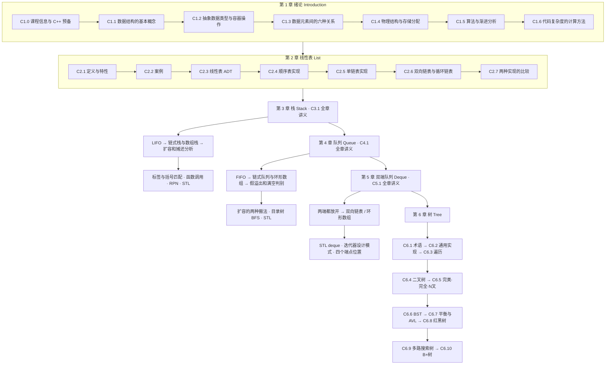

# 数据结构 Data Structure · 课程索引 MOC

> [!info] 课程信息
> **授课**：Ya-Hui Jia（贾雅慧），SFT SCUT ｜ **邮箱**：jiayahui@scut.edu.cn ｜ **课程群**：309044012
> **考核**：Homework + Final Test = 100（比例有两种口径：课件写 **30 + 70**，课堂口述 **40% + 60%**，以群里通知为准）
> **考勤**：日常不点名；督导检查时有形式化考勤，会提前在群里通知
> **难度**：每年约 **30%–40%** 的学生期末不及格（靠平时分通过），这门课很大程度上决定保研资格
> **教材**：Mark Allen Weiss《Data Structures and Algorithm Analysis in C++, 4th Ed.》电子工业出版社
> 详见 [[C1.0 课程信息与C++预备]]

> [!info] 「拓展」标注约定
> 第 1 章各篇笔记中，标有 **（拓展）** 或 **【拓展】** 的内容，是**课堂上没有讲到、由课件与教材延伸补充**的部分。
> **复习优先级**：先掌握未标注的主干内容（课堂讲过 = 考试重点区），行有余力再看拓展部分。
> 第 2 章按现有记录尚未开课，暂不做逐条标注；第 3 章 Stack、第 4 章 Queue、第 5 章 Deque 已各按课件整理为一篇全章讲义，第 6 章 Tree 按课件自带小节拆成多篇，但都没有对应转写稿，实际授课进度待核实。各篇开头有「授课进度说明」或来源说明，补充推导不冒充课堂原话。

## 课程全景

## 笔记索引

### 第 1 章 绪论 Introduction

| 笔记 | 核心内容 | 关键结论 |
| --- | --- | --- |
| [[C1.0 课程信息与C++预备]] | 课程信息、考核、教材；C++ 模板、指针、new/delete | 模板避免为每种类型重写；`new` 配 `delete`，`new[]` 配 `delete[]` |
| [[C1.1 数据结构的基本概念]] | 定义、历史、四层术语、逻辑/物理结构 | 数据结构 = 元素 + 关系；**逻辑结构唯一，物理结构不唯一** |
| [[C1.2 抽象数据类型与容器操作]] | ADT=(D,R,O)、容器六问、CRUD、操作清单 | ADT = 数据结构 + 操作；**减少操作可换取性能** |
| [[C1.3 数据元素间的六种关系]] | 线性序/层次序/偏序/等价关系/弱序/邻接关系 | 六种关系分别对应数组、树、DAG、并查集、排序、图 |
| [[C1.4 物理结构与存储分配]] | 顺序/链式/索引分配；行优先与列优先 | $Loc(i)=L_0+i\times u$ 是随机存取的全部秘密 |
| [[C1.5 算法与渐进分析]] | 算法五特性、四项指标、Landau 符号、Θ 是等价关系 | **硬件解决常数，算法解决增长率** |
| [[C1.6 代码复杂度的计算方法]] | 运算符/控制语句/串行/函数/递归的复杂度计算 | 递推式四步法；$T(n)=T(\frac{n-1}{2})+1=\Theta(\ln n)$ |

### 第 2 章 线性表 List

| 笔记 | 核心内容 | 关键结论 |
| --- | --- | --- |
| [[C2.1 线性表的定义与特性]] | 线性结构定义、术语、三要素 | 首尾唯一、前驱后继各一；空表是线性表 |
| [[C2.2 案例：字母表·花名册·多项式]] | 三个案例；稠密/稀疏多项式；链式相加 | 稀疏用 (系数,指数) 对；相加 $O(m+n)$，和为 0 要删结点 |
| [[C2.3 线性表 ADT]] | 五个基本操作、两种实现的接口对照 | Retrieve（按位置）与 Find（按值）是互逆的两个操作 |
| [[C2.4 顺序表实现]] | SqList 全部代码；插入删除的平均移动次数 | 插入平均 $n/2$（分母 $n+1$），删除平均 $\frac{n-1}{2}$（分母 $n$） |
| [[C2.5 单链表实现]] | 头指针/头结点/首元结点；五个操作；约瑟夫问题 | **先连后断**；$n=8,m=3$ 时第 7 人生还 |
| [[C2.6 双向链表与循环链表]] | DuLNode；插入四步、删除两步 | `p->prior=s` 必须放最后；已知结点删除真 $O(1)$ |
| [[C2.7 两种实现的比较]] | 空间/时间对照表；选型准则；作业 | 查得多用顺序表，改得多用链表 |

### 第 3 章 栈 Stack

| 笔记 | 对应课件 | 核心内容 |
| --- | --- | --- |
| [[C3.1 栈 Stack]] | `pdfs/3.02.Stacks.pdf` p.1–103，课件编号 3.2.1–3.2.6 | 单文件全章讲义；LIFO、链式与数组实现、扩容摊还分析、XHTML/C++ 匹配、调用栈、RPN 逐步求值、STL 和作业 |

**阅读顺序**：接在 C2.7 后阅读 C3.1，文件名沿用本库第 3 章编号；课件中的 3.2 是原有内容编号，不据此重排本库章节。全章按用户要求合为一个 Markdown，以内部目录导航。没有 Stack 转写稿；未确认课堂手写批注，实际授课进度不能由 PDF 判断。

### 第 4 章 队列 Queue

| 笔记 | 对应课件 | 核心内容 |
| --- | --- | --- |
| [[C4.1 队列 Queue]] | `pdfs/3.03.Queues.pptx`（转出 `pdfs/3.03.Queues.pdf`）p.1–48，课件编号 3.3.1–3.3.6 | 单文件全章讲义；FIFO 与别名、链式队列、顺序队列的假溢出、环形数组与满空判别、两种扩容搬法、目录树 BFS 逐帧推演、STL queue、排队论补充、作业 |

**阅读顺序**：接在 C3.1 后阅读 C4.1；课件中的 3.3 是原有内容编号，本库记为第 4 章。同样合为一个 Markdown。没有 Queue 转写稿；p.19 的红圈是课件自带强调，非课堂板书。

### 第 5 章 双端队列 Deque

| 笔记 | 对应课件 | 核心内容 |
| --- | --- | --- |
| [[C5.1 双端队列 Deque]] | `pdfs/3.04.Deques.pptx`（转出 `pdfs/3.04.Deques.pdf`）p.1–33，课件编号 3.4.1–3.4.5 | 单文件全章讲义；Deque ADT 与六个操作、迷宫求解、单调队列、双向链表与环形数组、STL deque 的分段结构、`operator[]` vs `at()`、暴露结点的四条罪状与悬空指针、迭代器设计模式、begin/end/rbegin/rend、迭代器失效 |

**阅读顺序**：接在 C4.1 后阅读 C5.1；课件中的 3.4 是原有内容编号，本库记为第 5 章。**本章重心不在 deque 本身，而在迭代器**——课件自己在小结页也这么说。本章课件**没有作业页**。

### 第 6 章 树 Tree

课件分装在 `tree_part1/2/3.pptx` 三个文件里，共 **620 页**，每个文件内部又打包了若干各有 Outline 与 Summary 的小节。**课件自己的编号 4.x / 5.x / 6.x 是乱的**（`tree_part2` 里 6.1 排在 4.9 之前，而 4.9 是 AVL 的前置），本库统一记为**第 6 章**，按知识依赖顺序编号。

| 笔记 | 对应课件 | 课件编号 | 核心内容 |
| --- | --- | --- | --- |
| [[C6.1 树的概念与术语]] | part1 p.1–35 | 4.1.1–4.1.3 | 定义、度/叶/内部、有序无序、路径深度高度、祖先后代子树、XHTML 与 CSS 后代选择器 |
| [[C6.2 抽象树与通用实现]] | part1 p.36–52 | 4.2.1–4.2.4 | `Simple_tree`（值+父指针+孩子链表）、九个成员函数、`size`/`height` 递归、数组与长子兄弟两种替代表示 |
| [[C6.3 树的遍历]] | part1 p.53–73 | 4.3–4.3.4 | BFS 与 DFS、回溯、每结点两个时机、四问模板、求高度/打印目录/统计磁盘占用三个应用 |
| [[C6.4 二叉树]] | part1 p.74–97 | 5.1–5.1.4 | 定义与左右子树、满结点/空子树/满二叉树、`BinaryNode`、代价取决于树高、Huffman 编码、表达式树、先中后序 |
| [[C6.5 完美二叉树·完全二叉树与N叉树]] | part1 p.98–150 | 5.2–5.4 | 完美树四个定理、完全树及其 $\lfloor\lg n\rfloor$ 高度、**数组存储与下标公式**、N 叉树矮 $\log_2 N$ 倍 |
| [[C6.6 二叉搜索树]] | part2 p.1–69 | 6.1.1–6.1.7 | 有序表 ADT、左小右大、查找/插入（空位即插入点）、**删除三种情况**（两个孩子用右子树最小值顶替）、`BinaryNode*&`、后继与第 k 小、退化成链；两道黑板例题有完整答案 |
| [[C6.7 平衡与AVL树]] | part2 p.70–207 | 4.9.x + AVL（无编号） | 平衡的三种定义（高度 / 空路径长度 / BB(α)）、AVL 最少结点数与斐波那契、$h\le1.44\lg n$、**LL/RR 单旋与 LR/RL 双旋**、八次插入与删除演示、数组存储要 $n^{1.44}$ |
| [[C6.8 红黑树]] | part2 p.208–295 | — | 三条颜色规则与两条推论、最坏高度 $2\lg(n+2)-3$、与 AVL 的取舍、**插入看叔叔（黑→旋转，红→变色）**、自顶向下插入；删除课件不讲 |
| [[C6.9 多路搜索树]] | part3 p.1–51 | 6.4.1–6.4.3.4 | 3 路树的定义、`find`/`insert`、14 个数的插入演示、中序遍历、推广到 $N$ 路、容量 $N^{h+1}-1$、最小高度 $\lfloor\log_N n\rfloor$、叶子占 $(N-1)/N$ |
| [[C6.10 B+树]] | part3 p.52–175 | — | 硬盘按块读写、为 4 KiB 块选 $L=39$ / $M=512$、十亿条记录读 3 次盘、**定义（同深度 + 半满）**、分裂（叶子复制键、内部移键、根分裂长高）、重分配与合并（删根变矮） |

**阅读顺序**：C6.1 → C6.2 → C6.3 → C6.4 → C6.5，之后按表格顺序。**C6.5 按约定合并了课件的三个小节**（完美 / 完全 / N 叉）。tree_part1 的作业分别在 p.73（见 C6.3）和 p.97（见 C6.4）；**C6.1、C6.2、C6.5 三篇课件无作业页**。tree_part2 只有一处作业，在 p.69（见 C6.6）；**C6.7、C6.8 无作业页**。tree_part3 **没有作业页**。

> [!warning] 树这一章的几个陷阱（**考试重灾区**）
> **一、高度与深度的口径**：本课件（及英文教材）**从 0 起算、数边**——根深度 0，单结点树高 0，空树高 −1；**国内教材从 1 起算、数结点**。换算：中文 = 英文 + 1。凡涉及高度的公式，先确认口径。详见 [[C6.1 树的概念与术语]] 第六节。
> **二、“满二叉树”的中英文不对应**：
> | 英文 | 定义 | 国内译名 |
> | --- | --- | --- |
> | full binary tree | 每结点 0 或 2 个孩子，形状可不整齐 | 正则 / 严格二叉树 |
> | **perfect binary tree** | 每层填满 | **满二叉树** |
> | complete binary tree | 最后一层从左连续填 | 完全二叉树 |
>
> 详见 [[C6.4 二叉树]] 3.3 节与 [[C6.5 完美二叉树·完全二叉树与N叉树]] 1.1 节。
>
> **三、tree_part2 的演示页文字与图不一致时，以图为准**：AVL 插入演示 p.176 把 RL 写成 left-right，p.179、p.189 文字框里被截掉的一行写错了提升的结点；p.207 把“插入**至多**修正一次”写成了“至少”；红黑树例子树的根 20 左边挂着 24、26（不是 BST），p.293 两图左右对调。完整勘误见 [[C6.7 平衡与AVL树]] 第十三节、[[C6.8 红黑树]] 第十节。tree_part3 同理：B+ 树例子写“54 条记录”实为 51 条，p.150 把删除写成了“insertion”，见 [[C6.9 多路搜索树]] 第八节、[[C6.10 B+树]] 第十节。

## 高频公式速查

| 公式 | 出处 | 含义 |
| --- | --- | --- |
| $Loc(e_i)=L_0+(i-1)m$ | [[C2.4 顺序表实现]] | 顺序表地址（序号从 1 起） |
| $Loc(i)=L_0+i\times u$ | [[C1.4 物理结构与存储分配]] | 同上（下标从 0 起） |
| $\mathrm{AMN}_{插入}=\frac{1}{n+1}\sum_{i=1}^{n+1}(n-i+1)=\frac n2$ | [[C2.4 顺序表实现]] | 插入平均移动次数 |
| $\mathrm{AMN}_{删除}=\frac1n\sum_{i=1}^{n}(n-i)=\frac{n-1}{2}$ | [[C2.4 顺序表实现]] | 删除平均移动次数 |
| $\sum_{i=0}^{n-1}i=\frac{n(n-1)}2$ | [[C1.6 代码复杂度的计算方法]] | 三角形循环 → $\Theta(n^2)$ |
| $c_1g(n)<f(n)<c_2g(n),\ n>N$ | [[C1.5 算法与渐进分析]] | Θ 的 ε–N 定义 |
| $T(n)=T(n-1)+1\Rightarrow\Theta(n)$ | [[C1.6 代码复杂度的计算方法]] | 阶乘递归 |
| $T(n)=T(\frac{n-1}2)+1\Rightarrow\Theta(\ln n)$ | [[C1.6 代码复杂度的计算方法]] | 二分查找递归 |
| $J(n,m)=(J(n-1,m)+m)\bmod n$ | [[C2.5 单链表实现]] | 约瑟夫问题递推 |

### 栈的扩容公式与核对值

均见 [[C3.1 栈 Stack]]；从空栈连续入栈，不缩容，计数只算搬旧元素。

| 策略或例子 | 公式 / 核对值 | 条件 |
| --- | --- | --- |
| 加 1 | $C(n)=n(n-1)/2$，push 摊还 $\Theta(n)$ | 初始容量 1 |
| 加固定 m | $C(n)=n^2/(2m)-n/2$，push 摊还 $\Theta(n)$ | 初始容量 m，n 为 m 的倍数 |
| 倍增 | $C(n)=n-1$；任意 n 有 $C(n)<2n$，push 摊还 $\Theta(1)$ | 精确等式要求 n 是 2 的幂，初始容量 1 |
| 插入 8 个：加 1 / 加 4 / 倍增 | 28 / 4 / 7 次复制 | 初始容量分别为 1 / 4 / 1 |
| 倍增插入 9 个 | 15 次复制，容量 16，空位 7 | 初始容量 1 |
| RPN 课件大题 | 250，最大栈深 5 | p.80–98；删括号后的另一个式子为 −132 |

### 环形队列公式速查

见 [[C4.1 队列 Queue]]。设容量 $M$，**两套约定不可混用**。

| | 本课件（`iback` = 最后一个元素） | 国内教材（`rear` = 下一个空位） |
| --- | --- | --- |
| 判空 | `queue_size == 0` | `front == rear` |
| 判满 | `queue_size == M` | `(rear + 1) % M == front`（牺牲一格） |
| 队长 | `queue_size` | `(rear - front + M) % M` |
| 推进 | `i = (i + 1) % M` | 同左 |
| 初值 | `ifront = 0, iback = -1` | `front = rear = 0` |

| 核对值 | 数值 | 出处 |
| --- | --- | --- |
| 假溢出例子 | 容量 16，push 16 次、pop 5 次 → size = 11，`ifront=5`、`iback=15`，再 push 越界到 16 | Queue p.23 |
| 搬后段扩容 | 后段 10 个落到新数组 22–31，下次 push 写 6 | Queue p.28 |
| 归一化扩容 | 16 个占 0–15，下次 push 写 16 | Queue p.29 |
| 目录树 BFS 次序 | **A B H C D G I E F J K** | Queue p.33–45 |

> [!warning] Queue 课件口径
> p.26 写「五个选项」只列了四条；p.19 的类声明把 `front()` 误写成 `top()`；p.22 的 `return array[ifront - 1]` 在环形版本下会越界。提纲里的 Queuing theory 无对应幻灯片。逐条见 [[C4.1 队列 Queue]] 第十二节。
> **已订正**：p.6 的「两个异常」**不是遗漏**——`front` 和 `pop` 在空队列上各算一个。对照 [[C5.1 双端队列 Deque]] p.4 的「四个错误」（front/back/pop_front/pop_back）可确认三章用的是同一套数法。

> [!warning] Deque 课件口径
> p.28 两处 `endl` 误写成 `end`（无法编译）；p.11 输出里那个 `0` 是 `operator[]` 越界读到的垃圾值、随后 `at()` 抛 `out_of_range`，同页循环条件 `i <= size()` 应为 `<` 且有符号/无符号比较问题；p.7 的内部结构缩略图在转出 PDF 中无法辨认。逐条见 [[C5.1 双端队列 Deque]] 第十一节。

> [!warning] Stack 课件口径
> p.45 扩容表混用了单次与整串复制的统计口径，详见全章讲义中的原表、反例与统一修正版。p.82、95 的 “Push 1” 分别应为入栈 2、9。不能把倍增的摊还常数时间误读为每次 push 最坏也为常数。

## 课堂强调的几个判断口径

| 问题 | 口径 |
| --- | --- |
| 三个课程目标里哪个当下最不重要 | **Implement（实现）**——有大模型辅助；理解概念才是与模型沟通、调试改进的前提 |
| 数据结构定义里最关键的词 | **efficient**——随便堆也能存取，但不高效 |
| 算法四种描述方式的精确度 | 自然语言（最差，如菜谱"盐少许"）< 流程图/伪代码 < 程序设计语言（最精确） |
| 空间复杂度算什么 | 只算**额外空间 additional memory**，不算数据本身占的 $n$ |
| 大 $O$ 代表什么情况 | **最坏情况**；$\Theta$ 才是确切的阶。报告习惯写 $O$，心里要清楚是 $\Theta$ |
| 多项式 vs 指数 | 计算复杂性理论中的**可计算 / 不可计算**分界线；密码安全性正建立于此 |
| 插入排序 vs 快排图中的颜色 | **蓝线 = 快排，红线 = 插入排序**（按名字猜会看反） |
| 常数倍的算法差距 | 可以**用更快的机器买回来**（1 GHz 跑 $n^2$ ≈ 2 GHz 跑 $2n^2$）；$n^2$ 与 $n\lg n$ 的差距买不回来 |
| 实际运行时间能不能用 | 理论分析上不用；但**大数据/AI 时代实践中越来越常用**（多少 GPU、多少小时、多少钱） |

## 复杂度速查表

| 操作 | 顺序表 | 单链表 | 双链表 |
| --- | --- | --- | --- |
| 按下标取值 | $O(1)$ | $O(n)$ | $O(n)$ |
| 按值查找 | $O(n)$ | $O(n)$ | $O(n)$ |
| 头插/头删 | $O(n)$ | $O(1)$ | $O(1)$ |
| 尾插（有 tail） | $O(1)$ | $O(1)$ | $O(1)$ |
| 已定位后删除 | $O(n)$ | $O(n)$（需找前驱） | **$O(1)$** |
| 存储密度 | 1 | ≈1/3（存 int） | ≈1/5（存 int） |

| 复杂度类 | 名称 | 典型算法 |
| --- | --- | --- |
| $\Theta(1)$ | constant | 数组随机存取 |
| $\Theta(\ln n)$ | logarithmic | 二分查找 |
| $\Theta(n)$ | linear | 顺序查找 |
| $\Theta(n\ln n)$ | n log n | 归并/快排/堆排 |
| $\Theta(n^2)$ | quadratic | 选择/插入/冒泡 |
| $\Theta(n^3)$ | cubic | 朴素矩阵乘法 |
| $2^n,e^n,4^n$ | exponential | 子集枚举 |

### 栈操作补充

| 实现 | top / pop | push 单次最坏 | push 摊还 |
| --- | --- | --- | --- |
| 链式栈，栈顶在头 | $\Theta(1)$ | $\Theta(1)$ | $\Theta(1)$ |
| 倍增数组栈，栈顶在尾 | $\Theta(1)$ | $\Theta(n)$ | $\Theta(1)$ |

条件：按常数成本元素分析；数组不缩容；摊还从空栈、固定初始容量起算。详见 [[C3.1 栈 Stack]]。

### 队列操作补充

| 实现 | `front` / `pop` | `push` 单次最坏 | `push` 摊还 |
| --- | --- | --- | --- |
| 链式队列（头出尾进，有 tail） | $\Theta(1)$ | $\Theta(1)$ | $\Theta(1)$ |
| 定长环形数组队列 | $\Theta(1)$ | 未满 $\Theta(1)$，满则按策略处置 | $\Theta(1)$ |
| 倍增环形数组队列 | $\Theta(1)$ | $\Theta(n)$ | $\Theta(1)$ |

详见 [[C4.1 队列 Queue]]。

### 双端队列操作补充

| 操作 | 双向链表实现 | 环形 / 分段数组实现 |
| --- | --- | --- |
| `front` / `back` | $\Theta(1)$ | $\Theta(1)$ |
| `push_front` / `push_back` | $\Theta(1)$ | 摊还 $\Theta(1)$ |
| `pop_front` / `pop_back` | $\Theta(1)$ | $\Theta(1)$ |
| **随机访问 `[k]`** | **$\Theta(n)$** | **$\Theta(1)$** |

`std::deque` 要求 $\Theta(1)$ 随机访问，**因此不可能是双向链表实现**；通行做法是 map + 固定大小块的分段结构。详见 [[C5.1 双端队列 Deque]]。

### 迭代器速查

| 写法 | 含义 | 注意 |
| --- | --- | --- |
| `begin()` / `end()` | 首元素 / **尾后**位置 | `end()` **不可解引用**；空容器时两者相等 |
| `rbegin()` / `rend()` | 末元素 / 首元素**之前** | 反向迭代器的 `++` 往前端走 |
| `*itr` | 读写当前元素（返回引用） | 越过尾后即未定义行为 |
| `itr1 != itr2` | 位置是否不同 | 循环条件用 `!=` 不用 `<`（链表迭代器不支持 `<`） |
| `at(k)` / `[k]` | 检查 / 不检查越界 | `at` 抛 `out_of_range`，`[]` 越界是 UB |

详见 [[C5.1 双端队列 Deque]] 第七至九节。

## 作业

> [!todo] 作业 #1（第 1 章，已布置）
> **写一个二分查找程序，并画出「比较次数随问题规模增长」的曲线。**
> - 提交到 **QQ 群文件 → `binary search` 子文件夹**
> - C / C++ / Python 均可；**文件名 = 学号 + 扩展名**（如 `2023xxxxxx.py`）
> - **只交程序，不交图表**；截止时间待群内通知
> - 进阶：再写一个拟合/回归算法拟合这条曲线；难点在于**平均情况那条线怎么画**
> - 详见 [[C1.6 代码复杂度的计算方法]] 第八节

> [!todo] 作业 #2（第 2 章，课件已列出）
> LeetCode **No. 2, 53, 80, 83, 92, 169** —— 逐题分析见 [[C2.7 两种实现的比较]]

> [!todo] 作业 #3（Stack，课件已列出）
> LeetCode **20、682、1190**。题意核对、解题路线、代码与复杂度见 [[C3.1 栈 Stack]]；课件未注明本次提交方式与截止日期。

> [!todo] 作业 #5（树的遍历，课件 tree_part1 p.73）
> LeetCode **559、589、590**（均为 N 叉树）。逐题路线见 [[C6.3 树的遍历]] 第八节。

> [!todo] 作业 #6（二叉树，课件 tree_part1 p.97）
> **必做：LeetCode 94、100**；**选做：101、144、145**。逐题路线见 [[C6.4 二叉树]] 第九节。

> [!todo] 作业 #7（二叉搜索树，课件 tree_part2 p.69）
> LeetCode **108**（有序数组转平衡 BST）、**700**（BST 中的查找）。逐题路线见 [[C6.6 二叉搜索树]] 7.3 节。

> [!todo] 作业 #4（Queue，课件已列出）
> LeetCode **225、641、649、1700**，外加 Lab：**实现一个游戏匹配算法**（LOL 五角色组队，目标是最小化平均排队时间与队内平均分差）。逐题路线与设计拆解见 [[C4.1 队列 Queue]] 第十一节；课件未注明提交方式与截止日期。

## 待补内容

> [!warning] 授课进度与待补内容
> - **课堂进度**：已完成**第 1 章全部内容**（两节课）。**第 2 章尚未讲授**，C2.x 各篇内容来自课件与教材整理。
> - **2.7 Applications**（应用）与 **2.8 Case Analysis**（案例分析）：目录中出现但课件正文未展开
> - **Project**：题目尚未确定（"I have not decided yet."）；已确定的是**属于下学期的《数据结构实践》课程**，4–5 人一组、最多 5 人，也允许一个人做
> - 第 3 章 Stack：课件 p.1–103 已完整整理为 [[C3.1 栈 Stack]]；尚无本章转写稿，实际授课进度待核实。
> - 第 4 章 Queue：课件 48 页已完整整理为 [[C4.1 队列 Queue]]；同样没有转写稿。课件提纲列出的 **Queuing theory** 无对应幻灯片，笔记第十节为补充内容，是否考核待核实。
> - 第 5 章 Deque：课件 33 页已完整整理为 [[C5.1 双端队列 Deque]]；同样没有转写稿。**本章课件没有作业页**，最后一页是参考文献（Knuth TAOCP Vol.1 §2.2.1 p.238；Weiss 第 **3** 版 §3.3.1 p.75——注意本课指定教材是第 4 版，章节号可能对不上）。
> - **线性结构已讲完**（List / Stack / Queue / Deque）。
> - 第 6 章 树 Tree：课件共 620 页，拆为 10 篇。**tree_part1、tree_part2、tree_part3 共 620 页已全部整理完成**，对应 C6.1–C6.10。tree_part2 p.78–85 页角有红色禁止符号（同 C3.1），含义未说明，见 [[C6.7 平衡与AVL树]] 第二节；红黑树删除课件声明不讲、另发视频（p.294）。三个 pptx 均已转出同名 PDF 存于 pdfs/。
> - 其余未整理课件：`heap.pptx`、`hashing.pptx`、`sort.pptx`、`Genetic programming.pptx`、`12/13/14.pptx`、`prim.cpp`。
> - **待合并的转写稿**：`transscript/第三节课.txt`、`第四节课.txt` 尚未并入笔记（内容覆盖第 2 章线性表与第 3 章栈的开头，第四节课结束在栈的扩容过程）。合并后需要回头做「拓展」标注退役。

---

*课件来源：`pdfs/第1章：绪论.pdf`、`pdfs/第2章：线性表.pdf`、`pdfs/3.02.Stacks.pdf`、`pdfs/3.03.Queues.pptx`、`pdfs/3.04.Deques.pptx`、`pdfs/tree_part1.pptx`、`pdfs/tree_part2.pptx`、`pdfs/tree_part3.pptx`（均已转出同名 PDF）*
