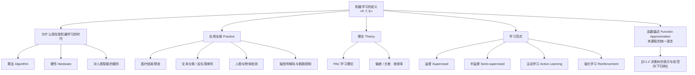

# C1.1 机器学习概述与课程导航

> [!info] 标注说明
> 标有 **（拓展）** 或 **【拓展】** 的内容，是**课堂上没有展开讲、由课件和教材延伸补充**的部分。
> 复习时可先掌握未标注的主干内容，行有余力再看拓展部分。

---

## 1. 机器学习的定义：`<P, T, E>`

> [!important] 定义 Definition
> **机器学习 Machine Learning**：研究这样一类算法——它们在**任务 task $T$** 上的**性能 performance $P$**，会随着**经验 experience $E$** 的增加而提升。
> 一个**良定义的学习问题 well-defined learning task** 就是一个三元组 $\langle P, T, E \rangle$。

这三个词不是修辞，而是**动手做任何一个机器学习项目时必须先填的三个空**：

| 记号 | 含义 | 在"猫狗识别"里 | 在"是否需要紧急剖宫产"里 |
|---|---|---|---|
| $E$ 经验 | **就是数据** | 大量已标注"这是猫／这是狗"的图片 | 医院历史病历（9714 条，每条 215 个特征） |
| $T$ 任务 | 你要它做什么 | 给一张新图片，判断猫还是狗 | 给一位新入院孕妇，判断是否会转为紧急剖宫产 |
| $P$ 性能 | 好坏怎么量 | 100 张新图片里认对多少张（准确率） | 在未见过的病例上的预测准确率 |

> [!note] 为什么把"经验"等同于"数据"
> 人的经验来自反复看、反复被纠正；机器没有身体，它唯一能"经历"的就是被输入的**样本 + 标签 label**。
> 所以在工程上，$E$ 就是数据集；"提升经验"就是加数据、清洗数据、加标注。这也是本课程反复强调**数据是资产**的原因：
> 大平台（微信、字节、阿里、Google）的护城河，不在于算法比别人保密，而在于手机和终端每天回流的巨量行为数据——有了数据库，再套上算法就很容易变现。

> [!warning] 易错点
> $P$ 必须在**没参与训练的数据**上度量才有意义。在训练数据上刷出来的高分不算性能，这个坑到 [[C1.4 过拟合与剪枝]] 会被正式命名为**过拟合 overfitting**。

---

## 2. 为什么是现在：AI 的三根支柱

课程开篇给出的一个判断框架——今天所谓"人工智能"，拆开看是三样东西：

1. **算法 Algorithm**：本质来自数学。想在 AI 里做真正基础、扎实的工作，必须知道有哪些算法、各自解决什么问题。**本课程就是这一根柱子。**
2. **硬件 Hardware**：过去二十年从 CPU 讲到 GPU，算力增长是深度模型能被训练出来的物理前提（也是相关公司股价的推动力）。
3. **对人类智能的模仿**：如何让机器像人一样思考、组织世界的信息。ChatGPT、DeepSeek 这一类系统是这条路线的当代产物。

> [!note] 给学习路径的建议
> 想成为这个领域的专家，先想清楚自己要进哪一根柱子。三条路对能力的要求差别很大：
> - 想做**学术／当高校教师**：数学功底是硬门槛——顶会论文通篇是公式和推导。
> - 想进**工业界拿高薪**：NLP（自然语言处理）、大模型方向近年薪资最高；扎实的算法实现能力比会调包重要，建议**亲手实现基础算法的核心函数**。
> - 顶会论文是这个领域的通用硬通货：CVPR、ICML、NeurIPS、KDD 等。本领域最新成果**主要发表在会议而不是期刊**，因为会议三个月左右就能让全世界看到。有这类论文，无论申请读博还是进大厂，都是明显的加分项。

---

## 3. 应用全景 Machine Learning in Practice

课件用五个真实案例说明"机器学习能干什么"。它们共同的形状是：**现实世界的问题 → 收集带特征的数据 → 从数据中学出规则 → 用规则做预测**。

### 3.1 预测紧急剖宫产 Learning to Predict Emergency C-Sections
*(Sims et al., 2000)*

- **数据**：9714 条病人记录，每条 **215 个特征**；同一个病人在 time=1, 2, …, n 多个时间点被反复记录（年龄、是否初孕、贫血、糖尿病、既往早产史、超声结果……），最终标签是 `Emergency C-Section: Yes/No`。
- **学出来的 18 条规则之一**：

  > **If** 无既往阴道分娩 **and** 妊娠中期超声异常 **and** 入院时胎位不正
  > **Then** 紧急剖宫产的概率 = 0.6
  >
  > 在训练数据上：26/41 = **.63**；在测试数据上：12/20 = **.60**

> [!note] 这张片子真正要读懂的三件事
> 1. **为什么值得做**：新入职的医生没有几十年的临床直觉，看着这堆化验单判断不了。把全院数据汇总起来学出规则，等于把资深医生的经验固化下来给所有人用。
> 2. **0.6 不是失败**：训练集 .63、测试集 .60 两个数字**几乎相等**，说明这条规则是真规律而不是背下来的巧合——这正是我们想要的（对照 [[C1.4 过拟合与剪枝]]）。
> 3. **准确率上不去，常常不是算法的错**：更可能是**特征不够**——描述这个病例真正关键的那个量根本没被采集。这也是为什么"该采哪些特征"本身就是一个昂贵的决策。

### 3.2 文本分类：垃圾邮件识别 spam vs. not spam

邮箱里的"举报垃圾邮件"按钮背后就是一个二分类器。人判断垃圾邮件靠的线索——出现巨额金额（"cash prize of \$100,000.00"）、陌生的机构名、大量转发符号 `>`、"Attn: PRIVATE" 之类的话术——机器学习要做的是把这些线索变成**可计算的特征**交给分类器。

> [!note] 与本课的连接（拓展）
> **【拓展】** 把一封邮件变成特征向量的最简单做法是**词袋 bag-of-words**：词表里每个词一维，值为该词是否出现／出现几次。后面讲朴素贝叶斯时，这个例子会重新出现。

### 3.3 图像中的物体检测 (Prof. H. Schneiderman)

对每一种朝向（正脸、侧脸）分别准备训练样本，学出的检测器能在合影里同时框出多张不同姿态、不同遮挡的人脸。

> [!note] 时间尺度感
> 八年前这件事还做不到；今天不仅能做，**戴口罩也能识别**，猫狗品种也能细分。这不是某一天的突变，而是算法 + 数据 + 算力三者同时推进的结果。

### 3.4 从 fMRI 脑活动分类"人正在想的词"

输入是覆盖整个脑区的成百上千条时间序列（每个小格子是一个体素的信号曲线），输出是词的类别。

### 3.5 神经植入体的假肢控制 (R. Kass, L. Castellanos, A. Schwartz)

从猴子运动皮层采集神经信号，直接驱动机械臂完成抓取。

> [!note] 为什么值得关注
> 这两个例子合起来就是当下最热的**脑机接口 Brain–Computer Interface (BCI)** 方向：读出信号 → 解码意图 → 驱动执行器，让失去运动能力的人重新站起来、握手。已有大公司重金投入，但可靠性仍在攻关阶段。

### 3.6 汇总：Machine Learning – Practice

| 应用 | 代表任务 |
|---|---|
| Mining Databases | 医疗记录挖掘（剖宫产例） |
| Speech Recognition | 语音识别 |
| Control learning | 直升机等控制策略学习 |
| Object recognition | 人脸/物体检测 |
| Text analysis | 实体抽取、信息标注 |

支撑这些应用的经典算法：**支持向量机 SVM、贝叶斯网络 Bayesian networks、隐马尔可夫模型 HMM、深度神经网络 DNN、强化学习 Reinforcement Learning** ……本课程会逐个覆盖。

---

## 4. 理论 Machine Learning – Theory

> [!important] PAC 学习理论 PAC Learning Theory（监督概念学习）
> 把四个量绑在一起：**样本数 $m$**、**错误率 $\epsilon$**、**假设空间的表示复杂度 $|H|$**、**失败概率 $\delta$**。
>
> $$m \ \ge\ \frac{1}{\epsilon}\left(\ln |H| + \ln (1/\delta)\right)$$

**怎么读这个不等式**：如果你希望学出来的模型"以至少 $1-\delta$ 的把握，错误率不超过 $\epsilon$"，那么你至少需要这么多训练样本。

> [!note] 逐项拆解（拓展）
> **【拓展】** 三个直觉：
> - $\epsilon$ 在**分母**：要求越精确（$\epsilon$ 越小），需要的样本越多，且是反比放大。
> - $|H|$ 在 $\ln$ 里：假设空间越大（模型越灵活、参数越多），需要的样本越多，但只是**对数**级增长——这解释了为什么参数量翻倍并不需要数据量翻倍。
> - $\delta$ 也在 $\ln$ 里：把"翻车概率"从 5% 压到 0.5%，代价很小。
>
> 这个式子在本课后面的**学习理论**一章会正式推导，这里只需要建立"数据量 ↔ 模型复杂度 ↔ 精度"三者互相牵制的直觉。

课件同时列出理论研究的其他分支：
- 其他范式的理论：强化技能学习、半监督学习、主动查询 (active student querying)
- 其他被刻画的量：学习过程中的**犯错次数**、学习器的**查询策略**、**收敛率 convergence rate**、**渐近性能**、**偏差 bias 与方差 variance**

> [!note] 偏差与方差的一句话预告
> 模型太简单 → 拟合不上，表现为**偏差 bias**大；模型参数太多 → 抖动剧烈，表现为**方差 variance**大。这对矛盾贯穿整门课，[[C1.4 过拟合与剪枝]] 是它在决策树上的第一次现身。

---

## 5. 学习范式 Learning Settings

标注数据是昂贵的：要人一条条去标，一万条已经很吃力，一百万条不现实。围绕"标注有多贵"，衍生出几种范式：

| 范式 | 场景 | 做法 |
|---|---|---|
| **监督学习 Supervised** | 标注数据充足 | 直接用 $(x, y)$ 训练 |
| **半监督学习 Semi-supervised** | 少量标注 + 大量未标注 | 把有标签和无标签数据一起用，提升模型 |
| **主动学习 Active Learning**（课件作 active student querying） | 标注预算有限，但可以自己挑 | 由算法**挑最值得标的那部分样本**去请人标注，用一万条标注达到十万条的效果 |
| **强化学习 Reinforcement** | 没有现成标签，只有环境反馈 | 通过与环境交互获得奖励信号 |

> [!warning] 主动学习的关键提问
> 手上有一百万条未标注数据、只能标一万条。**随机抽一万条**和**精心挑一万条**，最终模型可能差很多。"如何挑"就是主动学习要回答的问题。

---

## 6. 机器学习在计算机科学中的位置

- 机器学习已经是下列问题的**首选方法**：语音识别、自然语言处理、计算机视觉、医学结局分析、机器人控制……
- 这个"生态位"还在扩大，原因有三：**算法在进步、在线数据在增多、对自适应软件的需求在增加**。

课件用一个"ML apps ⊂ All software apps"的示意图说明：机器学习应用目前仍是全部软件应用中的一小块，但这一小块在持续长大。

> [!note] 判断某个场景能不能上机器学习
> 只要这个场景**能定义出问题、能采到带特征的数据**，机器学习就可以用。这个判据比"属于哪个学院"有用得多——如今电子、电气、自动控制、测量等专业都在用机器学习做控制与检测。

### 机器学习与相关学科的关系

![[C1.1-机器学习与相关学科关系.png]]

机器学习坐落在多个学科的交集上：**计算机科学**、**统计学**、**经济学与组织行为学**、**动物学习（认知科学 / 心理学 / 神经科学）**、**自适应控制理论**、**进化论**。

> [!note] 这张图想说的（拓展）
> **【拓展】** 每个圈都对"什么叫学习"给过一套答案：统计学给了估计与置信；控制论给了反馈与收敛；神经科学给了突触可塑性；进化论给了选择与变异。机器学习不是凭空发明的，它的每个核心概念几乎都能在某个圈里找到前身——本章要用的**熵**就是直接从**信息论（通信）**借来的（见 [[C1.3 熵与信息增益]]）。

---

## 7. 这门课你会学到什么

- **主要的机器学习算法**：逻辑斯谛回归、贝叶斯方法、HMM、SVM、强化学习、决策树学习、boosting、无监督聚类……
- **如何把它们用在真实数据上**：文本、图像、结构化数据；以及**你自己的项目**
- **底层的统计与计算理论**
- **足以读懂机器学习研究论文的功底**

> [!warning] 关于读论文
> 现在直接去读顶会论文会很吃力，这是正常的。但要有意识地逼自己往这个方向靠——最前沿的东西全部在网上公开（GitHub 上能拿到最好的算法实现，MIT / Stanford 有公开课）。一个新算法刚发表时，如果你肯花几十小时把它彻底吃透，那一刻你就是世界上最懂它的一小撮人之一。

---

## 8. 函数逼近 Function Approximation：本课程的统一语言

这是整门课的**记号约定**。之后每讲一个新算法，都是在这个模板里换零件。

> [!important] 问题设定 Problem Setting
> - 所有可能的**实例集合 instance space** $X$
> - 未知的**目标函数 target function** $f: X \to Y$
> - **假设空间 hypothesis space** $H = \{\, h \mid h: X \to Y \,\}$
>
> **输入 Input**：目标函数 $f$ 的训练样本 $\{\langle x^{(i)}, y^{(i)}\rangle\}$
> **输出 Output**：假设 $h \in H$，使其**最好地逼近**目标函数 $f$

> [!note] 逐个符号翻译
> - $X$：一条数据长什么样。图片分类里 $X$ 是所有图片；打网球例子里 $X$ 是所有"天气组合"。
> - $f$：**真正的规律**，客观存在但我们永远看不到它的全貌——只能通过有限的样本窥探。
> - $H$：**我们允许自己写出的答案的集合**。选择 $H$ 就是选择模型族：$H$ 是"所有决策树"就在学决策树，是"所有直线"就在做线性回归。
> - $h$：从 $H$ 里挑出来的那一个，也就是训练完得到的**模型**。
> - **上标 $x^{(i)}$ 表示第 $i$ 个训练样本**（课件专门用批注框标出）——注意与下标 $x_j$ 区分：下标指**第 $j$ 个特征分量**。这个记号是全领域通用的，读论文时会反复见到。

> [!warning] 最容易混的两个记号
> $x^{(i)}$ = 第 $i$ **条样本**（一整个向量）；$x_j$ = 一条样本里的第 $j$ **个特征**。
> 所以 $x^{(3)}_2$ 是"第 3 条样本的第 2 个特征"。写错上下标是作业和考试里最常见的低级失分点。

> [!note] "学习"因此变成了一个搜索问题
> 既然 $H$ 是一个集合，学习就是**在 $H$ 这个空间里搜索一个最好的 $h$**。不同算法的区别，说到底是三件事的区别：$H$ 怎么定义、"最好"怎么定义、怎么搜。这条线索在 [[C1.5 学习理论视角与决策树扩展]] 会被明确总结为机器学习的两大核心议题。

---

## 本节自测 Self-Test

> [!question] 1. 把"用历史股票数据预测明日涨跌"写成 `<P, T, E>`。
> $T$：给定某只股票截至今日的行情特征，预测次日涨/跌；$E$：历史行情数据及其真实涨跌标签；$P$：在**未来的、未参与训练的**交易日上的预测准确率（或策略收益是否跑赢大盘）。

> [!question] 2. 剖宫产例子里，训练 .63 / 测试 .60 这两个数字为什么值得单独看一眼？
> 因为二者接近，说明规则在新数据上依然成立，没有过拟合。若变成训练 .95 / 测试 .60，则说明模型把训练集背下来了。

> [!question] 3. PAC 不等式里，把假设空间 $|H|$ 扩大到原来的 100 倍，所需样本数大约增加多少？
> 增加 $\frac{\ln 100}{\epsilon} \approx \frac{4.6}{\epsilon}$，是**加法**级别的增量而非乘 100——因为 $|H|$ 以 $\ln$ 进入公式。

> [!question] 4. $x^{(2)}_3$ 指什么？
> 第 2 条训练样本的第 3 个特征分量。

> [!question] 5. 手上有 100 万条无标注数据、只能标 1 万条，这属于哪种学习范式？它的核心问题是什么？
> 主动学习 Active Learning；核心问题是**如何挑选最值得标注的样本**，使有限标注预算换来最大的性能提升。

---

上一节：（本章起点） · 下一节：[[C1.2 决策树的表示与自顶向下归纳]]
索引：[[机器学习课程 MOC]]
