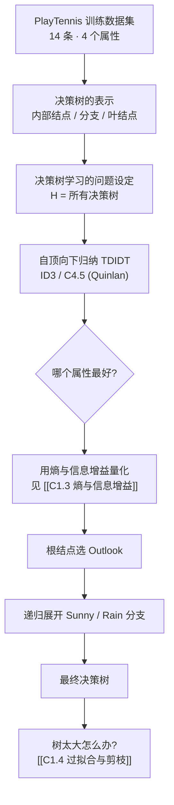
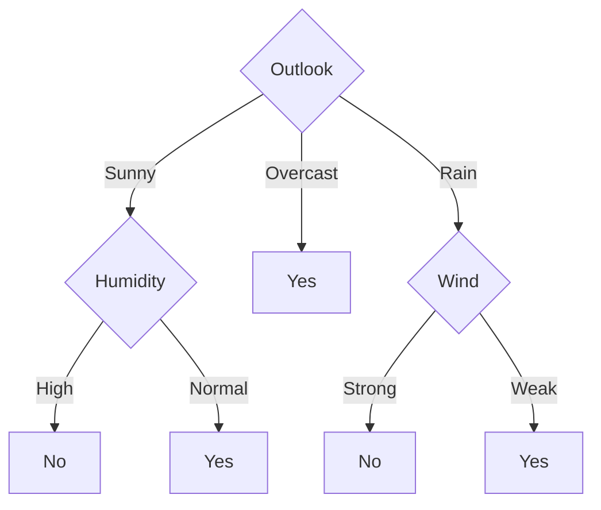
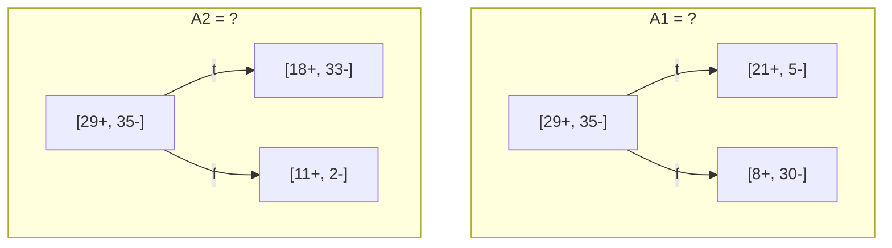
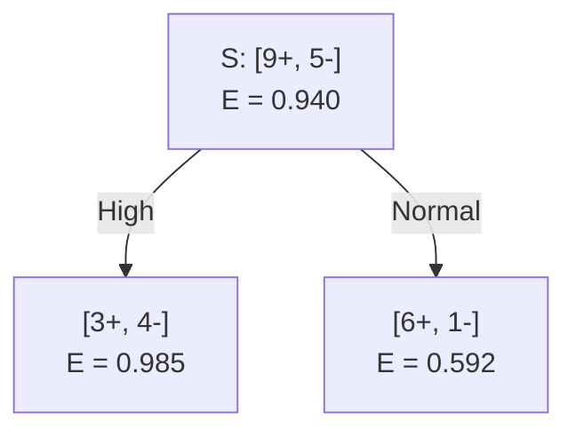
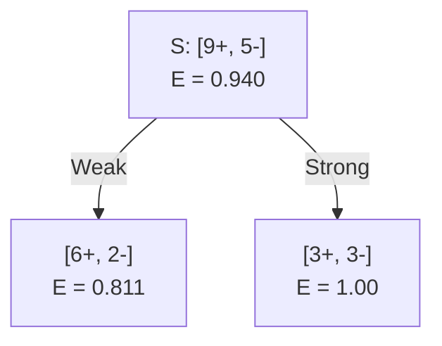
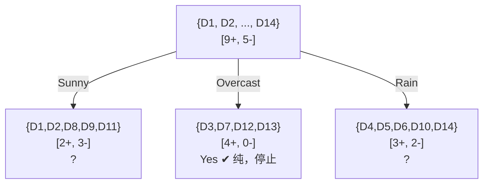

# C1.2 决策树的表示与自顶向下归纳



> [!info] 标注说明
> 标有 **（拓展）** 或 **【拓展】** 的内容，是**课堂上没有展开讲、由课件和教材延伸补充**的部分。
> 复习时可先掌握未标注的主干内容，行有余力再看拓展部分。

---

## 1. 训练数据集 Simple Training Data Set

整章反复使用的这份数据（Mitchell 教材经典的 **PlayTennis** 数据集）必须记熟——考试演算就在它上面做。

| Day | Outlook 天气 | Temperature 气温 | Humidity 湿度 | Wind 风 | PlayTennis? |
|---|---|---|---|---|---|
| D1 | Sunny | Hot | High | Weak | **No** |
| D2 | Sunny | Hot | High | Strong | **No** |
| D3 | Overcast | Hot | High | Weak | **Yes** |
| D4 | Rain | Mild | High | Weak | **Yes** |
| D5 | Rain | Cool | Normal | Weak | **Yes** |
| D6 | Rain | Cool | Normal | Strong | **No** |
| D7 | Overcast | Cool | Normal | Strong | **Yes** |
| D8 | Sunny | Mild | High | Weak | **No** |
| D9 | Sunny | Cool | Normal | Weak | **Yes** |
| D10 | Rain | Mild | Normal | Weak | **Yes** |
| D11 | Sunny | Mild | Normal | Strong | **Yes** |
| D12 | Overcast | Mild | High | Strong | **Yes** |
| D13 | Overcast | Hot | Normal | Weak | **Yes** |
| D14 | Rain | Mild | High | Strong | **No** |

**取值集合**：Outlook ∈ {Sunny, Overcast, Rain}（3 值）；Temperature ∈ {Hot, Mild, Cool}（3 值）；Humidity ∈ {High, Normal}（2 值）；Wind ∈ {Weak, Strong}（2 值）。
**整体分布**：14 条中 **9 正 5 负**，记作 $[9+, 5-]$。

> [!note] 采集特征本身就是一个决策
> 表里为什么是这四个属性？因为有人**事先决定**了打网球要看天气、气温、湿度、风。完全可以再加"今天心情好不好""朋友是否放假""地铁是否正常"——但每多一列，采集成本（钱和时间）就上去一分，而且你事先并不知道它有没有用。
> 现实项目里，"该采哪些特征"往往比"用哪个算法"更决定成败；[[C1.1 机器学习概述与课程导航]] 里剖宫产例子准确率上不去，怀疑的第一件事也是特征不够。

---

## 2. 决策树的表示

一棵为 $f:\langle \text{Outlook}, \text{Temperature}, \text{Humidity}, \text{Wind}\rangle \to \text{PlayTennis?}$ 服务的决策树：



> [!important] 三条表示规则
> - **每个内部结点 internal node**：测试**一个**离散值属性 $X_i$
> - **每条从结点出发的分支 branch**：对应该属性的**一个取值**
> - **每个叶结点 leaf node**：给出预测的 $Y$（或给出概率 $P(Y \mid X \in \text{leaf})$）

> [!note] 怎么"用"这棵树
> 来了一天：`<Outlook=Sunny, Temp=Hot, Humidity=Normal, Wind=Strong>`。从根开始：Outlook=Sunny → 走左枝到 Humidity；Humidity=Normal → 叶结点 **Yes**。
> **注意**：这条路径**根本没查 Temperature 和 Wind**。一棵树上不同的路径可以用到不同数量的属性——Overcast 那一枝只查一个属性就下结论了。这正是决策树相对"每次都把全部特征塞进公式"的模型的一个优点：它天然带特征选择，而且路径本身就是**人能读懂的规则**。

> [!warning] 完备性要求
> 这棵树必须能处理**任何一条**输入，不允许出现"走到某个结点发现没有匹配分支"的情况。所以每个内部结点必须为它所测属性的**每一个取值**都留出分支（缺失值的特殊处理见 [[C1.5 学习理论视角与决策树扩展]]）。

> [!note] 叶结点输出概率的写法（拓展）
> **【拓展】** 课件写的是 `predict Y (or P(Y|X ∈ leaf))`。当叶子里的样本不纯（比如 3 正 2 负），可以不硬性输出 Yes，而是输出 $P(\text{Yes}) = 3/5$。这在需要**排序**或**设阈值**的场景（风控、广告）比硬标签有用得多。

---

## 3. 决策树学习的问题设定

把 [[C1.1 机器学习概述与课程导航]] 的函数逼近模板具体化：

> [!important] Decision Tree Learning — Problem Setting
> - 实例集合 $X$：每个实例 $x$ 是一个**特征向量 feature vector** $x = \langle x_1, x_2, \dots, x_n\rangle$
>   例如 `<Humidity=low, Wind=weak, Outlook=rain, Temp=hot>`
> - 未知目标函数 $f: X \to Y$，其中 **$Y$ 是离散值**（打网球例子里 $Y=1$ 表示这天打球，否则 $0$）
> - 假设空间 $H = \{ h \mid h : X \to Y \}$，**每个假设 $h$ 就是一棵决策树**；树把 $x$ 分拣 (sort) 到某个叶子，该叶子给出 $y$
>
> **输入**：训练样本 $\{\langle x^{(i)}, y^{(i)}\rangle\}$
> **输出**：最好地逼近 $f$ 的 $h \in H$

> [!warning] "$Y$ 是离散值"这一条别漏
> 这限定了决策树在这里做的是**分类 classification**。（回归树是可以做的，只要把叶子的输出改成实数、把划分准则从熵改成平方误差——但那是后面的内容。）

---

## 4. 一个真实的树：预测剖宫产风险

用 1000 位产妇的病历学出的树（**负例是剖宫产**，即 `+` 表示顺产、`-` 表示需剖宫产）：

```text
[833+,167-]  .83+  .17-
Fetal_Presentation = 1: [822+,116-]  .88+  .12-
| Previous_Csection = 0: [767+,81-]  .90+  .10-
| | Primiparous = 0: [399+,13-]  .97+  .03-
| | Primiparous = 1: [368+,68-]  .84+  .16-
| | | Fetal_Distress = 0: [334+,47-]  .88+  .12-
| | | | Birth_Weight < 3349: [201+,10.6-]  .95+  .05-
| | | | Birth_Weight >= 3349: [133+,36.4-]  .78+  .22-
| | | Fetal_Distress = 1: [34+,21-]  .62+  .38-
| Previous_Csection = 1: [55+,35-]  .61+  .39-
Fetal_Presentation = 2: [3+,29-]  .11+  .89-
Fetal_Presentation = 3: [8+,22-]  .27+  .73-
```

> [!note] 这个文本树怎么读
> - **缩进 = 层级**，`|` 是树枝的竖线。顶行 `[833+,167-]` 是根结点：全部 1000 例中 833 顺产、167 剖宫产，比例 .83 / .17。
> - **根结点选的属性是 `Fetal_Presentation`（胎位）**——算法认为它信息量最大。它有 3 个取值，所以根下有三枝。
> - 看效果：胎位 = 2 时 `[3+,29-]`，即 **.89 的概率需要剖宫产**；胎位 = 1 时反过来 .88 顺产。**一个属性就把人群切成了风险完全不同的两群**，这就是"好属性"的样子。
> - **不同分枝深度不同**：胎位 = 2 和 = 3 直接停住（已经足够纯），胎位 = 1 那一枝继续往下切了四层。决策树不是平衡二叉树，哪里还乱就往哪里切。
> - `[201+,10.6-]` 出现**小数**：这是缺失值处理的结果——一条属性值缺失的样本被按比例拆成几份分到多个子结点（见 [[C1.5 学习理论视角与决策树扩展]] 的 Unknown Attribute Values）。

---

## 5. 自顶向下归纳决策树 TDIDT

> [!important] Top-Down Induction of Decision Trees `[ID3, C4.5, Quinlan]`
> ```text
> node = Root
> Main loop:
>   1. A ← 当前 node 的"最佳"决策属性
>   2. 把 A 指派为 node 的决策属性
>   3. 对 A 的每一个取值，创建 node 的一个后继结点
>   4. 把训练样本分拣到各叶结点
>   5. 若训练样本已被完美分类，则 STOP；否则对新的叶结点重复迭代
> ```

> [!note] 这个循环的性质
> - 它是**贪心 greedy** 的：每一步只挑当下最好的属性，选定后**永不回头**。它不保证得到全局最优的树（为什么不做穷举搜索，见 [[C1.5 学习理论视角与决策树扩展]]）。
> - 它是**递归**的：第 5 步"对新叶结点重复"，意味着每个子结点面对的是一个**更小的子数据集**上的同一个问题。
> - 停止条件写的是"完美分类"——这恰恰是**过拟合的温床**，[[C1.4 过拟合与剪枝]] 会专门修正它。
> - 整个算法的**关键点只有一个：第 1 步的"最佳"怎么定义**，即**划分准则 splitting criterion**。ID3 的答案是"使熵下降最多"。

### 关键问题：Which attribute is best?

课件用一对示意图提问。总体都是 $[29+, 35-]$，两个候选属性各自把它切成两份：



> [!note] 用眼睛先判断一次
> 理想的划分是切完以后**一边全正、一边全负**（完全"纯" pure）。
> - A1：左 21:5 偏正、右 8:30 偏负，两边都明显偏了一侧。
> - A2：右边 11:2 非常纯，但左边 18:33 还很混。
>
> 眼睛能看出"都不完美"，却说不清**哪个更好、好多少**。所以需要一个数——这就是引入**熵 entropy** 的动机。完整推导见 [[C1.3 熵与信息增益]]。

---

## 6. 用信息增益选属性：完整演算

### 6.1 需要的两个公式

$$H(S) \equiv -p_\oplus \log_2 p_\oplus - p_\ominus \log_2 p_\ominus$$

$$Gain(S, A) = I_S(A, Y) = H_S(Y) - H_S(Y \mid A) = H(S) - \sum_{v \in values(A)} \frac{|S_v|}{|S|} H(S_v)$$

> [!important] 信息增益的两种读法
> - **信息论读法**：$Gain$ 是输入属性 $A$ 与目标变量 $Y$ 之间的**互信息 mutual information**。
> - **决策树读法**：$Gain$ 是"按属性 $A$ 把样本分拣一遍"所带来的**目标变量熵的期望下降量**。
>
> 两种说法是同一件事。选属性就是**选让熵掉得最多的那个**。

### 6.2 根结点：四个属性各算一遍

全集 $S$：$[9+, 5-]$，
$$H(S) = -\tfrac{9}{14}\log_2\tfrac{9}{14} - \tfrac{5}{14}\log_2\tfrac{5}{14} = 0.940$$

**Humidity**（课件给出的演算）：


$$Gain(S,\text{Humidity}) = .940 - \tfrac{7}{14}(.985) - \tfrac{7}{14}(.592) = \mathbf{.151}$$

**Wind**：


$$Gain(S,\text{Wind}) = .940 - \tfrac{8}{14}(.811) - \tfrac{6}{14}(1.0) = \mathbf{.048}$$

**另外两个属性**（课件未列演算，补齐以便比较）：

**【拓展：补齐演算】** Outlook 把 $S$ 切成 Sunny $[2+,3-]$（$E=.971$）、Overcast $[4+,0-]$（$E=0$）、Rain $[3+,2-]$（$E=.971$）：
$$Gain(S,\text{Outlook}) = .940 - \tfrac{5}{14}(.971) - \tfrac{4}{14}(0) - \tfrac{5}{14}(.971) = \mathbf{.247}$$
Temperature 切成 Hot $[2+,2-]$（$E=1$）、Mild $[4+,2-]$（$E=.918$）、Cool $[3+,1-]$（$E=.811$）：
$$Gain(S,\text{Temperature}) = .940 - \tfrac{4}{14}(1) - \tfrac{6}{14}(.918) - \tfrac{4}{14}(.811) = \mathbf{.029}$$

| 属性 | Gain |
|---|---|
| **Outlook** | **.247** ← 最大，选它 |
| Humidity | .151 |
| Wind | .048 |
| Temperature | .029 |

> [!note] 为什么 Overcast 帮了 Outlook 大忙
> Overcast 那一枝是 $[4+, 0-]$，熵为 **0**——四天全打球，一个反例都没有。加权求和时它贡献 0，直接把总的条件熵拉低。
> **一个属性只要能"切出一块完全纯的子集"，它的信息增益就会很可观。**

### 6.3 展开第二层

根选 Outlook 后：



**Sunny 分枝**：$S_{sunny} = \{D1, D2, D8, D9, D11\}$，$[2+,3-]$，$H = .970$

$$Gain(S_{sunny}, \text{Humidity}) = .970 - \tfrac{3}{5}(0.0) - \tfrac{2}{5}(0.0) = \mathbf{.970}$$
$$Gain(S_{sunny}, \text{Temperature}) = .970 - \tfrac{2}{5}(0.0) - \tfrac{2}{5}(1.0) - \tfrac{1}{5}(0.0) = .570$$
$$Gain(S_{sunny}, \text{Wind}) = .970 - \tfrac{2}{5}(1.0) - \tfrac{3}{5}(.918) = .019$$

选 **Humidity**——增益 .970 等于该子集的全部熵，说明它**一刀切干净**：Sunny 且 High 的三天（D1, D2, D8）全不打，Sunny 且 Normal 的两天（D9, D11）全打。

> [!note] 注意"最佳属性是局部的"
> 在全集上 Humidity 只排第二（.151），在 Sunny 子集上却是压倒性的第一（.970）。**每个结点都要用它自己那份子数据重新算一遍**，不能沿用父结点的排名。这是手算题最容易出错的地方。

**【拓展：补齐演算】** **Rain 分枝**：$S_{rain} = \{D4, D5, D6, D10, D14\}$，$[3+,2-]$，$H=.971$。
Wind = Weak → {D4, D5, D10} 全 Yes（$E=0$）；Wind = Strong → {D6, D14} 全 No（$E=0$）。
$$Gain(S_{rain}, \text{Wind}) = .971 - 0 - 0 = .971$$
同样一刀切干净，所以 Rain 分枝选 **Wind**。

### 6.4 最终决策树


所有叶结点都纯了，训练样本被完美分类，算法**停止**。

> [!warning] 停下来看一眼这棵树
> 14 条数据、4 个属性，最终只用了 **3 个属性、8 个结点**，而且 Temperature 完全没被用上。
> 这就是决策树讨人喜欢的地方：结果是一组人能念出来的规则（"阴天就打球；晴天看湿度；下雨看风"）。
> 但它同时埋着一个问题：**如果继续往下切，总能把训练集切到 100% 正确——那是不是就更好？** 答案是"不"。见 [[C1.4 过拟合与剪枝]]。

---

## 7. 其他划分准则

ID3 用的是**熵 / 信息增益**，但这只是众多可选之一。

> [!note] 基尼指数 Gini index
> 另一个被广泛使用的划分准则（CART 算法采用）：
> $$Gini(S) = 1 - \sum_{k} p_k^2$$
> 直觉与熵相同——分布越纯，值越小；均匀分布时最大。划分时同样选**加权基尼下降最多**的属性。
>
> **哪个更好？没有定论。** 两者在绝大多数数据上给出的树非常接近；基尼不用算对数，计算稍快。
> 值得记住的不是"选哪个"，而是**研究者是如何为一个工程步骤找到数学依据的**——今天做新算法，同样是先找一个能刻画目标的数学量，再围绕它设计流程。

> [!question] 想一想
> 为什么不直接用**错误率**做划分准则（毕竟错误率才是我们最终关心的）？
> 见 [[C1.5 学习理论视角与决策树扩展]] 第 3 节——会陷入局部极小。

---

## 本节自测 Self-Test

> [!question] 1. 在 PlayTennis 数据上手算 $H(S)$、$Gain(S, \text{Wind})$。
> $H(S) = -\frac{9}{14}\log_2\frac{9}{14}-\frac{5}{14}\log_2\frac{5}{14}=0.940$；
> Weak 8 条 $[6+,2-]$，$E=0.811$；Strong 6 条 $[3+,3-]$，$E=1.0$；
> $Gain = .940 - \frac{8}{14}(.811)-\frac{6}{14}(1.0)=.048$。

> [!question] 2. 为什么根结点选 Outlook 而不是 Humidity？
> $Gain(S,\text{Outlook})=.247 > Gain(S,\text{Humidity})=.151$。关键在 Overcast 分枝 $[4+,0-]$ 熵为 0，把加权条件熵压得很低。

> [!question] 3. Humidity 在全集上排第二，在 Sunny 子集上却排第一。这说明什么？
> 属性的优劣是**相对于当前结点的子数据集**而言的，每个结点必须重新计算，不能沿用父结点排名。

> [!question] 4. 一棵决策树对输入 `<Outlook=Overcast, Temp=Cool, Humidity=High, Wind=Strong>` 的预测是什么？用到了几个属性？
> **Yes**；只用了 1 个属性（Outlook），Overcast 直接到叶结点。

> [!question] 5. TDIDT 的第 5 步"若训练样本被完美分类则停止"有什么隐患？
> 会一直切到把训练集背下来为止，导致过拟合。修正方式是预剪枝或后剪枝，见 [[C1.4 过拟合与剪枝]]。

---

上一节：[[C1.1 机器学习概述与课程导航]] · 下一节：[[C1.3 熵与信息增益]]
索引：[[机器学习课程 MOC]]
