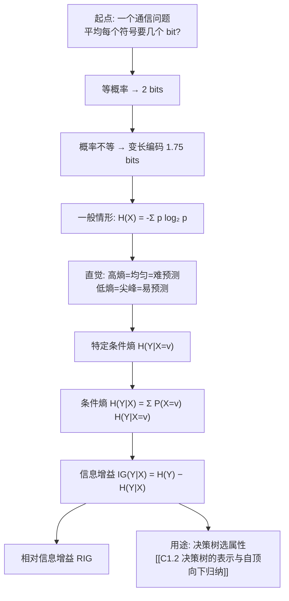

# C1.3 熵与信息增益

> [!warning] 本节是明确的考试考点
> 熵、条件熵、信息增益的**手算**每次考试都会考：给一张属性—标签表格，要能算出 $H(Y)$、$H(Y|X)$、$IG(Y|X)$。
> 本节的每一步演算都要能自己独立走一遍，不能只看懂。

> [!info] 标注说明
> 标有 **（拓展）** 或 **【拓展】** 的内容，是**课堂上没有展开讲、由课件和教材延伸补充**的部分。
> 复习时可先掌握未标注的主干内容，行有余力再看拓展部分。

---

## 1. 为什么决策树要借用"熵"

上一节停在一个问题上：给定 $[29+,35-]$ 的两种划分，**哪个更好、好多少**，眼睛说不清。

我们需要的是一个能度量"一堆样本有多混"的数：**全是正例或全是负例时最小，正负各半时最大**。信息论里早就有这个量，它叫**熵**。它最初是为一个完全不同的问题定义的——**通信**：一串符号平均要用几个比特才能传完？

下面沿课件的路线，从通信问题一步步推到熵。

---

## 2. 从编码长度推出熵

### 2.1 等概率：2 bits

你在观察随机变量 $X$ 的独立样本，$X$ 有四种取值 A/B/C/D，你看到的序列像：`BAACBADCDADDDA…`

$$P(A)=P(B)=P(C)=P(D)=\tfrac14$$

要通过二进制串行链路把它传出去，最自然的编码是每个符号 2 bit：`A=00, B=01, C=10, D=11`，于是数据流长成 `0100001001001110110011111100…`。

**平均每符号 2 bits。**

### 2.2 概率不等：可以做到 1.75 bits

现在有人告诉你概率其实不相等：

$$P(A)=\tfrac12,\quad P(B)=\tfrac14,\quad P(C)=\tfrac18,\quad P(D)=\tfrac18$$

存在一种编码，平均只用 **1.75 bits/符号**。课件给出其中一种：

| 符号 | 概率 | 编码 | 码长 |
|---|---|---|---|
| A | 1/2 | `0` | 1 |
| B | 1/4 | `10` | 2 |
| C | 1/8 | `110` | 3 |
| D | 1/8 | `111` | 3 |

$$\bar{L} = \tfrac12(1) + \tfrac14(2) + \tfrac18(3) + \tfrac18(3) = 0.5+0.5+0.375+0.375 = \mathbf{1.75}$$

> [!important] 核心思想：常出现的给短码，罕见的给长码
> A 占了一半的出现次数，就让它只花 1 bit；C、D 很少来，让它们花 3 bit 也无所谓。
> **"分布越不均匀，就越有压缩空间"**——这句话反过来就是熵的意义：熵是这个分布**理论上能压到的极限平均码长**。

> [!note] 为什么这个码不会译错（拓展）
> **【拓展】** 这是一个**前缀码 prefix code**：没有任何一个码字是另一个码字的前缀。所以接收端从左往右读，读到 `0` 立刻知道是 A，读到 `10` 立刻知道是 B，不需要分隔符也不会有歧义。变长编码必须满足这个性质才可用（哈夫曼编码 Huffman coding 就是构造最优前缀码的算法）。

### 2.3 三个等概率取值：1.58496 bits

$$P(A)=P(B)=P(C)=\tfrac13$$

朴素编码 `A=00, B=01, C=10` 要 2 bits/符号。但理论上可以做到 **1.58496 bits/符号**。

> [!note] 这个数是从哪来的
> $\log_2 3 = 1.58496\ldots$。用整数比特无法达到，但**把多个符号打包一起编码**就能逼近：3 个符号一共 27 种组合，$2^4 = 16 < 27 \le 2^5 = 32$，5 bit 传 3 个符号即 1.67 bits/符号，已经优于 2；打包越长越接近 1.585。
> 这解释了为什么熵允许是**小数**——它是极限值，不是某个具体码字的长度。

### 2.4 一般情形 General Case

设 $X$ 有 $m$ 个取值 $V_1, V_2, \dots, V_m$，$P(X=V_j) = p_j$。

> [!important] 熵 Entropy 的定义
> $$H(X) = -p_1\log_2 p_1 - p_2 \log_2 p_2 - \cdots - p_m \log_2 p_m = -\sum_{j=1}^{m} p_j \log_2 p_j$$
>
> $H(X)$ = 传输一个从 $X$ 的分布中随机抽取的符号，在**最有效的编码**下平均所需的比特数。

课件同时给出了以 $n$ 为上限、按取值 $i$ 求和的等价写法：
$$H(X) = -\sum_{i=1}^{n} P(X=i)\log_2 P(X=i)$$
其中 $n$ 是 **$X$ 可能取值的个数**——这一点要特别注意。

> [!important] 为什么是这个式子 —— 信息论的两句话
> 1. 最有效的编码给消息 $X=i$ 分配 $-\log_2 P(X=i)$ 个比特；
> 2. 因此编码一个随机的 $X$ 期望所需比特数是
> $$\sum_{i=1}^{n} P(X=i)\bigl(-\log_2 P(X=i)\bigr)$$
> 这正是 $H(X)$。**熵 = 码长的期望**，负号只是为了让结果为正（因为 $\log_2 p \le 0$）。

> [!note] 用 2.2 的例子验证一遍
> $H = -\frac12\log_2\frac12 - \frac14\log_2\frac14 - \frac18\log_2\frac18 - \frac18\log_2\frac18 = \frac12(1)+\frac14(2)+\frac18(3)+\frac18(3) = 1.75$。
> 和手工设计的那套编码**完全一致**——说明那套码已经是最优的。
> 注意 $-\log_2 p_j$ 恰好就是表里的码长：$-\log_2\frac12=1$、$-\log_2\frac14=2$、$-\log_2\frac18=3$。这不是巧合。

### 2.5 高熵 vs. 低熵

> [!important] 必须背下来的方向
> - **"高熵 High Entropy"** ⟺ $X$ 来自**均匀 uniform（无聊的）分布** ⟺ 直方图是**平的** ⟺ 采样值**到处都是、无法预测**
> - **"低熵 Low Entropy"** ⟺ $X$ 来自**有峰有谷 varied 的分布** ⟺ 直方图**大量低值、一两个高峰** ⟺ 采样值**更可预测**

> [!warning] 最容易记反的一点
> 直觉上"变化多端"听起来像高熵，但课件的措辞是 *"Low Entropy means X is from varied (peaks and valleys) distribution"*——这里的 varied 形容的是**直方图的形状起伏大**（有尖峰），不是"取值花样多"。
> **抓住唯一可靠的判据：均匀 = 高熵 = 难预测；集中 = 低熵 = 易预测。** 考试时先想"能不能猜准"，能猜准就是低熵。

**课件的形象比喻（Entropy in a nut-shell）**：两张宝宝吃饭的照片。

| | 低熵 Low Entropy | 高熵 High Entropy |
|---|---|---|
| 画面 | 宝宝干干净净 | 汤糊了一脸、洒了一桌 |
| 课件解说 | 取值（汤的位置）**全部落在汤碗里** | 取值（汤的位置）**不可预测**，几乎均匀地分布在整个餐厅 |
| 含义 | 你知道去哪找汤 → 易预测 | 汤哪儿都有 → 难预测 |

> [!note] 这个比喻和决策树的关系
> 我们做预测，就是希望"汤都在碗里"。所以在决策树里，**我们要找的是能把数据变成低熵状态的属性**——切完以后每个子集尽量纯。这就是下面信息增益要量化的事。

---

## 3. 样本熵 Sample Entropy（二分类的特例）

![[C1.3-样本熵曲线-图示.png]]

> [!important] 定义
> - $S$ 是一批训练样本
> - $p_\oplus$ 是 $S$ 中**正例**的比例，$p_\ominus$ 是**负例**的比例
> - 熵度量 $S$ 的**不纯度 impurity**
>
> $$H(S) \equiv -p_\oplus \log_2 p_\oplus - p_\ominus \log_2 p_\ominus$$

> [!note] 怎么读这张图
> - 横轴是 $p_\oplus$（正例比例），纵轴是 $Entropy(S)$。
> - **两端为 0**：$p_\oplus = 0$ 或 $1$ 时全是一类，完全纯，熵 = 0，一个 bit 都不用传（你早就知道答案）。
> - **中点最高为 1**：$p_\oplus = 0.5$ 时正负各半，最混乱，需要满满 1 bit。
> - 曲线是**上凸**的，而且在两端**下降极快**：从 0.5 到 0.4 熵几乎没掉（0.971），从 0.1 到 0 才掉得猛。这解释了一个现象：**要靠一次划分把熵降下来，必须切得相当纯才有明显收益**。

> [!warning] 约定 $0\log_2 0 = 0$
> $p=0$ 时 $\log_2 0$ 无定义，按极限约定该项取 0。所以 $[4+, 0-]$ 的熵是 $0$ 而不是"算不出来"。手算时遇到纯结点直接写 0。

> [!note] 二分类熵的常用值（背下来能省很多时间）
> | 分布 | 熵 |
> |---|---|
> | 0:1 或 1:0（纯） | 0 |
> | 1:5 | 0.650 |
> | 1:4 | 0.722 |
> | 1:3 | 0.811 |
> | 2:5 | 0.863 |
> | 1:2 | 0.918 |
> | 2:3 | 0.971 |
> | 3:4 | 0.985 |
> | 1:1 | 1.000 |
>
> PlayTennis 演算里出现的 .811 / .918 / .971 / .985 / 1.00 全在这张表里。

---

## 4. 特定条件熵 Specific Conditional Entropy $H(Y|X=v)$

课件换了一份小数据来讲条件熵——**大学专业 vs. 是否喜欢电影《角斗士 Gladiator》**：

| X = College Major | Y = Likes "Gladiator" |
|---|---|
| Math | Yes |
| History | No |
| CS | Yes |
| Math | No |
| Math | No |
| CS | Yes |
| History | No |
| Math | Yes |

假设这 8 条数据反映真实概率，可以读出：
- $P(\text{LikeG} = \text{Yes}) = 0.5$
- $P(\text{Major}=\text{Math} \wedge \text{LikeG}=\text{No}) = 0.25$
- $P(\text{Major}=\text{Math}) = 0.5$
- $P(\text{LikeG}=\text{Yes} \mid \text{Major}=\text{History}) = 0$

并且 $H(X) = 1.5$，$H(Y) = 1$。

> [!note] 这两个数怎么来的
> $X$ 的分布是 Math 4/8、History 2/8、CS 2/8 = $(\frac12, \frac14, \frac14)$：
> $H(X) = \frac12(1) + \frac14(2) + \frac14(2) = 1.5$。
> $Y$ 的分布是 Yes 4/8、No 4/8：$H(Y) = 1$。

> [!important] 定义 Specific Conditional Entropy
> $H(Y \mid X=v)$ = **只在 $X$ 取值为 $v$ 的那些记录中**，$Y$ 的熵。

逐个取值算：

| $v$ | 该子集的 $Y$ | $H(Y \mid X = v)$ |
|---|---|---|
| Math | Yes, No, No, Yes → 2 正 2 负 | **1** |
| History | No, No → 全负 | **0** |
| CS | Yes, Yes → 全正 | **0** |

> [!note] 这三个数在说什么
> "你告诉我他是历史系的，我就**确定**他不喜欢这部电影"——熵 0，一个 bit 都不用再传。CS 系同理。
> "你告诉我他是数学系的，我还是**完全猜不出**"——熵 1，和没告诉一样。
> 于是"专业"这个属性的价值是**不均匀**的：对某些取值极有用，对另一些毫无用处。下一步就是把这些价值**按人数加权平均**。

---

## 5. 条件熵 Conditional Entropy $H(Y|X)$

> [!important] 定义 Conditional Entropy
> $H(Y \mid X)$ = $Y$ 的**平均特定条件熵**
> = 随机抽一条记录，以该记录的 $X$ 值为条件时 $Y$ 的条件熵的期望
> = **在收发双方都已知 $X$ 的前提下，传输 $Y$ 期望需要的比特数**
>
> $$H(Y \mid X) = \sum_j P(X = v_j)\, H(Y \mid X = v_j)$$

代入上例：

| $v_j$ | $P(X = v_j)$ | $H(Y \mid X=v_j)$ |
|---|---|---|
| Math | 0.5 | 1 |
| History | 0.25 | 0 |
| CS | 0.25 | 0 |

$$H(Y \mid X) = 0.5 \times 1 + 0.25 \times 0 + 0.25 \times 0 = \mathbf{0.5}$$

> [!warning] 权重是 $P(X=v_j)$，不是 $1/(\text{取值个数})$
> 三个取值不是各占 1/3，Math 占了一半。**按样本数加权**是手算最容易漏的一步。
> 在决策树里这个权重写成 $\frac{|S_v|}{|S|}$——同一件事。

一般形式（课件在 `Entropy` 汇总页给出）：
$$H(X \mid Y = v) = -\sum_{i=1}^{n} P(X=i \mid Y=v)\log_2 P(X=i \mid Y=v)$$
$$H(X \mid Y) = \sum_{v \in values(Y)} P(Y=v)\, H(X \mid Y=v)$$

> [!warning] 条件熵不会变大
> 恒有 $H(Y \mid X) \le H(Y)$：**多知道一个变量，不可能让不确定性增加**。最好的情况是 $X$ 完全决定 $Y$（$H(Y|X)=0$），最差的情况是 $X$ 与 $Y$ 独立（$H(Y|X)=H(Y)$）。
> 所以下一节的信息增益**永远非负**。手算出现负值，一定是算错了。

---

## 6. 信息增益 Information Gain

> [!important] 定义 Information Gain
> $IG(Y \mid X)$ = 我必须传输 $Y$。如果链路两端都已经知道 $X$，**平均能替我省下多少比特**？
>
> $$IG(Y \mid X) = H(Y) - H(Y \mid X)$$

上例：$H(Y) = 1$，$H(Y|X) = 0.5$，故
$$IG(Y \mid X) = 1 - 0.5 = \mathbf{0.5}$$

> [!important] 三个名字，一个东西
> **信息增益 Information Gain = 互信息 Mutual Information = 熵的期望下降量**
> $$I(X, Y) = H(X) - H(X \mid Y) = H(Y) - H(Y \mid X)$$
> 注意这个式子**对称**：$X$ 告诉你关于 $Y$ 的信息量，等于 $Y$ 告诉你关于 $X$ 的信息量。

在决策树语境下（[[C1.2 决策树的表示与自顶向下归纳]]）写作：

> [!important] 决策树中的信息增益
> 信息增益是输入属性 $A$ 与目标变量 $Y$ 之间的互信息；
> 它是"按属性 $A$ 对数据样本 $S$ 做分拣"所带来的**目标变量 $Y$ 的期望熵下降**。
> $$Gain(S, A) = I_S(A, Y) = H_S(Y) - H_S(Y \mid A)$$

**选属性的规则因此是一句话：选让我省下最多比特的那个属性。**

---

## 7. 相对信息增益 Relative Information Gain

> [!important] 定义 Relative Information Gain
> $RIG(Y|X)$ = 如果两端都知道 $X$，能替我省下**百分之几**的比特？
> $$RIG(Y \mid X) = \frac{H(Y) - H(Y \mid X)}{H(Y)}$$
> 例：$H(Y)=1$，$H(Y|X)=0.5$ ⟹ $RIG = (1-0.5)/1 = 0.5$

> [!warning] 课件笔误
> 课件正文把公式写成 `RIG(Y|X) = H(Y) - H(Y|X) / H(Y)`，**漏了分子的括号**。按运算优先级读会变成 $H(Y) - \frac{H(Y|X)}{H(Y)}$，与它自己给的算例 $(1-0.5)/1$ 不符。以**带括号的写法**为准。

> [!note] 什么时候用相对量（拓展）
> **【拓展】** 绝对增益受 $H(Y)$ 的量级影响：一个 $H(Y)=0.1$ 的极不平衡问题，增益 0.05 已经消掉了一半不确定性；而 $H(Y)=1$ 时的增益 0.05 微不足道。**跨不同数据集比较属性优劣时**，相对增益更公平。

---

## 8. 信息增益用来干什么

课件给的场景：预测一个人**能否活过 80 岁**。从历史数据算出各属性的信息增益：

| 属性 | $IG(\text{LongLife} \mid \cdot)$ |
|---|---|
| Gender 性别 | **0.25** |
| Smoker 是否吸烟 | 0.2 |
| HairColor 发色 | 0.01 |
| LastDigitOfSSN 社保号末位 | 0.00001 |

> [!important] IG 告诉你一张二维列联表 (2-d contingency table) 到底有没有意思
> - **Gender 0.25**：女性平均寿命更长，是真实且强的关联 → 第一刀就用它切。
> - **Smoker 0.2**：吸烟显著影响寿命 → 第二刀。
> - **HairColor 0.01**：几乎没关系。
> - **社保号末位 0.00001**：**本来就应该是 0**。它是一个随机编号，与寿命毫无因果或统计关联；算出来的 0.00001 完全是有限样本的噪声。

> [!note] 最后一行才是这张片子的重点
> 它给了你一个**判据**：一个和目标毫无关系的属性，IG 会趋近于 0。
> 反过来说，**IG 明显大于 0，就意味着这个属性和目标之间存在统计关联**——不管这关联你能不能解释。
> 这就是为什么可以用 IG 在成百上千个候选特征里做**自动特征筛选 feature selection**，而不必逐个人工判断。（本课程两个月后的编程实验会做特征选择。）

> [!warning] 相关不等于因果
> IG 高只说明**统计上相关**。"发色"如果在某个数据集里 IG 很高，也可能只是因为它与"年龄""地域"耦合。决策树会照用不误，但你解释结论时要当心。

### 两个真实数据上的算例

**例 1：性别对财富的信息增益**

![[C1.3-信息增益例-性别与财富.png]]

| gender | poor | rich | $H(\text{wealth} \mid \text{gender}=\cdot)$ |
|---|---|---|---|
| Female | 14423 | 1769 | 0.497654 |
| Male | 22732 | 9918 | 0.885847 |

$$H(\text{wealth}) = 0.793844, \quad H(\text{wealth} \mid \text{gender}) = 0.757154$$
$$IG(\text{wealth} \mid \text{gender}) = 0.793844 - 0.757154 = \mathbf{0.0366896}$$

> [!note] 验证条件熵是怎么加权来的
> Female 共 16192 人，Male 共 32650 人，合计 48842。
> $H(\text{wealth}|\text{gender}) = \frac{16192}{48842}(0.497654) + \frac{32650}{48842}(0.885847) \approx 0.7572$ ✔
> 图中蓝条=poor、红条=rich，条形的红蓝比例就是该组的 $p$；**女性组红色很短（更纯）所以熵低 0.498，男性组红蓝更接近（更混）所以熵高 0.886**。

**例 2：年龄段对财富的信息增益**

![[C1.3-信息增益例-年龄段与财富.png]]

| agegroup | poor | rich | $H(\text{wealth} \mid \text{agegroup}=\cdot)$ |
|---|---|---|---|
| 10s | 2507 | 3 | 0.0133271 |
| 20s | 11262 | 743 | 0.334906 |
| 30s | 9468 | 3461 | 0.838134 |
| 40s | 6738 | 3986 | 0.951961 |
| 50s | 4110 | 2509 | 0.957376 |
| 60s | 2245 | 809 | 0.834049 |
| 70s | 668 | 147 | 0.680882 |
| 80s | 115 | 16 | 0.535474 |
| 90s | 42 | 13 | 0.788941 |

$$H(\text{wealth}) = 0.793844, \quad H(\text{wealth} \mid \text{agegroup}) = 0.709463$$
$$IG(\text{wealth} \mid \text{agegroup}) = \mathbf{0.0843813}$$

> [!important] 结论：如果只能从这两个属性里选一个来切，选 agegroup
> $0.0844 > 0.0367$，年龄段带来的熵下降是性别的两倍多。

> [!note] 从表里读出的规律
> 10s 那组 2507 : 3，几乎全是 poor，熵只有 0.013——**十几岁的人几乎不可能富有**，这一条几乎是确定的。40s、50s 熵接近 1（0.95 左右），说明中年人贫富最难预测。年龄段的价值主要来自两端那些极纯的组。

> [!warning] 一个陷阱预告
> agegroup 有 **9 个取值**，gender 只有 **2 个**。取值多的属性天然容易得到更高的信息增益——极端情况下，用"身份证号"当属性，每个取值只有一条记录，条件熵为 0，信息增益达到最大值 $H(Y)$，但这棵树毫无用处。
> 修正办法是 **GainRatio（增益率）**，见 [[C1.5 学习理论视角与决策树扩展]]。

---

## 9. 手算流程小结（考点）

> [!important] 给一张表，三步走
> 1. **算 $H(Y)$**：数总正负例，$H = -p_\oplus\log_2 p_\oplus - p_\ominus\log_2 p_\ominus$。
> 2. **算 $H(Y|A)$**：按属性 $A$ 的每个取值把样本分组 → 每组数正负例算熵 → **按 $\frac{|S_v|}{|S|}$ 加权求和**。
> 3. **相减**：$Gain(S,A) = H(Y) - H(Y|A)$。对每个候选属性重复，取最大者。

> [!warning] 手算 checklist
> - [ ] 权重用的是**样本比例**，不是取值个数的倒数
> - [ ] 纯结点（$[n+,0-]$）的熵直接写 **0**，别去算 $\log 0$
> - [ ] $\log$ 的底是 **2**（计算器上用 $\log_2 x = \ln x / \ln 2$）
> - [ ] 结果必须 **≥ 0**，出现负数一定错了
> - [ ] 进入子结点后**重新数一遍正负例**，父结点的熵不能沿用
> - [ ] 结果保留三位小数，与课件的 .940 / .985 / .592 / .151 / .048 对齐

---

## 本节自测 Self-Test

> [!question] 1. 分布 $P = (\frac12, \frac14, \frac18, \frac18)$ 的熵是多少？给出一套达到该极限的编码。
> $H = 1.75$ bits。编码：A=`0`, B=`10`, C=`110`, D=`111`（前缀码，码长恰为 $-\log_2 p$）。

> [!question] 2. "低熵"对应均匀分布还是尖峰分布？采样值好不好预测？
> 尖峰分布（有峰有谷）；**好预测**。均匀分布是高熵、难预测。

> [!question] 3. Gladiator 例中 $H(Y|X=\text{Math})=1$、$H(Y|X=\text{History})=0$，为什么 $H(Y|X)=0.5$ 而不是 $0.5\times(1+0+0)/3$？
> 因为要按 $P(X=v)$ 加权：Math 占 0.5、History 0.25、CS 0.25，$0.5\times1 + 0.25\times0 + 0.25\times0 = 0.5$。

> [!question] 4. 为什么 $IG(\text{LongLife}\mid\text{LastDigitOfSSN}) \approx 0$？这条信息有什么用？
> 社保号末位与寿命无关，是纯随机编号；0.00001 是有限样本噪声。它提供了一个基准：**与目标无关的属性 IG 趋于 0**，所以 IG 可以当作自动特征筛选的依据。

> [!question] 5. 数据 $S$ 有 20 正 20 负；属性 $A$ 把它切成 $[15+,5-]$ 与 $[5+,15-]$。求 $Gain(S,A)$。
> $H(S)=1$；两子集各 20 条，熵均为 $H(0.25)=0.811$；
> $H(S|A)=0.5(0.811)+0.5(0.811)=0.811$；$Gain = 1-0.811 = \mathbf{0.189}$。

> [!question] 6. 为什么信息增益不可能是负数？
> 因为 $H(Y|X)\le H(Y)$ 恒成立——额外的信息不会增加不确定性。

---

上一节：[[C1.2 决策树的表示与自顶向下归纳]] · 下一节：[[C1.4 过拟合与剪枝]]
索引：[[机器学习课程 MOC]]
