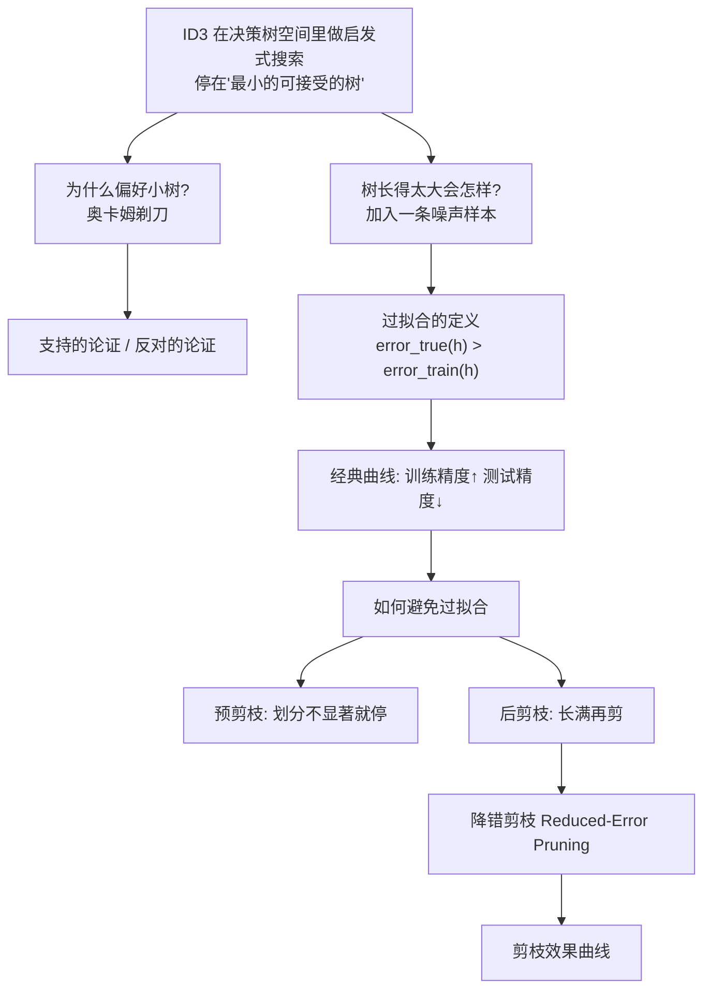
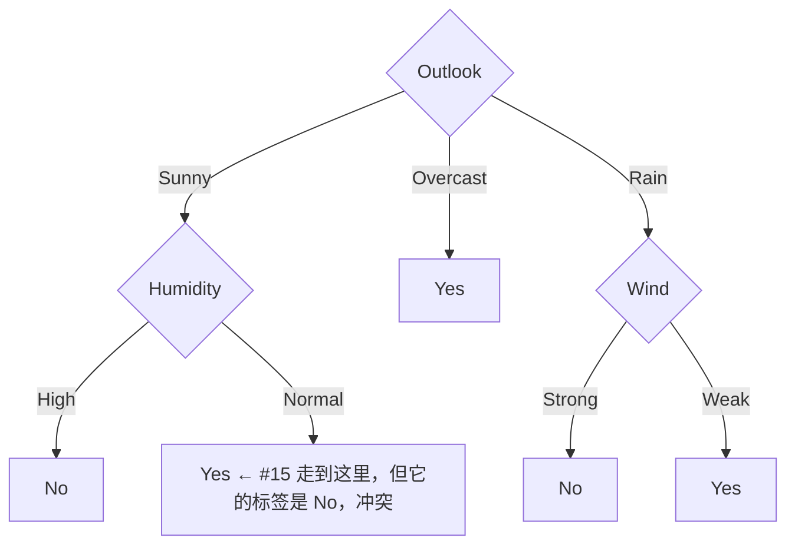

# C1.4 过拟合与剪枝

> [!info] 标注说明
> 标有 **（拓展）** 或 **【拓展】** 的内容，是**课堂上没有展开讲、由课件和教材延伸补充**的部分。
> 复习时可先掌握未标注的主干内容，行有余力再看拓展部分。

---

## 1. 该输出哪一棵树？Which Tree Should We Output?

![[C1.4-ID3假设空间搜索-图示.png]]

> [!important] 两条结论
> - **ID3 在决策树空间中做启发式搜索 heuristic search**
> - **它停在"最小的可接受的树 smallest acceptable tree"。为什么？**
>
> > **奥卡姆剃刀 Occam's razor：在能拟合数据的假设中，优先选最简单的那个。**

> [!note] 这张图在画什么
> 图里每个小图标都是**一棵候选决策树**，箭头表示"再加一个划分结点"。
> - 最上面是只有一层的树；往下每层是在上一层的某个叶子上再展开一个属性（A1、A2、A3、A4…）。
> - 分叉的三条箭头表示"这一步有多个属性可选"，**粗箭头是 ID3 实际走的那条路**——每一步靠信息增益选一个属性，选了就不回头。
> - 省略号表示这个空间**极其巨大**，ID3 只沿着一条细线往下走。
>
> 所以"学习"在这里被具体化成了 [[C1.1 机器学习概述与课程导航]] 里说的**在假设空间 $H$ 中搜索**：$H$ = 所有决策树，搜索策略 = 贪心地按信息增益往下长。

> [!warning] 树可以长得多深
> 如果特征只有 10 个，树可能长到 8 层；特征上百个时，树能长到十几层。**总能长到把训练集切干净为止**——这正是需要奥卡姆剃刀和剪枝的原因。

---

## 2. 为什么偏好短的假设？Occam's Razor

课件难得地**把正反两方都摆出来**：

> [!important] 支持的论证 Argument in favor
> - 短假设**比**长假设**少**；
> - ⟹ 一个短假设居然能拟合数据，**不太可能只是统计上的巧合**。

> [!warning] 反对的论证 Argument opposed（拓展）
> **【拓展】** 这一页课堂上没有展开，但论证很锋利，值得看懂：
> - "结点数为**质数**、且属性名以字母 **Z** 开头"的假设也很少啊；
> - 那么，"短"到底凭什么比"结点数为质数且属性以 Z 开头"更特殊？
>
> **这个反驳指出：**"备选少 ⟹ 不是巧合"这个论证形式，对任何一个人为定义的稀有集合都成立。所以"偏好简单"并不是逻辑上可推导的真理，而是我们**主动注入的一条偏好——归纳偏置 inductive bias**。
> 后面 [[C1.5 学习理论视角与决策树扩展]] 会给出课件自己的结论：**没有任何归纳偏置的归纳学习是徒劳的 (futile)**。也就是说，我们必须选一条偏置，而"偏好简单"至少有 PAC 泛化界作为数学支撑。

> [!note] 从工程角度看为什么小树更好
> 假设有两棵树都能把训练数据完全拟合，一棵先切特征1、2、3，另一棵结构更啰嗦、分枝更多。**在拟合能力相同时选分枝少的那棵**——它更容易解释、预测更快，而且（下一节会看到）在新数据上通常错得更少。

---

## 3. 决策树中的过拟合：一条噪声样本引发的变形

在 [[C1.2 决策树的表示与自顶向下归纳]] 学出的那棵树上，加入一条**有噪声的训练样本 #15**：

$$\langle \text{Sunny},\ \text{Hot},\ \text{Normal},\ \text{Strong}\rangle,\quad \text{PlayTennis} = \textbf{No}$$

**对原树有什么影响？**

> [!important] 冲突是怎么产生的
> 把 #15 顺着原树走：Outlook = Sunny → 到 Humidity；Humidity = Normal → 叶结点预测 **Yes**。
> 但 #15 的真实标签是 **No**。这个叶子原本是纯的（D9, D11 都是 Yes），现在变成 $[2+,1-]$，**不纯了**。
>
> ID3 的停止条件是"训练样本被完美分类"，所以它**不会就此罢手**，而会在这个叶子下面**继续加一层划分**（比如再测 Wind 或 Temperature），把 #15 单独切出去。

> [!warning] 树被一条错误数据"带偏"了
> 新长出来的那一层，**唯一的存在理由就是伺候这一条噪声样本**。
> 它在训练集上让准确率变得更高（从 14/15 到 15/15），但它编码的不是真实规律——真实世界里"晴天、湿度正常"就是适合打球的。**未来遇到同类的天气，这一层只会让你预测错。**
> 这就是**过拟合 overfitting**。

> [!note] 过拟合的两个来源
> 1. **数据有噪声**：标注错误、测量误差、极端个例。
> 2. **模型太复杂**：特征太多、树太深、参数太多，模型有余力去"记住"每一条训练样本而不是提炼规律。

---

## 4. 过拟合的形式定义

> [!important] Overfitting 定义
> 考虑一个假设 $h$ 及其
> - 在**训练数据**上的错误率：$error_{train}(h)$
> - 在**全体数据**上的真实错误率：$error_{true}(h)$
>
> 若
> $$error_{true}(h) > error_{train}(h)$$
> 则称 $h$ **过拟合**了训练数据。
>
> **过拟合的量 Amount of overfitting** $= error_{true}(h) - error_{train}(h)$

> [!warning] 别只盯着"训练误差小"
> 训练误差小**本身不是好事**。要看的永远是这个**差距 (gap)**：
> - 训练误差 .05、真实误差 .07 → 差距小，模型学到了真规律。
> - 训练误差 **.00**、真实误差 .30 → 差距巨大，模型把训练集背下来了，换一批数据立刻失效。
>
> 我们想要的是**训练误差与测试误差接近**（回忆 [[C1.1 机器学习概述与课程导航]] 里剖宫产的 .63 / .60）。

> [!note] $error_{true}$ 是拿不到的（拓展）
> **【拓展】** "全体数据上的错误率"是理论量——你永远见不到全部数据。实践中用**留出的测试集 test set** 上的错误率作为它的无偏估计，所以工程上通常写成 $error_{test}$。本课程后面把数据划分为**训练集 / 验证集 / 测试集**三份，就是为了让这个估计既可用又不被污染。

---

## 5. 过拟合的经典曲线

![[C1.4-过拟合-树规模与精度曲线.png]]

> [!important] 怎么读这张图（考试常考的定性图）
> - **横轴**：树的规模（结点数），从 0 到 100 —— 也就是**模型复杂度**。
> - **纵轴**：准确率 Accuracy（越高越好）。
> - **实线 = 训练集**：随着树变大**单调上升**，从 0.65 一路爬到 0.86 以上。树越大越能背下训练数据，这是必然的。
> - **虚线 = 测试集**：先上升，在**约 10 个结点处见顶（≈0.75）**，之后开始**下降**，到 60 个结点后掉到 0.68 左右并趋平。
>
> **两条线之间的缝隙就是过拟合的量，它随树的增大而持续变宽。**

> [!important] 这张图给出的操作性结论
> **最优模型复杂度不在"训练精度最高处"，而在测试曲线的峰值处**——本例约 10–25 个结点。再往右长，训练分数还在涨，但你真正关心的性能已经在变差了。
>
> 换句话说：**训练精度是你能看到的指标，测试精度是你真正要的指标，两者在某一点之后开始背道而驰。**

---

## 6. 如何避免过拟合 Avoiding Overfitting

> [!important] 两条路线
> - **预剪枝（提前停止）**：当数据划分**在统计上不显著**时就停止生长
>   *stop growing when data split not statistically significant*
> - **后剪枝**：先把树**长满**，再**剪枝**
>   *grow full tree, then post-prune*

> [!note] 预剪枝的直观判据
> 你在某个结点上分枝，一枝只分到 1 条样本、另一枝 2 条——总共才三条数据的划分，**它反映的极可能是偶然而不是规律**。这种时候就不该再切了。
> 常用的具体规则：结点样本数低于阈值就停；信息增益低于阈值就停；用**卡方检验 $\chi^2$** 判断这次划分与随机划分是否有显著差异。

> [!note] 后剪枝的直观做法
> 先让树长满（哪怕过拟合），**然后自底向上砍掉那些"产生坏结果的枝"**——即砍掉之后反而更准的分枝。

> [!warning] 两者的取舍（拓展）
> **【拓展】** 预剪枝快，但有**短视问题**：某个属性单独看增益很小，与下一层属性组合起来却很有效，提前停止就永远发现不了。
> 后剪枝要先长满再剪，计算量大，但因为是在完整树上评估，通常效果更好。**实践中后剪枝是主流。**

---

## 7. 降错剪枝 Reduced-Error Pruning

> [!important] 算法 Reduced-Error Pruning
> 1. 把数据划分为 **训练集 training set** 与 **验证集 validation set**
> 2. 用训练集建出能**完全正确分类训练集**的树
> 3. 循环，直到"继续剪枝反而有害"为止：
>    1. 对**每一个可能被剪掉的结点**（连同它下面的整棵子树），评估剪掉它对**验证集**的影响
>    2. **贪心地**移除那个能**最大提升验证集准确率**的结点
>
> **性质**：产出**最准确子树中规模最小的那一个**（*produces smallest version of most accurate subtree*）
> **遗留问题**：**如果数据本来就不多怎么办？** (*What if data is limited?*)

> [!important] 关键点：为什么必须用验证集
> "剪掉一枝会不会更好"这个问题，**不能用训练集来回答**——剪掉任何一枝，训练集上的准确率只会下降（那棵树本来就是为了拟合训练集而长出来的）。
> 必须拿**一份没参与建树的数据**来问："去掉这一枝，在没见过的数据上是变好了还是变坏了？" 这份数据就是验证集。

> [!note] 三份数据的分工（务必分清）
> | 数据集 | 用途 | 会不会影响模型 |
> |---|---|---|
> | **训练集 training** | 建树、拟合参数 | 直接决定 |
> | **验证集 validation** | 选超参数、决定剪不剪 | 间接决定 |
> | **测试集 test** | 最终报告性能 | **全程不参与，只在最后用一次** |
>
> 拿测试集去调剪枝，就等于把测试集变成了验证集，报出来的性能会偏乐观。

> [!warning] "数据有限怎么办"的答案（拓展）
> **【拓展】** 课件把这个问题留白了。标准答案是：
> - **规则后剪枝 Rule Post-Pruning**（C4.5 采用）：把树转成一条条 `if-then` 规则，对每条规则单独剪条件，不需要单独留验证集；
> - **交叉验证 $k$-fold cross-validation**：把数据轮流当验证集，用 $k$ 次结果的平均来判断——这是数据少时的通用武器。
>
> 这两个方法在后续的学习理论/模型选择部分会正式讲。

### 剪枝的效果

![[C1.4-降错剪枝效果曲线.png]]

> [!important] 三条线的读法
> 与第 5 节同一张底图，多了一条线：
> - **实线**：训练集准确率，随树增大单调上升到 0.86+
> - **虚线（短划）**：**未剪枝**树的测试准确率——约 10 结点见顶 0.75，之后跌到 0.69
> - **点线（细虚）**：**剪枝过程中**的测试准确率——从大树开始往回剪，准确率**一路回升**，最终回到约 0.75 的水平
>
> **结论：剪枝把因过拟合损失的那部分测试性能又赚了回来。** 一棵长满 90 个结点的树，剪回到二三十个结点后，测试准确率与最优规模的树相当，同时保持了完整生长过程中发现的结构。

---

## 本节自测 Self-Test

> [!question] 1. 用一句话陈述过拟合的定义。
> 若 $error_{true}(h) > error_{train}(h)$，则称 $h$ 过拟合训练数据；两者之差即过拟合的量。

> [!question] 2. 加入噪声样本 #15 `<Sunny, Hot, Normal, Strong, No>` 后，原树会发生什么？
> 它被分到"Sunny→Humidity=Normal→Yes"这个原本纯净的叶子，造成冲突；ID3 为了完美分类训练集，会在该叶子下再加一层划分，把它单独切出——这一层只为噪声服务，属于过拟合。

> [!question] 3. 在"树规模—准确率"图上，最优模型复杂度应该取在哪里？
> 取在**测试（验证）曲线的峰值**处，约 10–25 个结点，而不是训练曲线最高处。

> [!question] 4. 降错剪枝为什么必须用验证集而不能用训练集来判断"剪不剪"？
> 因为树是为拟合训练集而生成的，剪任何一枝都会让训练准确率下降，训练集无法区分"剪掉的是噪声还是规律"。

> [!question] 5. 训练集 / 验证集 / 测试集各自的角色是什么？
> 训练集建模型；验证集做模型选择与剪枝决策；测试集只在最后用于报告性能，全程不参与任何决策。

> [!question] 6. 奥卡姆剃刀的反方论证是什么？它说明了什么？
> "结点数为质数且属性以 Z 开头"的假设同样稀少，凭什么"短"更特殊——说明偏好简单不是逻辑必然，而是我们主动引入的**归纳偏置**。

---

上一节：[[C1.3 熵与信息增益]] · 下一节：[[C1.5 学习理论视角与决策树扩展]]
索引：[[机器学习课程 MOC]]
