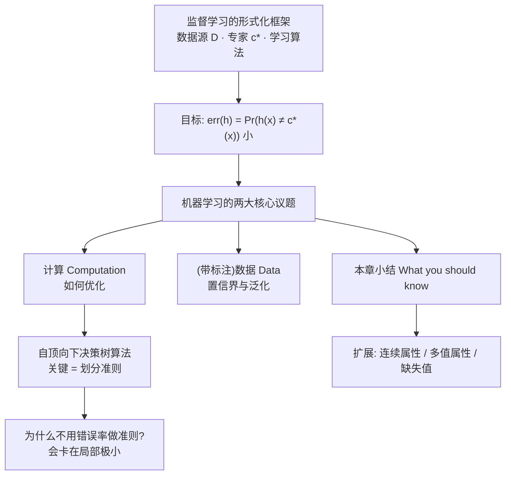
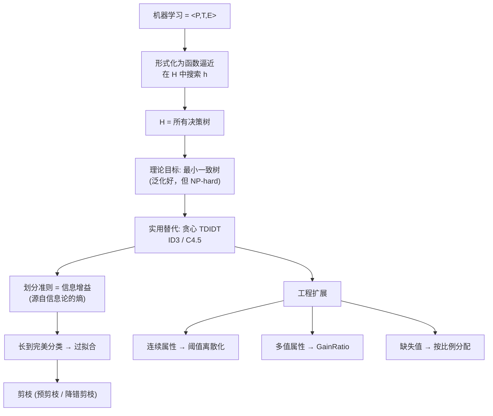

# C1.5 学习理论视角与决策树扩展

> [!info] 标注说明
> 标有 **（拓展）** 或 **【拓展】** 的内容，是**课堂上没有展开讲、由课件和教材延伸补充**的部分。
> 复习时可先掌握未标注的主干内容，行有余力再看拓展部分。

---

## 1. 监督学习的形式化框架

课件用一张流程图把"监督学习到底在干什么"讲全了：

> [!important] 三条关键陈述
> 1. 算法看到的训练样本 $S: (x_1, c^*(x_1)), \dots, (x_m, c^*(x_m))$，其中 $x_i$ **独立同分布地 i.i.d. 抽自分布 $D$**
> 2. 算法在 $S$ 上做**优化 optimization**，找出假设 $h$（例如一棵决策树）
> 3. **目标：$h$ 在分布 $D$ 上的误差要小**
> $$err(h) = \Pr_{x \sim D}\bigl(h(x) \ne c^*(x)\bigr)$$

> [!important] 这张图最重要的是它拆开的那一层
> **数据源产生 $x$，专家给出 $y$——两者是分开的。**
> - $D$ 是**输入的分布**（现实世界里会遇到什么样的病人／什么样的天气）；
> - $c^*$ 是**真实的标注函数**（一位理想的专家永远给出正确答案）；
> - 我们从 $c^*$ 那里买到的只有 $m$ 条答案，而 $c^*$ 本身永远看不到。
>
> **算法只能在 $S$ 上优化，却要在 $D$ 上被评价**——这一句就是整个机器学习的困难所在，也是过拟合（[[C1.4 过拟合与剪枝]]）的根源。

> [!warning] i.i.d. 假设不是废话
> "独立同分布"意味着**训练数据和未来数据来自同一个分布**。一旦违反（用 2015 年的股票数据训练、拿去预测 2026 年的市场），再漂亮的训练指标都不作数。这是所有泛化保证的前提条件。

> [!note] $err(h)$ 就是 0-1 损失（拓展）
> **【拓展】** $\Pr(h(x)\ne c^*(x))$ 即预测错的概率，等价于 **0-1 损失 0-1 loss** 的期望：错记 1 分、对记 0 分，取平均。后面讲回归时会换成平方损失，讲逻辑斯谛回归时会换成对数损失，但"在分布上取期望"这个框架不变。

---

## 2. 机器学习的两大核心议题

> [!important] Two Core Aspects of Machine Learning
> **① 算法设计：如何优化？ Algorithm Design. How to optimize?** —— 关键词 **计算 Computation**
> 　自动生成在**已观测数据**上表现好的规则。
>
> **② 置信界与泛化 Confidence Bounds, Generalization** —— 关键词 **（带标注的）数据 (Labeled) Data**
> 　规则在**未来数据**上有效的置信度。

> [!note] 一句话区分
> ①管"**能不能算出来**"（算力、优化难度）；②管"**算出来能不能信**"（泛化、样本量）。
> 一个机器学习方法要成立，两件事都得过关。

**关于②，课件给出的现状**：
- 已被研究得**很透彻**：**Occam 界 Occam's bound**、**VC 理论 VC theory** 等。
- 对决策树而言：**如果我们能找到一棵能很好解释数据的小决策树，就有很好的泛化保证。**
- 但是——**找最小的一致决策树是 NP-hard 的** `[Hyafil-Rivest'76]`。

> [!important] 这三点串起来就是本章的逻辑闭环
> 1. 理论说：**小树 ⟹ 泛化好**（这正是 [[C1.4 过拟合与剪枝]] 里奥卡姆剃刀的数学依据）；
> 2. 但**求最小树是 NP 难的**，穷举不可行；
> 3. 所以退而求其次，用**贪心启发式**去逼近——**这就是 ID3 存在的理由**。
>
> ID3 不是因为"简单好写"才被采用，而是因为**理论上正确的目标算不动**。

> [!note] 关于①算力（拓展）
> **【拓展】** 很多算法的计算量极大，这正是今天要用 GPU 的原因。所谓 "5B / 20B 模型"指的是 **50 亿 / 200 亿个参数**，每一个参数都要被反复计算和更新——参数规模本身就构成了计算议题。

### 为什么不做穷举搜索？

课件在"Questions to think about (1)"里留了一道思考题：

> [!question] ID3 和 C4.5 是在决策树空间中搜索的**启发式算法**。为什么不干脆做穷举搜索？
> **答**：因为决策树的假设空间随属性个数呈**组合爆炸**。$n$ 个二值属性的不同决策树数量远超指数级；而且如上所述，**找最小一致决策树已被证明是 NP-hard**（Hyafil & Rivest, 1976）。穷举在任何实际规模的问题上都不可行，所以只能用贪心启发式换取可计算性——代价是可能落进局部最优。

---

## 3. 自顶向下决策树算法 Top Down Decision Trees Algorithms

> [!important] 课件的总结
> - 决策树：**若能找到与数据一致的小决策树，就有很好的泛化保证**。但求最小树 **NP-hard** `[Hyafil-Rivest'76]`。
> - 存在**很好用的实用启发式**：自顶向下算法，例如 **ID3**。
> - 这类算法是**自然的贪心方法**：从根到叶生长，反复地把一个已有的叶结点替换为内部结点。
>   - **关键点：划分准则 splitting criterion。**
>   - **ID3：选择使熵下降最多的那个叶结点划分。**
> - **为什么不直接按错误率来划分——毕竟错误率才是我们真正关心的？**
>   - **因为存在会卡在局部极小的例子！**

> [!important] 为什么错误率是个差的划分准则（本节最值得想明白的一点）
> 熵是**严格凹**的，错误率是**分段线性**的。后果是：
> - 一次划分**没有立刻改变多数类**时，**错误率完全不变（增益 = 0）**，而**熵已经下降了**。
> - 于是用错误率做准则的算法会看到"所有属性的增益都是 0"，**无从选择、直接停住**——这就是局部极小。
> - 而熵能察觉到"虽然多数类没变，但两边已经比原来纯了"，于是继续往下走，**再切一层就能拿到真正的收益**。
>
> **一句话：熵对"部分进步"敏感，错误率不敏感。**

> [!note] 一个具体的数字例子（拓展）
> **【拓展】** 设 $S = [40+, 40-]$，错误率 $= 0.5$。某属性把它切成 $[30+, 10-]$ 与 $[10+, 30-]$：
> - **错误率**：两个子结点的多数类分别是正、负，加权错误 $= \frac12(\frac{10}{40}) + \frac12(\frac{10}{40}) = 0.25$，有下降；
> 但若切成 $[25+, 15-]$ 与 $[15+, 25-]$ 呢？加权错误 $=\frac12(\frac{15}{40})\times 2 = 0.375$。
> - 再看一个更极端的：切成 $[40+, 30-]$ 与 $[0+, 10-]$，加权错误 $= \frac{70}{80}\cdot\frac{30}{70} + 0 = 0.375$。
>
> 关键在于，存在这样的构造：**任何单个属性都不能降低错误率（全部增益为 0），但某两个属性连用就能完美分类**。错误率准则在第一步就停了，熵准则则会继续。

### 其他划分准则

除熵之外，另一个常用的是**基尼指数 Gini index**（CART 算法）。两者没有定论谁更好，实际效果接近。详见 [[C1.2 决策树的表示与自顶向下归纳]] 第 7 节。

---

## 4. 本章小结 What You Should Know

> [!important] 课件的官方小结（照抄，逐条要能自己讲一遍）
> **良定义的函数逼近问题：**
> - 实例空间 $X$
> - 带标签的训练数据样本 $\{\langle x^{(i)}, y^{(i)}\rangle\}$
> - 假设空间 $H = \{f : X \to Y\}$
>
> **学习是 $H$ 上的搜索／优化问题：**
> - 目标函数有多种选择
>   - 最小化训练误差（**0-1 损失 0-1 loss**）
>   - 在所有最小化训练误差的假设中，选最小的那个（**?**）
> - **但没有某种偏置的归纳学习是徒劳的！(inductive learning without some bias is futile!)**
>
> **决策树学习：**
> - 决策树的贪心自顶向下学习（**ID3, C4.5, …**）
> - **过拟合与树的后剪枝**
> - 扩展……

> [!warning] 那个孤零零的问号
> 课件在"选最小的那个"后面打了一个 `(?)`——它在提醒你：**"最小"这个附加目标是我们额外加上去的，不是从数据里推出来的。**
> 紧接着的下一行"没有偏置的归纳学习是徒劳的"就是它的答案：
> **仅凭训练数据无法在"所有能拟合数据的假设"中做选择**——它们在训练集上表现完全一样，但在新数据上天差地别。必须由人（或算法设计者）注入一条偏好，这条偏好就叫**归纳偏置 inductive bias**。
> 决策树的归纳偏置就是"偏好短的树、偏好高信息增益的属性靠近根部"。

---

## 5. 决策树的扩展（Extra slides）

课件把这三项放在"Extra slides — extensions to decision tree learning"里，但**每一项都是真实数据上一定会遇到的问题**。

### 5.1 连续值属性 Continuous Valued Attributes

> [!important] 做法：为连续属性造一个离散属性来测试
> - $Temperature = 82.5$（原始连续值）
> - $(Temperature > 72.3) = t, f$（造出来的布尔属性）

课件给的数据：

| Temperature | 40 | 48 | 60 | 72 | 80 | 90 |
|---|---|---|---|---|---|---|
| PlayTennis | No | No | Yes | Yes | Yes | No |

> [!important] 阈值怎么选
> 决策树的内部结点**只能测试离散取值**，所以连续属性必须先切成"桶"。阈值不是随便定的：
> 1. 把样本按该属性**排序**；
> 2. 只在**标签发生变化的相邻两点之间**取候选阈值（取中点）；
> 3. 对每个候选阈值算信息增益，**选增益最大的那个**。
>
> 本例标签在 48→60（No→Yes）与 80→90（Yes→No）之间变化，候选阈值为 $\frac{48+60}{2} = 54$ 和 $\frac{80+90}{2} = 85$。课件里的 72.3 是示意用的任意值。

> [!note] 为什么只看标签变化处（拓展）
> **【拓展】** 可以证明：使信息增益最大的阈值**必定**落在标签发生变化的相邻样本之间。所以只需检查这些位置，把候选从"无穷多"压到"至多 $n-1$ 个"，这是 C4.5 处理连续属性的标准做法。

### 5.2 取值很多的属性 Attributes with Many Values

> [!warning] 问题 Problem
> - 如果一个属性有很多取值，**$Gain$ 会倾向于选中它**
> - 想象把 $Date = Jun\_3\_1996$ 当作属性

> [!important] 为什么会这样
> 极端情况下，"日期"这个属性给每条样本一个**独有的取值**。按它划分后，每个子结点只有一条样本，**熵全部为 0**，于是
> $$Gain(S, Date) = H(S) - 0 = H(S)$$
> 取到了**最大可能值**。信息增益会毫不犹豫地选它。
> 但这棵树**没有任何泛化能力**——遇到一个新日期，它连该走哪个分支都不知道。
>
> **本质：信息增益奖励"分得细"，而分得细本身并不等于分得好。**（回忆 [[C1.3 熵与信息增益]] 里 agegroup 9 个取值 vs. gender 2 个取值的那个陷阱预告。）

> [!important] 一种解决办法：改用增益率 GainRatio
> $$GainRatio(S, A) \equiv \frac{Gain(S, A)}{SplitInformation(S, A)}$$
> $$SplitInformation(S, A) \equiv -\sum_{i=1}^{c} \frac{|S_i|}{|S|}\log_2 \frac{|S_i|}{|S|}$$
> 其中 $S_i$ 是 $S$ 中属性 $A$ 取值为 $v_i$ 的子集。

> [!note] SplitInformation 是什么
> 它是**属性 $A$ 自身取值分布的熵**（注意：与标签 $Y$ 无关！）。
> - 二值均分的属性：$SplitInfo = 1$；
> - $n$ 个取值均分的属性：$SplitInfo = \log_2 n$，取值越多越大。
>
> 拿它当分母，就等于**给"分得太细"罚款**：Date 属性的 $SplitInfo = \log_2 14 \approx 3.81$（14 条样本 14 个取值），增益被大幅稀释。

> [!warning] 增益率自己的坑（拓展）
> **【拓展】** 当某个属性的取值极度集中（比如 $|S_i| \approx |S|$）时，$SplitInformation \to 0$，$GainRatio \to \infty$，反而会选中一个几乎不分割数据的废属性。
> C4.5 的实际做法是**两步走**：先筛掉信息增益低于平均值的属性，再在剩下的里面比增益率。

### 5.3 未知属性值 Unknown Attribute Values

> [!important] 若有些样本缺失属性 $A$ 的取值怎么办？
> **照样使用这条训练样本，把它顺着树往下分拣。** 三种填补策略：
> 1. 若结点 $n$ 测试属性 $A$，就用**分拣到结点 $n$ 的其他样本中 $A$ 的最常见取值**来填；
> 2. 用**分拣到 $n$ 且目标值相同的其他样本中 $A$ 的最常见取值**来填（比 ① 更精细）；
> 3. 为 $A$ 的每个可能取值 $v_i$ 赋一个概率 $p_i$，**把这条样本按比例 $p_i$ 拆开，每个后继结点分到一小份**。
>
> **对新样本的分类采用同样的方式处理。**

> [!note] 三种策略的取舍
> ①最简单，但忽略了标签信息；②用上了标签，估计更准；③是 **C4.5 采用的方案**，信息损失最小——它不做硬性猜测，而是把不确定性一路带下去。
>
> 这正好解释了 [[C1.2 决策树的表示与自顶向下归纳]] 里剖宫产树上出现的 `[201+, 10.6-]`：**样本被拆成了小数份额**。看到小数计数，就说明用了策略 ③。

> [!warning] 别把缺失值直接删掉
> 真实数据里缺失往往很多，逐条删除会损失大量样本；而且**缺失本身可能带信息**（某项检查没做，可能正说明医生认为没必要做）。

---

## 6. 本章知识地图

---

## 本节自测 Self-Test

> [!question] 1. 写出监督学习的目标 $err(h)$，并说明它为什么无法直接优化。
> $err(h) = \Pr_{x\sim D}(h(x)\ne c^*(x))$。无法直接优化是因为 $D$ 和 $c^*$ 都不可见，我们只有 $m$ 条 i.i.d. 抽样，只能在训练集 $S$ 上优化并寄望于泛化。

> [!question] 2. 机器学习的两大核心议题分别是什么？
> ①算法设计 / 计算：如何在已观测数据上高效优化；②置信界 / 泛化：规则在未来数据上有效的置信度。

> [!question] 3. 既然"小树泛化好"，为什么不直接去找最小的树？
> 找最小一致决策树是 NP-hard（Hyafil-Rivest, 1976），假设空间组合爆炸，穷举不可行，只能用贪心启发式逼近。

> [!question] 4. 为什么不用错误率而用熵做划分准则？
> 错误率是分段线性的，对"多数类未改变但纯度已提升"的划分给出 0 增益，容易在所有属性增益都为 0 时卡死在局部极小；熵是严格凹的，能察觉这种部分进步。

> [!question] 5. 用 `Date` 当属性会发生什么？$GainRatio$ 如何修正？
> 每条样本一个独有取值 ⟹ 子结点全纯 ⟹ $Gain = H(S)$ 最大，但毫无泛化能力。$GainRatio = Gain / SplitInformation$，用属性自身取值分布的熵作分母，惩罚取值过多的属性。

> [!question] 6. 连续属性 Temperature 的候选阈值应该在哪里找？
> 按值排序后，只在**标签发生变化的相邻样本之间**取中点作为候选，逐个算信息增益取最大者。

> [!question] 7. 剖宫产树上的 `[201+, 10.6-]` 里的小数是怎么来的？
> 缺失值处理策略③：把属性值缺失的样本按概率 $p_i$ 拆成小数份额分配到各后继结点。

> [!question] 8. "没有偏置的归纳学习是徒劳的"是什么意思？决策树的归纳偏置是什么？
> 在训练集上表现相同的多个假设无法靠数据本身区分，必须由设计者注入偏好。决策树的偏置是：偏好短的树，偏好把高信息增益的属性放在靠近根的位置。

---

上一节：[[C1.4 过拟合与剪枝]] · 下一节：（下一讲：概率与估计）
索引：[[机器学习课程 MOC]]
