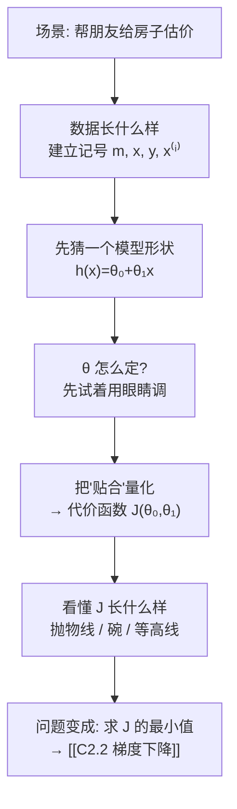
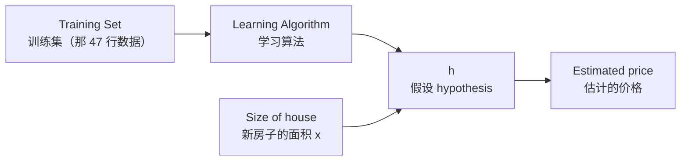

# C2.1 单变量线性回归与代价函数

> [!abstract] 这一讲的任务
> 上一章我们学会了让机器回答"**是 / 否**"（打不打球）。这一讲开始，我们要让它回答"**多少**"——一套房子值多少钱。
>
> 这个转变会逼着我们换掉整套工具：假设不再是一棵树，而是一个公式；学习不再靠"挑属性"，而是靠**优化**。这一讲要做的，就是把"什么叫拟合得好"这句人话，翻译成一个**能求最小值的数学函数**。

> [!info] 怎么读这份讲义
> 这份讲义按**上课的顺序**写：先给问题，再给尝试，再给概念。**建议顺着读，不要跳到公式**——公式的每一步都是被前面的问题逼出来的，跳过去看就变成死记了。
> 标有 **（拓展）** 或 **【拓展】** 的内容是课件之外的延伸，第一遍可以先跳过。

---

## 0. 开场：一个你真的会遇到的问题

你朋友家在 Portland 有套房子要卖，问你："**你不是学 AI 的吗，帮我看看这房子能卖多少钱？**"

你手上有什么？你能从当地房产网站上扒下来最近成交的几十套房子，每一套都知道两件事：**面积多大**、**最后卖了多少钱**。

你朋友家的房子是 **1250 平方英尺**。这个面积恰好在你的数据里**没有出现过**——没有任何一套成交房正好是 1250。

> [!question] 停一下，先自己想想
> **你会怎么估这个价？**
>
> 大多数人的第一反应是对的：**把已有的数据点画在图上，看看趋势，然后顺着趋势读出 1250 对应的价格。**

我们就照这个思路做一遍。把每套房子画成一个点，横轴是面积，纵轴是价格：

![[C2.1-房价数据与拟合直线-课件标注.png]]

图上每个 `×` 是一套已成交的房子。你会看到一个明显的趋势：**面积越大，价格越高**，虽然点很散，但整体是往右上方走的。

于是你顺手画一条穿过点群中间的线（图中粉色那条），然后：从横轴 **1250** 往上走，碰到直线，再往左读——**大约 220k 美元**（图上绿色的标注就是这个过程）。

**你刚才做的，就是一次完整的机器学习。** 接下来这一整讲，我们要做的只有一件事：**把"随手画一条线"这个动作，变成计算机能自动完成的步骤。**

> [!important] 这个问题的两个定性（术语在这里出现）
> 课件在这张图下面写了两行字，正是给这个问题定性的：
>
> **① 监督学习 Supervised Learning**
> > Given the "right answer" for each example in the data.
> > （数据中每个样例都给了"正确答案"）
>
> 你的每一套成交房都带着**真实成交价**——这就是"正确答案"。有答案可对照，才叫"有监督"。
>
> **② 回归问题 Regression Problem**
> > Predict real-valued output.
> > （预测实数值输出）
>
> 课件旁边还手写补了一句对照：
> > **Classification: Discrete-valued output.**
> > （分类：离散值输出）

> [!note] 怎么一眼分清回归和分类
> 问自己一句话：**"预测得接不接近"这件事有没有意义？**
>
> - 房价真值 220k，你预测 218k ⟹ **很接近，几乎算对**。预测 500k ⟹ **差得离谱**。
>   **误差有大小之分 ⟹ 回归。**
> - 一张图片是猫，你预测"狗"和预测"飞机"⟹ **都只是错了**，没有谁更接近。
>   **只有对/错 ⟹ 分类。**
>
> 上一章的 PlayTennis（打/不打）是分类，本章的房价是回归。**这一讲之后，[[C2.5 逻辑回归]] 我们会再回到分类。**

---

## 1. 先把话说清楚：数据和记号

要让计算机做这件事，第一步是**把数据和问题用符号写下来**。这一节会引入五六个记号，**它们会跟着你走完整个学期**，所以现在花三分钟记住，比以后每次都回来查划算得多。

课件给的训练集片段（真实数据是 47 套房）：

| Size in feet² ($x$) | Price ($) in 1000's ($y$) |
|---|---|
| 2104 | 460 |
| 1416 | 232 |
| 1534 | 315 |
| 852 | 178 |
| … | … |

> [!important] 记号 Notation（全课程通用，务必记牢）
> | 记号 | 含义 | 在这个例子里 |
> |---|---|---|
> | $m$ | **训练样例的个数**（Number of training examples） | 课件手写标注：**$m=47$**（47 套房） |
> | $x$ | **输入变量 / 特征**（"input" variable / features） | 面积 |
> | $y$ | **输出变量 / 目标变量**（"output" variable / "target" variable） | 价格 |
> | $(x,y)$ | **一个训练样例**（one training example） | 一整行，如 (2104, 460) |
> | $(x^{(i)},y^{(i)})$ | **第 $i$ 个训练样例**（$i^{th}$ training example） | 第 $i$ 行 |
>
> 课件手写的具体例子，帮你确认理解对了：
> $$x^{(1)}=2104,\qquad x^{(2)}=1416,\qquad y^{(1)}=460$$

> [!warning] 第一个坑：$x^{(2)}$ 不是 $x$ 的平方
> 上标带**圆括号**表示"第几个样本"，**不是幂次**。
> $x^{(2)}=1416$ 是第 2 套房的面积；如果真要表示平方，会写成 $x^2$（没有括号）。
>
> 这个括号看起来多此一举，但到了 [[C2.3 多变量线性回归与梯度下降实践]] 你会庆幸有它——那里会同时出现上标和下标：$x_3^{(2)}$ 表示"第 2 个样本的第 3 个特征"。**上标数样本、下标数特征**，现在就把这个习惯建立起来。

有了记号，我们可以把整个流程画出来了。课件的框图是这样的：

课件在这张图上手写了三处补充，每一处都值得看：

- $x$ ⟶ 输入是**面积**
- $h$ ⟶ **hypothesis 假设**，并写了一句话解释它是什么：**"$h$ maps from $x$'s to $y$'s"（$h$ 把 $x$ 映射到 $y$）**
- 输出 ⟶ **estimated value（估计值）**，不是真值

> [!note] "hypothesis（假设）"这个词，别被它骗了
> 它跟日常说的"猜测"关系不大。回想 [[C1.1 机器学习概述与课程导航]] 里的函数逼近框架：
> - 真实规律 $f$ 我们永远看不到；
> - 我们准备了一堆候选函数，这个集合叫**假设空间 $H$**；
> - 从里面挑出的那一个具体函数，就叫**假设 $h$**。
>
> **你完全可以在心里把 "hypothesis" 读成 "model（模型）"**，意思一样。这个词是历史遗留，现代论文里更多直接写 $f_\theta(x)$ 或 $\hat y$。

---

## 2. 挑一个模型的"形状"

现在到了第一个真正的决策点：**$h$ 应该长什么样？**

你刚才在图上随手画的是**一条直线**。为什么是直线，不是曲线、不是折线？

先接受这个选择，我们把它写下来：

> [!important] 单变量线性回归 Univariate Linear Regression
> $$h_\theta(x)=\theta_0+\theta_1x$$
> 课件手写补充：**Shorthand: $h(x)$**（$h_\theta(x)$ 可以简写成 $h(x)$）。
>
> - $\theta_0$：**截距 intercept**——直线在纵轴上的位置
> - $\theta_1$：**斜率 slope**——面积每增加 1，价格增加多少
>
> 因为只有**一个**输入变量 $x$，所以叫 **linear regression with one variable**，也叫 **univariate linear regression（单变量线性回归）**。

> [!question] 课堂追问：为什么一上来就假定是直线？现实房价明明不是直线
> 三个理由，从最实用到最深刻：
>
> **① 它是能表达"越大越贵"的最简单模型。**
> 建模的通用策略永远是**从最简单的可用模型开始**——先看它能做到什么程度，不够再加复杂度。一上来就上复杂模型，你连"哪部分是模型带来的、哪部分是数据带来的"都分不清。
>
> **② 它其实不只能拟合直线。**
> 这是个会让你意外的点：到 [[C2.4 多项式回归与正规方程]] 你会看到，只要把 $x^2$、$\sqrt{x}$ 当成**新的特征**喂进去，同一套线性回归就能拟合曲线。
> **"线性"指的是对参数 $\theta$ 线性，不是对 $x$ 线性。** 这句话现在记不住没关系，第 4 讲会专门回来讲。
>
> **③ 它是所有复杂模型的基础零件。**
> 神经网络的每一个神经元，干的事情就是"**线性组合 + 一个非线性函数**"。你现在学的这个 $\theta_0+\theta_1x$，就是那个"线性组合"。**学会它，等于学会了深度学习最底层的那块砖。**

**换不同的 $\theta$，直线会怎么变？** 课件给了三个例子，你可以对着心算一下：

| $\theta_0$ | $\theta_1$ | $h_\theta(x)$ | 图像 |
|---|---|---|---|
| 1.5 | 0 | $h(x)=1.5$ | **水平线**——斜率为 0，价格与面积无关 |
| 0 | 0.5 | $h(x)=0.5x$ | 过**原点**、斜率 0.5 |
| 1 | 0.5 | $h(x)=1+0.5x$ | 斜率还是 0.5，但整体**抬高了 1** |

> [!important] 于是问题被压缩成了一句话
> $\theta_0,\theta_1$ 称为模型的**参数 parameters**（有时也叫**权重 weights**）。
>
> **模型的"形状"已经定了（直线），剩下的全部自由度就是这两个数字。**
> ⟹ **学习 = 确定这两个数字。**
> ⟹ 课件的原话：**How to choose $\theta_i$'s ?（怎么选参数？）**
>
> 这就是这一讲剩下所有内容要回答的问题。

---

## 3. 把"贴合"变成一个数字

### 3.1 先想清楚我们到底想要什么

你刚才在图上画线的时候，脑子里的判据是什么？

大概是"**让这条线尽量贴着那些点**"。课件把这句话写成：

> [!important] Idea
> **Choose $\theta_0,\theta_1$ so that $h_\theta(x)$ is close to $y$ for our training examples $(x,y)$**
> （选择 $\theta_0,\theta_1$，使得对训练样例，$h_\theta(x)$ 尽可能接近 $y$）

**但"尽量贴着"是感觉，不是数字。** 计算机没法执行"感觉"。我们必须把它变成一个可计算的量。下面我们一步一步来做这件事——**这四步是本讲的核心，请跟着推**。

### 3.2 四步造出代价函数

**第一步：单个样本，错了多少？**

拿第 $i$ 套房子。模型说它值 $h_\theta(x^{(i)})$，实际卖了 $y^{(i)}$。差距就是

$$h_\theta(x^{(i)}) - y^{(i)}$$

这个量有个名字：**残差 residual**。它**可正可负**——预测高了是正，低了是负。

**第二步：把所有样本的误差加起来？——先别急，这里有个陷阱。**

> [!question] 直接把 $m$ 个残差加起来行不行？
> **不行。** 假设有两套房，一套预测高了 10 万，另一套预测低了 10 万：
> $$(+10)+(-10)=0$$
> **加起来是 0，看起来"完美"，实际上两套都错得离谱。**
>
> 正负会互相抵消——这是所有"误差求和"都要先解决的问题。

**解决办法：取平方。**

$$\big(h_\theta(x^{(i)}) - y^{(i)}\big)^2$$

平方之后一定非负，不会抵消了。而且还白赚了一个好处：**大误差被放得更大**（差 10 万的惩罚是差 5 万的 **4 倍**），模型会优先去修那些离谱的预测。

**第三步：求和并平均。**

$$\frac{1}{m}\sum_{i=1}^{m}\big(h_\theta(x^{(i)}) - y^{(i)}\big)^2$$

除以 $m$ 是为了**取平均**——这样 100 个样本和 1000 个样本算出来的数**可以直接比较**，不会因为样本多就显得"误差大"。

**第四步：再除以 2。**

$$\frac{1}{2m}\sum_{i=1}^{m}\big(h_\theta(x^{(i)}) - y^{(i)}\big)^2$$

这一步看起来莫名其妙——**先记着，第 3.4 节专门解释它**。

> [!important] 代价函数 Cost Function（考点，必须能默写）
> $$\boxed{\;J(\theta_0,\theta_1) = \frac{1}{2m}\sum_{i=1}^{m}\big(h_\theta(x^{(i)}) - y^{(i)}\big)^2\;}$$
> 其中 $h_\theta(x^{(i)})=\theta_0+\theta_1x^{(i)}$。
>
> **目标 Goal：**
> $$\operatorname*{minimize}_{\theta_0,\ \theta_1} \; J(\theta_0,\theta_1)$$
>
> 课件手写标注了它的两个名字：**Cost function（代价函数）**、**Squared error function（平方误差函数）**。它是回归问题最常用的代价函数。

### 3.3 回头看：我们刚才干了什么

**停一下，这一步的意义比公式本身大得多。**

我们把"这条线画得好不好"这个**视觉判断**，变成了 $J(\theta_0,\theta_1)$ 这个**数字**。
于是"找最好的直线"这个模糊任务，变成了 **"求一个函数的最小值"** 这个**纯数学问题**。

> [!important] 这就是本章开头说的范式转变
> | | 第 1 章 决策树 | 第 2 章 线性回归 |
> |---|---|---|
> | 假设 $h$ | 一棵 if-then 树 | 一个带参数的公式 |
> | 假设空间 $H$ | 所有可能的树（离散、组合式） | 所有 $(\theta_0,\theta_1)$ 取值（**连续**） |
> | 怎么找 $h$ | **搜索**：贪心地挑属性（[[C1.2 决策树的表示与自顶向下归纳]]） | **优化**：定义 $J$，求它的最小值 |
> | 数学工具 | 信息论（熵） | 微积分 + 线性代数 |
>
> **"定义模型 → 定义损失 → 最小化损失"这三步，是从这里一直到深度学习的通用套路。** 你现在看到的是它最简单的一个实例。

### 3.4 逐符号拆解，外加那个 2 的真相

> [!note] 每一部分在干什么
> $$J(\theta_0,\theta_1) = \underbrace{\frac{1}{2m}}_{④}\underbrace{\sum_{i=1}^{m}}_{③}\big(\underbrace{h_\theta(x^{(i)})}_{①} - \underbrace{y^{(i)}}_{②}\big)^2$$
> - **① 模型的预测**：把第 $i$ 套房的面积代进直线
> - **② 真实答案**：这套房实际卖了多少
> - **①−② 再平方**：残差，平方后消除正负抵消、放大大误差
> - **③ 求和**：遍历全部 $m$ 个样本
> - **④ $\frac{1}{2m}$**：$\frac1m$ 取平均；那个 2 见下

> [!question] 课堂追问：分母为什么是 $2m$ 而不是 $m$？那个 2 哪来的
> **这是本讲最常被问、也最容易被糊弄过去的一个点。**
>
> **答案：纯粹是为了后面求导好看。**
>
> 下一讲要对 $J$ 求导。而平方项求导会**掉下来一个因子 2**：
> $$\frac{\partial}{\partial\theta}\big(h_\theta(x)-y\big)^2 = 2\big(h_\theta(x)-y\big)\cdot\frac{\partial h_\theta(x)}{\partial\theta}$$
> 如果分母写成 $2m$，这个 2 **正好被约掉**，梯度公式变成干干净净的
> $$\frac{\partial J}{\partial\theta_0}=\frac{1}{m}\sum\big(h_\theta(x^{(i)})-y^{(i)}\big)$$
> 而不是拖着一个碍眼的 $\frac{2}{m}$。（完整推导见 [[C2.2 梯度下降]] 第 6 节。）
>
> **但真正要理解的是这一点：**
> **给 $J$ 乘上任何正常数，都不改变它在哪里取到最小值。**
> 也就是说 $\frac{1}{2m}$、$\frac{1}{m}$、甚至干脆不除，**算出来的最优 $\theta$ 完全一样**，只是 $J$ 的数值不同。
> 既然怎么写都不影响答案，那当然选个让后面公式最好看的写法。**这个 2 是"免费的方便"。**

> [!warning] 第二个坑（也是本讲最大的坑）：$J$ 是谁的函数？
> **$J$ 是 $\theta$ 的函数，不是 $x$ 的函数。**
>
> 课件从这里开始，每一页都在强调同一个对照，你会看到它反复出现：
> - $h_\theta(x)$：**for fixed $\theta_1$, this is a function of $x$**（固定参数，看它随 $x$ 怎么变）
> - $J(\theta_1)$：**function of the parameter $\theta_1$**（看代价随参数怎么变）
>
> **训练数据 $x^{(i)},y^{(i)}$ 在 $J$ 里全都是已知常数**——它们已经给定，不再变化。**唯一的变量是 $\theta$。**
>
> 为什么这是最大的坑：因为课件后面每一页都把这两个函数**画在同一张幻灯片上**，左图横轴是 $x$，右图横轴是 $\theta$。**分不清这两个坐标系，后面所有图都会看不懂。**

> [!note] 平方误差是从哪来的？（拓展）
> **【拓展】** 它不是拍脑袋定的，可以从**极大似然估计 MLE** 推出来——你在概率统计学过这个。
>
> 假设真实关系是 $y=\theta_0+\theta_1x+\varepsilon$，其中噪声 $\varepsilon\sim N(0,\sigma^2)$ 服从正态分布。写出全部数据的似然函数并取对数：
> $$\log L = \text{常数} - \frac{1}{2\sigma^2}\sum_i\big(y^{(i)}-h_\theta(x^{(i)})\big)^2$$
> **最大化对数似然 ⟺ 最小化平方和。**
>
> **所以"用平方误差"等价于"假设噪声是高斯的"。** 这个视角在本课程后面讲概率与估计时会正式展开；到 [[C2.5 逻辑回归]] 你会看到一个完全平行的结论：**对数损失 ⟸ 伯努利分布假设**。

---

## 4. 看懂 $J$ 长什么样（一）：先砍掉一个参数

现在我们有了 $J$，但**它长什么样**？两个参数的函数画出来是个曲面，一上来就看曲面太难。

**教学上的标准做法：先简化，画得出来再说。**

课件的简化很干脆：**令 $\theta_0=0$。**

| | 完整模型 | 简化模型 Simplified |
|---|---|---|
| Hypothesis | $h_\theta(x)=\theta_0+\theta_1x$ | $h_\theta(x)=\theta_1x$ |
| Parameters | $\theta_0,\theta_1$ | **只剩 $\theta_1$** |
| Cost Function | $J(\theta_0,\theta_1)=\frac{1}{2m}\sum(h_\theta(x^{(i)})-y^{(i)})^2$ | $J(\theta_1)=\frac{1}{2m}\sum(h_\theta(x^{(i)})-y^{(i)})^2$ |
| Goal | $\min_{\theta_0,\theta_1}J(\theta_0,\theta_1)$ | $\min_{\theta_1}J(\theta_1)$ |

**几何上，$\theta_0=0$ 意味着直线被钉死在原点上，只能转动，不能上下平移。**

### 4.1 手算三次，把 $J$ 的图画出来

训练集就取三个点：$(1,1),\ (2,2),\ (3,3)$，所以 $m=3$。**这三个点完美地落在 $y=x$ 上**——这是故意设计的，等下你会看到好处。

![[C2.1-代价函数-简化模型J曲线.png]]

**左图**是不同 $\theta_1$ 对应的直线，**右图**是算出来的 $J(\theta_1)$。我们一个一个算。

> [!example] 试 $\theta_1=1$
> $h(x)=x$。预测值：$h(1)=1,\ h(2)=2,\ h(3)=3$。真值：$1,2,3$。
> **三个点全在线上，一个都没错：**
> $$J(1)=\frac{1}{2\times3}\big[(1-1)^2+(2-2)^2+(3-3)^2\big]=\frac{1}{6}\times 0=\mathbf{0}$$
> **代价 0 = 完美拟合。** 在右图上，这是横轴 $\theta_1=1$ 处、贴着地面的那个点。

> [!example] 试 $\theta_1=0.5$
> $h(x)=0.5x$。预测值：$0.5,\ 1,\ 1.5$。真值：$1,\ 2,\ 3$。三个都低了。
> $$J(0.5)=\frac{1}{6}\big[(0.5-1)^2+(1-2)^2+(1.5-3)^2\big]=\frac{1}{6}(0.25+1+2.25)=\frac{3.5}{6}\approx\mathbf{0.58}$$
> 课件手写的正是 $\frac{3.5}{6}\approx 0.58$。左图上你能看到三条蓝色的竖线，就是这三个残差。

> [!example] 试 $\theta_1=0$
> $h(x)=0$，预测全是 0，等于说"这房子不值钱"。
> $$J(0)=\frac{1}{6}\big[1^2+2^2+3^2\big]=\frac{1+4+9}{6}=\frac{14}{6}\approx\mathbf{2.3}$$
> 课件手写：$\frac16\cdot14\approx2.3$。**离最优越远，代价越高**——这正是代价函数该有的行为。

课件还在右图上标了 $\theta_1=-0.5$ 处，$J\approx 5.25$（斜率是负的，直线往下走，错得更离谱）。

> [!note] 【拓展】 这个例子的 $J$ 有解析式，可以一次性验证
> $$J(\theta_1)=\frac{1}{6}\big[(\theta_1-1)^2+(2\theta_1-2)^2+(3\theta_1-3)^2\big]=\frac{1+4+9}{6}(\theta_1-1)^2=\frac{7}{3}(\theta_1-1)^2$$
> 代进去核对：$J(0)=\frac73=2.33$ ✓、$J(0.5)=\frac73\times0.25=0.583$ ✓、$J(1)=0$ ✓
> **这是一条标准抛物线**，顶点在 $\theta_1=1$，开口向上。

### 4.2 这张图告诉我们三件事

> [!important] 请确认你看懂了这三点，再往下读
> 1. **左图一条线 ⟷ 右图一个点。** 每选一个 $\theta_1$，左边就得到一条具体的直线，右边就得到一个具体的代价值。
> 2. **$J(\theta_1)$ 是一条开口向上的抛物线，只有一个最低点。**
> 3. **最低点 $\theta_1=1$ 就是最优参数。**
>
> ⟹ 于是 **"找最贴合数据的直线"这个几何问题，和 "求 $\min_{\theta_1}J(\theta_1)$" 这个数学问题，是同一个问题。**
>
> 这就是我们做代价函数的全部目的。

---

## 5. 看懂 $J$ 长什么样（二）：放开第二个参数

现在把 $\theta_0$ 放开，回到真实的两参数情形。$J$ 从**曲线**变成**曲面**。

课件先用一个"坏模型"热身：对真实房价数据取 $\theta_0=50,\ \theta_1=0.06$，即

$$h_\theta(x)=50+0.06x$$

画出来这条线明显在数据点群的**下方**——大部分房子的真实价格都比它预测的高。**代价当然很大。**

### 5.1 两种画法，同一个函数

![[C2.1-代价函数-三维碗状与等高线.png]]

> [!important] 左：三维曲面图；右：等高线图
> **左边（surface plot 曲面图）：** 平面上两个方向是 $\theta_0$ 和 $\theta_1$，**高度是 $J$**。形状是一个**碗（bowl-shaped）**。碗底就是最优参数。
>
> **右边（contour plot 等高线图，课件手写的两个叫法：Contour plots / Contour figures）：** 就是**从正上方俯视这个碗**，把高度相同的点连成一圈。

> [!note] 等高线怎么读——这是必须过的一关
> 完全就是地理课上的等高线地图，只是这里是"谷"不是"山"：
> - **一圈 = 一条等代价线**：圈上所有的 $(\theta_0,\theta_1)$ 组合，$J$ 值**完全相同**。
> - **越往里，$J$ 越小**；**最中心那个点 = 最小值**。
> - **圈挨得越密 = 那个方向上 $J$ 变化越陡**。
>
> 之所以要学会读它，是因为**三维图没法叠加轨迹**，而等高线图可以——下一讲要在上面画梯度下降走过的路径。

### 5.2 课件的四个演示点

课件连着放了四张图，每张都是**左边一条拟合直线，右边一个等高线上的点**。跟着看一遍，你会建立起最重要的那个直觉：

| # | 参数 | 左图：直线的样子 | 右图：点的位置 | 拟合 |
|---|---|---|---|---|
| 1 | $\theta_0\approx800,\ \theta_1\approx-0.15$ | 一条**从左上到右下的线**（房子越大越便宜？） | **远离中心** | 很差 |
| 2 | $\theta_0=360,\ \theta_1=0$ | **水平线** $h(x)=360$（完全不看面积） | 偏离中心 | 差 |
| 3 | $\theta_0\approx500,\ \theta_1\approx-0.05$ | 略微下降 | 靠近了些，仍不在中心 | 仍不好 |
| 4 | 接近中心的一组 | **上升，且穿过数据中间** | **接近中心** | **好** |

> [!important] 这组图要建立的唯一直觉
> **等高线上的点离中心越近 ⟺ 左边那条直线拟合得越好。**
>
> 于是"把直线调好"这个视觉任务，被彻底翻译成了**"在 $(\theta_0,\theta_1)$ 平面上走到等高线中心"**这个几何任务。
>
> **下一讲 [[C2.2 梯度下降]] 要解决的，就是：怎么让计算机自动地走到中心。**

> [!warning] 第三个坑：左右两图里的"一个点"完全不是一回事
> 右图上随手点一个坐标，比如 $(\theta_0,\theta_1)=(360,0)$——它在左图对应的**不是一个点，而是一整条直线** $h(x)=360$。
>
> - **左图一个点 = 一套房子（一个数据样本）**
> - **右图一个点 = 一整个模型（一组参数）**
>
> 这两个坐标系的"点"含义完全不同。**混淆这一点，是初学者看不懂后面所有图的头号原因。**

### 5.3 一个关键的好消息：这个碗一定是碗

> [!note] 【拓展】 线性回归的代价函数是凸函数
> 把 $h_\theta(x^{(i)})=\theta_0+\theta_1x^{(i)}$ 代入展开：
> $$J(\theta_0,\theta_1)=\frac{1}{2m}\sum_i\big(\theta_0+\theta_1x^{(i)}-y^{(i)}\big)^2$$
> 括号里是 $\theta_0,\theta_1$ 的**一次函数**，平方后得到**二次型**，且系数矩阵半正定 ⟹ $J$ 是一个**凸函数 convex function**。
>
> 课件在下一讲的对应页上，手写标注了这个碗的两个词：**"Convex function"** 和 **"Bowl-shaped"**。
>
> **凸函数的关键性质：只有一个极小值，而且它就是全局最小值——不存在"局部极小陷阱"。**
>
> **这个结论价值极大**：它保证了下一讲的梯度下降**从任何地方出发都能找到全局最优**。
> 到 [[C2.5 逻辑回归]] 你会看到，一旦失去凸性会有多麻烦——那里正是因为"平方误差 + sigmoid"会破坏凸性，才不得不换一个代价函数。

---

## 6. 这一讲的三句话

> [!important] 如果只带走三句话
> 1. **回归问题的模型是 $h_\theta(x)=\theta_0+\theta_1x$，学习就是确定 $\theta_0,\theta_1$ 这两个数。**
> 2. **"拟合得好"被量化成代价函数 $J(\theta_0,\theta_1)=\frac{1}{2m}\sum(h_\theta(x^{(i)})-y^{(i)})^2$，于是学习变成了求 $J$ 的最小值。**
> 3. **$J$ 是参数的函数（不是 $x$ 的函数），它是一个凸的"碗"，只有一个最低点。**

| 概念 | 公式 / 要点 |
|---|---|
| 假设函数 hypothesis | $h_\theta(x)=\theta_0+\theta_1x$ |
| 参数 parameters | $\theta_0$（截距）、$\theta_1$（斜率） |
| 代价函数 cost function | $J(\theta_0,\theta_1)=\frac{1}{2m}\sum_{i=1}^m(h_\theta(x^{(i)})-y^{(i)})^2$ |
| 目标 | $\min_{\theta_0,\theta_1}J(\theta_0,\theta_1)$ |
| $m$ | 训练样例个数（课件例子 $m=47$） |
| $x^{(i)},y^{(i)}$ | 第 $i$ 个训练样例的输入 / 输出 |
| 为什么除 $2m$ | 求导时约掉平方带下来的 2；不影响最优解的位置 |
| $J$ 的形状 | 单参数：抛物线；双参数：碗状曲面 / 同心椭圆等高线；**凸，无局部极小** |

> [!note] 下一讲预告
> 我们已经把问题变成了"求 $J$ 的最小值"，但**还没有任何办法真的求出来**——本讲全程靠"眼睛看哪个点靠近中心"。
> 下一讲 [[C2.2 梯度下降]] 给出那个自动化的办法：**从任意一点出发，每次朝下坡最陡的方向挪一小步。**

---

## 7. 本节自测 Self-Test

> [!question] 先自己做，再看答案
> 1. 训练集 $(1,1),(2,2),(3,3)$，简化模型 $h(x)=\theta_1x$。求 $J(2)$。
> 2. 为什么代价函数要对误差取平方？只取绝对值行不行？
> 3. $J(\theta_0,\theta_1)$ 的等高线图上，一个点代表什么？
> 4. 有人把代价函数写成 $\frac{1}{m}\sum(h_\theta(x^{(i)})-y^{(i)})^2$（分母是 $m$）。最优的 $\theta$ 会变吗？
> 5. $m=47$，某组 $\theta$ 下所有预测都恰好等于真值。$J$ 是多少？$J$ 有没有可能是负数？
> 6. "线性回归只能拟合直线"——这句话对吗？
> 7. 用 $\langle P,T,E\rangle$（[[C1.1 机器学习概述与课程导航]]）描述本讲的房价问题。

> [!success]- 参考答案
> 1. $h(x)=2x$，预测 $2,4,6$，真值 $1,2,3$：
>    $$J(2)=\frac{1}{6}\big[(2-1)^2+(4-2)^2+(6-3)^2\big]=\frac{1+4+9}{6}=\frac{14}{6}\approx\mathbf{2.33}$$
>    用解析式核对：$\frac73(2-1)^2=\frac73=2.33$ ✓
> 2. **必须消除正负抵消**：直接求和时 $+10$ 和 $-10$ 会相加为 0，看起来完美实则很糟。
>    绝对值 $|h-y|$ 也能消除抵消，**理论上完全可行**（叫**平均绝对误差 MAE**）。平方的两个优势：① **处处可导**——绝对值在 0 点不可导，会给梯度下降制造麻烦；② **对大误差惩罚更重**，模型优先修离谱的预测。
>    代价是：**平方对离群点 outlier 更敏感**，这也是数据脏时 MAE 反而更稳健的原因。
> 3. **一个完整的模型**（一组参数 $(\theta_0,\theta_1)$，即一条具体的直线），**不是**一个数据样本。同一圈上的所有点代价 $J$ 相同。
> 4. **不会变。** 乘正常数只改变 $J$ 的数值，不改变最小值的位置。变化的是梯度公式会多带一个因子 2（相当于在梯度下降里把学习率放大了一倍）。
> 5. 每一项都是 0 ⟹ $J=\mathbf{0}$。**不可能为负**——它是平方项的和，$J\ge0$ 恒成立，所以 0 就是它能取到的最小值。
> 6. **不对。** "线性"指对**参数 $\theta$** 线性。把 $x^2,\sqrt x,\log x$ 当作新特征输入，同一套线性回归就能拟合曲线（见 [[C2.4 多项式回归与正规方程]]）。
> 7. **$T$（任务）**：输入房屋面积，输出估计价格；**$P$（性能度量）**：预测价与真实价的平均平方误差（即 $J$，或在**没见过的房子**上算的同类指标）；**$E$（经验）**：47 套已成交房屋的（面积，价格）记录。

---

**上一节：** [[C1.5 学习理论视角与决策树扩展]] ｜ **下一节：** [[C2.2 梯度下降]]
**课程索引：** [[机器学习课程 MOC]]
