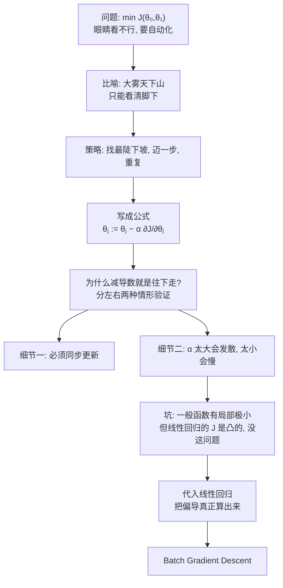

# C2.2 梯度下降

> [!abstract] 这一讲的任务
> 上一讲结束时，我们把问题压缩成了一句话：**求 $J(\theta_0,\theta_1)$ 的最小值。**
> 但我们**一直是靠眼睛看的**——看等高线上哪个点更靠近中心。这显然不能自动化，而且参数一多，图根本画不出来。
>
> 这一讲要给出那个自动化的办法。它的想法朴素到近乎廉价：**站在山上，往脚下最陡的下坡方向迈一步；到了新位置，再迈一步。**
> 但就是这个办法，撑起了今天几乎所有的机器学习模型——**你以后训练的每一个神经网络，用的都是它的变体。**

> [!info] 怎么读这份讲义
> 本讲的顺序是：**先造算法 → 再理解它为什么对 → 再看它什么时候会出问题 → 最后才代入线性回归。**
> 中间会有几处"停一下自己想"，建议真的停一下。标有 **（拓展）** 的部分第一遍可跳过。



---

## 0. 开场：大雾天，你在山上

先不谈数学。

你站在一座山的半山腰，要下到山谷。问题是**起了大雾**，你只能看清**脚下方圆一米**的地面，看不见谷底在哪个方向。

**你会怎么走？**

大多数人给出的策略是一样的：

> 原地转一圈，感觉一下哪个方向**脚下最陡地往下**，朝那个方向**迈一步**。
> 到了新位置，**再转一圈，再迈一步**。重复。

这个策略有个正式名字，叫**梯度下降 Gradient Descent**。它就是这么朴素。

现在把比喻里的每个东西，对应到我们的问题上：

| 比喻 | 数学 |
|---|---|
| 你站的那座山 | 代价函数曲面 $J(\theta_0,\theta_1)$（上一讲那个"碗"） |
| 你当前的位置 | 当前的参数值 $(\theta_0,\theta_1)$ |
| 山谷（最低处） | $J$ 的最小值点，即最优参数 |
| **脚下最陡的下坡方向** | **负梯度方向** $-\frac{\partial J}{\partial\theta}$ |
| **一步迈多大** | **学习率 $\alpha$** |
| 大雾（看不见全局） | 我们确实**不知道** $J$ 的全貌，只能算出当前点的导数 |

课件用一张彩色的三维曲面图演示了这件事：从山顶某点出发，一条黑色的折线一步一步走到蓝色的谷底。

> [!important] 课件给的问题设定
> **Have some function** $J(\theta_0,\theta_1)$
> **Want** $\displaystyle\min_{\theta_0,\theta_1} J(\theta_0,\theta_1)$
>
> 课件手写在旁边做了推广，提醒你这套方法**不限于两个参数**：
> $$J(\theta_0,\theta_1,\theta_2,\dots,\theta_n),\qquad \min_{\theta_0,\dots,\theta_n}J(\theta_0,\dots,\theta_n)$$
>
> **Outline（做法大纲）：**
> - **Start with some $\theta_0,\theta_1$** ——手写补充：**say $\theta_0=0,\ \theta_1=0$**（随便从哪开始，比如都取 0）
> - **Keep changing $\theta_0,\theta_1$ to reduce $J(\theta_0,\theta_1)$ until we hopefully end up at a minimum**
>   （不断改变参数来降低 $J$，直到——**但愿**——停在一个最小值处）

> [!note] 注意 "hopefully（但愿）"这个词
> 课件用这个词是**故意的**：**梯度下降不保证找到全局最小值**，只保证走到**某个**局部最小。
> 大雾天下山的比喻里也一样——你可能滚进一个小水坑就出不来了，而真正的谷底在另一边。
>
> 这个隐患在第 5 节会正面处理。**剧透：对线性回归，这个 "hopefully" 可以放心去掉。**

---

## 1. 把策略写成公式

"朝最陡下坡方向迈一步"，怎么写成数学？

**先看一维的情形**（只有一个参数 $\theta_1$，$J$ 是一条曲线）。"脚下的陡峭程度"就是**导数** $\frac{d J}{d\theta_1}$——这是导数最原始的含义：**斜率**。

于是"迈一步"可以写成：

$$\theta_1 := \theta_1 - \alpha\frac{d}{d\theta_1}J(\theta_1)$$

推广到多个参数，每个参数各走各的，用**偏导数**：

> [!important] 梯度下降算法 Gradient descent algorithm（考点，必须默写）
> $$\text{repeat until convergence \{}$$
> $$\theta_j := \theta_j - \alpha\,\frac{\partial}{\partial\theta_j}J(\theta_0,\theta_1)\qquad (\text{for } j=0 \text{ and } j=1)$$
> $$\text{\}}$$
>
> 课件在这个式子上手写圈出并命名了两个部件：
> - $\alpha$ ⟶ **learning rate（学习率）**
> - $\frac{\partial}{\partial\theta_j}J$ ⟶ **derivative（导数，此处是偏导数）**

### 1.1 逐符号拆解

> [!note] 每个符号在干什么
> | 符号 | 名称 | 作用 |
> |---|---|---|
> | $:=$ | **赋值 assignment** | 编程里的 `=`：把右边算出来的值**存进**左边。**它不是数学等号** |
> | $\alpha$ | **学习率 learning rate** | 一个**正数**，控制**每步迈多大**。典型取值 0.001 ~ 1 |
> | $\frac{\partial}{\partial\theta_j}J$ | **偏导数** | 沿 $\theta_j$ 方向 $J$ **上升**最快的斜率；前面的负号让我们**反着走** |
> | $j$ | 下标 | 第几个参数。单变量时 $j\in\{0,1\}$ |

> [!warning] 一个容易读错的地方：$:=$ 不是等号
> 如果你把 $\theta_j := \theta_j - \alpha\frac{\partial J}{\partial\theta_j}$ 当成数学等式来解，会推出 $\alpha\frac{\partial J}{\partial\theta_j}=0$——**那是错误的读法**。
>
> 正确读法是**编程语句**：「把 $\theta_j$ 减去一点点，结果再存回 $\theta_j$」。就像代码里的 `x = x + 1`，数学上讲不通，编程上完全正常。

> [!note] 前置知识：偏导数（如果多元微积分学得不牢）
> $\frac{\partial}{\partial\theta_j}$ 的含义是：**把其他所有变量当成常数，只对 $\theta_j$ 求导。**
>
> 直觉：你站在山坡上，**只允许沿东西方向走**，此时脚下的坡度就是"对东西方向的偏导数"。同理还有南北方向的偏导数。**把各个方向的偏导数打包成一个向量，就叫梯度 gradient。**
>
> 记号上的小区别：只有一个变量时写 $\frac{d}{d\theta_1}$（课件的简化模型页用的就是这个），多个变量时写 $\frac{\partial}{\partial\theta_j}$。

### 1.2 停一下：为什么"减去导数"就是往下走？

这一步值得单独讲，因为**它是整个算法唯一需要理解的地方**，而课件用两张手绘图讲得非常清楚。

我们分两种情形验证。设想 $J(\theta_1)$ 是一条开口向上的抛物线。

> [!important] 情形一：当前点在最低点的**右边**
> 在这一点画切线，切线是**向右上方倾斜**的 ⟹
> $$\frac{d}{d\theta_1}J(\theta_1)\ \ge\ 0\quad(\text{正数})$$
> 代进更新式：
> $$\theta_1 := \theta_1 - \alpha\cdot(\text{positive number})$$
> $\theta_1$ **变小 ⟹ 向左移动**。
>
> **而最低点就在左边。走对了。** ✅

> [!important] 情形二：当前点在最低点的**左边**
> 切线**向右下方倾斜**（课件手写标注：**negative slope**）⟹
> $$\frac{d}{d\theta_1}J(\theta_1)\ \le\ 0\quad(\text{负数})$$
> 代进更新式：
> $$\theta_1 := \theta_1 - \alpha\cdot(\text{negative number}) = \theta_1 + \alpha|\cdots|$$
> $\theta_1$ **变大 ⟹ 向右移动**。
>
> **而最低点就在右边。也走对了。** ✅

> [!important] 结论
> **不管你站在最低点的哪一边，"减去导数"都会把你推向最低点。**
> 这就是那个负号的全部意义。
>
> 顺便注意：导数在这里同时扮演了两个角色——
> - **符号**告诉你**往哪边走**；
> - **绝对值**告诉你**现在有多陡**（越陡走得越多）。
>
> 第二点在第 3.1 节会带来一个很好的性质。

---

## 2. 第一个细节：同步更新（必考）

到这里算法看起来已经完整了。但有一个实现上的细节，**写错了算法就变成了别的东西**——课件专门用了一整页对比。

> [!warning] 正确 vs 错误
> **✅ Correct: Simultaneous update（同步更新）**
> $$
> \begin{aligned}
> \text{temp0} &:= \theta_0 - \alpha\tfrac{\partial}{\partial\theta_0}J(\theta_0,\theta_1)\\
> \text{temp1} &:= \theta_1 - \alpha\tfrac{\partial}{\partial\theta_1}J(\theta_0,\theta_1)\\
> \theta_0 &:= \text{temp0}\\
> \theta_1 &:= \text{temp1}
> \end{aligned}
> $$
> **先把两个新值都算出来存在临时变量里，最后才一起赋值。**
>
> **❌ Incorrect（错误写法）**
> $$
> \begin{aligned}
> \text{temp0} &:= \theta_0 - \alpha\tfrac{\partial}{\partial\theta_0}J(\theta_0,\theta_1)\\
> \theta_0 &:= \text{temp0}\qquad\qquad \color{red}{\leftarrow\ \text{这里就把 }\theta_0\text{ 改掉了}}\\
> \text{temp1} &:= \theta_1 - \alpha\tfrac{\partial}{\partial\theta_1}J(\theta_0,\theta_1)\quad \color{red}{\leftarrow\ \text{这个 }J\text{ 用的已经是新 }\theta_0}\\
> \theta_1 &:= \text{temp1}
> \end{aligned}
> $$

> [!question] 停一下：错误写法到底错在哪？它看起来也能跑
> 回到下山的比喻。
>
> **正确做法**：站在原地，一次性把"东西方向的坡度"和"南北方向的坡度"都测出来，然后合成一个方向，迈一步。
>
> **错误做法**：先测东西坡度，**朝东走一步**；**站在新位置**再测南北坡度，朝北走一步。
>
> 第二种做法里，两个坡度**不是在同一个位置测的**——合起来**不再是任何一点的梯度**。
>
> 后果：
> - 它**变成了另一个算法**（更接近**坐标下降 coordinate descent**），收敛性质不同。
> - 实践中它**有时也能跑通**，但你不能再用梯度下降的任何理论结论来保证它；遇到病态问题就会出错。
>
> **一句话记住：所有参数的更新量，都必须用"这一轮开始时的那组参数"算出来。**

> [!tip] 写代码时怎么天然避免这个 bug（专业关联）
> 用 NumPy / PyTorch 做**向量化**时，同步是自动的：
> ```python
> grad  = compute_gradient(theta)   # 一次性算出全部分量
> theta = theta - alpha * grad      # 一次性全部更新
> ```
> **反面教材是用 for 循环逐个改 `theta[j]`** ——那就正好写成了错误版本。
> 这是初学者写第一份 ML 代码时**最常见的 bug**，而且它不报错，只是结果慢慢变得不对。

---

## 3. 第二个细节：$\alpha$ 该取多大

$\alpha$ 是**你自己定的数**，算法不会帮你选。选得好不好，直接决定训练成不成功。

![[C2.2-梯度下降-学习率过大过小.png]]

> [!important] 课件的两条结论
> - **If $\alpha$ is too small, gradient descent can be slow.**
>   $\alpha$ 太小 ⟹ 每次挪一丁点，要迭代非常多次才到底（左图：密密麻麻一串小点）。
> - **If $\alpha$ is too large, gradient descent can overshoot the minimum. It may fail to converge, or even diverge.**
>   $\alpha$ 太大 ⟹ **一步跨过了最低点**，落到对面更高的地方；下一步跨得更远……可能**不收敛**，甚至**发散**（右图：越弹越远）。

> [!note] "发散"是怎么发生的？用一个能手算的例子看清楚
> 取最简单的 $J(\theta)=(\theta-1)^2$，导数 $2(\theta-1)$。更新式：
> $$\theta := \theta-\alpha\cdot2(\theta-1)$$
> 两边同时减 1，整理一下：
> $$(\theta-1) := (1-2\alpha)(\theta-1)$$
> **也就是说，每走一步，"离最优点的距离"就乘上一个系数 $(1-2\alpha)$。** 于是：
>
> | $\alpha$ | $\|1-2\alpha\|$ | 行为 |
> |---|---|---|
> | 0.1 | 0.8 | 距离每步缩到 80% ⟹ **稳定收敛** |
> | 0.5 | 0 | **一步到位**（这个例子的理想值） |
> | 0.9 | 0.8 | 收敛，但**每步跨到对面**，来回震荡着靠近 |
> | 1.0 | 1 | **原地弹来弹去，永不收敛** |
> | 1.2 | 1.4 | 距离每步**放大 1.4 倍** ⟹ **发散** |
>
> **看清楚了：$\alpha$ 从 0.9 到 1.2 只差一点点，行为从收敛变成爆炸。** 这就是为什么调 $\alpha$ 这么要紧。
>
> **【拓展】** 一般规律：只要 $\alpha$ 小于某个与 $J$ 曲率（二阶导）有关的阈值就收敛，超过就发散。**曲面越陡，能用的 $\alpha$ 越小。**

### 3.1 一个反直觉但很重要的性质

> [!question] 停一下先想：既然靠近谷底时怕跨过去，是不是应该让 $\alpha$ 随着迭代越来越小？
> 听起来很合理。**但课件说不用。**

> [!important] 课件原话
> > **Gradient descent can converge to a local minimum, even with the learning rate $\alpha$ fixed.**
> > **As we approach a local minimum, gradient descent will automatically take smaller steps. So, no need to decrease $\alpha$ over time.**
>
> **为什么？** 因为**实际步长 = $\alpha\times|\text{导数}|$**，而**越靠近最低点，导数的绝对值越小**（最低点处导数恰好为 0）。
>
> ⟹ 即使 $\alpha$ 一直不变，**实际步长也会自动越来越小**，像松了油门的车一样平稳滑停。
>
> 课件的配图正是这个意思：靠近谷底时，箭头一个比一个短。

> [!warning] 别把这句话记反
> 常见的错误记忆："学习率必须随时间衰减才能收敛。"
> **对普通梯度下降不必**（上面已解释）。
> 需要衰减的是**随机梯度下降 SGD**——因为它的梯度带噪声，末期不衰减会一直在最优点附近乱抖。见第 7 节。

### 3.2 顺带一提：如果一开始就站在谷底

课件还画了一个特殊情形：当前的 $\theta_1$ **恰好落在局部最优点**（$\theta_1$ at local optima）。

此时导数为 0：
$$\theta_1 := \theta_1 - \alpha\cdot 0 = \theta_1$$

**参数纹丝不动，算法停在原地。** 这正是我们要的行为——**已经到底了就别动了**。

---

## 4. 这个算法什么时候会失败

现在算法的机械部分都讲完了。但在把它用到线性回归之前，必须先看清它的**根本局限**——否则你以后训练神经网络时会莫名其妙。

![[C2.2-梯度下降-非凸函数与局部极小.png]]

课件用一张起伏的三维曲面演示：这个曲面上有**两个山谷**。

> [!warning] 起点不同，终点可能完全不同
> - 从**某一点**出发，黑色路径滚进了**左边那个谷**；
> - 从**稍微挪一点的另一点**出发，同样的算法却滚进了**右边那个谷**。
>
> 课件用两个红色箭头分别指向这两个不同的**局部最小值 local minimum**。
>
> **结论：梯度下降只保证走到"某个"局部最小，不保证是全局最小。结果依赖初始值。**

> [!tip] 这和第 1 章的哪个知识点是同一个病
> 回想 [[C1.5 学习理论视角与决策树扩展]]：**ID3 如果用错误率做划分准则，会卡在局部极小。**
>
> **同一个毛病，换了个场合。** 所有**贪心 / 局部搜索**类的算法都有这个共性弱点：**只看眼前最优，可能错过全局最优。**
> 这不是缺陷设计，而是"计算可行"必须付出的代价——[[C1.5 学习理论视角与决策树扩展]] 里说的 NP-hard，就是"全局最优"的价格。

### 4.1 好消息：线性回归没有这个问题

> [!important] 线性回归的 $J$ 是凸函数
> 课件在这里放了一张**平滑的碗状曲面**，并手写标注了两个词：
> - **"Convex function"（凸函数）**
> - **"Bowl-shaped"（碗状）**
>
> **凸函数的关键性质：只有一个极小值，而且它就是全局最小值。**
>
> ⟹ **对线性回归，梯度下降从任何起点出发，都必定收敛到全局最优解。**
> ⟹ 第 0 节那个 "hopefully" 在这里可以放心划掉。

> [!note] 【拓展】 为什么线性回归的 $J$ 一定是凸的
> $$J(\theta)=\frac{1}{2m}\sum_i(\theta_0+\theta_1x^{(i)}-y^{(i)})^2$$
> 括号里是 $\theta$ 的**仿射（一次）函数**；"凸函数 ∘ 仿射映射"仍是凸的，平方是凸函数，凸函数的非负加权和还是凸的 ⟹ $J$ 凸。
>
> 更直接的判据是看 **Hessian 矩阵**（二阶偏导矩阵）：
> $$H=\frac{1}{m}\begin{bmatrix} m & \sum x^{(i)}\\ \sum x^{(i)} & \sum (x^{(i)})^2\end{bmatrix}$$
> 对任意向量 $v$：$v^THv=\frac{1}{m}\sum_i(v_0+v_1x^{(i)})^2\ge0$ ⟹ **半正定** ⟹ $J$ 凸。
>
> **这个性质在 [[C2.5 逻辑回归]] 会再次成为主角**——那里恰恰因为"平方误差 + sigmoid"**会破坏凸性**，才不得不换掉代价函数。

---

## 5. 合体：把梯度下降用到线性回归上

现在把两块拼起来。左边是刚学的算法，右边是上一讲的模型：

| Gradient descent algorithm | Linear Regression Model |
|---|---|
| repeat until convergence $\{$ <br> $\quad\theta_j := \theta_j - \alpha\frac{\partial}{\partial\theta_j}J(\theta_0,\theta_1)$ <br> $\quad$ (for $j=1$ and $j=0$) <br> $\}$ | $h_\theta(x)=\theta_0+\theta_1x$ <br><br> $J(\theta_0,\theta_1)=\frac{1}{2m}\sum_{i=1}^m(h_\theta(x^{(i)})-y^{(i)})^2$ |

**缺的只剩一步：把 $\frac{\partial J}{\partial\theta_j}$ 真的算出来。** 课件直接给了结果，我们把推导补全——**这是本讲唯一需要动笔的地方，值得自己推一遍。**

### 5.1 求 $\frac{\partial J}{\partial\theta_0}$

> [!example] 推导过程
> $$J(\theta_0,\theta_1)=\frac{1}{2m}\sum_{i=1}^m\big(\underbrace{\theta_0+\theta_1x^{(i)}}_{h_\theta(x^{(i)})}-y^{(i)}\big)^2$$
> 对 $\theta_0$ 求偏导。用**链式法则**：外层是平方，内层对 $\theta_0$ 求导得 1。
> $$\frac{\partial J}{\partial\theta_0}=\frac{1}{2m}\sum_{i=1}^m 2\big(h_\theta(x^{(i)})-y^{(i)}\big)\cdot\underbrace{\frac{\partial}{\partial\theta_0}\big(\theta_0+\theta_1x^{(i)}-y^{(i)}\big)}_{=\ 1}$$
> $$\Longrightarrow\quad \boxed{\frac{\partial J}{\partial\theta_0}=\frac{1}{m}\sum_{i=1}^m\big(h_\theta(x^{(i)})-y^{(i)}\big)}$$
>
> **看到那个 2 被 $\frac{1}{2m}$ 里的 2 约掉了吗？** 这就是上一讲埋的伏笔——**分母写 $2m$ 就是为了这一刻。**

### 5.2 求 $\frac{\partial J}{\partial\theta_1}$

> [!example] 推导过程
> 完全一样，只是内层对 $\theta_1$ 求导得到的是 $x^{(i)}$（因为 $\theta_1$ 是乘在 $x^{(i)}$ 上的）：
> $$\frac{\partial J}{\partial\theta_1}=\frac{1}{2m}\sum_{i=1}^m 2\big(h_\theta(x^{(i)})-y^{(i)}\big)\cdot\underbrace{\frac{\partial}{\partial\theta_1}\big(\theta_0+\theta_1x^{(i)}-y^{(i)}\big)}_{=\ x^{(i)}}$$
> $$\Longrightarrow\quad \boxed{\frac{\partial J}{\partial\theta_1}=\frac{1}{m}\sum_{i=1}^m\big(h_\theta(x^{(i)})-y^{(i)}\big)\cdot x^{(i)}}$$

### 5.3 最终算法

> [!important] 线性回归的梯度下降（考点，必须默写）
> $$\text{repeat until convergence \{}$$
> $$\theta_0 := \theta_0 - \alpha\,\frac{1}{m}\sum_{i=1}^m\big(h_\theta(x^{(i)})-y^{(i)}\big)$$
> $$\theta_1 := \theta_1 - \alpha\,\frac{1}{m}\sum_{i=1}^m\big(h_\theta(x^{(i)})-y^{(i)}\big)\cdot x^{(i)}$$
> $$\text{\}}$$
> **update $\theta_0$ and $\theta_1$ simultaneously（两个必须同步更新）**
>
> 课件用蓝框圈住第一个求和并标注 $\frac{\partial}{\partial\theta_0}J$，用粉框圈住第二个并标注 $\frac{\partial}{\partial\theta_1}J$——**提醒你这两坨不是凭空出现的，就是刚才推出来的偏导数。**

> [!warning] 两式唯一的区别，是末尾那个 $x^{(i)}$
> **记忆方法：$\theta_1$ 是"和 $x$ 相乘的那个参数"，所以它的梯度里就多乘一个 $x^{(i)}$。**
>
> 下一讲会给出一个更统一的写法：定义 $x_0^{(i)}=1$，两式就合并成一条
> $$\theta_j := \theta_j-\alpha\frac1m\sum_i(h_\theta(x^{(i)})-y^{(i)})\,x_j^{(i)}$$
> 因为 $j=0$ 时乘的是 $x_0^{(i)}=1$，正好退化成第一式。见 [[C2.3 多变量线性回归与梯度下降实践]]。

### 5.4 跑起来是什么样子

课件用一串连续的图演示了完整的训练过程。**左边是拟合直线，右边是参数在等高线图上的位置**——你现在应该能同时看懂这两张图了（上一讲第 5.2 节练过）。

| 阶段 | 左图（拟合效果） | 右图（等高线上的位置） |
|---|---|---|
| 初始 | $h(x)=-900-0.1x$，**一条严重错误的下降直线** | 在**外围**，远离中心 |
| 迭代中 | 直线逐渐**抬起、转向正斜率** | 红点沿着一条路径**一圈圈向内**移动 |
| 收敛 | 直线**穿过数据中央**，拟合良好 | 红点到达**等高线中心** |

最后课件在拟合好的图上做了一次预测：**面积 1250 feet² 处向上读出价格**——正是开场时你手工做的那件事，现在由算法完成了。

> [!important] 这组图的意义
> 它把三件事对应了起来：
> $$\textbf{参数的一次更新} \;=\; \textbf{等高线上挪一格} \;=\; \textbf{拟合直线转动一点}$$
>
> **你以后训练任何模型，屏幕上发生的都是这个过程。**

---

## 6. 一个名字：Batch Gradient Descent

课件最后单独用一页给这个算法起了个名字。

> [!important] 课件定义
> **"Batch": Each step of gradient descent uses all the training examples.**
> （"批量"：梯度下降的**每一步都用到全部训练样例**。）
>
> 课件手写指出了这个名字的来源，就是更新式里的那个求和号：
> $$\sum_{i=1}^{m}\big(h_\theta(x^{(i)})-y^{(i)}\big)$$
> **$i$ 从 1 加到 $m$——每走一步，都要把所有 $m$ 个样本扫一遍。**

> [!question] 停一下：为什么要专门给它起个名字？
> **因为存在别的做法。** 既然叫"批量"，就暗示着有"非批量"的版本。
>
> 想想 $m$ 很大的情况：训练一个图像模型可能有 **1000 万张图**。按批量梯度下降，**每挪一小步都要把 1000 万张图全过一遍**——一步就要几分钟，而收敛需要几千步。**根本跑不动。**

> [!note] 【拓展】 三种变体（这是你以后天天要用的）
> | 方法 | 每步用多少样本 | 优点 | 缺点 |
> |---|---|---|---|
> | **批量 Batch GD** | 全部 $m$ 个 | 梯度准确，收敛平稳 | $m$ 大时**每步都极慢** |
> | **随机 Stochastic GD (SGD)** | **1 个**（随机抽） | 每步极快；噪声还能帮它**跳出较差的局部极小** | 梯度带噪声，路径抖动，末期需衰减 $\alpha$ |
> | **小批量 Mini-batch GD** | 一小撮（32 / 64 / 256） | **兼顾速度与稳定**，适合 GPU 并行 | 多一个"批大小"要调 |
>
> **专业关联（AI 方向）：** 训练神经网络时**几乎总是用 mini-batch**。你在 PyTorch 里写的
> ```python
> DataLoader(dataset, batch_size=64)
> ```
> 那个 `batch_size` 就是这里的"一小撮"。
>
> 还有一个你一定会遇到的词：**epoch（轮次）**——把全部训练数据完整过一遍叫一个 epoch。
> **这些术语的源头，就是课件这一页。**

---

## 7. 这一讲的三句话

> [!important] 如果只带走三句话
> 1. **梯度下降 = 反复地"朝当前点的最陡下坡方向迈一步"，公式是 $\theta_j := \theta_j - \alpha\frac{\partial J}{\partial\theta_j}$。**
> 2. **两个必须注意的实现细节：所有参数要同步更新；$\alpha$ 太大会发散、太小会慢（但固定的 $\alpha$ 就能收敛）。**
> 3. **一般函数会卡在局部极小，但线性回归的 $J$ 是凸的，所以梯度下降必定找到全局最优。**

| 概念 | 要点 |
|---|---|
| 梯度下降 | $\theta_j := \theta_j - \alpha\frac{\partial}{\partial\theta_j}J(\theta)$ |
| 负号的意义 | 不论在最低点左边还是右边，减去导数都朝最低点移动 |
| $\alpha$ 学习率 | 太小 → 慢；太大 → overshoot、不收敛甚至发散 |
| 固定 $\alpha$ | **也能收敛**：接近最优时导数自动变小 ⟹ 步长自动变小 |
| 同步更新 | 所有 $\theta_j$ 必须用**同一轮的旧参数**算梯度，先全算完再一起赋值 |
| 局部极小 | 一般函数：结果依赖初始点；**线性回归的 $J$ 是凸函数，无此问题** |
| 线性回归梯度 | $\frac{\partial J}{\partial\theta_0}=\frac1m\sum(h-y)$，$\frac{\partial J}{\partial\theta_1}=\frac1m\sum(h-y)x^{(i)}$ |
| Batch GD | 每一步用全部 $m$ 个样本 |

> [!note] 下一讲预告
> 到这里，"用面积预测房价"这件事已经完全解决了。
> 但现实中影响房价的**不止面积**——还有卧室数、楼层、房龄。下一讲 [[C2.3 多变量线性回归与梯度下降实践]] 把模型推广到**任意多个特征**，并处理两个真正上手时才会遇到的工程问题：**特征尺度差太多怎么办、$\alpha$ 到底怎么挑。**

---

## 8. 本节自测 Self-Test

> [!question] 先自己做，再看答案
> 1. 梯度下降更新式里的负号如果去掉，会发生什么？
> 2. 为什么"同步更新"重要？错误写法具体错在哪一步？
> 3. 有人说"梯度下降必须随迭代把 $\alpha$ 调小才能收敛"。对吗？
> 4. $J(\theta)=(\theta-3)^2$，取 $\theta$ 初值 5、$\alpha=0.1$，手算前两次迭代后的 $\theta$。
> 5. 推导 $\frac{\partial J}{\partial\theta_1}$，写出每一步用了什么法则。
> 6. 训练时发现 $J(\theta)$ 一路上升，最可能是什么原因？
> 7. 为什么线性回归不用担心局部极小，而神经网络要担心？
> 8. "Batch" 这个词具体指什么？$m=10^7$ 时它有什么问题？

> [!success]- 参考答案
> 1. 变成**梯度上升 gradient ascent**，沿 $J$ **增大**的方向走，越走越糟，最终发散。（顺带一提：需要最大化目标时确实会用梯度上升，只是通常把目标取负再最小化。）
> 2. 梯度是**在同一个点上**算出来的一组偏导，合起来才代表"这一点的最陡方向"。错误写法在算 $\theta_1$ 的偏导时用了**已更新的 $\theta_0$**，两个分量不属于同一点 ⟹ 合起来不是梯度 ⟹ **它已经不是梯度下降了**（更接近坐标下降）。
> 3. **不对。** 固定 $\alpha$ 就能收敛，因为越靠近最优点导数越小、实际步长自动变小。需要衰减 $\alpha$ 的是**随机梯度下降 SGD**（梯度带噪声）。
> 4. $\frac{dJ}{d\theta}=2(\theta-3)$。
>    - 第 1 次：$\theta=5-0.1\times2(5-3)=5-0.4=\mathbf{4.6}$
>    - 第 2 次：$\theta=4.6-0.1\times2(4.6-3)=4.6-0.32=\mathbf{4.28}$
>    观察：离最优点 3 的距离每次乘以 $1-2\alpha=0.8$（5→4.6→4.28 对应距离 2→1.6→1.28 ✓）。
> 5. $$\frac{\partial J}{\partial\theta_1}=\frac{\partial}{\partial\theta_1}\left[\frac{1}{2m}\sum_i(\theta_0+\theta_1x^{(i)}-y^{(i)})^2\right]$$
>    ① **求导与求和交换**（有限和的线性性）；② 每一项用**链式法则**：外层平方求导得 $2(\cdot)$，内层 $\frac{\partial}{\partial\theta_1}(\theta_0+\theta_1x^{(i)}-y^{(i)})=x^{(i)}$；③ 常数 2 与 $\frac{1}{2m}$ 的 2 约掉。
>    结果：$\frac{1}{m}\sum_i(h_\theta(x^{(i)})-y^{(i)})x^{(i)}$。
> 6. **$\alpha$ 太大**，一步跨过最低点落到对面更高处（overshoot），越弹越远。对策：把 $\alpha$ 除以 3 或 10 再试。次要可能：梯度公式写错、没做同步更新。
> 7. 线性回归的 $J$ 是**凸函数**（碗状），只有一个极小值即全局最小；神经网络的损失**高度非凸**，有大量局部极小和鞍点，结果依赖初始化。
> 8. 指**每一步更新都用全部 $m$ 个训练样本**算梯度（式子里的 $\sum_{i=1}^m$）。
>    $m=10^7$ 时，**挪一小步就要扫一千万个样本**，一步几分钟、收敛要几千步 ⟹ 完全不可行。实践中改用 **mini-batch**（每步几十到几百个样本）。

---

**上一节：** [[C2.1 单变量线性回归与代价函数]] ｜ **下一节：** [[C2.3 多变量线性回归与梯度下降实践]]
**课程索引：** [[机器学习课程 MOC]]
